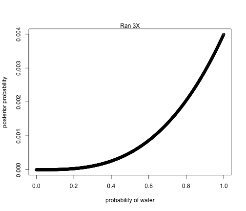
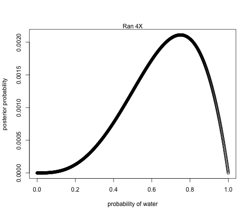
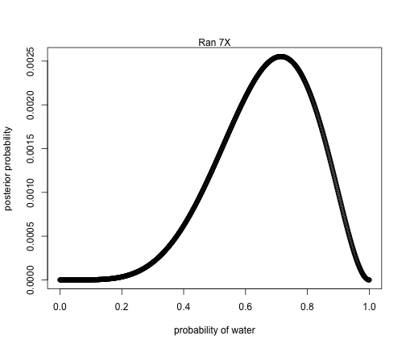
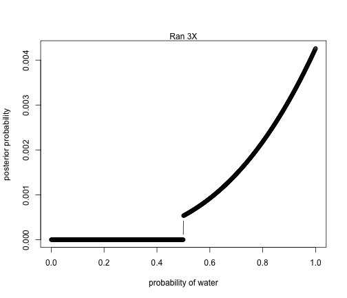
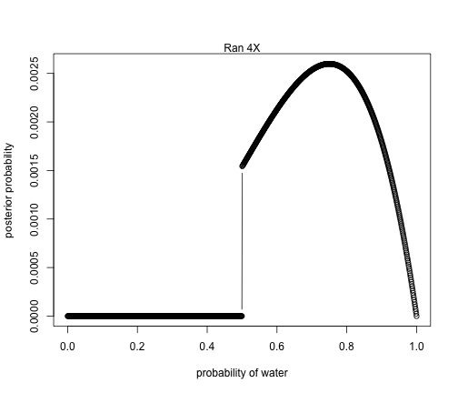
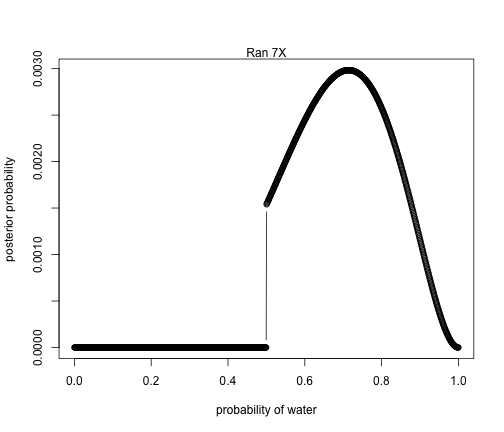

R Club Chapter 2 Medium
========================================================

### 2M1: 
Grid Approximate posterior dist for each of the followiung sets of observations
assumuing uniform pior
#### 1. W,W,W


```r
w = 3
# define grid
p_grid <- seq( from=0 , to=1 , length.out=1000 )
# define prior, All priors are equal
prior <- rep( 1 , 1000 )
# compute likelihood at each value in grid
likelihood <- dbinom( w , size=3 , prob=p_grid )
# compute product of likelihood and prior
unstd.posterior <- likelihood * prior
# standardize the posterior, so it sums to 1
posterior <- unstd.posterior / sum(unstd.posterior)
```


```r
plot( p_grid , posterior , type="b" ,
    xlab="probability of water" , ylab="posterior probability" )
mtext( "Ran 3X" )
```




#### 2. W,W,W,L


```r
w = 3
# define grid
p_grid <- seq( from=0 , to=1 , length.out=1000 )
# define prior, All priors are equal
prior <- rep( 1 , 1000 )
# compute likelihood at each value in grid
likelihood <- dbinom( w , size=4 , prob=p_grid )
# compute product of likelihood and prior
unstd.posterior <- likelihood * prior
# standardize the posterior, so it sums to 1
posterior <- unstd.posterior / sum(unstd.posterior)
```


```r
plot( p_grid , posterior , type="b" ,
    xlab="probability of water" , ylab="posterior probability" )
mtext( "Ran 4X" )
```



#### 3. L,W,W,L,W,W,W


```r
w = 5
# define grid
p_grid <- seq( from=0 , to=1 , length.out=1000 )
# define prior, All priors are equal
prior <- rep( 1 , 1000 )
# compute likelihood at each value in grid
likelihood <- dbinom( w , size=7 , prob=p_grid )
# compute product of likelihood and prior
unstd.posterior <- likelihood * prior
# standardize the posterior, so it sums to 1
posterior <- unstd.posterior / sum(unstd.posterior)
```


```r
plot( p_grid , posterior , type="b" ,
    xlab="probability of water" , ylab="posterior probability" )
mtext( "Ran 7X" )
```



### 2M2: 
Grid Approximate posterior dist for each of the followiung sets of observations
assumuing p is equal to zero when p <0.5 and is postitive constant when p >= .5 
#### 1. W,W,W


```r
w = 3
# define grid
p_grid <- seq( from=0 , to=1 , length.out=1000 )
# p is equal to zero when < 0.5 and 1 when greater than .5
prior <- ifelse( p_grid < 0.5 , 0 , 1 )
# compute likelihood at each value in grid
likelihood <- dbinom( w , size=3 , prob=p_grid )
# compute product of likelihood and prior
unstd.posterior <- likelihood * prior
# standardize the posterior, so it sums to 1
posterior <- unstd.posterior / sum(unstd.posterior)
```


```r
plot( p_grid , posterior , type="b" ,
    xlab="probability of water" , ylab="posterior probability" )
mtext( "Ran 3X" )
```




#### 2. W,W,W,L


```r
w = 3
# define grid
p_grid <- seq( from=0 , to=1 , length.out=1000 )
# p is equal to zero when < 0.5 and 1 when greater than .5
prior <- ifelse( p_grid < 0.5 , 0 , 1 )
# compute likelihood at each value in grid
likelihood <- dbinom( w , size=4 , prob=p_grid )
# compute product of likelihood and prior
unstd.posterior <- likelihood * prior
# standardize the posterior, so it sums to 1
posterior <- unstd.posterior / sum(unstd.posterior)
```


```r
plot( p_grid , posterior , type="b" ,
    xlab="probability of water" , ylab="posterior probability" )
mtext( "Ran 4X" )
```



#### 3. L,W,W,L,W,W,W


```r
w = 5
# define grid
p_grid <- seq( from=0 , to=1 , length.out=1000 )
# p is equal to zero when < 0.5 and 1 when greater than .5
prior <- ifelse( p_grid < 0.5 , 0 , 1 )
# compute likelihood at each value in grid
likelihood <- dbinom( w , size=7 , prob=p_grid )
# compute product of likelihood and prior
unstd.posterior <- likelihood * prior
# standardize the posterior, so it sums to 1
posterior <- unstd.posterior / sum(unstd.posterior)
```


```r
plot( p_grid , posterior , type="b" ,
    xlab="probability of water" , ylab="posterior probability" )
mtext( "Ran 7X" )
```



### 2M5

|Conjecture | ways to produce | count | new count |
|-----------|-----------------|-------|-----------|
|white, white |= 2 |X 0 |= 0   |
|white, black |= 1 |X 0 |= 0 |
|black, black |= 4 |X 1 |= 4/5 |
|black, white |= 1 |X 1 |= 1/5 |
 
Plausability of two black cards after seeing one black card =
Ways I can produce two black cards = 4 X Piror Plasuablity 1/5
 
 
### 2M6

|Conjecture | ways to produce | count | new count |
|-----------|-----------------|-------|-----------|
|white, white |= 3 |X 0 |= 0   |
|black, white |= 1 |X 0 |= 0 |
|black, white |= 1 |X 1 |= 1/2 |
|black, black |= 1 |X 1 |= 1/2 |

Plausability of two black cards after seeing one black card =
Ways I can produce two black cards = 1 X Piror Plasuablity 1/2

### 2M7

|Conjecture | ways to produce | count | new count |
|-----------|-----------------|-------|-----------|
|white, white |= 2 |X 0 |= 0   |
|white, black |= 1 |X 0 |= 0 |
|black, black |= 2 |X 1 |= 2/3 |
|black, white |= 1 |X 1 |= 1/3 |
- double check..


### 2H1
Priors...
panda_species = .5
species A twins = 10%
species B twins = 20%

Pr(B|twins) = Pr(twins|B) * Pr(B) / Pr(A)
