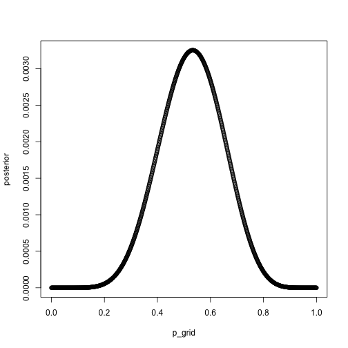
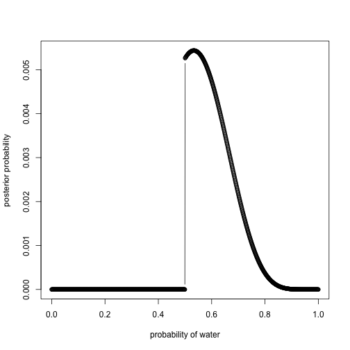
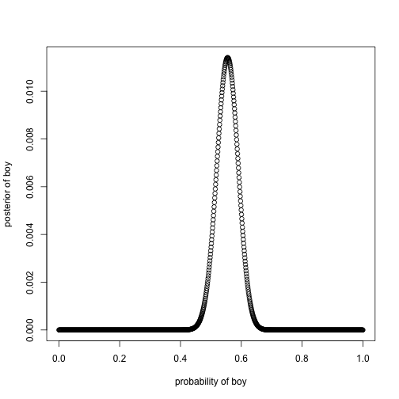
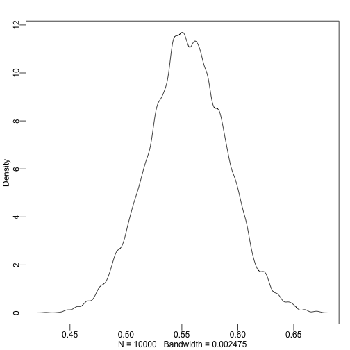
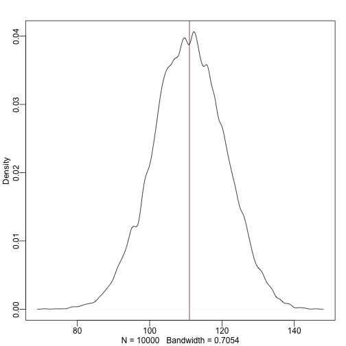
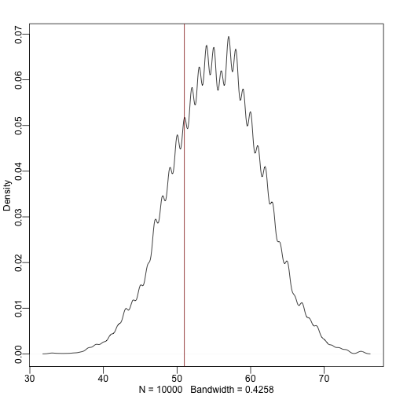
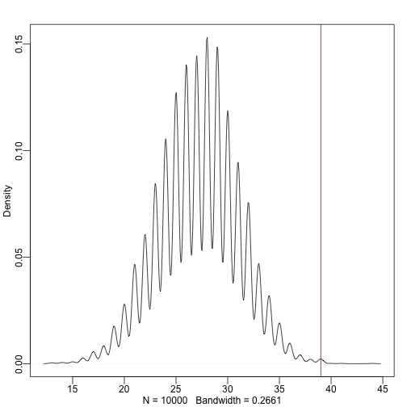

# M3- M5
## Data


```r
p_grid <- seq( from=0 , to=1 , length.out=1000 )
## flat prior
prior <- rep( 1 , 1000 )
likelihood <- dbinom( 8 , size=15 , prob=p_grid )
posterior <- likelihood * prior
posterior <- posterior / sum(posterior)
set.seed(100)
samples <- sample( p_grid , prob=posterior , size=1e4 , replace=TRUE )
```
              


3M3. Construct a posterior predictive check for this model and data. This means simulate the distribution of samples, averaging over the posterior uncertainty in p. What is the probability of observing 8 water in 15 tosses?

The probablity is 14.5% for seeing 8 waters in 15 tosses

*simulate the distribution of samples

The symbol samples above is the same list of random samples from the posterior distribu- tion that you’ve used in previous sections. For each sampled value, a random binomial obser- vation is generated. Since the sampled values appear in proportion to their posterior proba- bilities, the resulting simulated observations are averaged over the posterior. 


```r
samples <- sample( p_grid , prob=posterior , size=1e4 , replace=TRUE )
### 1000 observations
### number of permutations
### 15 tosses of the glob
### 15 simlulations, size 2 .. either water or land
### samples is grabing values for water out of porblity

dummy_w <- rbinom( 1e5 , size=15 , prob=samples )
table(dummy_w)[8]/1e5
```

```
##       7 
## 0.13674
```

```r
simplehist( dummy_w , xlab="dummy water count" )
```

```
## Error in eval(expr, envir, enclos): could not find function "simplehist"
```

3M4. Using the posterior distribution constructed from the new (8/15) data, now calculate the probability of observing 6 water in 9 tosses.

p=17.5%


```r
dummy_prob = table(dummy_w)/1e5
p_grid <- seq( from=0 , to=1 , length.out=1000 )
## flat prior
prior <- rep( 1 , 1000 )
likelihood <- dbinom( 8 , size=15 , prob=dummy_prob )
posterior <- likelihood * prior
```

```
## Warning in likelihood * prior: longer object length is not a multiple of
## shorter object length
```

```
## Error in eval(expr, envir, enclos): dims [product 16] do not match the length of object [1000]
```

```r
posterior <- posterior / sum(posterior)
set.seed(100)
samples <- sample( p_grid , prob=posterior , size=1e4 , replace=TRUE )

plot(p_grid,posterior)
```



```r
w <- rbinom( 100000 , size=9 , prob=dummy_prob )
table(w)/1e5
```

```
## w
##       0       1       2       3       4       5       6       7 
## 0.62053 0.24129 0.10051 0.03041 0.00629 0.00085 0.00010 0.00002
```

```r
p_grid <- seq( from=0 , to=1 , length.out=1000 )
## flat prior
prior <- rep( 1 , 1000 )
likelihood <- dbinom( 8 , size=15 , prob=dummy_w )
```

```
## Warning in dbinom(8, size = 15, prob = dummy_w): NaNs produced
```

```r
posterior <- likelihood * prior
posterior <- posterior / sum(posterior)
set.seed(100)
samples <- sample( p_grid , prob=posterior , size=1e4 , replace=TRUE )
```

```
## Error in sample.int(length(x), size, replace, prob): incorrect number of probabilities
```

```r
plot( p_grid , posterior , type="b" ,
    xlab="probability of water" , ylab="posterior probability" )
```

```
## Error in xy.coords(x, y, xlabel, ylabel, log): 'x' and 'y' lengths differ
```

                   
                   

```r
dummy_w <- rbinom( 1e5 , size=9 , prob=samples)
table(dummy_w)/1e5
```

```
## dummy_w
##       0       1       2       3       4       5       6       7       8 
## 0.00534 0.02783 0.07676 0.14583 0.18575 0.20053 0.17296 0.11789 0.05328 
##       9 
## 0.01383
```

```r
simplehist( new_dummy_w , xlab="dummy water count" )
```

```
## Error in eval(expr, envir, enclos): could not find function "simplehist"
```

3M5. Start over at 3M1, but now use a prior that is zero below p = 0.5 and a constant above p = 0.5. This corresponds to prior information that a majority of the Earth’s surface is water. Repeat each problem above and compare the inferences. What difference does the better prior make? If it helps, compare inferences (using both priors) to the true value p = 0.7.


```r
p_grid <- seq( from=0 , to=1 , length.out=1000 )
## not flat pior
prior <- ifelse( p_grid < 0.5 , 0 , 1 )
likelihood <- dbinom( 8 , size=15 , prob=p_grid )
posterior <- likelihood * prior
posterior <- posterior / sum(posterior)

plot( p_grid , posterior , type="b" ,
    xlab="probability of water" , ylab="posterior probability" )
```



```r
samples <- sample( p_grid , prob=posterior , size=1e4 , replace=TRUE )

### randmoly generating
### d geneerating a binomial distrbution


dummy_w <- rbinom( 1e5 , size=15 , prob=samples )
table(dummy_w)/1e5
```

```
## dummy_w
##       1       2       3       4       5       6       7       8       9 
## 0.00007 0.00070 0.00351 0.01248 0.03370 0.07010 0.11457 0.15893 0.17798 
##      10      11      12      13      14      15 
## 0.16431 0.12771 0.08004 0.03989 0.01344 0.00257
```

```r
simplehist( dummy_w , xlab="dummy water count" )
```

```
## Error in eval(expr, envir, enclos): could not find function "simplehist"
```

```r
dummy_w <- rbinom( 1e5 , size=9 , prob=samples )
table(dummy_w)/1e5
```

```
## dummy_w
##       0       1       2       3       4       5       6       7       8 
## 0.00046 0.00542 0.02706 0.08039 0.16059 0.22976 0.23449 0.16574 0.07778 
##       9 
## 0.01831
```

```r
simplehist( dummy_w , xlab="dummy water count" )
```

```
## Error in eval(expr, envir, enclos): could not find function "simplehist"
```
w=8 p=16%
w=6 p = 17.6%
The percentages are a bit higher...
# Hard Probblems

##data


```r
library(rethinking)
```

```
## Loading required package: rstan
```

```
## Loading required package: ggplot2
```

```
## rstan (Version 2.9.0, packaged: 2016-01-05 16:17:47 UTC, GitRev: 05c3d0058b6a)
```

```
## For execution on a local, multicore CPU with excess RAM we recommend calling
## rstan_options(auto_write = TRUE)
## options(mc.cores = parallel::detectCores())
```

```
## Loading required package: parallel
```

```
## rethinking (Version 1.58)
```

```r
data(homeworkch3)
```

(male=1, female=0)

3H1
Using grid approximation, compute the posterior distribution for the probability of a birth being a boy. Assume a uniform prior probability. Which parameter value maximizes the posterior probability?


```r
p_grid <- seq( from=0 , to=1 , length.out=1000 )
prior <- rep(1000, 1 )
likelihood <- dbinom( 111 , size=200 , prob=p_grid )
posterior <- likelihood * prior
posterior <- posterior / sum(posterior)

plot( p_grid , posterior , type="b" ,
    xlab="probability of boy" , ylab="posterior of boy" )
```



```r
loss <- sapply( p_grid , function(d) sum( posterior*abs( d - p_grid ) ) )
p_grid[which.min(loss)]
```

```
## [1] 0.5545546
```
0.5545546

3H2

Using the sample function, draw 10,000 random parameter values from the posterior distri- bution you calculated above. Use these samples to estimate the 50%, 89%, and 97% highest posterior density intervals.


```r
samples <- sample( p_grid , prob=posterior , size=1e4 , replace=TRUE )
dens(samples)
```



```r
HPDI(samples,0.5)
```

```
##      |0.5      0.5| 
## 0.5275275 0.5735736
```

```r
HPDI(samples,0.89)
```

```
##     |0.89     0.89| 
## 0.4974975 0.6076076
```

```r
HPDI(samples,0.97)
```

```
##     |0.97     0.97| 
## 0.4774775 0.6276276
```

3H3

Use rbinom to simulate 10,000 replicates of 200 births. You should end up with 10,000 num- bers, each one a count of boys out of 200 births. Compare the distribution of predicted numbers of boys to the actual count in the data (111 boys out of 200 births). There are many good ways to visualize the simulations, but the dens command (part of the rethinking package) is probably the easiest way in this case. Does it look like the model fits the data well? That is, does the distribution of predictions include the actual observation as a central, likely outcome?


```r
dummy_b <- rbinom( 1e4 , size=200 , prob=samples )
dens(dummy_b)
abline(v=111, col="darkred")
```



```r
(sum(birth1) + sum(birth2))/2
```

```
## [1] 55.5
```

50%


3H4
Now compare 10,000 counts of boys from 100 simulated first borns only to the number ofb oys in the first births, birth1. How does the model look in this light?

```r
dummy_b <- rbinom( 1e4 , size=100 , prob=samples )
sum(dummy_b[0:100])/100
```

```
## [1] 55.66
```

```r
sum(birth1)/100
```

```
## [1] 0.51
```

```r
dens(dummy_b)
abline(v=51, col="darkred")
```



Bad Modeal

3H5

The model assumes that sex of first and second births are independent. To check this assump- tion, focus now on second births that followed female first borns. Compare 10,000 simulated counts of boys to only those second births that followed girls. To do this correctly, you need to count the number of first borns who were girls and simulate that many births, 10,000 times. Compare the counts of boys in your simulations to the actual observed count of boys following girls. How does the model look in this light? Any guesses what is going on in these data?


```r
##  birth2 that followed birth1 femake

number_of_girls_born_first= 100-sum(birth1)
boys_after_girls= sum(birth2[which(birth1 == 0)])
number_of_girls_born_first = 49

girls <- rbinom( 1e4 , size=number_of_girls_born_first , prob=samples )
table(girls)[39]/1e4
```

```
## <NA> 
##   NA
```

```r
dens(girls)
abline(v=39,col="darkred")
```



