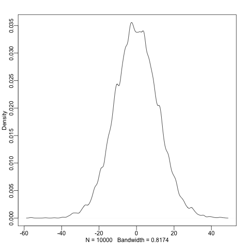
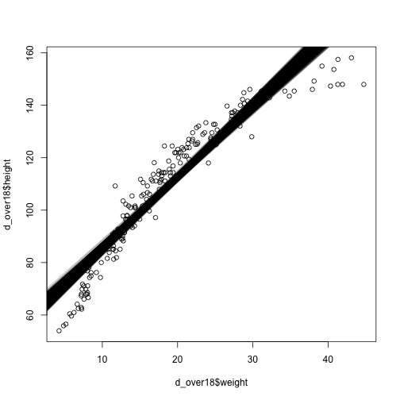
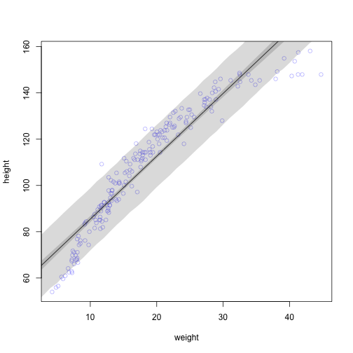
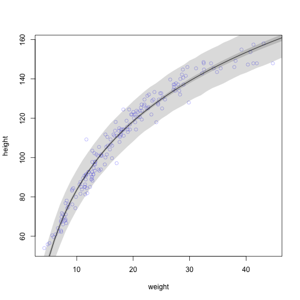

# Statistical Rethinking Chapter 4 problems

__Name:__Gina Turco


## For 03/17/16

### 4E1 In the model definition below, which line is the likelihood?


yi ∼ Normal(μ, σ) - **likelihood**

μ ∼ Normal(0, 10) - **μ prior**

σ ∼ Uniform(0, 10) - **σ prior**


* likelihood = binomal(number of times seen, number of samples)
* The value yi is distrbuted normally by the number of samples and the probality which is givin by  the mean and variance
* σ prior = σ ∼ Uniform(0, 10) uniform prior between zero and 10
* μ prior = μ ∼ Normal(0, 10) gaussian prior centered on 0 and
* prios are problistic not known with certinity

### 4E2 In the model definition just above, how many parameters are in the posterior distribution? 

 Two parameters: μ,σ

### 4E3 Using the model definition above, write down the appropriate form of Bayes’ theorem that includes the proper likelihood and priors.

pr(μ,σ|h) = ∏ Normal(hi|μ,σ)Normal(μ|0,10)Uniform(σ|0,10) / ∫ ∫ ∏ Normal(hi|μ, σ)Normal(μ|0, 10)Uniform(σ|0, 50)dμdσ

### 4M1 For the model definition below, simulate observed heights from the prior (not the posterior).

yi ∼ Normal(μ, σ)
μ ∼ Normal(0, 10) 
σ ∼ Uniform(0, 10)


```r
library("rethinking")
```

```
## Loading required package: rstan
```

```
## Loading required package: ggplot2
```

```
## Warning: package 'ggplot2' was built under R version 3.2.4
```

```
## rstan (Version 2.9.0-3, packaged: 2016-02-11 15:54:41 UTC, GitRev: 05c3d0058b6a)
```

```
## For execution on a local, multicore CPU with excess RAM we recommend calling
## rstan_options(auto_write = TRUE)
## options(mc.cores = parallel::detectCores())
```

```
## Loading required package: parallel
```

```
## rethinking (Version 1.58)
```

```r
## feed eq in
flist <- alist(
    height ~ dnorm( mu , sigma ) ,
    mu ~ dnorm( 0 , 10 ) ,
    sigma ~ dunif( 0 , 10 )
)

### simulate mu
sample_mu <- rnorm( 1e4 , 0 , 10 )
### simulate sigma
sample_sigma <- runif( 1e4 , 0 , 10 )

### prior joins both these dist
prior_h <- rnorm( 1e4 , sample_mu , sample_sigma )
dens( prior_h )
```



### 4M2 Translate the model just above into a map formula.


```r
library(rethinking)
data(Howell1)
d <- Howell1

flist <- alist(
    height ~ dnorm( mu , sigma ) ,
    mu ~ dnorm( 0 , 10 ) ,
    sigma ~ dunif( 0 , 10 )
)


m4.2 <- map(flist , data=d )
```

```
## Error in map(flist, data = d): non-finite finite-difference value [2]
## Start values for parameters may be too far from MAP.
## Try better priors or use explicit start values.
## If you sampled random start values, just trying again may work.
## Start values used in this attempt:
## mu = 0.166255719508197
## sigma = 2.22173326415941
```

```r
precis( m4.2 )
```

```
## Error in precis(m4.2): object 'm4.2' not found
```


## For 03/24/16

### 4E4 In the model definition below, which line is the linear model? 

**linear model** - μi =α+βxi

yi ∼ Normal(μ, σ)

μi =α+βxi

α ∼ Normal(0, 10) 

β ∼ Normal(0, 1)

σ ∼ Uniform(0, 10)


### 4E5 In the model definition just above, how many parameters are in the posterior distribution?

 Four - μ, σ, α and  β

### 4M3 Translate the map model formula below into a mathematical model definition.


```r
library(rethinking)
data(Howell1)
d <- Howell1


flist <- alist(
    y ~ dnorm( mu , sigma ),
    mu <- a + b*x,
    a ~ dnorm( 0 , 50 ),
    b ~ dunif( 0 , 10 ),
    sigma ~ dunif( 0 , 50 )
)
```

yi ∼ Normal(μ, σ)

μi =α+βxi

α ∼ Normal(0, 50)

β ∼ Normal(0, 10)

σ ∼ Uniform(0, 50)


### 4M4 A sample of students is measured for height each year for 3 years.After the third year,you want to fit a linear regression predicting height using year as a predictor. Write down the mathematical model definition for this regression, using any variable names and priors you choose. Be prepared to defend your choice of priors.

yi ∼ Normal(μ, σ)

**linear model**

μi =α+βyr

**yaxis**

α ∼ Normal(63, 100) 

**slope**

β ∼ Normal(0, 10)

**variance**

σ ∼ Uniform(0, 50)


* I’ve widened the prior for α, since as you’ll see it is common for the intercept in a linear model to swing a long way from the mean of the outcome variable. The flat prior here with a huge standard deviation will allow it to move wherever it needs to. 

* β = 0, weight has no relationship to height. So many people see it as conservative assumption. And such a prior will pull probability mass towards zero, leading to more conservative estimates

* 50 is a pretty broud deviance 

### 4M5 now suppose I tell you that the average height in the first year was 120 cm and that every student got taller each year. Does this information lead you to change your choice of priors? How?

yi ∼ Normal(μ, σ)

**intercept**

μi =α+βyr

**yaxis** 

α ∼ Normal(**120**, 50) 

**slope**

β ∼ Normal(0, 10)

**variance**

σ ∼ Uniform(0, 50)


### 4M6 Now suppose I tell you that the variance among heights for students of the same age is never more than 64cm. How does this lead you to revise your priors?


yi ∼ Normal(μ, σ)

**intercept**

μi =α+βyr

**yaxis**

α ∼ Normal(120, 50) 

**slope**

β ∼ Normal(0, 10)

**variance**

σ ∼ Uniform(0, **64**)


## For 03/31/16

### 4H1

The weights listed below were recorded in the !Kung census,but heights were not recorded for these individuals. Provide predicted heights and 89% intervals (either HPDI or PI) for each of these individuals. That is, fill in the table below, using model-based predictions.


```r
library(rethinking)
data(Howell1)
d <- Howell1

model <- map(
    alist(
        height ~ dnorm( mu , sigma ) ,
        mu <- a + b*weight ,
        a ~ dnorm( 178 , 100 ) ,
        b ~ dnorm( 0 , 10 ) , 
        sigma ~ dunif( 0 , 50 )
), data=d )


a = 75.447693
b = 1.764012
sigma = 9.345884
### height <- yint + m*weight
### can use an eq like this to estimate or can use all the as and bs like below

post <- extract.samples( model )
unkown_weights = c(46.95,43.72,64.78,32.59,54.63)
### function that uses weight in reg with all as and bs generated by our model
mu.link <- function(weight) post$a + post$b*weight
mu <- sapply( unkown_weights , mu.link )
### gets the average of all of these height lines for each weight
mu.mean <- apply( mu , 2 , mean )
mu.HPDI <- apply( mu , 2 , HPDI , prob=0.89 )
```

| Individual | Weight | Expected Height  | 89% Interval |
| -----------|:------:| ----------------:|-------------:|
| 1          | 46.95  | 158.2713         | 157-159      |
| 2          | 43.72  | 152.5727         | 151-153      |
| 3          | 64.78  | 189.7282         | 188-191      | 
| 4          | 32.59  | 132.9364         | 132-133      |
| 5          | 54.63  | 171.8209         | 170-172      |

### 4H2

4H2. Select out all the rows in the Howell1 data with ages below 18 years of age. If you do it right, you should end up with a new data frame with 192 rows in it.


```r
d_over18 <- d[d$age < 18,]
nrow(d_over18)
```

```
## [1] 192
```

(a) Fit a linear regression to these data, using map. Present and interpret the estimates. For every 10 units of increase in weight, how much taller does the model predict a child gets?


```r
model_18 <- map(
    alist(
        height ~ dnorm( mu , sigma ) ,
        mu <- a + b*weight ,
        a ~ dnorm( 178 , 100 ) ,
        b ~ dnorm( 0 , 10 ) , 
        sigma ~ dunif( 0 , 50 )
), data=d_over18 )

precis( model_18 )
```

```
##        Mean StdDev  5.5% 94.5%
## a     58.26   1.40 56.02 60.49
## b      2.72   0.07  2.61  2.83
## sigma  8.44   0.43  7.75  9.13
```

The linear regression has a mean y intercept (a) of 58.26 and slope of 2.72 this slope is much steeper then the slope for when children are included. 

(b) Plot the raw data, with height on the vertical axis and weight on the horizontal axis. Super- impose the MAP regression line and 89% HPDI for the mean. Also superimpose the 89% HPDI for predicted heights.


```r
plot( d_over18$height ~ d_over18$weight )
post <- extract.samples( model_18 )

for ( i in 1:3333 )
    abline( a=post$a[i] , b=post$b[i] , col=col.alpha("black",0.3) )
```



```r
post <- extract.samples( model_18 )
weight.seq <- seq( from=0 , to=70 , by=1 )
### function that uses weight in reg with all as and bs generated by our model
mu.link <- function(weight) post$a + post$b*weight
mu <- sapply( weight.seq , mu.link )
### gets the average of all of these height lines for each weight
mu.mean <- apply( mu , 2 , mean )
mu.HPDI <- apply( mu , 2 , HPDI , prob=0.89 )

### simulates the heights for each weight of the model
sim.height <- sim( model_18 , data=list(weight=weight.seq) , n=1e4 )
```

```
## [ 1000 / 10000 ]
[ 2000 / 10000 ]
[ 3000 / 10000 ]
[ 4000 / 10000 ]
[ 5000 / 10000 ]
[ 6000 / 10000 ]
[ 7000 / 10000 ]
[ 8000 / 10000 ]
[ 9000 / 10000 ]
[ 10000 / 10000 ]
```

```r
### shows dist of heights based on simulation
height.PI <- apply( sim.height , 2 , PI , prob=0.89 )


# plot the actual data
plot( height ~ weight , d_over18 , col=col.alpha(rangi2,0.5) )
# draw MAP line
### this is what our model predicts for each line
lines( weight.seq , mu.mean )
# draw HPDI region for line
shade( mu.HPDI , weight.seq )
# draw PI region for simulated heights
### simulated heigths and variance
shade( height.PI , weight.seq )
```




What aspects of the model fit concern you? Describe the kinds of assumptions you would change, if any, to improve the model. You don’t have to write any new code. Just explain what the model appears to be doing a bad job of, and what you hypothesize would be a better model.

The ends of the model concern me I would add more of a polynomial regression to fix this

### 4H3
4H3. Suppose a colleague of yours, who works on allometry, glances at the practice problems just above. Your colleague exclaims, “That’s silly. Everyone knows that it’s only the logarithm of body weight that scales with height!” Let’s take your colleague’s advice and see what happens.


```r
model_18.2 <- map(
    alist(
        height ~ dnorm( mu , sigma ) ,
        mu <- a + b*log(weight) ,
        a ~ dnorm( 178 , 100 ) ,
        b ~ dnorm( 0 , 100 ) , 
        sigma ~ dunif( 0 , 50 )
), data=d_over18 )

post <- extract.samples( model_18.2 )
weight.seq <- seq( from=0 , to=70 , by=1 )
sim.height <- sim( model_18.2 , data=list(weight=weight.seq) , n=1e4 )
```

```
## [ 1000 / 10000 ]
[ 2000 / 10000 ]
[ 3000 / 10000 ]
[ 4000 / 10000 ]
[ 5000 / 10000 ]
[ 6000 / 10000 ]
[ 7000 / 10000 ]
[ 8000 / 10000 ]
[ 9000 / 10000 ]
[ 10000 / 10000 ]
```

```r
height.PI <- apply( sim.height , 2 , PI , prob=0.97 )

mu.link <- function(weight) post$a + post$b*log(weight)
mu <- sapply( weight.seq , mu.link )
mu.mean <- apply( mu , 2 , mean )
mu.HPDI <- apply( mu , 2 , HPDI , prob=0.97 )
# plot raw data

plot( height ~ weight , d_over18 , col=col.alpha(rangi2,0.5) )
# draw MAP line
### this is what our model predicts for each line
lines( weight.seq , mu.mean )
# draw HPDI region for line
shade( mu.HPDI , weight.seq )
# draw PI region for simulated heights
### simulated heigths and variance
shade( height.PI , weight.seq )
```


