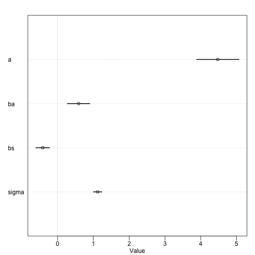

# Statistical Rethinking Chapter 4 problems

__Name:__


# For 04/18/2016

## 5M2: Invent your own example of a masked relationship. An outcome variable should be correlated with both predictor variables, but in opposite directions. And the two predictor variables should be correlated with one another.

Outcome:Transcription of a Gene

predictor 1: DNA methylation in a region 
predictor 2: DNase hypersensitivity in a region


## 5H1: Fit two bivariate Gaussian regressions, using map: (1) body weight as a linear function of territory size (area), and (2) body weight as a linear function of groupsize. Plot the results of these regressions, displaying the MAP regression line and the 95% interval of the mean. Is either variable important for predicting fox body weight?


```r
library(rethinking)
```

```
## Loading required package: rstan
```

```
## Loading required package: ggplot2
```

```
## Warning: package 'ggplot2' was built under R version 3.2.4
```

```
## rstan (Version 2.9.0-3, packaged: 2016-02-11 15:54:41 UTC, GitRev: 05c3d0058b6a)
```

```
## For execution on a local, multicore CPU with excess RAM we recommend calling
## rstan_options(auto_write = TRUE)
## options(mc.cores = parallel::detectCores())
```

```
## Loading required package: parallel
```

```
## rethinking (Version 1.58)
```

```r
data(foxes)
f <- foxes

f$area.s <- (f$area - mean(f$area))/sd(f$area)
f$groupsize.s <- (f$groupsize - mean(f$groupsize))/sd(f$groupsize)

h5.1a <- map(
    alist(
        weight ~ dnorm( mu , sigma ) ,
        mu <- a + ba*area ,
        a ~ dnorm( 5 , 10) ,
        ba ~ dnorm( 0 , 1 ) ,
        sigma ~ dunif( 0 , 10)
),  data=f )

plot(precis(h5.1a))
```


```r
precis(h5.1a)
```

```
##       Mean StdDev  5.5% 94.5%
## a     4.45   0.39  3.83  5.07
## ba    0.02   0.12 -0.16  0.21
## sigma 1.18   0.08  1.05  1.30
```

```r
np.seq <- 0:10 
pred.data <- data.frame( area=np.seq )
mu <- link( h5.1a , data=pred.data , n=1e4 ) 
```

```
## [ 1000 / 10000 ]
[ 2000 / 10000 ]
[ 3000 / 10000 ]
[ 4000 / 10000 ]
[ 5000 / 10000 ]
[ 6000 / 10000 ]
[ 7000 / 10000 ]
[ 8000 / 10000 ]
[ 9000 / 10000 ]
[ 10000 / 10000 ]
```

```r
mu.mean <- apply( mu , 2 , mean ) 
mu.PI <- apply( mu , 2 , PI )
plot( weight ~ area , data=f , col=rangi2 ) 
lines( np.seq , mu.mean ) 
lines( np.seq , mu.PI[1,] , lty=2 ) 
lines( np.seq , mu.PI[2,] , lty=2 )
```


```r
h5.1b <- map(
    alist(
        weight ~ dnorm( mu , sigma ) ,
        mu <- a + bs*groupsize ,
        a ~ dnorm( 5 , 10) ,
        bs ~ dnorm( 0 , 1 ) ,
        sigma ~ dunif( 0 , 10)
),  data=f )

plot(precis(h5.1b))
```


```r
precis(h5.1b)
```

```
##        Mean StdDev  5.5% 94.5%
## a      5.07   0.32  4.55  5.58
## bs    -0.12   0.07 -0.24 -0.01
## sigma  1.16   0.08  1.04  1.29
```

```r
G.seq <- 1:10
pred.data <- data.frame( groupsize=G.seq)
mu <- link( h5.1b , data=pred.data , n=1e4 )
```

```
## [ 1000 / 10000 ]
[ 2000 / 10000 ]
[ 3000 / 10000 ]
[ 4000 / 10000 ]
[ 5000 / 10000 ]
[ 6000 / 10000 ]
[ 7000 / 10000 ]
[ 8000 / 10000 ]
[ 9000 / 10000 ]
[ 10000 / 10000 ]
```

```r
mu.mean <- apply( mu , 2 , mean )
mu.PI <- apply( mu , 2 , PI )
plot( weight ~ groupsize , data=f , col=rangi2 )
lines( G.seq , mu.mean )
lines( G.seq , mu.PI[1,] , lty=2 )
lines( G.seq , mu.PI[2,] , lty=2 )
```


## 5H2: 
Now fit a multiple linear regression wit hweight as the out come and both area and groupsize as predictor variables. Plot the predictions of the model for each predictor, holding the other predictor constant at its mean. What does this model say about the importance of each variable? Why do you get different results than you got in the exercise just above?


```r
h5.2 <- map(
    alist(
        weight ~ dnorm( mu , sigma ) ,
        mu <- a + ba*area + bs*groupsize ,
        a ~ dnorm( 5 , 10) ,
        ba ~ dnorm( 0 , 1 ) ,
        bs ~ dnorm( 0 , 1 ) ,
        sigma ~ dunif( 0 , 10 )
),  data=f )

precis(h5.2)
```

```
##        Mean StdDev  5.5% 94.5%
## a      4.47   0.37  3.89  5.06
## ba     0.59   0.20  0.27  0.90
## bs    -0.41   0.12 -0.60 -0.23
## sigma  1.12   0.07  1.00  1.24
```

```r
plot(precis(h5.2))
```



```r
mean.area <- mean(f$area)
G.seq <- seq(0,10,length.out=100)
pred.data <- data.frame( groupsize=G.seq, area=mean.area)
mu <- link( h5.2 , data=pred.data , n=1e4 )
```

```
## [ 1000 / 10000 ]
[ 2000 / 10000 ]
[ 3000 / 10000 ]
[ 4000 / 10000 ]
[ 5000 / 10000 ]
[ 6000 / 10000 ]
[ 7000 / 10000 ]
[ 8000 / 10000 ]
[ 9000 / 10000 ]
[ 10000 / 10000 ]
```

```r
mu.mean <- apply( mu , 2 , mean )
mu.PI <- apply( mu , 2 , PI )
plot( weight ~ groupsize , data=f , col=rangi2 )
lines( G.seq , mu.mean )
lines( G.seq , mu.PI[1,] , lty=2 )
lines( G.seq , mu.PI[2,] , lty=2 )
```


```r
mean.groupsize <- mean(f$groupsize)
A.seq <- seq(0,6,length.out=100)
pred.data <- data.frame( groupsize=A.seq, area=mean.groupsize)
mu <- link( h5.2 , data=pred.data , n=1e4 )
```

```
## [ 1000 / 10000 ]
[ 2000 / 10000 ]
[ 3000 / 10000 ]
[ 4000 / 10000 ]
[ 5000 / 10000 ]
[ 6000 / 10000 ]
[ 7000 / 10000 ]
[ 8000 / 10000 ]
[ 9000 / 10000 ]
[ 10000 / 10000 ]
```

```r
mu.mean <- apply( mu , 2 , mean )
mu.PI <- apply( mu , 2 , PI )
plot( weight ~ area , data=f , col=rangi2 )
lines( A.seq , mu.mean )
lines( A.seq , mu.PI[1,] , lty=2 )
lines( A.seq , mu.PI[2,] , lty=2 )
```


## 5H3

Finally, consider the avgfood variable. Fit two more multiple regressions: (1) body weight as an additive function of avgfood and groupsize, and (2) body weight as an additive function of all three variables, avgfood and groupsize and area. Compare the results of these models to the previous models you’ve fit, in the first two exercises. 

(a) Is avgfood or area a better predictor of body weight? If you had to choose one or the other to include in a model, which would it be? Support your assessment with any tables or plots you choose. (b) When both avgfood or area are in the same model, their effects are reduced (closer to zero) and their standard errors are larger than when they are included in separate models. Can you explain this result?


```r
library(corrplot)
x = cor(f)
corrplot(x, method="number")
```


```r
##bf lots of varance...

h5.3a <- map(
    alist(
        weight ~ dnorm( mu , sigma ) ,
        mu <- a + bs*groupsize.s + bf*avgfood ,
        a ~ dnorm( 5 , 10) ,
        bs ~ dnorm( 0 , 1 ) ,
        bf ~ dnorm( 0 , 1 ) ,
        sigma ~ dunif( 0 , 10 )
),  data=f )

precis(h5.3a)
```

```
##        Mean StdDev  5.5% 94.5%
## a      3.43   0.59  2.48  4.38
## bs    -0.45   0.17 -0.72 -0.17
## bf     1.46   0.78  0.22  2.70
## sigma  1.13   0.08  1.01  1.26
```

```r
plot(precis(h5.3a))
```


```r
## makes bs more important then ba and has less varance
h5.3b <- map(
    alist(
        weight ~ dnorm( mu , sigma ) ,
        mu <- a + ba*area.s + bs*groupsize.s + bf*avgfood ,
        a ~ dnorm( 5 , 10) ,
        ba ~ dnorm( 0 , 1 ) ,
        bs ~ dnorm( 0 , 1 ) ,
        bf ~ dnorm( 0 , 1 ) ,
        sigma ~ dunif( 0 , 10 )
),  data=f )

precis(h5.3b)
```

```
##        Mean StdDev  5.5% 94.5%
## a      3.95   0.63  2.95  4.95
## ba     0.47   0.19  0.16  0.78
## bs    -0.71   0.20 -1.03 -0.39
## bf     0.77   0.82 -0.54  2.08
## sigma  1.11   0.07  0.99  1.23
```

```r
plot(precis(h5.3b))
```


library(Homo.sapi
library(ggbio)
