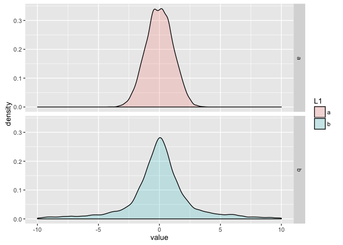
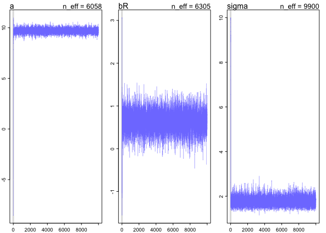

## Run the model below and then inspect the posterior distribution and explain what it is accomplishing.


```r
library(rethinking)
```

```
## Loading required package: rstan
```

```
## Loading required package: ggplot2
```

```
## Loading required package: StanHeaders
```

```
## rstan (Version 2.10.1, packaged: 2016-06-24 13:22:16 UTC, GitRev: 85f7a56811da)
```

```
## For execution on a local, multicore CPU with excess RAM we recommend calling
## rstan_options(auto_write = TRUE)
## options(mc.cores = parallel::detectCores())
```

```
## Loading required package: parallel
```

```
## rethinking (Version 1.59)
```

```r
mp <- map2stan(
  alist(
    ### solving for alpha and beta sep
    a ~ dnorm(0,1),
    ## alpha has a normal dist with a mean of zero and st dev 1
    b ~ dcauchy(0,1)
    ## cauchy is a thick-tailed dist with a mean of zero and st dev 1
  ),
  ### our data set is just one value 1
  data=list(y=1),
  start=list(a=0,b=0),
  iter=1e4, warmup=100 , WAIC=FALSE )
```

```
## In file included from file26b51618e6bf.cpp:8:
## In file included from /Library/Frameworks/R.framework/Versions/3.3/Resources/library/StanHeaders/include/src/stan/model/model_header.hpp:4:
## In file included from /Library/Frameworks/R.framework/Versions/3.3/Resources/library/StanHeaders/include/stan/math.hpp:4:
## In file included from /Library/Frameworks/R.framework/Versions/3.3/Resources/library/StanHeaders/include/stan/math/rev/mat.hpp:4:
## In file included from /Library/Frameworks/R.framework/Versions/3.3/Resources/library/StanHeaders/include/stan/math/rev/core.hpp:42:
## /Library/Frameworks/R.framework/Versions/3.3/Resources/library/StanHeaders/include/stan/math/rev/core/set_zero_all_adjoints.hpp:14:17: warning: unused function 'set_zero_all_adjoints' [-Wunused-function]
##     static void set_zero_all_adjoints() {
##                 ^
## In file included from file26b51618e6bf.cpp:8:
## In file included from /Library/Frameworks/R.framework/Versions/3.3/Resources/library/StanHeaders/include/src/stan/model/model_header.hpp:4:
## In file included from /Library/Frameworks/R.framework/Versions/3.3/Resources/library/StanHeaders/include/stan/math.hpp:4:
## In file included from /Library/Frameworks/R.framework/Versions/3.3/Resources/library/StanHeaders/include/stan/math/rev/mat.hpp:4:
## In file included from /Library/Frameworks/R.framework/Versions/3.3/Resources/library/StanHeaders/include/stan/math/rev/core.hpp:43:
## /Library/Frameworks/R.framework/Versions/3.3/Resources/library/StanHeaders/include/stan/math/rev/core/set_zero_all_adjoints_nested.hpp:17:17: warning: 'static' function 'set_zero_all_adjoints_nested' declared in header file should be declared 'static inline' [-Wunneeded-internal-declaration]
##     static void set_zero_all_adjoints_nested() {
##                 ^
## In file included from file26b51618e6bf.cpp:8:
## In file included from /Library/Frameworks/R.framework/Versions/3.3/Resources/library/StanHeaders/include/src/stan/model/model_header.hpp:4:
## In file included from /Library/Frameworks/R.framework/Versions/3.3/Resources/library/StanHeaders/include/stan/math.hpp:4:
## In file included from /Library/Frameworks/R.framework/Versions/3.3/Resources/library/StanHeaders/include/stan/math/rev/mat.hpp:8:
## In file included from /Library/Frameworks/R.framework/Versions/3.3/Resources/library/StanHeaders/include/stan/math/prim/mat.hpp:55:
## /Library/Frameworks/R.framework/Versions/3.3/Resources/library/StanHeaders/include/stan/math/prim/mat/fun/autocorrelation.hpp:19:14: warning: function 'fft_next_good_size' is not needed and will not be emitted [-Wunneeded-internal-declaration]
##       size_t fft_next_good_size(size_t N) {
##              ^
## In file included from file26b51618e6bf.cpp:8:
## In file included from /Library/Frameworks/R.framework/Versions/3.3/Resources/library/StanHeaders/include/src/stan/model/model_header.hpp:4:
## In file included from /Library/Frameworks/R.framework/Versions/3.3/Resources/library/StanHeaders/include/stan/math.hpp:4:
## In file included from /Library/Frameworks/R.framework/Versions/3.3/Resources/library/StanHeaders/include/stan/math/rev/mat.hpp:8:
## In file included from /Library/Frameworks/R.framework/Versions/3.3/Resources/library/StanHeaders/include/stan/math/prim/mat.hpp:36:
## /Library/Frameworks/R.framework/Versions/3.3/Resources/library/StanHeaders/include/stan/math/prim/mat/err/check_positive_ordered.hpp:39:67: warning: unused typedef 'size_type' [-Wunused-local-typedef]
##       typedef typename index_type<Matrix<T_y, Dynamic, 1> >::type size_type;
##                                                                   ^
## In file included from file26b51618e6bf.cpp:8:
## In file included from /Library/Frameworks/R.framework/Versions/3.3/Resources/library/StanHeaders/include/src/stan/model/model_header.hpp:4:
## In file included from /Library/Frameworks/R.framework/Versions/3.3/Resources/library/StanHeaders/include/stan/math.hpp:4:
## In file included from /Library/Frameworks/R.framework/Versions/3.3/Resources/library/StanHeaders/include/stan/math/rev/mat.hpp:8:
## In file included from /Library/Frameworks/R.framework/Versions/3.3/Resources/library/StanHeaders/include/stan/math/prim/mat.hpp:232:
## In file included from /Library/Frameworks/R.framework/Versions/3.3/Resources/library/StanHeaders/include/stan/math/prim/arr.hpp:33:
## In file included from /Library/Frameworks/R.framework/Versions/3.3/Resources/library/StanHeaders/include/stan/math/prim/arr/functor/integrate_ode_rk45.hpp:13:
## In file included from /Library/Frameworks/R.framework/Versions/3.3/Resources/library/BH/include/boost/numeric/odeint.hpp:61:
## In file included from /Library/Frameworks/R.framework/Versions/3.3/Resources/library/BH/include/boost/numeric/odeint/util/multi_array_adaption.hpp:29:
## In file included from /Library/Frameworks/R.framework/Versions/3.3/Resources/library/BH/include/boost/multi_array.hpp:21:
## In file included from /Library/Frameworks/R.framework/Versions/3.3/Resources/library/BH/include/boost/multi_array/base.hpp:28:
## /Library/Frameworks/R.framework/Versions/3.3/Resources/library/BH/include/boost/multi_array/concept_checks.hpp:42:43: warning: unused typedef 'index_range' [-Wunused-local-typedef]
##       typedef typename Array::index_range index_range;
##                                           ^
## /Library/Frameworks/R.framework/Versions/3.3/Resources/library/BH/include/boost/multi_array/concept_checks.hpp:43:37: warning: unused typedef 'index' [-Wunused-local-typedef]
##       typedef typename Array::index index;
##                                     ^
## /Library/Frameworks/R.framework/Versions/3.3/Resources/library/BH/include/boost/multi_array/concept_checks.hpp:53:43: warning: unused typedef 'index_range' [-Wunused-local-typedef]
##       typedef typename Array::index_range index_range;
##                                           ^
## /Library/Frameworks/R.framework/Versions/3.3/Resources/library/BH/include/boost/multi_array/concept_checks.hpp:54:37: warning: unused typedef 'index' [-Wunused-local-typedef]
##       typedef typename Array::index index;
##                                     ^
## 8 warnings generated.
## 
## SAMPLING FOR MODEL 'a ~ dnorm(0, 1)' NOW (CHAIN 1).
## WARNING: The initial buffer, adaptation window, and terminal buffer
##          overflow the total number of warmup iterations.
##          Defaulting to a 15%/75%/10% partition,
##            init_buffer = 15
##            adapt_window = 75
##            term_buffer = 10
## 
## 
## Chain 1, Iteration:    1 / 10000 [  0%]  (Warmup)
## Chain 1, Iteration:  101 / 10000 [  1%]  (Sampling)
## Chain 1, Iteration: 1100 / 10000 [ 11%]  (Sampling)
## Chain 1, Iteration: 2100 / 10000 [ 21%]  (Sampling)
## Chain 1, Iteration: 3100 / 10000 [ 31%]  (Sampling)
## Chain 1, Iteration: 4100 / 10000 [ 41%]  (Sampling)
## Chain 1, Iteration: 5100 / 10000 [ 51%]  (Sampling)
## Chain 1, Iteration: 6100 / 10000 [ 61%]  (Sampling)
## Chain 1, Iteration: 7100 / 10000 [ 71%]  (Sampling)
## Chain 1, Iteration: 8100 / 10000 [ 81%]  (Sampling)
## Chain 1, Iteration: 9100 / 10000 [ 91%]  (Sampling)
## Chain 1, Iteration: 10000 / 10000 [100%]  (Sampling)
##  Elapsed Time: 0.001373 seconds (Warm-up)
##                0.18548 seconds (Sampling)
##                0.186853 seconds (Total)
## 
## 
## SAMPLING FOR MODEL 'a ~ dnorm(0, 1)' NOW (CHAIN 1).
## WARNING: No variance estimation is
##          performed for num_warmup < 20
## 
## 
## Chain 1, Iteration: 1 / 1 [100%]  (Sampling)
##  Elapsed Time: 6e-06 seconds (Warm-up)
##                3e-05 seconds (Sampling)
##                3.6e-05 seconds (Total)
```

```r
precis(mp)
```

```
##   Mean StdDev lower 0.89 upper 0.89 n_eff Rhat
## a 0.00    1.1      -1.78       1.72  9074    1
## b 0.53   15.7      -5.82       6.83  1121    1
```

```r
## the thick-tailed dist has a mean closer to 1 or mid one where the st dis is closer to zero but the cauchy dist has a much higher stdDevation and need much less effective parmaters to make a model. Both have a very good rhat.
```

Lets plot the post dist for each of these


```r
library(ggplot2)
library(reshape)

vars=extract.samples(mp)
summary(vars)
```

```
##   Length Class  Mode   
## a 9900   -none- numeric
## b 9900   -none- numeric
```

```r
vars.m <- melt(vars)

ggplot(vars.m, aes(value, fill=L1)) + geom_density(alpha=.2) + facet_grid(L1 ~ .)+ scale_x_continuous(limits = c(-10, 10)) 
```

```
## Warning: Removed 637 rows containing non-finite values (stat_density).
```

<!-- -->


Compare the samples for the parameters a and b. Can you explain the different trace plots, using what you know about the Cauchy distribution?


```r
plot(mp)
```

<!-- -->

The cauchy distbution is much more defined this is because it is skewed much more towards one tail

## 8H2. Recall the divorce rate example from Chapter 5. Repeat that analysis, using map2stan this time, fitting models m5.1, m5.2, and m5.3. Use compare to compare the models on the basis of WAIC. Explain the results.


```r
# load data
data(WaffleDivorce)
d <- WaffleDivorce
# standardize predictor
d$MedianAgeMarriage.s <- (d$MedianAgeMarriage-mean(d$MedianAgeMarriage))/
    sd(d$MedianAgeMarriage)
# fit model
m5.1 <- map(
    alist(
        Divorce ~ dnorm( mu , sigma ) ,
        mu <- a + bA * MedianAgeMarriage.s ,
        a ~ dnorm( 10 , 10 ) ,
        bA ~ dnorm( 0 , 1 ) ,
        sigma ~ dunif( 0 , 10 )
) , data = d )

d$Marriage.s <- (d$Marriage - mean(d$Marriage))/sd(d$Marriage)
m5.2 <- map(
    alist(
        Divorce ~ dnorm( mu , sigma ) ,
        mu <- a + bR * Marriage.s ,
        a ~ dnorm( 10 , 10 ) ,
        bR ~ dnorm( 0 , 1 ) ,
    sigma ~ dunif( 0 , 10 )
) , data = d )

m5.3 <- map(
    alist(
        Divorce ~ dnorm( mu , sigma ) ,
        mu <- a + bR*Marriage.s + bA*MedianAgeMarriage.s ,
        a ~ dnorm( 10 , 10 ) ,
        bR ~ dnorm( 0 , 1 ) ,
        bA ~ dnorm( 0 , 1 ) ,
        sigma ~ dunif( 0 , 10 )
),
    data = d )

compare(m5.1,m5.2,m5.3)
```

```
##       WAIC pWAIC dWAIC weight    SE   dSE
## m5.1 188.1   5.0   0.0   0.67 14.51    NA
## m5.3 189.6   6.0   1.4   0.33 14.56  0.98
## m5.2 200.6   3.8  12.4   0.00 10.77 10.68
```


```r
m5.1s <- map2stan(
    alist(
        Divorce ~ dnorm( mu , sigma ) ,
        mu <- a + bA * MedianAgeMarriage.s ,
        a ~ dnorm( 10 , 10 ) ,
        bA ~ dnorm( 0 , 1 ) ,
        sigma ~ dunif( 0 , 10 )
) , data = d,iter=1e4, warmup=100 , WAIC=FALSE ) 
```

```
## Warning: Variable 'Marriage.SE' contains dots '.'.
## Will attempt to remove dots internally.
```

```
## Warning: Variable 'Divorce.SE' contains dots '.'.
## Will attempt to remove dots internally.
```

```
## Warning: Variable 'MedianAgeMarriage.s' contains dots '.'.
## Will attempt to remove dots internally.
```

```
## Warning: Variable 'Marriage.s' contains dots '.'.
## Will attempt to remove dots internally.
```

```
## In file included from file26b5391bda9e.cpp:8:
## In file included from /Library/Frameworks/R.framework/Versions/3.3/Resources/library/StanHeaders/include/src/stan/model/model_header.hpp:4:
## In file included from /Library/Frameworks/R.framework/Versions/3.3/Resources/library/StanHeaders/include/stan/math.hpp:4:
## In file included from /Library/Frameworks/R.framework/Versions/3.3/Resources/library/StanHeaders/include/stan/math/rev/mat.hpp:4:
## In file included from /Library/Frameworks/R.framework/Versions/3.3/Resources/library/StanHeaders/include/stan/math/rev/core.hpp:42:
## /Library/Frameworks/R.framework/Versions/3.3/Resources/library/StanHeaders/include/stan/math/rev/core/set_zero_all_adjoints.hpp:14:17: warning: unused function 'set_zero_all_adjoints' [-Wunused-function]
##     static void set_zero_all_adjoints() {
##                 ^
## In file included from file26b5391bda9e.cpp:8:
## In file included from /Library/Frameworks/R.framework/Versions/3.3/Resources/library/StanHeaders/include/src/stan/model/model_header.hpp:4:
## In file included from /Library/Frameworks/R.framework/Versions/3.3/Resources/library/StanHeaders/include/stan/math.hpp:4:
## In file included from /Library/Frameworks/R.framework/Versions/3.3/Resources/library/StanHeaders/include/stan/math/rev/mat.hpp:4:
## In file included from /Library/Frameworks/R.framework/Versions/3.3/Resources/library/StanHeaders/include/stan/math/rev/core.hpp:43:
## /Library/Frameworks/R.framework/Versions/3.3/Resources/library/StanHeaders/include/stan/math/rev/core/set_zero_all_adjoints_nested.hpp:17:17: warning: 'static' function 'set_zero_all_adjoints_nested' declared in header file should be declared 'static inline' [-Wunneeded-internal-declaration]
##     static void set_zero_all_adjoints_nested() {
##                 ^
## In file included from file26b5391bda9e.cpp:8:
## In file included from /Library/Frameworks/R.framework/Versions/3.3/Resources/library/StanHeaders/include/src/stan/model/model_header.hpp:4:
## In file included from /Library/Frameworks/R.framework/Versions/3.3/Resources/library/StanHeaders/include/stan/math.hpp:4:
## In file included from /Library/Frameworks/R.framework/Versions/3.3/Resources/library/StanHeaders/include/stan/math/rev/mat.hpp:8:
## In file included from /Library/Frameworks/R.framework/Versions/3.3/Resources/library/StanHeaders/include/stan/math/prim/mat.hpp:55:
## /Library/Frameworks/R.framework/Versions/3.3/Resources/library/StanHeaders/include/stan/math/prim/mat/fun/autocorrelation.hpp:19:14: warning: function 'fft_next_good_size' is not needed and will not be emitted [-Wunneeded-internal-declaration]
##       size_t fft_next_good_size(size_t N) {
##              ^
## In file included from file26b5391bda9e.cpp:8:
## In file included from /Library/Frameworks/R.framework/Versions/3.3/Resources/library/StanHeaders/include/src/stan/model/model_header.hpp:4:
## In file included from /Library/Frameworks/R.framework/Versions/3.3/Resources/library/StanHeaders/include/stan/math.hpp:4:
## In file included from /Library/Frameworks/R.framework/Versions/3.3/Resources/library/StanHeaders/include/stan/math/rev/mat.hpp:8:
## In file included from /Library/Frameworks/R.framework/Versions/3.3/Resources/library/StanHeaders/include/stan/math/prim/mat.hpp:36:
## /Library/Frameworks/R.framework/Versions/3.3/Resources/library/StanHeaders/include/stan/math/prim/mat/err/check_positive_ordered.hpp:39:67: warning: unused typedef 'size_type' [-Wunused-local-typedef]
##       typedef typename index_type<Matrix<T_y, Dynamic, 1> >::type size_type;
##                                                                   ^
## In file included from file26b5391bda9e.cpp:8:
## In file included from /Library/Frameworks/R.framework/Versions/3.3/Resources/library/StanHeaders/include/src/stan/model/model_header.hpp:4:
## In file included from /Library/Frameworks/R.framework/Versions/3.3/Resources/library/StanHeaders/include/stan/math.hpp:4:
## In file included from /Library/Frameworks/R.framework/Versions/3.3/Resources/library/StanHeaders/include/stan/math/rev/mat.hpp:8:
## In file included from /Library/Frameworks/R.framework/Versions/3.3/Resources/library/StanHeaders/include/stan/math/prim/mat.hpp:232:
## In file included from /Library/Frameworks/R.framework/Versions/3.3/Resources/library/StanHeaders/include/stan/math/prim/arr.hpp:33:
## In file included from /Library/Frameworks/R.framework/Versions/3.3/Resources/library/StanHeaders/include/stan/math/prim/arr/functor/integrate_ode_rk45.hpp:13:
## In file included from /Library/Frameworks/R.framework/Versions/3.3/Resources/library/BH/include/boost/numeric/odeint.hpp:61:
## In file included from /Library/Frameworks/R.framework/Versions/3.3/Resources/library/BH/include/boost/numeric/odeint/util/multi_array_adaption.hpp:29:
## In file included from /Library/Frameworks/R.framework/Versions/3.3/Resources/library/BH/include/boost/multi_array.hpp:21:
## In file included from /Library/Frameworks/R.framework/Versions/3.3/Resources/library/BH/include/boost/multi_array/base.hpp:28:
## /Library/Frameworks/R.framework/Versions/3.3/Resources/library/BH/include/boost/multi_array/concept_checks.hpp:42:43: warning: unused typedef 'index_range' [-Wunused-local-typedef]
##       typedef typename Array::index_range index_range;
##                                           ^
## /Library/Frameworks/R.framework/Versions/3.3/Resources/library/BH/include/boost/multi_array/concept_checks.hpp:43:37: warning: unused typedef 'index' [-Wunused-local-typedef]
##       typedef typename Array::index index;
##                                     ^
## /Library/Frameworks/R.framework/Versions/3.3/Resources/library/BH/include/boost/multi_array/concept_checks.hpp:53:43: warning: unused typedef 'index_range' [-Wunused-local-typedef]
##       typedef typename Array::index_range index_range;
##                                           ^
## /Library/Frameworks/R.framework/Versions/3.3/Resources/library/BH/include/boost/multi_array/concept_checks.hpp:54:37: warning: unused typedef 'index' [-Wunused-local-typedef]
##       typedef typename Array::index index;
##                                     ^
## 8 warnings generated.
```

```
## Warning in FUN(X[[i]], ...): data with name Location is not numeric and not
## used
```

```
## Warning in FUN(X[[i]], ...): data with name Loc is not numeric and not used
```

```
## 
## SAMPLING FOR MODEL 'Divorce ~ dnorm(mu, sigma)' NOW (CHAIN 1).
## WARNING: The initial buffer, adaptation window, and terminal buffer
##          overflow the total number of warmup iterations.
##          Defaulting to a 15%/75%/10% partition,
##            init_buffer = 15
##            adapt_window = 75
##            term_buffer = 10
## 
## 
## Chain 1, Iteration:    1 / 10000 [  0%]  (Warmup)
## Chain 1, Iteration:  101 / 10000 [  1%]  (Sampling)
## Chain 1, Iteration: 1100 / 10000 [ 11%]  (Sampling)
## Chain 1, Iteration: 2100 / 10000 [ 21%]  (Sampling)
## Chain 1, Iteration: 3100 / 10000 [ 31%]  (Sampling)
## Chain 1, Iteration: 4100 / 10000 [ 41%]  (Sampling)
## Chain 1, Iteration: 5100 / 10000 [ 51%]  (Sampling)
## Chain 1, Iteration: 6100 / 10000 [ 61%]  (Sampling)
## Chain 1, Iteration: 7100 / 10000 [ 71%]  (Sampling)
## Chain 1, Iteration: 8100 / 10000 [ 81%]  (Sampling)
## Chain 1, Iteration: 9100 / 10000 [ 91%]  (Sampling)
## Chain 1, Iteration: 10000 / 10000 [100%]  (Sampling)
##  Elapsed Time: 0.004267 seconds (Warm-up)
##                0.323701 seconds (Sampling)
##                0.327968 seconds (Total)
```

```
## Warning in FUN(X[[i]], ...): data with name Location is not numeric and not
## used

## Warning in FUN(X[[i]], ...): data with name Loc is not numeric and not used
```

```
## 
## SAMPLING FOR MODEL 'Divorce ~ dnorm(mu, sigma)' NOW (CHAIN 1).
## WARNING: No variance estimation is
##          performed for num_warmup < 20
## 
## 
## Chain 1, Iteration: 1 / 1 [100%]  (Sampling)
##  Elapsed Time: 5e-06 seconds (Warm-up)
##                3.9e-05 seconds (Sampling)
##                4.4e-05 seconds (Total)
```

```r
plot(m5.1s)
```

<!-- -->

```r
m5.2s <- map2stan(
    alist(
        Divorce ~ dnorm( mu , sigma ) ,
        mu <- a + bR * Marriage.s ,
        a ~ dnorm( 10 , 10 ) ,
        bR ~ dnorm( 0 , 1 ) ,
    sigma ~ dunif( 0 , 10 )
) , data = d,iter=1e4, warmup=100 , WAIC=FALSE )
```

```
## Warning: Variable 'Marriage.SE' contains dots '.'.
## Will attempt to remove dots internally.
```

```
## Warning: Variable 'Divorce.SE' contains dots '.'.
## Will attempt to remove dots internally.
```

```
## Warning: Variable 'MedianAgeMarriage.s' contains dots '.'.
## Will attempt to remove dots internally.
```

```
## Warning: Variable 'Marriage.s' contains dots '.'.
## Will attempt to remove dots internally.
```

```
## In file included from file26b54a227e2d.cpp:8:
## In file included from /Library/Frameworks/R.framework/Versions/3.3/Resources/library/StanHeaders/include/src/stan/model/model_header.hpp:4:
## In file included from /Library/Frameworks/R.framework/Versions/3.3/Resources/library/StanHeaders/include/stan/math.hpp:4:
## In file included from /Library/Frameworks/R.framework/Versions/3.3/Resources/library/StanHeaders/include/stan/math/rev/mat.hpp:4:
## In file included from /Library/Frameworks/R.framework/Versions/3.3/Resources/library/StanHeaders/include/stan/math/rev/core.hpp:42:
## /Library/Frameworks/R.framework/Versions/3.3/Resources/library/StanHeaders/include/stan/math/rev/core/set_zero_all_adjoints.hpp:14:17: warning: unused function 'set_zero_all_adjoints' [-Wunused-function]
##     static void set_zero_all_adjoints() {
##                 ^
## In file included from file26b54a227e2d.cpp:8:
## In file included from /Library/Frameworks/R.framework/Versions/3.3/Resources/library/StanHeaders/include/src/stan/model/model_header.hpp:4:
## In file included from /Library/Frameworks/R.framework/Versions/3.3/Resources/library/StanHeaders/include/stan/math.hpp:4:
## In file included from /Library/Frameworks/R.framework/Versions/3.3/Resources/library/StanHeaders/include/stan/math/rev/mat.hpp:4:
## In file included from /Library/Frameworks/R.framework/Versions/3.3/Resources/library/StanHeaders/include/stan/math/rev/core.hpp:43:
## /Library/Frameworks/R.framework/Versions/3.3/Resources/library/StanHeaders/include/stan/math/rev/core/set_zero_all_adjoints_nested.hpp:17:17: warning: 'static' function 'set_zero_all_adjoints_nested' declared in header file should be declared 'static inline' [-Wunneeded-internal-declaration]
##     static void set_zero_all_adjoints_nested() {
##                 ^
## In file included from file26b54a227e2d.cpp:8:
## In file included from /Library/Frameworks/R.framework/Versions/3.3/Resources/library/StanHeaders/include/src/stan/model/model_header.hpp:4:
## In file included from /Library/Frameworks/R.framework/Versions/3.3/Resources/library/StanHeaders/include/stan/math.hpp:4:
## In file included from /Library/Frameworks/R.framework/Versions/3.3/Resources/library/StanHeaders/include/stan/math/rev/mat.hpp:8:
## In file included from /Library/Frameworks/R.framework/Versions/3.3/Resources/library/StanHeaders/include/stan/math/prim/mat.hpp:55:
## /Library/Frameworks/R.framework/Versions/3.3/Resources/library/StanHeaders/include/stan/math/prim/mat/fun/autocorrelation.hpp:19:14: warning: function 'fft_next_good_size' is not needed and will not be emitted [-Wunneeded-internal-declaration]
##       size_t fft_next_good_size(size_t N) {
##              ^
## In file included from file26b54a227e2d.cpp:8:
## In file included from /Library/Frameworks/R.framework/Versions/3.3/Resources/library/StanHeaders/include/src/stan/model/model_header.hpp:4:
## In file included from /Library/Frameworks/R.framework/Versions/3.3/Resources/library/StanHeaders/include/stan/math.hpp:4:
## In file included from /Library/Frameworks/R.framework/Versions/3.3/Resources/library/StanHeaders/include/stan/math/rev/mat.hpp:8:
## In file included from /Library/Frameworks/R.framework/Versions/3.3/Resources/library/StanHeaders/include/stan/math/prim/mat.hpp:36:
## /Library/Frameworks/R.framework/Versions/3.3/Resources/library/StanHeaders/include/stan/math/prim/mat/err/check_positive_ordered.hpp:39:67: warning: unused typedef 'size_type' [-Wunused-local-typedef]
##       typedef typename index_type<Matrix<T_y, Dynamic, 1> >::type size_type;
##                                                                   ^
## In file included from file26b54a227e2d.cpp:8:
## In file included from /Library/Frameworks/R.framework/Versions/3.3/Resources/library/StanHeaders/include/src/stan/model/model_header.hpp:4:
## In file included from /Library/Frameworks/R.framework/Versions/3.3/Resources/library/StanHeaders/include/stan/math.hpp:4:
## In file included from /Library/Frameworks/R.framework/Versions/3.3/Resources/library/StanHeaders/include/stan/math/rev/mat.hpp:8:
## In file included from /Library/Frameworks/R.framework/Versions/3.3/Resources/library/StanHeaders/include/stan/math/prim/mat.hpp:232:
## In file included from /Library/Frameworks/R.framework/Versions/3.3/Resources/library/StanHeaders/include/stan/math/prim/arr.hpp:33:
## In file included from /Library/Frameworks/R.framework/Versions/3.3/Resources/library/StanHeaders/include/stan/math/prim/arr/functor/integrate_ode_rk45.hpp:13:
## In file included from /Library/Frameworks/R.framework/Versions/3.3/Resources/library/BH/include/boost/numeric/odeint.hpp:61:
## In file included from /Library/Frameworks/R.framework/Versions/3.3/Resources/library/BH/include/boost/numeric/odeint/util/multi_array_adaption.hpp:29:
## In file included from /Library/Frameworks/R.framework/Versions/3.3/Resources/library/BH/include/boost/multi_array.hpp:21:
## In file included from /Library/Frameworks/R.framework/Versions/3.3/Resources/library/BH/include/boost/multi_array/base.hpp:28:
## /Library/Frameworks/R.framework/Versions/3.3/Resources/library/BH/include/boost/multi_array/concept_checks.hpp:42:43: warning: unused typedef 'index_range' [-Wunused-local-typedef]
##       typedef typename Array::index_range index_range;
##                                           ^
## /Library/Frameworks/R.framework/Versions/3.3/Resources/library/BH/include/boost/multi_array/concept_checks.hpp:43:37: warning: unused typedef 'index' [-Wunused-local-typedef]
##       typedef typename Array::index index;
##                                     ^
## /Library/Frameworks/R.framework/Versions/3.3/Resources/library/BH/include/boost/multi_array/concept_checks.hpp:53:43: warning: unused typedef 'index_range' [-Wunused-local-typedef]
##       typedef typename Array::index_range index_range;
##                                           ^
## /Library/Frameworks/R.framework/Versions/3.3/Resources/library/BH/include/boost/multi_array/concept_checks.hpp:54:37: warning: unused typedef 'index' [-Wunused-local-typedef]
##       typedef typename Array::index index;
##                                     ^
## 8 warnings generated.
```

```
## Warning in FUN(X[[i]], ...): data with name Location is not numeric and not
## used

## Warning in FUN(X[[i]], ...): data with name Loc is not numeric and not used
```

```
## 
## SAMPLING FOR MODEL 'Divorce ~ dnorm(mu, sigma)' NOW (CHAIN 1).
## WARNING: The initial buffer, adaptation window, and terminal buffer
##          overflow the total number of warmup iterations.
##          Defaulting to a 15%/75%/10% partition,
##            init_buffer = 15
##            adapt_window = 75
##            term_buffer = 10
## 
## 
## Chain 1, Iteration:    1 / 10000 [  0%]  (Warmup)
## Chain 1, Iteration:  101 / 10000 [  1%]  (Sampling)
## Chain 1, Iteration: 1100 / 10000 [ 11%]  (Sampling)
## Chain 1, Iteration: 2100 / 10000 [ 21%]  (Sampling)
## Chain 1, Iteration: 3100 / 10000 [ 31%]  (Sampling)
## Chain 1, Iteration: 4100 / 10000 [ 41%]  (Sampling)
## Chain 1, Iteration: 5100 / 10000 [ 51%]  (Sampling)
## Chain 1, Iteration: 6100 / 10000 [ 61%]  (Sampling)
## Chain 1, Iteration: 7100 / 10000 [ 71%]  (Sampling)
## Chain 1, Iteration: 8100 / 10000 [ 81%]  (Sampling)
## Chain 1, Iteration: 9100 / 10000 [ 91%]  (Sampling)
## Chain 1, Iteration: 10000 / 10000 [100%]  (Sampling)
##  Elapsed Time: 0.005656 seconds (Warm-up)
##                0.355361 seconds (Sampling)
##                0.361017 seconds (Total)
```

```
## Warning in FUN(X[[i]], ...): data with name Location is not numeric and not
## used

## Warning in FUN(X[[i]], ...): data with name Loc is not numeric and not used
```

```
## 
## SAMPLING FOR MODEL 'Divorce ~ dnorm(mu, sigma)' NOW (CHAIN 1).
## WARNING: No variance estimation is
##          performed for num_warmup < 20
## 
## 
## Chain 1, Iteration: 1 / 1 [100%]  (Sampling)
##  Elapsed Time: 7e-06 seconds (Warm-up)
##                6e-05 seconds (Sampling)
##                6.7e-05 seconds (Total)
```

```r
plot(m5.2s)
```

<!-- -->

```r
m5.3s <- map2stan(
   alist(
        Divorce ~ dnorm( mu , sigma ) ,
        mu <- a + bR*Marriage.s + bA*MedianAgeMarriage.s ,
        a ~ dnorm( 10 , 10 ) ,
        bR ~ dnorm( 0 , 1 ) ,
        bA ~ dnorm( 0 , 1 ) ,
        sigma ~ dunif( 0 , 10 )
),
    data = d,iter=1e4, warmup=100 , WAIC=FALSE )
```

```
## Warning: Variable 'Marriage.SE' contains dots '.'.
## Will attempt to remove dots internally.
```

```
## Warning: Variable 'Divorce.SE' contains dots '.'.
## Will attempt to remove dots internally.
```

```
## Warning: Variable 'MedianAgeMarriage.s' contains dots '.'.
## Will attempt to remove dots internally.
```

```
## Warning: Variable 'Marriage.s' contains dots '.'.
## Will attempt to remove dots internally.
```

```
## In file included from file26b53bae6916.cpp:8:
## In file included from /Library/Frameworks/R.framework/Versions/3.3/Resources/library/StanHeaders/include/src/stan/model/model_header.hpp:4:
## In file included from /Library/Frameworks/R.framework/Versions/3.3/Resources/library/StanHeaders/include/stan/math.hpp:4:
## In file included from /Library/Frameworks/R.framework/Versions/3.3/Resources/library/StanHeaders/include/stan/math/rev/mat.hpp:4:
## In file included from /Library/Frameworks/R.framework/Versions/3.3/Resources/library/StanHeaders/include/stan/math/rev/core.hpp:42:
## /Library/Frameworks/R.framework/Versions/3.3/Resources/library/StanHeaders/include/stan/math/rev/core/set_zero_all_adjoints.hpp:14:17: warning: unused function 'set_zero_all_adjoints' [-Wunused-function]
##     static void set_zero_all_adjoints() {
##                 ^
## In file included from file26b53bae6916.cpp:8:
## In file included from /Library/Frameworks/R.framework/Versions/3.3/Resources/library/StanHeaders/include/src/stan/model/model_header.hpp:4:
## In file included from /Library/Frameworks/R.framework/Versions/3.3/Resources/library/StanHeaders/include/stan/math.hpp:4:
## In file included from /Library/Frameworks/R.framework/Versions/3.3/Resources/library/StanHeaders/include/stan/math/rev/mat.hpp:4:
## In file included from /Library/Frameworks/R.framework/Versions/3.3/Resources/library/StanHeaders/include/stan/math/rev/core.hpp:43:
## /Library/Frameworks/R.framework/Versions/3.3/Resources/library/StanHeaders/include/stan/math/rev/core/set_zero_all_adjoints_nested.hpp:17:17: warning: 'static' function 'set_zero_all_adjoints_nested' declared in header file should be declared 'static inline' [-Wunneeded-internal-declaration]
##     static void set_zero_all_adjoints_nested() {
##                 ^
## In file included from file26b53bae6916.cpp:8:
## In file included from /Library/Frameworks/R.framework/Versions/3.3/Resources/library/StanHeaders/include/src/stan/model/model_header.hpp:4:
## In file included from /Library/Frameworks/R.framework/Versions/3.3/Resources/library/StanHeaders/include/stan/math.hpp:4:
## In file included from /Library/Frameworks/R.framework/Versions/3.3/Resources/library/StanHeaders/include/stan/math/rev/mat.hpp:8:
## In file included from /Library/Frameworks/R.framework/Versions/3.3/Resources/library/StanHeaders/include/stan/math/prim/mat.hpp:55:
## /Library/Frameworks/R.framework/Versions/3.3/Resources/library/StanHeaders/include/stan/math/prim/mat/fun/autocorrelation.hpp:19:14: warning: function 'fft_next_good_size' is not needed and will not be emitted [-Wunneeded-internal-declaration]
##       size_t fft_next_good_size(size_t N) {
##              ^
## In file included from file26b53bae6916.cpp:8:
## In file included from /Library/Frameworks/R.framework/Versions/3.3/Resources/library/StanHeaders/include/src/stan/model/model_header.hpp:4:
## In file included from /Library/Frameworks/R.framework/Versions/3.3/Resources/library/StanHeaders/include/stan/math.hpp:4:
## In file included from /Library/Frameworks/R.framework/Versions/3.3/Resources/library/StanHeaders/include/stan/math/rev/mat.hpp:8:
## In file included from /Library/Frameworks/R.framework/Versions/3.3/Resources/library/StanHeaders/include/stan/math/prim/mat.hpp:36:
## /Library/Frameworks/R.framework/Versions/3.3/Resources/library/StanHeaders/include/stan/math/prim/mat/err/check_positive_ordered.hpp:39:67: warning: unused typedef 'size_type' [-Wunused-local-typedef]
##       typedef typename index_type<Matrix<T_y, Dynamic, 1> >::type size_type;
##                                                                   ^
## In file included from file26b53bae6916.cpp:8:
## In file included from /Library/Frameworks/R.framework/Versions/3.3/Resources/library/StanHeaders/include/src/stan/model/model_header.hpp:4:
## In file included from /Library/Frameworks/R.framework/Versions/3.3/Resources/library/StanHeaders/include/stan/math.hpp:4:
## In file included from /Library/Frameworks/R.framework/Versions/3.3/Resources/library/StanHeaders/include/stan/math/rev/mat.hpp:8:
## In file included from /Library/Frameworks/R.framework/Versions/3.3/Resources/library/StanHeaders/include/stan/math/prim/mat.hpp:232:
## In file included from /Library/Frameworks/R.framework/Versions/3.3/Resources/library/StanHeaders/include/stan/math/prim/arr.hpp:33:
## In file included from /Library/Frameworks/R.framework/Versions/3.3/Resources/library/StanHeaders/include/stan/math/prim/arr/functor/integrate_ode_rk45.hpp:13:
## In file included from /Library/Frameworks/R.framework/Versions/3.3/Resources/library/BH/include/boost/numeric/odeint.hpp:61:
## In file included from /Library/Frameworks/R.framework/Versions/3.3/Resources/library/BH/include/boost/numeric/odeint/util/multi_array_adaption.hpp:29:
## In file included from /Library/Frameworks/R.framework/Versions/3.3/Resources/library/BH/include/boost/multi_array.hpp:21:
## In file included from /Library/Frameworks/R.framework/Versions/3.3/Resources/library/BH/include/boost/multi_array/base.hpp:28:
## /Library/Frameworks/R.framework/Versions/3.3/Resources/library/BH/include/boost/multi_array/concept_checks.hpp:42:43: warning: unused typedef 'index_range' [-Wunused-local-typedef]
##       typedef typename Array::index_range index_range;
##                                           ^
## /Library/Frameworks/R.framework/Versions/3.3/Resources/library/BH/include/boost/multi_array/concept_checks.hpp:43:37: warning: unused typedef 'index' [-Wunused-local-typedef]
##       typedef typename Array::index index;
##                                     ^
## /Library/Frameworks/R.framework/Versions/3.3/Resources/library/BH/include/boost/multi_array/concept_checks.hpp:53:43: warning: unused typedef 'index_range' [-Wunused-local-typedef]
##       typedef typename Array::index_range index_range;
##                                           ^
## /Library/Frameworks/R.framework/Versions/3.3/Resources/library/BH/include/boost/multi_array/concept_checks.hpp:54:37: warning: unused typedef 'index' [-Wunused-local-typedef]
##       typedef typename Array::index index;
##                                     ^
## 8 warnings generated.
```

```
## Warning in FUN(X[[i]], ...): data with name Location is not numeric and not
## used

## Warning in FUN(X[[i]], ...): data with name Loc is not numeric and not used
```

```
## 
## SAMPLING FOR MODEL 'Divorce ~ dnorm(mu, sigma)' NOW (CHAIN 1).
## WARNING: The initial buffer, adaptation window, and terminal buffer
##          overflow the total number of warmup iterations.
##          Defaulting to a 15%/75%/10% partition,
##            init_buffer = 15
##            adapt_window = 75
##            term_buffer = 10
## 
## 
## Chain 1, Iteration:    1 / 10000 [  0%]  (Warmup)
## Chain 1, Iteration:  101 / 10000 [  1%]  (Sampling)
## Chain 1, Iteration: 1100 / 10000 [ 11%]  (Sampling)
## Chain 1, Iteration: 2100 / 10000 [ 21%]  (Sampling)
## Chain 1, Iteration: 3100 / 10000 [ 31%]  (Sampling)
## Chain 1, Iteration: 4100 / 10000 [ 41%]  (Sampling)
## Chain 1, Iteration: 5100 / 10000 [ 51%]  (Sampling)
## Chain 1, Iteration: 6100 / 10000 [ 61%]  (Sampling)
## Chain 1, Iteration: 7100 / 10000 [ 71%]  (Sampling)
## Chain 1, Iteration: 8100 / 10000 [ 81%]  (Sampling)
## Chain 1, Iteration: 9100 / 10000 [ 91%]  (Sampling)
## Chain 1, Iteration: 10000 / 10000 [100%]  (Sampling)
##  Elapsed Time: 0.005959 seconds (Warm-up)
##                0.53861 seconds (Sampling)
##                0.544569 seconds (Total)
```

```
## Warning in FUN(X[[i]], ...): data with name Location is not numeric and not
## used

## Warning in FUN(X[[i]], ...): data with name Loc is not numeric and not used
```

```
## 
## SAMPLING FOR MODEL 'Divorce ~ dnorm(mu, sigma)' NOW (CHAIN 1).
## WARNING: No variance estimation is
##          performed for num_warmup < 20
## 
## 
## Chain 1, Iteration: 1 / 1 [100%]  (Sampling)
##  Elapsed Time: 6e-06 seconds (Warm-up)
##                4.4e-05 seconds (Sampling)
##                5e-05 seconds (Total)
```

```r
plot(m5.3s)

compare(m5.1s,m5.2s,m5.3s)
```

```
##        WAIC pWAIC dWAIC weight    SE  dSE
## m5.1s 186.3   3.8   0.0   0.67 12.23   NA
## m5.3s 187.7   4.6   1.4   0.33 12.25 0.85
## m5.2s 199.8   3.1  13.5   0.00  9.50 9.03
```

```r
compare(m5.1,m5.2,m5.3)
```

```
##       WAIC pWAIC dWAIC weight    SE   dSE
## m5.1 187.4   4.7   0.0   0.77 14.21    NA
## m5.3 189.8   6.1   2.4   0.23 14.62  1.15
## m5.2 200.8   3.9  13.4   0.00 10.89 10.55
```

<!-- -->


The weights and the ranking stayed the same when using stan verse using not using stan. Yet the devation between models varied more when not using stan for each of the models most likely because stan is using the data to predict the model rather than us telling assuming what the model should be. Because we are using the same data for all three models we expect there to be less varance when we are using the data to build a model.


##8H3. Sometimes changing a prior for one parameter has unanticipated effects on other parameters. This is because when a parameter is highly correlated with another parameter in the posterior, the prior influences both parameters. Here’s an example to work and think through. Go back to the leg length example in Chapter 5. Here is the code again, which simulates height and leg lengths for 100 imagined individuals:


```r
N <- 100
height <- rnorm(N,10,2)
leg_prop <- runif(N,0.4,0.5)
leg_left <- leg_prop*height +
  rnorm( N , 0 , 0.02 )
leg_right <- leg_prop*height +
  rnorm( N , 0 , 0.02 )
d <- data.frame(height,leg_left,leg_right)
```

And below is the model you fit before, resulting in a highly correlated posterior for the two beta parameters. This time, fit the model using map2stan:

  

```r
m5.8s <- map2stan(
  alist(
    height ~ dnorm( mu , sigma ) ,
    mu <- a + bl*leg_left + br*leg_right ,
    a ~ dnorm( 10 , 100 ) ,
    bl ~ dnorm( 2 , 10 ) ,
    br ~ dnorm( 2 , 10 ) ,
    sigma ~ dcauchy( 0 , 1 )
  ),
  data=d, chains=4, start=list(a=10,bl=0,br=0,sigma=1) )
```

```
## In file included from file26b565f0031f.cpp:8:
## In file included from /Library/Frameworks/R.framework/Versions/3.3/Resources/library/StanHeaders/include/src/stan/model/model_header.hpp:4:
## In file included from /Library/Frameworks/R.framework/Versions/3.3/Resources/library/StanHeaders/include/stan/math.hpp:4:
## In file included from /Library/Frameworks/R.framework/Versions/3.3/Resources/library/StanHeaders/include/stan/math/rev/mat.hpp:4:
## In file included from /Library/Frameworks/R.framework/Versions/3.3/Resources/library/StanHeaders/include/stan/math/rev/core.hpp:42:
## /Library/Frameworks/R.framework/Versions/3.3/Resources/library/StanHeaders/include/stan/math/rev/core/set_zero_all_adjoints.hpp:14:17: warning: unused function 'set_zero_all_adjoints' [-Wunused-function]
##     static void set_zero_all_adjoints() {
##                 ^
## In file included from file26b565f0031f.cpp:8:
## In file included from /Library/Frameworks/R.framework/Versions/3.3/Resources/library/StanHeaders/include/src/stan/model/model_header.hpp:4:
## In file included from /Library/Frameworks/R.framework/Versions/3.3/Resources/library/StanHeaders/include/stan/math.hpp:4:
## In file included from /Library/Frameworks/R.framework/Versions/3.3/Resources/library/StanHeaders/include/stan/math/rev/mat.hpp:4:
## In file included from /Library/Frameworks/R.framework/Versions/3.3/Resources/library/StanHeaders/include/stan/math/rev/core.hpp:43:
## /Library/Frameworks/R.framework/Versions/3.3/Resources/library/StanHeaders/include/stan/math/rev/core/set_zero_all_adjoints_nested.hpp:17:17: warning: 'static' function 'set_zero_all_adjoints_nested' declared in header file should be declared 'static inline' [-Wunneeded-internal-declaration]
##     static void set_zero_all_adjoints_nested() {
##                 ^
## In file included from file26b565f0031f.cpp:8:
## In file included from /Library/Frameworks/R.framework/Versions/3.3/Resources/library/StanHeaders/include/src/stan/model/model_header.hpp:4:
## In file included from /Library/Frameworks/R.framework/Versions/3.3/Resources/library/StanHeaders/include/stan/math.hpp:4:
## In file included from /Library/Frameworks/R.framework/Versions/3.3/Resources/library/StanHeaders/include/stan/math/rev/mat.hpp:8:
## In file included from /Library/Frameworks/R.framework/Versions/3.3/Resources/library/StanHeaders/include/stan/math/prim/mat.hpp:55:
## /Library/Frameworks/R.framework/Versions/3.3/Resources/library/StanHeaders/include/stan/math/prim/mat/fun/autocorrelation.hpp:19:14: warning: function 'fft_next_good_size' is not needed and will not be emitted [-Wunneeded-internal-declaration]
##       size_t fft_next_good_size(size_t N) {
##              ^
## In file included from file26b565f0031f.cpp:8:
## In file included from /Library/Frameworks/R.framework/Versions/3.3/Resources/library/StanHeaders/include/src/stan/model/model_header.hpp:4:
## In file included from /Library/Frameworks/R.framework/Versions/3.3/Resources/library/StanHeaders/include/stan/math.hpp:4:
## In file included from /Library/Frameworks/R.framework/Versions/3.3/Resources/library/StanHeaders/include/stan/math/rev/mat.hpp:8:
## In file included from /Library/Frameworks/R.framework/Versions/3.3/Resources/library/StanHeaders/include/stan/math/prim/mat.hpp:36:
## /Library/Frameworks/R.framework/Versions/3.3/Resources/library/StanHeaders/include/stan/math/prim/mat/err/check_positive_ordered.hpp:39:67: warning: unused typedef 'size_type' [-Wunused-local-typedef]
##       typedef typename index_type<Matrix<T_y, Dynamic, 1> >::type size_type;
##                                                                   ^
## In file included from file26b565f0031f.cpp:8:
## In file included from /Library/Frameworks/R.framework/Versions/3.3/Resources/library/StanHeaders/include/src/stan/model/model_header.hpp:4:
## In file included from /Library/Frameworks/R.framework/Versions/3.3/Resources/library/StanHeaders/include/stan/math.hpp:4:
## In file included from /Library/Frameworks/R.framework/Versions/3.3/Resources/library/StanHeaders/include/stan/math/rev/mat.hpp:8:
## In file included from /Library/Frameworks/R.framework/Versions/3.3/Resources/library/StanHeaders/include/stan/math/prim/mat.hpp:232:
## In file included from /Library/Frameworks/R.framework/Versions/3.3/Resources/library/StanHeaders/include/stan/math/prim/arr.hpp:33:
## In file included from /Library/Frameworks/R.framework/Versions/3.3/Resources/library/StanHeaders/include/stan/math/prim/arr/functor/integrate_ode_rk45.hpp:13:
## In file included from /Library/Frameworks/R.framework/Versions/3.3/Resources/library/BH/include/boost/numeric/odeint.hpp:61:
## In file included from /Library/Frameworks/R.framework/Versions/3.3/Resources/library/BH/include/boost/numeric/odeint/util/multi_array_adaption.hpp:29:
## In file included from /Library/Frameworks/R.framework/Versions/3.3/Resources/library/BH/include/boost/multi_array.hpp:21:
## In file included from /Library/Frameworks/R.framework/Versions/3.3/Resources/library/BH/include/boost/multi_array/base.hpp:28:
## /Library/Frameworks/R.framework/Versions/3.3/Resources/library/BH/include/boost/multi_array/concept_checks.hpp:42:43: warning: unused typedef 'index_range' [-Wunused-local-typedef]
##       typedef typename Array::index_range index_range;
##                                           ^
## /Library/Frameworks/R.framework/Versions/3.3/Resources/library/BH/include/boost/multi_array/concept_checks.hpp:43:37: warning: unused typedef 'index' [-Wunused-local-typedef]
##       typedef typename Array::index index;
##                                     ^
## /Library/Frameworks/R.framework/Versions/3.3/Resources/library/BH/include/boost/multi_array/concept_checks.hpp:53:43: warning: unused typedef 'index_range' [-Wunused-local-typedef]
##       typedef typename Array::index_range index_range;
##                                           ^
## /Library/Frameworks/R.framework/Versions/3.3/Resources/library/BH/include/boost/multi_array/concept_checks.hpp:54:37: warning: unused typedef 'index' [-Wunused-local-typedef]
##       typedef typename Array::index index;
##                                     ^
## 8 warnings generated.
## 
## SAMPLING FOR MODEL 'height ~ dnorm(mu, sigma)' NOW (CHAIN 1).
## 
## Chain 1, Iteration:    1 / 2000 [  0%]  (Warmup)
## Chain 1, Iteration:  200 / 2000 [ 10%]  (Warmup)
## Chain 1, Iteration:  400 / 2000 [ 20%]  (Warmup)
## Chain 1, Iteration:  600 / 2000 [ 30%]  (Warmup)
## Chain 1, Iteration:  800 / 2000 [ 40%]  (Warmup)
## Chain 1, Iteration: 1000 / 2000 [ 50%]  (Warmup)
## Chain 1, Iteration: 1001 / 2000 [ 50%]  (Sampling)
## Chain 1, Iteration: 1200 / 2000 [ 60%]  (Sampling)
## Chain 1, Iteration: 1400 / 2000 [ 70%]  (Sampling)
## Chain 1, Iteration: 1600 / 2000 [ 80%]  (Sampling)
## Chain 1, Iteration: 1800 / 2000 [ 90%]  (Sampling)
## Chain 1, Iteration: 2000 / 2000 [100%]  (Sampling)
##  Elapsed Time: 4.40475 seconds (Warm-up)
##                5.5281 seconds (Sampling)
##                9.93285 seconds (Total)
## 
## 
## SAMPLING FOR MODEL 'height ~ dnorm(mu, sigma)' NOW (CHAIN 2).
## 
## Chain 2, Iteration:    1 / 2000 [  0%]  (Warmup)
## Chain 2, Iteration:  200 / 2000 [ 10%]  (Warmup)
## Chain 2, Iteration:  400 / 2000 [ 20%]  (Warmup)
## Chain 2, Iteration:  600 / 2000 [ 30%]  (Warmup)
## Chain 2, Iteration:  800 / 2000 [ 40%]  (Warmup)
## Chain 2, Iteration: 1000 / 2000 [ 50%]  (Warmup)
## Chain 2, Iteration: 1001 / 2000 [ 50%]  (Sampling)
## Chain 2, Iteration: 1200 / 2000 [ 60%]  (Sampling)
## Chain 2, Iteration: 1400 / 2000 [ 70%]  (Sampling)
## Chain 2, Iteration: 1600 / 2000 [ 80%]  (Sampling)
## Chain 2, Iteration: 1800 / 2000 [ 90%]  (Sampling)
## Chain 2, Iteration: 2000 / 2000 [100%]  (Sampling)
##  Elapsed Time: 3.86896 seconds (Warm-up)
##                4.60844 seconds (Sampling)
##                8.4774 seconds (Total)
```

```
## The following numerical problems occured the indicated number of times after warmup on chain 2
```

```
##                                                                                 count
## Exception thrown at line 22: normal_log: Scale parameter is 0, but must be > 0!     1
```

```
## When a numerical problem occurs, the Metropolis proposal gets rejected.
```

```
## However, by design Metropolis proposals sometimes get rejected even when there are no numerical problems.
```

```
## Thus, if the number in the 'count' column is small, do not ask about this message on stan-users.
```

```
## 
## SAMPLING FOR MODEL 'height ~ dnorm(mu, sigma)' NOW (CHAIN 3).
## 
## Chain 3, Iteration:    1 / 2000 [  0%]  (Warmup)
## Chain 3, Iteration:  200 / 2000 [ 10%]  (Warmup)
## Chain 3, Iteration:  400 / 2000 [ 20%]  (Warmup)
## Chain 3, Iteration:  600 / 2000 [ 30%]  (Warmup)
## Chain 3, Iteration:  800 / 2000 [ 40%]  (Warmup)
## Chain 3, Iteration: 1000 / 2000 [ 50%]  (Warmup)
## Chain 3, Iteration: 1001 / 2000 [ 50%]  (Sampling)
## Chain 3, Iteration: 1200 / 2000 [ 60%]  (Sampling)
## Chain 3, Iteration: 1400 / 2000 [ 70%]  (Sampling)
## Chain 3, Iteration: 1600 / 2000 [ 80%]  (Sampling)
## Chain 3, Iteration: 1800 / 2000 [ 90%]  (Sampling)
## Chain 3, Iteration: 2000 / 2000 [100%]  (Sampling)
##  Elapsed Time: 4.12232 seconds (Warm-up)
##                5.5008 seconds (Sampling)
##                9.62312 seconds (Total)
## 
## 
## SAMPLING FOR MODEL 'height ~ dnorm(mu, sigma)' NOW (CHAIN 4).
## 
## Chain 4, Iteration:    1 / 2000 [  0%]  (Warmup)
## Chain 4, Iteration:  200 / 2000 [ 10%]  (Warmup)
## Chain 4, Iteration:  400 / 2000 [ 20%]  (Warmup)
## Chain 4, Iteration:  600 / 2000 [ 30%]  (Warmup)
## Chain 4, Iteration:  800 / 2000 [ 40%]  (Warmup)
## Chain 4, Iteration: 1000 / 2000 [ 50%]  (Warmup)
## Chain 4, Iteration: 1001 / 2000 [ 50%]  (Sampling)
## Chain 4, Iteration: 1200 / 2000 [ 60%]  (Sampling)
## Chain 4, Iteration: 1400 / 2000 [ 70%]  (Sampling)
## Chain 4, Iteration: 1600 / 2000 [ 80%]  (Sampling)
## Chain 4, Iteration: 1800 / 2000 [ 90%]  (Sampling)
## Chain 4, Iteration: 2000 / 2000 [100%]  (Sampling)
##  Elapsed Time: 4.14028 seconds (Warm-up)
##                6.24381 seconds (Sampling)
##                10.3841 seconds (Total)
## 
## 
## SAMPLING FOR MODEL 'height ~ dnorm(mu, sigma)' NOW (CHAIN 1).
## WARNING: No variance estimation is
##          performed for num_warmup < 20
## 
## 
## Chain 1, Iteration: 1 / 1 [100%]  (Sampling)
##  Elapsed Time: 5e-06 seconds (Warm-up)
##                4.7e-05 seconds (Sampling)
##                5.2e-05 seconds (Total)
```

```
## Computing WAIC
```

```
## Constructing posterior predictions
```

```
## [ 400 / 4000 ]
[ 800 / 4000 ]
[ 1200 / 4000 ]
[ 1600 / 4000 ]
[ 2000 / 4000 ]
[ 2400 / 4000 ]
[ 2800 / 4000 ]
[ 3200 / 4000 ]
[ 3600 / 4000 ]
[ 4000 / 4000 ]
```
Compare the posterior distribution produced by the code above to the posterior distribution produced when you change the prior for br so that it is strictly positive:
  

```r
m5.8s2 <- map2stan(
  alist(
    height ~ dnorm( mu , sigma ) ,
    mu <- a + bl*leg_left + br*leg_right ,
    a ~ dnorm( 10 , 100 ) ,
    bl ~ dnorm( 2 , 10 ) ,
    br ~ dnorm( 2 , 10 ) & T[0,] ,
    ## changed right leg prior to only positive prob
    sigma ~ dcauchy( 0 , 1 )
  ),
  data=d, chains=4, start=list(a=10,bl=0,br=0,sigma=1) )
```

```
## In file included from file26b531612e2b.cpp:8:
## In file included from /Library/Frameworks/R.framework/Versions/3.3/Resources/library/StanHeaders/include/src/stan/model/model_header.hpp:4:
## In file included from /Library/Frameworks/R.framework/Versions/3.3/Resources/library/StanHeaders/include/stan/math.hpp:4:
## In file included from /Library/Frameworks/R.framework/Versions/3.3/Resources/library/StanHeaders/include/stan/math/rev/mat.hpp:4:
## In file included from /Library/Frameworks/R.framework/Versions/3.3/Resources/library/StanHeaders/include/stan/math/rev/core.hpp:42:
## /Library/Frameworks/R.framework/Versions/3.3/Resources/library/StanHeaders/include/stan/math/rev/core/set_zero_all_adjoints.hpp:14:17: warning: unused function 'set_zero_all_adjoints' [-Wunused-function]
##     static void set_zero_all_adjoints() {
##                 ^
## In file included from file26b531612e2b.cpp:8:
## In file included from /Library/Frameworks/R.framework/Versions/3.3/Resources/library/StanHeaders/include/src/stan/model/model_header.hpp:4:
## In file included from /Library/Frameworks/R.framework/Versions/3.3/Resources/library/StanHeaders/include/stan/math.hpp:4:
## In file included from /Library/Frameworks/R.framework/Versions/3.3/Resources/library/StanHeaders/include/stan/math/rev/mat.hpp:4:
## In file included from /Library/Frameworks/R.framework/Versions/3.3/Resources/library/StanHeaders/include/stan/math/rev/core.hpp:43:
## /Library/Frameworks/R.framework/Versions/3.3/Resources/library/StanHeaders/include/stan/math/rev/core/set_zero_all_adjoints_nested.hpp:17:17: warning: 'static' function 'set_zero_all_adjoints_nested' declared in header file should be declared 'static inline' [-Wunneeded-internal-declaration]
##     static void set_zero_all_adjoints_nested() {
##                 ^
## In file included from file26b531612e2b.cpp:8:
## In file included from /Library/Frameworks/R.framework/Versions/3.3/Resources/library/StanHeaders/include/src/stan/model/model_header.hpp:4:
## In file included from /Library/Frameworks/R.framework/Versions/3.3/Resources/library/StanHeaders/include/stan/math.hpp:4:
## In file included from /Library/Frameworks/R.framework/Versions/3.3/Resources/library/StanHeaders/include/stan/math/rev/mat.hpp:8:
## In file included from /Library/Frameworks/R.framework/Versions/3.3/Resources/library/StanHeaders/include/stan/math/prim/mat.hpp:55:
## /Library/Frameworks/R.framework/Versions/3.3/Resources/library/StanHeaders/include/stan/math/prim/mat/fun/autocorrelation.hpp:19:14: warning: function 'fft_next_good_size' is not needed and will not be emitted [-Wunneeded-internal-declaration]
##       size_t fft_next_good_size(size_t N) {
##              ^
## In file included from file26b531612e2b.cpp:8:
## In file included from /Library/Frameworks/R.framework/Versions/3.3/Resources/library/StanHeaders/include/src/stan/model/model_header.hpp:4:
## In file included from /Library/Frameworks/R.framework/Versions/3.3/Resources/library/StanHeaders/include/stan/math.hpp:4:
## In file included from /Library/Frameworks/R.framework/Versions/3.3/Resources/library/StanHeaders/include/stan/math/rev/mat.hpp:8:
## In file included from /Library/Frameworks/R.framework/Versions/3.3/Resources/library/StanHeaders/include/stan/math/prim/mat.hpp:36:
## /Library/Frameworks/R.framework/Versions/3.3/Resources/library/StanHeaders/include/stan/math/prim/mat/err/check_positive_ordered.hpp:39:67: warning: unused typedef 'size_type' [-Wunused-local-typedef]
##       typedef typename index_type<Matrix<T_y, Dynamic, 1> >::type size_type;
##                                                                   ^
## In file included from file26b531612e2b.cpp:8:
## In file included from /Library/Frameworks/R.framework/Versions/3.3/Resources/library/StanHeaders/include/src/stan/model/model_header.hpp:4:
## In file included from /Library/Frameworks/R.framework/Versions/3.3/Resources/library/StanHeaders/include/stan/math.hpp:4:
## In file included from /Library/Frameworks/R.framework/Versions/3.3/Resources/library/StanHeaders/include/stan/math/rev/mat.hpp:8:
## In file included from /Library/Frameworks/R.framework/Versions/3.3/Resources/library/StanHeaders/include/stan/math/prim/mat.hpp:232:
## In file included from /Library/Frameworks/R.framework/Versions/3.3/Resources/library/StanHeaders/include/stan/math/prim/arr.hpp:33:
## In file included from /Library/Frameworks/R.framework/Versions/3.3/Resources/library/StanHeaders/include/stan/math/prim/arr/functor/integrate_ode_rk45.hpp:13:
## In file included from /Library/Frameworks/R.framework/Versions/3.3/Resources/library/BH/include/boost/numeric/odeint.hpp:61:
## In file included from /Library/Frameworks/R.framework/Versions/3.3/Resources/library/BH/include/boost/numeric/odeint/util/multi_array_adaption.hpp:29:
## In file included from /Library/Frameworks/R.framework/Versions/3.3/Resources/library/BH/include/boost/multi_array.hpp:21:
## In file included from /Library/Frameworks/R.framework/Versions/3.3/Resources/library/BH/include/boost/multi_array/base.hpp:28:
## /Library/Frameworks/R.framework/Versions/3.3/Resources/library/BH/include/boost/multi_array/concept_checks.hpp:42:43: warning: unused typedef 'index_range' [-Wunused-local-typedef]
##       typedef typename Array::index_range index_range;
##                                           ^
## /Library/Frameworks/R.framework/Versions/3.3/Resources/library/BH/include/boost/multi_array/concept_checks.hpp:43:37: warning: unused typedef 'index' [-Wunused-local-typedef]
##       typedef typename Array::index index;
##                                     ^
## /Library/Frameworks/R.framework/Versions/3.3/Resources/library/BH/include/boost/multi_array/concept_checks.hpp:53:43: warning: unused typedef 'index_range' [-Wunused-local-typedef]
##       typedef typename Array::index_range index_range;
##                                           ^
## /Library/Frameworks/R.framework/Versions/3.3/Resources/library/BH/include/boost/multi_array/concept_checks.hpp:54:37: warning: unused typedef 'index' [-Wunused-local-typedef]
##       typedef typename Array::index index;
##                                     ^
## 8 warnings generated.
## 
## SAMPLING FOR MODEL 'height ~ dnorm(mu, sigma)' NOW (CHAIN 1).
## 
## Chain 1, Iteration:    1 / 2000 [  0%]  (Warmup)
## Chain 1, Iteration:  200 / 2000 [ 10%]  (Warmup)
## Chain 1, Iteration:  400 / 2000 [ 20%]  (Warmup)
## Chain 1, Iteration:  600 / 2000 [ 30%]  (Warmup)
## Chain 1, Iteration:  800 / 2000 [ 40%]  (Warmup)
## Chain 1, Iteration: 1000 / 2000 [ 50%]  (Warmup)
## Chain 1, Iteration: 1001 / 2000 [ 50%]  (Sampling)
## Chain 1, Iteration: 1200 / 2000 [ 60%]  (Sampling)
## Chain 1, Iteration: 1400 / 2000 [ 70%]  (Sampling)
## Chain 1, Iteration: 1600 / 2000 [ 80%]  (Sampling)
## Chain 1, Iteration: 1800 / 2000 [ 90%]  (Sampling)
## Chain 1, Iteration: 2000 / 2000 [100%]  (Sampling)
##  Elapsed Time: 1.7144 seconds (Warm-up)
##                2.32739 seconds (Sampling)
##                4.0418 seconds (Total)
## 
## 
## SAMPLING FOR MODEL 'height ~ dnorm(mu, sigma)' NOW (CHAIN 2).
## 
## Chain 2, Iteration:    1 / 2000 [  0%]  (Warmup)
## Chain 2, Iteration:  200 / 2000 [ 10%]  (Warmup)
## Chain 2, Iteration:  400 / 2000 [ 20%]  (Warmup)
## Chain 2, Iteration:  600 / 2000 [ 30%]  (Warmup)
## Chain 2, Iteration:  800 / 2000 [ 40%]  (Warmup)
## Chain 2, Iteration: 1000 / 2000 [ 50%]  (Warmup)
## Chain 2, Iteration: 1001 / 2000 [ 50%]  (Sampling)
## Chain 2, Iteration: 1200 / 2000 [ 60%]  (Sampling)
## Chain 2, Iteration: 1400 / 2000 [ 70%]  (Sampling)
## Chain 2, Iteration: 1600 / 2000 [ 80%]  (Sampling)
## Chain 2, Iteration: 1800 / 2000 [ 90%]  (Sampling)
## Chain 2, Iteration: 2000 / 2000 [100%]  (Sampling)
##  Elapsed Time: 1.85213 seconds (Warm-up)
##                2.58508 seconds (Sampling)
##                4.43721 seconds (Total)
## 
## 
## SAMPLING FOR MODEL 'height ~ dnorm(mu, sigma)' NOW (CHAIN 3).
## 
## Chain 3, Iteration:    1 / 2000 [  0%]  (Warmup)
## Chain 3, Iteration:  200 / 2000 [ 10%]  (Warmup)
## Chain 3, Iteration:  400 / 2000 [ 20%]  (Warmup)
## Chain 3, Iteration:  600 / 2000 [ 30%]  (Warmup)
## Chain 3, Iteration:  800 / 2000 [ 40%]  (Warmup)
## Chain 3, Iteration: 1000 / 2000 [ 50%]  (Warmup)
## Chain 3, Iteration: 1001 / 2000 [ 50%]  (Sampling)
## Chain 3, Iteration: 1200 / 2000 [ 60%]  (Sampling)
## Chain 3, Iteration: 1400 / 2000 [ 70%]  (Sampling)
## Chain 3, Iteration: 1600 / 2000 [ 80%]  (Sampling)
## Chain 3, Iteration: 1800 / 2000 [ 90%]  (Sampling)
## Chain 3, Iteration: 2000 / 2000 [100%]  (Sampling)
##  Elapsed Time: 2.01418 seconds (Warm-up)
##                2.8382 seconds (Sampling)
##                4.85238 seconds (Total)
## 
## 
## SAMPLING FOR MODEL 'height ~ dnorm(mu, sigma)' NOW (CHAIN 4).
## 
## Chain 4, Iteration:    1 / 2000 [  0%]  (Warmup)
## Chain 4, Iteration:  200 / 2000 [ 10%]  (Warmup)
## Chain 4, Iteration:  400 / 2000 [ 20%]  (Warmup)
## Chain 4, Iteration:  600 / 2000 [ 30%]  (Warmup)
## Chain 4, Iteration:  800 / 2000 [ 40%]  (Warmup)
## Chain 4, Iteration: 1000 / 2000 [ 50%]  (Warmup)
## Chain 4, Iteration: 1001 / 2000 [ 50%]  (Sampling)
## Chain 4, Iteration: 1200 / 2000 [ 60%]  (Sampling)
## Chain 4, Iteration: 1400 / 2000 [ 70%]  (Sampling)
## Chain 4, Iteration: 1600 / 2000 [ 80%]  (Sampling)
## Chain 4, Iteration: 1800 / 2000 [ 90%]  (Sampling)
## Chain 4, Iteration: 2000 / 2000 [100%]  (Sampling)
##  Elapsed Time: 1.7267 seconds (Warm-up)
##                2.25215 seconds (Sampling)
##                3.97886 seconds (Total)
## 
## 
## SAMPLING FOR MODEL 'height ~ dnorm(mu, sigma)' NOW (CHAIN 1).
## WARNING: No variance estimation is
##          performed for num_warmup < 20
## 
## 
## Chain 1, Iteration: 1 / 1 [100%]  (Sampling)
##  Elapsed Time: 5e-06 seconds (Warm-up)
##                5.5e-05 seconds (Sampling)
##                6e-05 seconds (Total)
```

```
## Computing WAIC
```

```
## Constructing posterior predictions
```

```
## [ 400 / 4000 ]
[ 800 / 4000 ]
[ 1200 / 4000 ]
[ 1600 / 4000 ]
[ 2000 / 4000 ]
[ 2400 / 4000 ]
[ 2800 / 4000 ]
[ 3200 / 4000 ]
[ 3600 / 4000 ]
[ 4000 / 4000 ]
```

```
## Warning in map2stan(alist(height ~ dnorm(mu, sigma), mu <- a + bl * leg_left + : There were 1762 divergent iterations during sampling.
## Check the chains (trace plots, n_eff, Rhat) carefully to ensure they are valid.
```

```r
post <- extract.samples(m5.8s)
plot( bl ~ br , post , col=col.alpha(rangi2,0.1) , pch=16 )
```

<!-- -->

```r
post <- extract.samples(m5.8s2)
plot( bl ~ br , post , col=col.alpha(rangi2,0.1) , pch=16 )
```

<!-- -->

```r
plot(precis(m5.8s))
```

<!-- -->

```r
plot(precis(m5.8s2))
```

```
## Warning in precis(m5.8s2): There were 1762 divergent iterations during sampling.
## Check the chains (trace plots, n_eff, Rhat) carefully to ensure they are valid.
```

<!-- -->

Note that T[0,] on the right-hand side of the prior for br. What the T[0,] does is truncate the normal distribution so that it has positive probability only above zero. In other words, that prior ensures that the posterior distribution for br will have no probability mass below zero.
Compare the two posterior distributions for m5.8s and m5.8s2. What has changed in the pos-terior distribution of both beta parameters? Can you explain the change induced by the change in prior?


```r
bls <- data.frame(
  m58s=extract.samples(m5.8s)$bl,
  m58s2=extract.samples(m5.8s2)$bl)


brs <- data.frame(
  m58s=extract.samples(m5.8s)$br,
  m58s2=extract.samples(m5.8s2)$br)


brs.m <- melt(brs,variable_name="model")
```

```
## Using  as id variables
```

```r
bls.m <- melt(bls,variable_name="model")
```

```
## Using  as id variables
```

```r
ggplot(brs.m, aes(value,color=model,fill=model)) + geom_density(alpha=.2) + xlab("br value") + labs(title="br post")
```

<!-- -->

```r
ggplot(bls.m, aes(value,color=model,fill=model)) + geom_density(alpha=.2) + xlab("bl value") + labs(title="bl post")
```

<!-- -->


when we change the proir this also changes bl values br values because these are higly correlated with one another. Just like in chapter 5 when one is high the other must be small because both need to be incuded in the model and both often lead to the same outcome when they are added together in the model they must give the same outcome (making one large when the other is small so that there outcome is the same). Changing the pior so that one is only postitive only exaggerates this. 

#8H4. For the two models fit in the previous problem, use DIC or WAIC to compare the effective numbers of parameters for each model. Which model has more effective parameters? Why?


```r
compare(m5.8s,m5.8s2)
```

```
##         WAIC pWAIC dWAIC weight    SE  dSE
## m5.8s2 198.9   3.4   0.0   0.52 15.00   NA
## m5.8s  199.0   4.0   0.1   0.48 15.45 2.05
```

```r
WAIC(m5.8s)
```

```
## [1] 199.0017
## attr(,"lppd")
## [1] -95.46539
## attr(,"pWAIC")
## [1] 4.035452
## attr(,"se")
## [1] 15.4527
```

this suggests that the two models are very similar in their WAIC scores, the pWAIC is the effective number of paramters the second model containing only postive paramters for br and thus only neg brs requires less paramters and is more flexible. This might be because it makes it easier for stan to make preidictions if br is postive it can also make pridictions for bl.

#8H5. Modify the Metropolis algorithm code from the chapter to handle the case that the island populations have a different distribution than the island labels. This means the island’s number will not be the same as its population.


```r
num_weeks <- 1e5
positions <- rep(0,num_weeks) ### all postions are zero
### these are the new populations that do not match the island lable
population <- c(10,1,2,3,5,7,6,8,9,4)
current <- 10

island_vists <- matrix(ncol=1, nrow=num_weeks)

for ( i in 1:num_weeks ) {
    # for i in onther through 1000 weeks
    positions[i] <- current
    ## the position at that week is equal to current first week is 10
    proposal <- current + sample( c(-1,1) , size=1 )
    ### choose either 1 or -1 50:50 and add or subtract currecnt
    
    # This makes sure islands on extreme ends are taken into account
    if ( proposal < 1 ) proposal <- 10
    if ( proposal > 10 ) proposal <- 1
    
    # prob to move is based on ratio to island size... 9 and 10 for example are 1.1 prob or .9.
    ## if prob is 1.1 will it move for sure.. over 100%?
    prob_move <- population[proposal]/population[current]
    ### this now moves to the next island depending on true population size....
    ### Finally, a random number between zero and one is generated (runif(1)), and the king moves, if this random number is less than the ratio of the proposal island’s population to the current island’s population
    current <- ifelse( runif(1) < prob_move , proposal , current )
    island_vists[i,] <- current
    #### so this is somewhat random...
}

colnames(island_vists) <- c("islands")

ggplot(data.frame(island_vists), aes(islands)) +
  geom_density()
```

<!-- -->

```r
### population <- c(10,1,2,3,5,7,6,8,9,4)
```


#8H6. Modify the Metropolis algorithm code from the chapter to write your own simple MCMC estimator for globe tossing data and model from Chapter 2.


```r
water_total <- list()
true_prop_water= 0.5
num_tosses <- 1000
result <- rep(0,num_weeks) ### all are zero
current <- 1
water_results <- matrix(ncol=1, nrow=num_tosses)

for ( i in 1:num_tosses ) {
    # for i in onther through 1000 tosses
    result[i] <- current
    ## the result is equal to current first toss of water or 1
    proposal <- current + sample( c(-1,1) , size=1 )
    ### choose either 1 or -1 50:50 for either water or not water
    if ( proposal < 1 ) proposal <- 2
    if ( proposal > 2 ) proposal <- 1
    ### this keeps it moving in a loop 1 for land and 2 for water
    ### we want to avoid the 100% cases where we stay on land or water should move to the next
    prob_move <- proposal/current
    current <- ifelse( runif(1) < prob_move , proposal , current )
    water_results[i,] <- current
    # if a random prob is less than the prob to move do the proposal otherwise keep the current
    ###current_prob_water <- sum(water_total)/length(water_total)
    
}

colnames(water_results) <- c("water")

ggplot(data.frame(water_results), aes(water)) +
  geom_density()
```

<!-- -->


