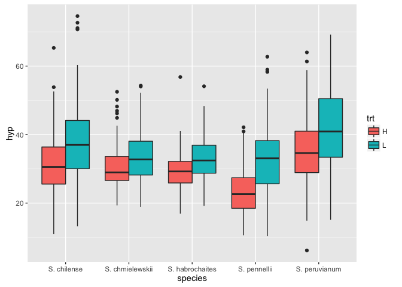

# Chapter-09.Rmd


Do a Bayesian analysis of hypocotyl length (hyp) in the attached data sheet.

1) Consider treatment effects (trt) species effects (species) and their interaction.  What is the best model given these possible predictors?

2) Use "S. chmielewskii" as the reference.  For each of the other species evaluate the hypothesis that their response to shade differs from S. chmielewskii.


```r
library("rethinking")
```

```
## Loading required package: rstan
```

```
## Loading required package: ggplot2
```

```
## Loading required package: StanHeaders
```

```
## rstan (Version 2.11.1, packaged: 2016-07-28 18:19:31 UTC, GitRev: 85f7a56811da)
```

```
## For execution on a local, multicore CPU with excess RAM we recommend calling
## rstan_options(auto_write = TRUE)
## options(mc.cores = parallel::detectCores())
```

```
## Loading required package: parallel
```

```
## rethinking (Version 1.59)
```

```r
d = read.csv("/Users/gturco/Documents/code/Rclub-rethinking_Gina.Turco/Assignment_Chapter_09/TomatoR2CSHL.csv",header=TRUE)


d$trt.h <- ifelse( d$trt=="H" , 1 , 0 )


CHS.trt <- map(
    alist(
        hyp ~ dnorm( mu , sigma ) ,
        mu <- a + bT*trt.h  ,
        a ~ dnorm( 33 , 10 ) ,
        bT ~ dnorm( 0 , 1 ) ,
        sigma ~ dunif( 0 , 10 )
) , data = d ) 

precis(CHS.trt)
```

```
##        Mean StdDev  5.5% 94.5%
## a     35.26   0.40 34.63 35.89
## bT    -3.88   0.52 -4.71 -3.05
## sigma  9.60   0.21  9.26  9.95
```

```r
plot(precis(CHS.trt))
```

<!-- -->

```r
d$species.chmiel <- ifelse( d$species=="S. chmielewskii" , 1 , 0 )
d$species.hab <- ifelse( d$species=="S. habrochaites" , 1 , 0 )
d$species.penn <- ifelse( d$species=="S. pennellii" , 1 , 0 )
d$species.per <- ifelse( d$species=="S. peruvianum" , 1 , 0 )


CHS.species <- map(
    alist(
        hyp ~ dnorm( mu , sigma ) ,
        mu <- a + bP*species.penn + bR*species.per + bH*species.hab + bC*species.chmiel  ,
        a ~ dnorm( 33 , 10 ) ,
        bP ~ dnorm( 0 , 1 ) ,
        bR ~ dnorm( 0 , 1 ) ,
        bH ~ dnorm( 0 , 1 ) ,
        bC ~ dnorm( 0 , 1 ) ,
        sigma ~ dunif( 0 , 10 )
) , data = d ) 

precis(CHS.species)
```

```
##        Mean StdDev  5.5% 94.5%
## a     33.67   0.45 32.96 34.38
## bP    -2.92   0.69 -4.02 -1.81
## bR     3.42   0.63  2.42  4.42
## bH    -1.86   0.62 -2.85 -0.86
## bC    -1.14   0.62 -2.14 -0.15
## sigma  9.47   0.21  9.13  9.81
```

```r
plot(precis(CHS.species))
```

<!-- -->

```r
#CHS. <- map2stan(
#    alist(
#        hyp ~ dnorm( mu , sigma ) ,
#        mu <- a + bT*trt * bS*species  + bTS*trt*species ,
#        a ~ dnorm( 10 , 10 ) ,
#        bT ~ dnorm( 0 , 1 ) ,
#        bS ~ dnorm( 0 , 1 ) ,
#        bTS ~ dnorm( 0 , 1 ) ,
#        sigma ~ dunif( 0 , 10 )
#) , data = d,iter=1e4, warmup=100 , WAIC=FALSE ) 

#plot(m.CHS)
```

