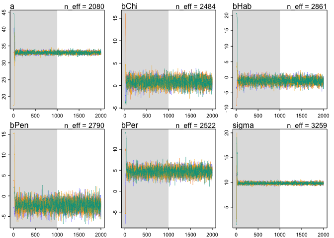
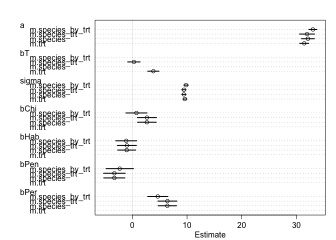
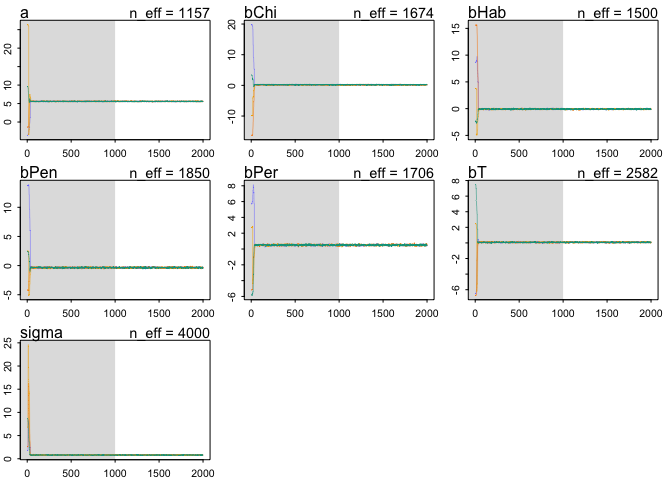

# Chapter-09.Rmd


Do a Bayesian analysis of hypocotyl length (hyp) in the attached data sheet.

1) Consider treatment effects (trt) species effects (species) and their interaction.  What is the best model given these possible predictors?

2) Use "S. chmielewskii" as the reference.  For each of the other species evaluate the hypothesis that their response to shade differs from S. chmielewskii.

# Load and Look at Data


```r
library("rethinking")
```

```
## Loading required package: rstan
```

```
## Loading required package: ggplot2
```

```
## Loading required package: StanHeaders
```

```
## rstan (Version 2.11.1, packaged: 2016-07-28 18:19:31 UTC, GitRev: 85f7a56811da)
```

```
## For execution on a local, multicore CPU with excess RAM we recommend calling
## rstan_options(auto_write = TRUE)
## options(mc.cores = parallel::detectCores())
```

```
## Loading required package: parallel
```

```
## rethinking (Version 1.59)
```

```r
library("ggplot2")
library("reshape2")

d = read.csv("/Users/gturco/Documents/2011_2016_PHD/code/Rclub-rethinking_Gina.Turco/Assignment_Chapter_09/TomatoR2CSHL.csv",header=TRUE)

### first look at the data does it look how we cant it to look
head(d)
```

```
##   shelf flat col row    acs trt days   date   hyp int1 int2 int3 int4
## 1     Z    1   B   1 LA2580   H   28 5/5/08 19.46 2.37 1.59 1.87 0.51
## 2     Z    1   C   1 LA1305   H   28 5/5/08 31.28 3.34 0.01 9.19 1.62
## 3     Z    1   D   1 LA1973   H   28 5/5/08 56.65 8.43 2.39 6.70 3.69
## 4     Z    1   E   1 LA2748   H   28 5/5/08 35.18 0.56 0.00 1.60 0.61
## 5     Z    1   F   1 LA2931   H   28 5/5/08 35.32 0.82 0.02 1.49 0.46
## 6     Z    1   G   1 LA1317   H   28 5/5/08 28.74 1.07 6.69 5.72 4.76
##   intleng totleng petleng leafleng leafwid leafnum ndvi      lat      lon
## 1    6.34   25.80   15.78    30.53   34.44       5  111  -9.5167 -78.0083
## 2   14.16   45.44   12.36    22.93   13.99       4  120 -13.3833 -75.3583
## 3   21.21   77.86   13.05    46.71   43.78       5  110 -16.2333 -71.7000
## 4    2.77   37.95    8.08    26.82   33.28       5  105 -20.4833 -69.9833
## 5    2.79   38.11    7.68    22.40   23.61       5  106 -20.9167 -69.0667
## 6   18.24   46.98   23.66    42.35   42.35       5  132 -13.4167 -73.8417
##    alt         species who
## 1  740    S. pennellii Dan
## 2 3360   S. peruvianum Dan
## 3 2585   S. peruvianum Dan
## 4 1020     S. chilense Dan
## 5 2460     S. chilense Dan
## 6 2000 S. chmielewskii Dan
```

```r
### how is it cat the data does it think it is numeric, flat for example is not a factor as trtment is.. also check if things where inported at lowercase or upercase. Also see if any missing data point
summary(d)
```

```
##  shelf        flat            col           row            acs     
##  U:161   Min.   : 1.00   G      :133   Min.   :1.00   LA1954 : 40  
##  V:174   1st Qu.: 9.00   H      :127   1st Qu.:2.00   LA2695 : 39  
##  W:178   Median :17.00   F      :125   Median :3.00   LA1361 : 37  
##  X:174   Mean   :17.89   C      :117   Mean   :2.56   LA2167 : 37  
##  Y:125   3rd Qu.:28.00   D      :117   3rd Qu.:4.00   LA2773 : 37  
##  Z:196   Max.   :36.00   E      :107   Max.   :4.00   LA1474 : 36  
##                          (Other):282                  (Other):782  
##  trt          days           date          hyp             int1      
##  H:495   Min.   :28.00   5/5/08:716   Min.   : 6.17   Min.   : 0.00  
##  L:513   1st Qu.:28.00   5/6/08:292   1st Qu.:26.81   1st Qu.: 1.74  
##          Median :28.00                Median :32.02   Median : 3.59  
##          Mean   :28.29                Mean   :33.36   Mean   : 4.71  
##          3rd Qu.:29.00                3rd Qu.:38.56   3rd Qu.: 6.46  
##          Max.   :29.00                Max.   :74.60   Max.   :39.01  
##                                                       NA's   :1      
##       int2             int3             int4           intleng      
##  Min.   : 0.000   Min.   : 0.010   Min.   : 0.030   Min.   : 0.000  
##  1st Qu.: 1.060   1st Qu.: 2.975   1st Qu.: 2.163   1st Qu.: 9.637  
##  Median : 3.120   Median : 5.625   Median : 3.995   Median :17.255  
##  Mean   : 4.287   Mean   : 6.794   Mean   : 5.102   Mean   :20.340  
##  3rd Qu.: 6.320   3rd Qu.: 9.367   3rd Qu.: 7.018   3rd Qu.:28.145  
##  Max.   :28.980   Max.   :27.760   Max.   :23.280   Max.   :92.420  
##  NA's   :1        NA's   :4        NA's   :102                      
##     totleng          petleng         leafleng        leafwid     
##  Min.   : 13.59   Min.   : 1.53   Min.   : 9.74   Min.   : 8.29  
##  1st Qu.: 39.25   1st Qu.:11.20   1st Qu.:27.43   1st Qu.:29.48  
##  Median : 50.98   Median :15.13   Median :34.59   Median :39.62  
##  Mean   : 53.70   Mean   :15.92   Mean   :35.54   Mean   :39.29  
##  3rd Qu.: 64.76   3rd Qu.:20.48   3rd Qu.:42.98   3rd Qu.:47.75  
##  Max.   :129.43   Max.   :44.44   Max.   :95.19   Max.   :90.27  
##                   NA's   :2       NA's   :1       NA's   :1      
##     leafnum           ndvi          lat               lon        
##  Min.   :3.000   Min.   :100   Min.   :-25.400   Min.   :-78.52  
##  1st Qu.:5.000   1st Qu.:108   1st Qu.:-16.607   1st Qu.:-75.92  
##  Median :5.000   Median :115   Median :-14.152   Median :-73.63  
##  Mean   :5.063   Mean   :118   Mean   :-14.490   Mean   :-73.71  
##  3rd Qu.:6.000   3rd Qu.:128   3rd Qu.:-12.450   3rd Qu.:-71.70  
##  Max.   :8.000   Max.   :137   Max.   : -5.767   Max.   :-68.07  
##  NA's   :1                                                       
##       alt                  species      who     
##  Min.   :   0   S. chilense    :207   Dan :402  
##  1st Qu.:1020   S. chmielewskii:226   Pepe:606  
##  Median :2240   S. habrochaites:226             
##  Mean   :2035   S. pennellii   :132             
##  3rd Qu.:3110   S. peruvianum  :217             
##  Max.   :3540                                   
## 
```

```r
ggplot(data=d,aes(x=hyp,fill=trt)) + geom_density() + facet_grid(species~trt)
```

<!-- -->

```r
ggplot(data=d,aes(y=hyp,x=species,fill=trt)) + geom_boxplot() 
```

<!-- -->

# fit model by treatment

```r
d$trt.l <- ifelse( d$trt=="L" , 1 , 0 )
levels(d$trt)
```

```
## [1] "H" "L"
```

```r
d.trt <- d[,c("hyp","trt.l")]

m.trt <- map2stan(
    alist(
        hyp ~ dnorm( mu , sigma ) ,
        mu <- a + bT*trt.l  ,
        a ~ dnorm( 33 , 10 ) ,
        bT ~ dnorm( 0 , 1 ) ,
        sigma ~ dunif( 0 , 10 )
) , data = d.trt ) 
```

```
## Warning: Variable 'trt.l' contains dots '.'.
## Will attempt to remove dots internally.
```

```
## In file included from file5c88b264eb5.cpp:8:
## In file included from /Library/Frameworks/R.framework/Versions/3.3/Resources/library/StanHeaders/include/src/stan/model/model_header.hpp:4:
## In file included from /Library/Frameworks/R.framework/Versions/3.3/Resources/library/StanHeaders/include/stan/math.hpp:4:
## In file included from /Library/Frameworks/R.framework/Versions/3.3/Resources/library/StanHeaders/include/stan/math/rev/mat.hpp:4:
## In file included from /Library/Frameworks/R.framework/Versions/3.3/Resources/library/StanHeaders/include/stan/math/rev/core.hpp:42:
## /Library/Frameworks/R.framework/Versions/3.3/Resources/library/StanHeaders/include/stan/math/rev/core/set_zero_all_adjoints.hpp:14:17: warning: unused function 'set_zero_all_adjoints' [-Wunused-function]
##     static void set_zero_all_adjoints() {
##                 ^
## In file included from file5c88b264eb5.cpp:8:
## In file included from /Library/Frameworks/R.framework/Versions/3.3/Resources/library/StanHeaders/include/src/stan/model/model_header.hpp:4:
## In file included from /Library/Frameworks/R.framework/Versions/3.3/Resources/library/StanHeaders/include/stan/math.hpp:4:
## In file included from /Library/Frameworks/R.framework/Versions/3.3/Resources/library/StanHeaders/include/stan/math/rev/mat.hpp:4:
## In file included from /Library/Frameworks/R.framework/Versions/3.3/Resources/library/StanHeaders/include/stan/math/rev/core.hpp:43:
## /Library/Frameworks/R.framework/Versions/3.3/Resources/library/StanHeaders/include/stan/math/rev/core/set_zero_all_adjoints_nested.hpp:17:17: warning: 'static' function 'set_zero_all_adjoints_nested' declared in header file should be declared 'static inline' [-Wunneeded-internal-declaration]
##     static void set_zero_all_adjoints_nested() {
##                 ^
## In file included from file5c88b264eb5.cpp:8:
## In file included from /Library/Frameworks/R.framework/Versions/3.3/Resources/library/StanHeaders/include/src/stan/model/model_header.hpp:4:
## In file included from /Library/Frameworks/R.framework/Versions/3.3/Resources/library/StanHeaders/include/stan/math.hpp:4:
## In file included from /Library/Frameworks/R.framework/Versions/3.3/Resources/library/StanHeaders/include/stan/math/rev/mat.hpp:9:
## In file included from /Library/Frameworks/R.framework/Versions/3.3/Resources/library/StanHeaders/include/stan/math/prim/mat.hpp:55:
## /Library/Frameworks/R.framework/Versions/3.3/Resources/library/StanHeaders/include/stan/math/prim/mat/fun/autocorrelation.hpp:19:14: warning: function 'fft_next_good_size' is not needed and will not be emitted [-Wunneeded-internal-declaration]
##       size_t fft_next_good_size(size_t N) {
##              ^
## In file included from file5c88b264eb5.cpp:8:
## In file included from /Library/Frameworks/R.framework/Versions/3.3/Resources/library/StanHeaders/include/src/stan/model/model_header.hpp:4:
## In file included from /Library/Frameworks/R.framework/Versions/3.3/Resources/library/StanHeaders/include/stan/math.hpp:4:
## In file included from /Library/Frameworks/R.framework/Versions/3.3/Resources/library/StanHeaders/include/stan/math/rev/mat.hpp:9:
## In file included from /Library/Frameworks/R.framework/Versions/3.3/Resources/library/StanHeaders/include/stan/math/prim/mat.hpp:36:
## /Library/Frameworks/R.framework/Versions/3.3/Resources/library/StanHeaders/include/stan/math/prim/mat/err/check_positive_ordered.hpp:39:67: warning: unused typedef 'size_type' [-Wunused-local-typedef]
##       typedef typename index_type<Matrix<T_y, Dynamic, 1> >::type size_type;
##                                                                   ^
## In file included from file5c88b264eb5.cpp:8:
## In file included from /Library/Frameworks/R.framework/Versions/3.3/Resources/library/StanHeaders/include/src/stan/model/model_header.hpp:4:
## In file included from /Library/Frameworks/R.framework/Versions/3.3/Resources/library/StanHeaders/include/stan/math.hpp:4:
## In file included from /Library/Frameworks/R.framework/Versions/3.3/Resources/library/StanHeaders/include/stan/math/rev/mat.hpp:9:
## In file included from /Library/Frameworks/R.framework/Versions/3.3/Resources/library/StanHeaders/include/stan/math/prim/mat.hpp:235:
## In file included from /Library/Frameworks/R.framework/Versions/3.3/Resources/library/StanHeaders/include/stan/math/prim/arr.hpp:32:
## In file included from /Library/Frameworks/R.framework/Versions/3.3/Resources/library/StanHeaders/include/stan/math/prim/arr/functor/integrate_ode_rk45.hpp:13:
## In file included from /Library/Frameworks/R.framework/Versions/3.3/Resources/library/BH/include/boost/numeric/odeint.hpp:61:
## In file included from /Library/Frameworks/R.framework/Versions/3.3/Resources/library/BH/include/boost/numeric/odeint/util/multi_array_adaption.hpp:29:
## In file included from /Library/Frameworks/R.framework/Versions/3.3/Resources/library/BH/include/boost/multi_array.hpp:21:
## In file included from /Library/Frameworks/R.framework/Versions/3.3/Resources/library/BH/include/boost/multi_array/base.hpp:28:
## /Library/Frameworks/R.framework/Versions/3.3/Resources/library/BH/include/boost/multi_array/concept_checks.hpp:42:43: warning: unused typedef 'index_range' [-Wunused-local-typedef]
##       typedef typename Array::index_range index_range;
##                                           ^
## /Library/Frameworks/R.framework/Versions/3.3/Resources/library/BH/include/boost/multi_array/concept_checks.hpp:43:37: warning: unused typedef 'index' [-Wunused-local-typedef]
##       typedef typename Array::index index;
##                                     ^
## /Library/Frameworks/R.framework/Versions/3.3/Resources/library/BH/include/boost/multi_array/concept_checks.hpp:53:43: warning: unused typedef 'index_range' [-Wunused-local-typedef]
##       typedef typename Array::index_range index_range;
##                                           ^
## /Library/Frameworks/R.framework/Versions/3.3/Resources/library/BH/include/boost/multi_array/concept_checks.hpp:54:37: warning: unused typedef 'index' [-Wunused-local-typedef]
##       typedef typename Array::index index;
##                                     ^
## 8 warnings generated.
## 
## SAMPLING FOR MODEL 'hyp ~ dnorm(mu, sigma)' NOW (CHAIN 1).
## 
## Chain 1, Iteration:    1 / 2000 [  0%]  (Warmup)
## Chain 1, Iteration:  200 / 2000 [ 10%]  (Warmup)
## Chain 1, Iteration:  400 / 2000 [ 20%]  (Warmup)
## Chain 1, Iteration:  600 / 2000 [ 30%]  (Warmup)
## Chain 1, Iteration:  800 / 2000 [ 40%]  (Warmup)
## Chain 1, Iteration: 1000 / 2000 [ 50%]  (Warmup)
## Chain 1, Iteration: 1001 / 2000 [ 50%]  (Sampling)
## Chain 1, Iteration: 1200 / 2000 [ 60%]  (Sampling)
## Chain 1, Iteration: 1400 / 2000 [ 70%]  (Sampling)
## Chain 1, Iteration: 1600 / 2000 [ 80%]  (Sampling)
## Chain 1, Iteration: 1800 / 2000 [ 90%]  (Sampling)
## Chain 1, Iteration: 2000 / 2000 [100%]  (Sampling)
##  Elapsed Time: 0.265352 seconds (Warm-up)
##                0.272157 seconds (Sampling)
##                0.537509 seconds (Total)
## 
## 
## SAMPLING FOR MODEL 'hyp ~ dnorm(mu, sigma)' NOW (CHAIN 1).
## WARNING: No variance estimation is
##          performed for num_warmup < 20
## 
## 
## Chain 1, Iteration: 1 / 1 [100%]  (Sampling)
##  Elapsed Time: 4e-06 seconds (Warm-up)
##                0.00019 seconds (Sampling)
##                0.000194 seconds (Total)
```

```
## Computing WAIC
```

```
## Constructing posterior predictions
```

```
## [ 100 / 1000 ]
[ 200 / 1000 ]
[ 300 / 1000 ]
[ 400 / 1000 ]
[ 500 / 1000 ]
[ 600 / 1000 ]
[ 700 / 1000 ]
[ 800 / 1000 ]
[ 900 / 1000 ]
[ 1000 / 1000 ]
```

```r
precis(m.trt)
```

```
##        Mean StdDev lower 0.89 upper 0.89 n_eff Rhat
## a     31.42   0.42      30.75      32.06   265    1
## bT     3.84   0.52       2.94       4.55   316    1
## sigma  9.60   0.19       9.30       9.90   622    1
```

```r
plot(precis(m.trt))
```

<!-- -->

Treatment changes the slope of the mean by aprox 3 cm


# fit the model by species


```r
d.species <- d[,c("hyp","species")]
d.species$id <- 1:nrow(d.species)

### what do you want to be in each row ~ what do you want the rest of the collems to be, lengths gives us zeros or ones depending on which vaule it is.. need id/index so that it doesnt combine simlar values into a singel row.
d.species <- dcast(d.species, hyp + id ~ species, value.var="species", fun.aggregate = length)
colnames(d.species) <- sub(". ","_",fixed = TRUE, colnames(d.species))
head(d.species)
```

```
##     hyp  id S_chilense S_chmielewskii S_habrochaites S_pennellii
## 1  6.17 779          0              0              0           0
## 2 10.32 646          0              0              0           1
## 3 10.61 439          0              0              0           1
## 4 11.01 892          1              0              0           0
## 5 12.18 185          1              0              0           0
## 6 12.55  43          0              0              0           1
##   S_peruvianum
## 1            1
## 2            0
## 3            0
## 4            0
## 5            0
## 6            0
```

```r
d.species <- d.species[,c(-2,-4)]


m.species <- map2stan(
  alist(
    hyp ~ dnorm(mu,sigma),
    mu <- a + bChi * S_chilense + bHab * S_habrochaites + bPen * S_pennellii + bPer * S_peruvianum,
    a ~ dnorm(mu=33,sd=10),
    c(bChi, bHab, bPen, bPer) ~ dnorm(0,10),
    sigma ~ dcauchy(0,1)),
    data=d.species, chains=4, cores = 1)
```

```
## In file included from file5c88700a1658.cpp:8:
## In file included from /Library/Frameworks/R.framework/Versions/3.3/Resources/library/StanHeaders/include/src/stan/model/model_header.hpp:4:
## In file included from /Library/Frameworks/R.framework/Versions/3.3/Resources/library/StanHeaders/include/stan/math.hpp:4:
## In file included from /Library/Frameworks/R.framework/Versions/3.3/Resources/library/StanHeaders/include/stan/math/rev/mat.hpp:4:
## In file included from /Library/Frameworks/R.framework/Versions/3.3/Resources/library/StanHeaders/include/stan/math/rev/core.hpp:42:
## /Library/Frameworks/R.framework/Versions/3.3/Resources/library/StanHeaders/include/stan/math/rev/core/set_zero_all_adjoints.hpp:14:17: warning: unused function 'set_zero_all_adjoints' [-Wunused-function]
##     static void set_zero_all_adjoints() {
##                 ^
## In file included from file5c88700a1658.cpp:8:
## In file included from /Library/Frameworks/R.framework/Versions/3.3/Resources/library/StanHeaders/include/src/stan/model/model_header.hpp:4:
## In file included from /Library/Frameworks/R.framework/Versions/3.3/Resources/library/StanHeaders/include/stan/math.hpp:4:
## In file included from /Library/Frameworks/R.framework/Versions/3.3/Resources/library/StanHeaders/include/stan/math/rev/mat.hpp:4:
## In file included from /Library/Frameworks/R.framework/Versions/3.3/Resources/library/StanHeaders/include/stan/math/rev/core.hpp:43:
## /Library/Frameworks/R.framework/Versions/3.3/Resources/library/StanHeaders/include/stan/math/rev/core/set_zero_all_adjoints_nested.hpp:17:17: warning: 'static' function 'set_zero_all_adjoints_nested' declared in header file should be declared 'static inline' [-Wunneeded-internal-declaration]
##     static void set_zero_all_adjoints_nested() {
##                 ^
## In file included from file5c88700a1658.cpp:8:
## In file included from /Library/Frameworks/R.framework/Versions/3.3/Resources/library/StanHeaders/include/src/stan/model/model_header.hpp:4:
## In file included from /Library/Frameworks/R.framework/Versions/3.3/Resources/library/StanHeaders/include/stan/math.hpp:4:
## In file included from /Library/Frameworks/R.framework/Versions/3.3/Resources/library/StanHeaders/include/stan/math/rev/mat.hpp:9:
## In file included from /Library/Frameworks/R.framework/Versions/3.3/Resources/library/StanHeaders/include/stan/math/prim/mat.hpp:55:
## /Library/Frameworks/R.framework/Versions/3.3/Resources/library/StanHeaders/include/stan/math/prim/mat/fun/autocorrelation.hpp:19:14: warning: function 'fft_next_good_size' is not needed and will not be emitted [-Wunneeded-internal-declaration]
##       size_t fft_next_good_size(size_t N) {
##              ^
## In file included from file5c88700a1658.cpp:8:
## In file included from /Library/Frameworks/R.framework/Versions/3.3/Resources/library/StanHeaders/include/src/stan/model/model_header.hpp:4:
## In file included from /Library/Frameworks/R.framework/Versions/3.3/Resources/library/StanHeaders/include/stan/math.hpp:4:
## In file included from /Library/Frameworks/R.framework/Versions/3.3/Resources/library/StanHeaders/include/stan/math/rev/mat.hpp:9:
## In file included from /Library/Frameworks/R.framework/Versions/3.3/Resources/library/StanHeaders/include/stan/math/prim/mat.hpp:36:
## /Library/Frameworks/R.framework/Versions/3.3/Resources/library/StanHeaders/include/stan/math/prim/mat/err/check_positive_ordered.hpp:39:67: warning: unused typedef 'size_type' [-Wunused-local-typedef]
##       typedef typename index_type<Matrix<T_y, Dynamic, 1> >::type size_type;
##                                                                   ^
## In file included from file5c88700a1658.cpp:8:
## In file included from /Library/Frameworks/R.framework/Versions/3.3/Resources/library/StanHeaders/include/src/stan/model/model_header.hpp:4:
## In file included from /Library/Frameworks/R.framework/Versions/3.3/Resources/library/StanHeaders/include/stan/math.hpp:4:
## In file included from /Library/Frameworks/R.framework/Versions/3.3/Resources/library/StanHeaders/include/stan/math/rev/mat.hpp:9:
## In file included from /Library/Frameworks/R.framework/Versions/3.3/Resources/library/StanHeaders/include/stan/math/prim/mat.hpp:235:
## In file included from /Library/Frameworks/R.framework/Versions/3.3/Resources/library/StanHeaders/include/stan/math/prim/arr.hpp:32:
## In file included from /Library/Frameworks/R.framework/Versions/3.3/Resources/library/StanHeaders/include/stan/math/prim/arr/functor/integrate_ode_rk45.hpp:13:
## In file included from /Library/Frameworks/R.framework/Versions/3.3/Resources/library/BH/include/boost/numeric/odeint.hpp:61:
## In file included from /Library/Frameworks/R.framework/Versions/3.3/Resources/library/BH/include/boost/numeric/odeint/util/multi_array_adaption.hpp:29:
## In file included from /Library/Frameworks/R.framework/Versions/3.3/Resources/library/BH/include/boost/multi_array.hpp:21:
## In file included from /Library/Frameworks/R.framework/Versions/3.3/Resources/library/BH/include/boost/multi_array/base.hpp:28:
## /Library/Frameworks/R.framework/Versions/3.3/Resources/library/BH/include/boost/multi_array/concept_checks.hpp:42:43: warning: unused typedef 'index_range' [-Wunused-local-typedef]
##       typedef typename Array::index_range index_range;
##                                           ^
## /Library/Frameworks/R.framework/Versions/3.3/Resources/library/BH/include/boost/multi_array/concept_checks.hpp:43:37: warning: unused typedef 'index' [-Wunused-local-typedef]
##       typedef typename Array::index index;
##                                     ^
## /Library/Frameworks/R.framework/Versions/3.3/Resources/library/BH/include/boost/multi_array/concept_checks.hpp:53:43: warning: unused typedef 'index_range' [-Wunused-local-typedef]
##       typedef typename Array::index_range index_range;
##                                           ^
## /Library/Frameworks/R.framework/Versions/3.3/Resources/library/BH/include/boost/multi_array/concept_checks.hpp:54:37: warning: unused typedef 'index' [-Wunused-local-typedef]
##       typedef typename Array::index index;
##                                     ^
## 8 warnings generated.
## 
## SAMPLING FOR MODEL 'hyp ~ dnorm(mu, sigma)' NOW (CHAIN 1).
## 
## Chain 1, Iteration:    1 / 2000 [  0%]  (Warmup)
## Chain 1, Iteration:  200 / 2000 [ 10%]  (Warmup)
## Chain 1, Iteration:  400 / 2000 [ 20%]  (Warmup)
## Chain 1, Iteration:  600 / 2000 [ 30%]  (Warmup)
## Chain 1, Iteration:  800 / 2000 [ 40%]  (Warmup)
## Chain 1, Iteration: 1000 / 2000 [ 50%]  (Warmup)
## Chain 1, Iteration: 1001 / 2000 [ 50%]  (Sampling)
## Chain 1, Iteration: 1200 / 2000 [ 60%]  (Sampling)
## Chain 1, Iteration: 1400 / 2000 [ 70%]  (Sampling)
## Chain 1, Iteration: 1600 / 2000 [ 80%]  (Sampling)
## Chain 1, Iteration: 1800 / 2000 [ 90%]  (Sampling)
## Chain 1, Iteration: 2000 / 2000 [100%]  (Sampling)
##  Elapsed Time: 2.38896 seconds (Warm-up)
##                1.20272 seconds (Sampling)
##                3.59168 seconds (Total)
## 
## 
## SAMPLING FOR MODEL 'hyp ~ dnorm(mu, sigma)' NOW (CHAIN 2).
## 
## Chain 2, Iteration:    1 / 2000 [  0%]  (Warmup)
## Chain 2, Iteration:  200 / 2000 [ 10%]  (Warmup)
## Chain 2, Iteration:  400 / 2000 [ 20%]  (Warmup)
## Chain 2, Iteration:  600 / 2000 [ 30%]  (Warmup)
## Chain 2, Iteration:  800 / 2000 [ 40%]  (Warmup)
## Chain 2, Iteration: 1000 / 2000 [ 50%]  (Warmup)
## Chain 2, Iteration: 1001 / 2000 [ 50%]  (Sampling)
## Chain 2, Iteration: 1200 / 2000 [ 60%]  (Sampling)
## Chain 2, Iteration: 1400 / 2000 [ 70%]  (Sampling)
## Chain 2, Iteration: 1600 / 2000 [ 80%]  (Sampling)
## Chain 2, Iteration: 1800 / 2000 [ 90%]  (Sampling)
## Chain 2, Iteration: 2000 / 2000 [100%]  (Sampling)
##  Elapsed Time: 1.96011 seconds (Warm-up)
##                1.06605 seconds (Sampling)
##                3.02616 seconds (Total)
## 
## 
## SAMPLING FOR MODEL 'hyp ~ dnorm(mu, sigma)' NOW (CHAIN 3).
## 
## Chain 3, Iteration:    1 / 2000 [  0%]  (Warmup)
## Chain 3, Iteration:  200 / 2000 [ 10%]  (Warmup)
## Chain 3, Iteration:  400 / 2000 [ 20%]  (Warmup)
## Chain 3, Iteration:  600 / 2000 [ 30%]  (Warmup)
## Chain 3, Iteration:  800 / 2000 [ 40%]  (Warmup)
## Chain 3, Iteration: 1000 / 2000 [ 50%]  (Warmup)
## Chain 3, Iteration: 1001 / 2000 [ 50%]  (Sampling)
## Chain 3, Iteration: 1200 / 2000 [ 60%]  (Sampling)
## Chain 3, Iteration: 1400 / 2000 [ 70%]  (Sampling)
## Chain 3, Iteration: 1600 / 2000 [ 80%]  (Sampling)
## Chain 3, Iteration: 1800 / 2000 [ 90%]  (Sampling)
## Chain 3, Iteration: 2000 / 2000 [100%]  (Sampling)
##  Elapsed Time: 2.26705 seconds (Warm-up)
##                1.20952 seconds (Sampling)
##                3.47657 seconds (Total)
## 
## 
## SAMPLING FOR MODEL 'hyp ~ dnorm(mu, sigma)' NOW (CHAIN 4).
## 
## Chain 4, Iteration:    1 / 2000 [  0%]  (Warmup)
## Chain 4, Iteration:  200 / 2000 [ 10%]  (Warmup)
## Chain 4, Iteration:  400 / 2000 [ 20%]  (Warmup)
## Chain 4, Iteration:  600 / 2000 [ 30%]  (Warmup)
## Chain 4, Iteration:  800 / 2000 [ 40%]  (Warmup)
## Chain 4, Iteration: 1000 / 2000 [ 50%]  (Warmup)
## Chain 4, Iteration: 1001 / 2000 [ 50%]  (Sampling)
## Chain 4, Iteration: 1200 / 2000 [ 60%]  (Sampling)
## Chain 4, Iteration: 1400 / 2000 [ 70%]  (Sampling)
## Chain 4, Iteration: 1600 / 2000 [ 80%]  (Sampling)
## Chain 4, Iteration: 1800 / 2000 [ 90%]  (Sampling)
## Chain 4, Iteration: 2000 / 2000 [100%]  (Sampling)
##  Elapsed Time: 2.2426 seconds (Warm-up)
##                1.15545 seconds (Sampling)
##                3.39806 seconds (Total)
## 
## 
## SAMPLING FOR MODEL 'hyp ~ dnorm(mu, sigma)' NOW (CHAIN 1).
## WARNING: No variance estimation is
##          performed for num_warmup < 20
## 
## 
## Chain 1, Iteration: 1 / 1 [100%]  (Sampling)
##  Elapsed Time: 4e-06 seconds (Warm-up)
##                0.000321 seconds (Sampling)
##                0.000325 seconds (Total)
```

```
## Computing WAIC
```

```
## Constructing posterior predictions
```

```
## [ 400 / 4000 ]
[ 800 / 4000 ]
[ 1200 / 4000 ]
[ 1600 / 4000 ]
[ 2000 / 4000 ]
[ 2400 / 4000 ]
[ 2800 / 4000 ]
[ 3200 / 4000 ]
[ 3600 / 4000 ]
[ 4000 / 4000 ]
```

```r
plot(m.species)
```

<!-- -->

```r
par(mfrow=c(1,1),mfcol=c(1,1))
pairs(m.species)
```

<!-- -->

```r
precis(m.species)
```

```
##        Mean StdDev lower 0.89 upper 0.89 n_eff Rhat
## a     32.10   0.60      31.11      33.02  1418    1
## bChi   2.66   0.87       1.28       4.04  1793    1
## bHab  -1.03   0.84      -2.37       0.29  1790    1
## bPen  -3.29   0.98      -4.78      -1.66  1769    1
## bPer   6.40   0.85       4.96       7.69  1729    1
## sigma  9.43   0.20       9.08       9.71  3274    1
```

```r
plot(precis(m.species))
```

<!-- -->

There is a species interaction some interact below and some interact above the mean. Hab and Pen lower than the mean while Pen and Per are higher.

# species and treatment model

```r
trt_l <- d$trt.l
d.species_trt <- cbind(d.species,trt_l)
summary(d.species_trt)
```

```
##       hyp          S_chilense     S_habrochaites    S_pennellii   
##  Min.   : 6.17   Min.   :0.0000   Min.   :0.0000   Min.   :0.000  
##  1st Qu.:26.81   1st Qu.:0.0000   1st Qu.:0.0000   1st Qu.:0.000  
##  Median :32.02   Median :0.0000   Median :0.0000   Median :0.000  
##  Mean   :33.36   Mean   :0.2054   Mean   :0.2242   Mean   :0.131  
##  3rd Qu.:38.56   3rd Qu.:0.0000   3rd Qu.:0.0000   3rd Qu.:0.000  
##  Max.   :74.60   Max.   :1.0000   Max.   :1.0000   Max.   :1.000  
##   S_peruvianum        trt_l       
##  Min.   :0.0000   Min.   :0.0000  
##  1st Qu.:0.0000   1st Qu.:0.0000  
##  Median :0.0000   Median :1.0000  
##  Mean   :0.2153   Mean   :0.5089  
##  3rd Qu.:0.0000   3rd Qu.:1.0000  
##  Max.   :1.0000   Max.   :1.0000
```

```r
m.species_trt <- map2stan(
  alist(
    hyp ~ dnorm(mu,sigma),
    mu <- a + bT*trt_l + bChi * S_chilense + bHab * S_habrochaites + bPen * S_pennellii + bPer * S_peruvianum,
    a ~ dnorm(mu=33,sd=10),
    c(bChi, bHab, bPen, bPer, bT) ~ dnorm(0,10),
    sigma ~ dcauchy(0,1)),
    data=d.species_trt, chains=4, cores = 1)
```

```
## In file included from file5c887c7b09ee.cpp:8:
## In file included from /Library/Frameworks/R.framework/Versions/3.3/Resources/library/StanHeaders/include/src/stan/model/model_header.hpp:4:
## In file included from /Library/Frameworks/R.framework/Versions/3.3/Resources/library/StanHeaders/include/stan/math.hpp:4:
## In file included from /Library/Frameworks/R.framework/Versions/3.3/Resources/library/StanHeaders/include/stan/math/rev/mat.hpp:4:
## In file included from /Library/Frameworks/R.framework/Versions/3.3/Resources/library/StanHeaders/include/stan/math/rev/core.hpp:42:
## /Library/Frameworks/R.framework/Versions/3.3/Resources/library/StanHeaders/include/stan/math/rev/core/set_zero_all_adjoints.hpp:14:17: warning: unused function 'set_zero_all_adjoints' [-Wunused-function]
##     static void set_zero_all_adjoints() {
##                 ^
## In file included from file5c887c7b09ee.cpp:8:
## In file included from /Library/Frameworks/R.framework/Versions/3.3/Resources/library/StanHeaders/include/src/stan/model/model_header.hpp:4:
## In file included from /Library/Frameworks/R.framework/Versions/3.3/Resources/library/StanHeaders/include/stan/math.hpp:4:
## In file included from /Library/Frameworks/R.framework/Versions/3.3/Resources/library/StanHeaders/include/stan/math/rev/mat.hpp:4:
## In file included from /Library/Frameworks/R.framework/Versions/3.3/Resources/library/StanHeaders/include/stan/math/rev/core.hpp:43:
## /Library/Frameworks/R.framework/Versions/3.3/Resources/library/StanHeaders/include/stan/math/rev/core/set_zero_all_adjoints_nested.hpp:17:17: warning: 'static' function 'set_zero_all_adjoints_nested' declared in header file should be declared 'static inline' [-Wunneeded-internal-declaration]
##     static void set_zero_all_adjoints_nested() {
##                 ^
## In file included from file5c887c7b09ee.cpp:8:
## In file included from /Library/Frameworks/R.framework/Versions/3.3/Resources/library/StanHeaders/include/src/stan/model/model_header.hpp:4:
## In file included from /Library/Frameworks/R.framework/Versions/3.3/Resources/library/StanHeaders/include/stan/math.hpp:4:
## In file included from /Library/Frameworks/R.framework/Versions/3.3/Resources/library/StanHeaders/include/stan/math/rev/mat.hpp:9:
## In file included from /Library/Frameworks/R.framework/Versions/3.3/Resources/library/StanHeaders/include/stan/math/prim/mat.hpp:55:
## /Library/Frameworks/R.framework/Versions/3.3/Resources/library/StanHeaders/include/stan/math/prim/mat/fun/autocorrelation.hpp:19:14: warning: function 'fft_next_good_size' is not needed and will not be emitted [-Wunneeded-internal-declaration]
##       size_t fft_next_good_size(size_t N) {
##              ^
## In file included from file5c887c7b09ee.cpp:8:
## In file included from /Library/Frameworks/R.framework/Versions/3.3/Resources/library/StanHeaders/include/src/stan/model/model_header.hpp:4:
## In file included from /Library/Frameworks/R.framework/Versions/3.3/Resources/library/StanHeaders/include/stan/math.hpp:4:
## In file included from /Library/Frameworks/R.framework/Versions/3.3/Resources/library/StanHeaders/include/stan/math/rev/mat.hpp:9:
## In file included from /Library/Frameworks/R.framework/Versions/3.3/Resources/library/StanHeaders/include/stan/math/prim/mat.hpp:36:
## /Library/Frameworks/R.framework/Versions/3.3/Resources/library/StanHeaders/include/stan/math/prim/mat/err/check_positive_ordered.hpp:39:67: warning: unused typedef 'size_type' [-Wunused-local-typedef]
##       typedef typename index_type<Matrix<T_y, Dynamic, 1> >::type size_type;
##                                                                   ^
## In file included from file5c887c7b09ee.cpp:8:
## In file included from /Library/Frameworks/R.framework/Versions/3.3/Resources/library/StanHeaders/include/src/stan/model/model_header.hpp:4:
## In file included from /Library/Frameworks/R.framework/Versions/3.3/Resources/library/StanHeaders/include/stan/math.hpp:4:
## In file included from /Library/Frameworks/R.framework/Versions/3.3/Resources/library/StanHeaders/include/stan/math/rev/mat.hpp:9:
## In file included from /Library/Frameworks/R.framework/Versions/3.3/Resources/library/StanHeaders/include/stan/math/prim/mat.hpp:235:
## In file included from /Library/Frameworks/R.framework/Versions/3.3/Resources/library/StanHeaders/include/stan/math/prim/arr.hpp:32:
## In file included from /Library/Frameworks/R.framework/Versions/3.3/Resources/library/StanHeaders/include/stan/math/prim/arr/functor/integrate_ode_rk45.hpp:13:
## In file included from /Library/Frameworks/R.framework/Versions/3.3/Resources/library/BH/include/boost/numeric/odeint.hpp:61:
## In file included from /Library/Frameworks/R.framework/Versions/3.3/Resources/library/BH/include/boost/numeric/odeint/util/multi_array_adaption.hpp:29:
## In file included from /Library/Frameworks/R.framework/Versions/3.3/Resources/library/BH/include/boost/multi_array.hpp:21:
## In file included from /Library/Frameworks/R.framework/Versions/3.3/Resources/library/BH/include/boost/multi_array/base.hpp:28:
## /Library/Frameworks/R.framework/Versions/3.3/Resources/library/BH/include/boost/multi_array/concept_checks.hpp:42:43: warning: unused typedef 'index_range' [-Wunused-local-typedef]
##       typedef typename Array::index_range index_range;
##                                           ^
## /Library/Frameworks/R.framework/Versions/3.3/Resources/library/BH/include/boost/multi_array/concept_checks.hpp:43:37: warning: unused typedef 'index' [-Wunused-local-typedef]
##       typedef typename Array::index index;
##                                     ^
## /Library/Frameworks/R.framework/Versions/3.3/Resources/library/BH/include/boost/multi_array/concept_checks.hpp:53:43: warning: unused typedef 'index_range' [-Wunused-local-typedef]
##       typedef typename Array::index_range index_range;
##                                           ^
## /Library/Frameworks/R.framework/Versions/3.3/Resources/library/BH/include/boost/multi_array/concept_checks.hpp:54:37: warning: unused typedef 'index' [-Wunused-local-typedef]
##       typedef typename Array::index index;
##                                     ^
## 8 warnings generated.
## 
## SAMPLING FOR MODEL 'hyp ~ dnorm(mu, sigma)' NOW (CHAIN 1).
## 
## Chain 1, Iteration:    1 / 2000 [  0%]  (Warmup)
## Chain 1, Iteration:  200 / 2000 [ 10%]  (Warmup)
## Chain 1, Iteration:  400 / 2000 [ 20%]  (Warmup)
## Chain 1, Iteration:  600 / 2000 [ 30%]  (Warmup)
## Chain 1, Iteration:  800 / 2000 [ 40%]  (Warmup)
## Chain 1, Iteration: 1000 / 2000 [ 50%]  (Warmup)
## Chain 1, Iteration: 1001 / 2000 [ 50%]  (Sampling)
## Chain 1, Iteration: 1200 / 2000 [ 60%]  (Sampling)
## Chain 1, Iteration: 1400 / 2000 [ 70%]  (Sampling)
## Chain 1, Iteration: 1600 / 2000 [ 80%]  (Sampling)
## Chain 1, Iteration: 1800 / 2000 [ 90%]  (Sampling)
## Chain 1, Iteration: 2000 / 2000 [100%]  (Sampling)
##  Elapsed Time: 3.30686 seconds (Warm-up)
##                1.66239 seconds (Sampling)
##                4.96925 seconds (Total)
## 
## 
## SAMPLING FOR MODEL 'hyp ~ dnorm(mu, sigma)' NOW (CHAIN 2).
## 
## Chain 2, Iteration:    1 / 2000 [  0%]  (Warmup)
## Chain 2, Iteration:  200 / 2000 [ 10%]  (Warmup)
## Chain 2, Iteration:  400 / 2000 [ 20%]  (Warmup)
## Chain 2, Iteration:  600 / 2000 [ 30%]  (Warmup)
## Chain 2, Iteration:  800 / 2000 [ 40%]  (Warmup)
## Chain 2, Iteration: 1000 / 2000 [ 50%]  (Warmup)
## Chain 2, Iteration: 1001 / 2000 [ 50%]  (Sampling)
## Chain 2, Iteration: 1200 / 2000 [ 60%]  (Sampling)
## Chain 2, Iteration: 1400 / 2000 [ 70%]  (Sampling)
## Chain 2, Iteration: 1600 / 2000 [ 80%]  (Sampling)
## Chain 2, Iteration: 1800 / 2000 [ 90%]  (Sampling)
## Chain 2, Iteration: 2000 / 2000 [100%]  (Sampling)
##  Elapsed Time: 3.04184 seconds (Warm-up)
##                1.844 seconds (Sampling)
##                4.88584 seconds (Total)
## 
## 
## SAMPLING FOR MODEL 'hyp ~ dnorm(mu, sigma)' NOW (CHAIN 3).
## 
## Chain 3, Iteration:    1 / 2000 [  0%]  (Warmup)
## Chain 3, Iteration:  200 / 2000 [ 10%]  (Warmup)
## Chain 3, Iteration:  400 / 2000 [ 20%]  (Warmup)
## Chain 3, Iteration:  600 / 2000 [ 30%]  (Warmup)
## Chain 3, Iteration:  800 / 2000 [ 40%]  (Warmup)
## Chain 3, Iteration: 1000 / 2000 [ 50%]  (Warmup)
## Chain 3, Iteration: 1001 / 2000 [ 50%]  (Sampling)
## Chain 3, Iteration: 1200 / 2000 [ 60%]  (Sampling)
## Chain 3, Iteration: 1400 / 2000 [ 70%]  (Sampling)
## Chain 3, Iteration: 1600 / 2000 [ 80%]  (Sampling)
## Chain 3, Iteration: 1800 / 2000 [ 90%]  (Sampling)
## Chain 3, Iteration: 2000 / 2000 [100%]  (Sampling)
##  Elapsed Time: 2.93956 seconds (Warm-up)
##                1.77776 seconds (Sampling)
##                4.71732 seconds (Total)
## 
## 
## SAMPLING FOR MODEL 'hyp ~ dnorm(mu, sigma)' NOW (CHAIN 4).
## 
## Chain 4, Iteration:    1 / 2000 [  0%]  (Warmup)
## Chain 4, Iteration:  200 / 2000 [ 10%]  (Warmup)
## Chain 4, Iteration:  400 / 2000 [ 20%]  (Warmup)
## Chain 4, Iteration:  600 / 2000 [ 30%]  (Warmup)
## Chain 4, Iteration:  800 / 2000 [ 40%]  (Warmup)
## Chain 4, Iteration: 1000 / 2000 [ 50%]  (Warmup)
## Chain 4, Iteration: 1001 / 2000 [ 50%]  (Sampling)
## Chain 4, Iteration: 1200 / 2000 [ 60%]  (Sampling)
## Chain 4, Iteration: 1400 / 2000 [ 70%]  (Sampling)
## Chain 4, Iteration: 1600 / 2000 [ 80%]  (Sampling)
## Chain 4, Iteration: 1800 / 2000 [ 90%]  (Sampling)
## Chain 4, Iteration: 2000 / 2000 [100%]  (Sampling)
##  Elapsed Time: 2.74106 seconds (Warm-up)
##                2.01663 seconds (Sampling)
##                4.75769 seconds (Total)
## 
## 
## SAMPLING FOR MODEL 'hyp ~ dnorm(mu, sigma)' NOW (CHAIN 1).
## WARNING: No variance estimation is
##          performed for num_warmup < 20
## 
## 
## Chain 1, Iteration: 1 / 1 [100%]  (Sampling)
##  Elapsed Time: 1.1e-05 seconds (Warm-up)
##                0.000773 seconds (Sampling)
##                0.000784 seconds (Total)
```

```
## Computing WAIC
```

```
## Constructing posterior predictions
```

```
## [ 400 / 4000 ]
[ 800 / 4000 ]
[ 1200 / 4000 ]
[ 1600 / 4000 ]
[ 2000 / 4000 ]
[ 2400 / 4000 ]
[ 2800 / 4000 ]
[ 3200 / 4000 ]
[ 3600 / 4000 ]
[ 4000 / 4000 ]
```

```r
plot(m.species_trt)
par(mfrow=c(1,1),mfcol=c(1,1))
```

<!-- -->

```r
pairs(m.species_trt)
```

<!-- -->

```r
precis(m.species_trt)
```

```
##        Mean StdDev lower 0.89 upper 0.89 n_eff Rhat
## a     31.93   0.70      30.85      33.02  1384    1
## bChi   2.67   0.89       1.32       4.14  1909    1
## bHab  -0.99   0.88      -2.37       0.44  1891    1
## bPen  -3.28   1.01      -4.86      -1.66  2214    1
## bPer   6.41   0.89       4.95       7.75  1889    1
## bT     0.29   0.57      -0.65       1.16  3227    1
## sigma  9.43   0.20       9.12       9.75  3472    1
```

```r
plot(precis(m.species_trt))
```

<!-- -->

Hab and Pen are lower then the mean while PER and CHi are higher. This is the same as before really need to look at interactions to get a better idea. BT really doesnt show any correlation with any species in particular but more with the S.CHM 

# species by treatment model


```r
m.species_by_trt <- map2stan(
  alist(
    hyp ~ dnorm(mu,sigma),
    mu <- a + bChi * S_chilense *trt_l + bHab * S_habrochaites*trt_l  + bPen * S_pennellii*trt_l + bPer * S_peruvianum*trt_l,
    a ~ dnorm(mu=33,sd=10),
    c(bChi, bHab, bPen, bPer) ~ dnorm(0,10),
    sigma ~ dcauchy(0,1)),
    data=d.species_trt, chains=4, cores = 1)
```

```
## In file included from file5c884ffb99a5.cpp:8:
## In file included from /Library/Frameworks/R.framework/Versions/3.3/Resources/library/StanHeaders/include/src/stan/model/model_header.hpp:4:
## In file included from /Library/Frameworks/R.framework/Versions/3.3/Resources/library/StanHeaders/include/stan/math.hpp:4:
## In file included from /Library/Frameworks/R.framework/Versions/3.3/Resources/library/StanHeaders/include/stan/math/rev/mat.hpp:4:
## In file included from /Library/Frameworks/R.framework/Versions/3.3/Resources/library/StanHeaders/include/stan/math/rev/core.hpp:42:
## /Library/Frameworks/R.framework/Versions/3.3/Resources/library/StanHeaders/include/stan/math/rev/core/set_zero_all_adjoints.hpp:14:17: warning: unused function 'set_zero_all_adjoints' [-Wunused-function]
##     static void set_zero_all_adjoints() {
##                 ^
## In file included from file5c884ffb99a5.cpp:8:
## In file included from /Library/Frameworks/R.framework/Versions/3.3/Resources/library/StanHeaders/include/src/stan/model/model_header.hpp:4:
## In file included from /Library/Frameworks/R.framework/Versions/3.3/Resources/library/StanHeaders/include/stan/math.hpp:4:
## In file included from /Library/Frameworks/R.framework/Versions/3.3/Resources/library/StanHeaders/include/stan/math/rev/mat.hpp:4:
## In file included from /Library/Frameworks/R.framework/Versions/3.3/Resources/library/StanHeaders/include/stan/math/rev/core.hpp:43:
## /Library/Frameworks/R.framework/Versions/3.3/Resources/library/StanHeaders/include/stan/math/rev/core/set_zero_all_adjoints_nested.hpp:17:17: warning: 'static' function 'set_zero_all_adjoints_nested' declared in header file should be declared 'static inline' [-Wunneeded-internal-declaration]
##     static void set_zero_all_adjoints_nested() {
##                 ^
## In file included from file5c884ffb99a5.cpp:8:
## In file included from /Library/Frameworks/R.framework/Versions/3.3/Resources/library/StanHeaders/include/src/stan/model/model_header.hpp:4:
## In file included from /Library/Frameworks/R.framework/Versions/3.3/Resources/library/StanHeaders/include/stan/math.hpp:4:
## In file included from /Library/Frameworks/R.framework/Versions/3.3/Resources/library/StanHeaders/include/stan/math/rev/mat.hpp:9:
## In file included from /Library/Frameworks/R.framework/Versions/3.3/Resources/library/StanHeaders/include/stan/math/prim/mat.hpp:55:
## /Library/Frameworks/R.framework/Versions/3.3/Resources/library/StanHeaders/include/stan/math/prim/mat/fun/autocorrelation.hpp:19:14: warning: function 'fft_next_good_size' is not needed and will not be emitted [-Wunneeded-internal-declaration]
##       size_t fft_next_good_size(size_t N) {
##              ^
## In file included from file5c884ffb99a5.cpp:8:
## In file included from /Library/Frameworks/R.framework/Versions/3.3/Resources/library/StanHeaders/include/src/stan/model/model_header.hpp:4:
## In file included from /Library/Frameworks/R.framework/Versions/3.3/Resources/library/StanHeaders/include/stan/math.hpp:4:
## In file included from /Library/Frameworks/R.framework/Versions/3.3/Resources/library/StanHeaders/include/stan/math/rev/mat.hpp:9:
## In file included from /Library/Frameworks/R.framework/Versions/3.3/Resources/library/StanHeaders/include/stan/math/prim/mat.hpp:36:
## /Library/Frameworks/R.framework/Versions/3.3/Resources/library/StanHeaders/include/stan/math/prim/mat/err/check_positive_ordered.hpp:39:67: warning: unused typedef 'size_type' [-Wunused-local-typedef]
##       typedef typename index_type<Matrix<T_y, Dynamic, 1> >::type size_type;
##                                                                   ^
## In file included from file5c884ffb99a5.cpp:8:
## In file included from /Library/Frameworks/R.framework/Versions/3.3/Resources/library/StanHeaders/include/src/stan/model/model_header.hpp:4:
## In file included from /Library/Frameworks/R.framework/Versions/3.3/Resources/library/StanHeaders/include/stan/math.hpp:4:
## In file included from /Library/Frameworks/R.framework/Versions/3.3/Resources/library/StanHeaders/include/stan/math/rev/mat.hpp:9:
## In file included from /Library/Frameworks/R.framework/Versions/3.3/Resources/library/StanHeaders/include/stan/math/prim/mat.hpp:235:
## In file included from /Library/Frameworks/R.framework/Versions/3.3/Resources/library/StanHeaders/include/stan/math/prim/arr.hpp:32:
## In file included from /Library/Frameworks/R.framework/Versions/3.3/Resources/library/StanHeaders/include/stan/math/prim/arr/functor/integrate_ode_rk45.hpp:13:
## In file included from /Library/Frameworks/R.framework/Versions/3.3/Resources/library/BH/include/boost/numeric/odeint.hpp:61:
## In file included from /Library/Frameworks/R.framework/Versions/3.3/Resources/library/BH/include/boost/numeric/odeint/util/multi_array_adaption.hpp:29:
## In file included from /Library/Frameworks/R.framework/Versions/3.3/Resources/library/BH/include/boost/multi_array.hpp:21:
## In file included from /Library/Frameworks/R.framework/Versions/3.3/Resources/library/BH/include/boost/multi_array/base.hpp:28:
## /Library/Frameworks/R.framework/Versions/3.3/Resources/library/BH/include/boost/multi_array/concept_checks.hpp:42:43: warning: unused typedef 'index_range' [-Wunused-local-typedef]
##       typedef typename Array::index_range index_range;
##                                           ^
## /Library/Frameworks/R.framework/Versions/3.3/Resources/library/BH/include/boost/multi_array/concept_checks.hpp:43:37: warning: unused typedef 'index' [-Wunused-local-typedef]
##       typedef typename Array::index index;
##                                     ^
## /Library/Frameworks/R.framework/Versions/3.3/Resources/library/BH/include/boost/multi_array/concept_checks.hpp:53:43: warning: unused typedef 'index_range' [-Wunused-local-typedef]
##       typedef typename Array::index_range index_range;
##                                           ^
## /Library/Frameworks/R.framework/Versions/3.3/Resources/library/BH/include/boost/multi_array/concept_checks.hpp:54:37: warning: unused typedef 'index' [-Wunused-local-typedef]
##       typedef typename Array::index index;
##                                     ^
## 8 warnings generated.
## 
## SAMPLING FOR MODEL 'hyp ~ dnorm(mu, sigma)' NOW (CHAIN 1).
## 
## Chain 1, Iteration:    1 / 2000 [  0%]  (Warmup)
## Chain 1, Iteration:  200 / 2000 [ 10%]  (Warmup)
## Chain 1, Iteration:  400 / 2000 [ 20%]  (Warmup)
## Chain 1, Iteration:  600 / 2000 [ 30%]  (Warmup)
## Chain 1, Iteration:  800 / 2000 [ 40%]  (Warmup)
## Chain 1, Iteration: 1000 / 2000 [ 50%]  (Warmup)
## Chain 1, Iteration: 1001 / 2000 [ 50%]  (Sampling)
## Chain 1, Iteration: 1200 / 2000 [ 60%]  (Sampling)
## Chain 1, Iteration: 1400 / 2000 [ 70%]  (Sampling)
## Chain 1, Iteration: 1600 / 2000 [ 80%]  (Sampling)
## Chain 1, Iteration: 1800 / 2000 [ 90%]  (Sampling)
## Chain 1, Iteration: 2000 / 2000 [100%]  (Sampling)
##  Elapsed Time: 2.56298 seconds (Warm-up)
##                1.04611 seconds (Sampling)
##                3.60909 seconds (Total)
## 
## 
## SAMPLING FOR MODEL 'hyp ~ dnorm(mu, sigma)' NOW (CHAIN 2).
## 
## Chain 2, Iteration:    1 / 2000 [  0%]  (Warmup)
## Chain 2, Iteration:  200 / 2000 [ 10%]  (Warmup)
## Chain 2, Iteration:  400 / 2000 [ 20%]  (Warmup)
## Chain 2, Iteration:  600 / 2000 [ 30%]  (Warmup)
## Chain 2, Iteration:  800 / 2000 [ 40%]  (Warmup)
## Chain 2, Iteration: 1000 / 2000 [ 50%]  (Warmup)
## Chain 2, Iteration: 1001 / 2000 [ 50%]  (Sampling)
## Chain 2, Iteration: 1200 / 2000 [ 60%]  (Sampling)
## Chain 2, Iteration: 1400 / 2000 [ 70%]  (Sampling)
## Chain 2, Iteration: 1600 / 2000 [ 80%]  (Sampling)
## Chain 2, Iteration: 1800 / 2000 [ 90%]  (Sampling)
## Chain 2, Iteration: 2000 / 2000 [100%]  (Sampling)
##  Elapsed Time: 2.55836 seconds (Warm-up)
##                1.02646 seconds (Sampling)
##                3.58482 seconds (Total)
## 
## 
## SAMPLING FOR MODEL 'hyp ~ dnorm(mu, sigma)' NOW (CHAIN 3).
## 
## Chain 3, Iteration:    1 / 2000 [  0%]  (Warmup)
## Chain 3, Iteration:  200 / 2000 [ 10%]  (Warmup)
## Chain 3, Iteration:  400 / 2000 [ 20%]  (Warmup)
## Chain 3, Iteration:  600 / 2000 [ 30%]  (Warmup)
## Chain 3, Iteration:  800 / 2000 [ 40%]  (Warmup)
## Chain 3, Iteration: 1000 / 2000 [ 50%]  (Warmup)
## Chain 3, Iteration: 1001 / 2000 [ 50%]  (Sampling)
## Chain 3, Iteration: 1200 / 2000 [ 60%]  (Sampling)
## Chain 3, Iteration: 1400 / 2000 [ 70%]  (Sampling)
## Chain 3, Iteration: 1600 / 2000 [ 80%]  (Sampling)
## Chain 3, Iteration: 1800 / 2000 [ 90%]  (Sampling)
## Chain 3, Iteration: 2000 / 2000 [100%]  (Sampling)
##  Elapsed Time: 2.43583 seconds (Warm-up)
##                1.03707 seconds (Sampling)
##                3.47291 seconds (Total)
## 
## 
## SAMPLING FOR MODEL 'hyp ~ dnorm(mu, sigma)' NOW (CHAIN 4).
## 
## Chain 4, Iteration:    1 / 2000 [  0%]  (Warmup)
## Chain 4, Iteration:  200 / 2000 [ 10%]  (Warmup)
## Chain 4, Iteration:  400 / 2000 [ 20%]  (Warmup)
## Chain 4, Iteration:  600 / 2000 [ 30%]  (Warmup)
## Chain 4, Iteration:  800 / 2000 [ 40%]  (Warmup)
## Chain 4, Iteration: 1000 / 2000 [ 50%]  (Warmup)
## Chain 4, Iteration: 1001 / 2000 [ 50%]  (Sampling)
## Chain 4, Iteration: 1200 / 2000 [ 60%]  (Sampling)
## Chain 4, Iteration: 1400 / 2000 [ 70%]  (Sampling)
## Chain 4, Iteration: 1600 / 2000 [ 80%]  (Sampling)
## Chain 4, Iteration: 1800 / 2000 [ 90%]  (Sampling)
## Chain 4, Iteration: 2000 / 2000 [100%]  (Sampling)
##  Elapsed Time: 2.4089 seconds (Warm-up)
##                0.967769 seconds (Sampling)
##                3.37667 seconds (Total)
## 
## 
## SAMPLING FOR MODEL 'hyp ~ dnorm(mu, sigma)' NOW (CHAIN 1).
## WARNING: No variance estimation is
##          performed for num_warmup < 20
## 
## 
## Chain 1, Iteration: 1 / 1 [100%]  (Sampling)
##  Elapsed Time: 4e-06 seconds (Warm-up)
##                0.000404 seconds (Sampling)
##                0.000408 seconds (Total)
```

```
## Computing WAIC
```

```
## Constructing posterior predictions
```

```
## [ 400 / 4000 ]
[ 800 / 4000 ]
[ 1200 / 4000 ]
[ 1600 / 4000 ]
[ 2000 / 4000 ]
[ 2400 / 4000 ]
[ 2800 / 4000 ]
[ 3200 / 4000 ]
[ 3600 / 4000 ]
[ 4000 / 4000 ]
```

```r
plot(m.species_by_trt)
```

<!-- -->

```r
par(mfrow=c(1,1),mfcol=c(1,1))
pairs(m.species_by_trt)
```

<!-- -->

```r
precis(m.species_by_trt)
```

```
##        Mean StdDev lower 0.89 upper 0.89 n_eff Rhat
## a     33.00   0.38      32.41      33.60  2080    1
## bChi   0.75   0.98      -0.71       2.42  2484    1
## bHab  -1.12   0.97      -2.66       0.48  2861    1
## bPen  -2.30   1.28      -4.29      -0.22  2790    1
## bPer   4.65   0.94       3.11       6.10  2522    1
## sigma  9.82   0.21       9.50      10.16  3259    1
```

```r
plot(precis(m.species_by_trt))
```

<!-- -->

HABs stan results are pretty noisey is this because alpha and hab have some correlation with each other.... or even the cause for the correlation...When trt is also interaction factor the species effect is not as large. PER seems to have the largest species and treatment effect.
 
# compare models on untransformed data


```r
compare(m.trt,m.species,m.species_trt,m.species_by_trt)
```

```
##                    WAIC pWAIC dWAIC weight    SE   dSE
## m.species        7389.9   6.1   0.0   0.77 57.28    NA
## m.species_trt    7392.3   7.5   2.5   0.23 57.53  1.03
## m.trt            7427.2   3.0  37.3   0.00 57.08 82.78
## m.species_by_trt 7470.6   4.8  80.8   0.00 57.95 19.97
```

```r
plot(compare(m.trt,m.species,m.species_trt,m.species_by_trt))
```

<!-- -->

```r
plot(coeftab(m.trt,m.species,m.species_trt,m.species_by_trt))
```

<!-- -->

species and species_trt are very similar the differnce between the two is 1.7 and the stadard error diff is 1. The standard error for all is large so it is hard to tell which is the true model....
## transformed data


```r
### transform data the does not have long tails....
### tells which are normal and which are not normal for hight and low for trt and species seperated
by(d$hyp,list(d$trt,d$species),shapiro.test)
```

```
## : H
## : S. chilense
## 
## 	Shapiro-Wilk normality test
## 
## data:  dd[x, ]
## W = 0.97615, p-value = 0.06157
## 
## -------------------------------------------------------- 
## : L
## : S. chilense
## 
## 	Shapiro-Wilk normality test
## 
## data:  dd[x, ]
## W = 0.96132, p-value = 0.003754
## 
## -------------------------------------------------------- 
## : H
## : S. chmielewskii
## 
## 	Shapiro-Wilk normality test
## 
## data:  dd[x, ]
## W = 0.93713, p-value = 6.374e-05
## 
## -------------------------------------------------------- 
## : L
## : S. chmielewskii
## 
## 	Shapiro-Wilk normality test
## 
## data:  dd[x, ]
## W = 0.97217, p-value = 0.01553
## 
## -------------------------------------------------------- 
## : H
## : S. habrochaites
## 
## 	Shapiro-Wilk normality test
## 
## data:  dd[x, ]
## W = 0.95978, p-value = 0.001285
## 
## -------------------------------------------------------- 
## : L
## : S. habrochaites
## 
## 	Shapiro-Wilk normality test
## 
## data:  dd[x, ]
## W = 0.98706, p-value = 0.3921
## 
## -------------------------------------------------------- 
## : H
## : S. pennellii
## 
## 	Shapiro-Wilk normality test
## 
## data:  dd[x, ]
## W = 0.93801, p-value = 0.004416
## 
## -------------------------------------------------------- 
## : L
## : S. pennellii
## 
## 	Shapiro-Wilk normality test
## 
## data:  dd[x, ]
## W = 0.97952, p-value = 0.2895
## 
## -------------------------------------------------------- 
## : H
## : S. peruvianum
## 
## 	Shapiro-Wilk normality test
## 
## data:  dd[x, ]
## W = 0.98393, p-value = 0.2357
## 
## -------------------------------------------------------- 
## : L
## : S. peruvianum
## 
## 	Shapiro-Wilk normality test
## 
## data:  dd[x, ]
## W = 0.99081, p-value = 0.6571
```

```r
## repeat for proposed transformation
by(sqrt(d$hyp),list(d$trt,d$species),shapiro.test)
```

```
## : H
## : S. chilense
## 
## 	Shapiro-Wilk normality test
## 
## data:  dd[x, ]
## W = 0.98965, p-value = 0.6224
## 
## -------------------------------------------------------- 
## : L
## : S. chilense
## 
## 	Shapiro-Wilk normality test
## 
## data:  dd[x, ]
## W = 0.98696, p-value = 0.3991
## 
## -------------------------------------------------------- 
## : H
## : S. chmielewskii
## 
## 	Shapiro-Wilk normality test
## 
## data:  dd[x, ]
## W = 0.96342, p-value = 0.004341
## 
## -------------------------------------------------------- 
## : L
## : S. chmielewskii
## 
## 	Shapiro-Wilk normality test
## 
## data:  dd[x, ]
## W = 0.9881, p-value = 0.399
## 
## -------------------------------------------------------- 
## : H
## : S. habrochaites
## 
## 	Shapiro-Wilk normality test
## 
## data:  dd[x, ]
## W = 0.97928, p-value = 0.06305
## 
## -------------------------------------------------------- 
## : L
## : S. habrochaites
## 
## 	Shapiro-Wilk normality test
## 
## data:  dd[x, ]
## W = 0.99519, p-value = 0.9731
## 
## -------------------------------------------------------- 
## : H
## : S. pennellii
## 
## 	Shapiro-Wilk normality test
## 
## data:  dd[x, ]
## W = 0.96999, p-value = 0.1457
## 
## -------------------------------------------------------- 
## : L
## : S. pennellii
## 
## 	Shapiro-Wilk normality test
## 
## data:  dd[x, ]
## W = 0.99243, p-value = 0.9467
## 
## -------------------------------------------------------- 
## : H
## : S. peruvianum
## 
## 	Shapiro-Wilk normality test
## 
## data:  dd[x, ]
## W = 0.97994, p-value = 0.1125
## 
## -------------------------------------------------------- 
## : L
## : S. peruvianum
## 
## 	Shapiro-Wilk normality test
## 
## data:  dd[x, ]
## W = 0.98796, p-value = 0.4209
```

```r
### sqrt  helps and makes the data more normal 
by(log2(d$hyp),list(d$trt,d$species),shapiro.test)
```

```
## : H
## : S. chilense
## 
## 	Shapiro-Wilk normality test
## 
## data:  dd[x, ]
## W = 0.97087, p-value = 0.02352
## 
## -------------------------------------------------------- 
## : L
## : S. chilense
## 
## 	Shapiro-Wilk normality test
## 
## data:  dd[x, ]
## W = 0.98253, p-value = 0.1827
## 
## -------------------------------------------------------- 
## : H
## : S. chmielewskii
## 
## 	Shapiro-Wilk normality test
## 
## data:  dd[x, ]
## W = 0.97867, p-value = 0.07747
## 
## -------------------------------------------------------- 
## : L
## : S. chmielewskii
## 
## 	Shapiro-Wilk normality test
## 
## data:  dd[x, ]
## W = 0.9949, p-value = 0.9493
## 
## -------------------------------------------------------- 
## : H
## : S. habrochaites
## 
## 	Shapiro-Wilk normality test
## 
## data:  dd[x, ]
## W = 0.98243, p-value = 0.123
## 
## -------------------------------------------------------- 
## : L
## : S. habrochaites
## 
## 	Shapiro-Wilk normality test
## 
## data:  dd[x, ]
## W = 0.99303, p-value = 0.8653
## 
## -------------------------------------------------------- 
## : H
## : S. pennellii
## 
## 	Shapiro-Wilk normality test
## 
## data:  dd[x, ]
## W = 0.98586, p-value = 0.7146
## 
## -------------------------------------------------------- 
## : L
## : S. pennellii
## 
## 	Shapiro-Wilk normality test
## 
## data:  dd[x, ]
## W = 0.97622, p-value = 0.1895
## 
## -------------------------------------------------------- 
## : H
## : S. peruvianum
## 
## 	Shapiro-Wilk normality test
## 
## data:  dd[x, ]
## W = 0.91602, p-value = 5.466e-06
## 
## -------------------------------------------------------- 
## : L
## : S. peruvianum
## 
## 	Shapiro-Wilk normality test
## 
## data:  dd[x, ]
## W = 0.96537, p-value = 0.005283
```

```r
data.species.trt.sqrt <- within(d.species_trt, hyp <- sqrt(hyp))

sqrt_hyp <- sqrt(d.species_trt$hyp)
d.species_trt_sqrt <- cbind(sqrt_hyp, d.species_trt[,2:6])
summary(d.species_trt_sqrt)
```

```
##     sqrt_hyp       S_chilense     S_habrochaites    S_pennellii   
##  Min.   :2.484   Min.   :0.0000   Min.   :0.0000   Min.   :0.000  
##  1st Qu.:5.178   1st Qu.:0.0000   1st Qu.:0.0000   1st Qu.:0.000  
##  Median :5.659   Median :0.0000   Median :0.0000   Median :0.000  
##  Mean   :5.713   Mean   :0.2054   Mean   :0.2242   Mean   :0.131  
##  3rd Qu.:6.210   3rd Qu.:0.0000   3rd Qu.:0.0000   3rd Qu.:0.000  
##  Max.   :8.637   Max.   :1.0000   Max.   :1.0000   Max.   :1.000  
##   S_peruvianum        trt_l       
##  Min.   :0.0000   Min.   :0.0000  
##  1st Qu.:0.0000   1st Qu.:0.0000  
##  Median :0.0000   Median :1.0000  
##  Mean   :0.2153   Mean   :0.5089  
##  3rd Qu.:0.0000   3rd Qu.:1.0000  
##  Max.   :1.0000   Max.   :1.0000
```


# species and treatment transform model

```r
m.species_trt_sqrt <- map2stan(
  alist(
    sqrt_hyp ~ dnorm(mu,sigma),
    mu <- a + bT*trt_l + bChi * S_chilense + bHab * S_habrochaites + bPen * S_pennellii + bPer * S_peruvianum,
    a ~ dnorm(mu=6,sd=10),
    c(bChi, bHab, bPen, bPer, bT) ~ dnorm(0,10),
    sigma ~ dcauchy(0,1)),
    data=d.species_trt_sqrt, chains=4, cores = 1)
```

```
## In file included from file5c8826040c72.cpp:8:
## In file included from /Library/Frameworks/R.framework/Versions/3.3/Resources/library/StanHeaders/include/src/stan/model/model_header.hpp:4:
## In file included from /Library/Frameworks/R.framework/Versions/3.3/Resources/library/StanHeaders/include/stan/math.hpp:4:
## In file included from /Library/Frameworks/R.framework/Versions/3.3/Resources/library/StanHeaders/include/stan/math/rev/mat.hpp:4:
## In file included from /Library/Frameworks/R.framework/Versions/3.3/Resources/library/StanHeaders/include/stan/math/rev/core.hpp:42:
## /Library/Frameworks/R.framework/Versions/3.3/Resources/library/StanHeaders/include/stan/math/rev/core/set_zero_all_adjoints.hpp:14:17: warning: unused function 'set_zero_all_adjoints' [-Wunused-function]
##     static void set_zero_all_adjoints() {
##                 ^
## In file included from file5c8826040c72.cpp:8:
## In file included from /Library/Frameworks/R.framework/Versions/3.3/Resources/library/StanHeaders/include/src/stan/model/model_header.hpp:4:
## In file included from /Library/Frameworks/R.framework/Versions/3.3/Resources/library/StanHeaders/include/stan/math.hpp:4:
## In file included from /Library/Frameworks/R.framework/Versions/3.3/Resources/library/StanHeaders/include/stan/math/rev/mat.hpp:4:
## In file included from /Library/Frameworks/R.framework/Versions/3.3/Resources/library/StanHeaders/include/stan/math/rev/core.hpp:43:
## /Library/Frameworks/R.framework/Versions/3.3/Resources/library/StanHeaders/include/stan/math/rev/core/set_zero_all_adjoints_nested.hpp:17:17: warning: 'static' function 'set_zero_all_adjoints_nested' declared in header file should be declared 'static inline' [-Wunneeded-internal-declaration]
##     static void set_zero_all_adjoints_nested() {
##                 ^
## In file included from file5c8826040c72.cpp:8:
## In file included from /Library/Frameworks/R.framework/Versions/3.3/Resources/library/StanHeaders/include/src/stan/model/model_header.hpp:4:
## In file included from /Library/Frameworks/R.framework/Versions/3.3/Resources/library/StanHeaders/include/stan/math.hpp:4:
## In file included from /Library/Frameworks/R.framework/Versions/3.3/Resources/library/StanHeaders/include/stan/math/rev/mat.hpp:9:
## In file included from /Library/Frameworks/R.framework/Versions/3.3/Resources/library/StanHeaders/include/stan/math/prim/mat.hpp:55:
## /Library/Frameworks/R.framework/Versions/3.3/Resources/library/StanHeaders/include/stan/math/prim/mat/fun/autocorrelation.hpp:19:14: warning: function 'fft_next_good_size' is not needed and will not be emitted [-Wunneeded-internal-declaration]
##       size_t fft_next_good_size(size_t N) {
##              ^
## In file included from file5c8826040c72.cpp:8:
## In file included from /Library/Frameworks/R.framework/Versions/3.3/Resources/library/StanHeaders/include/src/stan/model/model_header.hpp:4:
## In file included from /Library/Frameworks/R.framework/Versions/3.3/Resources/library/StanHeaders/include/stan/math.hpp:4:
## In file included from /Library/Frameworks/R.framework/Versions/3.3/Resources/library/StanHeaders/include/stan/math/rev/mat.hpp:9:
## In file included from /Library/Frameworks/R.framework/Versions/3.3/Resources/library/StanHeaders/include/stan/math/prim/mat.hpp:36:
## /Library/Frameworks/R.framework/Versions/3.3/Resources/library/StanHeaders/include/stan/math/prim/mat/err/check_positive_ordered.hpp:39:67: warning: unused typedef 'size_type' [-Wunused-local-typedef]
##       typedef typename index_type<Matrix<T_y, Dynamic, 1> >::type size_type;
##                                                                   ^
## In file included from file5c8826040c72.cpp:8:
## In file included from /Library/Frameworks/R.framework/Versions/3.3/Resources/library/StanHeaders/include/src/stan/model/model_header.hpp:4:
## In file included from /Library/Frameworks/R.framework/Versions/3.3/Resources/library/StanHeaders/include/stan/math.hpp:4:
## In file included from /Library/Frameworks/R.framework/Versions/3.3/Resources/library/StanHeaders/include/stan/math/rev/mat.hpp:9:
## In file included from /Library/Frameworks/R.framework/Versions/3.3/Resources/library/StanHeaders/include/stan/math/prim/mat.hpp:235:
## In file included from /Library/Frameworks/R.framework/Versions/3.3/Resources/library/StanHeaders/include/stan/math/prim/arr.hpp:32:
## In file included from /Library/Frameworks/R.framework/Versions/3.3/Resources/library/StanHeaders/include/stan/math/prim/arr/functor/integrate_ode_rk45.hpp:13:
## In file included from /Library/Frameworks/R.framework/Versions/3.3/Resources/library/BH/include/boost/numeric/odeint.hpp:61:
## In file included from /Library/Frameworks/R.framework/Versions/3.3/Resources/library/BH/include/boost/numeric/odeint/util/multi_array_adaption.hpp:29:
## In file included from /Library/Frameworks/R.framework/Versions/3.3/Resources/library/BH/include/boost/multi_array.hpp:21:
## In file included from /Library/Frameworks/R.framework/Versions/3.3/Resources/library/BH/include/boost/multi_array/base.hpp:28:
## /Library/Frameworks/R.framework/Versions/3.3/Resources/library/BH/include/boost/multi_array/concept_checks.hpp:42:43: warning: unused typedef 'index_range' [-Wunused-local-typedef]
##       typedef typename Array::index_range index_range;
##                                           ^
## /Library/Frameworks/R.framework/Versions/3.3/Resources/library/BH/include/boost/multi_array/concept_checks.hpp:43:37: warning: unused typedef 'index' [-Wunused-local-typedef]
##       typedef typename Array::index index;
##                                     ^
## /Library/Frameworks/R.framework/Versions/3.3/Resources/library/BH/include/boost/multi_array/concept_checks.hpp:53:43: warning: unused typedef 'index_range' [-Wunused-local-typedef]
##       typedef typename Array::index_range index_range;
##                                           ^
## /Library/Frameworks/R.framework/Versions/3.3/Resources/library/BH/include/boost/multi_array/concept_checks.hpp:54:37: warning: unused typedef 'index' [-Wunused-local-typedef]
##       typedef typename Array::index index;
##                                     ^
## 8 warnings generated.
## 
## SAMPLING FOR MODEL 'sqrt_hyp ~ dnorm(mu, sigma)' NOW (CHAIN 1).
## 
## Chain 1, Iteration:    1 / 2000 [  0%]  (Warmup)
## Chain 1, Iteration:  200 / 2000 [ 10%]  (Warmup)
## Chain 1, Iteration:  400 / 2000 [ 20%]  (Warmup)
## Chain 1, Iteration:  600 / 2000 [ 30%]  (Warmup)
## Chain 1, Iteration:  800 / 2000 [ 40%]  (Warmup)
## Chain 1, Iteration: 1000 / 2000 [ 50%]  (Warmup)
## Chain 1, Iteration: 1001 / 2000 [ 50%]  (Sampling)
## Chain 1, Iteration: 1200 / 2000 [ 60%]  (Sampling)
## Chain 1, Iteration: 1400 / 2000 [ 70%]  (Sampling)
## Chain 1, Iteration: 1600 / 2000 [ 80%]  (Sampling)
## Chain 1, Iteration: 1800 / 2000 [ 90%]  (Sampling)
## Chain 1, Iteration: 2000 / 2000 [100%]  (Sampling)
##  Elapsed Time: 1.57377 seconds (Warm-up)
##                1.5633 seconds (Sampling)
##                3.13707 seconds (Total)
## 
## 
## SAMPLING FOR MODEL 'sqrt_hyp ~ dnorm(mu, sigma)' NOW (CHAIN 2).
## 
## Chain 2, Iteration:    1 / 2000 [  0%]  (Warmup)
## Chain 2, Iteration:  200 / 2000 [ 10%]  (Warmup)
## Chain 2, Iteration:  400 / 2000 [ 20%]  (Warmup)
## Chain 2, Iteration:  600 / 2000 [ 30%]  (Warmup)
## Chain 2, Iteration:  800 / 2000 [ 40%]  (Warmup)
## Chain 2, Iteration: 1000 / 2000 [ 50%]  (Warmup)
## Chain 2, Iteration: 1001 / 2000 [ 50%]  (Sampling)
## Chain 2, Iteration: 1200 / 2000 [ 60%]  (Sampling)
## Chain 2, Iteration: 1400 / 2000 [ 70%]  (Sampling)
## Chain 2, Iteration: 1600 / 2000 [ 80%]  (Sampling)
## Chain 2, Iteration: 1800 / 2000 [ 90%]  (Sampling)
## Chain 2, Iteration: 2000 / 2000 [100%]  (Sampling)
##  Elapsed Time: 1.52132 seconds (Warm-up)
##                1.67594 seconds (Sampling)
##                3.19726 seconds (Total)
## 
## 
## SAMPLING FOR MODEL 'sqrt_hyp ~ dnorm(mu, sigma)' NOW (CHAIN 3).
## 
## Chain 3, Iteration:    1 / 2000 [  0%]  (Warmup)
## Chain 3, Iteration:  200 / 2000 [ 10%]  (Warmup)
## Chain 3, Iteration:  400 / 2000 [ 20%]  (Warmup)
## Chain 3, Iteration:  600 / 2000 [ 30%]  (Warmup)
## Chain 3, Iteration:  800 / 2000 [ 40%]  (Warmup)
## Chain 3, Iteration: 1000 / 2000 [ 50%]  (Warmup)
## Chain 3, Iteration: 1001 / 2000 [ 50%]  (Sampling)
## Chain 3, Iteration: 1200 / 2000 [ 60%]  (Sampling)
## Chain 3, Iteration: 1400 / 2000 [ 70%]  (Sampling)
## Chain 3, Iteration: 1600 / 2000 [ 80%]  (Sampling)
## Chain 3, Iteration: 1800 / 2000 [ 90%]  (Sampling)
## Chain 3, Iteration: 2000 / 2000 [100%]  (Sampling)
##  Elapsed Time: 1.56546 seconds (Warm-up)
##                1.45221 seconds (Sampling)
##                3.01767 seconds (Total)
## 
## 
## SAMPLING FOR MODEL 'sqrt_hyp ~ dnorm(mu, sigma)' NOW (CHAIN 4).
## 
## Chain 4, Iteration:    1 / 2000 [  0%]  (Warmup)
## Chain 4, Iteration:  200 / 2000 [ 10%]  (Warmup)
## Chain 4, Iteration:  400 / 2000 [ 20%]  (Warmup)
## Chain 4, Iteration:  600 / 2000 [ 30%]  (Warmup)
## Chain 4, Iteration:  800 / 2000 [ 40%]  (Warmup)
## Chain 4, Iteration: 1000 / 2000 [ 50%]  (Warmup)
## Chain 4, Iteration: 1001 / 2000 [ 50%]  (Sampling)
## Chain 4, Iteration: 1200 / 2000 [ 60%]  (Sampling)
## Chain 4, Iteration: 1400 / 2000 [ 70%]  (Sampling)
## Chain 4, Iteration: 1600 / 2000 [ 80%]  (Sampling)
## Chain 4, Iteration: 1800 / 2000 [ 90%]  (Sampling)
## Chain 4, Iteration: 2000 / 2000 [100%]  (Sampling)
##  Elapsed Time: 1.5512 seconds (Warm-up)
##                1.49073 seconds (Sampling)
##                3.04192 seconds (Total)
## 
## 
## SAMPLING FOR MODEL 'sqrt_hyp ~ dnorm(mu, sigma)' NOW (CHAIN 1).
## WARNING: No variance estimation is
##          performed for num_warmup < 20
## 
## 
## Chain 1, Iteration: 1 / 1 [100%]  (Sampling)
##  Elapsed Time: 4e-06 seconds (Warm-up)
##                0.00037 seconds (Sampling)
##                0.000374 seconds (Total)
```

```
## Computing WAIC
```

```
## Constructing posterior predictions
```

```
## [ 400 / 4000 ]
[ 800 / 4000 ]
[ 1200 / 4000 ]
[ 1600 / 4000 ]
[ 2000 / 4000 ]
[ 2400 / 4000 ]
[ 2800 / 4000 ]
[ 3200 / 4000 ]
[ 3600 / 4000 ]
[ 4000 / 4000 ]
```

```r
plot(m.species_trt_sqrt)
par(mfrow=c(1,1),mfcol=c(1,1))
```

<!-- -->

```r
pairs(m.species_trt_sqrt)
```

<!-- -->

```r
precis(m.species_trt_sqrt)
```

```
##        Mean StdDev lower 0.89 upper 0.89 n_eff Rhat
## a      5.59   0.06       5.51       5.69  1157    1
## bChi   0.19   0.07       0.06       0.31  1674    1
## bHab  -0.08   0.07      -0.21       0.03  1500    1
## bPen  -0.35   0.09      -0.48      -0.21  1850    1
## bPer   0.50   0.07       0.39       0.63  1706    1
## bT     0.07   0.05       0.00       0.15  2582    1
## sigma  0.81   0.02       0.78       0.83  4000    1
```

```r
plot(precis(m.species_trt_sqrt))
```

<!-- -->

```r
compare(m.species_trt,m.species_trt_sqrt)
```

```
##                      WAIC pWAIC  dWAIC weight    SE   dSE
## m.species_trt_sqrt 2431.7   7.3    0.0      1 53.54    NA
## m.species_trt      7392.3   7.5 4960.6      0 57.53 17.57
```

```r
plot(compare(m.species_trt,m.species_trt_sqrt))
```

<!-- -->

```r
plot(coeftab(m.species_trt,m.species_trt_sqrt))
```

<!-- -->

It is unfair to compare using WAIC because WAIC uses the deviance and taking the sqrt changes the deviance between means... Also my stan is sooo small in smapling, not prop sampling the paramter space...!! Coetab shows posteior dist so there is more dev in the non-transformed model then in the transformed model. The means are also very differnet.

