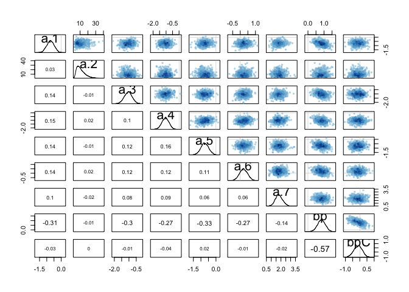
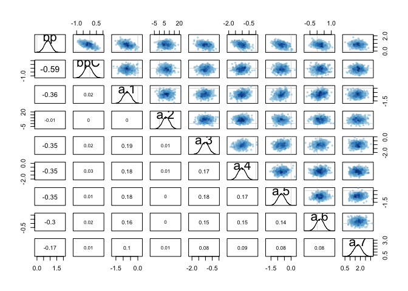

E1. If an event has probability 0.35, what are the log-odds of this event?
==========================================================================

    library(rethinking)

    ## Loading required package: rstan

    ## Loading required package: ggplot2

    ## Loading required package: StanHeaders

    ## rstan (Version 2.11.1, packaged: 2016-07-28 18:19:31 UTC, GitRev: 85f7a56811da)

    ## For execution on a local, multicore CPU with excess RAM we recommend calling
    ## rstan_options(auto_write = TRUE)
    ## options(mc.cores = parallel::detectCores())

    ## Loading required package: parallel

    ## rethinking (Version 1.59)

    logit(0.35)

    ## [1] -0.6190392

E2. If an event has log-odds 3.2, what is the probability of this event?
========================================================================

    logistic(3.2)

    ## [1] 0.9608343

E3. Suppose that a coe cient in a logistic regression has value 1.7. What does this imply about the proportional change in odds of the outcome?
===============================================================================================================================================

    exp(logistic(1.7))

    ## [1] 2.329223

This gives you a 2.4 proportional change/ odds increase of the outcome

M1. As explained in the chapter, binomial data can be organized in aggregated and disaggregated forms, without any impact on inference. But the likelihood of the data does change when the data are converted between the two formats. Can you explain why?
============================================================================================================================================================================================================================================================

The disaggregated seperates each of the samples because each of them may
have their own baised masking the important parts of the data.

H1. Use map to construct a quadratic approximate posterior distribution for the chimpanzee model that includes a unique intercept for each actor, m10.4 (page 299). Compare the quadratic approximation to the posterior distribution produced instead from MCMC. Can you explain both the di erences and the similarities between the approximate and the MCMC distributions?
==============================================================================================================================================================================================================================================================================================================================================================================

    data(chimpanzees)
    d <- chimpanzees
    d2 <- d
    d2$recipient <- NULL

    m10.4 <- map2stan(
        alist(
            pulled_left ~ dbinom( 1 , p ) ,
            logit(p) <- a[actor] + (bp + bpC*condition)*prosoc_left ,
            a[actor] ~ dnorm(0,10),
            bp ~ dnorm(0,10),
            bpC ~ dnorm(0,10)
    ),
    data=d2 , chains=2 , iter=2500 , warmup=500 )

    ## In file included from file3fbe1ef6f925.cpp:8:
    ## In file included from /Library/Frameworks/R.framework/Versions/3.3/Resources/library/StanHeaders/include/src/stan/model/model_header.hpp:4:
    ## In file included from /Library/Frameworks/R.framework/Versions/3.3/Resources/library/StanHeaders/include/stan/math.hpp:4:
    ## In file included from /Library/Frameworks/R.framework/Versions/3.3/Resources/library/StanHeaders/include/stan/math/rev/mat.hpp:4:
    ## In file included from /Library/Frameworks/R.framework/Versions/3.3/Resources/library/StanHeaders/include/stan/math/rev/core.hpp:42:
    ## /Library/Frameworks/R.framework/Versions/3.3/Resources/library/StanHeaders/include/stan/math/rev/core/set_zero_all_adjoints.hpp:14:17: warning: unused function 'set_zero_all_adjoints' [-Wunused-function]
    ##     static void set_zero_all_adjoints() {
    ##                 ^
    ## In file included from file3fbe1ef6f925.cpp:8:
    ## In file included from /Library/Frameworks/R.framework/Versions/3.3/Resources/library/StanHeaders/include/src/stan/model/model_header.hpp:4:
    ## In file included from /Library/Frameworks/R.framework/Versions/3.3/Resources/library/StanHeaders/include/stan/math.hpp:4:
    ## In file included from /Library/Frameworks/R.framework/Versions/3.3/Resources/library/StanHeaders/include/stan/math/rev/mat.hpp:4:
    ## In file included from /Library/Frameworks/R.framework/Versions/3.3/Resources/library/StanHeaders/include/stan/math/rev/core.hpp:43:
    ## /Library/Frameworks/R.framework/Versions/3.3/Resources/library/StanHeaders/include/stan/math/rev/core/set_zero_all_adjoints_nested.hpp:17:17: warning: 'static' function 'set_zero_all_adjoints_nested' declared in header file should be declared 'static inline' [-Wunneeded-internal-declaration]
    ##     static void set_zero_all_adjoints_nested() {
    ##                 ^
    ## In file included from file3fbe1ef6f925.cpp:8:
    ## In file included from /Library/Frameworks/R.framework/Versions/3.3/Resources/library/StanHeaders/include/src/stan/model/model_header.hpp:4:
    ## In file included from /Library/Frameworks/R.framework/Versions/3.3/Resources/library/StanHeaders/include/stan/math.hpp:4:
    ## In file included from /Library/Frameworks/R.framework/Versions/3.3/Resources/library/StanHeaders/include/stan/math/rev/mat.hpp:9:
    ## In file included from /Library/Frameworks/R.framework/Versions/3.3/Resources/library/StanHeaders/include/stan/math/prim/mat.hpp:55:
    ## /Library/Frameworks/R.framework/Versions/3.3/Resources/library/StanHeaders/include/stan/math/prim/mat/fun/autocorrelation.hpp:19:14: warning: function 'fft_next_good_size' is not needed and will not be emitted [-Wunneeded-internal-declaration]
    ##       size_t fft_next_good_size(size_t N) {
    ##              ^
    ## In file included from file3fbe1ef6f925.cpp:8:
    ## In file included from /Library/Frameworks/R.framework/Versions/3.3/Resources/library/StanHeaders/include/src/stan/model/model_header.hpp:4:
    ## In file included from /Library/Frameworks/R.framework/Versions/3.3/Resources/library/StanHeaders/include/stan/math.hpp:4:
    ## In file included from /Library/Frameworks/R.framework/Versions/3.3/Resources/library/StanHeaders/include/stan/math/rev/mat.hpp:9:
    ## In file included from /Library/Frameworks/R.framework/Versions/3.3/Resources/library/StanHeaders/include/stan/math/prim/mat.hpp:36:
    ## /Library/Frameworks/R.framework/Versions/3.3/Resources/library/StanHeaders/include/stan/math/prim/mat/err/check_positive_ordered.hpp:39:67: warning: unused typedef 'size_type' [-Wunused-local-typedef]
    ##       typedef typename index_type<Matrix<T_y, Dynamic, 1> >::type size_type;
    ##                                                                   ^
    ## In file included from file3fbe1ef6f925.cpp:8:
    ## In file included from /Library/Frameworks/R.framework/Versions/3.3/Resources/library/StanHeaders/include/src/stan/model/model_header.hpp:4:
    ## In file included from /Library/Frameworks/R.framework/Versions/3.3/Resources/library/StanHeaders/include/stan/math.hpp:4:
    ## In file included from /Library/Frameworks/R.framework/Versions/3.3/Resources/library/StanHeaders/include/stan/math/rev/mat.hpp:9:
    ## In file included from /Library/Frameworks/R.framework/Versions/3.3/Resources/library/StanHeaders/include/stan/math/prim/mat.hpp:235:
    ## In file included from /Library/Frameworks/R.framework/Versions/3.3/Resources/library/StanHeaders/include/stan/math/prim/arr.hpp:32:
    ## In file included from /Library/Frameworks/R.framework/Versions/3.3/Resources/library/StanHeaders/include/stan/math/prim/arr/functor/integrate_ode_rk45.hpp:13:
    ## In file included from /Library/Frameworks/R.framework/Versions/3.3/Resources/library/BH/include/boost/numeric/odeint.hpp:61:
    ## In file included from /Library/Frameworks/R.framework/Versions/3.3/Resources/library/BH/include/boost/numeric/odeint/util/multi_array_adaption.hpp:29:
    ## In file included from /Library/Frameworks/R.framework/Versions/3.3/Resources/library/BH/include/boost/multi_array.hpp:21:
    ## In file included from /Library/Frameworks/R.framework/Versions/3.3/Resources/library/BH/include/boost/multi_array/base.hpp:28:
    ## /Library/Frameworks/R.framework/Versions/3.3/Resources/library/BH/include/boost/multi_array/concept_checks.hpp:42:43: warning: unused typedef 'index_range' [-Wunused-local-typedef]
    ##       typedef typename Array::index_range index_range;
    ##                                           ^
    ## /Library/Frameworks/R.framework/Versions/3.3/Resources/library/BH/include/boost/multi_array/concept_checks.hpp:43:37: warning: unused typedef 'index' [-Wunused-local-typedef]
    ##       typedef typename Array::index index;
    ##                                     ^
    ## /Library/Frameworks/R.framework/Versions/3.3/Resources/library/BH/include/boost/multi_array/concept_checks.hpp:53:43: warning: unused typedef 'index_range' [-Wunused-local-typedef]
    ##       typedef typename Array::index_range index_range;
    ##                                           ^
    ## /Library/Frameworks/R.framework/Versions/3.3/Resources/library/BH/include/boost/multi_array/concept_checks.hpp:54:37: warning: unused typedef 'index' [-Wunused-local-typedef]
    ##       typedef typename Array::index index;
    ##                                     ^
    ## 8 warnings generated.
    ## 
    ## SAMPLING FOR MODEL 'pulled_left ~ dbinom(1, p)' NOW (CHAIN 1).
    ## 
    ## Chain 1, Iteration:    1 / 2500 [  0%]  (Warmup)
    ## Chain 1, Iteration:  250 / 2500 [ 10%]  (Warmup)
    ## Chain 1, Iteration:  500 / 2500 [ 20%]  (Warmup)
    ## Chain 1, Iteration:  501 / 2500 [ 20%]  (Sampling)
    ## Chain 1, Iteration:  750 / 2500 [ 30%]  (Sampling)
    ## Chain 1, Iteration: 1000 / 2500 [ 40%]  (Sampling)
    ## Chain 1, Iteration: 1250 / 2500 [ 50%]  (Sampling)
    ## Chain 1, Iteration: 1500 / 2500 [ 60%]  (Sampling)
    ## Chain 1, Iteration: 1750 / 2500 [ 70%]  (Sampling)
    ## Chain 1, Iteration: 2000 / 2500 [ 80%]  (Sampling)
    ## Chain 1, Iteration: 2250 / 2500 [ 90%]  (Sampling)
    ## Chain 1, Iteration: 2500 / 2500 [100%]  (Sampling)
    ##  Elapsed Time: 0.497985 seconds (Warm-up)
    ##                2.21125 seconds (Sampling)
    ##                2.70923 seconds (Total)
    ## 
    ## 
    ## SAMPLING FOR MODEL 'pulled_left ~ dbinom(1, p)' NOW (CHAIN 2).
    ## 
    ## Chain 2, Iteration:    1 / 2500 [  0%]  (Warmup)
    ## Chain 2, Iteration:  250 / 2500 [ 10%]  (Warmup)
    ## Chain 2, Iteration:  500 / 2500 [ 20%]  (Warmup)
    ## Chain 2, Iteration:  501 / 2500 [ 20%]  (Sampling)
    ## Chain 2, Iteration:  750 / 2500 [ 30%]  (Sampling)
    ## Chain 2, Iteration: 1000 / 2500 [ 40%]  (Sampling)
    ## Chain 2, Iteration: 1250 / 2500 [ 50%]  (Sampling)
    ## Chain 2, Iteration: 1500 / 2500 [ 60%]  (Sampling)
    ## Chain 2, Iteration: 1750 / 2500 [ 70%]  (Sampling)
    ## Chain 2, Iteration: 2000 / 2500 [ 80%]  (Sampling)
    ## Chain 2, Iteration: 2250 / 2500 [ 90%]  (Sampling)
    ## Chain 2, Iteration: 2500 / 2500 [100%]  (Sampling)
    ##  Elapsed Time: 0.489149 seconds (Warm-up)
    ##                1.88509 seconds (Sampling)
    ##                2.37424 seconds (Total)
    ## 
    ## 
    ## SAMPLING FOR MODEL 'pulled_left ~ dbinom(1, p)' NOW (CHAIN 1).
    ## WARNING: No variance estimation is
    ##          performed for num_warmup < 20
    ## 
    ## 
    ## Chain 1, Iteration: 1 / 1 [100%]  (Sampling)
    ##  Elapsed Time: 3e-06 seconds (Warm-up)
    ##                0.00027 seconds (Sampling)
    ##                0.000273 seconds (Total)

    ## Computing WAIC

    ## Constructing posterior predictions

    ## [ 400 / 4000 ]
    [ 800 / 4000 ]
    [ 1200 / 4000 ]
    [ 1600 / 4000 ]
    [ 2000 / 4000 ]
    [ 2400 / 4000 ]
    [ 2800 / 4000 ]
    [ 3200 / 4000 ]
    [ 3600 / 4000 ]
    [ 4000 / 4000 ]

    ## Warning in map2stan(alist(pulled_left ~ dbinom(1, p), logit(p) <- a[actor] + : There were 44 divergent iterations during sampling.
    ## Check the chains (trace plots, n_eff, Rhat) carefully to ensure they are valid.

    precis( m10.4 , depth=2 )

    ## Warning in precis(m10.4, depth = 2): There were 44 divergent iterations during sampling.
    ## Check the chains (trace plots, n_eff, Rhat) carefully to ensure they are valid.

    ##       Mean StdDev lower 0.89 upper 0.89 n_eff Rhat
    ## a[1] -0.75   0.26      -1.17      -0.36  2304    1
    ## a[2] 11.00   5.28       3.54      18.44  1467    1
    ## a[3] -1.05   0.27      -1.48      -0.61  2368    1
    ## a[4] -1.05   0.27      -1.48      -0.61  2713    1
    ## a[5] -0.75   0.27      -1.17      -0.32  3181    1
    ## a[6]  0.22   0.26      -0.20       0.63  2393    1
    ## a[7]  1.81   0.38       1.21       2.42  2371    1
    ## bp    0.84   0.25       0.46       1.24  1857    1
    ## bpC  -0.13   0.29      -0.61       0.32  2379    1

    precis( m10.4) 

    ## Warning in precis(m10.4): There were 44 divergent iterations during sampling.
    ## Check the chains (trace plots, n_eff, Rhat) carefully to ensure they are valid.

    ## 7 vector or matrix parameters omitted in display. Use depth=2 to show them.

    ##      Mean StdDev lower 0.89 upper 0.89 n_eff Rhat
    ## bp   0.84   0.25       0.46       1.24  1857    1
    ## bpC -0.13   0.29      -0.61       0.32  2379    1

    m10.4b <- map(
        alist(
            pulled_left ~ dbinom( 1 , p ) ,
            logit(p) <- a[actor] + (bp + bpC*condition)*prosoc_left ,
            a[actor] ~ dnorm(0,10),
            bp ~ dnorm(0,10),
            bpC ~ dnorm(0,10)
    ),
    data=d2  )

    precis(m10.4b,depth=2)

    ##       Mean StdDev  5.5% 94.5%
    ## a[1] -0.73   0.27 -1.16 -0.30
    ## a[2]  6.67   3.61  0.90 12.45
    ## a[3] -1.03   0.28 -1.48 -0.59
    ## a[4] -1.03   0.28 -1.48 -0.59
    ## a[5] -0.73   0.27 -1.16 -0.30
    ## a[6]  0.21   0.27 -0.21  0.64
    ## a[7]  1.75   0.38  1.14  2.37
    ## bp    0.82   0.26  0.40  1.24
    ## bpC  -0.13   0.30 -0.61  0.34

    precis(m10.4,depth=2)

    ## Warning in precis(m10.4, depth = 2): There were 44 divergent iterations during sampling.
    ## Check the chains (trace plots, n_eff, Rhat) carefully to ensure they are valid.

    ##       Mean StdDev lower 0.89 upper 0.89 n_eff Rhat
    ## a[1] -0.75   0.26      -1.17      -0.36  2304    1
    ## a[2] 11.00   5.28       3.54      18.44  1467    1
    ## a[3] -1.05   0.27      -1.48      -0.61  2368    1
    ## a[4] -1.05   0.27      -1.48      -0.61  2713    1
    ## a[5] -0.75   0.27      -1.17      -0.32  3181    1
    ## a[6]  0.22   0.26      -0.20       0.63  2393    1
    ## a[7]  1.81   0.38       1.21       2.42  2371    1
    ## bp    0.84   0.25       0.46       1.24  1857    1
    ## bpC  -0.13   0.29      -0.61       0.32  2379    1

    pairs(m10.4)

    pairs(m10.4b)

H2. Use WAIC to compare the chimpanzee model that includes a unique intercept for each actor, m10.4 (page 299), to the simpler models t in the same section.
============================================================================================================================================================

    m10.2 <- map(
        alist(
            pulled_left ~ dbinom( 1 , p ) ,
            logit(p) <- a + bp*prosoc_left ,
            a ~ dnorm(0,10) ,
            bp ~ dnorm(0,10)
    ),
        data=d )

    compare( m10.2 , m10.4 )

    ## Warning in compare(m10.2, m10.4): Not all model fits of same class.
    ## This is usually a bad idea, because it implies they were fit by different algorithms.
    ## Check yourself, before you wreck yourself.

    ##        WAIC pWAIC dWAIC weight    SE   dSE
    ## m10.4 529.1     8   0.0      1 19.93    NA
    ## m10.2 680.5     2 151.4      0  9.21 19.17

100% of weight is gvien to the top model. Much higher SE in top model
tho but much better score.
