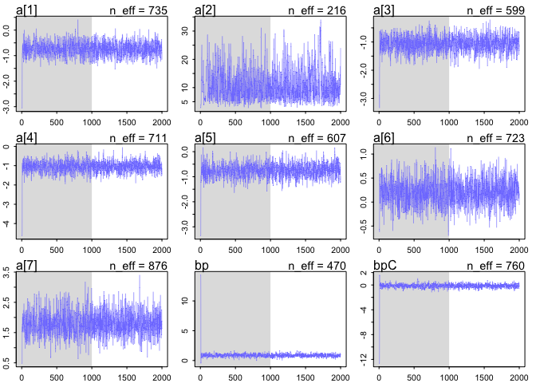
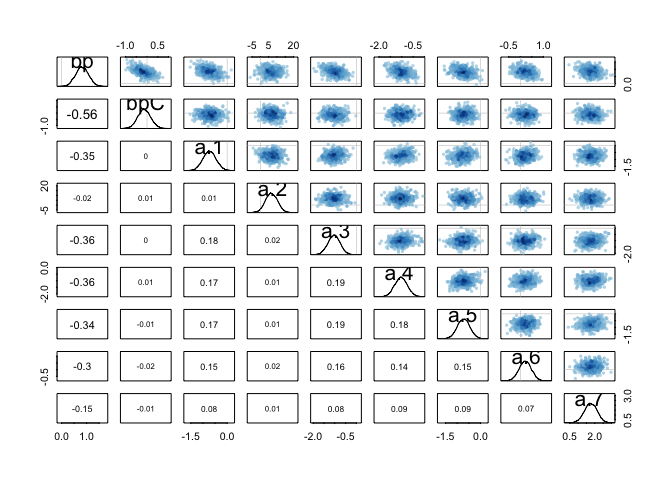
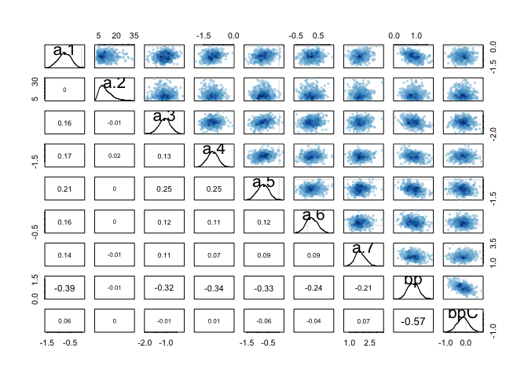

Practically, the Poisson distribution is used for counts that never get
close to any theoretical maximum. As a special case of the binomial, it
has maximum entropy under exactly the same constraints. Its shape is
described by a single parameter, the rate of events λ. Poisson GLMs are
detailed in the next chapter.

10E4. Why do Poisson regressions sometimes require the use of an offset? Provide an example.
--------------------------------------------------------------------------------------------

because the varaibles are some times correlated and this allows the
model to work better by reducing the correlation.

10M2. If a coefficient in a Poisson regression has value 1.7, what does this imply about the change in the outcome?
-------------------------------------------------------------------------------------------------------------------

    exp(1.7)

    ## [1] 5.473947

That the outcome is increasing by 5.4 units for every unit outcome.

10M4. Explain why the log link is appropriate for a Poisson generalized linear model.
-------------------------------------------------------------------------------------

This most important thing the log link function does it ensure that the
value is always postive as expect from a rate value. It also creates an
exponetial replationship between the predictors and the expected values
but I dont think this is important for the link function and making sure
there are no mathamtical issues.

10M5. What would it imply to use a logit link for the mean of a Poisson generalized linear model? Can you think of a real research problem for which this would make sense?
---------------------------------------------------------------------------------------------------------------------------------------------------------------------------

logit link maps paramters between zero and one this is useful for
probalbities. This is unlikely for the mean of a poisson disubution
because this mean will most likely be zero because the prob of an even
durring a Poisson dist is so small which is why we use rate instead to
count this.

10H1. Use map to construct a quadratic approximate posterior distribution for the chimpanzee model that includes a unique intercept for each actor, m10.4 (page 299). Compare the quadratic approximation to the posterior distribution produced instead from MCMC. Can you explain both the differences and the similarities between the approximate and the MCMC distributions?
---------------------------------------------------------------------------------------------------------------------------------------------------------------------------------------------------------------------------------------------------------------------------------------------------------------------------------------------------------------------------------

    library(rethinking)

    ## Loading required package: rstan

    ## Loading required package: ggplot2

    ## Loading required package: StanHeaders

    ## rstan (Version 2.12.1, packaged: 2016-09-11 13:07:50 UTC, GitRev: 85f7a56811da)

    ## For execution on a local, multicore CPU with excess RAM we recommend calling
    ## rstan_options(auto_write = TRUE)
    ## options(mc.cores = parallel::detectCores())

    ## Loading required package: parallel

    ## rethinking (Version 1.59)

    data(chimpanzees)
    d <- chimpanzees

    ### using logit here because this is a normal distbution

    d2 <- d
    d2$recipient <- NULL

    m10.4 <- map(
        alist(
            pulled_left ~ dbinom(1 , p ) ,
            logit(p) <- a[actor] + (bp + bpC*condition)*prosoc_left ,
            a[actor] ~ dnorm(0,10),
            bp ~ dnorm(0,10),
            bpC ~ dnorm(0,10)
    ),
    data=d2)

    ### do we need to remove other vars for map2stan and why?

    m10.4stan <- map2stan(
        alist(
            pulled_left ~ dbinom( 1 , p ) ,
            logit(p) <- a[actor] + (bp + bpC*condition)*prosoc_left ,
            a[actor] ~ dnorm(0,10),
            bp ~ dnorm(0,10),
            bpC ~ dnorm(0,10)
    ),
    data=d2 )

    ## In file included from file12a37b273f62.cpp:8:
    ## In file included from /Library/Frameworks/R.framework/Versions/3.3/Resources/library/StanHeaders/include/src/stan/model/model_header.hpp:4:
    ## In file included from /Library/Frameworks/R.framework/Versions/3.3/Resources/library/StanHeaders/include/stan/math.hpp:4:
    ## In file included from /Library/Frameworks/R.framework/Versions/3.3/Resources/library/StanHeaders/include/stan/math/rev/mat.hpp:4:
    ## In file included from /Library/Frameworks/R.framework/Versions/3.3/Resources/library/StanHeaders/include/stan/math/rev/core.hpp:42:
    ## /Library/Frameworks/R.framework/Versions/3.3/Resources/library/StanHeaders/include/stan/math/rev/core/set_zero_all_adjoints.hpp:14:17: warning: unused function 'set_zero_all_adjoints' [-Wunused-function]
    ##     static void set_zero_all_adjoints() {
    ##                 ^
    ## In file included from file12a37b273f62.cpp:8:
    ## In file included from /Library/Frameworks/R.framework/Versions/3.3/Resources/library/StanHeaders/include/src/stan/model/model_header.hpp:4:
    ## In file included from /Library/Frameworks/R.framework/Versions/3.3/Resources/library/StanHeaders/include/stan/math.hpp:4:
    ## In file included from /Library/Frameworks/R.framework/Versions/3.3/Resources/library/StanHeaders/include/stan/math/rev/mat.hpp:4:
    ## In file included from /Library/Frameworks/R.framework/Versions/3.3/Resources/library/StanHeaders/include/stan/math/rev/core.hpp:43:
    ## /Library/Frameworks/R.framework/Versions/3.3/Resources/library/StanHeaders/include/stan/math/rev/core/set_zero_all_adjoints_nested.hpp:17:17: warning: 'static' function 'set_zero_all_adjoints_nested' declared in header file should be declared 'static inline' [-Wunneeded-internal-declaration]
    ##     static void set_zero_all_adjoints_nested() {
    ##                 ^
    ## In file included from file12a37b273f62.cpp:8:
    ## In file included from /Library/Frameworks/R.framework/Versions/3.3/Resources/library/StanHeaders/include/src/stan/model/model_header.hpp:4:
    ## In file included from /Library/Frameworks/R.framework/Versions/3.3/Resources/library/StanHeaders/include/stan/math.hpp:4:
    ## In file included from /Library/Frameworks/R.framework/Versions/3.3/Resources/library/StanHeaders/include/stan/math/rev/mat.hpp:9:
    ## In file included from /Library/Frameworks/R.framework/Versions/3.3/Resources/library/StanHeaders/include/stan/math/prim/mat.hpp:54:
    ## /Library/Frameworks/R.framework/Versions/3.3/Resources/library/StanHeaders/include/stan/math/prim/mat/fun/autocorrelation.hpp:17:14: warning: function 'fft_next_good_size' is not needed and will not be emitted [-Wunneeded-internal-declaration]
    ##       size_t fft_next_good_size(size_t N) {
    ##              ^
    ## In file included from file12a37b273f62.cpp:8:
    ## In file included from /Library/Frameworks/R.framework/Versions/3.3/Resources/library/StanHeaders/include/src/stan/model/model_header.hpp:4:
    ## In file included from /Library/Frameworks/R.framework/Versions/3.3/Resources/library/StanHeaders/include/stan/math.hpp:4:
    ## In file included from /Library/Frameworks/R.framework/Versions/3.3/Resources/library/StanHeaders/include/stan/math/rev/mat.hpp:9:
    ## In file included from /Library/Frameworks/R.framework/Versions/3.3/Resources/library/StanHeaders/include/stan/math/prim/mat.hpp:235:
    ## In file included from /Library/Frameworks/R.framework/Versions/3.3/Resources/library/StanHeaders/include/stan/math/prim/arr.hpp:36:
    ## In file included from /Library/Frameworks/R.framework/Versions/3.3/Resources/library/StanHeaders/include/stan/math/prim/arr/functor/integrate_ode_rk45.hpp:13:
    ## In file included from /Library/Frameworks/R.framework/Versions/3.3/Resources/library/BH/include/boost/numeric/odeint.hpp:61:
    ## In file included from /Library/Frameworks/R.framework/Versions/3.3/Resources/library/BH/include/boost/numeric/odeint/util/multi_array_adaption.hpp:29:
    ## In file included from /Library/Frameworks/R.framework/Versions/3.3/Resources/library/BH/include/boost/multi_array.hpp:21:
    ## In file included from /Library/Frameworks/R.framework/Versions/3.3/Resources/library/BH/include/boost/multi_array/base.hpp:28:
    ## /Library/Frameworks/R.framework/Versions/3.3/Resources/library/BH/include/boost/multi_array/concept_checks.hpp:42:43: warning: unused typedef 'index_range' [-Wunused-local-typedef]
    ##       typedef typename Array::index_range index_range;
    ##                                           ^
    ## /Library/Frameworks/R.framework/Versions/3.3/Resources/library/BH/include/boost/multi_array/concept_checks.hpp:43:37: warning: unused typedef 'index' [-Wunused-local-typedef]
    ##       typedef typename Array::index index;
    ##                                     ^
    ## /Library/Frameworks/R.framework/Versions/3.3/Resources/library/BH/include/boost/multi_array/concept_checks.hpp:53:43: warning: unused typedef 'index_range' [-Wunused-local-typedef]
    ##       typedef typename Array::index_range index_range;
    ##                                           ^
    ## /Library/Frameworks/R.framework/Versions/3.3/Resources/library/BH/include/boost/multi_array/concept_checks.hpp:54:37: warning: unused typedef 'index' [-Wunused-local-typedef]
    ##       typedef typename Array::index index;
    ##                                     ^
    ## 7 warnings generated.
    ## 
    ## SAMPLING FOR MODEL 'pulled_left ~ dbinom(1, p)' NOW (CHAIN 1).
    ## 
    ## Chain 1, Iteration:    1 / 2000 [  0%]  (Warmup)
    ## Chain 1, Iteration:  200 / 2000 [ 10%]  (Warmup)
    ## Chain 1, Iteration:  400 / 2000 [ 20%]  (Warmup)
    ## Chain 1, Iteration:  600 / 2000 [ 30%]  (Warmup)
    ## Chain 1, Iteration:  800 / 2000 [ 40%]  (Warmup)
    ## Chain 1, Iteration: 1000 / 2000 [ 50%]  (Warmup)
    ## Chain 1, Iteration: 1001 / 2000 [ 50%]  (Sampling)
    ## Chain 1, Iteration: 1200 / 2000 [ 60%]  (Sampling)
    ## Chain 1, Iteration: 1400 / 2000 [ 70%]  (Sampling)
    ## Chain 1, Iteration: 1600 / 2000 [ 80%]  (Sampling)
    ## Chain 1, Iteration: 1800 / 2000 [ 90%]  (Sampling)
    ## Chain 1, Iteration: 2000 / 2000 [100%]  (Sampling)
    ##  Elapsed Time: 1.15943 seconds (Warm-up)
    ##                1.18494 seconds (Sampling)
    ##                2.34437 seconds (Total)
    ## 
    ## 
    ## SAMPLING FOR MODEL 'pulled_left ~ dbinom(1, p)' NOW (CHAIN 1).
    ## WARNING: No variance estimation is
    ##          performed for num_warmup < 20
    ## 
    ## 
    ## Chain 1, Iteration: 1 / 1 [100%]  (Sampling)
    ##  Elapsed Time: 4e-06 seconds (Warm-up)
    ##                0.000269 seconds (Sampling)
    ##                0.000273 seconds (Total)

    ## Computing WAIC

    ## Constructing posterior predictions

    ## [ 100 / 1000 ]
    [ 200 / 1000 ]
    [ 300 / 1000 ]
    [ 400 / 1000 ]
    [ 500 / 1000 ]
    [ 600 / 1000 ]
    [ 700 / 1000 ]
    [ 800 / 1000 ]
    [ 900 / 1000 ]
    [ 1000 / 1000 ]

    ## Warning in map2stan(alist(pulled_left ~ dbinom(1, p), logit(p) <- a[actor] + : There were 1 divergent iterations during sampling.
    ## Check the chains (trace plots, n_eff, Rhat) carefully to ensure they are valid.

    compare(m10.4,m10.4stan)

    ## Warning in compare(m10.4, m10.4stan): Not all model fits of same class.
    ## This is usually a bad idea, because it implies they were fit by different algorithms.
    ## Check yourself, before you wreck yourself.

    ##            WAIC pWAIC dWAIC weight    SE  dSE
    ## m10.4stan 528.9   7.8   0.0      1 19.94   NA
    ## m10.4     553.1  16.9  24.2      0 18.44 2.66

    precis(m10.4,depth=2, corr=TRUE)

    ##       Mean StdDev  5.5% 94.5% a___1 a___2 a___3 a___4 a___5 a___6 a___7
    ## a[1] -0.73   0.27 -1.16 -0.30  1.00  0.01  0.18  0.18  0.18  0.15  0.08
    ## a[2]  6.67   3.61  0.90 12.45  0.01  1.00  0.01  0.01  0.01  0.01  0.00
    ## a[3] -1.03   0.28 -1.48 -0.59  0.18  0.01  1.00  0.18  0.18  0.15  0.08
    ## a[4] -1.03   0.28 -1.48 -0.59  0.18  0.01  0.18  1.00  0.18  0.15  0.08
    ## a[5] -0.73   0.27 -1.16 -0.30  0.18  0.01  0.18  0.18  1.00  0.15  0.08
    ## a[6]  0.21   0.27 -0.21  0.64  0.15  0.01  0.15  0.15  0.15  1.00  0.07
    ## a[7]  1.75   0.38  1.14  2.37  0.08  0.00  0.08  0.08  0.08  0.07  1.00
    ## bp    0.82   0.26  0.40  1.24 -0.35 -0.01 -0.35 -0.35 -0.35 -0.29 -0.16
    ## bpC  -0.13   0.30 -0.61  0.34  0.00  0.00  0.00  0.00  0.00 -0.01 -0.01
    ##         bp   bpC
    ## a[1] -0.35  0.00
    ## a[2] -0.01  0.00
    ## a[3] -0.35  0.00
    ## a[4] -0.35  0.00
    ## a[5] -0.35  0.00
    ## a[6] -0.29 -0.01
    ## a[7] -0.16 -0.01
    ## bp    1.00 -0.57
    ## bpC  -0.57  1.00

    precis(m10.4stan,depth=2, corr=TRUE)

    ## Warning in precis(m10.4stan, depth = 2, corr = TRUE): There were 1 divergent iterations during sampling.
    ## Check the chains (trace plots, n_eff, Rhat) carefully to ensure they are valid.

    ##       Mean StdDev lower 0.89 upper 0.89 n_eff Rhat  1  2  3  4  5  6  7  8
    ## a[1] -0.74   0.27      -1.18      -0.33   735 1.00  1 NA NA NA NA NA NA NA
    ## a[2] 11.21   5.59       3.43      18.54   216 1.01 NA  1 NA NA NA NA NA NA
    ## a[3] -1.07   0.28      -1.48      -0.62   599 1.00 NA NA  1 NA NA NA NA NA
    ## a[4] -1.05   0.27      -1.48      -0.63   711 1.00 NA NA NA  1 NA NA NA NA
    ## a[5] -0.74   0.27      -1.21      -0.37   607 1.00 NA NA NA NA  1 NA NA NA
    ## a[6]  0.21   0.26      -0.25       0.59   723 1.00 NA NA NA NA NA  1 NA NA
    ## a[7]  1.80   0.38       1.22       2.42   876 1.00 NA NA NA NA NA NA  1 NA
    ## bp    0.86   0.25       0.46       1.24   470 1.00 NA NA NA NA NA NA NA  1
    ## bpC  -0.15   0.29      -0.61       0.31   760 1.00 NA NA NA NA NA NA NA NA
    ##       9
    ## a[1] NA
    ## a[2] NA
    ## a[3] NA
    ## a[4] NA
    ## a[5] NA
    ## a[6] NA
    ## a[7] NA
    ## bp   NA
    ## bpC   1

    plot(m10.4stan)

    compare(m10.4,m10.4stan)

    ## Warning in compare(m10.4, m10.4stan): Not all model fits of same class.
    ## This is usually a bad idea, because it implies they were fit by different algorithms.
    ## Check yourself, before you wreck yourself.

    ##            WAIC pWAIC dWAIC weight    SE  dSE
    ## m10.4stan 528.9   7.8   0.0      1 19.94   NA
    ## m10.4     554.2  17.6  25.3      0 18.42 2.81

    pairs(m10.4)

    pairs(m10.4stan)

a1 and a2 are not normally dist in the MCMC model. bp and bpc are
correlated in both the stan and nonstan model, although sligntly less
correlated in the non-stan model.
