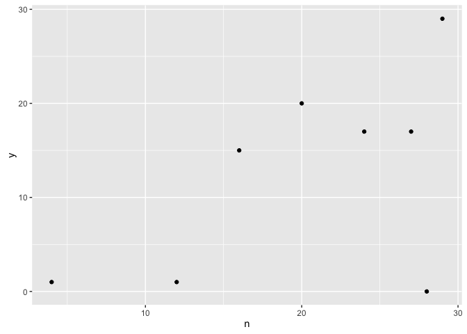

# Chapter-10.3


10H3.  The data contained in library(MASS);data(eagles) are records of salmon pirating attempts by Bald Eagles in Washington State. See ?eagles for details. While one eagle feeds, sometimes another will swoop in and try to steal the salmon from it. Call the feeding eagle the “victim” and the thief the “pirate.” Use the available data to build a binomial GLM of successful pirating attempts.


(a) Consider the following model:
log pi
1 − pi
α βP βV βA
= α+βPPi +βVVi +βAAi
∼ Normal(0, 10) ∼ Normal(0, 5) ∼ Normal(0, 5) ∼ Normal(0, 5)
yi ∼ Binomial(ni, pi)

where y is the number of successful attempts, n is the total number of attempts, P is a dummy variable indicating whether or not the pirate had large body size, V is a dummy variable indicating whether or not the victim had large body size, and  nally A is a dummy variable indicating whether or not the pirate was an adult. Fit the model above to the eagles data, using both map and map2stan. Is the quadratic approximation okay?


```r
library(MASS);data(eagles)
library(ggplot2)
?eagles
summary(eagles)
```

```
##        y               n         P     A     V    
##  Min.   : 0.00   Min.   : 4.00   L:4   A:4   L:4  
##  1st Qu.: 1.00   1st Qu.:15.00   S:4   I:4   S:4  
##  Median :16.00   Median :22.00                    
##  Mean   :12.50   Mean   :20.00                    
##  3rd Qu.:17.75   3rd Qu.:27.25                    
##  Max.   :29.00   Max.   :29.00
```

```r
qplot(x=n,y=y, data=eagles)
```

<!-- -->

```r
library(rethinking)
```

```
## Loading required package: rstan
```

```
## Loading required package: StanHeaders
```

```
## rstan (Version 2.12.1, packaged: 2016-09-11 13:07:50 UTC, GitRev: 85f7a56811da)
```

```
## For execution on a local, multicore CPU with excess RAM we recommend calling
## rstan_options(auto_write = TRUE)
## options(mc.cores = parallel::detectCores())
```

```
## Loading required package: parallel
```

```
## rethinking (Version 1.59)
```

```r
d <- eagles
d$P <- ifelse( d$P=="L" , 1 , 0 ) 
d$V <- ifelse( d$V=="L" , 1 , 0 ) 
d$A <- ifelse( d$A=="A" , 1 , 0 ) 

m10.3hA <- map(
    alist(
         y ~ dbinom(n , p ) ,
        ## do we want to leave one of these out....
         logit(p) <- a + bp*P + ba*A + bv*V,
        a ~ dnorm(0,10),
        bp ~ dnorm(0,1),
        ba ~ dnorm(0,1),
        bv ~ dnorm(0,1)
),
data=d)


m10.3hA.stan <- map2stan(
    alist(
         y ~ dbinom(n , p ) ,
        ## do we want to leave one of these out....
         logit(p) <- a + bp*P + ba*A + bv*V,
        a ~ dnorm(0,10),
        bp ~ dnorm(0,1),
        ba ~ dnorm(0,1),
        bv ~ dnorm(0,1)
),
data=d)
```

```
## In file included from file1d921ffc34d2.cpp:8:
## In file included from /Library/Frameworks/R.framework/Versions/3.3/Resources/library/StanHeaders/include/src/stan/model/model_header.hpp:4:
## In file included from /Library/Frameworks/R.framework/Versions/3.3/Resources/library/StanHeaders/include/stan/math.hpp:4:
## In file included from /Library/Frameworks/R.framework/Versions/3.3/Resources/library/StanHeaders/include/stan/math/rev/mat.hpp:4:
## In file included from /Library/Frameworks/R.framework/Versions/3.3/Resources/library/StanHeaders/include/stan/math/rev/core.hpp:42:
## /Library/Frameworks/R.framework/Versions/3.3/Resources/library/StanHeaders/include/stan/math/rev/core/set_zero_all_adjoints.hpp:14:17: warning: unused function 'set_zero_all_adjoints' [-Wunused-function]
##     static void set_zero_all_adjoints() {
##                 ^
## In file included from file1d921ffc34d2.cpp:8:
## In file included from /Library/Frameworks/R.framework/Versions/3.3/Resources/library/StanHeaders/include/src/stan/model/model_header.hpp:4:
## In file included from /Library/Frameworks/R.framework/Versions/3.3/Resources/library/StanHeaders/include/stan/math.hpp:4:
## In file included from /Library/Frameworks/R.framework/Versions/3.3/Resources/library/StanHeaders/include/stan/math/rev/mat.hpp:4:
## In file included from /Library/Frameworks/R.framework/Versions/3.3/Resources/library/StanHeaders/include/stan/math/rev/core.hpp:43:
## /Library/Frameworks/R.framework/Versions/3.3/Resources/library/StanHeaders/include/stan/math/rev/core/set_zero_all_adjoints_nested.hpp:17:17: warning: 'static' function 'set_zero_all_adjoints_nested' declared in header file should be declared 'static inline' [-Wunneeded-internal-declaration]
##     static void set_zero_all_adjoints_nested() {
##                 ^
## In file included from file1d921ffc34d2.cpp:8:
## In file included from /Library/Frameworks/R.framework/Versions/3.3/Resources/library/StanHeaders/include/src/stan/model/model_header.hpp:4:
## In file included from /Library/Frameworks/R.framework/Versions/3.3/Resources/library/StanHeaders/include/stan/math.hpp:4:
## In file included from /Library/Frameworks/R.framework/Versions/3.3/Resources/library/StanHeaders/include/stan/math/rev/mat.hpp:9:
## In file included from /Library/Frameworks/R.framework/Versions/3.3/Resources/library/StanHeaders/include/stan/math/prim/mat.hpp:54:
## /Library/Frameworks/R.framework/Versions/3.3/Resources/library/StanHeaders/include/stan/math/prim/mat/fun/autocorrelation.hpp:17:14: warning: function 'fft_next_good_size' is not needed and will not be emitted [-Wunneeded-internal-declaration]
##       size_t fft_next_good_size(size_t N) {
##              ^
## In file included from file1d921ffc34d2.cpp:8:
## In file included from /Library/Frameworks/R.framework/Versions/3.3/Resources/library/StanHeaders/include/src/stan/model/model_header.hpp:4:
## In file included from /Library/Frameworks/R.framework/Versions/3.3/Resources/library/StanHeaders/include/stan/math.hpp:4:
## In file included from /Library/Frameworks/R.framework/Versions/3.3/Resources/library/StanHeaders/include/stan/math/rev/mat.hpp:9:
## In file included from /Library/Frameworks/R.framework/Versions/3.3/Resources/library/StanHeaders/include/stan/math/prim/mat.hpp:235:
## In file included from /Library/Frameworks/R.framework/Versions/3.3/Resources/library/StanHeaders/include/stan/math/prim/arr.hpp:36:
## In file included from /Library/Frameworks/R.framework/Versions/3.3/Resources/library/StanHeaders/include/stan/math/prim/arr/functor/integrate_ode_rk45.hpp:13:
## In file included from /Library/Frameworks/R.framework/Versions/3.3/Resources/library/BH/include/boost/numeric/odeint.hpp:61:
## In file included from /Library/Frameworks/R.framework/Versions/3.3/Resources/library/BH/include/boost/numeric/odeint/util/multi_array_adaption.hpp:29:
## In file included from /Library/Frameworks/R.framework/Versions/3.3/Resources/library/BH/include/boost/multi_array.hpp:21:
## In file included from /Library/Frameworks/R.framework/Versions/3.3/Resources/library/BH/include/boost/multi_array/base.hpp:28:
## /Library/Frameworks/R.framework/Versions/3.3/Resources/library/BH/include/boost/multi_array/concept_checks.hpp:42:43: warning: unused typedef 'index_range' [-Wunused-local-typedef]
##       typedef typename Array::index_range index_range;
##                                           ^
## /Library/Frameworks/R.framework/Versions/3.3/Resources/library/BH/include/boost/multi_array/concept_checks.hpp:43:37: warning: unused typedef 'index' [-Wunused-local-typedef]
##       typedef typename Array::index index;
##                                     ^
## /Library/Frameworks/R.framework/Versions/3.3/Resources/library/BH/include/boost/multi_array/concept_checks.hpp:53:43: warning: unused typedef 'index_range' [-Wunused-local-typedef]
##       typedef typename Array::index_range index_range;
##                                           ^
## /Library/Frameworks/R.framework/Versions/3.3/Resources/library/BH/include/boost/multi_array/concept_checks.hpp:54:37: warning: unused typedef 'index' [-Wunused-local-typedef]
##       typedef typename Array::index index;
##                                     ^
## 7 warnings generated.
## 
## SAMPLING FOR MODEL 'y ~ dbinom(n, p)' NOW (CHAIN 1).
## 
## Chain 1, Iteration:    1 / 2000 [  0%]  (Warmup)
## Chain 1, Iteration:  200 / 2000 [ 10%]  (Warmup)
## Chain 1, Iteration:  400 / 2000 [ 20%]  (Warmup)
## Chain 1, Iteration:  600 / 2000 [ 30%]  (Warmup)
## Chain 1, Iteration:  800 / 2000 [ 40%]  (Warmup)
## Chain 1, Iteration: 1000 / 2000 [ 50%]  (Warmup)
## Chain 1, Iteration: 1001 / 2000 [ 50%]  (Sampling)
## Chain 1, Iteration: 1200 / 2000 [ 60%]  (Sampling)
## Chain 1, Iteration: 1400 / 2000 [ 70%]  (Sampling)
## Chain 1, Iteration: 1600 / 2000 [ 80%]  (Sampling)
## Chain 1, Iteration: 1800 / 2000 [ 90%]  (Sampling)
## Chain 1, Iteration: 2000 / 2000 [100%]  (Sampling)
##  Elapsed Time: 0.04999 seconds (Warm-up)
##                0.047807 seconds (Sampling)
##                0.097797 seconds (Total)
## 
## 
## SAMPLING FOR MODEL 'y ~ dbinom(n, p)' NOW (CHAIN 1).
## WARNING: No variance estimation is
##          performed for num_warmup < 20
## 
## 
## Chain 1, Iteration: 1 / 1 [100%]  (Sampling)
##  Elapsed Time: 7e-06 seconds (Warm-up)
##                6e-05 seconds (Sampling)
##                6.7e-05 seconds (Total)
```

```
## Computing WAIC
```

```
## Constructing posterior predictions
```

```
## [ 100 / 1000 ]
[ 200 / 1000 ]
[ 300 / 1000 ]
[ 400 / 1000 ]
[ 500 / 1000 ]
[ 600 / 1000 ]
[ 700 / 1000 ]
[ 800 / 1000 ]
[ 900 / 1000 ]
[ 1000 / 1000 ]
```

```
## Aggregated binomial counts detected. Splitting to 0/1 outcome for WAIC calculation.
```

```r
pairs(m10.3hA)
```

<!-- -->

```r
pairs(m10.3hA.stan)
```

<!-- -->

Yes we can tell from the pairs plot that using quadratic approximation is okay!


(b) Now interpret the estimates. If the quadratic approximation turned out okay, then it’s okay to use the map estimates. Otherwise stick to map2stan estimates.  en plot the posterior predictions. Compute and display both (1) the predicted probability of success and its 89% interval for each row (i) in the data, as well as (2) the predicted success count and its 89% interval. What different information does each type of posterior prediction provide?


```r
#y.seq <- seq(from=0,to=30,by=1)
#n.seq <- seq(from=0,to=30,by=1)
#a = rep(c(0,1,1,0), times=31)
#v= rep(c(0,1,0,1), times=31)
#p = rep(c(0,1,0), times=31)
d.pred <- d
mu.m10.3hA <- link( m10.3hA , d)
```

```
## [ 100 / 1000 ]
[ 200 / 1000 ]
[ 300 / 1000 ]
[ 400 / 1000 ]
[ 500 / 1000 ]
[ 600 / 1000 ]
[ 700 / 1000 ]
[ 800 / 1000 ]
[ 900 / 1000 ]
[ 1000 / 1000 ]
```

```r
mu.m10.3hA.mean <- apply( mu.m10.3hA , 2 , mean )
mu.m10.3hA.PI <- apply( mu.m10.3hA , 2 , PI , prob=0.97 )
```
They each represent each of the combinations of P,A and V


(c) Now try to improve the model. Consider an interaction between the pirate’s size and age (immature or adult). Compare this model to the previous one, using WAIC. Interpret.


```r
m10.3hB <- map(
    alist(
         y ~ dbinom(n , p ) ,
        ## do we want to leave one of these out....
         logit(p) <- a + bP*P + bA*A + bV*V + bPA * P*A,
        a ~ dnorm(0,10),
        bP ~ dnorm(0,1),
        bA ~ dnorm(0,1),
        bV ~ dnorm(0,1),
        bPA ~ dnorm(0,1)
),
data=d)

compare(m10.3hA,m10.3hB)
```

```
##          WAIC pWAIC dWAIC weight   SE  dSE
## m10.3hA 104.6   2.3   0.0   0.52 9.63   NA
## m10.3hB 104.8   2.7   0.2   0.48 9.58 0.35
```
The model without the interaction term is slignylu better then the model with the interaction term. Because it is only slighly better this suggest that the interaction term is important and maybe we need to rework the model a bit to a git a better WAIC.


## Example from Julin 

The attached data sheet is from Liron and records germination for M82 and pen at two temperatures


```r
l <- read.csv("/Users/gturco/Documents/2011_2016_PHD/code/Rclub-rethinking_Gina.Turco/Assignment_Chapter_10/LironDataTime1.csv",header=TRUE)

summary(l)
```

```
##       Time    Temperature    Plate..    Species  Germination
##  Min.   :1   Min.   :14   Min.   :1.0   M82:60   No :38     
##  1st Qu.:1   1st Qu.:14   1st Qu.:2.0   pen:60   Yes:82     
##  Median :1   Median :18   Median :3.5                       
##  Mean   :1   Mean   :18   Mean   :3.5                       
##  3rd Qu.:1   3rd Qu.:22   3rd Qu.:5.0                       
##  Max.   :1   Max.   :22   Max.   :6.0                       
##   Root.length      Shoot.length   
##  Min.   :0.0000   Min.   :0.0000  
##  1st Qu.:0.0000   1st Qu.:0.0000  
##  Median :0.4650   Median :0.0000  
##  Mean   :0.6824   Mean   :0.2863  
##  3rd Qu.:1.1325   3rd Qu.:0.7025  
##  Max.   :2.9000   Max.   :1.5300
```

```r
### germination yes or no event, this is a proablity of happening not a low sucess rate (not poisson) and using count data- binomial


### not sure this are showing me anything would be better to plot prob of yes and no....
ggplot(data=l, aes(x=Germination,y=Temperature,fill=Species)) + geom_boxplot(position="dodge")
```

<!-- -->

```r
ggplot(data=l, aes(fill=Germination,x=Temperature)) + geom_density() + facet_grid(Species~Germination)
```

<!-- -->

Perform a Bayesian analysis to determine whether or not the two species have different germination rates, whether temperature affects germination, and whether there is a temperature by germination interaction.  


```r
### germination yes or no event
d <- data.frame(Germination=ifelse(l$Germination=="Yes",1,0), Temperature=l$Temperature, Species=ifelse(l$Species=="M82",1,0))

### is this one trail for each of these


### how do we adjust the coiffent range should it be count or prob or logit..
#m10.liron <- map(
#    alist(
#          ### is this one trail for each of these
#         Germination ~ dbinom(1,p) ,
#         logit(p) <- a + bT*Temperature + bS*Species + bTS * Temperature*Species,
#        a ~ dnorm(0,100),
#        ## is the temp in cel...
#        bT ~ dnorm(0,100),
#        bS ~ dnorm(0,100),
#        bTS ~ dnorm(0,100)
#),
#data=l)

m10.liron.stan <- map2stan(
    alist(
          ### is this one trail for each of these
         Germination ~ dbinom(1,p) ,
         logit(p) <- a + bT*Temperature + bS*Species + bTS * Temperature*Species,
        a ~ dnorm(0,100),
        ## is the temp in cel...
        bT ~ dnorm(0,100),
        bS ~ dnorm(0,100),
        bTS ~ dnorm(0,100)
),
data=d)
```

```
## In file included from file1d92221ca07c.cpp:8:
## In file included from /Library/Frameworks/R.framework/Versions/3.3/Resources/library/StanHeaders/include/src/stan/model/model_header.hpp:4:
## In file included from /Library/Frameworks/R.framework/Versions/3.3/Resources/library/StanHeaders/include/stan/math.hpp:4:
## In file included from /Library/Frameworks/R.framework/Versions/3.3/Resources/library/StanHeaders/include/stan/math/rev/mat.hpp:4:
## In file included from /Library/Frameworks/R.framework/Versions/3.3/Resources/library/StanHeaders/include/stan/math/rev/core.hpp:42:
## /Library/Frameworks/R.framework/Versions/3.3/Resources/library/StanHeaders/include/stan/math/rev/core/set_zero_all_adjoints.hpp:14:17: warning: unused function 'set_zero_all_adjoints' [-Wunused-function]
##     static void set_zero_all_adjoints() {
##                 ^
## In file included from file1d92221ca07c.cpp:8:
## In file included from /Library/Frameworks/R.framework/Versions/3.3/Resources/library/StanHeaders/include/src/stan/model/model_header.hpp:4:
## In file included from /Library/Frameworks/R.framework/Versions/3.3/Resources/library/StanHeaders/include/stan/math.hpp:4:
## In file included from /Library/Frameworks/R.framework/Versions/3.3/Resources/library/StanHeaders/include/stan/math/rev/mat.hpp:4:
## In file included from /Library/Frameworks/R.framework/Versions/3.3/Resources/library/StanHeaders/include/stan/math/rev/core.hpp:43:
## /Library/Frameworks/R.framework/Versions/3.3/Resources/library/StanHeaders/include/stan/math/rev/core/set_zero_all_adjoints_nested.hpp:17:17: warning: 'static' function 'set_zero_all_adjoints_nested' declared in header file should be declared 'static inline' [-Wunneeded-internal-declaration]
##     static void set_zero_all_adjoints_nested() {
##                 ^
## In file included from file1d92221ca07c.cpp:8:
## In file included from /Library/Frameworks/R.framework/Versions/3.3/Resources/library/StanHeaders/include/src/stan/model/model_header.hpp:4:
## In file included from /Library/Frameworks/R.framework/Versions/3.3/Resources/library/StanHeaders/include/stan/math.hpp:4:
## In file included from /Library/Frameworks/R.framework/Versions/3.3/Resources/library/StanHeaders/include/stan/math/rev/mat.hpp:9:
## In file included from /Library/Frameworks/R.framework/Versions/3.3/Resources/library/StanHeaders/include/stan/math/prim/mat.hpp:54:
## /Library/Frameworks/R.framework/Versions/3.3/Resources/library/StanHeaders/include/stan/math/prim/mat/fun/autocorrelation.hpp:17:14: warning: function 'fft_next_good_size' is not needed and will not be emitted [-Wunneeded-internal-declaration]
##       size_t fft_next_good_size(size_t N) {
##              ^
## In file included from file1d92221ca07c.cpp:8:
## In file included from /Library/Frameworks/R.framework/Versions/3.3/Resources/library/StanHeaders/include/src/stan/model/model_header.hpp:4:
## In file included from /Library/Frameworks/R.framework/Versions/3.3/Resources/library/StanHeaders/include/stan/math.hpp:4:
## In file included from /Library/Frameworks/R.framework/Versions/3.3/Resources/library/StanHeaders/include/stan/math/rev/mat.hpp:9:
## In file included from /Library/Frameworks/R.framework/Versions/3.3/Resources/library/StanHeaders/include/stan/math/prim/mat.hpp:235:
## In file included from /Library/Frameworks/R.framework/Versions/3.3/Resources/library/StanHeaders/include/stan/math/prim/arr.hpp:36:
## In file included from /Library/Frameworks/R.framework/Versions/3.3/Resources/library/StanHeaders/include/stan/math/prim/arr/functor/integrate_ode_rk45.hpp:13:
## In file included from /Library/Frameworks/R.framework/Versions/3.3/Resources/library/BH/include/boost/numeric/odeint.hpp:61:
## In file included from /Library/Frameworks/R.framework/Versions/3.3/Resources/library/BH/include/boost/numeric/odeint/util/multi_array_adaption.hpp:29:
## In file included from /Library/Frameworks/R.framework/Versions/3.3/Resources/library/BH/include/boost/multi_array.hpp:21:
## In file included from /Library/Frameworks/R.framework/Versions/3.3/Resources/library/BH/include/boost/multi_array/base.hpp:28:
## /Library/Frameworks/R.framework/Versions/3.3/Resources/library/BH/include/boost/multi_array/concept_checks.hpp:42:43: warning: unused typedef 'index_range' [-Wunused-local-typedef]
##       typedef typename Array::index_range index_range;
##                                           ^
## /Library/Frameworks/R.framework/Versions/3.3/Resources/library/BH/include/boost/multi_array/concept_checks.hpp:43:37: warning: unused typedef 'index' [-Wunused-local-typedef]
##       typedef typename Array::index index;
##                                     ^
## /Library/Frameworks/R.framework/Versions/3.3/Resources/library/BH/include/boost/multi_array/concept_checks.hpp:53:43: warning: unused typedef 'index_range' [-Wunused-local-typedef]
##       typedef typename Array::index_range index_range;
##                                           ^
## /Library/Frameworks/R.framework/Versions/3.3/Resources/library/BH/include/boost/multi_array/concept_checks.hpp:54:37: warning: unused typedef 'index' [-Wunused-local-typedef]
##       typedef typename Array::index index;
##                                     ^
## 7 warnings generated.
## 
## SAMPLING FOR MODEL 'Germination ~ dbinom(1, p)' NOW (CHAIN 1).
## 
## Chain 1, Iteration:    1 / 2000 [  0%]  (Warmup)
## Chain 1, Iteration:  200 / 2000 [ 10%]  (Warmup)
## Chain 1, Iteration:  400 / 2000 [ 20%]  (Warmup)
## Chain 1, Iteration:  600 / 2000 [ 30%]  (Warmup)
## Chain 1, Iteration:  800 / 2000 [ 40%]  (Warmup)
## Chain 1, Iteration: 1000 / 2000 [ 50%]  (Warmup)
## Chain 1, Iteration: 1001 / 2000 [ 50%]  (Sampling)
## Chain 1, Iteration: 1200 / 2000 [ 60%]  (Sampling)
## Chain 1, Iteration: 1400 / 2000 [ 70%]  (Sampling)
## Chain 1, Iteration: 1600 / 2000 [ 80%]  (Sampling)
## Chain 1, Iteration: 1800 / 2000 [ 90%]  (Sampling)
## Chain 1, Iteration: 2000 / 2000 [100%]  (Sampling)
##  Elapsed Time: 0.672374 seconds (Warm-up)
##                0.581646 seconds (Sampling)
##                1.25402 seconds (Total)
## 
## 
## SAMPLING FOR MODEL 'Germination ~ dbinom(1, p)' NOW (CHAIN 1).
## WARNING: No variance estimation is
##          performed for num_warmup < 20
## 
## 
## Chain 1, Iteration: 1 / 1 [100%]  (Sampling)
##  Elapsed Time: 3e-06 seconds (Warm-up)
##                8.1e-05 seconds (Sampling)
##                8.4e-05 seconds (Total)
```

```
## Computing WAIC
```

```
## Constructing posterior predictions
```

```
## [ 100 / 1000 ]
[ 200 / 1000 ]
[ 300 / 1000 ]
[ 400 / 1000 ]
[ 500 / 1000 ]
[ 600 / 1000 ]
[ 700 / 1000 ]
[ 800 / 1000 ]
[ 900 / 1000 ]
[ 1000 / 1000 ]
```

```r
pairs(m10.liron.stan)
```

<!-- -->

```r
## slight skew use stan over map data


m10.liron.stanB <- map2stan(
    alist(
          ### is this one trail for each of these
         Germination ~ dbinom(1,p) ,
         logit(p) <- a + bT*Temperature + bS*Species,
        a ~ dnorm(0,100),
        ## is the temp in cel...
        bT ~ dnorm(10,100),
        bS ~ dnorm(0,100)
),
data=d)
```

```
## In file included from file1d9261670fa0.cpp:8:
## In file included from /Library/Frameworks/R.framework/Versions/3.3/Resources/library/StanHeaders/include/src/stan/model/model_header.hpp:4:
## In file included from /Library/Frameworks/R.framework/Versions/3.3/Resources/library/StanHeaders/include/stan/math.hpp:4:
## In file included from /Library/Frameworks/R.framework/Versions/3.3/Resources/library/StanHeaders/include/stan/math/rev/mat.hpp:4:
## In file included from /Library/Frameworks/R.framework/Versions/3.3/Resources/library/StanHeaders/include/stan/math/rev/core.hpp:42:
## /Library/Frameworks/R.framework/Versions/3.3/Resources/library/StanHeaders/include/stan/math/rev/core/set_zero_all_adjoints.hpp:14:17: warning: unused function 'set_zero_all_adjoints' [-Wunused-function]
##     static void set_zero_all_adjoints() {
##                 ^
## In file included from file1d9261670fa0.cpp:8:
## In file included from /Library/Frameworks/R.framework/Versions/3.3/Resources/library/StanHeaders/include/src/stan/model/model_header.hpp:4:
## In file included from /Library/Frameworks/R.framework/Versions/3.3/Resources/library/StanHeaders/include/stan/math.hpp:4:
## In file included from /Library/Frameworks/R.framework/Versions/3.3/Resources/library/StanHeaders/include/stan/math/rev/mat.hpp:4:
## In file included from /Library/Frameworks/R.framework/Versions/3.3/Resources/library/StanHeaders/include/stan/math/rev/core.hpp:43:
## /Library/Frameworks/R.framework/Versions/3.3/Resources/library/StanHeaders/include/stan/math/rev/core/set_zero_all_adjoints_nested.hpp:17:17: warning: 'static' function 'set_zero_all_adjoints_nested' declared in header file should be declared 'static inline' [-Wunneeded-internal-declaration]
##     static void set_zero_all_adjoints_nested() {
##                 ^
## In file included from file1d9261670fa0.cpp:8:
## In file included from /Library/Frameworks/R.framework/Versions/3.3/Resources/library/StanHeaders/include/src/stan/model/model_header.hpp:4:
## In file included from /Library/Frameworks/R.framework/Versions/3.3/Resources/library/StanHeaders/include/stan/math.hpp:4:
## In file included from /Library/Frameworks/R.framework/Versions/3.3/Resources/library/StanHeaders/include/stan/math/rev/mat.hpp:9:
## In file included from /Library/Frameworks/R.framework/Versions/3.3/Resources/library/StanHeaders/include/stan/math/prim/mat.hpp:54:
## /Library/Frameworks/R.framework/Versions/3.3/Resources/library/StanHeaders/include/stan/math/prim/mat/fun/autocorrelation.hpp:17:14: warning: function 'fft_next_good_size' is not needed and will not be emitted [-Wunneeded-internal-declaration]
##       size_t fft_next_good_size(size_t N) {
##              ^
## In file included from file1d9261670fa0.cpp:8:
## In file included from /Library/Frameworks/R.framework/Versions/3.3/Resources/library/StanHeaders/include/src/stan/model/model_header.hpp:4:
## In file included from /Library/Frameworks/R.framework/Versions/3.3/Resources/library/StanHeaders/include/stan/math.hpp:4:
## In file included from /Library/Frameworks/R.framework/Versions/3.3/Resources/library/StanHeaders/include/stan/math/rev/mat.hpp:9:
## In file included from /Library/Frameworks/R.framework/Versions/3.3/Resources/library/StanHeaders/include/stan/math/prim/mat.hpp:235:
## In file included from /Library/Frameworks/R.framework/Versions/3.3/Resources/library/StanHeaders/include/stan/math/prim/arr.hpp:36:
## In file included from /Library/Frameworks/R.framework/Versions/3.3/Resources/library/StanHeaders/include/stan/math/prim/arr/functor/integrate_ode_rk45.hpp:13:
## In file included from /Library/Frameworks/R.framework/Versions/3.3/Resources/library/BH/include/boost/numeric/odeint.hpp:61:
## In file included from /Library/Frameworks/R.framework/Versions/3.3/Resources/library/BH/include/boost/numeric/odeint/util/multi_array_adaption.hpp:29:
## In file included from /Library/Frameworks/R.framework/Versions/3.3/Resources/library/BH/include/boost/multi_array.hpp:21:
## In file included from /Library/Frameworks/R.framework/Versions/3.3/Resources/library/BH/include/boost/multi_array/base.hpp:28:
## /Library/Frameworks/R.framework/Versions/3.3/Resources/library/BH/include/boost/multi_array/concept_checks.hpp:42:43: warning: unused typedef 'index_range' [-Wunused-local-typedef]
##       typedef typename Array::index_range index_range;
##                                           ^
## /Library/Frameworks/R.framework/Versions/3.3/Resources/library/BH/include/boost/multi_array/concept_checks.hpp:43:37: warning: unused typedef 'index' [-Wunused-local-typedef]
##       typedef typename Array::index index;
##                                     ^
## /Library/Frameworks/R.framework/Versions/3.3/Resources/library/BH/include/boost/multi_array/concept_checks.hpp:53:43: warning: unused typedef 'index_range' [-Wunused-local-typedef]
##       typedef typename Array::index_range index_range;
##                                           ^
## /Library/Frameworks/R.framework/Versions/3.3/Resources/library/BH/include/boost/multi_array/concept_checks.hpp:54:37: warning: unused typedef 'index' [-Wunused-local-typedef]
##       typedef typename Array::index index;
##                                     ^
## 7 warnings generated.
## 
## SAMPLING FOR MODEL 'Germination ~ dbinom(1, p)' NOW (CHAIN 1).
## 
## Chain 1, Iteration:    1 / 2000 [  0%]  (Warmup)
## Chain 1, Iteration:  200 / 2000 [ 10%]  (Warmup)
## Chain 1, Iteration:  400 / 2000 [ 20%]  (Warmup)
## Chain 1, Iteration:  600 / 2000 [ 30%]  (Warmup)
## Chain 1, Iteration:  800 / 2000 [ 40%]  (Warmup)
## Chain 1, Iteration: 1000 / 2000 [ 50%]  (Warmup)
## Chain 1, Iteration: 1001 / 2000 [ 50%]  (Sampling)
## Chain 1, Iteration: 1200 / 2000 [ 60%]  (Sampling)
## Chain 1, Iteration: 1400 / 2000 [ 70%]  (Sampling)
## Chain 1, Iteration: 1600 / 2000 [ 80%]  (Sampling)
## Chain 1, Iteration: 1800 / 2000 [ 90%]  (Sampling)
## Chain 1, Iteration: 2000 / 2000 [100%]  (Sampling)
##  Elapsed Time: 0.345301 seconds (Warm-up)
##                0.318822 seconds (Sampling)
##                0.664123 seconds (Total)
## 
## 
## SAMPLING FOR MODEL 'Germination ~ dbinom(1, p)' NOW (CHAIN 1).
## WARNING: No variance estimation is
##          performed for num_warmup < 20
## 
## 
## Chain 1, Iteration: 1 / 1 [100%]  (Sampling)
##  Elapsed Time: 5e-06 seconds (Warm-up)
##                7.3e-05 seconds (Sampling)
##                7.8e-05 seconds (Total)
```

```
## Computing WAIC
## Constructing posterior predictions
```

```
## [ 100 / 1000 ]
[ 200 / 1000 ]
[ 300 / 1000 ]
[ 400 / 1000 ]
[ 500 / 1000 ]
[ 600 / 1000 ]
[ 700 / 1000 ]
[ 800 / 1000 ]
[ 900 / 1000 ]
[ 1000 / 1000 ]
```

```r
compare(m10.liron.stan,m10.liron.stanB)
```

```
##                  WAIC pWAIC dWAIC weight    SE  dSE
## m10.liron.stan  130.6   4.3   0.0   0.59 13.03   NA
## m10.liron.stanB 131.4   3.3   0.8   0.41 12.64 3.77
```

```r
## model without interaction is slightly better....
```


Determine the posterior estimates for germination rate for each species at each temperature and determine the confidence intervals around these estimates.


```r
d.pred <- data.frame(Temperature=c(22,22,14,14),Species=c(0,1,0,1))
mu.m10.liron.stan <- link(m10.liron.stan , d.pred)
```

```
## [ 100 / 1000 ]
[ 200 / 1000 ]
[ 300 / 1000 ]
[ 400 / 1000 ]
[ 500 / 1000 ]
[ 600 / 1000 ]
[ 700 / 1000 ]
[ 800 / 1000 ]
[ 900 / 1000 ]
[ 1000 / 1000 ]
```

```r
mu.m10.liron.stan.mean <- apply( mu.m10.liron.stan , 2 , mean )
mu.m10.liron.stan.PI <- apply( mu.m10.liron.stan , 2 , PI , prob=0.97 )
## temp 22 and M82, temp 22 and pen, temp 14 and M82,temp 22 and pen 
mu.m10.liron.stan.mean
```

```
## [1] 0.8663592 0.8343698 0.7373151 0.3005402
```

```r
mu.m10.liron.stan.PI
```

```
##          [,1]      [,2]      [,3]      [,4]
## 2%  0.7116177 0.6674169 0.5548031 0.1546252
## 98% 0.9660324 0.9472802 0.8962824 0.4831473
```
