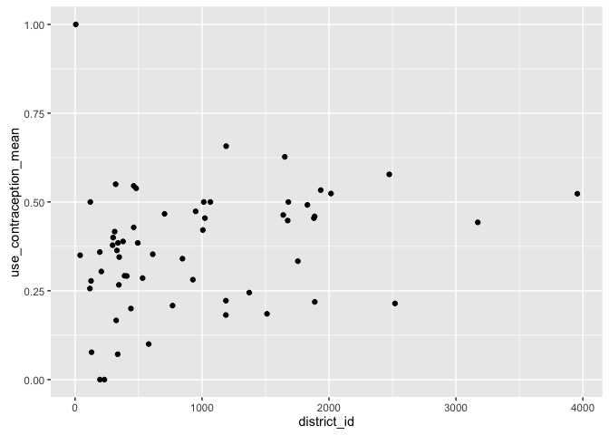

# Chapter-12

## 12E1. Which of the following priors will produce more shrinkage in the estimates? 

*(a) αtank ∼ Normal(0, 1)*; 
(b) αtank ∼ Normal(0, 2).

The tanks can be more diff with a wider prior so wont get shunk to the same values
The more strignent the tanks are the more the points move towards the same value


A wider pior will allow the model to move points more towards the datas mean, although this is not much larger...

## 12E2. Make the following model into a multilevel model.

yi ∼ Binomial(1, pi)
logit(pi) = αgroup[i] + βxi 
αgroup ∼ Normal(0, 10)
β ∼ Normal(0, 1)

yi ∼ Binomial(1, pi)
logit(pi) = αgroup[i] + βxi 
αgroup ∼ Normal(α, σ)
α ∼ Normal(0, 10) 
σ ∼ HalfCauchy(0, 1)
β ∼ Normal(0, 1)

## 12M1. Revisit the Reed frog survival data, data(reedfrogs), and add the predation and size treatment variables to the varying intercepts model. Consider models with either main effect alone, both main effects, as well as a model including both and their interaction. Instead of focusing on inferences about these two predictor variables, focus on the inferred variation across tanks. Explain why it changes as it does across models.


```r
library(rethinking)
```

```
## Loading required package: rstan
```

```
## Loading required package: ggplot2
```

```
## Loading required package: StanHeaders
```

```
## rstan (Version 2.12.1, packaged: 2016-09-11 13:07:50 UTC, GitRev: 85f7a56811da)
```

```
## For execution on a local, multicore CPU with excess RAM we recommend calling
## rstan_options(auto_write = TRUE)
## options(mc.cores = parallel::detectCores())
```

```
## Loading required package: parallel
```

```
## rethinking (Version 1.59)
```

```r
data(reedfrogs)
d <- reedfrogs
str(d)
```

```
## 'data.frame':	48 obs. of  5 variables:
##  $ density : int  10 10 10 10 10 10 10 10 10 10 ...
##  $ pred    : Factor w/ 2 levels "no","pred": 1 1 1 1 1 1 1 1 2 2 ...
##  $ size    : Factor w/ 2 levels "big","small": 1 1 1 1 2 2 2 2 1 1 ...
##  $ surv    : int  9 10 7 10 9 9 10 9 4 9 ...
##  $ propsurv: num  0.9 1 0.7 1 0.9 0.9 1 0.9 0.4 0.9 ...
```

```r
pairs(d)
```

<!-- -->

```r
d$pred <- ifelse( d$pred=="pred" , 1 , 0 )
d$size <- ifelse( d$size=="big" , 1 , 0 )
#Consider models with either main effect alone, 
d$tank <- 1:nrow(d)
summary(d)
```

```
##     density           pred          size          surv      
##  Min.   :10.00   Min.   :0.0   Min.   :0.0   Min.   : 4.00  
##  1st Qu.:10.00   1st Qu.:0.0   1st Qu.:0.0   1st Qu.: 9.00  
##  Median :25.00   Median :0.5   Median :0.5   Median :12.50  
##  Mean   :23.33   Mean   :0.5   Mean   :0.5   Mean   :16.31  
##  3rd Qu.:35.00   3rd Qu.:1.0   3rd Qu.:1.0   3rd Qu.:23.00  
##  Max.   :35.00   Max.   :1.0   Max.   :1.0   Max.   :35.00  
##     propsurv           tank      
##  Min.   :0.1143   Min.   : 1.00  
##  1st Qu.:0.4964   1st Qu.:12.75  
##  Median :0.8857   Median :24.50  
##  Mean   :0.7216   Mean   :24.50  
##  3rd Qu.:0.9200   3rd Qu.:36.25  
##  Max.   :1.0000   Max.   :48.00
```

```r
colnames(d) <- c("density","pred","tank_size","surv","propsurv","tank")

m12.2 <- map2stan(
    alist(
        surv ~ dbinom( density , p ) ,
        logit(p) <- a_tank[tank] ,
        a_tank[tank] ~ dnorm( a , sigma ) ,
        a ~ dnorm(0,1) ,
        sigma ~ dcauchy(0,1)
    ), data=d , iter=4000 , chains=4 )
```

```
## In file included from file3b84596f1ba3.cpp:8:
## In file included from /Library/Frameworks/R.framework/Versions/3.3/Resources/library/StanHeaders/include/src/stan/model/model_header.hpp:4:
## In file included from /Library/Frameworks/R.framework/Versions/3.3/Resources/library/StanHeaders/include/stan/math.hpp:4:
## In file included from /Library/Frameworks/R.framework/Versions/3.3/Resources/library/StanHeaders/include/stan/math/rev/mat.hpp:4:
## In file included from /Library/Frameworks/R.framework/Versions/3.3/Resources/library/StanHeaders/include/stan/math/rev/core.hpp:42:
## /Library/Frameworks/R.framework/Versions/3.3/Resources/library/StanHeaders/include/stan/math/rev/core/set_zero_all_adjoints.hpp:14:17: warning: unused function 'set_zero_all_adjoints' [-Wunused-function]
##     static void set_zero_all_adjoints() {
##                 ^
## In file included from file3b84596f1ba3.cpp:8:
## In file included from /Library/Frameworks/R.framework/Versions/3.3/Resources/library/StanHeaders/include/src/stan/model/model_header.hpp:4:
## In file included from /Library/Frameworks/R.framework/Versions/3.3/Resources/library/StanHeaders/include/stan/math.hpp:4:
## In file included from /Library/Frameworks/R.framework/Versions/3.3/Resources/library/StanHeaders/include/stan/math/rev/mat.hpp:4:
## In file included from /Library/Frameworks/R.framework/Versions/3.3/Resources/library/StanHeaders/include/stan/math/rev/core.hpp:43:
## /Library/Frameworks/R.framework/Versions/3.3/Resources/library/StanHeaders/include/stan/math/rev/core/set_zero_all_adjoints_nested.hpp:17:17: warning: 'static' function 'set_zero_all_adjoints_nested' declared in header file should be declared 'static inline' [-Wunneeded-internal-declaration]
##     static void set_zero_all_adjoints_nested() {
##                 ^
## In file included from file3b84596f1ba3.cpp:8:
## In file included from /Library/Frameworks/R.framework/Versions/3.3/Resources/library/StanHeaders/include/src/stan/model/model_header.hpp:4:
## In file included from /Library/Frameworks/R.framework/Versions/3.3/Resources/library/StanHeaders/include/stan/math.hpp:4:
## In file included from /Library/Frameworks/R.framework/Versions/3.3/Resources/library/StanHeaders/include/stan/math/rev/mat.hpp:9:
## In file included from /Library/Frameworks/R.framework/Versions/3.3/Resources/library/StanHeaders/include/stan/math/prim/mat.hpp:54:
## /Library/Frameworks/R.framework/Versions/3.3/Resources/library/StanHeaders/include/stan/math/prim/mat/fun/autocorrelation.hpp:17:14: warning: function 'fft_next_good_size' is not needed and will not be emitted [-Wunneeded-internal-declaration]
##       size_t fft_next_good_size(size_t N) {
##              ^
## In file included from file3b84596f1ba3.cpp:8:
## In file included from /Library/Frameworks/R.framework/Versions/3.3/Resources/library/StanHeaders/include/src/stan/model/model_header.hpp:4:
## In file included from /Library/Frameworks/R.framework/Versions/3.3/Resources/library/StanHeaders/include/stan/math.hpp:4:
## In file included from /Library/Frameworks/R.framework/Versions/3.3/Resources/library/StanHeaders/include/stan/math/rev/mat.hpp:9:
## In file included from /Library/Frameworks/R.framework/Versions/3.3/Resources/library/StanHeaders/include/stan/math/prim/mat.hpp:235:
## In file included from /Library/Frameworks/R.framework/Versions/3.3/Resources/library/StanHeaders/include/stan/math/prim/arr.hpp:36:
## In file included from /Library/Frameworks/R.framework/Versions/3.3/Resources/library/StanHeaders/include/stan/math/prim/arr/functor/integrate_ode_rk45.hpp:13:
## In file included from /Library/Frameworks/R.framework/Versions/3.3/Resources/library/BH/include/boost/numeric/odeint.hpp:61:
## In file included from /Library/Frameworks/R.framework/Versions/3.3/Resources/library/BH/include/boost/numeric/odeint/util/multi_array_adaption.hpp:29:
## In file included from /Library/Frameworks/R.framework/Versions/3.3/Resources/library/BH/include/boost/multi_array.hpp:21:
## In file included from /Library/Frameworks/R.framework/Versions/3.3/Resources/library/BH/include/boost/multi_array/base.hpp:28:
## /Library/Frameworks/R.framework/Versions/3.3/Resources/library/BH/include/boost/multi_array/concept_checks.hpp:42:43: warning: unused typedef 'index_range' [-Wunused-local-typedef]
##       typedef typename Array::index_range index_range;
##                                           ^
## /Library/Frameworks/R.framework/Versions/3.3/Resources/library/BH/include/boost/multi_array/concept_checks.hpp:43:37: warning: unused typedef 'index' [-Wunused-local-typedef]
##       typedef typename Array::index index;
##                                     ^
## /Library/Frameworks/R.framework/Versions/3.3/Resources/library/BH/include/boost/multi_array/concept_checks.hpp:53:43: warning: unused typedef 'index_range' [-Wunused-local-typedef]
##       typedef typename Array::index_range index_range;
##                                           ^
## /Library/Frameworks/R.framework/Versions/3.3/Resources/library/BH/include/boost/multi_array/concept_checks.hpp:54:37: warning: unused typedef 'index' [-Wunused-local-typedef]
##       typedef typename Array::index index;
##                                     ^
## 7 warnings generated.
## 
## SAMPLING FOR MODEL 'surv ~ dbinom(density, p)' NOW (CHAIN 1).
## 
## Chain 1, Iteration:    1 / 4000 [  0%]  (Warmup)
## Chain 1, Iteration:  400 / 4000 [ 10%]  (Warmup)
## Chain 1, Iteration:  800 / 4000 [ 20%]  (Warmup)
## Chain 1, Iteration: 1200 / 4000 [ 30%]  (Warmup)
## Chain 1, Iteration: 1600 / 4000 [ 40%]  (Warmup)
## Chain 1, Iteration: 2000 / 4000 [ 50%]  (Warmup)
## Chain 1, Iteration: 2001 / 4000 [ 50%]  (Sampling)
## Chain 1, Iteration: 2400 / 4000 [ 60%]  (Sampling)
## Chain 1, Iteration: 2800 / 4000 [ 70%]  (Sampling)
## Chain 1, Iteration: 3200 / 4000 [ 80%]  (Sampling)
## Chain 1, Iteration: 3600 / 4000 [ 90%]  (Sampling)
## Chain 1, Iteration: 4000 / 4000 [100%]  (Sampling)
##  Elapsed Time: 0.286501 seconds (Warm-up)
##                0.242369 seconds (Sampling)
##                0.52887 seconds (Total)
## 
## 
## SAMPLING FOR MODEL 'surv ~ dbinom(density, p)' NOW (CHAIN 2).
## 
## Chain 2, Iteration:    1 / 4000 [  0%]  (Warmup)
## Chain 2, Iteration:  400 / 4000 [ 10%]  (Warmup)
## Chain 2, Iteration:  800 / 4000 [ 20%]  (Warmup)
## Chain 2, Iteration: 1200 / 4000 [ 30%]  (Warmup)
## Chain 2, Iteration: 1600 / 4000 [ 40%]  (Warmup)
## Chain 2, Iteration: 2000 / 4000 [ 50%]  (Warmup)
## Chain 2, Iteration: 2001 / 4000 [ 50%]  (Sampling)
## Chain 2, Iteration: 2400 / 4000 [ 60%]  (Sampling)
## Chain 2, Iteration: 2800 / 4000 [ 70%]  (Sampling)
## Chain 2, Iteration: 3200 / 4000 [ 80%]  (Sampling)
## Chain 2, Iteration: 3600 / 4000 [ 90%]  (Sampling)
## Chain 2, Iteration: 4000 / 4000 [100%]  (Sampling)
##  Elapsed Time: 0.304191 seconds (Warm-up)
##                0.238721 seconds (Sampling)
##                0.542912 seconds (Total)
## 
## 
## SAMPLING FOR MODEL 'surv ~ dbinom(density, p)' NOW (CHAIN 3).
## 
## Chain 3, Iteration:    1 / 4000 [  0%]  (Warmup)
## Chain 3, Iteration:  400 / 4000 [ 10%]  (Warmup)
## Chain 3, Iteration:  800 / 4000 [ 20%]  (Warmup)
## Chain 3, Iteration: 1200 / 4000 [ 30%]  (Warmup)
## Chain 3, Iteration: 1600 / 4000 [ 40%]  (Warmup)
## Chain 3, Iteration: 2000 / 4000 [ 50%]  (Warmup)
## Chain 3, Iteration: 2001 / 4000 [ 50%]  (Sampling)
## Chain 3, Iteration: 2400 / 4000 [ 60%]  (Sampling)
## Chain 3, Iteration: 2800 / 4000 [ 70%]  (Sampling)
## Chain 3, Iteration: 3200 / 4000 [ 80%]  (Sampling)
## Chain 3, Iteration: 3600 / 4000 [ 90%]  (Sampling)
## Chain 3, Iteration: 4000 / 4000 [100%]  (Sampling)
##  Elapsed Time: 0.296327 seconds (Warm-up)
##                0.255847 seconds (Sampling)
##                0.552174 seconds (Total)
## 
## 
## SAMPLING FOR MODEL 'surv ~ dbinom(density, p)' NOW (CHAIN 4).
## 
## Chain 4, Iteration:    1 / 4000 [  0%]  (Warmup)
## Chain 4, Iteration:  400 / 4000 [ 10%]  (Warmup)
## Chain 4, Iteration:  800 / 4000 [ 20%]  (Warmup)
## Chain 4, Iteration: 1200 / 4000 [ 30%]  (Warmup)
## Chain 4, Iteration: 1600 / 4000 [ 40%]  (Warmup)
## Chain 4, Iteration: 2000 / 4000 [ 50%]  (Warmup)
## Chain 4, Iteration: 2001 / 4000 [ 50%]  (Sampling)
## Chain 4, Iteration: 2400 / 4000 [ 60%]  (Sampling)
## Chain 4, Iteration: 2800 / 4000 [ 70%]  (Sampling)
## Chain 4, Iteration: 3200 / 4000 [ 80%]  (Sampling)
## Chain 4, Iteration: 3600 / 4000 [ 90%]  (Sampling)
## Chain 4, Iteration: 4000 / 4000 [100%]  (Sampling)
##  Elapsed Time: 0.290089 seconds (Warm-up)
##                0.251796 seconds (Sampling)
##                0.541885 seconds (Total)
```

```
## The following numerical problems occured the indicated number of times after warmup on chain 4
```

```
##                                                                                 count
## Exception thrown at line 17: normal_log: Scale parameter is 0, but must be > 0!     1
```

```
## When a numerical problem occurs, the Hamiltonian proposal gets rejected.
```

```
## See http://mc-stan.org/misc/warnings.html#exception-hamiltonian-proposal-rejected
```

```
## If the number in the 'count' column is small, do not ask about this message on stan-users.
```

```
## 
## SAMPLING FOR MODEL 'surv ~ dbinom(density, p)' NOW (CHAIN 1).
## WARNING: No variance estimation is
##          performed for num_warmup < 20
## 
## 
## Chain 1, Iteration: 1 / 1 [100%]  (Sampling)
##  Elapsed Time: 5e-06 seconds (Warm-up)
##                7.7e-05 seconds (Sampling)
##                8.2e-05 seconds (Total)
```

```
## Computing WAIC
```

```
## Constructing posterior predictions
```

```
## [ 800 / 8000 ]
[ 1600 / 8000 ]
[ 2400 / 8000 ]
[ 3200 / 8000 ]
[ 4000 / 8000 ]
[ 4800 / 8000 ]
[ 5600 / 8000 ]
[ 6400 / 8000 ]
[ 7200 / 8000 ]
[ 8000 / 8000 ]
```

```
## Aggregated binomial counts detected. Splitting to 0/1 outcome for WAIC calculation.
```

```r
m12.2pred <- map2stan(
    alist(
        surv ~ dbinom( density , p ) ,
        logit(p) <- a_tank[tank] + bP*pred,
        a_tank[tank] ~ dnorm( a , sigma ) ,
        bP ~ dnorm(0,1),
        a ~ dnorm(0,1) ,
        sigma ~ dcauchy(0,1)
    ), data=d , iter=4000 , chains=4 )
```

```
## In file included from file3b848a0b92f.cpp:8:
## In file included from /Library/Frameworks/R.framework/Versions/3.3/Resources/library/StanHeaders/include/src/stan/model/model_header.hpp:4:
## In file included from /Library/Frameworks/R.framework/Versions/3.3/Resources/library/StanHeaders/include/stan/math.hpp:4:
## In file included from /Library/Frameworks/R.framework/Versions/3.3/Resources/library/StanHeaders/include/stan/math/rev/mat.hpp:4:
## In file included from /Library/Frameworks/R.framework/Versions/3.3/Resources/library/StanHeaders/include/stan/math/rev/core.hpp:42:
## /Library/Frameworks/R.framework/Versions/3.3/Resources/library/StanHeaders/include/stan/math/rev/core/set_zero_all_adjoints.hpp:14:17: warning: unused function 'set_zero_all_adjoints' [-Wunused-function]
##     static void set_zero_all_adjoints() {
##                 ^
## In file included from file3b848a0b92f.cpp:8:
## In file included from /Library/Frameworks/R.framework/Versions/3.3/Resources/library/StanHeaders/include/src/stan/model/model_header.hpp:4:
## In file included from /Library/Frameworks/R.framework/Versions/3.3/Resources/library/StanHeaders/include/stan/math.hpp:4:
## In file included from /Library/Frameworks/R.framework/Versions/3.3/Resources/library/StanHeaders/include/stan/math/rev/mat.hpp:4:
## In file included from /Library/Frameworks/R.framework/Versions/3.3/Resources/library/StanHeaders/include/stan/math/rev/core.hpp:43:
## /Library/Frameworks/R.framework/Versions/3.3/Resources/library/StanHeaders/include/stan/math/rev/core/set_zero_all_adjoints_nested.hpp:17:17: warning: 'static' function 'set_zero_all_adjoints_nested' declared in header file should be declared 'static inline' [-Wunneeded-internal-declaration]
##     static void set_zero_all_adjoints_nested() {
##                 ^
## In file included from file3b848a0b92f.cpp:8:
## In file included from /Library/Frameworks/R.framework/Versions/3.3/Resources/library/StanHeaders/include/src/stan/model/model_header.hpp:4:
## In file included from /Library/Frameworks/R.framework/Versions/3.3/Resources/library/StanHeaders/include/stan/math.hpp:4:
## In file included from /Library/Frameworks/R.framework/Versions/3.3/Resources/library/StanHeaders/include/stan/math/rev/mat.hpp:9:
## In file included from /Library/Frameworks/R.framework/Versions/3.3/Resources/library/StanHeaders/include/stan/math/prim/mat.hpp:54:
## /Library/Frameworks/R.framework/Versions/3.3/Resources/library/StanHeaders/include/stan/math/prim/mat/fun/autocorrelation.hpp:17:14: warning: function 'fft_next_good_size' is not needed and will not be emitted [-Wunneeded-internal-declaration]
##       size_t fft_next_good_size(size_t N) {
##              ^
## In file included from file3b848a0b92f.cpp:8:
## In file included from /Library/Frameworks/R.framework/Versions/3.3/Resources/library/StanHeaders/include/src/stan/model/model_header.hpp:4:
## In file included from /Library/Frameworks/R.framework/Versions/3.3/Resources/library/StanHeaders/include/stan/math.hpp:4:
## In file included from /Library/Frameworks/R.framework/Versions/3.3/Resources/library/StanHeaders/include/stan/math/rev/mat.hpp:9:
## In file included from /Library/Frameworks/R.framework/Versions/3.3/Resources/library/StanHeaders/include/stan/math/prim/mat.hpp:235:
## In file included from /Library/Frameworks/R.framework/Versions/3.3/Resources/library/StanHeaders/include/stan/math/prim/arr.hpp:36:
## In file included from /Library/Frameworks/R.framework/Versions/3.3/Resources/library/StanHeaders/include/stan/math/prim/arr/functor/integrate_ode_rk45.hpp:13:
## In file included from /Library/Frameworks/R.framework/Versions/3.3/Resources/library/BH/include/boost/numeric/odeint.hpp:61:
## In file included from /Library/Frameworks/R.framework/Versions/3.3/Resources/library/BH/include/boost/numeric/odeint/util/multi_array_adaption.hpp:29:
## In file included from /Library/Frameworks/R.framework/Versions/3.3/Resources/library/BH/include/boost/multi_array.hpp:21:
## In file included from /Library/Frameworks/R.framework/Versions/3.3/Resources/library/BH/include/boost/multi_array/base.hpp:28:
## /Library/Frameworks/R.framework/Versions/3.3/Resources/library/BH/include/boost/multi_array/concept_checks.hpp:42:43: warning: unused typedef 'index_range' [-Wunused-local-typedef]
##       typedef typename Array::index_range index_range;
##                                           ^
## /Library/Frameworks/R.framework/Versions/3.3/Resources/library/BH/include/boost/multi_array/concept_checks.hpp:43:37: warning: unused typedef 'index' [-Wunused-local-typedef]
##       typedef typename Array::index index;
##                                     ^
## /Library/Frameworks/R.framework/Versions/3.3/Resources/library/BH/include/boost/multi_array/concept_checks.hpp:53:43: warning: unused typedef 'index_range' [-Wunused-local-typedef]
##       typedef typename Array::index_range index_range;
##                                           ^
## /Library/Frameworks/R.framework/Versions/3.3/Resources/library/BH/include/boost/multi_array/concept_checks.hpp:54:37: warning: unused typedef 'index' [-Wunused-local-typedef]
##       typedef typename Array::index index;
##                                     ^
## 7 warnings generated.
## 
## SAMPLING FOR MODEL 'surv ~ dbinom(density, p)' NOW (CHAIN 1).
## 
## Chain 1, Iteration:    1 / 4000 [  0%]  (Warmup)
## Chain 1, Iteration:  400 / 4000 [ 10%]  (Warmup)
## Chain 1, Iteration:  800 / 4000 [ 20%]  (Warmup)
## Chain 1, Iteration: 1200 / 4000 [ 30%]  (Warmup)
## Chain 1, Iteration: 1600 / 4000 [ 40%]  (Warmup)
## Chain 1, Iteration: 2000 / 4000 [ 50%]  (Warmup)
## Chain 1, Iteration: 2001 / 4000 [ 50%]  (Sampling)
## Chain 1, Iteration: 2400 / 4000 [ 60%]  (Sampling)
## Chain 1, Iteration: 2800 / 4000 [ 70%]  (Sampling)
## Chain 1, Iteration: 3200 / 4000 [ 80%]  (Sampling)
## Chain 1, Iteration: 3600 / 4000 [ 90%]  (Sampling)
## Chain 1, Iteration: 4000 / 4000 [100%]  (Sampling)
##  Elapsed Time: 0.428934 seconds (Warm-up)
##                0.464957 seconds (Sampling)
##                0.893891 seconds (Total)
```

```
## The following numerical problems occured the indicated number of times after warmup on chain 1
```

```
##                                                                                 count
## Exception thrown at line 20: normal_log: Scale parameter is 0, but must be > 0!     1
```

```
## When a numerical problem occurs, the Hamiltonian proposal gets rejected.
```

```
## See http://mc-stan.org/misc/warnings.html#exception-hamiltonian-proposal-rejected
```

```
## If the number in the 'count' column is small, do not ask about this message on stan-users.
```

```
## 
## SAMPLING FOR MODEL 'surv ~ dbinom(density, p)' NOW (CHAIN 2).
## 
## Chain 2, Iteration:    1 / 4000 [  0%]  (Warmup)
## Chain 2, Iteration:  400 / 4000 [ 10%]  (Warmup)
## Chain 2, Iteration:  800 / 4000 [ 20%]  (Warmup)
## Chain 2, Iteration: 1200 / 4000 [ 30%]  (Warmup)
## Chain 2, Iteration: 1600 / 4000 [ 40%]  (Warmup)
## Chain 2, Iteration: 2000 / 4000 [ 50%]  (Warmup)
## Chain 2, Iteration: 2001 / 4000 [ 50%]  (Sampling)
## Chain 2, Iteration: 2400 / 4000 [ 60%]  (Sampling)
## Chain 2, Iteration: 2800 / 4000 [ 70%]  (Sampling)
## Chain 2, Iteration: 3200 / 4000 [ 80%]  (Sampling)
## Chain 2, Iteration: 3600 / 4000 [ 90%]  (Sampling)
## Chain 2, Iteration: 4000 / 4000 [100%]  (Sampling)
##  Elapsed Time: 0.430956 seconds (Warm-up)
##                0.438625 seconds (Sampling)
##                0.869581 seconds (Total)
## 
## 
## SAMPLING FOR MODEL 'surv ~ dbinom(density, p)' NOW (CHAIN 3).
## 
## Chain 3, Iteration:    1 / 4000 [  0%]  (Warmup)
## Chain 3, Iteration:  400 / 4000 [ 10%]  (Warmup)
## Chain 3, Iteration:  800 / 4000 [ 20%]  (Warmup)
## Chain 3, Iteration: 1200 / 4000 [ 30%]  (Warmup)
## Chain 3, Iteration: 1600 / 4000 [ 40%]  (Warmup)
## Chain 3, Iteration: 2000 / 4000 [ 50%]  (Warmup)
## Chain 3, Iteration: 2001 / 4000 [ 50%]  (Sampling)
## Chain 3, Iteration: 2400 / 4000 [ 60%]  (Sampling)
## Chain 3, Iteration: 2800 / 4000 [ 70%]  (Sampling)
## Chain 3, Iteration: 3200 / 4000 [ 80%]  (Sampling)
## Chain 3, Iteration: 3600 / 4000 [ 90%]  (Sampling)
## Chain 3, Iteration: 4000 / 4000 [100%]  (Sampling)
##  Elapsed Time: 0.397261 seconds (Warm-up)
##                0.485527 seconds (Sampling)
##                0.882788 seconds (Total)
## 
## 
## SAMPLING FOR MODEL 'surv ~ dbinom(density, p)' NOW (CHAIN 4).
## 
## Chain 4, Iteration:    1 / 4000 [  0%]  (Warmup)
## Chain 4, Iteration:  400 / 4000 [ 10%]  (Warmup)
## Chain 4, Iteration:  800 / 4000 [ 20%]  (Warmup)
## Chain 4, Iteration: 1200 / 4000 [ 30%]  (Warmup)
## Chain 4, Iteration: 1600 / 4000 [ 40%]  (Warmup)
## Chain 4, Iteration: 2000 / 4000 [ 50%]  (Warmup)
## Chain 4, Iteration: 2001 / 4000 [ 50%]  (Sampling)
## Chain 4, Iteration: 2400 / 4000 [ 60%]  (Sampling)
## Chain 4, Iteration: 2800 / 4000 [ 70%]  (Sampling)
## Chain 4, Iteration: 3200 / 4000 [ 80%]  (Sampling)
## Chain 4, Iteration: 3600 / 4000 [ 90%]  (Sampling)
## Chain 4, Iteration: 4000 / 4000 [100%]  (Sampling)
##  Elapsed Time: 0.443578 seconds (Warm-up)
##                0.437112 seconds (Sampling)
##                0.88069 seconds (Total)
## 
## 
## SAMPLING FOR MODEL 'surv ~ dbinom(density, p)' NOW (CHAIN 1).
## WARNING: No variance estimation is
##          performed for num_warmup < 20
## 
## 
## Chain 1, Iteration: 1 / 1 [100%]  (Sampling)
##  Elapsed Time: 4e-06 seconds (Warm-up)
##                7.8e-05 seconds (Sampling)
##                8.2e-05 seconds (Total)
```

```
## Computing WAIC
```

```
## Constructing posterior predictions
```

```
## [ 800 / 8000 ]
[ 1600 / 8000 ]
[ 2400 / 8000 ]
[ 3200 / 8000 ]
[ 4000 / 8000 ]
[ 4800 / 8000 ]
[ 5600 / 8000 ]
[ 6400 / 8000 ]
[ 7200 / 8000 ]
[ 8000 / 8000 ]
```

```
## Aggregated binomial counts detected. Splitting to 0/1 outcome for WAIC calculation.
```

```r
m12.2size <- map2stan(
    alist(
        surv ~ dbinom( density , p ) ,
        logit(p) <- a_tank[tank] + bS*tank_size,
        a_tank[tank] ~ dnorm( a , sigma ) ,
        bS ~ dnorm(0,1),
        a ~ dnorm(0,1) ,
        sigma ~ dcauchy(0,1)
    ), data=d , iter=4000 , chains=4 )
```

```
## In file included from file3b845b897907.cpp:8:
## In file included from /Library/Frameworks/R.framework/Versions/3.3/Resources/library/StanHeaders/include/src/stan/model/model_header.hpp:4:
## In file included from /Library/Frameworks/R.framework/Versions/3.3/Resources/library/StanHeaders/include/stan/math.hpp:4:
## In file included from /Library/Frameworks/R.framework/Versions/3.3/Resources/library/StanHeaders/include/stan/math/rev/mat.hpp:4:
## In file included from /Library/Frameworks/R.framework/Versions/3.3/Resources/library/StanHeaders/include/stan/math/rev/core.hpp:42:
## /Library/Frameworks/R.framework/Versions/3.3/Resources/library/StanHeaders/include/stan/math/rev/core/set_zero_all_adjoints.hpp:14:17: warning: unused function 'set_zero_all_adjoints' [-Wunused-function]
##     static void set_zero_all_adjoints() {
##                 ^
## In file included from file3b845b897907.cpp:8:
## In file included from /Library/Frameworks/R.framework/Versions/3.3/Resources/library/StanHeaders/include/src/stan/model/model_header.hpp:4:
## In file included from /Library/Frameworks/R.framework/Versions/3.3/Resources/library/StanHeaders/include/stan/math.hpp:4:
## In file included from /Library/Frameworks/R.framework/Versions/3.3/Resources/library/StanHeaders/include/stan/math/rev/mat.hpp:4:
## In file included from /Library/Frameworks/R.framework/Versions/3.3/Resources/library/StanHeaders/include/stan/math/rev/core.hpp:43:
## /Library/Frameworks/R.framework/Versions/3.3/Resources/library/StanHeaders/include/stan/math/rev/core/set_zero_all_adjoints_nested.hpp:17:17: warning: 'static' function 'set_zero_all_adjoints_nested' declared in header file should be declared 'static inline' [-Wunneeded-internal-declaration]
##     static void set_zero_all_adjoints_nested() {
##                 ^
## In file included from file3b845b897907.cpp:8:
## In file included from /Library/Frameworks/R.framework/Versions/3.3/Resources/library/StanHeaders/include/src/stan/model/model_header.hpp:4:
## In file included from /Library/Frameworks/R.framework/Versions/3.3/Resources/library/StanHeaders/include/stan/math.hpp:4:
## In file included from /Library/Frameworks/R.framework/Versions/3.3/Resources/library/StanHeaders/include/stan/math/rev/mat.hpp:9:
## In file included from /Library/Frameworks/R.framework/Versions/3.3/Resources/library/StanHeaders/include/stan/math/prim/mat.hpp:54:
## /Library/Frameworks/R.framework/Versions/3.3/Resources/library/StanHeaders/include/stan/math/prim/mat/fun/autocorrelation.hpp:17:14: warning: function 'fft_next_good_size' is not needed and will not be emitted [-Wunneeded-internal-declaration]
##       size_t fft_next_good_size(size_t N) {
##              ^
## In file included from file3b845b897907.cpp:8:
## In file included from /Library/Frameworks/R.framework/Versions/3.3/Resources/library/StanHeaders/include/src/stan/model/model_header.hpp:4:
## In file included from /Library/Frameworks/R.framework/Versions/3.3/Resources/library/StanHeaders/include/stan/math.hpp:4:
## In file included from /Library/Frameworks/R.framework/Versions/3.3/Resources/library/StanHeaders/include/stan/math/rev/mat.hpp:9:
## In file included from /Library/Frameworks/R.framework/Versions/3.3/Resources/library/StanHeaders/include/stan/math/prim/mat.hpp:235:
## In file included from /Library/Frameworks/R.framework/Versions/3.3/Resources/library/StanHeaders/include/stan/math/prim/arr.hpp:36:
## In file included from /Library/Frameworks/R.framework/Versions/3.3/Resources/library/StanHeaders/include/stan/math/prim/arr/functor/integrate_ode_rk45.hpp:13:
## In file included from /Library/Frameworks/R.framework/Versions/3.3/Resources/library/BH/include/boost/numeric/odeint.hpp:61:
## In file included from /Library/Frameworks/R.framework/Versions/3.3/Resources/library/BH/include/boost/numeric/odeint/util/multi_array_adaption.hpp:29:
## In file included from /Library/Frameworks/R.framework/Versions/3.3/Resources/library/BH/include/boost/multi_array.hpp:21:
## In file included from /Library/Frameworks/R.framework/Versions/3.3/Resources/library/BH/include/boost/multi_array/base.hpp:28:
## /Library/Frameworks/R.framework/Versions/3.3/Resources/library/BH/include/boost/multi_array/concept_checks.hpp:42:43: warning: unused typedef 'index_range' [-Wunused-local-typedef]
##       typedef typename Array::index_range index_range;
##                                           ^
## /Library/Frameworks/R.framework/Versions/3.3/Resources/library/BH/include/boost/multi_array/concept_checks.hpp:43:37: warning: unused typedef 'index' [-Wunused-local-typedef]
##       typedef typename Array::index index;
##                                     ^
## /Library/Frameworks/R.framework/Versions/3.3/Resources/library/BH/include/boost/multi_array/concept_checks.hpp:53:43: warning: unused typedef 'index_range' [-Wunused-local-typedef]
##       typedef typename Array::index_range index_range;
##                                           ^
## /Library/Frameworks/R.framework/Versions/3.3/Resources/library/BH/include/boost/multi_array/concept_checks.hpp:54:37: warning: unused typedef 'index' [-Wunused-local-typedef]
##       typedef typename Array::index index;
##                                     ^
## 7 warnings generated.
## 
## SAMPLING FOR MODEL 'surv ~ dbinom(density, p)' NOW (CHAIN 1).
## 
## Chain 1, Iteration:    1 / 4000 [  0%]  (Warmup)
## Chain 1, Iteration:  400 / 4000 [ 10%]  (Warmup)
## Chain 1, Iteration:  800 / 4000 [ 20%]  (Warmup)
## Chain 1, Iteration: 1200 / 4000 [ 30%]  (Warmup)
## Chain 1, Iteration: 1600 / 4000 [ 40%]  (Warmup)
## Chain 1, Iteration: 2000 / 4000 [ 50%]  (Warmup)
## Chain 1, Iteration: 2001 / 4000 [ 50%]  (Sampling)
## Chain 1, Iteration: 2400 / 4000 [ 60%]  (Sampling)
## Chain 1, Iteration: 2800 / 4000 [ 70%]  (Sampling)
## Chain 1, Iteration: 3200 / 4000 [ 80%]  (Sampling)
## Chain 1, Iteration: 3600 / 4000 [ 90%]  (Sampling)
## Chain 1, Iteration: 4000 / 4000 [100%]  (Sampling)
##  Elapsed Time: 0.431979 seconds (Warm-up)
##                0.408245 seconds (Sampling)
##                0.840224 seconds (Total)
```

```
## The following numerical problems occured the indicated number of times after warmup on chain 1
```

```
##                                                                                 count
## Exception thrown at line 20: normal_log: Scale parameter is 0, but must be > 0!     1
```

```
## When a numerical problem occurs, the Hamiltonian proposal gets rejected.
```

```
## See http://mc-stan.org/misc/warnings.html#exception-hamiltonian-proposal-rejected
```

```
## If the number in the 'count' column is small, do not ask about this message on stan-users.
```

```
## 
## SAMPLING FOR MODEL 'surv ~ dbinom(density, p)' NOW (CHAIN 2).
## 
## Chain 2, Iteration:    1 / 4000 [  0%]  (Warmup)
## Chain 2, Iteration:  400 / 4000 [ 10%]  (Warmup)
## Chain 2, Iteration:  800 / 4000 [ 20%]  (Warmup)
## Chain 2, Iteration: 1200 / 4000 [ 30%]  (Warmup)
## Chain 2, Iteration: 1600 / 4000 [ 40%]  (Warmup)
## Chain 2, Iteration: 2000 / 4000 [ 50%]  (Warmup)
## Chain 2, Iteration: 2001 / 4000 [ 50%]  (Sampling)
## Chain 2, Iteration: 2400 / 4000 [ 60%]  (Sampling)
## Chain 2, Iteration: 2800 / 4000 [ 70%]  (Sampling)
## Chain 2, Iteration: 3200 / 4000 [ 80%]  (Sampling)
## Chain 2, Iteration: 3600 / 4000 [ 90%]  (Sampling)
## Chain 2, Iteration: 4000 / 4000 [100%]  (Sampling)
##  Elapsed Time: 0.420572 seconds (Warm-up)
##                0.395463 seconds (Sampling)
##                0.816035 seconds (Total)
```

```
## The following numerical problems occured the indicated number of times after warmup on chain 2
```

```
##                                                                                 count
## Exception thrown at line 20: normal_log: Scale parameter is 0, but must be > 0!     1
```

```
## When a numerical problem occurs, the Hamiltonian proposal gets rejected.
```

```
## See http://mc-stan.org/misc/warnings.html#exception-hamiltonian-proposal-rejected
```

```
## If the number in the 'count' column is small, do not ask about this message on stan-users.
```

```
## 
## SAMPLING FOR MODEL 'surv ~ dbinom(density, p)' NOW (CHAIN 3).
## 
## Chain 3, Iteration:    1 / 4000 [  0%]  (Warmup)
## Chain 3, Iteration:  400 / 4000 [ 10%]  (Warmup)
## Chain 3, Iteration:  800 / 4000 [ 20%]  (Warmup)
## Chain 3, Iteration: 1200 / 4000 [ 30%]  (Warmup)
## Chain 3, Iteration: 1600 / 4000 [ 40%]  (Warmup)
## Chain 3, Iteration: 2000 / 4000 [ 50%]  (Warmup)
## Chain 3, Iteration: 2001 / 4000 [ 50%]  (Sampling)
## Chain 3, Iteration: 2400 / 4000 [ 60%]  (Sampling)
## Chain 3, Iteration: 2800 / 4000 [ 70%]  (Sampling)
## Chain 3, Iteration: 3200 / 4000 [ 80%]  (Sampling)
## Chain 3, Iteration: 3600 / 4000 [ 90%]  (Sampling)
## Chain 3, Iteration: 4000 / 4000 [100%]  (Sampling)
##  Elapsed Time: 0.424659 seconds (Warm-up)
##                0.402721 seconds (Sampling)
##                0.82738 seconds (Total)
## 
## 
## SAMPLING FOR MODEL 'surv ~ dbinom(density, p)' NOW (CHAIN 4).
## 
## Chain 4, Iteration:    1 / 4000 [  0%]  (Warmup)
## Chain 4, Iteration:  400 / 4000 [ 10%]  (Warmup)
## Chain 4, Iteration:  800 / 4000 [ 20%]  (Warmup)
## Chain 4, Iteration: 1200 / 4000 [ 30%]  (Warmup)
## Chain 4, Iteration: 1600 / 4000 [ 40%]  (Warmup)
## Chain 4, Iteration: 2000 / 4000 [ 50%]  (Warmup)
## Chain 4, Iteration: 2001 / 4000 [ 50%]  (Sampling)
## Chain 4, Iteration: 2400 / 4000 [ 60%]  (Sampling)
## Chain 4, Iteration: 2800 / 4000 [ 70%]  (Sampling)
## Chain 4, Iteration: 3200 / 4000 [ 80%]  (Sampling)
## Chain 4, Iteration: 3600 / 4000 [ 90%]  (Sampling)
## Chain 4, Iteration: 4000 / 4000 [100%]  (Sampling)
##  Elapsed Time: 0.409224 seconds (Warm-up)
##                0.400646 seconds (Sampling)
##                0.80987 seconds (Total)
## 
## 
## SAMPLING FOR MODEL 'surv ~ dbinom(density, p)' NOW (CHAIN 1).
## WARNING: No variance estimation is
##          performed for num_warmup < 20
## 
## 
## Chain 1, Iteration: 1 / 1 [100%]  (Sampling)
##  Elapsed Time: 4e-06 seconds (Warm-up)
##                8.2e-05 seconds (Sampling)
##                8.6e-05 seconds (Total)
```

```
## Computing WAIC
```

```
## Constructing posterior predictions
```

```
## [ 800 / 8000 ]
[ 1600 / 8000 ]
[ 2400 / 8000 ]
[ 3200 / 8000 ]
[ 4000 / 8000 ]
[ 4800 / 8000 ]
[ 5600 / 8000 ]
[ 6400 / 8000 ]
[ 7200 / 8000 ]
[ 8000 / 8000 ]
```

```
## Aggregated binomial counts detected. Splitting to 0/1 outcome for WAIC calculation.
```

```r
#both main effects, as well as a model including both and their interaction.

m12.2pred_size <- map2stan(
    alist(
        surv ~ dbinom( density , p ) ,
        logit(p) <- a_tank[tank] + bP*pred + bS*tank_size,
        a_tank[tank] ~ dnorm( a , sigma ) ,
        c(bP,bS) ~ dnorm(0,1),
        a ~ dnorm(0,1) ,
        sigma ~ dcauchy(0,1)
    ), data=d , iter=4000 , chains=4 )
```

```
## In file included from file3b842c063bee.cpp:8:
## In file included from /Library/Frameworks/R.framework/Versions/3.3/Resources/library/StanHeaders/include/src/stan/model/model_header.hpp:4:
## In file included from /Library/Frameworks/R.framework/Versions/3.3/Resources/library/StanHeaders/include/stan/math.hpp:4:
## In file included from /Library/Frameworks/R.framework/Versions/3.3/Resources/library/StanHeaders/include/stan/math/rev/mat.hpp:4:
## In file included from /Library/Frameworks/R.framework/Versions/3.3/Resources/library/StanHeaders/include/stan/math/rev/core.hpp:42:
## /Library/Frameworks/R.framework/Versions/3.3/Resources/library/StanHeaders/include/stan/math/rev/core/set_zero_all_adjoints.hpp:14:17: warning: unused function 'set_zero_all_adjoints' [-Wunused-function]
##     static void set_zero_all_adjoints() {
##                 ^
## In file included from file3b842c063bee.cpp:8:
## In file included from /Library/Frameworks/R.framework/Versions/3.3/Resources/library/StanHeaders/include/src/stan/model/model_header.hpp:4:
## In file included from /Library/Frameworks/R.framework/Versions/3.3/Resources/library/StanHeaders/include/stan/math.hpp:4:
## In file included from /Library/Frameworks/R.framework/Versions/3.3/Resources/library/StanHeaders/include/stan/math/rev/mat.hpp:4:
## In file included from /Library/Frameworks/R.framework/Versions/3.3/Resources/library/StanHeaders/include/stan/math/rev/core.hpp:43:
## /Library/Frameworks/R.framework/Versions/3.3/Resources/library/StanHeaders/include/stan/math/rev/core/set_zero_all_adjoints_nested.hpp:17:17: warning: 'static' function 'set_zero_all_adjoints_nested' declared in header file should be declared 'static inline' [-Wunneeded-internal-declaration]
##     static void set_zero_all_adjoints_nested() {
##                 ^
## In file included from file3b842c063bee.cpp:8:
## In file included from /Library/Frameworks/R.framework/Versions/3.3/Resources/library/StanHeaders/include/src/stan/model/model_header.hpp:4:
## In file included from /Library/Frameworks/R.framework/Versions/3.3/Resources/library/StanHeaders/include/stan/math.hpp:4:
## In file included from /Library/Frameworks/R.framework/Versions/3.3/Resources/library/StanHeaders/include/stan/math/rev/mat.hpp:9:
## In file included from /Library/Frameworks/R.framework/Versions/3.3/Resources/library/StanHeaders/include/stan/math/prim/mat.hpp:54:
## /Library/Frameworks/R.framework/Versions/3.3/Resources/library/StanHeaders/include/stan/math/prim/mat/fun/autocorrelation.hpp:17:14: warning: function 'fft_next_good_size' is not needed and will not be emitted [-Wunneeded-internal-declaration]
##       size_t fft_next_good_size(size_t N) {
##              ^
## In file included from file3b842c063bee.cpp:8:
## In file included from /Library/Frameworks/R.framework/Versions/3.3/Resources/library/StanHeaders/include/src/stan/model/model_header.hpp:4:
## In file included from /Library/Frameworks/R.framework/Versions/3.3/Resources/library/StanHeaders/include/stan/math.hpp:4:
## In file included from /Library/Frameworks/R.framework/Versions/3.3/Resources/library/StanHeaders/include/stan/math/rev/mat.hpp:9:
## In file included from /Library/Frameworks/R.framework/Versions/3.3/Resources/library/StanHeaders/include/stan/math/prim/mat.hpp:235:
## In file included from /Library/Frameworks/R.framework/Versions/3.3/Resources/library/StanHeaders/include/stan/math/prim/arr.hpp:36:
## In file included from /Library/Frameworks/R.framework/Versions/3.3/Resources/library/StanHeaders/include/stan/math/prim/arr/functor/integrate_ode_rk45.hpp:13:
## In file included from /Library/Frameworks/R.framework/Versions/3.3/Resources/library/BH/include/boost/numeric/odeint.hpp:61:
## In file included from /Library/Frameworks/R.framework/Versions/3.3/Resources/library/BH/include/boost/numeric/odeint/util/multi_array_adaption.hpp:29:
## In file included from /Library/Frameworks/R.framework/Versions/3.3/Resources/library/BH/include/boost/multi_array.hpp:21:
## In file included from /Library/Frameworks/R.framework/Versions/3.3/Resources/library/BH/include/boost/multi_array/base.hpp:28:
## /Library/Frameworks/R.framework/Versions/3.3/Resources/library/BH/include/boost/multi_array/concept_checks.hpp:42:43: warning: unused typedef 'index_range' [-Wunused-local-typedef]
##       typedef typename Array::index_range index_range;
##                                           ^
## /Library/Frameworks/R.framework/Versions/3.3/Resources/library/BH/include/boost/multi_array/concept_checks.hpp:43:37: warning: unused typedef 'index' [-Wunused-local-typedef]
##       typedef typename Array::index index;
##                                     ^
## /Library/Frameworks/R.framework/Versions/3.3/Resources/library/BH/include/boost/multi_array/concept_checks.hpp:53:43: warning: unused typedef 'index_range' [-Wunused-local-typedef]
##       typedef typename Array::index_range index_range;
##                                           ^
## /Library/Frameworks/R.framework/Versions/3.3/Resources/library/BH/include/boost/multi_array/concept_checks.hpp:54:37: warning: unused typedef 'index' [-Wunused-local-typedef]
##       typedef typename Array::index index;
##                                     ^
## 7 warnings generated.
## 
## SAMPLING FOR MODEL 'surv ~ dbinom(density, p)' NOW (CHAIN 1).
## 
## Chain 1, Iteration:    1 / 4000 [  0%]  (Warmup)
## Chain 1, Iteration:  400 / 4000 [ 10%]  (Warmup)
## Chain 1, Iteration:  800 / 4000 [ 20%]  (Warmup)
## Chain 1, Iteration: 1200 / 4000 [ 30%]  (Warmup)
## Chain 1, Iteration: 1600 / 4000 [ 40%]  (Warmup)
## Chain 1, Iteration: 2000 / 4000 [ 50%]  (Warmup)
## Chain 1, Iteration: 2001 / 4000 [ 50%]  (Sampling)
## Chain 1, Iteration: 2400 / 4000 [ 60%]  (Sampling)
## Chain 1, Iteration: 2800 / 4000 [ 70%]  (Sampling)
## Chain 1, Iteration: 3200 / 4000 [ 80%]  (Sampling)
## Chain 1, Iteration: 3600 / 4000 [ 90%]  (Sampling)
## Chain 1, Iteration: 4000 / 4000 [100%]  (Sampling)
##  Elapsed Time: 0.421701 seconds (Warm-up)
##                0.435262 seconds (Sampling)
##                0.856963 seconds (Total)
```

```
## The following numerical problems occured the indicated number of times after warmup on chain 1
```

```
##                                                                                 count
## Exception thrown at line 23: normal_log: Scale parameter is 0, but must be > 0!     2
```

```
## When a numerical problem occurs, the Hamiltonian proposal gets rejected.
```

```
## See http://mc-stan.org/misc/warnings.html#exception-hamiltonian-proposal-rejected
```

```
## If the number in the 'count' column is small, do not ask about this message on stan-users.
```

```
## 
## SAMPLING FOR MODEL 'surv ~ dbinom(density, p)' NOW (CHAIN 2).
## 
## Chain 2, Iteration:    1 / 4000 [  0%]  (Warmup)
## Chain 2, Iteration:  400 / 4000 [ 10%]  (Warmup)
## Chain 2, Iteration:  800 / 4000 [ 20%]  (Warmup)
## Chain 2, Iteration: 1200 / 4000 [ 30%]  (Warmup)
## Chain 2, Iteration: 1600 / 4000 [ 40%]  (Warmup)
## Chain 2, Iteration: 2000 / 4000 [ 50%]  (Warmup)
## Chain 2, Iteration: 2001 / 4000 [ 50%]  (Sampling)
## Chain 2, Iteration: 2400 / 4000 [ 60%]  (Sampling)
## Chain 2, Iteration: 2800 / 4000 [ 70%]  (Sampling)
## Chain 2, Iteration: 3200 / 4000 [ 80%]  (Sampling)
## Chain 2, Iteration: 3600 / 4000 [ 90%]  (Sampling)
## Chain 2, Iteration: 4000 / 4000 [100%]  (Sampling)
##  Elapsed Time: 0.43154 seconds (Warm-up)
##                0.439988 seconds (Sampling)
##                0.871528 seconds (Total)
## 
## 
## SAMPLING FOR MODEL 'surv ~ dbinom(density, p)' NOW (CHAIN 3).
## 
## Chain 3, Iteration:    1 / 4000 [  0%]  (Warmup)
## Chain 3, Iteration:  400 / 4000 [ 10%]  (Warmup)
## Chain 3, Iteration:  800 / 4000 [ 20%]  (Warmup)
## Chain 3, Iteration: 1200 / 4000 [ 30%]  (Warmup)
## Chain 3, Iteration: 1600 / 4000 [ 40%]  (Warmup)
## Chain 3, Iteration: 2000 / 4000 [ 50%]  (Warmup)
## Chain 3, Iteration: 2001 / 4000 [ 50%]  (Sampling)
## Chain 3, Iteration: 2400 / 4000 [ 60%]  (Sampling)
## Chain 3, Iteration: 2800 / 4000 [ 70%]  (Sampling)
## Chain 3, Iteration: 3200 / 4000 [ 80%]  (Sampling)
## Chain 3, Iteration: 3600 / 4000 [ 90%]  (Sampling)
## Chain 3, Iteration: 4000 / 4000 [100%]  (Sampling)
##  Elapsed Time: 0.427125 seconds (Warm-up)
##                0.425766 seconds (Sampling)
##                0.852891 seconds (Total)
## 
## 
## SAMPLING FOR MODEL 'surv ~ dbinom(density, p)' NOW (CHAIN 4).
## 
## Chain 4, Iteration:    1 / 4000 [  0%]  (Warmup)
## Chain 4, Iteration:  400 / 4000 [ 10%]  (Warmup)
## Chain 4, Iteration:  800 / 4000 [ 20%]  (Warmup)
## Chain 4, Iteration: 1200 / 4000 [ 30%]  (Warmup)
## Chain 4, Iteration: 1600 / 4000 [ 40%]  (Warmup)
## Chain 4, Iteration: 2000 / 4000 [ 50%]  (Warmup)
## Chain 4, Iteration: 2001 / 4000 [ 50%]  (Sampling)
## Chain 4, Iteration: 2400 / 4000 [ 60%]  (Sampling)
## Chain 4, Iteration: 2800 / 4000 [ 70%]  (Sampling)
## Chain 4, Iteration: 3200 / 4000 [ 80%]  (Sampling)
## Chain 4, Iteration: 3600 / 4000 [ 90%]  (Sampling)
## Chain 4, Iteration: 4000 / 4000 [100%]  (Sampling)
##  Elapsed Time: 0.418802 seconds (Warm-up)
##                0.441932 seconds (Sampling)
##                0.860734 seconds (Total)
```

```
## The following numerical problems occured the indicated number of times after warmup on chain 4
```

```
##                                                                                 count
## Exception thrown at line 23: normal_log: Scale parameter is 0, but must be > 0!     2
```

```
## When a numerical problem occurs, the Hamiltonian proposal gets rejected.
```

```
## See http://mc-stan.org/misc/warnings.html#exception-hamiltonian-proposal-rejected
```

```
## If the number in the 'count' column is small, do not ask about this message on stan-users.
```

```
## 
## SAMPLING FOR MODEL 'surv ~ dbinom(density, p)' NOW (CHAIN 1).
## WARNING: No variance estimation is
##          performed for num_warmup < 20
## 
## 
## Chain 1, Iteration: 1 / 1 [100%]  (Sampling)
##  Elapsed Time: 4e-06 seconds (Warm-up)
##                0.000107 seconds (Sampling)
##                0.000111 seconds (Total)
```

```
## Computing WAIC
```

```
## Constructing posterior predictions
```

```
## [ 800 / 8000 ]
[ 1600 / 8000 ]
[ 2400 / 8000 ]
[ 3200 / 8000 ]
[ 4000 / 8000 ]
[ 4800 / 8000 ]
[ 5600 / 8000 ]
[ 6400 / 8000 ]
[ 7200 / 8000 ]
[ 8000 / 8000 ]
```

```
## Aggregated binomial counts detected. Splitting to 0/1 outcome for WAIC calculation.
```

```r
#as well as a model including both and their interaction.


m12.2pred_sizei <- map2stan(
    alist(
        surv ~ dbinom( density , p ) ,
        logit(p) <- a_tank[tank] + bP*pred + bS*pred + bSP*pred+tank_size,
        a_tank[tank] ~ dnorm( a , sigma ) ,
        c(bP,bS,bSP) ~ dnorm(0,1),
        a ~ dnorm(0,1) ,
        sigma ~ dcauchy(0,1)
    ), data=d , iter=4000 , chains=4 )
```

```
## In file included from file3b841f7435a5.cpp:8:
## In file included from /Library/Frameworks/R.framework/Versions/3.3/Resources/library/StanHeaders/include/src/stan/model/model_header.hpp:4:
## In file included from /Library/Frameworks/R.framework/Versions/3.3/Resources/library/StanHeaders/include/stan/math.hpp:4:
## In file included from /Library/Frameworks/R.framework/Versions/3.3/Resources/library/StanHeaders/include/stan/math/rev/mat.hpp:4:
## In file included from /Library/Frameworks/R.framework/Versions/3.3/Resources/library/StanHeaders/include/stan/math/rev/core.hpp:42:
## /Library/Frameworks/R.framework/Versions/3.3/Resources/library/StanHeaders/include/stan/math/rev/core/set_zero_all_adjoints.hpp:14:17: warning: unused function 'set_zero_all_adjoints' [-Wunused-function]
##     static void set_zero_all_adjoints() {
##                 ^
## In file included from file3b841f7435a5.cpp:8:
## In file included from /Library/Frameworks/R.framework/Versions/3.3/Resources/library/StanHeaders/include/src/stan/model/model_header.hpp:4:
## In file included from /Library/Frameworks/R.framework/Versions/3.3/Resources/library/StanHeaders/include/stan/math.hpp:4:
## In file included from /Library/Frameworks/R.framework/Versions/3.3/Resources/library/StanHeaders/include/stan/math/rev/mat.hpp:4:
## In file included from /Library/Frameworks/R.framework/Versions/3.3/Resources/library/StanHeaders/include/stan/math/rev/core.hpp:43:
## /Library/Frameworks/R.framework/Versions/3.3/Resources/library/StanHeaders/include/stan/math/rev/core/set_zero_all_adjoints_nested.hpp:17:17: warning: 'static' function 'set_zero_all_adjoints_nested' declared in header file should be declared 'static inline' [-Wunneeded-internal-declaration]
##     static void set_zero_all_adjoints_nested() {
##                 ^
## In file included from file3b841f7435a5.cpp:8:
## In file included from /Library/Frameworks/R.framework/Versions/3.3/Resources/library/StanHeaders/include/src/stan/model/model_header.hpp:4:
## In file included from /Library/Frameworks/R.framework/Versions/3.3/Resources/library/StanHeaders/include/stan/math.hpp:4:
## In file included from /Library/Frameworks/R.framework/Versions/3.3/Resources/library/StanHeaders/include/stan/math/rev/mat.hpp:9:
## In file included from /Library/Frameworks/R.framework/Versions/3.3/Resources/library/StanHeaders/include/stan/math/prim/mat.hpp:54:
## /Library/Frameworks/R.framework/Versions/3.3/Resources/library/StanHeaders/include/stan/math/prim/mat/fun/autocorrelation.hpp:17:14: warning: function 'fft_next_good_size' is not needed and will not be emitted [-Wunneeded-internal-declaration]
##       size_t fft_next_good_size(size_t N) {
##              ^
## In file included from file3b841f7435a5.cpp:8:
## In file included from /Library/Frameworks/R.framework/Versions/3.3/Resources/library/StanHeaders/include/src/stan/model/model_header.hpp:4:
## In file included from /Library/Frameworks/R.framework/Versions/3.3/Resources/library/StanHeaders/include/stan/math.hpp:4:
## In file included from /Library/Frameworks/R.framework/Versions/3.3/Resources/library/StanHeaders/include/stan/math/rev/mat.hpp:9:
## In file included from /Library/Frameworks/R.framework/Versions/3.3/Resources/library/StanHeaders/include/stan/math/prim/mat.hpp:235:
## In file included from /Library/Frameworks/R.framework/Versions/3.3/Resources/library/StanHeaders/include/stan/math/prim/arr.hpp:36:
## In file included from /Library/Frameworks/R.framework/Versions/3.3/Resources/library/StanHeaders/include/stan/math/prim/arr/functor/integrate_ode_rk45.hpp:13:
## In file included from /Library/Frameworks/R.framework/Versions/3.3/Resources/library/BH/include/boost/numeric/odeint.hpp:61:
## In file included from /Library/Frameworks/R.framework/Versions/3.3/Resources/library/BH/include/boost/numeric/odeint/util/multi_array_adaption.hpp:29:
## In file included from /Library/Frameworks/R.framework/Versions/3.3/Resources/library/BH/include/boost/multi_array.hpp:21:
## In file included from /Library/Frameworks/R.framework/Versions/3.3/Resources/library/BH/include/boost/multi_array/base.hpp:28:
## /Library/Frameworks/R.framework/Versions/3.3/Resources/library/BH/include/boost/multi_array/concept_checks.hpp:42:43: warning: unused typedef 'index_range' [-Wunused-local-typedef]
##       typedef typename Array::index_range index_range;
##                                           ^
## /Library/Frameworks/R.framework/Versions/3.3/Resources/library/BH/include/boost/multi_array/concept_checks.hpp:43:37: warning: unused typedef 'index' [-Wunused-local-typedef]
##       typedef typename Array::index index;
##                                     ^
## /Library/Frameworks/R.framework/Versions/3.3/Resources/library/BH/include/boost/multi_array/concept_checks.hpp:53:43: warning: unused typedef 'index_range' [-Wunused-local-typedef]
##       typedef typename Array::index_range index_range;
##                                           ^
## /Library/Frameworks/R.framework/Versions/3.3/Resources/library/BH/include/boost/multi_array/concept_checks.hpp:54:37: warning: unused typedef 'index' [-Wunused-local-typedef]
##       typedef typename Array::index index;
##                                     ^
## 7 warnings generated.
## 
## SAMPLING FOR MODEL 'surv ~ dbinom(density, p)' NOW (CHAIN 1).
## 
## Chain 1, Iteration:    1 / 4000 [  0%]  (Warmup)
## Chain 1, Iteration:  400 / 4000 [ 10%]  (Warmup)
## Chain 1, Iteration:  800 / 4000 [ 20%]  (Warmup)
## Chain 1, Iteration: 1200 / 4000 [ 30%]  (Warmup)
## Chain 1, Iteration: 1600 / 4000 [ 40%]  (Warmup)
## Chain 1, Iteration: 2000 / 4000 [ 50%]  (Warmup)
## Chain 1, Iteration: 2001 / 4000 [ 50%]  (Sampling)
## Chain 1, Iteration: 2400 / 4000 [ 60%]  (Sampling)
## Chain 1, Iteration: 2800 / 4000 [ 70%]  (Sampling)
## Chain 1, Iteration: 3200 / 4000 [ 80%]  (Sampling)
## Chain 1, Iteration: 3600 / 4000 [ 90%]  (Sampling)
## Chain 1, Iteration: 4000 / 4000 [100%]  (Sampling)
##  Elapsed Time: 1.58887 seconds (Warm-up)
##                1.79984 seconds (Sampling)
##                3.38871 seconds (Total)
```

```
## The following numerical problems occured the indicated number of times after warmup on chain 1
```

```
##                                                                                 count
## Exception thrown at line 25: normal_log: Scale parameter is 0, but must be > 0!     1
```

```
## When a numerical problem occurs, the Hamiltonian proposal gets rejected.
```

```
## See http://mc-stan.org/misc/warnings.html#exception-hamiltonian-proposal-rejected
```

```
## If the number in the 'count' column is small, do not ask about this message on stan-users.
```

```
## 
## SAMPLING FOR MODEL 'surv ~ dbinom(density, p)' NOW (CHAIN 2).
## 
## Chain 2, Iteration:    1 / 4000 [  0%]  (Warmup)
## Chain 2, Iteration:  400 / 4000 [ 10%]  (Warmup)
## Chain 2, Iteration:  800 / 4000 [ 20%]  (Warmup)
## Chain 2, Iteration: 1200 / 4000 [ 30%]  (Warmup)
## Chain 2, Iteration: 1600 / 4000 [ 40%]  (Warmup)
## Chain 2, Iteration: 2000 / 4000 [ 50%]  (Warmup)
## Chain 2, Iteration: 2001 / 4000 [ 50%]  (Sampling)
## Chain 2, Iteration: 2400 / 4000 [ 60%]  (Sampling)
## Chain 2, Iteration: 2800 / 4000 [ 70%]  (Sampling)
## Chain 2, Iteration: 3200 / 4000 [ 80%]  (Sampling)
## Chain 2, Iteration: 3600 / 4000 [ 90%]  (Sampling)
## Chain 2, Iteration: 4000 / 4000 [100%]  (Sampling)
##  Elapsed Time: 1.50475 seconds (Warm-up)
##                1.90231 seconds (Sampling)
##                3.40706 seconds (Total)
```

```
## The following numerical problems occured the indicated number of times after warmup on chain 2
```

```
##                                                                                 count
## Exception thrown at line 25: normal_log: Scale parameter is 0, but must be > 0!     2
```

```
## When a numerical problem occurs, the Hamiltonian proposal gets rejected.
```

```
## See http://mc-stan.org/misc/warnings.html#exception-hamiltonian-proposal-rejected
```

```
## If the number in the 'count' column is small, do not ask about this message on stan-users.
```

```
## 
## SAMPLING FOR MODEL 'surv ~ dbinom(density, p)' NOW (CHAIN 3).
## 
## Chain 3, Iteration:    1 / 4000 [  0%]  (Warmup)
## Chain 3, Iteration:  400 / 4000 [ 10%]  (Warmup)
## Chain 3, Iteration:  800 / 4000 [ 20%]  (Warmup)
## Chain 3, Iteration: 1200 / 4000 [ 30%]  (Warmup)
## Chain 3, Iteration: 1600 / 4000 [ 40%]  (Warmup)
## Chain 3, Iteration: 2000 / 4000 [ 50%]  (Warmup)
## Chain 3, Iteration: 2001 / 4000 [ 50%]  (Sampling)
## Chain 3, Iteration: 2400 / 4000 [ 60%]  (Sampling)
## Chain 3, Iteration: 2800 / 4000 [ 70%]  (Sampling)
## Chain 3, Iteration: 3200 / 4000 [ 80%]  (Sampling)
## Chain 3, Iteration: 3600 / 4000 [ 90%]  (Sampling)
## Chain 3, Iteration: 4000 / 4000 [100%]  (Sampling)
##  Elapsed Time: 1.49066 seconds (Warm-up)
##                1.82147 seconds (Sampling)
##                3.31214 seconds (Total)
## 
## 
## SAMPLING FOR MODEL 'surv ~ dbinom(density, p)' NOW (CHAIN 4).
## 
## Chain 4, Iteration:    1 / 4000 [  0%]  (Warmup)
## Chain 4, Iteration:  400 / 4000 [ 10%]  (Warmup)
## Chain 4, Iteration:  800 / 4000 [ 20%]  (Warmup)
## Chain 4, Iteration: 1200 / 4000 [ 30%]  (Warmup)
## Chain 4, Iteration: 1600 / 4000 [ 40%]  (Warmup)
## Chain 4, Iteration: 2000 / 4000 [ 50%]  (Warmup)
## Chain 4, Iteration: 2001 / 4000 [ 50%]  (Sampling)
## Chain 4, Iteration: 2400 / 4000 [ 60%]  (Sampling)
## Chain 4, Iteration: 2800 / 4000 [ 70%]  (Sampling)
## Chain 4, Iteration: 3200 / 4000 [ 80%]  (Sampling)
## Chain 4, Iteration: 3600 / 4000 [ 90%]  (Sampling)
## Chain 4, Iteration: 4000 / 4000 [100%]  (Sampling)
##  Elapsed Time: 1.54748 seconds (Warm-up)
##                1.85278 seconds (Sampling)
##                3.40026 seconds (Total)
```

```
## The following numerical problems occured the indicated number of times after warmup on chain 4
```

```
##                                                                                 count
## Exception thrown at line 25: normal_log: Scale parameter is 0, but must be > 0!     1
```

```
## When a numerical problem occurs, the Hamiltonian proposal gets rejected.
```

```
## See http://mc-stan.org/misc/warnings.html#exception-hamiltonian-proposal-rejected
```

```
## If the number in the 'count' column is small, do not ask about this message on stan-users.
```

```
## 
## SAMPLING FOR MODEL 'surv ~ dbinom(density, p)' NOW (CHAIN 1).
## WARNING: No variance estimation is
##          performed for num_warmup < 20
## 
## 
## Chain 1, Iteration: 1 / 1 [100%]  (Sampling)
##  Elapsed Time: 4e-06 seconds (Warm-up)
##                8.5e-05 seconds (Sampling)
##                8.9e-05 seconds (Total)
```

```
## Computing WAIC
```

```
## Constructing posterior predictions
```

```
## [ 800 / 8000 ]
[ 1600 / 8000 ]
[ 2400 / 8000 ]
[ 3200 / 8000 ]
[ 4000 / 8000 ]
[ 4800 / 8000 ]
[ 5600 / 8000 ]
[ 6400 / 8000 ]
[ 7200 / 8000 ]
[ 8000 / 8000 ]
```

```
## Aggregated binomial counts detected. Splitting to 0/1 outcome for WAIC calculation.
```

```r
m12.2pred_size_i <- map2stan(
    alist(
        surv ~ dbinom( density , p ) ,
        logit(p) <- a_tank[tank] + bP*pred + bS*pred + bSP*pred+tank_size ,
        a_tank[tank] ~ dnorm( a , sigma ) ,
        c(bP,bS, bSP) ~ dnorm(0,1),
        a ~ dnorm(0,1) ,
        sigma ~ dcauchy(0,1)
    ), data=d , iter=4000 , chains=4 )
```

```
## In file included from file3b84402b75.cpp:8:
## In file included from /Library/Frameworks/R.framework/Versions/3.3/Resources/library/StanHeaders/include/src/stan/model/model_header.hpp:4:
## In file included from /Library/Frameworks/R.framework/Versions/3.3/Resources/library/StanHeaders/include/stan/math.hpp:4:
## In file included from /Library/Frameworks/R.framework/Versions/3.3/Resources/library/StanHeaders/include/stan/math/rev/mat.hpp:4:
## In file included from /Library/Frameworks/R.framework/Versions/3.3/Resources/library/StanHeaders/include/stan/math/rev/core.hpp:42:
## /Library/Frameworks/R.framework/Versions/3.3/Resources/library/StanHeaders/include/stan/math/rev/core/set_zero_all_adjoints.hpp:14:17: warning: unused function 'set_zero_all_adjoints' [-Wunused-function]
##     static void set_zero_all_adjoints() {
##                 ^
## In file included from file3b84402b75.cpp:8:
## In file included from /Library/Frameworks/R.framework/Versions/3.3/Resources/library/StanHeaders/include/src/stan/model/model_header.hpp:4:
## In file included from /Library/Frameworks/R.framework/Versions/3.3/Resources/library/StanHeaders/include/stan/math.hpp:4:
## In file included from /Library/Frameworks/R.framework/Versions/3.3/Resources/library/StanHeaders/include/stan/math/rev/mat.hpp:4:
## In file included from /Library/Frameworks/R.framework/Versions/3.3/Resources/library/StanHeaders/include/stan/math/rev/core.hpp:43:
## /Library/Frameworks/R.framework/Versions/3.3/Resources/library/StanHeaders/include/stan/math/rev/core/set_zero_all_adjoints_nested.hpp:17:17: warning: 'static' function 'set_zero_all_adjoints_nested' declared in header file should be declared 'static inline' [-Wunneeded-internal-declaration]
##     static void set_zero_all_adjoints_nested() {
##                 ^
## In file included from file3b84402b75.cpp:8:
## In file included from /Library/Frameworks/R.framework/Versions/3.3/Resources/library/StanHeaders/include/src/stan/model/model_header.hpp:4:
## In file included from /Library/Frameworks/R.framework/Versions/3.3/Resources/library/StanHeaders/include/stan/math.hpp:4:
## In file included from /Library/Frameworks/R.framework/Versions/3.3/Resources/library/StanHeaders/include/stan/math/rev/mat.hpp:9:
## In file included from /Library/Frameworks/R.framework/Versions/3.3/Resources/library/StanHeaders/include/stan/math/prim/mat.hpp:54:
## /Library/Frameworks/R.framework/Versions/3.3/Resources/library/StanHeaders/include/stan/math/prim/mat/fun/autocorrelation.hpp:17:14: warning: function 'fft_next_good_size' is not needed and will not be emitted [-Wunneeded-internal-declaration]
##       size_t fft_next_good_size(size_t N) {
##              ^
## In file included from file3b84402b75.cpp:8:
## In file included from /Library/Frameworks/R.framework/Versions/3.3/Resources/library/StanHeaders/include/src/stan/model/model_header.hpp:4:
## In file included from /Library/Frameworks/R.framework/Versions/3.3/Resources/library/StanHeaders/include/stan/math.hpp:4:
## In file included from /Library/Frameworks/R.framework/Versions/3.3/Resources/library/StanHeaders/include/stan/math/rev/mat.hpp:9:
## In file included from /Library/Frameworks/R.framework/Versions/3.3/Resources/library/StanHeaders/include/stan/math/prim/mat.hpp:235:
## In file included from /Library/Frameworks/R.framework/Versions/3.3/Resources/library/StanHeaders/include/stan/math/prim/arr.hpp:36:
## In file included from /Library/Frameworks/R.framework/Versions/3.3/Resources/library/StanHeaders/include/stan/math/prim/arr/functor/integrate_ode_rk45.hpp:13:
## In file included from /Library/Frameworks/R.framework/Versions/3.3/Resources/library/BH/include/boost/numeric/odeint.hpp:61:
## In file included from /Library/Frameworks/R.framework/Versions/3.3/Resources/library/BH/include/boost/numeric/odeint/util/multi_array_adaption.hpp:29:
## In file included from /Library/Frameworks/R.framework/Versions/3.3/Resources/library/BH/include/boost/multi_array.hpp:21:
## In file included from /Library/Frameworks/R.framework/Versions/3.3/Resources/library/BH/include/boost/multi_array/base.hpp:28:
## /Library/Frameworks/R.framework/Versions/3.3/Resources/library/BH/include/boost/multi_array/concept_checks.hpp:42:43: warning: unused typedef 'index_range' [-Wunused-local-typedef]
##       typedef typename Array::index_range index_range;
##                                           ^
## /Library/Frameworks/R.framework/Versions/3.3/Resources/library/BH/include/boost/multi_array/concept_checks.hpp:43:37: warning: unused typedef 'index' [-Wunused-local-typedef]
##       typedef typename Array::index index;
##                                     ^
## /Library/Frameworks/R.framework/Versions/3.3/Resources/library/BH/include/boost/multi_array/concept_checks.hpp:53:43: warning: unused typedef 'index_range' [-Wunused-local-typedef]
##       typedef typename Array::index_range index_range;
##                                           ^
## /Library/Frameworks/R.framework/Versions/3.3/Resources/library/BH/include/boost/multi_array/concept_checks.hpp:54:37: warning: unused typedef 'index' [-Wunused-local-typedef]
##       typedef typename Array::index index;
##                                     ^
## 7 warnings generated.
## 
## SAMPLING FOR MODEL 'surv ~ dbinom(density, p)' NOW (CHAIN 1).
## 
## Chain 1, Iteration:    1 / 4000 [  0%]  (Warmup)
## Chain 1, Iteration:  400 / 4000 [ 10%]  (Warmup)
## Chain 1, Iteration:  800 / 4000 [ 20%]  (Warmup)
## Chain 1, Iteration: 1200 / 4000 [ 30%]  (Warmup)
## Chain 1, Iteration: 1600 / 4000 [ 40%]  (Warmup)
## Chain 1, Iteration: 2000 / 4000 [ 50%]  (Warmup)
## Chain 1, Iteration: 2001 / 4000 [ 50%]  (Sampling)
## Chain 1, Iteration: 2400 / 4000 [ 60%]  (Sampling)
## Chain 1, Iteration: 2800 / 4000 [ 70%]  (Sampling)
## Chain 1, Iteration: 3200 / 4000 [ 80%]  (Sampling)
## Chain 1, Iteration: 3600 / 4000 [ 90%]  (Sampling)
## Chain 1, Iteration: 4000 / 4000 [100%]  (Sampling)
##  Elapsed Time: 1.50022 seconds (Warm-up)
##                1.87904 seconds (Sampling)
##                3.37926 seconds (Total)
```

```
## The following numerical problems occured the indicated number of times after warmup on chain 1
```

```
##                                                                                 count
## Exception thrown at line 25: normal_log: Scale parameter is 0, but must be > 0!     2
```

```
## When a numerical problem occurs, the Hamiltonian proposal gets rejected.
```

```
## See http://mc-stan.org/misc/warnings.html#exception-hamiltonian-proposal-rejected
```

```
## If the number in the 'count' column is small, do not ask about this message on stan-users.
```

```
## 
## SAMPLING FOR MODEL 'surv ~ dbinom(density, p)' NOW (CHAIN 2).
## 
## Chain 2, Iteration:    1 / 4000 [  0%]  (Warmup)
## Chain 2, Iteration:  400 / 4000 [ 10%]  (Warmup)
## Chain 2, Iteration:  800 / 4000 [ 20%]  (Warmup)
## Chain 2, Iteration: 1200 / 4000 [ 30%]  (Warmup)
## Chain 2, Iteration: 1600 / 4000 [ 40%]  (Warmup)
## Chain 2, Iteration: 2000 / 4000 [ 50%]  (Warmup)
## Chain 2, Iteration: 2001 / 4000 [ 50%]  (Sampling)
## Chain 2, Iteration: 2400 / 4000 [ 60%]  (Sampling)
## Chain 2, Iteration: 2800 / 4000 [ 70%]  (Sampling)
## Chain 2, Iteration: 3200 / 4000 [ 80%]  (Sampling)
## Chain 2, Iteration: 3600 / 4000 [ 90%]  (Sampling)
## Chain 2, Iteration: 4000 / 4000 [100%]  (Sampling)
##  Elapsed Time: 1.54627 seconds (Warm-up)
##                1.82115 seconds (Sampling)
##                3.36742 seconds (Total)
```

```
## The following numerical problems occured the indicated number of times after warmup on chain 2
```

```
##                                                                                 count
## Exception thrown at line 25: normal_log: Scale parameter is 0, but must be > 0!     1
```

```
## When a numerical problem occurs, the Hamiltonian proposal gets rejected.
```

```
## See http://mc-stan.org/misc/warnings.html#exception-hamiltonian-proposal-rejected
```

```
## If the number in the 'count' column is small, do not ask about this message on stan-users.
```

```
## 
## SAMPLING FOR MODEL 'surv ~ dbinom(density, p)' NOW (CHAIN 3).
## 
## Chain 3, Iteration:    1 / 4000 [  0%]  (Warmup)
## Chain 3, Iteration:  400 / 4000 [ 10%]  (Warmup)
## Chain 3, Iteration:  800 / 4000 [ 20%]  (Warmup)
## Chain 3, Iteration: 1200 / 4000 [ 30%]  (Warmup)
## Chain 3, Iteration: 1600 / 4000 [ 40%]  (Warmup)
## Chain 3, Iteration: 2000 / 4000 [ 50%]  (Warmup)
## Chain 3, Iteration: 2001 / 4000 [ 50%]  (Sampling)
## Chain 3, Iteration: 2400 / 4000 [ 60%]  (Sampling)
## Chain 3, Iteration: 2800 / 4000 [ 70%]  (Sampling)
## Chain 3, Iteration: 3200 / 4000 [ 80%]  (Sampling)
## Chain 3, Iteration: 3600 / 4000 [ 90%]  (Sampling)
## Chain 3, Iteration: 4000 / 4000 [100%]  (Sampling)
##  Elapsed Time: 1.48721 seconds (Warm-up)
##                1.79582 seconds (Sampling)
##                3.28304 seconds (Total)
## 
## 
## SAMPLING FOR MODEL 'surv ~ dbinom(density, p)' NOW (CHAIN 4).
## 
## Chain 4, Iteration:    1 / 4000 [  0%]  (Warmup)
## Chain 4, Iteration:  400 / 4000 [ 10%]  (Warmup)
## Chain 4, Iteration:  800 / 4000 [ 20%]  (Warmup)
## Chain 4, Iteration: 1200 / 4000 [ 30%]  (Warmup)
## Chain 4, Iteration: 1600 / 4000 [ 40%]  (Warmup)
## Chain 4, Iteration: 2000 / 4000 [ 50%]  (Warmup)
## Chain 4, Iteration: 2001 / 4000 [ 50%]  (Sampling)
## Chain 4, Iteration: 2400 / 4000 [ 60%]  (Sampling)
## Chain 4, Iteration: 2800 / 4000 [ 70%]  (Sampling)
## Chain 4, Iteration: 3200 / 4000 [ 80%]  (Sampling)
## Chain 4, Iteration: 3600 / 4000 [ 90%]  (Sampling)
## Chain 4, Iteration: 4000 / 4000 [100%]  (Sampling)
##  Elapsed Time: 1.52047 seconds (Warm-up)
##                1.8775 seconds (Sampling)
##                3.39797 seconds (Total)
```

```
## The following numerical problems occured the indicated number of times after warmup on chain 4
```

```
##                                                                                 count
## Exception thrown at line 25: normal_log: Scale parameter is 0, but must be > 0!     2
```

```
## When a numerical problem occurs, the Hamiltonian proposal gets rejected.
```

```
## See http://mc-stan.org/misc/warnings.html#exception-hamiltonian-proposal-rejected
```

```
## If the number in the 'count' column is small, do not ask about this message on stan-users.
```

```
## 
## SAMPLING FOR MODEL 'surv ~ dbinom(density, p)' NOW (CHAIN 1).
## WARNING: No variance estimation is
##          performed for num_warmup < 20
## 
## 
## Chain 1, Iteration: 1 / 1 [100%]  (Sampling)
##  Elapsed Time: 4e-06 seconds (Warm-up)
##                8.2e-05 seconds (Sampling)
##                8.6e-05 seconds (Total)
```

```
## Computing WAIC
```

```
## Constructing posterior predictions
```

```
## [ 800 / 8000 ]
[ 1600 / 8000 ]
[ 2400 / 8000 ]
[ 3200 / 8000 ]
[ 4000 / 8000 ]
[ 4800 / 8000 ]
[ 5600 / 8000 ]
[ 6400 / 8000 ]
[ 7200 / 8000 ]
[ 8000 / 8000 ]
```

```
## Aggregated binomial counts detected. Splitting to 0/1 outcome for WAIC calculation.
```


## 12M2. Compare the models you fit just above, using WAIC. Can you reconcile the diff erences in WAIC with the posterior distributions of the models?


```r
compare(m12.2pred, m12.2size, m12.2pred_size,m12.2pred_size_i)
```

```
##                    WAIC pWAIC dWAIC weight    SE  dSE
## m12.2pred        1000.3  28.8   0.0   0.50 36.85   NA
## m12.2pred_size   1000.4  28.2   0.1   0.47 36.88 1.41
## m12.2pred_size_i 1005.7  34.5   5.5   0.03 38.58 3.46
## m12.2size        1010.0  38.0   9.8   0.00 38.09 6.06
```


```r
library(ggplot2)

post <- extract.samples(m12.2pred)
# compute median intercept for each tank
# also transform to probability with logistic because of the logit function
## average for each tank of population 
d$propsurv.pred <- logistic( apply( post$a_tank , 2 , median ) ) 
ggplot(d, aes(tank,propsurv.pred)) + geom_point(aes(colour=factor(tank_size))) + labs(title = "pred")
```

<!-- -->

```r
### same for pred and size
post_pred_size <- extract.samples(m12.2pred_size)
d$propsurv.pred_size <- logistic( apply( post_pred_size$a_tank , 2 , median ) )
ggplot(d, aes(tank,propsurv.pred_size)) + geom_point(aes(colour=factor(tank_size))) + labs(title = "pred and size")
```

<!-- -->

```r
### same for pred and size
post_size <- extract.samples(m12.2size)
d$propsurv.size <- logistic( apply( post_size$a_tank , 2 , median ) )
ggplot(d, aes(tank,propsurv.size)) + geom_point(aes(colour=factor(tank_size))) + labs(title = "size")
```

<!-- -->

```r
### same for pred and size
post_pred_sizei <- extract.samples(m12.2pred_sizei)
d$propsurv.pred_sizei <- logistic( apply( post_pred_sizei$a_tank , 2 , median ) )
ggplot(d, aes(tank,propsurv.pred_sizei)) + geom_point(aes(colour=factor(tank_size)))+ labs(title = "pred and size interaction")
```

<!-- -->

```r
###link-makes predictions!!!!
###extact.samples pulls from posteior
```

## 12M3. Re-estimate the basic Reed frog varying intercept model,but now using a Cauchy distribution in place of the Gaussian distribution for the varying intercepts.  That is,  fit this model:


```r
library(rethinking)
data(reedfrogs)
d <- reedfrogs

d$tank <- 1:nrow(d)


m13.2a <- map2stan(
    alist(
        surv ~ dbinom( density , p ) ,
        logit(p) <- a_tank[tank] ,
        a_tank[tank] ~ dnorm( a , sigma ) ,
        a ~ dnorm(0,1) ,
        sigma ~ dcauchy(0,1)
    ), data=d , iter=4000 , chains=4 )
```

```
## In file included from file3b84564b2e89.cpp:8:
## In file included from /Library/Frameworks/R.framework/Versions/3.3/Resources/library/StanHeaders/include/src/stan/model/model_header.hpp:4:
## In file included from /Library/Frameworks/R.framework/Versions/3.3/Resources/library/StanHeaders/include/stan/math.hpp:4:
## In file included from /Library/Frameworks/R.framework/Versions/3.3/Resources/library/StanHeaders/include/stan/math/rev/mat.hpp:4:
## In file included from /Library/Frameworks/R.framework/Versions/3.3/Resources/library/StanHeaders/include/stan/math/rev/core.hpp:42:
## /Library/Frameworks/R.framework/Versions/3.3/Resources/library/StanHeaders/include/stan/math/rev/core/set_zero_all_adjoints.hpp:14:17: warning: unused function 'set_zero_all_adjoints' [-Wunused-function]
##     static void set_zero_all_adjoints() {
##                 ^
## In file included from file3b84564b2e89.cpp:8:
## In file included from /Library/Frameworks/R.framework/Versions/3.3/Resources/library/StanHeaders/include/src/stan/model/model_header.hpp:4:
## In file included from /Library/Frameworks/R.framework/Versions/3.3/Resources/library/StanHeaders/include/stan/math.hpp:4:
## In file included from /Library/Frameworks/R.framework/Versions/3.3/Resources/library/StanHeaders/include/stan/math/rev/mat.hpp:4:
## In file included from /Library/Frameworks/R.framework/Versions/3.3/Resources/library/StanHeaders/include/stan/math/rev/core.hpp:43:
## /Library/Frameworks/R.framework/Versions/3.3/Resources/library/StanHeaders/include/stan/math/rev/core/set_zero_all_adjoints_nested.hpp:17:17: warning: 'static' function 'set_zero_all_adjoints_nested' declared in header file should be declared 'static inline' [-Wunneeded-internal-declaration]
##     static void set_zero_all_adjoints_nested() {
##                 ^
## In file included from file3b84564b2e89.cpp:8:
## In file included from /Library/Frameworks/R.framework/Versions/3.3/Resources/library/StanHeaders/include/src/stan/model/model_header.hpp:4:
## In file included from /Library/Frameworks/R.framework/Versions/3.3/Resources/library/StanHeaders/include/stan/math.hpp:4:
## In file included from /Library/Frameworks/R.framework/Versions/3.3/Resources/library/StanHeaders/include/stan/math/rev/mat.hpp:9:
## In file included from /Library/Frameworks/R.framework/Versions/3.3/Resources/library/StanHeaders/include/stan/math/prim/mat.hpp:54:
## /Library/Frameworks/R.framework/Versions/3.3/Resources/library/StanHeaders/include/stan/math/prim/mat/fun/autocorrelation.hpp:17:14: warning: function 'fft_next_good_size' is not needed and will not be emitted [-Wunneeded-internal-declaration]
##       size_t fft_next_good_size(size_t N) {
##              ^
## In file included from file3b84564b2e89.cpp:8:
## In file included from /Library/Frameworks/R.framework/Versions/3.3/Resources/library/StanHeaders/include/src/stan/model/model_header.hpp:4:
## In file included from /Library/Frameworks/R.framework/Versions/3.3/Resources/library/StanHeaders/include/stan/math.hpp:4:
## In file included from /Library/Frameworks/R.framework/Versions/3.3/Resources/library/StanHeaders/include/stan/math/rev/mat.hpp:9:
## In file included from /Library/Frameworks/R.framework/Versions/3.3/Resources/library/StanHeaders/include/stan/math/prim/mat.hpp:235:
## In file included from /Library/Frameworks/R.framework/Versions/3.3/Resources/library/StanHeaders/include/stan/math/prim/arr.hpp:36:
## In file included from /Library/Frameworks/R.framework/Versions/3.3/Resources/library/StanHeaders/include/stan/math/prim/arr/functor/integrate_ode_rk45.hpp:13:
## In file included from /Library/Frameworks/R.framework/Versions/3.3/Resources/library/BH/include/boost/numeric/odeint.hpp:61:
## In file included from /Library/Frameworks/R.framework/Versions/3.3/Resources/library/BH/include/boost/numeric/odeint/util/multi_array_adaption.hpp:29:
## In file included from /Library/Frameworks/R.framework/Versions/3.3/Resources/library/BH/include/boost/multi_array.hpp:21:
## In file included from /Library/Frameworks/R.framework/Versions/3.3/Resources/library/BH/include/boost/multi_array/base.hpp:28:
## /Library/Frameworks/R.framework/Versions/3.3/Resources/library/BH/include/boost/multi_array/concept_checks.hpp:42:43: warning: unused typedef 'index_range' [-Wunused-local-typedef]
##       typedef typename Array::index_range index_range;
##                                           ^
## /Library/Frameworks/R.framework/Versions/3.3/Resources/library/BH/include/boost/multi_array/concept_checks.hpp:43:37: warning: unused typedef 'index' [-Wunused-local-typedef]
##       typedef typename Array::index index;
##                                     ^
## /Library/Frameworks/R.framework/Versions/3.3/Resources/library/BH/include/boost/multi_array/concept_checks.hpp:53:43: warning: unused typedef 'index_range' [-Wunused-local-typedef]
##       typedef typename Array::index_range index_range;
##                                           ^
## /Library/Frameworks/R.framework/Versions/3.3/Resources/library/BH/include/boost/multi_array/concept_checks.hpp:54:37: warning: unused typedef 'index' [-Wunused-local-typedef]
##       typedef typename Array::index index;
##                                     ^
## 7 warnings generated.
```

```
## Warning in FUN(X[[i]], ...): data with name pred is not numeric and not
## used
```

```
## Warning in FUN(X[[i]], ...): data with name size is not numeric and not
## used
```

```
## 
## SAMPLING FOR MODEL 'surv ~ dbinom(density, p)' NOW (CHAIN 1).
## 
## Chain 1, Iteration:    1 / 4000 [  0%]  (Warmup)
## Chain 1, Iteration:  400 / 4000 [ 10%]  (Warmup)
## Chain 1, Iteration:  800 / 4000 [ 20%]  (Warmup)
## Chain 1, Iteration: 1200 / 4000 [ 30%]  (Warmup)
## Chain 1, Iteration: 1600 / 4000 [ 40%]  (Warmup)
## Chain 1, Iteration: 2000 / 4000 [ 50%]  (Warmup)
## Chain 1, Iteration: 2001 / 4000 [ 50%]  (Sampling)
## Chain 1, Iteration: 2400 / 4000 [ 60%]  (Sampling)
## Chain 1, Iteration: 2800 / 4000 [ 70%]  (Sampling)
## Chain 1, Iteration: 3200 / 4000 [ 80%]  (Sampling)
## Chain 1, Iteration: 3600 / 4000 [ 90%]  (Sampling)
## Chain 1, Iteration: 4000 / 4000 [100%]  (Sampling)
##  Elapsed Time: 0.295098 seconds (Warm-up)
##                0.25673 seconds (Sampling)
##                0.551828 seconds (Total)
## 
## 
## SAMPLING FOR MODEL 'surv ~ dbinom(density, p)' NOW (CHAIN 2).
## 
## Chain 2, Iteration:    1 / 4000 [  0%]  (Warmup)
## Chain 2, Iteration:  400 / 4000 [ 10%]  (Warmup)
## Chain 2, Iteration:  800 / 4000 [ 20%]  (Warmup)
## Chain 2, Iteration: 1200 / 4000 [ 30%]  (Warmup)
## Chain 2, Iteration: 1600 / 4000 [ 40%]  (Warmup)
## Chain 2, Iteration: 2000 / 4000 [ 50%]  (Warmup)
## Chain 2, Iteration: 2001 / 4000 [ 50%]  (Sampling)
## Chain 2, Iteration: 2400 / 4000 [ 60%]  (Sampling)
## Chain 2, Iteration: 2800 / 4000 [ 70%]  (Sampling)
## Chain 2, Iteration: 3200 / 4000 [ 80%]  (Sampling)
## Chain 2, Iteration: 3600 / 4000 [ 90%]  (Sampling)
## Chain 2, Iteration: 4000 / 4000 [100%]  (Sampling)
##  Elapsed Time: 0.299154 seconds (Warm-up)
##                0.251783 seconds (Sampling)
##                0.550937 seconds (Total)
## 
## 
## SAMPLING FOR MODEL 'surv ~ dbinom(density, p)' NOW (CHAIN 3).
## 
## Chain 3, Iteration:    1 / 4000 [  0%]  (Warmup)
## Chain 3, Iteration:  400 / 4000 [ 10%]  (Warmup)
## Chain 3, Iteration:  800 / 4000 [ 20%]  (Warmup)
## Chain 3, Iteration: 1200 / 4000 [ 30%]  (Warmup)
## Chain 3, Iteration: 1600 / 4000 [ 40%]  (Warmup)
## Chain 3, Iteration: 2000 / 4000 [ 50%]  (Warmup)
## Chain 3, Iteration: 2001 / 4000 [ 50%]  (Sampling)
## Chain 3, Iteration: 2400 / 4000 [ 60%]  (Sampling)
## Chain 3, Iteration: 2800 / 4000 [ 70%]  (Sampling)
## Chain 3, Iteration: 3200 / 4000 [ 80%]  (Sampling)
## Chain 3, Iteration: 3600 / 4000 [ 90%]  (Sampling)
## Chain 3, Iteration: 4000 / 4000 [100%]  (Sampling)
##  Elapsed Time: 0.312205 seconds (Warm-up)
##                0.246601 seconds (Sampling)
##                0.558806 seconds (Total)
## 
## 
## SAMPLING FOR MODEL 'surv ~ dbinom(density, p)' NOW (CHAIN 4).
## 
## Chain 4, Iteration:    1 / 4000 [  0%]  (Warmup)
## Chain 4, Iteration:  400 / 4000 [ 10%]  (Warmup)
## Chain 4, Iteration:  800 / 4000 [ 20%]  (Warmup)
## Chain 4, Iteration: 1200 / 4000 [ 30%]  (Warmup)
## Chain 4, Iteration: 1600 / 4000 [ 40%]  (Warmup)
## Chain 4, Iteration: 2000 / 4000 [ 50%]  (Warmup)
## Chain 4, Iteration: 2001 / 4000 [ 50%]  (Sampling)
## Chain 4, Iteration: 2400 / 4000 [ 60%]  (Sampling)
## Chain 4, Iteration: 2800 / 4000 [ 70%]  (Sampling)
## Chain 4, Iteration: 3200 / 4000 [ 80%]  (Sampling)
## Chain 4, Iteration: 3600 / 4000 [ 90%]  (Sampling)
## Chain 4, Iteration: 4000 / 4000 [100%]  (Sampling)
##  Elapsed Time: 0.298739 seconds (Warm-up)
##                0.244971 seconds (Sampling)
##                0.54371 seconds (Total)
```

```
## The following numerical problems occured the indicated number of times after warmup on chain 4
```

```
##                                                                                 count
## Exception thrown at line 17: normal_log: Scale parameter is 0, but must be > 0!     1
```

```
## When a numerical problem occurs, the Hamiltonian proposal gets rejected.
```

```
## See http://mc-stan.org/misc/warnings.html#exception-hamiltonian-proposal-rejected
```

```
## If the number in the 'count' column is small, do not ask about this message on stan-users.
```

```
## Warning in FUN(X[[i]], ...): data with name pred is not numeric and not
## used

## Warning in FUN(X[[i]], ...): data with name size is not numeric and not
## used
```

```
## 
## SAMPLING FOR MODEL 'surv ~ dbinom(density, p)' NOW (CHAIN 1).
## WARNING: No variance estimation is
##          performed for num_warmup < 20
## 
## 
## Chain 1, Iteration: 1 / 1 [100%]  (Sampling)
##  Elapsed Time: 3e-06 seconds (Warm-up)
##                7.6e-05 seconds (Sampling)
##                7.9e-05 seconds (Total)
```

```
## Computing WAIC
```

```
## Constructing posterior predictions
```

```
## [ 800 / 8000 ]
[ 1600 / 8000 ]
[ 2400 / 8000 ]
[ 3200 / 8000 ]
[ 4000 / 8000 ]
[ 4800 / 8000 ]
[ 5600 / 8000 ]
[ 6400 / 8000 ]
[ 7200 / 8000 ]
[ 8000 / 8000 ]
```

```
## Aggregated binomial counts detected. Splitting to 0/1 outcome for WAIC calculation.
```

```r
m13.2b <- map2stan(
    alist(
        surv ~ dbinom( density , p ) ,
        logit(p) <- a_tank[tank] ,
        a_tank[tank] ~ cauchy( a , sigma ) ,
        a ~ dnorm(0,1) ,
        sigma ~ dcauchy(0,1)
    ), data=d , iter=4000 , chains=4 )
```

```
## In file included from file3b844fe1cab6.cpp:8:
## In file included from /Library/Frameworks/R.framework/Versions/3.3/Resources/library/StanHeaders/include/src/stan/model/model_header.hpp:4:
## In file included from /Library/Frameworks/R.framework/Versions/3.3/Resources/library/StanHeaders/include/stan/math.hpp:4:
## In file included from /Library/Frameworks/R.framework/Versions/3.3/Resources/library/StanHeaders/include/stan/math/rev/mat.hpp:4:
## In file included from /Library/Frameworks/R.framework/Versions/3.3/Resources/library/StanHeaders/include/stan/math/rev/core.hpp:42:
## /Library/Frameworks/R.framework/Versions/3.3/Resources/library/StanHeaders/include/stan/math/rev/core/set_zero_all_adjoints.hpp:14:17: warning: unused function 'set_zero_all_adjoints' [-Wunused-function]
##     static void set_zero_all_adjoints() {
##                 ^
## In file included from file3b844fe1cab6.cpp:8:
## In file included from /Library/Frameworks/R.framework/Versions/3.3/Resources/library/StanHeaders/include/src/stan/model/model_header.hpp:4:
## In file included from /Library/Frameworks/R.framework/Versions/3.3/Resources/library/StanHeaders/include/stan/math.hpp:4:
## In file included from /Library/Frameworks/R.framework/Versions/3.3/Resources/library/StanHeaders/include/stan/math/rev/mat.hpp:4:
## In file included from /Library/Frameworks/R.framework/Versions/3.3/Resources/library/StanHeaders/include/stan/math/rev/core.hpp:43:
## /Library/Frameworks/R.framework/Versions/3.3/Resources/library/StanHeaders/include/stan/math/rev/core/set_zero_all_adjoints_nested.hpp:17:17: warning: 'static' function 'set_zero_all_adjoints_nested' declared in header file should be declared 'static inline' [-Wunneeded-internal-declaration]
##     static void set_zero_all_adjoints_nested() {
##                 ^
## In file included from file3b844fe1cab6.cpp:8:
## In file included from /Library/Frameworks/R.framework/Versions/3.3/Resources/library/StanHeaders/include/src/stan/model/model_header.hpp:4:
## In file included from /Library/Frameworks/R.framework/Versions/3.3/Resources/library/StanHeaders/include/stan/math.hpp:4:
## In file included from /Library/Frameworks/R.framework/Versions/3.3/Resources/library/StanHeaders/include/stan/math/rev/mat.hpp:9:
## In file included from /Library/Frameworks/R.framework/Versions/3.3/Resources/library/StanHeaders/include/stan/math/prim/mat.hpp:54:
## /Library/Frameworks/R.framework/Versions/3.3/Resources/library/StanHeaders/include/stan/math/prim/mat/fun/autocorrelation.hpp:17:14: warning: function 'fft_next_good_size' is not needed and will not be emitted [-Wunneeded-internal-declaration]
##       size_t fft_next_good_size(size_t N) {
##              ^
## In file included from file3b844fe1cab6.cpp:8:
## In file included from /Library/Frameworks/R.framework/Versions/3.3/Resources/library/StanHeaders/include/src/stan/model/model_header.hpp:4:
## In file included from /Library/Frameworks/R.framework/Versions/3.3/Resources/library/StanHeaders/include/stan/math.hpp:4:
## In file included from /Library/Frameworks/R.framework/Versions/3.3/Resources/library/StanHeaders/include/stan/math/rev/mat.hpp:9:
## In file included from /Library/Frameworks/R.framework/Versions/3.3/Resources/library/StanHeaders/include/stan/math/prim/mat.hpp:235:
## In file included from /Library/Frameworks/R.framework/Versions/3.3/Resources/library/StanHeaders/include/stan/math/prim/arr.hpp:36:
## In file included from /Library/Frameworks/R.framework/Versions/3.3/Resources/library/StanHeaders/include/stan/math/prim/arr/functor/integrate_ode_rk45.hpp:13:
## In file included from /Library/Frameworks/R.framework/Versions/3.3/Resources/library/BH/include/boost/numeric/odeint.hpp:61:
## In file included from /Library/Frameworks/R.framework/Versions/3.3/Resources/library/BH/include/boost/numeric/odeint/util/multi_array_adaption.hpp:29:
## In file included from /Library/Frameworks/R.framework/Versions/3.3/Resources/library/BH/include/boost/multi_array.hpp:21:
## In file included from /Library/Frameworks/R.framework/Versions/3.3/Resources/library/BH/include/boost/multi_array/base.hpp:28:
## /Library/Frameworks/R.framework/Versions/3.3/Resources/library/BH/include/boost/multi_array/concept_checks.hpp:42:43: warning: unused typedef 'index_range' [-Wunused-local-typedef]
##       typedef typename Array::index_range index_range;
##                                           ^
## /Library/Frameworks/R.framework/Versions/3.3/Resources/library/BH/include/boost/multi_array/concept_checks.hpp:43:37: warning: unused typedef 'index' [-Wunused-local-typedef]
##       typedef typename Array::index index;
##                                     ^
## /Library/Frameworks/R.framework/Versions/3.3/Resources/library/BH/include/boost/multi_array/concept_checks.hpp:53:43: warning: unused typedef 'index_range' [-Wunused-local-typedef]
##       typedef typename Array::index_range index_range;
##                                           ^
## /Library/Frameworks/R.framework/Versions/3.3/Resources/library/BH/include/boost/multi_array/concept_checks.hpp:54:37: warning: unused typedef 'index' [-Wunused-local-typedef]
##       typedef typename Array::index index;
##                                     ^
## 7 warnings generated.
```

```
## Warning in FUN(X[[i]], ...): data with name pred is not numeric and not
## used

## Warning in FUN(X[[i]], ...): data with name size is not numeric and not
## used
```

```
## 
## SAMPLING FOR MODEL 'surv ~ dbinom(density, p)' NOW (CHAIN 1).
## 
## Chain 1, Iteration:    1 / 4000 [  0%]  (Warmup)
## Chain 1, Iteration:  400 / 4000 [ 10%]  (Warmup)
## Chain 1, Iteration:  800 / 4000 [ 20%]  (Warmup)
## Chain 1, Iteration: 1200 / 4000 [ 30%]  (Warmup)
## Chain 1, Iteration: 1600 / 4000 [ 40%]  (Warmup)
## Chain 1, Iteration: 2000 / 4000 [ 50%]  (Warmup)
## Chain 1, Iteration: 2001 / 4000 [ 50%]  (Sampling)
## Chain 1, Iteration: 2400 / 4000 [ 60%]  (Sampling)
## Chain 1, Iteration: 2800 / 4000 [ 70%]  (Sampling)
## Chain 1, Iteration: 3200 / 4000 [ 80%]  (Sampling)
## Chain 1, Iteration: 3600 / 4000 [ 90%]  (Sampling)
## Chain 1, Iteration: 4000 / 4000 [100%]  (Sampling)
##  Elapsed Time: 1.89627 seconds (Warm-up)
##                2.66912 seconds (Sampling)
##                4.56539 seconds (Total)
## 
## 
## SAMPLING FOR MODEL 'surv ~ dbinom(density, p)' NOW (CHAIN 2).
## 
## Chain 2, Iteration:    1 / 4000 [  0%]  (Warmup)
## Chain 2, Iteration:  400 / 4000 [ 10%]  (Warmup)
## Chain 2, Iteration:  800 / 4000 [ 20%]  (Warmup)
## Chain 2, Iteration: 1200 / 4000 [ 30%]  (Warmup)
## Chain 2, Iteration: 1600 / 4000 [ 40%]  (Warmup)
## Chain 2, Iteration: 2000 / 4000 [ 50%]  (Warmup)
## Chain 2, Iteration: 2001 / 4000 [ 50%]  (Sampling)
## Chain 2, Iteration: 2400 / 4000 [ 60%]  (Sampling)
## Chain 2, Iteration: 2800 / 4000 [ 70%]  (Sampling)
## Chain 2, Iteration: 3200 / 4000 [ 80%]  (Sampling)
## Chain 2, Iteration: 3600 / 4000 [ 90%]  (Sampling)
## Chain 2, Iteration: 4000 / 4000 [100%]  (Sampling)
##  Elapsed Time: 4.97133 seconds (Warm-up)
##                25.4218 seconds (Sampling)
##                30.3932 seconds (Total)
```

```
## The following numerical problems occured the indicated number of times after warmup on chain 2
```

```
##                                                                                      count
## Exception thrown at line 17: cauchy_log: Scale parameter is inf, but must be finite!     1
```

```
## When a numerical problem occurs, the Hamiltonian proposal gets rejected.
```

```
## See http://mc-stan.org/misc/warnings.html#exception-hamiltonian-proposal-rejected
```

```
## If the number in the 'count' column is small, do not ask about this message on stan-users.
```

```
## 
## SAMPLING FOR MODEL 'surv ~ dbinom(density, p)' NOW (CHAIN 3).
## 
## Chain 3, Iteration:    1 / 4000 [  0%]  (Warmup)
## Chain 3, Iteration:  400 / 4000 [ 10%]  (Warmup)
## Chain 3, Iteration:  800 / 4000 [ 20%]  (Warmup)
## Chain 3, Iteration: 1200 / 4000 [ 30%]  (Warmup)
## Chain 3, Iteration: 1600 / 4000 [ 40%]  (Warmup)
## Chain 3, Iteration: 2000 / 4000 [ 50%]  (Warmup)
## Chain 3, Iteration: 2001 / 4000 [ 50%]  (Sampling)
## Chain 3, Iteration: 2400 / 4000 [ 60%]  (Sampling)
## Chain 3, Iteration: 2800 / 4000 [ 70%]  (Sampling)
## Chain 3, Iteration: 3200 / 4000 [ 80%]  (Sampling)
## Chain 3, Iteration: 3600 / 4000 [ 90%]  (Sampling)
## Chain 3, Iteration: 4000 / 4000 [100%]  (Sampling)
##  Elapsed Time: 3.19901 seconds (Warm-up)
##                1.66952 seconds (Sampling)
##                4.86853 seconds (Total)
```

```
## The following numerical problems occured the indicated number of times after warmup on chain 3
```

```
##                                                                                 count
## Exception thrown at line 17: cauchy_log: Scale parameter is 0, but must be > 0!     2
```

```
## When a numerical problem occurs, the Hamiltonian proposal gets rejected.
```

```
## See http://mc-stan.org/misc/warnings.html#exception-hamiltonian-proposal-rejected
```

```
## If the number in the 'count' column is small, do not ask about this message on stan-users.
```

```
## 
## SAMPLING FOR MODEL 'surv ~ dbinom(density, p)' NOW (CHAIN 4).
## 
## Chain 4, Iteration:    1 / 4000 [  0%]  (Warmup)
## Chain 4, Iteration:  400 / 4000 [ 10%]  (Warmup)
## Chain 4, Iteration:  800 / 4000 [ 20%]  (Warmup)
## Chain 4, Iteration: 1200 / 4000 [ 30%]  (Warmup)
## Chain 4, Iteration: 1600 / 4000 [ 40%]  (Warmup)
## Chain 4, Iteration: 2000 / 4000 [ 50%]  (Warmup)
## Chain 4, Iteration: 2001 / 4000 [ 50%]  (Sampling)
## Chain 4, Iteration: 2400 / 4000 [ 60%]  (Sampling)
## Chain 4, Iteration: 2800 / 4000 [ 70%]  (Sampling)
## Chain 4, Iteration: 3200 / 4000 [ 80%]  (Sampling)
## Chain 4, Iteration: 3600 / 4000 [ 90%]  (Sampling)
## Chain 4, Iteration: 4000 / 4000 [100%]  (Sampling)
##  Elapsed Time: 2.15201 seconds (Warm-up)
##                3.98509 seconds (Sampling)
##                6.13709 seconds (Total)
```

```
## Warning in FUN(X[[i]], ...): data with name pred is not numeric and not
## used

## Warning in FUN(X[[i]], ...): data with name size is not numeric and not
## used
```

```
## 
## SAMPLING FOR MODEL 'surv ~ dbinom(density, p)' NOW (CHAIN 1).
## WARNING: No variance estimation is
##          performed for num_warmup < 20
## 
## 
## Chain 1, Iteration: 1 / 1 [100%]  (Sampling)
##  Elapsed Time: 5e-06 seconds (Warm-up)
##                9.1e-05 seconds (Sampling)
##                9.6e-05 seconds (Total)
```

```
## Computing WAIC
```

```
## Constructing posterior predictions
```

```
## [ 800 / 8000 ]
[ 1600 / 8000 ]
[ 2400 / 8000 ]
[ 3200 / 8000 ]
[ 4000 / 8000 ]
[ 4800 / 8000 ]
[ 5600 / 8000 ]
[ 6400 / 8000 ]
[ 7200 / 8000 ]
[ 8000 / 8000 ]
```

```
## Aggregated binomial counts detected. Splitting to 0/1 outcome for WAIC calculation.
```

Compare the posterior means of the intercepts, αtank, to the posterior means produced in the chapter, using the customary Gaussian prior. Can you explain the pattern of differences?


```r
precis(m13.2a)
```

```
## 48 vector or matrix parameters omitted in display. Use depth=2 to show them.
```

```
##       Mean StdDev lower 0.89 upper 0.89 n_eff Rhat
## a     1.30   0.25       0.90       1.70  8000    1
## sigma 1.62   0.21       1.29       1.94  4679    1
```

```r
precis(m13.2b)
```

```
## 48 vector or matrix parameters omitted in display. Use depth=2 to show them.
```

```
##       Mean StdDev lower 0.89 upper 0.89 n_eff Rhat
## a     1.41   0.29       0.97       1.90  4852    1
## sigma 1.03   0.23       0.65       1.37  4353    1
```

```r
precis(m13.2b, depth=2)
```

```
##             Mean StdDev lower 0.89 upper 0.89 n_eff Rhat
## a_tank[1]   2.02   0.87       0.65       3.23  4335 1.00
## a_tank[2]   6.95  11.83       0.46      12.28   660 1.00
## a_tank[3]   1.11   0.61       0.11       2.06  8000 1.00
## a_tank[4]   7.66  14.36       0.64      13.44   412 1.01
## a_tank[5]   2.00   0.85       0.70       3.22  4964 1.00
## a_tank[6]   2.01   0.84       0.73       3.24  5405 1.00
## a_tank[7]   6.25  11.21       0.65      10.47   418 1.00
## a_tank[8]   2.02   0.84       0.76       3.26  4812 1.00
## a_tank[9]  -0.09   0.67      -1.13       1.02  8000 1.00
## a_tank[10]  2.01   0.83       0.75       3.27  5087 1.00
## a_tank[11]  1.10   0.60       0.19       2.10  8000 1.00
## a_tank[12]  0.73   0.61      -0.24       1.70  7463 1.00
## a_tank[13]  1.09   0.62       0.08       2.04  8000 1.00
## a_tank[14]  0.34   0.64      -0.62       1.42  6839 1.00
## a_tank[15]  2.01   0.85       0.75       3.27  4931 1.00
## a_tank[16]  2.01   0.85       0.78       3.30  4819 1.00
## a_tank[17]  2.89   0.97       1.46       4.27  3194 1.00
## a_tank[18]  2.26   0.66       1.24       3.27  6494 1.00
## a_tank[19]  1.92   0.56       1.04       2.76  6196 1.00
## a_tank[20] 10.49  24.37       1.61      17.59   607 1.00
## a_tank[21]  2.26   0.64       1.29       3.25  5576 1.00
## a_tank[22]  2.26   0.65       1.21       3.22  6580 1.00
## a_tank[23]  2.27   0.67       1.21       3.26  5550 1.00
## a_tank[24]  1.66   0.48       0.86       2.39  8000 1.00
## a_tank[25] -1.05   0.48      -1.80      -0.28  8000 1.00
## a_tank[26]  0.22   0.42      -0.43       0.90  8000 1.00
## a_tank[27] -1.58   0.55      -2.47      -0.73  8000 1.00
## a_tank[28] -0.47   0.43      -1.14       0.24  8000 1.00
## a_tank[29]  0.23   0.42      -0.42       0.90  8000 1.00
## a_tank[30]  1.45   0.46       0.70       2.16  8000 1.00
## a_tank[31] -0.63   0.43      -1.30       0.07  8000 1.00
## a_tank[32] -0.28   0.42      -0.93       0.44  8000 1.00
## a_tank[33]  3.26   0.96       1.84       4.70  5321 1.00
## a_tank[34]  2.61   0.69       1.51       3.59  5278 1.00
## a_tank[35]  2.61   0.67       1.59       3.64  5431 1.00
## a_tank[36]  1.98   0.48       1.23       2.74  6978 1.00
## a_tank[37]  1.97   0.47       1.19       2.67  7038 1.00
## a_tank[38] 11.55  19.10       1.78      21.01   340 1.01
## a_tank[39]  2.61   0.68       1.54       3.59  5044 1.00
## a_tank[40]  2.24   0.56       1.39       3.15  6274 1.00
## a_tank[41] -2.01   0.55      -2.83      -1.13  6924 1.00
## a_tank[42] -0.57   0.36      -1.12       0.03  8000 1.00
## a_tank[43] -0.43   0.35      -1.01       0.11  8000 1.00
## a_tank[44] -0.32   0.35      -0.89       0.23  8000 1.00
## a_tank[45]  0.65   0.36       0.10       1.24  8000 1.00
## a_tank[46] -0.57   0.37      -1.14       0.04  7192 1.00
## a_tank[47]  1.98   0.48       1.22       2.72  8000 1.00
## a_tank[48]  0.05   0.34      -0.48       0.61  8000 1.00
## a           1.41   0.29       0.97       1.90  4852 1.00
## sigma       1.03   0.23       0.65       1.37  4353 1.00
```

The model using the gaussian prior has a larger sigma than the dcauchy prior. Cauchy prior has a thick long tair which can cause sampling to swing much more than ussual.

## 12H1. In 1980, a typical Bengali woman could have 5 or more children in her lifetime. By the year 200, a typical Bengali woman had only 2 or 3. You’re going to look at a historical set of data, when contraception was widely available but many families chose not to use it.  These data reside in data(bangladesh) and come from the 1988 Bangladesh Fertility Survey. Each row is one of 1934 women.  There are six variables, but you can focus on three of them for this practice problem:


```r
data(bangladesh) 
d <- bangladesh
head(d)
```

```
##   woman district use.contraception living.children age.centered urban
## 1     1        1                 0               4      18.4400     1
## 2     2        1                 0               1      -5.5599     1
## 3     3        1                 0               3       1.4400     1
## 4     4        1                 0               4       8.4400     1
## 5     5        1                 0               1     -13.5590     1
## 6     6        1                 0               1     -11.5600     1
```

(1) district: ID number of administrative district each woman resided in
(2) use.contraception: An indicator (0/1) of whether the woman was using contraception
(3) urban: An indicator (0/1) of whether the woman lived in a city, as opposed to living in a rural area

 The  first thing to do is ensure that the cluster variable, district, is a contiguous set of integers. Recall that these values will be index values inside the model. If there are gaps, you’ll have parameters for which there is no data to inform them. Worse, the model probably won’t run. Look at the unique values of the district variable
 

```r
sort(unique(d$district))
```

```
##  [1]  1  2  3  4  5  6  7  8  9 10 11 12 13 14 15 16 17 18 19 20 21 22 23
## [24] 24 25 26 27 28 29 30 31 32 33 34 35 36 37 38 39 40 41 42 43 44 45 46
## [47] 47 48 49 50 51 52 53 55 56 57 58 59 60 61
```

```r
length(sort(unique(d$district)))
```

```
## [1] 60
```
We are missing one as there are only 60 of 61

District 54 is absent. So district isn’t yet a good index variable, because it’s not contiguous. This is easy to  fix. Just make a new variable that is contiguous.  This is enough to do it:
 

```r
d$district_id <- as.integer(as.factor(d$district))
sort(unique(d$district_id))
```

```
##  [1]  1  2  3  4  5  6  7  8  9 10 11 12 13 14 15 16 17 18 19 20 21 22 23
## [24] 24 25 26 27 28 29 30 31 32 33 34 35 36 37 38 39 40 41 42 43 44 45 46
## [47] 47 48 49 50 51 52 53 54 55 56 57 58 59 60
```
 
Now there are 60 values, contiguous integers 1 to 60.
Now, focus on predicting use.contraception, clustered by district_id. Do not include
urban just yet.  Fit both (1) a traditional  fixed-effects model that uses dummy variables for district and (2) a multilevel model with varying intercepts for district. 


```r
colnames(d) <- gsub("\\.", "_", colnames(d))
d$number_of_women_in_distict <- rep(1,1934)
head(d)
```

```
##   woman district use_contraception living_children age_centered urban
## 1     1        1                 0               4      18.4400     1
## 2     2        1                 0               1      -5.5599     1
## 3     3        1                 0               3       1.4400     1
## 4     4        1                 0               4       8.4400     1
## 5     5        1                 0               1     -13.5590     1
## 6     6        1                 0               1     -11.5600     1
##   district_id number_of_women_in_distict
## 1           1                          1
## 2           1                          1
## 3           1                          1
## 4           1                          1
## 5           1                          1
## 6           1                          1
```

```r
aggd <-aggregate(d, by=list(d$district_id), 
  FUN=sum, na.rm=TRUE)
aggd$use_contraception_mean <- aggd$use_contraception/ aggd$number_of_women_in_distict

#h12.1a <- map2stan(
#    alist(
#        use_contraception ~ dbinom(number_of_women, p ) ,
#        logit(p) <- a_district[district_id],
#        a_district[district_id] ~ dnorm(0,1)
#    ), data=aggd , iter=4000 , chains=4 )


summary(aggd)
```

```
##     Group.1          woman           district      use_contraception
##  Min.   : 1.00   Min.   :   277   Min.   :   6.0   Min.   : 0.00    
##  1st Qu.:15.75   1st Qu.: 11271   1st Qu.: 330.0   1st Qu.: 6.00    
##  Median :30.50   Median : 19528   Median : 601.0   Median : 9.00    
##  Mean   :30.50   Mean   : 31186   Mean   : 946.2   Mean   :12.65    
##  3rd Qu.:45.25   3rd Qu.: 49733   3rd Qu.:1564.2   3rd Qu.:15.25    
##  Max.   :60.00   Max.   :128957   Max.   :3956.0   Max.   :74.00    
##  living_children   age_centered            urban          district_id    
##  Min.   :  5.00   Min.   :-142.05570   Min.   :  0.000   Min.   :   6.0  
##  1st Qu.: 44.00   1st Qu.: -31.94712   1st Qu.:  1.500   1st Qu.: 328.5  
##  Median : 72.50   Median :   0.98510   Median :  5.500   Median : 596.0  
##  Mean   : 85.48   Mean   :   0.07085   Mean   :  9.367   Mean   : 942.9  
##  3rd Qu.:104.75   3rd Qu.:  28.05262   3rd Qu.: 11.250   3rd Qu.:1544.0  
##  Max.   :338.00   Max.   : 108.16130   Max.   :101.000   Max.   :3956.0  
##  number_of_women_in_distict use_contraception_mean
##  Min.   :  2.00             Min.   :0.0000        
##  1st Qu.: 17.75             1st Qu.:0.2641        
##  Median : 26.00             Median :0.3815        
##  Mean   : 32.23             Mean   :0.3704        
##  3rd Qu.: 41.25             3rd Qu.:0.4782        
##  Max.   :118.00             Max.   :1.0000
```

```r
#h12.1a <- map2stan(
#    alist(
#        use_contraception ~ dbinom( 1 , p ),
#        logit(p) <- a_district[district_id] ,
#        a_district[district_id] ~ dnorm( 1 , 100 )
#    ), data=aggd , iter=4000 , chains=4, start=list(a=mean(aggd$use_contraception),b=0,sigma=sd(aggd$use_contraception)))


#h12.1b <- map2stan(
#    alist(
#        use_contraception ~ dbinom( 1 , p ) ,
#        logit(p) <- a_district[district_id] ,
#        a_district[district_id] ~ dnorm( a , sigma ) ,
#        a ~ dnorm(0,1) ,
#        sigma ~ dcauchy(0,1)
#    ), data=aggd , iter=4000 , chains=4,start=list(a=mean(aggd$use_contraception),b=0,sigma=sd(aggd$use_contraception)))
```

Plot the predicted proportions of women in each district using contraception, for both the  fixed-effects model and the varying-effects model.  That is, make a plot in which district ID is on the horizontal axis and expected proportion using contraception is on the vertical. 


```r
ggplot(aggd, aes(x=district_id, y=use_contraception_mean)) + geom_point()
```

<!-- -->

```r
#d.link <- link(fit = h12.1a, data = aggd)

#dim(d.link)
#head(d.link) #these are probabilities

#aggd$p.mean <- apply(d.link,2,mean)
#aggd$p.PI.low <- apply(d.link,2,PI)[1,]
#aggd$p.PI.high <- apply(d.link,2,PI)[2,]

#head(aggd)

#ggplot(aggd, aes(x=district_id, y=p.mean)) + geom_point()
```

Make one plot for each model, or layer them on the same plot, as you prefer. How do the models disagree? Can you explain the pattern of disagreement? In particular, can you explain the most extreme cases of disagreement, both why they happen where they do and why the models reach different inferences?
 
