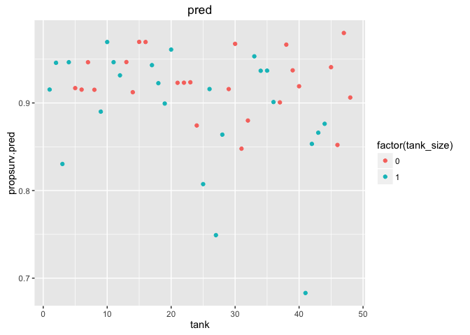
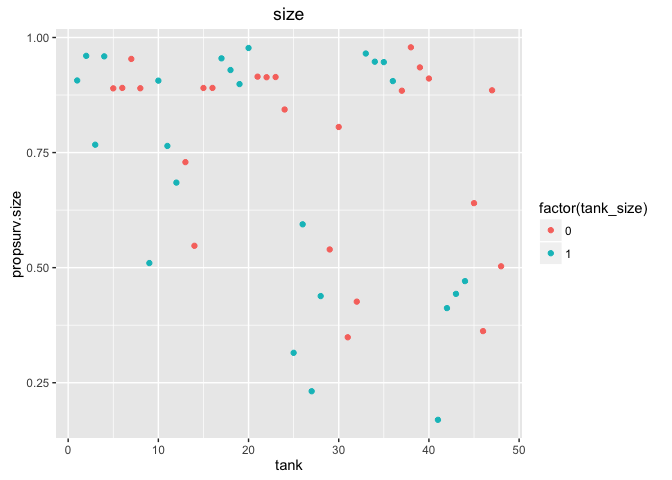

# Chapter-12

## 12E1. Which of the following priors will produce more shrinkage in the estimates? 

*(a) αtank ∼ Normal(0, 1)*; 
(b) αtank ∼ Normal(0, 2).

The tanks can be more diff with a wider prior so wont get shunk to the same values
The more strignent the tanks are the more the points move towards the same value


A wider pior will allow the model to move points more towards the datas mean, although this is not much larger...

## 12E2. Make the following model into a multilevel model.

yi ∼ Binomial(1, pi)
logit(pi) = αgroup[i] + βxi 
αgroup ∼ Normal(0, 10)
β ∼ Normal(0, 1)

yi ∼ Binomial(1, pi)
logit(pi) = αgroup[i] + βxi 
αgroup ∼ Normal(α, σ)
α ∼ Normal(0, 10) 
σ ∼ HalfCauchy(0, 1)
β ∼ Normal(0, 1)

## 12M1. Revisit the Reed frog survival data, data(reedfrogs), and add the predation and size treatment variables to the varying intercepts model. Consider models with either main effect alone, both main effects, as well as a model including both and their interaction. Instead of focusing on inferences about these two predictor variables, focus on the inferred variation across tanks. Explain why it changes as it does across models.


```r
library(rethinking)
```

```
## Loading required package: rstan
```

```
## Loading required package: ggplot2
```

```
## Loading required package: StanHeaders
```

```
## rstan (Version 2.12.1, packaged: 2016-09-11 13:07:50 UTC, GitRev: 85f7a56811da)
```

```
## For execution on a local, multicore CPU with excess RAM we recommend calling
## rstan_options(auto_write = TRUE)
## options(mc.cores = parallel::detectCores())
```

```
## Loading required package: parallel
```

```
## rethinking (Version 1.59)
```

```r
data(reedfrogs)
d <- reedfrogs
str(d)

pairs(d)
```

<!-- -->

```r
d$pred <- ifelse( d$pred=="pred" , 1 , 0 )
d$size <- ifelse( d$size=="big" , 1 , 0 )
#Consider models with either main effect alone, 
d$tank <- 1:nrow(d)
summary(d)

colnames(d) <- c("density","pred","tank_size","surv","propsurv","tank")

m12.2 <- map2stan(
    alist(
        surv ~ dbinom( density , p ) ,
        logit(p) <- a_tank[tank] ,
        a_tank[tank] ~ dnorm( a , sigma ) ,
        a ~ dnorm(0,1) ,
        sigma ~ dcauchy(0,1)
    ), data=d , iter=4000 , chains=4 )
```

```
## The following numerical problems occured the indicated number of times after warmup on chain 3
```

```
##                                                                                 count
## Exception thrown at line 17: normal_log: Scale parameter is 0, but must be > 0!     1
```

```
## When a numerical problem occurs, the Hamiltonian proposal gets rejected.
```

```
## See http://mc-stan.org/misc/warnings.html#exception-hamiltonian-proposal-rejected
```

```
## If the number in the 'count' column is small, do not ask about this message on stan-users.
```

```
## Computing WAIC
```

```
## Constructing posterior predictions
```

```
## Aggregated binomial counts detected. Splitting to 0/1 outcome for WAIC calculation.
```

```r
m12.2pred <- map2stan(
    alist(
        surv ~ dbinom( density , p ) ,
        logit(p) <- a_tank[tank] + bP*pred,
        a_tank[tank] ~ dnorm( a , sigma ) ,
        bP ~ dnorm(0,1),
        a ~ dnorm(0,1) ,
        sigma ~ dcauchy(0,1)
    ), data=d , iter=4000 , chains=4 )
```

```
## The following numerical problems occured the indicated number of times after warmup on chain 2
```

```
##                                                                                 count
## Exception thrown at line 20: normal_log: Scale parameter is 0, but must be > 0!     1
```

```
## When a numerical problem occurs, the Hamiltonian proposal gets rejected.
```

```
## See http://mc-stan.org/misc/warnings.html#exception-hamiltonian-proposal-rejected
```

```
## If the number in the 'count' column is small, do not ask about this message on stan-users.
```

```
## Computing WAIC
```

```
## Constructing posterior predictions
```

```
## Aggregated binomial counts detected. Splitting to 0/1 outcome for WAIC calculation.
```

```r
m12.2size <- map2stan(
    alist(
        surv ~ dbinom( density , p ) ,
        logit(p) <- a_tank[tank] + bS*tank_size,
        a_tank[tank] ~ dnorm( a , sigma ) ,
        bS ~ dnorm(0,1),
        a ~ dnorm(0,1) ,
        sigma ~ dcauchy(0,1)
    ), data=d , iter=4000 , chains=4 )
```

```
## The following numerical problems occured the indicated number of times after warmup on chain 2
```

```
##                                                                                 count
## Exception thrown at line 20: normal_log: Scale parameter is 0, but must be > 0!     1
```

```
## When a numerical problem occurs, the Hamiltonian proposal gets rejected.
```

```
## See http://mc-stan.org/misc/warnings.html#exception-hamiltonian-proposal-rejected
```

```
## If the number in the 'count' column is small, do not ask about this message on stan-users.
```

```
## The following numerical problems occured the indicated number of times after warmup on chain 3
```

```
##                                                                                 count
## Exception thrown at line 20: normal_log: Scale parameter is 0, but must be > 0!     1
```

```
## When a numerical problem occurs, the Hamiltonian proposal gets rejected.
```

```
## See http://mc-stan.org/misc/warnings.html#exception-hamiltonian-proposal-rejected
```

```
## If the number in the 'count' column is small, do not ask about this message on stan-users.
```

```
## The following numerical problems occured the indicated number of times after warmup on chain 4
```

```
##                                                                                 count
## Exception thrown at line 20: normal_log: Scale parameter is 0, but must be > 0!     1
```

```
## When a numerical problem occurs, the Hamiltonian proposal gets rejected.
```

```
## See http://mc-stan.org/misc/warnings.html#exception-hamiltonian-proposal-rejected
```

```
## If the number in the 'count' column is small, do not ask about this message on stan-users.
```

```
## Computing WAIC
```

```
## Constructing posterior predictions
```

```
## Aggregated binomial counts detected. Splitting to 0/1 outcome for WAIC calculation.
```

```r
#both main effects, as well as a model including both and their interaction.

m12.2pred_size <- map2stan(
    alist(
        surv ~ dbinom( density , p ) ,
        logit(p) <- a_tank[tank] + bP*pred + bS*tank_size,
        a_tank[tank] ~ dnorm( a , sigma ) ,
        c(bP,bS) ~ dnorm(0,1),
        a ~ dnorm(0,1) ,
        sigma ~ dcauchy(0,1)
    ), data=d , iter=4000 , chains=4 )
```

```
## The following numerical problems occured the indicated number of times after warmup on chain 4
```

```
##                                                                                 count
## Exception thrown at line 23: normal_log: Scale parameter is 0, but must be > 0!     2
```

```
## When a numerical problem occurs, the Hamiltonian proposal gets rejected.
```

```
## See http://mc-stan.org/misc/warnings.html#exception-hamiltonian-proposal-rejected
```

```
## If the number in the 'count' column is small, do not ask about this message on stan-users.
```

```
## Computing WAIC
```

```
## Constructing posterior predictions
```

```
## Aggregated binomial counts detected. Splitting to 0/1 outcome for WAIC calculation.
```

```r
#as well as a model including both and their interaction.


m12.2pred_sizei <- map2stan(
    alist(
        surv ~ dbinom( density , p ) ,
        logit(p) <- a_tank[tank] + bP*pred + bS*pred + bSP*pred+tank_size,
        a_tank[tank] ~ dnorm( a , sigma ) ,
        c(bP,bS,bSP) ~ dnorm(0,1),
        a ~ dnorm(0,1) ,
        sigma ~ dcauchy(0,1)
    ), data=d , iter=4000 , chains=4 )
```

```
## The following numerical problems occured the indicated number of times after warmup on chain 1
```

```
##                                                                                 count
## Exception thrown at line 25: normal_log: Scale parameter is 0, but must be > 0!     1
```

```
## When a numerical problem occurs, the Hamiltonian proposal gets rejected.
```

```
## See http://mc-stan.org/misc/warnings.html#exception-hamiltonian-proposal-rejected
```

```
## If the number in the 'count' column is small, do not ask about this message on stan-users.
```

```
## The following numerical problems occured the indicated number of times after warmup on chain 3
```

```
##                                                                                 count
## Exception thrown at line 25: normal_log: Scale parameter is 0, but must be > 0!     2
```

```
## When a numerical problem occurs, the Hamiltonian proposal gets rejected.
```

```
## See http://mc-stan.org/misc/warnings.html#exception-hamiltonian-proposal-rejected
```

```
## If the number in the 'count' column is small, do not ask about this message on stan-users.
```

```
## The following numerical problems occured the indicated number of times after warmup on chain 4
```

```
##                                                                                 count
## Exception thrown at line 25: normal_log: Scale parameter is 0, but must be > 0!     1
```

```
## When a numerical problem occurs, the Hamiltonian proposal gets rejected.
```

```
## See http://mc-stan.org/misc/warnings.html#exception-hamiltonian-proposal-rejected
```

```
## If the number in the 'count' column is small, do not ask about this message on stan-users.
```

```
## Computing WAIC
```

```
## Constructing posterior predictions
```

```
## Aggregated binomial counts detected. Splitting to 0/1 outcome for WAIC calculation.
```

```r
m12.2pred_size_i <- map2stan(
    alist(
        surv ~ dbinom( density , p ) ,
        logit(p) <- a_tank[tank] + bP*pred + bS*pred + bSP*pred+tank_size ,
        a_tank[tank] ~ dnorm( a , sigma ) ,
        c(bP,bS, bSP) ~ dnorm(0,1),
        a ~ dnorm(0,1) ,
        sigma ~ dcauchy(0,1)
    ), data=d , iter=4000 , chains=4 )
```

```
## Computing WAIC
```

```
## Constructing posterior predictions
```

```
## Aggregated binomial counts detected. Splitting to 0/1 outcome for WAIC calculation.
```


## 12M2. Compare the models you fit just above, using WAIC. Can you reconcile the diff erences in WAIC with the posterior distributions of the models?


```r
compare(m12.2pred, m12.2size, m12.2pred_size,m12.2pred_size_i)
```

```
##                    WAIC pWAIC dWAIC weight    SE  dSE
## m12.2pred_size   1000.2  27.9   0.0   0.50 36.82   NA
## m12.2pred        1000.5  28.7   0.2   0.45 36.93 1.41
## m12.2pred_size_i 1005.1  34.1   4.9   0.04 38.62 4.73
## m12.2size        1009.9  38.0   9.6   0.00 38.07 6.33
```


```r
library(ggplot2)

post <- extract.samples(m12.2pred)
# compute median intercept for each tank
# also transform to probability with logistic because of the logit function
## average for each tank of population 
d$propsurv.pred <- logistic( apply( post$a_tank , 2 , median ) ) 
ggplot(d, aes(tank,propsurv.pred)) + geom_point(aes(colour=factor(tank_size))) + labs(title = "pred")
```

<!-- -->

```r
### same for pred and size
post_pred_size <- extract.samples(m12.2pred_size)
d$propsurv.pred_size <- logistic( apply( post_pred_size$a_tank , 2 , median ) )
ggplot(d, aes(tank,propsurv.pred_size)) + geom_point(aes(colour=factor(tank_size))) + labs(title = "pred and size")
```

<!-- -->

```r
### same for pred and size
post_size <- extract.samples(m12.2size)
d$propsurv.size <- logistic( apply( post_size$a_tank , 2 , median ) )
ggplot(d, aes(tank,propsurv.size)) + geom_point(aes(colour=factor(tank_size))) + labs(title = "size")
```

<!-- -->

```r
### same for pred and size
post_pred_sizei <- extract.samples(m12.2pred_sizei)
d$propsurv.pred_sizei <- logistic( apply( post_pred_sizei$a_tank , 2 , median ) )
ggplot(d, aes(tank,propsurv.pred_sizei)) + geom_point(aes(colour=factor(tank_size)))+ labs(title = "pred and size interaction")
```

<!-- -->

```r
###link-makes predictions!!!!
###extact.samples pulls from posteior
```

## 12M3. Re-estimate the basic Reed frog varying intercept model,but now using a Cauchy distribution in place of the Gaussian distribution for the varying intercepts.  That is,  fit this model:


```r
library(rethinking)
data(reedfrogs)
d <- reedfrogs

d$tank <- 1:nrow(d)


m13.2a <- map2stan(
    alist(
        surv ~ dbinom( density , p ) ,
        logit(p) <- a_tank[tank] ,
        a_tank[tank] ~ dnorm( a , sigma ) ,
        a ~ dnorm(0,1) ,
        sigma ~ dcauchy(0,1)
    ), data=d , iter=4000 , chains=4 )
```

```
## Warning in FUN(X[[i]], ...): data with name pred is not numeric and not
## used
```

```
## Warning in FUN(X[[i]], ...): data with name size is not numeric and not
## used
```

```
## The following numerical problems occured the indicated number of times after warmup on chain 2
```

```
##                                                                                 count
## Exception thrown at line 17: normal_log: Scale parameter is 0, but must be > 0!     1
```

```
## When a numerical problem occurs, the Hamiltonian proposal gets rejected.
```

```
## See http://mc-stan.org/misc/warnings.html#exception-hamiltonian-proposal-rejected
```

```
## If the number in the 'count' column is small, do not ask about this message on stan-users.
```

```
## Warning in FUN(X[[i]], ...): data with name pred is not numeric and not
## used

## Warning in FUN(X[[i]], ...): data with name size is not numeric and not
## used
```

```
## Computing WAIC
```

```
## Constructing posterior predictions
```

```
## Aggregated binomial counts detected. Splitting to 0/1 outcome for WAIC calculation.
```

```r
m13.2b <- map2stan(
    alist(
        surv ~ dbinom( density , p ) ,
        logit(p) <- a_tank[tank] ,
        a_tank[tank] ~ cauchy( a , sigma ) ,
        a ~ dnorm(0,1) ,
        sigma ~ dcauchy(0,1)
    ), data=d , iter=4000 , chains=4 )
```

```
## Warning in FUN(X[[i]], ...): data with name pred is not numeric and not
## used

## Warning in FUN(X[[i]], ...): data with name size is not numeric and not
## used
```

```
## The following numerical problems occured the indicated number of times after warmup on chain 3
```

```
##                                                                                      count
## Exception thrown at line 17: cauchy_log: Scale parameter is inf, but must be finite!     1
```

```
## When a numerical problem occurs, the Hamiltonian proposal gets rejected.
```

```
## See http://mc-stan.org/misc/warnings.html#exception-hamiltonian-proposal-rejected
```

```
## If the number in the 'count' column is small, do not ask about this message on stan-users.
```

```
## The following numerical problems occured the indicated number of times after warmup on chain 4
```

```
##                                                                                 count
## Exception thrown at line 17: cauchy_log: Scale parameter is 0, but must be > 0!     1
```

```
## When a numerical problem occurs, the Hamiltonian proposal gets rejected.
```

```
## See http://mc-stan.org/misc/warnings.html#exception-hamiltonian-proposal-rejected
```

```
## If the number in the 'count' column is small, do not ask about this message on stan-users.
```

```
## Warning in FUN(X[[i]], ...): data with name pred is not numeric and not
## used

## Warning in FUN(X[[i]], ...): data with name size is not numeric and not
## used
```

```
## Computing WAIC
```

```
## Constructing posterior predictions
```

```
## Aggregated binomial counts detected. Splitting to 0/1 outcome for WAIC calculation.
```

Compare the posterior means of the intercepts, αtank, to the posterior means produced in the chapter, using the customary Gaussian prior. Can you explain the pattern of differences?


```r
precis(m13.2a)
```

```
## 48 vector or matrix parameters omitted in display. Use depth=2 to show them.
```

```r
precis(m13.2b)
```

```
## 48 vector or matrix parameters omitted in display. Use depth=2 to show them.
```

```r
precis(m13.2b, depth=2)
```

The model using the gaussian prior has a larger sigma than the dcauchy prior. Cauchy prior has a thick long tair which can cause sampling to swing much more than ussual.

## 12H1. In 1980, a typical Bengali woman could have 5 or more children in her lifetime. By the year 200, a typical Bengali woman had only 2 or 3. You’re going to look at a historical set of data, when contraception was widely available but many families chose not to use it.  These data reside in data(bangladesh) and come from the 1988 Bangladesh Fertility Survey. Each row is one of 1934 women.  There are six variables, but you can focus on three of them for this practice problem:


```r
data(bangladesh) 
d <- bangladesh
head(d)
```

(1) district: ID number of administrative district each woman resided in
(2) use.contraception: An indicator (0/1) of whether the woman was using contraception
(3) urban: An indicator (0/1) of whether the woman lived in a city, as opposed to living in a rural area

 The  first thing to do is ensure that the cluster variable, district, is a contiguous set of integers. Recall that these values will be index values inside the model. If there are gaps, you’ll have parameters for which there is no data to inform them. Worse, the model probably won’t run. Look at the unique values of the district variable
 

```r
sort(unique(d$district))
```

```
##  [1]  1  2  3  4  5  6  7  8  9 10 11 12 13 14 15 16 17 18 19 20 21 22 23
## [24] 24 25 26 27 28 29 30 31 32 33 34 35 36 37 38 39 40 41 42 43 44 45 46
## [47] 47 48 49 50 51 52 53 55 56 57 58 59 60 61
```

```r
length(sort(unique(d$district)))
```

```
## [1] 60
```
We are missing one as there are only 60 of 61

District 54 is absent. So district isn’t yet a good index variable, because it’s not contiguous. This is easy to  fix. Just make a new variable that is contiguous.  This is enough to do it:
 

```r
d$district_id <- as.integer(as.factor(d$district))
sort(unique(d$district_id))
```

```
##  [1]  1  2  3  4  5  6  7  8  9 10 11 12 13 14 15 16 17 18 19 20 21 22 23
## [24] 24 25 26 27 28 29 30 31 32 33 34 35 36 37 38 39 40 41 42 43 44 45 46
## [47] 47 48 49 50 51 52 53 54 55 56 57 58 59 60
```
 
Now there are 60 values, contiguous integers 1 to 60.
Now, focus on predicting use.contraception, clustered by district_id. Do not include
urban just yet.  Fit both (1) a traditional  fixed-effects model that uses dummy variables for district and (2) a multilevel model with varying intercepts for district. 


```r
colnames(d) <- gsub("\\.", "_", colnames(d))
d$number_of_women_in_distict <- rep(1,1934)
head(d)

aggd <-aggregate(d, by=list(d$district_id), 
  FUN=sum, na.rm=TRUE)
aggd$use_contraception_mean <- aggd$use_contraception/ aggd$number_of_women_in_distict

#h12.1a <- map2stan(
#    alist(
#        use_contraception ~ dbinom(number_of_women, p ) ,
#        logit(p) <- a_district[district_id],
#        a_district[district_id] ~ dnorm(0,1)
#    ), data=aggd , iter=4000 , chains=4 )


summary(aggd)


#h12.1a <- map2stan(
#    alist(
#        use_contraception ~ dbinom( 1 , p ),
#        logit(p) <- a_district[district_id] ,
#        a_district[district_id] ~ dnorm( 1 , 100 )
#    ), data=aggd , iter=4000 , chains=4, start=list(a=mean(aggd$use_contraception),b=0,sigma=sd(aggd$use_contraception)))


#h12.1b <- map2stan(
#    alist(
#        use_contraception ~ dbinom( 1 , p ) ,
#        logit(p) <- a_district[district_id] ,
#        a_district[district_id] ~ dnorm( a , sigma ) ,
#        a ~ dnorm(0,1) ,
#        sigma ~ dcauchy(0,1)
#    ), data=aggd , iter=4000 , chains=4,start=list(a=mean(aggd$use_contraception),b=0,sigma=sd(aggd$use_contraception)))
```

Plot the predicted proportions of women in each district using contraception, for both the  fixed-effects model and the varying-effects model.  That is, make a plot in which district ID is on the horizontal axis and expected proportion using contraception is on the vertical. 


```r
ggplot(aggd, aes(x=district_id, y=use_contraception_mean)) + geom_point()
```

<!-- -->

```r
#d.link <- link(fit = h12.1a, data = aggd)

#dim(d.link)
#head(d.link) #these are probabilities

#aggd$p.mean <- apply(d.link,2,mean)
#aggd$p.PI.low <- apply(d.link,2,PI)[1,]
#aggd$p.PI.high <- apply(d.link,2,PI)[2,]

#head(aggd)

#ggplot(aggd, aes(x=district_id, y=p.mean)) + geom_point()
```

Make one plot for each model, or layer them on the same plot, as you prefer. How do the models disagree? Can you explain the pattern of disagreement? In particular, can you explain the most extreme cases of disagreement, both why they happen where they do and why the models reach different inferences?
 
