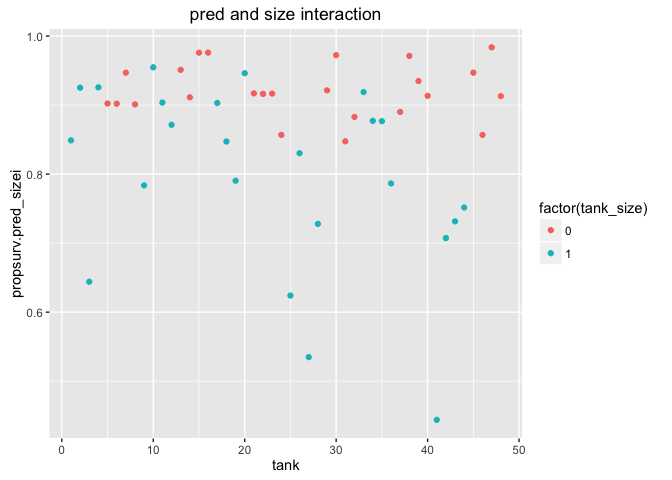

# Chapter-12

12E1. Which of the following priors will produce more shrinkage in the estimates? 
(a) αtank ∼ Normal(0, 1); 
*(b) αtank ∼ Normal(0, 2)*.

A wider pior will allow the model to move points more towards the datas mean, although this is not much larger...

12E2. Make the following model into a multilevel model.

yi ∼ Binomial(1, pi)
logit(pi) = αgroup[i] + βxi 
αgroup ∼ Normal(0, 10)
β ∼ Normal(0, 1)

yi ∼ Binomial(1, pi)
logit(pi) = αgroup[i] + βxi 
αgroup ∼ Normal(α, σ)
α ∼ Normal(0, 10) 
σ ∼ HalfCauchy(0, 1)
β ∼ Normal(0, 1)

12M1. Revisit the Reed frog survival data, data(reedfrogs), and add the predation and size treatment variables to the varying intercepts model. Consider models with either main effect alone, both main effects, as well as a model including both and their interaction. Instead of focusing on inferences about these two predictor variables, focus on the inferred variation across tanks. Explain why it changes as it does across models.


```r
library(rethinking)
```

```
## Loading required package: rstan
```

```
## Loading required package: ggplot2
```

```
## Loading required package: StanHeaders
```

```
## rstan (Version 2.12.1, packaged: 2016-09-11 13:07:50 UTC, GitRev: 85f7a56811da)
```

```
## For execution on a local, multicore CPU with excess RAM we recommend calling
## rstan_options(auto_write = TRUE)
## options(mc.cores = parallel::detectCores())
```

```
## Loading required package: parallel
```

```
## rethinking (Version 1.59)
```

```r
data(reedfrogs)
d <- reedfrogs
str(d)
```

```
## 'data.frame':	48 obs. of  5 variables:
##  $ density : int  10 10 10 10 10 10 10 10 10 10 ...
##  $ pred    : Factor w/ 2 levels "no","pred": 1 1 1 1 1 1 1 1 2 2 ...
##  $ size    : Factor w/ 2 levels "big","small": 1 1 1 1 2 2 2 2 1 1 ...
##  $ surv    : int  9 10 7 10 9 9 10 9 4 9 ...
##  $ propsurv: num  0.9 1 0.7 1 0.9 0.9 1 0.9 0.4 0.9 ...
```

```r
pairs(d)
```

<!-- -->

```r
d$pred <- ifelse( d$pred=="pred" , 1 , 0 )
d$size <- ifelse( d$size=="big" , 1 , 0 )
#Consider models with either main effect alone, 
d$tank <- 1:nrow(d)
summary(d)
```

```
##     density           pred          size          surv      
##  Min.   :10.00   Min.   :0.0   Min.   :0.0   Min.   : 4.00  
##  1st Qu.:10.00   1st Qu.:0.0   1st Qu.:0.0   1st Qu.: 9.00  
##  Median :25.00   Median :0.5   Median :0.5   Median :12.50  
##  Mean   :23.33   Mean   :0.5   Mean   :0.5   Mean   :16.31  
##  3rd Qu.:35.00   3rd Qu.:1.0   3rd Qu.:1.0   3rd Qu.:23.00  
##  Max.   :35.00   Max.   :1.0   Max.   :1.0   Max.   :35.00  
##     propsurv           tank      
##  Min.   :0.1143   Min.   : 1.00  
##  1st Qu.:0.4964   1st Qu.:12.75  
##  Median :0.8857   Median :24.50  
##  Mean   :0.7216   Mean   :24.50  
##  3rd Qu.:0.9200   3rd Qu.:36.25  
##  Max.   :1.0000   Max.   :48.00
```

```r
colnames(d) <- c("density","pred","tank_size","surv","propsurv","tank")

m12.2 <- map2stan(
    alist(
        surv ~ dbinom( density , p ) ,
        logit(p) <- a_tank[tank] ,
        a_tank[tank] ~ dnorm( a , sigma ) ,
        a ~ dnorm(0,1) ,
        sigma ~ dcauchy(0,1)
    ), data=d , iter=4000 , chains=4 )
```

```
## In file included from file5d2e2ad755d2.cpp:8:
## In file included from /Library/Frameworks/R.framework/Versions/3.3/Resources/library/StanHeaders/include/src/stan/model/model_header.hpp:4:
## In file included from /Library/Frameworks/R.framework/Versions/3.3/Resources/library/StanHeaders/include/stan/math.hpp:4:
## In file included from /Library/Frameworks/R.framework/Versions/3.3/Resources/library/StanHeaders/include/stan/math/rev/mat.hpp:4:
## In file included from /Library/Frameworks/R.framework/Versions/3.3/Resources/library/StanHeaders/include/stan/math/rev/core.hpp:42:
## /Library/Frameworks/R.framework/Versions/3.3/Resources/library/StanHeaders/include/stan/math/rev/core/set_zero_all_adjoints.hpp:14:17: warning: unused function 'set_zero_all_adjoints' [-Wunused-function]
##     static void set_zero_all_adjoints() {
##                 ^
## In file included from file5d2e2ad755d2.cpp:8:
## In file included from /Library/Frameworks/R.framework/Versions/3.3/Resources/library/StanHeaders/include/src/stan/model/model_header.hpp:4:
## In file included from /Library/Frameworks/R.framework/Versions/3.3/Resources/library/StanHeaders/include/stan/math.hpp:4:
## In file included from /Library/Frameworks/R.framework/Versions/3.3/Resources/library/StanHeaders/include/stan/math/rev/mat.hpp:4:
## In file included from /Library/Frameworks/R.framework/Versions/3.3/Resources/library/StanHeaders/include/stan/math/rev/core.hpp:43:
## /Library/Frameworks/R.framework/Versions/3.3/Resources/library/StanHeaders/include/stan/math/rev/core/set_zero_all_adjoints_nested.hpp:17:17: warning: 'static' function 'set_zero_all_adjoints_nested' declared in header file should be declared 'static inline' [-Wunneeded-internal-declaration]
##     static void set_zero_all_adjoints_nested() {
##                 ^
## In file included from file5d2e2ad755d2.cpp:8:
## In file included from /Library/Frameworks/R.framework/Versions/3.3/Resources/library/StanHeaders/include/src/stan/model/model_header.hpp:4:
## In file included from /Library/Frameworks/R.framework/Versions/3.3/Resources/library/StanHeaders/include/stan/math.hpp:4:
## In file included from /Library/Frameworks/R.framework/Versions/3.3/Resources/library/StanHeaders/include/stan/math/rev/mat.hpp:9:
## In file included from /Library/Frameworks/R.framework/Versions/3.3/Resources/library/StanHeaders/include/stan/math/prim/mat.hpp:54:
## /Library/Frameworks/R.framework/Versions/3.3/Resources/library/StanHeaders/include/stan/math/prim/mat/fun/autocorrelation.hpp:17:14: warning: function 'fft_next_good_size' is not needed and will not be emitted [-Wunneeded-internal-declaration]
##       size_t fft_next_good_size(size_t N) {
##              ^
## In file included from file5d2e2ad755d2.cpp:8:
## In file included from /Library/Frameworks/R.framework/Versions/3.3/Resources/library/StanHeaders/include/src/stan/model/model_header.hpp:4:
## In file included from /Library/Frameworks/R.framework/Versions/3.3/Resources/library/StanHeaders/include/stan/math.hpp:4:
## In file included from /Library/Frameworks/R.framework/Versions/3.3/Resources/library/StanHeaders/include/stan/math/rev/mat.hpp:9:
## In file included from /Library/Frameworks/R.framework/Versions/3.3/Resources/library/StanHeaders/include/stan/math/prim/mat.hpp:235:
## In file included from /Library/Frameworks/R.framework/Versions/3.3/Resources/library/StanHeaders/include/stan/math/prim/arr.hpp:36:
## In file included from /Library/Frameworks/R.framework/Versions/3.3/Resources/library/StanHeaders/include/stan/math/prim/arr/functor/integrate_ode_rk45.hpp:13:
## In file included from /Library/Frameworks/R.framework/Versions/3.3/Resources/library/BH/include/boost/numeric/odeint.hpp:61:
## In file included from /Library/Frameworks/R.framework/Versions/3.3/Resources/library/BH/include/boost/numeric/odeint/util/multi_array_adaption.hpp:29:
## In file included from /Library/Frameworks/R.framework/Versions/3.3/Resources/library/BH/include/boost/multi_array.hpp:21:
## In file included from /Library/Frameworks/R.framework/Versions/3.3/Resources/library/BH/include/boost/multi_array/base.hpp:28:
## /Library/Frameworks/R.framework/Versions/3.3/Resources/library/BH/include/boost/multi_array/concept_checks.hpp:42:43: warning: unused typedef 'index_range' [-Wunused-local-typedef]
##       typedef typename Array::index_range index_range;
##                                           ^
## /Library/Frameworks/R.framework/Versions/3.3/Resources/library/BH/include/boost/multi_array/concept_checks.hpp:43:37: warning: unused typedef 'index' [-Wunused-local-typedef]
##       typedef typename Array::index index;
##                                     ^
## /Library/Frameworks/R.framework/Versions/3.3/Resources/library/BH/include/boost/multi_array/concept_checks.hpp:53:43: warning: unused typedef 'index_range' [-Wunused-local-typedef]
##       typedef typename Array::index_range index_range;
##                                           ^
## /Library/Frameworks/R.framework/Versions/3.3/Resources/library/BH/include/boost/multi_array/concept_checks.hpp:54:37: warning: unused typedef 'index' [-Wunused-local-typedef]
##       typedef typename Array::index index;
##                                     ^
## 7 warnings generated.
## 
## SAMPLING FOR MODEL 'surv ~ dbinom(density, p)' NOW (CHAIN 1).
## 
## Chain 1, Iteration:    1 / 4000 [  0%]  (Warmup)
## Chain 1, Iteration:  400 / 4000 [ 10%]  (Warmup)
## Chain 1, Iteration:  800 / 4000 [ 20%]  (Warmup)
## Chain 1, Iteration: 1200 / 4000 [ 30%]  (Warmup)
## Chain 1, Iteration: 1600 / 4000 [ 40%]  (Warmup)
## Chain 1, Iteration: 2000 / 4000 [ 50%]  (Warmup)
## Chain 1, Iteration: 2001 / 4000 [ 50%]  (Sampling)
## Chain 1, Iteration: 2400 / 4000 [ 60%]  (Sampling)
## Chain 1, Iteration: 2800 / 4000 [ 70%]  (Sampling)
## Chain 1, Iteration: 3200 / 4000 [ 80%]  (Sampling)
## Chain 1, Iteration: 3600 / 4000 [ 90%]  (Sampling)
## Chain 1, Iteration: 4000 / 4000 [100%]  (Sampling)
##  Elapsed Time: 0.288789 seconds (Warm-up)
##                0.24722 seconds (Sampling)
##                0.536009 seconds (Total)
```

```
## The following numerical problems occured the indicated number of times after warmup on chain 1
```

```
##                                                                                 count
## Exception thrown at line 17: normal_log: Scale parameter is 0, but must be > 0!     2
```

```
## When a numerical problem occurs, the Hamiltonian proposal gets rejected.
```

```
## See http://mc-stan.org/misc/warnings.html#exception-hamiltonian-proposal-rejected
```

```
## If the number in the 'count' column is small, do not ask about this message on stan-users.
```

```
## 
## SAMPLING FOR MODEL 'surv ~ dbinom(density, p)' NOW (CHAIN 2).
## 
## Chain 2, Iteration:    1 / 4000 [  0%]  (Warmup)
## Chain 2, Iteration:  400 / 4000 [ 10%]  (Warmup)
## Chain 2, Iteration:  800 / 4000 [ 20%]  (Warmup)
## Chain 2, Iteration: 1200 / 4000 [ 30%]  (Warmup)
## Chain 2, Iteration: 1600 / 4000 [ 40%]  (Warmup)
## Chain 2, Iteration: 2000 / 4000 [ 50%]  (Warmup)
## Chain 2, Iteration: 2001 / 4000 [ 50%]  (Sampling)
## Chain 2, Iteration: 2400 / 4000 [ 60%]  (Sampling)
## Chain 2, Iteration: 2800 / 4000 [ 70%]  (Sampling)
## Chain 2, Iteration: 3200 / 4000 [ 80%]  (Sampling)
## Chain 2, Iteration: 3600 / 4000 [ 90%]  (Sampling)
## Chain 2, Iteration: 4000 / 4000 [100%]  (Sampling)
##  Elapsed Time: 0.290868 seconds (Warm-up)
##                0.366216 seconds (Sampling)
##                0.657084 seconds (Total)
```

```
## The following numerical problems occured the indicated number of times after warmup on chain 2
```

```
##                                                                                 count
## Exception thrown at line 17: normal_log: Scale parameter is 0, but must be > 0!     1
```

```
## When a numerical problem occurs, the Hamiltonian proposal gets rejected.
```

```
## See http://mc-stan.org/misc/warnings.html#exception-hamiltonian-proposal-rejected
```

```
## If the number in the 'count' column is small, do not ask about this message on stan-users.
```

```
## 
## SAMPLING FOR MODEL 'surv ~ dbinom(density, p)' NOW (CHAIN 3).
## 
## Chain 3, Iteration:    1 / 4000 [  0%]  (Warmup)
## Chain 3, Iteration:  400 / 4000 [ 10%]  (Warmup)
## Chain 3, Iteration:  800 / 4000 [ 20%]  (Warmup)
## Chain 3, Iteration: 1200 / 4000 [ 30%]  (Warmup)
## Chain 3, Iteration: 1600 / 4000 [ 40%]  (Warmup)
## Chain 3, Iteration: 2000 / 4000 [ 50%]  (Warmup)
## Chain 3, Iteration: 2001 / 4000 [ 50%]  (Sampling)
## Chain 3, Iteration: 2400 / 4000 [ 60%]  (Sampling)
## Chain 3, Iteration: 2800 / 4000 [ 70%]  (Sampling)
## Chain 3, Iteration: 3200 / 4000 [ 80%]  (Sampling)
## Chain 3, Iteration: 3600 / 4000 [ 90%]  (Sampling)
## Chain 3, Iteration: 4000 / 4000 [100%]  (Sampling)
##  Elapsed Time: 0.365005 seconds (Warm-up)
##                0.311356 seconds (Sampling)
##                0.676361 seconds (Total)
## 
## 
## SAMPLING FOR MODEL 'surv ~ dbinom(density, p)' NOW (CHAIN 4).
## 
## Chain 4, Iteration:    1 / 4000 [  0%]  (Warmup)
## Chain 4, Iteration:  400 / 4000 [ 10%]  (Warmup)
## Chain 4, Iteration:  800 / 4000 [ 20%]  (Warmup)
## Chain 4, Iteration: 1200 / 4000 [ 30%]  (Warmup)
## Chain 4, Iteration: 1600 / 4000 [ 40%]  (Warmup)
## Chain 4, Iteration: 2000 / 4000 [ 50%]  (Warmup)
## Chain 4, Iteration: 2001 / 4000 [ 50%]  (Sampling)
## Chain 4, Iteration: 2400 / 4000 [ 60%]  (Sampling)
## Chain 4, Iteration: 2800 / 4000 [ 70%]  (Sampling)
## Chain 4, Iteration: 3200 / 4000 [ 80%]  (Sampling)
## Chain 4, Iteration: 3600 / 4000 [ 90%]  (Sampling)
## Chain 4, Iteration: 4000 / 4000 [100%]  (Sampling)
##  Elapsed Time: 0.331874 seconds (Warm-up)
##                0.318384 seconds (Sampling)
##                0.650258 seconds (Total)
## 
## 
## SAMPLING FOR MODEL 'surv ~ dbinom(density, p)' NOW (CHAIN 1).
## WARNING: No variance estimation is
##          performed for num_warmup < 20
## 
## 
## Chain 1, Iteration: 1 / 1 [100%]  (Sampling)
##  Elapsed Time: 5e-06 seconds (Warm-up)
##                0.00013 seconds (Sampling)
##                0.000135 seconds (Total)
```

```
## Computing WAIC
```

```
## Constructing posterior predictions
```

```
## [ 800 / 8000 ]
[ 1600 / 8000 ]
[ 2400 / 8000 ]
[ 3200 / 8000 ]
[ 4000 / 8000 ]
[ 4800 / 8000 ]
[ 5600 / 8000 ]
[ 6400 / 8000 ]
[ 7200 / 8000 ]
[ 8000 / 8000 ]
```

```
## Aggregated binomial counts detected. Splitting to 0/1 outcome for WAIC calculation.
```

```r
m12.2pred <- map2stan(
    alist(
        surv ~ dbinom( density , p ) ,
        logit(p) <- a_tank[tank] + bP*pred,
        a_tank[tank] ~ dnorm( a , sigma ) ,
        bP ~ dnorm(0,1),
        a ~ dnorm(0,1) ,
        sigma ~ dcauchy(0,1)
    ), data=d , iter=4000 , chains=4 )
```

```
## In file included from file5d2e5e8d163d.cpp:8:
## In file included from /Library/Frameworks/R.framework/Versions/3.3/Resources/library/StanHeaders/include/src/stan/model/model_header.hpp:4:
## In file included from /Library/Frameworks/R.framework/Versions/3.3/Resources/library/StanHeaders/include/stan/math.hpp:4:
## In file included from /Library/Frameworks/R.framework/Versions/3.3/Resources/library/StanHeaders/include/stan/math/rev/mat.hpp:4:
## In file included from /Library/Frameworks/R.framework/Versions/3.3/Resources/library/StanHeaders/include/stan/math/rev/core.hpp:42:
## /Library/Frameworks/R.framework/Versions/3.3/Resources/library/StanHeaders/include/stan/math/rev/core/set_zero_all_adjoints.hpp:14:17: warning: unused function 'set_zero_all_adjoints' [-Wunused-function]
##     static void set_zero_all_adjoints() {
##                 ^
## In file included from file5d2e5e8d163d.cpp:8:
## In file included from /Library/Frameworks/R.framework/Versions/3.3/Resources/library/StanHeaders/include/src/stan/model/model_header.hpp:4:
## In file included from /Library/Frameworks/R.framework/Versions/3.3/Resources/library/StanHeaders/include/stan/math.hpp:4:
## In file included from /Library/Frameworks/R.framework/Versions/3.3/Resources/library/StanHeaders/include/stan/math/rev/mat.hpp:4:
## In file included from /Library/Frameworks/R.framework/Versions/3.3/Resources/library/StanHeaders/include/stan/math/rev/core.hpp:43:
## /Library/Frameworks/R.framework/Versions/3.3/Resources/library/StanHeaders/include/stan/math/rev/core/set_zero_all_adjoints_nested.hpp:17:17: warning: 'static' function 'set_zero_all_adjoints_nested' declared in header file should be declared 'static inline' [-Wunneeded-internal-declaration]
##     static void set_zero_all_adjoints_nested() {
##                 ^
## In file included from file5d2e5e8d163d.cpp:8:
## In file included from /Library/Frameworks/R.framework/Versions/3.3/Resources/library/StanHeaders/include/src/stan/model/model_header.hpp:4:
## In file included from /Library/Frameworks/R.framework/Versions/3.3/Resources/library/StanHeaders/include/stan/math.hpp:4:
## In file included from /Library/Frameworks/R.framework/Versions/3.3/Resources/library/StanHeaders/include/stan/math/rev/mat.hpp:9:
## In file included from /Library/Frameworks/R.framework/Versions/3.3/Resources/library/StanHeaders/include/stan/math/prim/mat.hpp:54:
## /Library/Frameworks/R.framework/Versions/3.3/Resources/library/StanHeaders/include/stan/math/prim/mat/fun/autocorrelation.hpp:17:14: warning: function 'fft_next_good_size' is not needed and will not be emitted [-Wunneeded-internal-declaration]
##       size_t fft_next_good_size(size_t N) {
##              ^
## In file included from file5d2e5e8d163d.cpp:8:
## In file included from /Library/Frameworks/R.framework/Versions/3.3/Resources/library/StanHeaders/include/src/stan/model/model_header.hpp:4:
## In file included from /Library/Frameworks/R.framework/Versions/3.3/Resources/library/StanHeaders/include/stan/math.hpp:4:
## In file included from /Library/Frameworks/R.framework/Versions/3.3/Resources/library/StanHeaders/include/stan/math/rev/mat.hpp:9:
## In file included from /Library/Frameworks/R.framework/Versions/3.3/Resources/library/StanHeaders/include/stan/math/prim/mat.hpp:235:
## In file included from /Library/Frameworks/R.framework/Versions/3.3/Resources/library/StanHeaders/include/stan/math/prim/arr.hpp:36:
## In file included from /Library/Frameworks/R.framework/Versions/3.3/Resources/library/StanHeaders/include/stan/math/prim/arr/functor/integrate_ode_rk45.hpp:13:
## In file included from /Library/Frameworks/R.framework/Versions/3.3/Resources/library/BH/include/boost/numeric/odeint.hpp:61:
## In file included from /Library/Frameworks/R.framework/Versions/3.3/Resources/library/BH/include/boost/numeric/odeint/util/multi_array_adaption.hpp:29:
## In file included from /Library/Frameworks/R.framework/Versions/3.3/Resources/library/BH/include/boost/multi_array.hpp:21:
## In file included from /Library/Frameworks/R.framework/Versions/3.3/Resources/library/BH/include/boost/multi_array/base.hpp:28:
## /Library/Frameworks/R.framework/Versions/3.3/Resources/library/BH/include/boost/multi_array/concept_checks.hpp:42:43: warning: unused typedef 'index_range' [-Wunused-local-typedef]
##       typedef typename Array::index_range index_range;
##                                           ^
## /Library/Frameworks/R.framework/Versions/3.3/Resources/library/BH/include/boost/multi_array/concept_checks.hpp:43:37: warning: unused typedef 'index' [-Wunused-local-typedef]
##       typedef typename Array::index index;
##                                     ^
## /Library/Frameworks/R.framework/Versions/3.3/Resources/library/BH/include/boost/multi_array/concept_checks.hpp:53:43: warning: unused typedef 'index_range' [-Wunused-local-typedef]
##       typedef typename Array::index_range index_range;
##                                           ^
## /Library/Frameworks/R.framework/Versions/3.3/Resources/library/BH/include/boost/multi_array/concept_checks.hpp:54:37: warning: unused typedef 'index' [-Wunused-local-typedef]
##       typedef typename Array::index index;
##                                     ^
## 7 warnings generated.
## 
## SAMPLING FOR MODEL 'surv ~ dbinom(density, p)' NOW (CHAIN 1).
## 
## Chain 1, Iteration:    1 / 4000 [  0%]  (Warmup)
## Chain 1, Iteration:  400 / 4000 [ 10%]  (Warmup)
## Chain 1, Iteration:  800 / 4000 [ 20%]  (Warmup)
## Chain 1, Iteration: 1200 / 4000 [ 30%]  (Warmup)
## Chain 1, Iteration: 1600 / 4000 [ 40%]  (Warmup)
## Chain 1, Iteration: 2000 / 4000 [ 50%]  (Warmup)
## Chain 1, Iteration: 2001 / 4000 [ 50%]  (Sampling)
## Chain 1, Iteration: 2400 / 4000 [ 60%]  (Sampling)
## Chain 1, Iteration: 2800 / 4000 [ 70%]  (Sampling)
## Chain 1, Iteration: 3200 / 4000 [ 80%]  (Sampling)
## Chain 1, Iteration: 3600 / 4000 [ 90%]  (Sampling)
## Chain 1, Iteration: 4000 / 4000 [100%]  (Sampling)
##  Elapsed Time: 0.386303 seconds (Warm-up)
##                0.422185 seconds (Sampling)
##                0.808488 seconds (Total)
```

```
## The following numerical problems occured the indicated number of times after warmup on chain 1
```

```
##                                                                                 count
## Exception thrown at line 20: normal_log: Scale parameter is 0, but must be > 0!     1
```

```
## When a numerical problem occurs, the Hamiltonian proposal gets rejected.
```

```
## See http://mc-stan.org/misc/warnings.html#exception-hamiltonian-proposal-rejected
```

```
## If the number in the 'count' column is small, do not ask about this message on stan-users.
```

```
## 
## SAMPLING FOR MODEL 'surv ~ dbinom(density, p)' NOW (CHAIN 2).
## 
## Chain 2, Iteration:    1 / 4000 [  0%]  (Warmup)
## Chain 2, Iteration:  400 / 4000 [ 10%]  (Warmup)
## Chain 2, Iteration:  800 / 4000 [ 20%]  (Warmup)
## Chain 2, Iteration: 1200 / 4000 [ 30%]  (Warmup)
## Chain 2, Iteration: 1600 / 4000 [ 40%]  (Warmup)
## Chain 2, Iteration: 2000 / 4000 [ 50%]  (Warmup)
## Chain 2, Iteration: 2001 / 4000 [ 50%]  (Sampling)
## Chain 2, Iteration: 2400 / 4000 [ 60%]  (Sampling)
## Chain 2, Iteration: 2800 / 4000 [ 70%]  (Sampling)
## Chain 2, Iteration: 3200 / 4000 [ 80%]  (Sampling)
## Chain 2, Iteration: 3600 / 4000 [ 90%]  (Sampling)
## Chain 2, Iteration: 4000 / 4000 [100%]  (Sampling)
##  Elapsed Time: 0.422339 seconds (Warm-up)
##                0.462823 seconds (Sampling)
##                0.885162 seconds (Total)
## 
## 
## SAMPLING FOR MODEL 'surv ~ dbinom(density, p)' NOW (CHAIN 3).
## 
## Chain 3, Iteration:    1 / 4000 [  0%]  (Warmup)
## Chain 3, Iteration:  400 / 4000 [ 10%]  (Warmup)
## Chain 3, Iteration:  800 / 4000 [ 20%]  (Warmup)
## Chain 3, Iteration: 1200 / 4000 [ 30%]  (Warmup)
## Chain 3, Iteration: 1600 / 4000 [ 40%]  (Warmup)
## Chain 3, Iteration: 2000 / 4000 [ 50%]  (Warmup)
## Chain 3, Iteration: 2001 / 4000 [ 50%]  (Sampling)
## Chain 3, Iteration: 2400 / 4000 [ 60%]  (Sampling)
## Chain 3, Iteration: 2800 / 4000 [ 70%]  (Sampling)
## Chain 3, Iteration: 3200 / 4000 [ 80%]  (Sampling)
## Chain 3, Iteration: 3600 / 4000 [ 90%]  (Sampling)
## Chain 3, Iteration: 4000 / 4000 [100%]  (Sampling)
##  Elapsed Time: 0.45254 seconds (Warm-up)
##                0.501452 seconds (Sampling)
##                0.953992 seconds (Total)
```

```
## The following numerical problems occured the indicated number of times after warmup on chain 3
```

```
##                                                                                 count
## Exception thrown at line 20: normal_log: Scale parameter is 0, but must be > 0!     2
```

```
## When a numerical problem occurs, the Hamiltonian proposal gets rejected.
```

```
## See http://mc-stan.org/misc/warnings.html#exception-hamiltonian-proposal-rejected
```

```
## If the number in the 'count' column is small, do not ask about this message on stan-users.
```

```
## 
## SAMPLING FOR MODEL 'surv ~ dbinom(density, p)' NOW (CHAIN 4).
## 
## Chain 4, Iteration:    1 / 4000 [  0%]  (Warmup)
## Chain 4, Iteration:  400 / 4000 [ 10%]  (Warmup)
## Chain 4, Iteration:  800 / 4000 [ 20%]  (Warmup)
## Chain 4, Iteration: 1200 / 4000 [ 30%]  (Warmup)
## Chain 4, Iteration: 1600 / 4000 [ 40%]  (Warmup)
## Chain 4, Iteration: 2000 / 4000 [ 50%]  (Warmup)
## Chain 4, Iteration: 2001 / 4000 [ 50%]  (Sampling)
## Chain 4, Iteration: 2400 / 4000 [ 60%]  (Sampling)
## Chain 4, Iteration: 2800 / 4000 [ 70%]  (Sampling)
## Chain 4, Iteration: 3200 / 4000 [ 80%]  (Sampling)
## Chain 4, Iteration: 3600 / 4000 [ 90%]  (Sampling)
## Chain 4, Iteration: 4000 / 4000 [100%]  (Sampling)
##  Elapsed Time: 0.46965 seconds (Warm-up)
##                0.472235 seconds (Sampling)
##                0.941885 seconds (Total)
## 
## 
## SAMPLING FOR MODEL 'surv ~ dbinom(density, p)' NOW (CHAIN 1).
## WARNING: No variance estimation is
##          performed for num_warmup < 20
## 
## 
## Chain 1, Iteration: 1 / 1 [100%]  (Sampling)
##  Elapsed Time: 8e-06 seconds (Warm-up)
##                0.000114 seconds (Sampling)
##                0.000122 seconds (Total)
```

```
## Computing WAIC
```

```
## Constructing posterior predictions
```

```
## [ 800 / 8000 ]
[ 1600 / 8000 ]
[ 2400 / 8000 ]
[ 3200 / 8000 ]
[ 4000 / 8000 ]
[ 4800 / 8000 ]
[ 5600 / 8000 ]
[ 6400 / 8000 ]
[ 7200 / 8000 ]
[ 8000 / 8000 ]
```

```
## Aggregated binomial counts detected. Splitting to 0/1 outcome for WAIC calculation.
```

```r
m12.2size <- map2stan(
    alist(
        surv ~ dbinom( density , p ) ,
        logit(p) <- a_tank[tank] + bS*tank_size,
        a_tank[tank] ~ dnorm( a , sigma ) ,
        bS ~ dnorm(0,1),
        a ~ dnorm(0,1) ,
        sigma ~ dcauchy(0,1)
    ), data=d , iter=4000 , chains=4 )
```

```
## In file included from file5d2e2372aa.cpp:8:
## In file included from /Library/Frameworks/R.framework/Versions/3.3/Resources/library/StanHeaders/include/src/stan/model/model_header.hpp:4:
## In file included from /Library/Frameworks/R.framework/Versions/3.3/Resources/library/StanHeaders/include/stan/math.hpp:4:
## In file included from /Library/Frameworks/R.framework/Versions/3.3/Resources/library/StanHeaders/include/stan/math/rev/mat.hpp:4:
## In file included from /Library/Frameworks/R.framework/Versions/3.3/Resources/library/StanHeaders/include/stan/math/rev/core.hpp:42:
## /Library/Frameworks/R.framework/Versions/3.3/Resources/library/StanHeaders/include/stan/math/rev/core/set_zero_all_adjoints.hpp:14:17: warning: unused function 'set_zero_all_adjoints' [-Wunused-function]
##     static void set_zero_all_adjoints() {
##                 ^
## In file included from file5d2e2372aa.cpp:8:
## In file included from /Library/Frameworks/R.framework/Versions/3.3/Resources/library/StanHeaders/include/src/stan/model/model_header.hpp:4:
## In file included from /Library/Frameworks/R.framework/Versions/3.3/Resources/library/StanHeaders/include/stan/math.hpp:4:
## In file included from /Library/Frameworks/R.framework/Versions/3.3/Resources/library/StanHeaders/include/stan/math/rev/mat.hpp:4:
## In file included from /Library/Frameworks/R.framework/Versions/3.3/Resources/library/StanHeaders/include/stan/math/rev/core.hpp:43:
## /Library/Frameworks/R.framework/Versions/3.3/Resources/library/StanHeaders/include/stan/math/rev/core/set_zero_all_adjoints_nested.hpp:17:17: warning: 'static' function 'set_zero_all_adjoints_nested' declared in header file should be declared 'static inline' [-Wunneeded-internal-declaration]
##     static void set_zero_all_adjoints_nested() {
##                 ^
## In file included from file5d2e2372aa.cpp:8:
## In file included from /Library/Frameworks/R.framework/Versions/3.3/Resources/library/StanHeaders/include/src/stan/model/model_header.hpp:4:
## In file included from /Library/Frameworks/R.framework/Versions/3.3/Resources/library/StanHeaders/include/stan/math.hpp:4:
## In file included from /Library/Frameworks/R.framework/Versions/3.3/Resources/library/StanHeaders/include/stan/math/rev/mat.hpp:9:
## In file included from /Library/Frameworks/R.framework/Versions/3.3/Resources/library/StanHeaders/include/stan/math/prim/mat.hpp:54:
## /Library/Frameworks/R.framework/Versions/3.3/Resources/library/StanHeaders/include/stan/math/prim/mat/fun/autocorrelation.hpp:17:14: warning: function 'fft_next_good_size' is not needed and will not be emitted [-Wunneeded-internal-declaration]
##       size_t fft_next_good_size(size_t N) {
##              ^
## In file included from file5d2e2372aa.cpp:8:
## In file included from /Library/Frameworks/R.framework/Versions/3.3/Resources/library/StanHeaders/include/src/stan/model/model_header.hpp:4:
## In file included from /Library/Frameworks/R.framework/Versions/3.3/Resources/library/StanHeaders/include/stan/math.hpp:4:
## In file included from /Library/Frameworks/R.framework/Versions/3.3/Resources/library/StanHeaders/include/stan/math/rev/mat.hpp:9:
## In file included from /Library/Frameworks/R.framework/Versions/3.3/Resources/library/StanHeaders/include/stan/math/prim/mat.hpp:235:
## In file included from /Library/Frameworks/R.framework/Versions/3.3/Resources/library/StanHeaders/include/stan/math/prim/arr.hpp:36:
## In file included from /Library/Frameworks/R.framework/Versions/3.3/Resources/library/StanHeaders/include/stan/math/prim/arr/functor/integrate_ode_rk45.hpp:13:
## In file included from /Library/Frameworks/R.framework/Versions/3.3/Resources/library/BH/include/boost/numeric/odeint.hpp:61:
## In file included from /Library/Frameworks/R.framework/Versions/3.3/Resources/library/BH/include/boost/numeric/odeint/util/multi_array_adaption.hpp:29:
## In file included from /Library/Frameworks/R.framework/Versions/3.3/Resources/library/BH/include/boost/multi_array.hpp:21:
## In file included from /Library/Frameworks/R.framework/Versions/3.3/Resources/library/BH/include/boost/multi_array/base.hpp:28:
## /Library/Frameworks/R.framework/Versions/3.3/Resources/library/BH/include/boost/multi_array/concept_checks.hpp:42:43: warning: unused typedef 'index_range' [-Wunused-local-typedef]
##       typedef typename Array::index_range index_range;
##                                           ^
## /Library/Frameworks/R.framework/Versions/3.3/Resources/library/BH/include/boost/multi_array/concept_checks.hpp:43:37: warning: unused typedef 'index' [-Wunused-local-typedef]
##       typedef typename Array::index index;
##                                     ^
## /Library/Frameworks/R.framework/Versions/3.3/Resources/library/BH/include/boost/multi_array/concept_checks.hpp:53:43: warning: unused typedef 'index_range' [-Wunused-local-typedef]
##       typedef typename Array::index_range index_range;
##                                           ^
## /Library/Frameworks/R.framework/Versions/3.3/Resources/library/BH/include/boost/multi_array/concept_checks.hpp:54:37: warning: unused typedef 'index' [-Wunused-local-typedef]
##       typedef typename Array::index index;
##                                     ^
## 7 warnings generated.
## 
## SAMPLING FOR MODEL 'surv ~ dbinom(density, p)' NOW (CHAIN 1).
## 
## Chain 1, Iteration:    1 / 4000 [  0%]  (Warmup)
## Chain 1, Iteration:  400 / 4000 [ 10%]  (Warmup)
## Chain 1, Iteration:  800 / 4000 [ 20%]  (Warmup)
## Chain 1, Iteration: 1200 / 4000 [ 30%]  (Warmup)
## Chain 1, Iteration: 1600 / 4000 [ 40%]  (Warmup)
## Chain 1, Iteration: 2000 / 4000 [ 50%]  (Warmup)
## Chain 1, Iteration: 2001 / 4000 [ 50%]  (Sampling)
## Chain 1, Iteration: 2400 / 4000 [ 60%]  (Sampling)
## Chain 1, Iteration: 2800 / 4000 [ 70%]  (Sampling)
## Chain 1, Iteration: 3200 / 4000 [ 80%]  (Sampling)
## Chain 1, Iteration: 3600 / 4000 [ 90%]  (Sampling)
## Chain 1, Iteration: 4000 / 4000 [100%]  (Sampling)
##  Elapsed Time: 0.532355 seconds (Warm-up)
##                0.561703 seconds (Sampling)
##                1.09406 seconds (Total)
## 
## 
## SAMPLING FOR MODEL 'surv ~ dbinom(density, p)' NOW (CHAIN 2).
## 
## Chain 2, Iteration:    1 / 4000 [  0%]  (Warmup)
## Chain 2, Iteration:  400 / 4000 [ 10%]  (Warmup)
## Chain 2, Iteration:  800 / 4000 [ 20%]  (Warmup)
## Chain 2, Iteration: 1200 / 4000 [ 30%]  (Warmup)
## Chain 2, Iteration: 1600 / 4000 [ 40%]  (Warmup)
## Chain 2, Iteration: 2000 / 4000 [ 50%]  (Warmup)
## Chain 2, Iteration: 2001 / 4000 [ 50%]  (Sampling)
## Chain 2, Iteration: 2400 / 4000 [ 60%]  (Sampling)
## Chain 2, Iteration: 2800 / 4000 [ 70%]  (Sampling)
## Chain 2, Iteration: 3200 / 4000 [ 80%]  (Sampling)
## Chain 2, Iteration: 3600 / 4000 [ 90%]  (Sampling)
## Chain 2, Iteration: 4000 / 4000 [100%]  (Sampling)
##  Elapsed Time: 0.516584 seconds (Warm-up)
##                0.616023 seconds (Sampling)
##                1.13261 seconds (Total)
## 
## 
## SAMPLING FOR MODEL 'surv ~ dbinom(density, p)' NOW (CHAIN 3).
## 
## Chain 3, Iteration:    1 / 4000 [  0%]  (Warmup)
## Chain 3, Iteration:  400 / 4000 [ 10%]  (Warmup)
## Chain 3, Iteration:  800 / 4000 [ 20%]  (Warmup)
## Chain 3, Iteration: 1200 / 4000 [ 30%]  (Warmup)
## Chain 3, Iteration: 1600 / 4000 [ 40%]  (Warmup)
## Chain 3, Iteration: 2000 / 4000 [ 50%]  (Warmup)
## Chain 3, Iteration: 2001 / 4000 [ 50%]  (Sampling)
## Chain 3, Iteration: 2400 / 4000 [ 60%]  (Sampling)
## Chain 3, Iteration: 2800 / 4000 [ 70%]  (Sampling)
## Chain 3, Iteration: 3200 / 4000 [ 80%]  (Sampling)
## Chain 3, Iteration: 3600 / 4000 [ 90%]  (Sampling)
## Chain 3, Iteration: 4000 / 4000 [100%]  (Sampling)
##  Elapsed Time: 0.466656 seconds (Warm-up)
##                0.534286 seconds (Sampling)
##                1.00094 seconds (Total)
```

```
## The following numerical problems occured the indicated number of times after warmup on chain 3
```

```
##                                                                                 count
## Exception thrown at line 20: normal_log: Scale parameter is 0, but must be > 0!     2
```

```
## When a numerical problem occurs, the Hamiltonian proposal gets rejected.
```

```
## See http://mc-stan.org/misc/warnings.html#exception-hamiltonian-proposal-rejected
```

```
## If the number in the 'count' column is small, do not ask about this message on stan-users.
```

```
## 
## SAMPLING FOR MODEL 'surv ~ dbinom(density, p)' NOW (CHAIN 4).
## 
## Chain 4, Iteration:    1 / 4000 [  0%]  (Warmup)
## Chain 4, Iteration:  400 / 4000 [ 10%]  (Warmup)
## Chain 4, Iteration:  800 / 4000 [ 20%]  (Warmup)
## Chain 4, Iteration: 1200 / 4000 [ 30%]  (Warmup)
## Chain 4, Iteration: 1600 / 4000 [ 40%]  (Warmup)
## Chain 4, Iteration: 2000 / 4000 [ 50%]  (Warmup)
## Chain 4, Iteration: 2001 / 4000 [ 50%]  (Sampling)
## Chain 4, Iteration: 2400 / 4000 [ 60%]  (Sampling)
## Chain 4, Iteration: 2800 / 4000 [ 70%]  (Sampling)
## Chain 4, Iteration: 3200 / 4000 [ 80%]  (Sampling)
## Chain 4, Iteration: 3600 / 4000 [ 90%]  (Sampling)
## Chain 4, Iteration: 4000 / 4000 [100%]  (Sampling)
##  Elapsed Time: 0.57134 seconds (Warm-up)
##                0.559871 seconds (Sampling)
##                1.13121 seconds (Total)
```

```
## The following numerical problems occured the indicated number of times after warmup on chain 4
```

```
##                                                                                 count
## Exception thrown at line 20: normal_log: Scale parameter is 0, but must be > 0!     1
```

```
## When a numerical problem occurs, the Hamiltonian proposal gets rejected.
```

```
## See http://mc-stan.org/misc/warnings.html#exception-hamiltonian-proposal-rejected
```

```
## If the number in the 'count' column is small, do not ask about this message on stan-users.
```

```
## 
## SAMPLING FOR MODEL 'surv ~ dbinom(density, p)' NOW (CHAIN 1).
## WARNING: No variance estimation is
##          performed for num_warmup < 20
## 
## 
## Chain 1, Iteration: 1 / 1 [100%]  (Sampling)
##  Elapsed Time: 4e-06 seconds (Warm-up)
##                7.8e-05 seconds (Sampling)
##                8.2e-05 seconds (Total)
```

```
## Computing WAIC
```

```
## Constructing posterior predictions
```

```
## [ 800 / 8000 ]
[ 1600 / 8000 ]
[ 2400 / 8000 ]
[ 3200 / 8000 ]
[ 4000 / 8000 ]
[ 4800 / 8000 ]
[ 5600 / 8000 ]
[ 6400 / 8000 ]
[ 7200 / 8000 ]
[ 8000 / 8000 ]
```

```
## Aggregated binomial counts detected. Splitting to 0/1 outcome for WAIC calculation.
```

```r
#both main effects, as well as a model including both and their interaction.

m12.2pred_size <- map2stan(
    alist(
        surv ~ dbinom( density , p ) ,
        logit(p) <- a_tank[tank] + bP*pred + bS*tank_size,
        a_tank[tank] ~ dnorm( a , sigma ) ,
        c(bP,bS) ~ dnorm(0,1),
        a ~ dnorm(0,1) ,
        sigma ~ dcauchy(0,1)
    ), data=d , iter=4000 , chains=4 )
```

```
## In file included from file5d2e7eca4ce0.cpp:8:
## In file included from /Library/Frameworks/R.framework/Versions/3.3/Resources/library/StanHeaders/include/src/stan/model/model_header.hpp:4:
## In file included from /Library/Frameworks/R.framework/Versions/3.3/Resources/library/StanHeaders/include/stan/math.hpp:4:
## In file included from /Library/Frameworks/R.framework/Versions/3.3/Resources/library/StanHeaders/include/stan/math/rev/mat.hpp:4:
## In file included from /Library/Frameworks/R.framework/Versions/3.3/Resources/library/StanHeaders/include/stan/math/rev/core.hpp:42:
## /Library/Frameworks/R.framework/Versions/3.3/Resources/library/StanHeaders/include/stan/math/rev/core/set_zero_all_adjoints.hpp:14:17: warning: unused function 'set_zero_all_adjoints' [-Wunused-function]
##     static void set_zero_all_adjoints() {
##                 ^
## In file included from file5d2e7eca4ce0.cpp:8:
## In file included from /Library/Frameworks/R.framework/Versions/3.3/Resources/library/StanHeaders/include/src/stan/model/model_header.hpp:4:
## In file included from /Library/Frameworks/R.framework/Versions/3.3/Resources/library/StanHeaders/include/stan/math.hpp:4:
## In file included from /Library/Frameworks/R.framework/Versions/3.3/Resources/library/StanHeaders/include/stan/math/rev/mat.hpp:4:
## In file included from /Library/Frameworks/R.framework/Versions/3.3/Resources/library/StanHeaders/include/stan/math/rev/core.hpp:43:
## /Library/Frameworks/R.framework/Versions/3.3/Resources/library/StanHeaders/include/stan/math/rev/core/set_zero_all_adjoints_nested.hpp:17:17: warning: 'static' function 'set_zero_all_adjoints_nested' declared in header file should be declared 'static inline' [-Wunneeded-internal-declaration]
##     static void set_zero_all_adjoints_nested() {
##                 ^
## In file included from file5d2e7eca4ce0.cpp:8:
## In file included from /Library/Frameworks/R.framework/Versions/3.3/Resources/library/StanHeaders/include/src/stan/model/model_header.hpp:4:
## In file included from /Library/Frameworks/R.framework/Versions/3.3/Resources/library/StanHeaders/include/stan/math.hpp:4:
## In file included from /Library/Frameworks/R.framework/Versions/3.3/Resources/library/StanHeaders/include/stan/math/rev/mat.hpp:9:
## In file included from /Library/Frameworks/R.framework/Versions/3.3/Resources/library/StanHeaders/include/stan/math/prim/mat.hpp:54:
## /Library/Frameworks/R.framework/Versions/3.3/Resources/library/StanHeaders/include/stan/math/prim/mat/fun/autocorrelation.hpp:17:14: warning: function 'fft_next_good_size' is not needed and will not be emitted [-Wunneeded-internal-declaration]
##       size_t fft_next_good_size(size_t N) {
##              ^
## In file included from file5d2e7eca4ce0.cpp:8:
## In file included from /Library/Frameworks/R.framework/Versions/3.3/Resources/library/StanHeaders/include/src/stan/model/model_header.hpp:4:
## In file included from /Library/Frameworks/R.framework/Versions/3.3/Resources/library/StanHeaders/include/stan/math.hpp:4:
## In file included from /Library/Frameworks/R.framework/Versions/3.3/Resources/library/StanHeaders/include/stan/math/rev/mat.hpp:9:
## In file included from /Library/Frameworks/R.framework/Versions/3.3/Resources/library/StanHeaders/include/stan/math/prim/mat.hpp:235:
## In file included from /Library/Frameworks/R.framework/Versions/3.3/Resources/library/StanHeaders/include/stan/math/prim/arr.hpp:36:
## In file included from /Library/Frameworks/R.framework/Versions/3.3/Resources/library/StanHeaders/include/stan/math/prim/arr/functor/integrate_ode_rk45.hpp:13:
## In file included from /Library/Frameworks/R.framework/Versions/3.3/Resources/library/BH/include/boost/numeric/odeint.hpp:61:
## In file included from /Library/Frameworks/R.framework/Versions/3.3/Resources/library/BH/include/boost/numeric/odeint/util/multi_array_adaption.hpp:29:
## In file included from /Library/Frameworks/R.framework/Versions/3.3/Resources/library/BH/include/boost/multi_array.hpp:21:
## In file included from /Library/Frameworks/R.framework/Versions/3.3/Resources/library/BH/include/boost/multi_array/base.hpp:28:
## /Library/Frameworks/R.framework/Versions/3.3/Resources/library/BH/include/boost/multi_array/concept_checks.hpp:42:43: warning: unused typedef 'index_range' [-Wunused-local-typedef]
##       typedef typename Array::index_range index_range;
##                                           ^
## /Library/Frameworks/R.framework/Versions/3.3/Resources/library/BH/include/boost/multi_array/concept_checks.hpp:43:37: warning: unused typedef 'index' [-Wunused-local-typedef]
##       typedef typename Array::index index;
##                                     ^
## /Library/Frameworks/R.framework/Versions/3.3/Resources/library/BH/include/boost/multi_array/concept_checks.hpp:53:43: warning: unused typedef 'index_range' [-Wunused-local-typedef]
##       typedef typename Array::index_range index_range;
##                                           ^
## /Library/Frameworks/R.framework/Versions/3.3/Resources/library/BH/include/boost/multi_array/concept_checks.hpp:54:37: warning: unused typedef 'index' [-Wunused-local-typedef]
##       typedef typename Array::index index;
##                                     ^
## 7 warnings generated.
## 
## SAMPLING FOR MODEL 'surv ~ dbinom(density, p)' NOW (CHAIN 1).
## 
## Chain 1, Iteration:    1 / 4000 [  0%]  (Warmup)
## Chain 1, Iteration:  400 / 4000 [ 10%]  (Warmup)
## Chain 1, Iteration:  800 / 4000 [ 20%]  (Warmup)
## Chain 1, Iteration: 1200 / 4000 [ 30%]  (Warmup)
## Chain 1, Iteration: 1600 / 4000 [ 40%]  (Warmup)
## Chain 1, Iteration: 2000 / 4000 [ 50%]  (Warmup)
## Chain 1, Iteration: 2001 / 4000 [ 50%]  (Sampling)
## Chain 1, Iteration: 2400 / 4000 [ 60%]  (Sampling)
## Chain 1, Iteration: 2800 / 4000 [ 70%]  (Sampling)
## Chain 1, Iteration: 3200 / 4000 [ 80%]  (Sampling)
## Chain 1, Iteration: 3600 / 4000 [ 90%]  (Sampling)
## Chain 1, Iteration: 4000 / 4000 [100%]  (Sampling)
##  Elapsed Time: 0.494008 seconds (Warm-up)
##                0.524018 seconds (Sampling)
##                1.01803 seconds (Total)
```

```
## The following numerical problems occured the indicated number of times after warmup on chain 1
```

```
##                                                                                 count
## Exception thrown at line 23: normal_log: Scale parameter is 0, but must be > 0!     1
```

```
## When a numerical problem occurs, the Hamiltonian proposal gets rejected.
```

```
## See http://mc-stan.org/misc/warnings.html#exception-hamiltonian-proposal-rejected
```

```
## If the number in the 'count' column is small, do not ask about this message on stan-users.
```

```
## 
## SAMPLING FOR MODEL 'surv ~ dbinom(density, p)' NOW (CHAIN 2).
## 
## Chain 2, Iteration:    1 / 4000 [  0%]  (Warmup)
## Chain 2, Iteration:  400 / 4000 [ 10%]  (Warmup)
## Chain 2, Iteration:  800 / 4000 [ 20%]  (Warmup)
## Chain 2, Iteration: 1200 / 4000 [ 30%]  (Warmup)
## Chain 2, Iteration: 1600 / 4000 [ 40%]  (Warmup)
## Chain 2, Iteration: 2000 / 4000 [ 50%]  (Warmup)
## Chain 2, Iteration: 2001 / 4000 [ 50%]  (Sampling)
## Chain 2, Iteration: 2400 / 4000 [ 60%]  (Sampling)
## Chain 2, Iteration: 2800 / 4000 [ 70%]  (Sampling)
## Chain 2, Iteration: 3200 / 4000 [ 80%]  (Sampling)
## Chain 2, Iteration: 3600 / 4000 [ 90%]  (Sampling)
## Chain 2, Iteration: 4000 / 4000 [100%]  (Sampling)
##  Elapsed Time: 0.568676 seconds (Warm-up)
##                0.518555 seconds (Sampling)
##                1.08723 seconds (Total)
```

```
## The following numerical problems occured the indicated number of times after warmup on chain 2
```

```
##                                                                                 count
## Exception thrown at line 23: normal_log: Scale parameter is 0, but must be > 0!     1
```

```
## When a numerical problem occurs, the Hamiltonian proposal gets rejected.
```

```
## See http://mc-stan.org/misc/warnings.html#exception-hamiltonian-proposal-rejected
```

```
## If the number in the 'count' column is small, do not ask about this message on stan-users.
```

```
## 
## SAMPLING FOR MODEL 'surv ~ dbinom(density, p)' NOW (CHAIN 3).
## 
## Chain 3, Iteration:    1 / 4000 [  0%]  (Warmup)
## Chain 3, Iteration:  400 / 4000 [ 10%]  (Warmup)
## Chain 3, Iteration:  800 / 4000 [ 20%]  (Warmup)
## Chain 3, Iteration: 1200 / 4000 [ 30%]  (Warmup)
## Chain 3, Iteration: 1600 / 4000 [ 40%]  (Warmup)
## Chain 3, Iteration: 2000 / 4000 [ 50%]  (Warmup)
## Chain 3, Iteration: 2001 / 4000 [ 50%]  (Sampling)
## Chain 3, Iteration: 2400 / 4000 [ 60%]  (Sampling)
## Chain 3, Iteration: 2800 / 4000 [ 70%]  (Sampling)
## Chain 3, Iteration: 3200 / 4000 [ 80%]  (Sampling)
## Chain 3, Iteration: 3600 / 4000 [ 90%]  (Sampling)
## Chain 3, Iteration: 4000 / 4000 [100%]  (Sampling)
##  Elapsed Time: 0.518838 seconds (Warm-up)
##                0.545846 seconds (Sampling)
##                1.06468 seconds (Total)
```

```
## The following numerical problems occured the indicated number of times after warmup on chain 3
```

```
##                                                                                 count
## Exception thrown at line 23: normal_log: Scale parameter is 0, but must be > 0!     1
```

```
## When a numerical problem occurs, the Hamiltonian proposal gets rejected.
```

```
## See http://mc-stan.org/misc/warnings.html#exception-hamiltonian-proposal-rejected
```

```
## If the number in the 'count' column is small, do not ask about this message on stan-users.
```

```
## 
## SAMPLING FOR MODEL 'surv ~ dbinom(density, p)' NOW (CHAIN 4).
## 
## Chain 4, Iteration:    1 / 4000 [  0%]  (Warmup)
## Chain 4, Iteration:  400 / 4000 [ 10%]  (Warmup)
## Chain 4, Iteration:  800 / 4000 [ 20%]  (Warmup)
## Chain 4, Iteration: 1200 / 4000 [ 30%]  (Warmup)
## Chain 4, Iteration: 1600 / 4000 [ 40%]  (Warmup)
## Chain 4, Iteration: 2000 / 4000 [ 50%]  (Warmup)
## Chain 4, Iteration: 2001 / 4000 [ 50%]  (Sampling)
## Chain 4, Iteration: 2400 / 4000 [ 60%]  (Sampling)
## Chain 4, Iteration: 2800 / 4000 [ 70%]  (Sampling)
## Chain 4, Iteration: 3200 / 4000 [ 80%]  (Sampling)
## Chain 4, Iteration: 3600 / 4000 [ 90%]  (Sampling)
## Chain 4, Iteration: 4000 / 4000 [100%]  (Sampling)
##  Elapsed Time: 0.50676 seconds (Warm-up)
##                0.510593 seconds (Sampling)
##                1.01735 seconds (Total)
## 
## 
## SAMPLING FOR MODEL 'surv ~ dbinom(density, p)' NOW (CHAIN 1).
## WARNING: No variance estimation is
##          performed for num_warmup < 20
## 
## 
## Chain 1, Iteration: 1 / 1 [100%]  (Sampling)
##  Elapsed Time: 5e-06 seconds (Warm-up)
##                0.000247 seconds (Sampling)
##                0.000252 seconds (Total)
```

```
## Computing WAIC
```

```
## Constructing posterior predictions
```

```
## [ 800 / 8000 ]
[ 1600 / 8000 ]
[ 2400 / 8000 ]
[ 3200 / 8000 ]
[ 4000 / 8000 ]
[ 4800 / 8000 ]
[ 5600 / 8000 ]
[ 6400 / 8000 ]
[ 7200 / 8000 ]
[ 8000 / 8000 ]
```

```
## Aggregated binomial counts detected. Splitting to 0/1 outcome for WAIC calculation.
```

```r
#as well as a model including both and their interaction.


m12.2pred_sizei <- map2stan(
    alist(
        surv ~ dbinom( density , p ) ,
        logit(p) <- a_tank[tank] + bP*pred + bS*pred + bSP*pred+tank_size,
        a_tank[tank] ~ dnorm( a , sigma ) ,
        c(bP,bS,bSP) ~ dnorm(0,1),
        a ~ dnorm(0,1) ,
        sigma ~ dcauchy(0,1)
    ), data=d , iter=4000 , chains=4 )
```

```
## In file included from file5d2e61d00d25.cpp:8:
## In file included from /Library/Frameworks/R.framework/Versions/3.3/Resources/library/StanHeaders/include/src/stan/model/model_header.hpp:4:
## In file included from /Library/Frameworks/R.framework/Versions/3.3/Resources/library/StanHeaders/include/stan/math.hpp:4:
## In file included from /Library/Frameworks/R.framework/Versions/3.3/Resources/library/StanHeaders/include/stan/math/rev/mat.hpp:4:
## In file included from /Library/Frameworks/R.framework/Versions/3.3/Resources/library/StanHeaders/include/stan/math/rev/core.hpp:42:
## /Library/Frameworks/R.framework/Versions/3.3/Resources/library/StanHeaders/include/stan/math/rev/core/set_zero_all_adjoints.hpp:14:17: warning: unused function 'set_zero_all_adjoints' [-Wunused-function]
##     static void set_zero_all_adjoints() {
##                 ^
## In file included from file5d2e61d00d25.cpp:8:
## In file included from /Library/Frameworks/R.framework/Versions/3.3/Resources/library/StanHeaders/include/src/stan/model/model_header.hpp:4:
## In file included from /Library/Frameworks/R.framework/Versions/3.3/Resources/library/StanHeaders/include/stan/math.hpp:4:
## In file included from /Library/Frameworks/R.framework/Versions/3.3/Resources/library/StanHeaders/include/stan/math/rev/mat.hpp:4:
## In file included from /Library/Frameworks/R.framework/Versions/3.3/Resources/library/StanHeaders/include/stan/math/rev/core.hpp:43:
## /Library/Frameworks/R.framework/Versions/3.3/Resources/library/StanHeaders/include/stan/math/rev/core/set_zero_all_adjoints_nested.hpp:17:17: warning: 'static' function 'set_zero_all_adjoints_nested' declared in header file should be declared 'static inline' [-Wunneeded-internal-declaration]
##     static void set_zero_all_adjoints_nested() {
##                 ^
## In file included from file5d2e61d00d25.cpp:8:
## In file included from /Library/Frameworks/R.framework/Versions/3.3/Resources/library/StanHeaders/include/src/stan/model/model_header.hpp:4:
## In file included from /Library/Frameworks/R.framework/Versions/3.3/Resources/library/StanHeaders/include/stan/math.hpp:4:
## In file included from /Library/Frameworks/R.framework/Versions/3.3/Resources/library/StanHeaders/include/stan/math/rev/mat.hpp:9:
## In file included from /Library/Frameworks/R.framework/Versions/3.3/Resources/library/StanHeaders/include/stan/math/prim/mat.hpp:54:
## /Library/Frameworks/R.framework/Versions/3.3/Resources/library/StanHeaders/include/stan/math/prim/mat/fun/autocorrelation.hpp:17:14: warning: function 'fft_next_good_size' is not needed and will not be emitted [-Wunneeded-internal-declaration]
##       size_t fft_next_good_size(size_t N) {
##              ^
## In file included from file5d2e61d00d25.cpp:8:
## In file included from /Library/Frameworks/R.framework/Versions/3.3/Resources/library/StanHeaders/include/src/stan/model/model_header.hpp:4:
## In file included from /Library/Frameworks/R.framework/Versions/3.3/Resources/library/StanHeaders/include/stan/math.hpp:4:
## In file included from /Library/Frameworks/R.framework/Versions/3.3/Resources/library/StanHeaders/include/stan/math/rev/mat.hpp:9:
## In file included from /Library/Frameworks/R.framework/Versions/3.3/Resources/library/StanHeaders/include/stan/math/prim/mat.hpp:235:
## In file included from /Library/Frameworks/R.framework/Versions/3.3/Resources/library/StanHeaders/include/stan/math/prim/arr.hpp:36:
## In file included from /Library/Frameworks/R.framework/Versions/3.3/Resources/library/StanHeaders/include/stan/math/prim/arr/functor/integrate_ode_rk45.hpp:13:
## In file included from /Library/Frameworks/R.framework/Versions/3.3/Resources/library/BH/include/boost/numeric/odeint.hpp:61:
## In file included from /Library/Frameworks/R.framework/Versions/3.3/Resources/library/BH/include/boost/numeric/odeint/util/multi_array_adaption.hpp:29:
## In file included from /Library/Frameworks/R.framework/Versions/3.3/Resources/library/BH/include/boost/multi_array.hpp:21:
## In file included from /Library/Frameworks/R.framework/Versions/3.3/Resources/library/BH/include/boost/multi_array/base.hpp:28:
## /Library/Frameworks/R.framework/Versions/3.3/Resources/library/BH/include/boost/multi_array/concept_checks.hpp:42:43: warning: unused typedef 'index_range' [-Wunused-local-typedef]
##       typedef typename Array::index_range index_range;
##                                           ^
## /Library/Frameworks/R.framework/Versions/3.3/Resources/library/BH/include/boost/multi_array/concept_checks.hpp:43:37: warning: unused typedef 'index' [-Wunused-local-typedef]
##       typedef typename Array::index index;
##                                     ^
## /Library/Frameworks/R.framework/Versions/3.3/Resources/library/BH/include/boost/multi_array/concept_checks.hpp:53:43: warning: unused typedef 'index_range' [-Wunused-local-typedef]
##       typedef typename Array::index_range index_range;
##                                           ^
## /Library/Frameworks/R.framework/Versions/3.3/Resources/library/BH/include/boost/multi_array/concept_checks.hpp:54:37: warning: unused typedef 'index' [-Wunused-local-typedef]
##       typedef typename Array::index index;
##                                     ^
## 7 warnings generated.
## 
## SAMPLING FOR MODEL 'surv ~ dbinom(density, p)' NOW (CHAIN 1).
## 
## Chain 1, Iteration:    1 / 4000 [  0%]  (Warmup)
## Chain 1, Iteration:  400 / 4000 [ 10%]  (Warmup)
## Chain 1, Iteration:  800 / 4000 [ 20%]  (Warmup)
## Chain 1, Iteration: 1200 / 4000 [ 30%]  (Warmup)
## Chain 1, Iteration: 1600 / 4000 [ 40%]  (Warmup)
## Chain 1, Iteration: 2000 / 4000 [ 50%]  (Warmup)
## Chain 1, Iteration: 2001 / 4000 [ 50%]  (Sampling)
## Chain 1, Iteration: 2400 / 4000 [ 60%]  (Sampling)
## Chain 1, Iteration: 2800 / 4000 [ 70%]  (Sampling)
## Chain 1, Iteration: 3200 / 4000 [ 80%]  (Sampling)
## Chain 1, Iteration: 3600 / 4000 [ 90%]  (Sampling)
## Chain 1, Iteration: 4000 / 4000 [100%]  (Sampling)
##  Elapsed Time: 1.60729 seconds (Warm-up)
##                2.22851 seconds (Sampling)
##                3.8358 seconds (Total)
```

```
## The following numerical problems occured the indicated number of times after warmup on chain 1
```

```
##                                                                                 count
## Exception thrown at line 25: normal_log: Scale parameter is 0, but must be > 0!     2
```

```
## When a numerical problem occurs, the Hamiltonian proposal gets rejected.
```

```
## See http://mc-stan.org/misc/warnings.html#exception-hamiltonian-proposal-rejected
```

```
## If the number in the 'count' column is small, do not ask about this message on stan-users.
```

```
## 
## SAMPLING FOR MODEL 'surv ~ dbinom(density, p)' NOW (CHAIN 2).
## 
## Chain 2, Iteration:    1 / 4000 [  0%]  (Warmup)
## Chain 2, Iteration:  400 / 4000 [ 10%]  (Warmup)
## Chain 2, Iteration:  800 / 4000 [ 20%]  (Warmup)
## Chain 2, Iteration: 1200 / 4000 [ 30%]  (Warmup)
## Chain 2, Iteration: 1600 / 4000 [ 40%]  (Warmup)
## Chain 2, Iteration: 2000 / 4000 [ 50%]  (Warmup)
## Chain 2, Iteration: 2001 / 4000 [ 50%]  (Sampling)
## Chain 2, Iteration: 2400 / 4000 [ 60%]  (Sampling)
## Chain 2, Iteration: 2800 / 4000 [ 70%]  (Sampling)
## Chain 2, Iteration: 3200 / 4000 [ 80%]  (Sampling)
## Chain 2, Iteration: 3600 / 4000 [ 90%]  (Sampling)
## Chain 2, Iteration: 4000 / 4000 [100%]  (Sampling)
##  Elapsed Time: 1.69994 seconds (Warm-up)
##                2.22045 seconds (Sampling)
##                3.92039 seconds (Total)
## 
## 
## SAMPLING FOR MODEL 'surv ~ dbinom(density, p)' NOW (CHAIN 3).
## 
## Chain 3, Iteration:    1 / 4000 [  0%]  (Warmup)
## Chain 3, Iteration:  400 / 4000 [ 10%]  (Warmup)
## Chain 3, Iteration:  800 / 4000 [ 20%]  (Warmup)
## Chain 3, Iteration: 1200 / 4000 [ 30%]  (Warmup)
## Chain 3, Iteration: 1600 / 4000 [ 40%]  (Warmup)
## Chain 3, Iteration: 2000 / 4000 [ 50%]  (Warmup)
## Chain 3, Iteration: 2001 / 4000 [ 50%]  (Sampling)
## Chain 3, Iteration: 2400 / 4000 [ 60%]  (Sampling)
## Chain 3, Iteration: 2800 / 4000 [ 70%]  (Sampling)
## Chain 3, Iteration: 3200 / 4000 [ 80%]  (Sampling)
## Chain 3, Iteration: 3600 / 4000 [ 90%]  (Sampling)
## Chain 3, Iteration: 4000 / 4000 [100%]  (Sampling)
##  Elapsed Time: 1.57755 seconds (Warm-up)
##                1.94116 seconds (Sampling)
##                3.51871 seconds (Total)
```

```
## The following numerical problems occured the indicated number of times after warmup on chain 3
```

```
##                                                                                 count
## Exception thrown at line 25: normal_log: Scale parameter is 0, but must be > 0!     1
```

```
## When a numerical problem occurs, the Hamiltonian proposal gets rejected.
```

```
## See http://mc-stan.org/misc/warnings.html#exception-hamiltonian-proposal-rejected
```

```
## If the number in the 'count' column is small, do not ask about this message on stan-users.
```

```
## 
## SAMPLING FOR MODEL 'surv ~ dbinom(density, p)' NOW (CHAIN 4).
## 
## Chain 4, Iteration:    1 / 4000 [  0%]  (Warmup)
## Chain 4, Iteration:  400 / 4000 [ 10%]  (Warmup)
## Chain 4, Iteration:  800 / 4000 [ 20%]  (Warmup)
## Chain 4, Iteration: 1200 / 4000 [ 30%]  (Warmup)
## Chain 4, Iteration: 1600 / 4000 [ 40%]  (Warmup)
## Chain 4, Iteration: 2000 / 4000 [ 50%]  (Warmup)
## Chain 4, Iteration: 2001 / 4000 [ 50%]  (Sampling)
## Chain 4, Iteration: 2400 / 4000 [ 60%]  (Sampling)
## Chain 4, Iteration: 2800 / 4000 [ 70%]  (Sampling)
## Chain 4, Iteration: 3200 / 4000 [ 80%]  (Sampling)
## Chain 4, Iteration: 3600 / 4000 [ 90%]  (Sampling)
## Chain 4, Iteration: 4000 / 4000 [100%]  (Sampling)
##  Elapsed Time: 1.61261 seconds (Warm-up)
##                1.95051 seconds (Sampling)
##                3.56312 seconds (Total)
```

```
## The following numerical problems occured the indicated number of times after warmup on chain 4
```

```
##                                                                                 count
## Exception thrown at line 25: normal_log: Scale parameter is 0, but must be > 0!     1
```

```
## When a numerical problem occurs, the Hamiltonian proposal gets rejected.
```

```
## See http://mc-stan.org/misc/warnings.html#exception-hamiltonian-proposal-rejected
```

```
## If the number in the 'count' column is small, do not ask about this message on stan-users.
```

```
## 
## SAMPLING FOR MODEL 'surv ~ dbinom(density, p)' NOW (CHAIN 1).
## WARNING: No variance estimation is
##          performed for num_warmup < 20
## 
## 
## Chain 1, Iteration: 1 / 1 [100%]  (Sampling)
##  Elapsed Time: 4e-06 seconds (Warm-up)
##                8.1e-05 seconds (Sampling)
##                8.5e-05 seconds (Total)
```

```
## Computing WAIC
```

```
## Constructing posterior predictions
```

```
## [ 800 / 8000 ]
[ 1600 / 8000 ]
[ 2400 / 8000 ]
[ 3200 / 8000 ]
[ 4000 / 8000 ]
[ 4800 / 8000 ]
[ 5600 / 8000 ]
[ 6400 / 8000 ]
[ 7200 / 8000 ]
[ 8000 / 8000 ]
```

```
## Aggregated binomial counts detected. Splitting to 0/1 outcome for WAIC calculation.
```

```r
m12.2pred_size_i <- map2stan(
    alist(
        surv ~ dbinom( density , p ) ,
        logit(p) <- a_tank[tank] + bP*pred + bS*pred + bSP*pred+tank_size ,
        a_tank[tank] ~ dnorm( a , sigma ) ,
        c(bP,bS, bSP) ~ dnorm(0,1),
        a ~ dnorm(0,1) ,
        sigma ~ dcauchy(0,1)
    ), data=d , iter=4000 , chains=4 )
```

```
## In file included from file5d2e766dd99a.cpp:8:
## In file included from /Library/Frameworks/R.framework/Versions/3.3/Resources/library/StanHeaders/include/src/stan/model/model_header.hpp:4:
## In file included from /Library/Frameworks/R.framework/Versions/3.3/Resources/library/StanHeaders/include/stan/math.hpp:4:
## In file included from /Library/Frameworks/R.framework/Versions/3.3/Resources/library/StanHeaders/include/stan/math/rev/mat.hpp:4:
## In file included from /Library/Frameworks/R.framework/Versions/3.3/Resources/library/StanHeaders/include/stan/math/rev/core.hpp:42:
## /Library/Frameworks/R.framework/Versions/3.3/Resources/library/StanHeaders/include/stan/math/rev/core/set_zero_all_adjoints.hpp:14:17: warning: unused function 'set_zero_all_adjoints' [-Wunused-function]
##     static void set_zero_all_adjoints() {
##                 ^
## In file included from file5d2e766dd99a.cpp:8:
## In file included from /Library/Frameworks/R.framework/Versions/3.3/Resources/library/StanHeaders/include/src/stan/model/model_header.hpp:4:
## In file included from /Library/Frameworks/R.framework/Versions/3.3/Resources/library/StanHeaders/include/stan/math.hpp:4:
## In file included from /Library/Frameworks/R.framework/Versions/3.3/Resources/library/StanHeaders/include/stan/math/rev/mat.hpp:4:
## In file included from /Library/Frameworks/R.framework/Versions/3.3/Resources/library/StanHeaders/include/stan/math/rev/core.hpp:43:
## /Library/Frameworks/R.framework/Versions/3.3/Resources/library/StanHeaders/include/stan/math/rev/core/set_zero_all_adjoints_nested.hpp:17:17: warning: 'static' function 'set_zero_all_adjoints_nested' declared in header file should be declared 'static inline' [-Wunneeded-internal-declaration]
##     static void set_zero_all_adjoints_nested() {
##                 ^
## In file included from file5d2e766dd99a.cpp:8:
## In file included from /Library/Frameworks/R.framework/Versions/3.3/Resources/library/StanHeaders/include/src/stan/model/model_header.hpp:4:
## In file included from /Library/Frameworks/R.framework/Versions/3.3/Resources/library/StanHeaders/include/stan/math.hpp:4:
## In file included from /Library/Frameworks/R.framework/Versions/3.3/Resources/library/StanHeaders/include/stan/math/rev/mat.hpp:9:
## In file included from /Library/Frameworks/R.framework/Versions/3.3/Resources/library/StanHeaders/include/stan/math/prim/mat.hpp:54:
## /Library/Frameworks/R.framework/Versions/3.3/Resources/library/StanHeaders/include/stan/math/prim/mat/fun/autocorrelation.hpp:17:14: warning: function 'fft_next_good_size' is not needed and will not be emitted [-Wunneeded-internal-declaration]
##       size_t fft_next_good_size(size_t N) {
##              ^
## In file included from file5d2e766dd99a.cpp:8:
## In file included from /Library/Frameworks/R.framework/Versions/3.3/Resources/library/StanHeaders/include/src/stan/model/model_header.hpp:4:
## In file included from /Library/Frameworks/R.framework/Versions/3.3/Resources/library/StanHeaders/include/stan/math.hpp:4:
## In file included from /Library/Frameworks/R.framework/Versions/3.3/Resources/library/StanHeaders/include/stan/math/rev/mat.hpp:9:
## In file included from /Library/Frameworks/R.framework/Versions/3.3/Resources/library/StanHeaders/include/stan/math/prim/mat.hpp:235:
## In file included from /Library/Frameworks/R.framework/Versions/3.3/Resources/library/StanHeaders/include/stan/math/prim/arr.hpp:36:
## In file included from /Library/Frameworks/R.framework/Versions/3.3/Resources/library/StanHeaders/include/stan/math/prim/arr/functor/integrate_ode_rk45.hpp:13:
## In file included from /Library/Frameworks/R.framework/Versions/3.3/Resources/library/BH/include/boost/numeric/odeint.hpp:61:
## In file included from /Library/Frameworks/R.framework/Versions/3.3/Resources/library/BH/include/boost/numeric/odeint/util/multi_array_adaption.hpp:29:
## In file included from /Library/Frameworks/R.framework/Versions/3.3/Resources/library/BH/include/boost/multi_array.hpp:21:
## In file included from /Library/Frameworks/R.framework/Versions/3.3/Resources/library/BH/include/boost/multi_array/base.hpp:28:
## /Library/Frameworks/R.framework/Versions/3.3/Resources/library/BH/include/boost/multi_array/concept_checks.hpp:42:43: warning: unused typedef 'index_range' [-Wunused-local-typedef]
##       typedef typename Array::index_range index_range;
##                                           ^
## /Library/Frameworks/R.framework/Versions/3.3/Resources/library/BH/include/boost/multi_array/concept_checks.hpp:43:37: warning: unused typedef 'index' [-Wunused-local-typedef]
##       typedef typename Array::index index;
##                                     ^
## /Library/Frameworks/R.framework/Versions/3.3/Resources/library/BH/include/boost/multi_array/concept_checks.hpp:53:43: warning: unused typedef 'index_range' [-Wunused-local-typedef]
##       typedef typename Array::index_range index_range;
##                                           ^
## /Library/Frameworks/R.framework/Versions/3.3/Resources/library/BH/include/boost/multi_array/concept_checks.hpp:54:37: warning: unused typedef 'index' [-Wunused-local-typedef]
##       typedef typename Array::index index;
##                                     ^
## 7 warnings generated.
## 
## SAMPLING FOR MODEL 'surv ~ dbinom(density, p)' NOW (CHAIN 1).
## 
## Chain 1, Iteration:    1 / 4000 [  0%]  (Warmup)
## Chain 1, Iteration:  400 / 4000 [ 10%]  (Warmup)
## Chain 1, Iteration:  800 / 4000 [ 20%]  (Warmup)
## Chain 1, Iteration: 1200 / 4000 [ 30%]  (Warmup)
## Chain 1, Iteration: 1600 / 4000 [ 40%]  (Warmup)
## Chain 1, Iteration: 2000 / 4000 [ 50%]  (Warmup)
## Chain 1, Iteration: 2001 / 4000 [ 50%]  (Sampling)
## Chain 1, Iteration: 2400 / 4000 [ 60%]  (Sampling)
## Chain 1, Iteration: 2800 / 4000 [ 70%]  (Sampling)
## Chain 1, Iteration: 3200 / 4000 [ 80%]  (Sampling)
## Chain 1, Iteration: 3600 / 4000 [ 90%]  (Sampling)
## Chain 1, Iteration: 4000 / 4000 [100%]  (Sampling)
##  Elapsed Time: 1.56764 seconds (Warm-up)
##                1.89605 seconds (Sampling)
##                3.46369 seconds (Total)
```

```
## The following numerical problems occured the indicated number of times after warmup on chain 1
```

```
##                                                                                 count
## Exception thrown at line 25: normal_log: Scale parameter is 0, but must be > 0!     1
```

```
## When a numerical problem occurs, the Hamiltonian proposal gets rejected.
```

```
## See http://mc-stan.org/misc/warnings.html#exception-hamiltonian-proposal-rejected
```

```
## If the number in the 'count' column is small, do not ask about this message on stan-users.
```

```
## 
## SAMPLING FOR MODEL 'surv ~ dbinom(density, p)' NOW (CHAIN 2).
## 
## Chain 2, Iteration:    1 / 4000 [  0%]  (Warmup)
## Chain 2, Iteration:  400 / 4000 [ 10%]  (Warmup)
## Chain 2, Iteration:  800 / 4000 [ 20%]  (Warmup)
## Chain 2, Iteration: 1200 / 4000 [ 30%]  (Warmup)
## Chain 2, Iteration: 1600 / 4000 [ 40%]  (Warmup)
## Chain 2, Iteration: 2000 / 4000 [ 50%]  (Warmup)
## Chain 2, Iteration: 2001 / 4000 [ 50%]  (Sampling)
## Chain 2, Iteration: 2400 / 4000 [ 60%]  (Sampling)
## Chain 2, Iteration: 2800 / 4000 [ 70%]  (Sampling)
## Chain 2, Iteration: 3200 / 4000 [ 80%]  (Sampling)
## Chain 2, Iteration: 3600 / 4000 [ 90%]  (Sampling)
## Chain 2, Iteration: 4000 / 4000 [100%]  (Sampling)
##  Elapsed Time: 1.45431 seconds (Warm-up)
##                2.14671 seconds (Sampling)
##                3.60102 seconds (Total)
```

```
## The following numerical problems occured the indicated number of times after warmup on chain 2
```

```
##                                                                                 count
## Exception thrown at line 25: normal_log: Scale parameter is 0, but must be > 0!     2
```

```
## When a numerical problem occurs, the Hamiltonian proposal gets rejected.
```

```
## See http://mc-stan.org/misc/warnings.html#exception-hamiltonian-proposal-rejected
```

```
## If the number in the 'count' column is small, do not ask about this message on stan-users.
```

```
## 
## SAMPLING FOR MODEL 'surv ~ dbinom(density, p)' NOW (CHAIN 3).
## 
## Chain 3, Iteration:    1 / 4000 [  0%]  (Warmup)
## Chain 3, Iteration:  400 / 4000 [ 10%]  (Warmup)
## Chain 3, Iteration:  800 / 4000 [ 20%]  (Warmup)
## Chain 3, Iteration: 1200 / 4000 [ 30%]  (Warmup)
## Chain 3, Iteration: 1600 / 4000 [ 40%]  (Warmup)
## Chain 3, Iteration: 2000 / 4000 [ 50%]  (Warmup)
## Chain 3, Iteration: 2001 / 4000 [ 50%]  (Sampling)
## Chain 3, Iteration: 2400 / 4000 [ 60%]  (Sampling)
## Chain 3, Iteration: 2800 / 4000 [ 70%]  (Sampling)
## Chain 3, Iteration: 3200 / 4000 [ 80%]  (Sampling)
## Chain 3, Iteration: 3600 / 4000 [ 90%]  (Sampling)
## Chain 3, Iteration: 4000 / 4000 [100%]  (Sampling)
##  Elapsed Time: 1.70017 seconds (Warm-up)
##                1.89964 seconds (Sampling)
##                3.59981 seconds (Total)
## 
## 
## SAMPLING FOR MODEL 'surv ~ dbinom(density, p)' NOW (CHAIN 4).
## 
## Chain 4, Iteration:    1 / 4000 [  0%]  (Warmup)
## Chain 4, Iteration:  400 / 4000 [ 10%]  (Warmup)
## Chain 4, Iteration:  800 / 4000 [ 20%]  (Warmup)
## Chain 4, Iteration: 1200 / 4000 [ 30%]  (Warmup)
## Chain 4, Iteration: 1600 / 4000 [ 40%]  (Warmup)
## Chain 4, Iteration: 2000 / 4000 [ 50%]  (Warmup)
## Chain 4, Iteration: 2001 / 4000 [ 50%]  (Sampling)
## Chain 4, Iteration: 2400 / 4000 [ 60%]  (Sampling)
## Chain 4, Iteration: 2800 / 4000 [ 70%]  (Sampling)
## Chain 4, Iteration: 3200 / 4000 [ 80%]  (Sampling)
## Chain 4, Iteration: 3600 / 4000 [ 90%]  (Sampling)
## Chain 4, Iteration: 4000 / 4000 [100%]  (Sampling)
##  Elapsed Time: 1.50653 seconds (Warm-up)
##                1.92259 seconds (Sampling)
##                3.42912 seconds (Total)
## 
## 
## SAMPLING FOR MODEL 'surv ~ dbinom(density, p)' NOW (CHAIN 1).
## WARNING: No variance estimation is
##          performed for num_warmup < 20
## 
## 
## Chain 1, Iteration: 1 / 1 [100%]  (Sampling)
##  Elapsed Time: 7e-06 seconds (Warm-up)
##                0.000103 seconds (Sampling)
##                0.00011 seconds (Total)
```

```
## Computing WAIC
```

```
## Constructing posterior predictions
```

```
## [ 800 / 8000 ]
[ 1600 / 8000 ]
[ 2400 / 8000 ]
[ 3200 / 8000 ]
[ 4000 / 8000 ]
[ 4800 / 8000 ]
[ 5600 / 8000 ]
[ 6400 / 8000 ]
[ 7200 / 8000 ]
[ 8000 / 8000 ]
```

```
## Aggregated binomial counts detected. Splitting to 0/1 outcome for WAIC calculation.
```


12M2. Compare the models you  fit just above, using WAIC. Can you reconcile the diff erences in WAIC with the posterior distributions of the models?


```r
compare(m12.2pred, m12.2size, m12.2pred_size,m12.2pred_size_i)
```

```
##                    WAIC pWAIC dWAIC weight    SE  dSE
## m12.2pred         999.9  28.6   0.0   0.55 36.85   NA
## m12.2pred_size   1000.5  28.0   0.6   0.41 36.84 1.41
## m12.2pred_size_i 1005.3  34.2   5.4   0.04 38.56 3.51
## m12.2size        1009.0  37.5   9.1   0.01 38.05 6.12
```


```r
library(ggplot2)

post <- extract.samples(m12.2pred)
# compute median intercept for each tank
# also transform to probability with logistic because of the logit function
## average for each tank of population 
d$propsurv.pred <- logistic( apply( post$a_tank , 2 , median ) ) 
ggplot(d, aes(tank,propsurv.pred)) + geom_point(aes(colour=factor(tank_size))) + labs(title = "pred")
```

<!-- -->

```r
### same for pred and size
post_pred_size <- extract.samples(m12.2pred_size)
d$propsurv.pred_size <- logistic( apply( post_pred_size$a_tank , 2 , median ) )
ggplot(d, aes(tank,propsurv.pred_size)) + geom_point(aes(colour=factor(tank_size))) + labs(title = "pred and size")
```

<!-- -->

```r
### same for pred and size
post_size <- extract.samples(m12.2size)
d$propsurv.size <- logistic( apply( post_size$a_tank , 2 , median ) )
ggplot(d, aes(tank,propsurv.size)) + geom_point(aes(colour=factor(tank_size))) + labs(title = "size")
```

<!-- -->

```r
### same for pred and size
post_pred_sizei <- extract.samples(m12.2pred_sizei)
d$propsurv.pred_sizei <- logistic( apply( post_pred_sizei$a_tank , 2 , median ) )
ggplot(d, aes(tank,propsurv.pred_sizei)) + geom_point(aes(colour=factor(tank_size)))+ labs(title = "pred and size interaction")
```

<!-- -->


