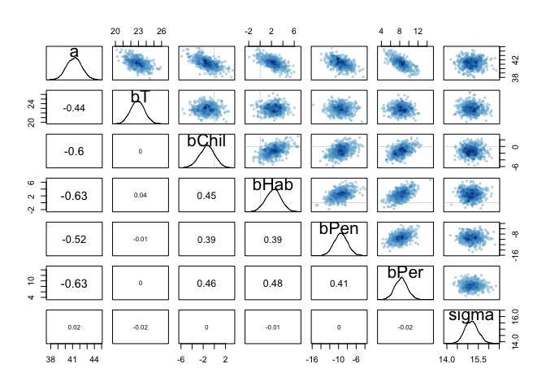
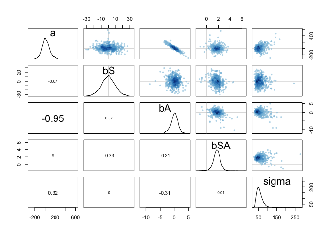
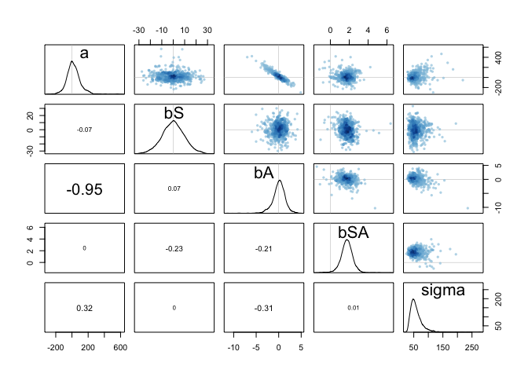

# Chp 12 Practice

Problem 1 : Tomato

Remember the tomato data set generated by Pepe; we first looked at this when we were working on Chapter 9. 35 accessions for seven species were grown in sun and shade.

Assess whether there is evidence for total length (“totleng”) response to shade and whether this response varies by species. Consider whether including accession (“acs”), and/or shelf (“shelf”) using adaptive priors improves the model fit.
 
## 1) look at the data


```r
library("ggplot2")
library("reshape2")
library("rethinking")
```

```
## Loading required package: rstan
```

```
## Loading required package: StanHeaders
```

```
## rstan (Version 2.12.1, packaged: 2016-09-11 13:07:50 UTC, GitRev: 85f7a56811da)
```

```
## For execution on a local, multicore CPU with excess RAM we recommend calling
## rstan_options(auto_write = TRUE)
## options(mc.cores = parallel::detectCores())
```

```
## Loading required package: parallel
```

```
## rethinking (Version 1.59)
```

```r
d = read.csv("/Users/gturco/Desktop/code/Rclub-rethinking_Gina.Turco/Assignment_Chapter_09/TomatoR2CSHL.csv",header=TRUE)

### first look at the data does it look how we cant it to look
str(d)
```

```
## 'data.frame':	1008 obs. of  25 variables:
##  $ shelf   : Factor w/ 6 levels "U","V","W","X",..: 6 6 6 6 6 6 6 6 6 6 ...
##  $ flat    : int  1 1 1 1 1 1 1 1 1 1 ...
##  $ col     : Factor w/ 9 levels "A","B","C","D",..: 2 3 4 5 6 7 9 2 3 4 ...
##  $ row     : int  1 1 1 1 1 1 1 2 2 2 ...
##  $ acs     : Factor w/ 36 levels "LA1028","LA1305",..: 23 2 19 26 30 5 14 32 7 34 ...
##  $ trt     : Factor w/ 2 levels "H","L": 1 1 1 1 1 1 1 1 1 1 ...
##  $ days    : int  28 28 28 28 28 28 28 28 28 28 ...
##  $ date    : Factor w/ 2 levels "5/5/08","5/6/08": 1 1 1 1 1 1 1 1 1 1 ...
##  $ hyp     : num  19.5 31.3 56.6 35.2 35.3 ...
##  $ int1    : num  2.37 3.34 8.43 0.56 0.82 1.07 2.85 2.08 5.43 4.08 ...
##  $ int2    : num  1.59 0.01 2.39 0 0.02 6.69 0.41 0.53 0.81 3.26 ...
##  $ int3    : num  1.87 9.19 6.7 1.6 1.49 5.72 3.79 1.9 3.63 3.49 ...
##  $ int4    : num  0.51 1.62 3.69 0.61 0.46 4.76 3.25 NA 2.66 3.02 ...
##  $ intleng : num  6.34 14.16 21.21 2.77 2.79 ...
##  $ totleng : num  25.8 45.4 77.9 38 38.1 ...
##  $ petleng : num  15.78 12.36 13.05 8.08 7.68 ...
##  $ leafleng: num  30.5 22.9 46.7 26.8 22.4 ...
##  $ leafwid : num  34.4 14 43.8 33.3 23.6 ...
##  $ leafnum : int  5 4 5 5 5 5 5 4 5 5 ...
##  $ ndvi    : int  111 120 110 105 106 132 118 112 107 123 ...
##  $ lat     : num  -9.52 -13.38 -16.23 -20.48 -20.92 ...
##  $ lon     : num  -78 -75.4 -71.7 -70 -69.1 ...
##  $ alt     : int  740 3360 2585 1020 2460 2000 2920 480 75 3540 ...
##  $ species : Factor w/ 5 levels "S. chilense",..: 4 5 5 1 1 2 3 4 5 5 ...
##  $ who     : Factor w/ 2 levels "Dan","Pepe": 1 1 1 1 1 1 1 1 1 1 ...
```

```r
summary(d)
```

```
##  shelf        flat            col           row            acs     
##  U:161   Min.   : 1.00   G      :133   Min.   :1.00   LA1954 : 40  
##  V:174   1st Qu.: 9.00   H      :127   1st Qu.:2.00   LA2695 : 39  
##  W:178   Median :17.00   F      :125   Median :3.00   LA1361 : 37  
##  X:174   Mean   :17.89   C      :117   Mean   :2.56   LA2167 : 37  
##  Y:125   3rd Qu.:28.00   D      :117   3rd Qu.:4.00   LA2773 : 37  
##  Z:196   Max.   :36.00   E      :107   Max.   :4.00   LA1474 : 36  
##                          (Other):282                  (Other):782  
##  trt          days           date          hyp             int1      
##  H:495   Min.   :28.00   5/5/08:716   Min.   : 6.17   Min.   : 0.00  
##  L:513   1st Qu.:28.00   5/6/08:292   1st Qu.:26.81   1st Qu.: 1.74  
##          Median :28.00                Median :32.02   Median : 3.59  
##          Mean   :28.29                Mean   :33.36   Mean   : 4.71  
##          3rd Qu.:29.00                3rd Qu.:38.56   3rd Qu.: 6.46  
##          Max.   :29.00                Max.   :74.60   Max.   :39.01  
##                                                       NA's   :1      
##       int2             int3             int4           intleng      
##  Min.   : 0.000   Min.   : 0.010   Min.   : 0.030   Min.   : 0.000  
##  1st Qu.: 1.060   1st Qu.: 2.975   1st Qu.: 2.163   1st Qu.: 9.637  
##  Median : 3.120   Median : 5.625   Median : 3.995   Median :17.255  
##  Mean   : 4.287   Mean   : 6.794   Mean   : 5.102   Mean   :20.340  
##  3rd Qu.: 6.320   3rd Qu.: 9.367   3rd Qu.: 7.018   3rd Qu.:28.145  
##  Max.   :28.980   Max.   :27.760   Max.   :23.280   Max.   :92.420  
##  NA's   :1        NA's   :4        NA's   :102                      
##     totleng          petleng         leafleng        leafwid     
##  Min.   : 13.59   Min.   : 1.53   Min.   : 9.74   Min.   : 8.29  
##  1st Qu.: 39.25   1st Qu.:11.20   1st Qu.:27.43   1st Qu.:29.48  
##  Median : 50.98   Median :15.13   Median :34.59   Median :39.62  
##  Mean   : 53.70   Mean   :15.92   Mean   :35.54   Mean   :39.29  
##  3rd Qu.: 64.76   3rd Qu.:20.48   3rd Qu.:42.98   3rd Qu.:47.75  
##  Max.   :129.43   Max.   :44.44   Max.   :95.19   Max.   :90.27  
##                   NA's   :2       NA's   :1       NA's   :1      
##     leafnum           ndvi          lat               lon        
##  Min.   :3.000   Min.   :100   Min.   :-25.400   Min.   :-78.52  
##  1st Qu.:5.000   1st Qu.:108   1st Qu.:-16.607   1st Qu.:-75.92  
##  Median :5.000   Median :115   Median :-14.152   Median :-73.63  
##  Mean   :5.063   Mean   :118   Mean   :-14.490   Mean   :-73.71  
##  3rd Qu.:6.000   3rd Qu.:128   3rd Qu.:-12.450   3rd Qu.:-71.70  
##  Max.   :8.000   Max.   :137   Max.   : -5.767   Max.   :-68.07  
##  NA's   :1                                                       
##       alt                  species      who     
##  Min.   :   0   S. chilense    :207   Dan :402  
##  1st Qu.:1020   S. chmielewskii:226   Pepe:606  
##  Median :2240   S. habrochaites:226             
##  Mean   :2035   S. pennellii   :132             
##  3rd Qu.:3110   S. peruvianum  :217             
##  Max.   :3540                                   
## 
```

## 2) reformat the data for map2stan


```r
# categorical variable for trt
d$trtL <- ifelse(d$trt=="L",1,0)

#categorical variables for species
d$index <- 1:nrow(d)
d2 <- dcast(d,index + totleng + trtL ~ species, value.var="species",fun.aggregate=length)
head(d2)
```

```
##   index totleng trtL S. chilense S. chmielewskii S. habrochaites
## 1     1   25.80    0           0               0               0
## 2     2   45.44    0           0               0               0
## 3     3   77.86    0           0               0               0
## 4     4   37.95    0           1               0               0
## 5     5   38.11    0           1               0               0
## 6     6   46.98    0           0               1               0
##   S. pennellii S. peruvianum
## 1            1             0
## 2            0             1
## 3            0             1
## 4            0             0
## 5            0             0
## 6            0             0
```

```r
colnames(d2) <- sub(". ","_",colnames(d2))
```

## Assess whether there is evidence for total length (“totleng”) response to shade and whether this response varies by species.


```r
totlen.stan <- map2stan(alist(
  totleng ~ dnorm(mu,sigma),
  mu <- a + bT * trtL,
  a ~ dnorm(0,100),
  bT ~ dnorm(0,10),
  sigma ~ dunif(0,20)),
  d2,
  chains = 4)
```

```
## In file included from file21c957e771b2.cpp:8:
## In file included from /Library/Frameworks/R.framework/Versions/3.3/Resources/library/StanHeaders/include/src/stan/model/model_header.hpp:4:
## In file included from /Library/Frameworks/R.framework/Versions/3.3/Resources/library/StanHeaders/include/stan/math.hpp:4:
## In file included from /Library/Frameworks/R.framework/Versions/3.3/Resources/library/StanHeaders/include/stan/math/rev/mat.hpp:4:
## In file included from /Library/Frameworks/R.framework/Versions/3.3/Resources/library/StanHeaders/include/stan/math/rev/core.hpp:42:
## /Library/Frameworks/R.framework/Versions/3.3/Resources/library/StanHeaders/include/stan/math/rev/core/set_zero_all_adjoints.hpp:14:17: warning: unused function 'set_zero_all_adjoints' [-Wunused-function]
##     static void set_zero_all_adjoints() {
##                 ^
## In file included from file21c957e771b2.cpp:8:
## In file included from /Library/Frameworks/R.framework/Versions/3.3/Resources/library/StanHeaders/include/src/stan/model/model_header.hpp:4:
## In file included from /Library/Frameworks/R.framework/Versions/3.3/Resources/library/StanHeaders/include/stan/math.hpp:4:
## In file included from /Library/Frameworks/R.framework/Versions/3.3/Resources/library/StanHeaders/include/stan/math/rev/mat.hpp:4:
## In file included from /Library/Frameworks/R.framework/Versions/3.3/Resources/library/StanHeaders/include/stan/math/rev/core.hpp:43:
## /Library/Frameworks/R.framework/Versions/3.3/Resources/library/StanHeaders/include/stan/math/rev/core/set_zero_all_adjoints_nested.hpp:17:17: warning: 'static' function 'set_zero_all_adjoints_nested' declared in header file should be declared 'static inline' [-Wunneeded-internal-declaration]
##     static void set_zero_all_adjoints_nested() {
##                 ^
## In file included from file21c957e771b2.cpp:8:
## In file included from /Library/Frameworks/R.framework/Versions/3.3/Resources/library/StanHeaders/include/src/stan/model/model_header.hpp:4:
## In file included from /Library/Frameworks/R.framework/Versions/3.3/Resources/library/StanHeaders/include/stan/math.hpp:4:
## In file included from /Library/Frameworks/R.framework/Versions/3.3/Resources/library/StanHeaders/include/stan/math/rev/mat.hpp:9:
## In file included from /Library/Frameworks/R.framework/Versions/3.3/Resources/library/StanHeaders/include/stan/math/prim/mat.hpp:54:
## /Library/Frameworks/R.framework/Versions/3.3/Resources/library/StanHeaders/include/stan/math/prim/mat/fun/autocorrelation.hpp:17:14: warning: function 'fft_next_good_size' is not needed and will not be emitted [-Wunneeded-internal-declaration]
##       size_t fft_next_good_size(size_t N) {
##              ^
## In file included from file21c957e771b2.cpp:8:
## In file included from /Library/Frameworks/R.framework/Versions/3.3/Resources/library/StanHeaders/include/src/stan/model/model_header.hpp:4:
## In file included from /Library/Frameworks/R.framework/Versions/3.3/Resources/library/StanHeaders/include/stan/math.hpp:4:
## In file included from /Library/Frameworks/R.framework/Versions/3.3/Resources/library/StanHeaders/include/stan/math/rev/mat.hpp:9:
## In file included from /Library/Frameworks/R.framework/Versions/3.3/Resources/library/StanHeaders/include/stan/math/prim/mat.hpp:235:
## In file included from /Library/Frameworks/R.framework/Versions/3.3/Resources/library/StanHeaders/include/stan/math/prim/arr.hpp:36:
## In file included from /Library/Frameworks/R.framework/Versions/3.3/Resources/library/StanHeaders/include/stan/math/prim/arr/functor/integrate_ode_rk45.hpp:13:
## In file included from /Library/Frameworks/R.framework/Versions/3.3/Resources/library/BH/include/boost/numeric/odeint.hpp:61:
## In file included from /Library/Frameworks/R.framework/Versions/3.3/Resources/library/BH/include/boost/numeric/odeint/util/multi_array_adaption.hpp:29:
## In file included from /Library/Frameworks/R.framework/Versions/3.3/Resources/library/BH/include/boost/multi_array.hpp:21:
## In file included from /Library/Frameworks/R.framework/Versions/3.3/Resources/library/BH/include/boost/multi_array/base.hpp:28:
## /Library/Frameworks/R.framework/Versions/3.3/Resources/library/BH/include/boost/multi_array/concept_checks.hpp:42:43: warning: unused typedef 'index_range' [-Wunused-local-typedef]
##       typedef typename Array::index_range index_range;
##                                           ^
## /Library/Frameworks/R.framework/Versions/3.3/Resources/library/BH/include/boost/multi_array/concept_checks.hpp:43:37: warning: unused typedef 'index' [-Wunused-local-typedef]
##       typedef typename Array::index index;
##                                     ^
## /Library/Frameworks/R.framework/Versions/3.3/Resources/library/BH/include/boost/multi_array/concept_checks.hpp:53:43: warning: unused typedef 'index_range' [-Wunused-local-typedef]
##       typedef typename Array::index_range index_range;
##                                           ^
## /Library/Frameworks/R.framework/Versions/3.3/Resources/library/BH/include/boost/multi_array/concept_checks.hpp:54:37: warning: unused typedef 'index' [-Wunused-local-typedef]
##       typedef typename Array::index index;
##                                     ^
## 7 warnings generated.
## 
## SAMPLING FOR MODEL 'totleng ~ dnorm(mu, sigma)' NOW (CHAIN 1).
## 
## Chain 1, Iteration:    1 / 2000 [  0%]  (Warmup)
## Chain 1, Iteration:  200 / 2000 [ 10%]  (Warmup)
## Chain 1, Iteration:  400 / 2000 [ 20%]  (Warmup)
## Chain 1, Iteration:  600 / 2000 [ 30%]  (Warmup)
## Chain 1, Iteration:  800 / 2000 [ 40%]  (Warmup)
## Chain 1, Iteration: 1000 / 2000 [ 50%]  (Warmup)
## Chain 1, Iteration: 1001 / 2000 [ 50%]  (Sampling)
## Chain 1, Iteration: 1200 / 2000 [ 60%]  (Sampling)
## Chain 1, Iteration: 1400 / 2000 [ 70%]  (Sampling)
## Chain 1, Iteration: 1600 / 2000 [ 80%]  (Sampling)
## Chain 1, Iteration: 1800 / 2000 [ 90%]  (Sampling)
## Chain 1, Iteration: 2000 / 2000 [100%]  (Sampling)
##  Elapsed Time: 0.265688 seconds (Warm-up)
##                0.271399 seconds (Sampling)
##                0.537087 seconds (Total)
## 
## 
## SAMPLING FOR MODEL 'totleng ~ dnorm(mu, sigma)' NOW (CHAIN 2).
## 
## Chain 2, Iteration:    1 / 2000 [  0%]  (Warmup)
## Chain 2, Iteration:  200 / 2000 [ 10%]  (Warmup)
## Chain 2, Iteration:  400 / 2000 [ 20%]  (Warmup)
## Chain 2, Iteration:  600 / 2000 [ 30%]  (Warmup)
## Chain 2, Iteration:  800 / 2000 [ 40%]  (Warmup)
## Chain 2, Iteration: 1000 / 2000 [ 50%]  (Warmup)
## Chain 2, Iteration: 1001 / 2000 [ 50%]  (Sampling)
## Chain 2, Iteration: 1200 / 2000 [ 60%]  (Sampling)
## Chain 2, Iteration: 1400 / 2000 [ 70%]  (Sampling)
## Chain 2, Iteration: 1600 / 2000 [ 80%]  (Sampling)
## Chain 2, Iteration: 1800 / 2000 [ 90%]  (Sampling)
## Chain 2, Iteration: 2000 / 2000 [100%]  (Sampling)
##  Elapsed Time: 0.286627 seconds (Warm-up)
##                0.245465 seconds (Sampling)
##                0.532092 seconds (Total)
## 
## 
## SAMPLING FOR MODEL 'totleng ~ dnorm(mu, sigma)' NOW (CHAIN 3).
## 
## Chain 3, Iteration:    1 / 2000 [  0%]  (Warmup)
## Chain 3, Iteration:  200 / 2000 [ 10%]  (Warmup)
## Chain 3, Iteration:  400 / 2000 [ 20%]  (Warmup)
## Chain 3, Iteration:  600 / 2000 [ 30%]  (Warmup)
## Chain 3, Iteration:  800 / 2000 [ 40%]  (Warmup)
## Chain 3, Iteration: 1000 / 2000 [ 50%]  (Warmup)
## Chain 3, Iteration: 1001 / 2000 [ 50%]  (Sampling)
## Chain 3, Iteration: 1200 / 2000 [ 60%]  (Sampling)
## Chain 3, Iteration: 1400 / 2000 [ 70%]  (Sampling)
## Chain 3, Iteration: 1600 / 2000 [ 80%]  (Sampling)
## Chain 3, Iteration: 1800 / 2000 [ 90%]  (Sampling)
## Chain 3, Iteration: 2000 / 2000 [100%]  (Sampling)
##  Elapsed Time: 0.269303 seconds (Warm-up)
##                0.274114 seconds (Sampling)
##                0.543417 seconds (Total)
## 
## 
## SAMPLING FOR MODEL 'totleng ~ dnorm(mu, sigma)' NOW (CHAIN 4).
## 
## Chain 4, Iteration:    1 / 2000 [  0%]  (Warmup)
## Chain 4, Iteration:  200 / 2000 [ 10%]  (Warmup)
## Chain 4, Iteration:  400 / 2000 [ 20%]  (Warmup)
## Chain 4, Iteration:  600 / 2000 [ 30%]  (Warmup)
## Chain 4, Iteration:  800 / 2000 [ 40%]  (Warmup)
## Chain 4, Iteration: 1000 / 2000 [ 50%]  (Warmup)
## Chain 4, Iteration: 1001 / 2000 [ 50%]  (Sampling)
## Chain 4, Iteration: 1200 / 2000 [ 60%]  (Sampling)
## Chain 4, Iteration: 1400 / 2000 [ 70%]  (Sampling)
## Chain 4, Iteration: 1600 / 2000 [ 80%]  (Sampling)
## Chain 4, Iteration: 1800 / 2000 [ 90%]  (Sampling)
## Chain 4, Iteration: 2000 / 2000 [100%]  (Sampling)
##  Elapsed Time: 0.293337 seconds (Warm-up)
##                0.249802 seconds (Sampling)
##                0.543139 seconds (Total)
## 
## 
## SAMPLING FOR MODEL 'totleng ~ dnorm(mu, sigma)' NOW (CHAIN 1).
## WARNING: No variance estimation is
##          performed for num_warmup < 20
## 
## 
## Chain 1, Iteration: 1 / 1 [100%]  (Sampling)
##  Elapsed Time: 4e-06 seconds (Warm-up)
##                0.00014 seconds (Sampling)
##                0.000144 seconds (Total)
```

```
## Computing WAIC
```

```
## Constructing posterior predictions
```

```
## [ 400 / 4000 ]
[ 800 / 4000 ]
[ 1200 / 4000 ]
[ 1600 / 4000 ]
[ 2000 / 4000 ]
[ 2400 / 4000 ]
[ 2800 / 4000 ]
[ 3200 / 4000 ]
[ 3600 / 4000 ]
[ 4000 / 4000 ]
```

```r
precis(totlen.stan)
```

```
##        Mean StdDev lower 0.89 upper 0.89 n_eff Rhat
## a     42.17   0.69      41.04      43.23  1413    1
## bT    22.63   0.96      21.09      24.14  1250    1
## sigma 16.05   0.35      15.52      16.62  2305    1
```

```r
species.trt.stan <- map2stan(alist(
  totleng ~ dnorm(mu,sigma),
  mu <- a + bT*trtL + bChil*S_chilense + bHab*S_habrochaites + bPen * S_pennellii + bPer*S_peruvianum,
  a ~ dnorm(33.35,10),
  c(bT,bChil,bHab,bPen,bPer) ~ dnorm(0,10),
  sigma ~ dunif(0,20)),
  d2,
  chains = 4)
```

```
## In file included from file21c9731ef1d0.cpp:8:
## In file included from /Library/Frameworks/R.framework/Versions/3.3/Resources/library/StanHeaders/include/src/stan/model/model_header.hpp:4:
## In file included from /Library/Frameworks/R.framework/Versions/3.3/Resources/library/StanHeaders/include/stan/math.hpp:4:
## In file included from /Library/Frameworks/R.framework/Versions/3.3/Resources/library/StanHeaders/include/stan/math/rev/mat.hpp:4:
## In file included from /Library/Frameworks/R.framework/Versions/3.3/Resources/library/StanHeaders/include/stan/math/rev/core.hpp:42:
## /Library/Frameworks/R.framework/Versions/3.3/Resources/library/StanHeaders/include/stan/math/rev/core/set_zero_all_adjoints.hpp:14:17: warning: unused function 'set_zero_all_adjoints' [-Wunused-function]
##     static void set_zero_all_adjoints() {
##                 ^
## In file included from file21c9731ef1d0.cpp:8:
## In file included from /Library/Frameworks/R.framework/Versions/3.3/Resources/library/StanHeaders/include/src/stan/model/model_header.hpp:4:
## In file included from /Library/Frameworks/R.framework/Versions/3.3/Resources/library/StanHeaders/include/stan/math.hpp:4:
## In file included from /Library/Frameworks/R.framework/Versions/3.3/Resources/library/StanHeaders/include/stan/math/rev/mat.hpp:4:
## In file included from /Library/Frameworks/R.framework/Versions/3.3/Resources/library/StanHeaders/include/stan/math/rev/core.hpp:43:
## /Library/Frameworks/R.framework/Versions/3.3/Resources/library/StanHeaders/include/stan/math/rev/core/set_zero_all_adjoints_nested.hpp:17:17: warning: 'static' function 'set_zero_all_adjoints_nested' declared in header file should be declared 'static inline' [-Wunneeded-internal-declaration]
##     static void set_zero_all_adjoints_nested() {
##                 ^
## In file included from file21c9731ef1d0.cpp:8:
## In file included from /Library/Frameworks/R.framework/Versions/3.3/Resources/library/StanHeaders/include/src/stan/model/model_header.hpp:4:
## In file included from /Library/Frameworks/R.framework/Versions/3.3/Resources/library/StanHeaders/include/stan/math.hpp:4:
## In file included from /Library/Frameworks/R.framework/Versions/3.3/Resources/library/StanHeaders/include/stan/math/rev/mat.hpp:9:
## In file included from /Library/Frameworks/R.framework/Versions/3.3/Resources/library/StanHeaders/include/stan/math/prim/mat.hpp:54:
## /Library/Frameworks/R.framework/Versions/3.3/Resources/library/StanHeaders/include/stan/math/prim/mat/fun/autocorrelation.hpp:17:14: warning: function 'fft_next_good_size' is not needed and will not be emitted [-Wunneeded-internal-declaration]
##       size_t fft_next_good_size(size_t N) {
##              ^
## In file included from file21c9731ef1d0.cpp:8:
## In file included from /Library/Frameworks/R.framework/Versions/3.3/Resources/library/StanHeaders/include/src/stan/model/model_header.hpp:4:
## In file included from /Library/Frameworks/R.framework/Versions/3.3/Resources/library/StanHeaders/include/stan/math.hpp:4:
## In file included from /Library/Frameworks/R.framework/Versions/3.3/Resources/library/StanHeaders/include/stan/math/rev/mat.hpp:9:
## In file included from /Library/Frameworks/R.framework/Versions/3.3/Resources/library/StanHeaders/include/stan/math/prim/mat.hpp:235:
## In file included from /Library/Frameworks/R.framework/Versions/3.3/Resources/library/StanHeaders/include/stan/math/prim/arr.hpp:36:
## In file included from /Library/Frameworks/R.framework/Versions/3.3/Resources/library/StanHeaders/include/stan/math/prim/arr/functor/integrate_ode_rk45.hpp:13:
## In file included from /Library/Frameworks/R.framework/Versions/3.3/Resources/library/BH/include/boost/numeric/odeint.hpp:61:
## In file included from /Library/Frameworks/R.framework/Versions/3.3/Resources/library/BH/include/boost/numeric/odeint/util/multi_array_adaption.hpp:29:
## In file included from /Library/Frameworks/R.framework/Versions/3.3/Resources/library/BH/include/boost/multi_array.hpp:21:
## In file included from /Library/Frameworks/R.framework/Versions/3.3/Resources/library/BH/include/boost/multi_array/base.hpp:28:
## /Library/Frameworks/R.framework/Versions/3.3/Resources/library/BH/include/boost/multi_array/concept_checks.hpp:42:43: warning: unused typedef 'index_range' [-Wunused-local-typedef]
##       typedef typename Array::index_range index_range;
##                                           ^
## /Library/Frameworks/R.framework/Versions/3.3/Resources/library/BH/include/boost/multi_array/concept_checks.hpp:43:37: warning: unused typedef 'index' [-Wunused-local-typedef]
##       typedef typename Array::index index;
##                                     ^
## /Library/Frameworks/R.framework/Versions/3.3/Resources/library/BH/include/boost/multi_array/concept_checks.hpp:53:43: warning: unused typedef 'index_range' [-Wunused-local-typedef]
##       typedef typename Array::index_range index_range;
##                                           ^
## /Library/Frameworks/R.framework/Versions/3.3/Resources/library/BH/include/boost/multi_array/concept_checks.hpp:54:37: warning: unused typedef 'index' [-Wunused-local-typedef]
##       typedef typename Array::index index;
##                                     ^
## 7 warnings generated.
## 
## SAMPLING FOR MODEL 'totleng ~ dnorm(mu, sigma)' NOW (CHAIN 1).
## 
## Chain 1, Iteration:    1 / 2000 [  0%]  (Warmup)
## Chain 1, Iteration:  200 / 2000 [ 10%]  (Warmup)
## Chain 1, Iteration:  400 / 2000 [ 20%]  (Warmup)
## Chain 1, Iteration:  600 / 2000 [ 30%]  (Warmup)
## Chain 1, Iteration:  800 / 2000 [ 40%]  (Warmup)
## Chain 1, Iteration: 1000 / 2000 [ 50%]  (Warmup)
## Chain 1, Iteration: 1001 / 2000 [ 50%]  (Sampling)
## Chain 1, Iteration: 1200 / 2000 [ 60%]  (Sampling)
## Chain 1, Iteration: 1400 / 2000 [ 70%]  (Sampling)
## Chain 1, Iteration: 1600 / 2000 [ 80%]  (Sampling)
## Chain 1, Iteration: 1800 / 2000 [ 90%]  (Sampling)
## Chain 1, Iteration: 2000 / 2000 [100%]  (Sampling)
##  Elapsed Time: 2.46882 seconds (Warm-up)
##                1.73237 seconds (Sampling)
##                4.20119 seconds (Total)
## 
## 
## SAMPLING FOR MODEL 'totleng ~ dnorm(mu, sigma)' NOW (CHAIN 2).
## 
## Chain 2, Iteration:    1 / 2000 [  0%]  (Warmup)
## Chain 2, Iteration:  200 / 2000 [ 10%]  (Warmup)
## Chain 2, Iteration:  400 / 2000 [ 20%]  (Warmup)
## Chain 2, Iteration:  600 / 2000 [ 30%]  (Warmup)
## Chain 2, Iteration:  800 / 2000 [ 40%]  (Warmup)
## Chain 2, Iteration: 1000 / 2000 [ 50%]  (Warmup)
## Chain 2, Iteration: 1001 / 2000 [ 50%]  (Sampling)
## Chain 2, Iteration: 1200 / 2000 [ 60%]  (Sampling)
## Chain 2, Iteration: 1400 / 2000 [ 70%]  (Sampling)
## Chain 2, Iteration: 1600 / 2000 [ 80%]  (Sampling)
## Chain 2, Iteration: 1800 / 2000 [ 90%]  (Sampling)
## Chain 2, Iteration: 2000 / 2000 [100%]  (Sampling)
##  Elapsed Time: 2.2797 seconds (Warm-up)
##                1.60399 seconds (Sampling)
##                3.88368 seconds (Total)
## 
## 
## SAMPLING FOR MODEL 'totleng ~ dnorm(mu, sigma)' NOW (CHAIN 3).
## 
## Chain 3, Iteration:    1 / 2000 [  0%]  (Warmup)
## Chain 3, Iteration:  200 / 2000 [ 10%]  (Warmup)
## Chain 3, Iteration:  400 / 2000 [ 20%]  (Warmup)
## Chain 3, Iteration:  600 / 2000 [ 30%]  (Warmup)
## Chain 3, Iteration:  800 / 2000 [ 40%]  (Warmup)
## Chain 3, Iteration: 1000 / 2000 [ 50%]  (Warmup)
## Chain 3, Iteration: 1001 / 2000 [ 50%]  (Sampling)
## Chain 3, Iteration: 1200 / 2000 [ 60%]  (Sampling)
## Chain 3, Iteration: 1400 / 2000 [ 70%]  (Sampling)
## Chain 3, Iteration: 1600 / 2000 [ 80%]  (Sampling)
## Chain 3, Iteration: 1800 / 2000 [ 90%]  (Sampling)
## Chain 3, Iteration: 2000 / 2000 [100%]  (Sampling)
##  Elapsed Time: 2.3091 seconds (Warm-up)
##                1.77712 seconds (Sampling)
##                4.08622 seconds (Total)
## 
## 
## SAMPLING FOR MODEL 'totleng ~ dnorm(mu, sigma)' NOW (CHAIN 4).
## 
## Chain 4, Iteration:    1 / 2000 [  0%]  (Warmup)
## Chain 4, Iteration:  200 / 2000 [ 10%]  (Warmup)
## Chain 4, Iteration:  400 / 2000 [ 20%]  (Warmup)
## Chain 4, Iteration:  600 / 2000 [ 30%]  (Warmup)
## Chain 4, Iteration:  800 / 2000 [ 40%]  (Warmup)
## Chain 4, Iteration: 1000 / 2000 [ 50%]  (Warmup)
## Chain 4, Iteration: 1001 / 2000 [ 50%]  (Sampling)
## Chain 4, Iteration: 1200 / 2000 [ 60%]  (Sampling)
## Chain 4, Iteration: 1400 / 2000 [ 70%]  (Sampling)
## Chain 4, Iteration: 1600 / 2000 [ 80%]  (Sampling)
## Chain 4, Iteration: 1800 / 2000 [ 90%]  (Sampling)
## Chain 4, Iteration: 2000 / 2000 [100%]  (Sampling)
##  Elapsed Time: 2.29982 seconds (Warm-up)
##                1.47144 seconds (Sampling)
##                3.77126 seconds (Total)
## 
## 
## SAMPLING FOR MODEL 'totleng ~ dnorm(mu, sigma)' NOW (CHAIN 1).
## WARNING: No variance estimation is
##          performed for num_warmup < 20
## 
## 
## Chain 1, Iteration: 1 / 1 [100%]  (Sampling)
##  Elapsed Time: 5e-06 seconds (Warm-up)
##                0.000381 seconds (Sampling)
##                0.000386 seconds (Total)
```

```
## Computing WAIC
## Constructing posterior predictions
```

```
## [ 400 / 4000 ]
[ 800 / 4000 ]
[ 1200 / 4000 ]
[ 1600 / 4000 ]
[ 2000 / 4000 ]
[ 2400 / 4000 ]
[ 2800 / 4000 ]
[ 3200 / 4000 ]
[ 3600 / 4000 ]
[ 4000 / 4000 ]
```

```r
pairs(species.trt.stan)
```

<!-- -->

```r
precis(species.trt.stan)
```

```
##        Mean StdDev lower 0.89 upper 0.89 n_eff Rhat
## a     41.23   1.05      39.60      42.93  1386    1
## bT    22.88   0.91      21.39      24.30  2789    1
## bChil -1.31   1.39      -3.62       0.80  1879    1
## bHab   2.34   1.34       0.09       4.38  1879    1
## bPen  -9.47   1.56     -11.88      -6.97  2238    1
## bPer   8.32   1.38       6.26      10.65  1707    1
## sigma 15.17   0.33      14.67      15.69  4000    1
```

```r
d$species_id <- coerce_index(d$species)


compare(species.trt.stan,totlen.stan)
```

```
##                    WAIC pWAIC dWAIC weight    SE   dSE
## species.trt.stan 8348.0   6.8   0.0      1 53.09    NA
## totlen.stan      8458.4   3.2 110.4      0 52.54 21.99
```

Consider whether including accession (“acs”), and/or shelf (“shelf”) using adaptive priors improves the model fit.


```r
acs_id <- as.numeric(d$acs)
shelf_id <- as.numeric(d$shelf)
species_id <- coerce_index(d$species)

d3 <- data.frame(d2,acs_id, shelf_id,species_id)
colnames(d3) <- sub(". ","_",colnames(d3))

species.trt.sp.stan <- map2stan(alist(
  totleng ~ dnorm(mu,sigma),
  mu <- a + bT*trtL + b_species[species_id],
  b_species[species_id] ~ dnorm(0,10),
  a ~ dnorm(33.35,10),
  c(bT) ~ dnorm(0,10),
  sigma ~ dunif(0,20)),
  d3,
  chains = 4)
```

```
## In file included from file21c920f043e4.cpp:8:
## In file included from /Library/Frameworks/R.framework/Versions/3.3/Resources/library/StanHeaders/include/src/stan/model/model_header.hpp:4:
## In file included from /Library/Frameworks/R.framework/Versions/3.3/Resources/library/StanHeaders/include/stan/math.hpp:4:
## In file included from /Library/Frameworks/R.framework/Versions/3.3/Resources/library/StanHeaders/include/stan/math/rev/mat.hpp:4:
## In file included from /Library/Frameworks/R.framework/Versions/3.3/Resources/library/StanHeaders/include/stan/math/rev/core.hpp:42:
## /Library/Frameworks/R.framework/Versions/3.3/Resources/library/StanHeaders/include/stan/math/rev/core/set_zero_all_adjoints.hpp:14:17: warning: unused function 'set_zero_all_adjoints' [-Wunused-function]
##     static void set_zero_all_adjoints() {
##                 ^
## In file included from file21c920f043e4.cpp:8:
## In file included from /Library/Frameworks/R.framework/Versions/3.3/Resources/library/StanHeaders/include/src/stan/model/model_header.hpp:4:
## In file included from /Library/Frameworks/R.framework/Versions/3.3/Resources/library/StanHeaders/include/stan/math.hpp:4:
## In file included from /Library/Frameworks/R.framework/Versions/3.3/Resources/library/StanHeaders/include/stan/math/rev/mat.hpp:4:
## In file included from /Library/Frameworks/R.framework/Versions/3.3/Resources/library/StanHeaders/include/stan/math/rev/core.hpp:43:
## /Library/Frameworks/R.framework/Versions/3.3/Resources/library/StanHeaders/include/stan/math/rev/core/set_zero_all_adjoints_nested.hpp:17:17: warning: 'static' function 'set_zero_all_adjoints_nested' declared in header file should be declared 'static inline' [-Wunneeded-internal-declaration]
##     static void set_zero_all_adjoints_nested() {
##                 ^
## In file included from file21c920f043e4.cpp:8:
## In file included from /Library/Frameworks/R.framework/Versions/3.3/Resources/library/StanHeaders/include/src/stan/model/model_header.hpp:4:
## In file included from /Library/Frameworks/R.framework/Versions/3.3/Resources/library/StanHeaders/include/stan/math.hpp:4:
## In file included from /Library/Frameworks/R.framework/Versions/3.3/Resources/library/StanHeaders/include/stan/math/rev/mat.hpp:9:
## In file included from /Library/Frameworks/R.framework/Versions/3.3/Resources/library/StanHeaders/include/stan/math/prim/mat.hpp:54:
## /Library/Frameworks/R.framework/Versions/3.3/Resources/library/StanHeaders/include/stan/math/prim/mat/fun/autocorrelation.hpp:17:14: warning: function 'fft_next_good_size' is not needed and will not be emitted [-Wunneeded-internal-declaration]
##       size_t fft_next_good_size(size_t N) {
##              ^
## In file included from file21c920f043e4.cpp:8:
## In file included from /Library/Frameworks/R.framework/Versions/3.3/Resources/library/StanHeaders/include/src/stan/model/model_header.hpp:4:
## In file included from /Library/Frameworks/R.framework/Versions/3.3/Resources/library/StanHeaders/include/stan/math.hpp:4:
## In file included from /Library/Frameworks/R.framework/Versions/3.3/Resources/library/StanHeaders/include/stan/math/rev/mat.hpp:9:
## In file included from /Library/Frameworks/R.framework/Versions/3.3/Resources/library/StanHeaders/include/stan/math/prim/mat.hpp:235:
## In file included from /Library/Frameworks/R.framework/Versions/3.3/Resources/library/StanHeaders/include/stan/math/prim/arr.hpp:36:
## In file included from /Library/Frameworks/R.framework/Versions/3.3/Resources/library/StanHeaders/include/stan/math/prim/arr/functor/integrate_ode_rk45.hpp:13:
## In file included from /Library/Frameworks/R.framework/Versions/3.3/Resources/library/BH/include/boost/numeric/odeint.hpp:61:
## In file included from /Library/Frameworks/R.framework/Versions/3.3/Resources/library/BH/include/boost/numeric/odeint/util/multi_array_adaption.hpp:29:
## In file included from /Library/Frameworks/R.framework/Versions/3.3/Resources/library/BH/include/boost/multi_array.hpp:21:
## In file included from /Library/Frameworks/R.framework/Versions/3.3/Resources/library/BH/include/boost/multi_array/base.hpp:28:
## /Library/Frameworks/R.framework/Versions/3.3/Resources/library/BH/include/boost/multi_array/concept_checks.hpp:42:43: warning: unused typedef 'index_range' [-Wunused-local-typedef]
##       typedef typename Array::index_range index_range;
##                                           ^
## /Library/Frameworks/R.framework/Versions/3.3/Resources/library/BH/include/boost/multi_array/concept_checks.hpp:43:37: warning: unused typedef 'index' [-Wunused-local-typedef]
##       typedef typename Array::index index;
##                                     ^
## /Library/Frameworks/R.framework/Versions/3.3/Resources/library/BH/include/boost/multi_array/concept_checks.hpp:53:43: warning: unused typedef 'index_range' [-Wunused-local-typedef]
##       typedef typename Array::index_range index_range;
##                                           ^
## /Library/Frameworks/R.framework/Versions/3.3/Resources/library/BH/include/boost/multi_array/concept_checks.hpp:54:37: warning: unused typedef 'index' [-Wunused-local-typedef]
##       typedef typename Array::index index;
##                                     ^
## 7 warnings generated.
## 
## SAMPLING FOR MODEL 'totleng ~ dnorm(mu, sigma)' NOW (CHAIN 1).
## 
## Chain 1, Iteration:    1 / 2000 [  0%]  (Warmup)
## Chain 1, Iteration:  200 / 2000 [ 10%]  (Warmup)
## Chain 1, Iteration:  400 / 2000 [ 20%]  (Warmup)
## Chain 1, Iteration:  600 / 2000 [ 30%]  (Warmup)
## Chain 1, Iteration:  800 / 2000 [ 40%]  (Warmup)
## Chain 1, Iteration: 1000 / 2000 [ 50%]  (Warmup)
## Chain 1, Iteration: 1001 / 2000 [ 50%]  (Sampling)
## Chain 1, Iteration: 1200 / 2000 [ 60%]  (Sampling)
## Chain 1, Iteration: 1400 / 2000 [ 70%]  (Sampling)
## Chain 1, Iteration: 1600 / 2000 [ 80%]  (Sampling)
## Chain 1, Iteration: 1800 / 2000 [ 90%]  (Sampling)
## Chain 1, Iteration: 2000 / 2000 [100%]  (Sampling)
##  Elapsed Time: 1.81656 seconds (Warm-up)
##                1.55946 seconds (Sampling)
##                3.37602 seconds (Total)
## 
## 
## SAMPLING FOR MODEL 'totleng ~ dnorm(mu, sigma)' NOW (CHAIN 2).
## 
## Chain 2, Iteration:    1 / 2000 [  0%]  (Warmup)
## Chain 2, Iteration:  200 / 2000 [ 10%]  (Warmup)
## Chain 2, Iteration:  400 / 2000 [ 20%]  (Warmup)
## Chain 2, Iteration:  600 / 2000 [ 30%]  (Warmup)
## Chain 2, Iteration:  800 / 2000 [ 40%]  (Warmup)
## Chain 2, Iteration: 1000 / 2000 [ 50%]  (Warmup)
## Chain 2, Iteration: 1001 / 2000 [ 50%]  (Sampling)
## Chain 2, Iteration: 1200 / 2000 [ 60%]  (Sampling)
## Chain 2, Iteration: 1400 / 2000 [ 70%]  (Sampling)
## Chain 2, Iteration: 1600 / 2000 [ 80%]  (Sampling)
## Chain 2, Iteration: 1800 / 2000 [ 90%]  (Sampling)
## Chain 2, Iteration: 2000 / 2000 [100%]  (Sampling)
##  Elapsed Time: 2.05702 seconds (Warm-up)
##                1.63536 seconds (Sampling)
##                3.69238 seconds (Total)
## 
## 
## SAMPLING FOR MODEL 'totleng ~ dnorm(mu, sigma)' NOW (CHAIN 3).
## 
## Chain 3, Iteration:    1 / 2000 [  0%]  (Warmup)
## Chain 3, Iteration:  200 / 2000 [ 10%]  (Warmup)
## Chain 3, Iteration:  400 / 2000 [ 20%]  (Warmup)
## Chain 3, Iteration:  600 / 2000 [ 30%]  (Warmup)
## Chain 3, Iteration:  800 / 2000 [ 40%]  (Warmup)
## Chain 3, Iteration: 1000 / 2000 [ 50%]  (Warmup)
## Chain 3, Iteration: 1001 / 2000 [ 50%]  (Sampling)
## Chain 3, Iteration: 1200 / 2000 [ 60%]  (Sampling)
## Chain 3, Iteration: 1400 / 2000 [ 70%]  (Sampling)
## Chain 3, Iteration: 1600 / 2000 [ 80%]  (Sampling)
## Chain 3, Iteration: 1800 / 2000 [ 90%]  (Sampling)
## Chain 3, Iteration: 2000 / 2000 [100%]  (Sampling)
##  Elapsed Time: 1.48885 seconds (Warm-up)
##                1.92441 seconds (Sampling)
##                3.41326 seconds (Total)
## 
## 
## SAMPLING FOR MODEL 'totleng ~ dnorm(mu, sigma)' NOW (CHAIN 4).
## 
## Chain 4, Iteration:    1 / 2000 [  0%]  (Warmup)
## Chain 4, Iteration:  200 / 2000 [ 10%]  (Warmup)
## Chain 4, Iteration:  400 / 2000 [ 20%]  (Warmup)
## Chain 4, Iteration:  600 / 2000 [ 30%]  (Warmup)
## Chain 4, Iteration:  800 / 2000 [ 40%]  (Warmup)
## Chain 4, Iteration: 1000 / 2000 [ 50%]  (Warmup)
## Chain 4, Iteration: 1001 / 2000 [ 50%]  (Sampling)
## Chain 4, Iteration: 1200 / 2000 [ 60%]  (Sampling)
## Chain 4, Iteration: 1400 / 2000 [ 70%]  (Sampling)
## Chain 4, Iteration: 1600 / 2000 [ 80%]  (Sampling)
## Chain 4, Iteration: 1800 / 2000 [ 90%]  (Sampling)
## Chain 4, Iteration: 2000 / 2000 [100%]  (Sampling)
##  Elapsed Time: 1.94759 seconds (Warm-up)
##                1.47499 seconds (Sampling)
##                3.42258 seconds (Total)
## 
## 
## SAMPLING FOR MODEL 'totleng ~ dnorm(mu, sigma)' NOW (CHAIN 1).
## WARNING: No variance estimation is
##          performed for num_warmup < 20
## 
## 
## Chain 1, Iteration: 1 / 1 [100%]  (Sampling)
##  Elapsed Time: 3e-06 seconds (Warm-up)
##                0.000191 seconds (Sampling)
##                0.000194 seconds (Total)
```

```
## Computing WAIC
```

```
## Constructing posterior predictions
```

```
## [ 400 / 4000 ]
[ 800 / 4000 ]
[ 1200 / 4000 ]
[ 1600 / 4000 ]
[ 2000 / 4000 ]
[ 2400 / 4000 ]
[ 2800 / 4000 ]
[ 3200 / 4000 ]
[ 3600 / 4000 ]
[ 4000 / 4000 ]
```

```r
compare(species.trt.stan,species.trt.sp.stan)
```

```
##                       WAIC pWAIC dWAIC weight    SE  dSE
## species.trt.stan    8348.0   6.8   0.0   0.56 53.09   NA
## species.trt.sp.stan 8348.5   7.0   0.5   0.44 53.15 0.11
```

```r
### can u compare diff equations... yes right?

species.trt.sp.interact.stan <- map2stan(alist(
  totleng ~ dnorm(mu,sigma),
  mu <- a + bT*trtL + b_species[species_id] +   bT_species[species_id] * trtL,
  b_species[species_id] ~ dnorm(0,10),
  bT_species[species_id] ~ dnorm(0,10),
  a ~ dnorm(33.35,10),
  c(bT) ~ dnorm(0,10),
  sigma ~ dunif(0,20)),
  d3,
  chains = 4)
```

```
## In file included from file21c95b24a293.cpp:8:
## In file included from /Library/Frameworks/R.framework/Versions/3.3/Resources/library/StanHeaders/include/src/stan/model/model_header.hpp:4:
## In file included from /Library/Frameworks/R.framework/Versions/3.3/Resources/library/StanHeaders/include/stan/math.hpp:4:
## In file included from /Library/Frameworks/R.framework/Versions/3.3/Resources/library/StanHeaders/include/stan/math/rev/mat.hpp:4:
## In file included from /Library/Frameworks/R.framework/Versions/3.3/Resources/library/StanHeaders/include/stan/math/rev/core.hpp:42:
## /Library/Frameworks/R.framework/Versions/3.3/Resources/library/StanHeaders/include/stan/math/rev/core/set_zero_all_adjoints.hpp:14:17: warning: unused function 'set_zero_all_adjoints' [-Wunused-function]
##     static void set_zero_all_adjoints() {
##                 ^
## In file included from file21c95b24a293.cpp:8:
## In file included from /Library/Frameworks/R.framework/Versions/3.3/Resources/library/StanHeaders/include/src/stan/model/model_header.hpp:4:
## In file included from /Library/Frameworks/R.framework/Versions/3.3/Resources/library/StanHeaders/include/stan/math.hpp:4:
## In file included from /Library/Frameworks/R.framework/Versions/3.3/Resources/library/StanHeaders/include/stan/math/rev/mat.hpp:4:
## In file included from /Library/Frameworks/R.framework/Versions/3.3/Resources/library/StanHeaders/include/stan/math/rev/core.hpp:43:
## /Library/Frameworks/R.framework/Versions/3.3/Resources/library/StanHeaders/include/stan/math/rev/core/set_zero_all_adjoints_nested.hpp:17:17: warning: 'static' function 'set_zero_all_adjoints_nested' declared in header file should be declared 'static inline' [-Wunneeded-internal-declaration]
##     static void set_zero_all_adjoints_nested() {
##                 ^
## In file included from file21c95b24a293.cpp:8:
## In file included from /Library/Frameworks/R.framework/Versions/3.3/Resources/library/StanHeaders/include/src/stan/model/model_header.hpp:4:
## In file included from /Library/Frameworks/R.framework/Versions/3.3/Resources/library/StanHeaders/include/stan/math.hpp:4:
## In file included from /Library/Frameworks/R.framework/Versions/3.3/Resources/library/StanHeaders/include/stan/math/rev/mat.hpp:9:
## In file included from /Library/Frameworks/R.framework/Versions/3.3/Resources/library/StanHeaders/include/stan/math/prim/mat.hpp:54:
## /Library/Frameworks/R.framework/Versions/3.3/Resources/library/StanHeaders/include/stan/math/prim/mat/fun/autocorrelation.hpp:17:14: warning: function 'fft_next_good_size' is not needed and will not be emitted [-Wunneeded-internal-declaration]
##       size_t fft_next_good_size(size_t N) {
##              ^
## In file included from file21c95b24a293.cpp:8:
## In file included from /Library/Frameworks/R.framework/Versions/3.3/Resources/library/StanHeaders/include/src/stan/model/model_header.hpp:4:
## In file included from /Library/Frameworks/R.framework/Versions/3.3/Resources/library/StanHeaders/include/stan/math.hpp:4:
## In file included from /Library/Frameworks/R.framework/Versions/3.3/Resources/library/StanHeaders/include/stan/math/rev/mat.hpp:9:
## In file included from /Library/Frameworks/R.framework/Versions/3.3/Resources/library/StanHeaders/include/stan/math/prim/mat.hpp:235:
## In file included from /Library/Frameworks/R.framework/Versions/3.3/Resources/library/StanHeaders/include/stan/math/prim/arr.hpp:36:
## In file included from /Library/Frameworks/R.framework/Versions/3.3/Resources/library/StanHeaders/include/stan/math/prim/arr/functor/integrate_ode_rk45.hpp:13:
## In file included from /Library/Frameworks/R.framework/Versions/3.3/Resources/library/BH/include/boost/numeric/odeint.hpp:61:
## In file included from /Library/Frameworks/R.framework/Versions/3.3/Resources/library/BH/include/boost/numeric/odeint/util/multi_array_adaption.hpp:29:
## In file included from /Library/Frameworks/R.framework/Versions/3.3/Resources/library/BH/include/boost/multi_array.hpp:21:
## In file included from /Library/Frameworks/R.framework/Versions/3.3/Resources/library/BH/include/boost/multi_array/base.hpp:28:
## /Library/Frameworks/R.framework/Versions/3.3/Resources/library/BH/include/boost/multi_array/concept_checks.hpp:42:43: warning: unused typedef 'index_range' [-Wunused-local-typedef]
##       typedef typename Array::index_range index_range;
##                                           ^
## /Library/Frameworks/R.framework/Versions/3.3/Resources/library/BH/include/boost/multi_array/concept_checks.hpp:43:37: warning: unused typedef 'index' [-Wunused-local-typedef]
##       typedef typename Array::index index;
##                                     ^
## /Library/Frameworks/R.framework/Versions/3.3/Resources/library/BH/include/boost/multi_array/concept_checks.hpp:53:43: warning: unused typedef 'index_range' [-Wunused-local-typedef]
##       typedef typename Array::index_range index_range;
##                                           ^
## /Library/Frameworks/R.framework/Versions/3.3/Resources/library/BH/include/boost/multi_array/concept_checks.hpp:54:37: warning: unused typedef 'index' [-Wunused-local-typedef]
##       typedef typename Array::index index;
##                                     ^
## 7 warnings generated.
## 
## SAMPLING FOR MODEL 'totleng ~ dnorm(mu, sigma)' NOW (CHAIN 1).
## 
## Chain 1, Iteration:    1 / 2000 [  0%]  (Warmup)
## Chain 1, Iteration:  200 / 2000 [ 10%]  (Warmup)
## Chain 1, Iteration:  400 / 2000 [ 20%]  (Warmup)
## Chain 1, Iteration:  600 / 2000 [ 30%]  (Warmup)
## Chain 1, Iteration:  800 / 2000 [ 40%]  (Warmup)
## Chain 1, Iteration: 1000 / 2000 [ 50%]  (Warmup)
## Chain 1, Iteration: 1001 / 2000 [ 50%]  (Sampling)
## Chain 1, Iteration: 1200 / 2000 [ 60%]  (Sampling)
## Chain 1, Iteration: 1400 / 2000 [ 70%]  (Sampling)
## Chain 1, Iteration: 1600 / 2000 [ 80%]  (Sampling)
## Chain 1, Iteration: 1800 / 2000 [ 90%]  (Sampling)
## Chain 1, Iteration: 2000 / 2000 [100%]  (Sampling)
##  Elapsed Time: 4.86339 seconds (Warm-up)
##                4.07664 seconds (Sampling)
##                8.94003 seconds (Total)
## 
## 
## SAMPLING FOR MODEL 'totleng ~ dnorm(mu, sigma)' NOW (CHAIN 2).
## 
## Chain 2, Iteration:    1 / 2000 [  0%]  (Warmup)
## Chain 2, Iteration:  200 / 2000 [ 10%]  (Warmup)
## Chain 2, Iteration:  400 / 2000 [ 20%]  (Warmup)
## Chain 2, Iteration:  600 / 2000 [ 30%]  (Warmup)
## Chain 2, Iteration:  800 / 2000 [ 40%]  (Warmup)
## Chain 2, Iteration: 1000 / 2000 [ 50%]  (Warmup)
## Chain 2, Iteration: 1001 / 2000 [ 50%]  (Sampling)
## Chain 2, Iteration: 1200 / 2000 [ 60%]  (Sampling)
## Chain 2, Iteration: 1400 / 2000 [ 70%]  (Sampling)
## Chain 2, Iteration: 1600 / 2000 [ 80%]  (Sampling)
## Chain 2, Iteration: 1800 / 2000 [ 90%]  (Sampling)
## Chain 2, Iteration: 2000 / 2000 [100%]  (Sampling)
##  Elapsed Time: 4.302 seconds (Warm-up)
##                4.04999 seconds (Sampling)
##                8.35198 seconds (Total)
## 
## 
## SAMPLING FOR MODEL 'totleng ~ dnorm(mu, sigma)' NOW (CHAIN 3).
## 
## Chain 3, Iteration:    1 / 2000 [  0%]  (Warmup)
## Chain 3, Iteration:  200 / 2000 [ 10%]  (Warmup)
## Chain 3, Iteration:  400 / 2000 [ 20%]  (Warmup)
## Chain 3, Iteration:  600 / 2000 [ 30%]  (Warmup)
## Chain 3, Iteration:  800 / 2000 [ 40%]  (Warmup)
## Chain 3, Iteration: 1000 / 2000 [ 50%]  (Warmup)
## Chain 3, Iteration: 1001 / 2000 [ 50%]  (Sampling)
## Chain 3, Iteration: 1200 / 2000 [ 60%]  (Sampling)
## Chain 3, Iteration: 1400 / 2000 [ 70%]  (Sampling)
## Chain 3, Iteration: 1600 / 2000 [ 80%]  (Sampling)
## Chain 3, Iteration: 1800 / 2000 [ 90%]  (Sampling)
## Chain 3, Iteration: 2000 / 2000 [100%]  (Sampling)
##  Elapsed Time: 5.07627 seconds (Warm-up)
##                4.98097 seconds (Sampling)
##                10.0572 seconds (Total)
## 
## 
## SAMPLING FOR MODEL 'totleng ~ dnorm(mu, sigma)' NOW (CHAIN 4).
## 
## Chain 4, Iteration:    1 / 2000 [  0%]  (Warmup)
## Chain 4, Iteration:  200 / 2000 [ 10%]  (Warmup)
## Chain 4, Iteration:  400 / 2000 [ 20%]  (Warmup)
## Chain 4, Iteration:  600 / 2000 [ 30%]  (Warmup)
## Chain 4, Iteration:  800 / 2000 [ 40%]  (Warmup)
## Chain 4, Iteration: 1000 / 2000 [ 50%]  (Warmup)
## Chain 4, Iteration: 1001 / 2000 [ 50%]  (Sampling)
## Chain 4, Iteration: 1200 / 2000 [ 60%]  (Sampling)
## Chain 4, Iteration: 1400 / 2000 [ 70%]  (Sampling)
## Chain 4, Iteration: 1600 / 2000 [ 80%]  (Sampling)
## Chain 4, Iteration: 1800 / 2000 [ 90%]  (Sampling)
## Chain 4, Iteration: 2000 / 2000 [100%]  (Sampling)
##  Elapsed Time: 5.31779 seconds (Warm-up)
##                4.67493 seconds (Sampling)
##                9.99272 seconds (Total)
## 
## 
## SAMPLING FOR MODEL 'totleng ~ dnorm(mu, sigma)' NOW (CHAIN 1).
## WARNING: No variance estimation is
##          performed for num_warmup < 20
## 
## 
## Chain 1, Iteration: 1 / 1 [100%]  (Sampling)
##  Elapsed Time: 5e-06 seconds (Warm-up)
##                0.00028 seconds (Sampling)
##                0.000285 seconds (Total)
```

```
## Computing WAIC
## Constructing posterior predictions
```

```
## [ 400 / 4000 ]
[ 800 / 4000 ]
[ 1200 / 4000 ]
[ 1600 / 4000 ]
[ 2000 / 4000 ]
[ 2400 / 4000 ]
[ 2800 / 4000 ]
[ 3200 / 4000 ]
[ 3600 / 4000 ]
[ 4000 / 4000 ]
```

```r
species.trt.sp.interact.stan.acs <- map2stan(alist(
  totleng ~ dnorm(mu,sigma),
  mu <- a_acs[acs_id] + bT*trtL + b_species[species_id] +   bT_species[species_id] * trtL,
  b_species[species_id] ~ dnorm(0,10),
  bT_species[species_id] ~ dnorm(0,10),
  a_acs[acs_id] ~ dnorm(a,sigma),
  a ~ dnorm(0,10),
  c(bT) ~ dnorm(0,10),
  sigma ~ dunif(0,20)),
  d3,
  chains = 4)
```

```
## In file included from file21c95e24fe8.cpp:8:
## In file included from /Library/Frameworks/R.framework/Versions/3.3/Resources/library/StanHeaders/include/src/stan/model/model_header.hpp:4:
## In file included from /Library/Frameworks/R.framework/Versions/3.3/Resources/library/StanHeaders/include/stan/math.hpp:4:
## In file included from /Library/Frameworks/R.framework/Versions/3.3/Resources/library/StanHeaders/include/stan/math/rev/mat.hpp:4:
## In file included from /Library/Frameworks/R.framework/Versions/3.3/Resources/library/StanHeaders/include/stan/math/rev/core.hpp:42:
## /Library/Frameworks/R.framework/Versions/3.3/Resources/library/StanHeaders/include/stan/math/rev/core/set_zero_all_adjoints.hpp:14:17: warning: unused function 'set_zero_all_adjoints' [-Wunused-function]
##     static void set_zero_all_adjoints() {
##                 ^
## In file included from file21c95e24fe8.cpp:8:
## In file included from /Library/Frameworks/R.framework/Versions/3.3/Resources/library/StanHeaders/include/src/stan/model/model_header.hpp:4:
## In file included from /Library/Frameworks/R.framework/Versions/3.3/Resources/library/StanHeaders/include/stan/math.hpp:4:
## In file included from /Library/Frameworks/R.framework/Versions/3.3/Resources/library/StanHeaders/include/stan/math/rev/mat.hpp:4:
## In file included from /Library/Frameworks/R.framework/Versions/3.3/Resources/library/StanHeaders/include/stan/math/rev/core.hpp:43:
## /Library/Frameworks/R.framework/Versions/3.3/Resources/library/StanHeaders/include/stan/math/rev/core/set_zero_all_adjoints_nested.hpp:17:17: warning: 'static' function 'set_zero_all_adjoints_nested' declared in header file should be declared 'static inline' [-Wunneeded-internal-declaration]
##     static void set_zero_all_adjoints_nested() {
##                 ^
## In file included from file21c95e24fe8.cpp:8:
## In file included from /Library/Frameworks/R.framework/Versions/3.3/Resources/library/StanHeaders/include/src/stan/model/model_header.hpp:4:
## In file included from /Library/Frameworks/R.framework/Versions/3.3/Resources/library/StanHeaders/include/stan/math.hpp:4:
## In file included from /Library/Frameworks/R.framework/Versions/3.3/Resources/library/StanHeaders/include/stan/math/rev/mat.hpp:9:
## In file included from /Library/Frameworks/R.framework/Versions/3.3/Resources/library/StanHeaders/include/stan/math/prim/mat.hpp:54:
## /Library/Frameworks/R.framework/Versions/3.3/Resources/library/StanHeaders/include/stan/math/prim/mat/fun/autocorrelation.hpp:17:14: warning: function 'fft_next_good_size' is not needed and will not be emitted [-Wunneeded-internal-declaration]
##       size_t fft_next_good_size(size_t N) {
##              ^
## In file included from file21c95e24fe8.cpp:8:
## In file included from /Library/Frameworks/R.framework/Versions/3.3/Resources/library/StanHeaders/include/src/stan/model/model_header.hpp:4:
## In file included from /Library/Frameworks/R.framework/Versions/3.3/Resources/library/StanHeaders/include/stan/math.hpp:4:
## In file included from /Library/Frameworks/R.framework/Versions/3.3/Resources/library/StanHeaders/include/stan/math/rev/mat.hpp:9:
## In file included from /Library/Frameworks/R.framework/Versions/3.3/Resources/library/StanHeaders/include/stan/math/prim/mat.hpp:235:
## In file included from /Library/Frameworks/R.framework/Versions/3.3/Resources/library/StanHeaders/include/stan/math/prim/arr.hpp:36:
## In file included from /Library/Frameworks/R.framework/Versions/3.3/Resources/library/StanHeaders/include/stan/math/prim/arr/functor/integrate_ode_rk45.hpp:13:
## In file included from /Library/Frameworks/R.framework/Versions/3.3/Resources/library/BH/include/boost/numeric/odeint.hpp:61:
## In file included from /Library/Frameworks/R.framework/Versions/3.3/Resources/library/BH/include/boost/numeric/odeint/util/multi_array_adaption.hpp:29:
## In file included from /Library/Frameworks/R.framework/Versions/3.3/Resources/library/BH/include/boost/multi_array.hpp:21:
## In file included from /Library/Frameworks/R.framework/Versions/3.3/Resources/library/BH/include/boost/multi_array/base.hpp:28:
## /Library/Frameworks/R.framework/Versions/3.3/Resources/library/BH/include/boost/multi_array/concept_checks.hpp:42:43: warning: unused typedef 'index_range' [-Wunused-local-typedef]
##       typedef typename Array::index_range index_range;
##                                           ^
## /Library/Frameworks/R.framework/Versions/3.3/Resources/library/BH/include/boost/multi_array/concept_checks.hpp:43:37: warning: unused typedef 'index' [-Wunused-local-typedef]
##       typedef typename Array::index index;
##                                     ^
## /Library/Frameworks/R.framework/Versions/3.3/Resources/library/BH/include/boost/multi_array/concept_checks.hpp:53:43: warning: unused typedef 'index_range' [-Wunused-local-typedef]
##       typedef typename Array::index_range index_range;
##                                           ^
## /Library/Frameworks/R.framework/Versions/3.3/Resources/library/BH/include/boost/multi_array/concept_checks.hpp:54:37: warning: unused typedef 'index' [-Wunused-local-typedef]
##       typedef typename Array::index index;
##                                     ^
## 7 warnings generated.
## 
## SAMPLING FOR MODEL 'totleng ~ dnorm(mu, sigma)' NOW (CHAIN 1).
## 
## Chain 1, Iteration:    1 / 2000 [  0%]  (Warmup)
## Chain 1, Iteration:  200 / 2000 [ 10%]  (Warmup)
## Chain 1, Iteration:  400 / 2000 [ 20%]  (Warmup)
## Chain 1, Iteration:  600 / 2000 [ 30%]  (Warmup)
## Chain 1, Iteration:  800 / 2000 [ 40%]  (Warmup)
## Chain 1, Iteration: 1000 / 2000 [ 50%]  (Warmup)
## Chain 1, Iteration: 1001 / 2000 [ 50%]  (Sampling)
## Chain 1, Iteration: 1200 / 2000 [ 60%]  (Sampling)
## Chain 1, Iteration: 1400 / 2000 [ 70%]  (Sampling)
## Chain 1, Iteration: 1600 / 2000 [ 80%]  (Sampling)
## Chain 1, Iteration: 1800 / 2000 [ 90%]  (Sampling)
## Chain 1, Iteration: 2000 / 2000 [100%]  (Sampling)
##  Elapsed Time: 7.58151 seconds (Warm-up)
##                3.84086 seconds (Sampling)
##                11.4224 seconds (Total)
## 
## 
## SAMPLING FOR MODEL 'totleng ~ dnorm(mu, sigma)' NOW (CHAIN 2).
## 
## Chain 2, Iteration:    1 / 2000 [  0%]  (Warmup)
## Chain 2, Iteration:  200 / 2000 [ 10%]  (Warmup)
## Chain 2, Iteration:  400 / 2000 [ 20%]  (Warmup)
## Chain 2, Iteration:  600 / 2000 [ 30%]  (Warmup)
## Chain 2, Iteration:  800 / 2000 [ 40%]  (Warmup)
## Chain 2, Iteration: 1000 / 2000 [ 50%]  (Warmup)
## Chain 2, Iteration: 1001 / 2000 [ 50%]  (Sampling)
## Chain 2, Iteration: 1200 / 2000 [ 60%]  (Sampling)
## Chain 2, Iteration: 1400 / 2000 [ 70%]  (Sampling)
## Chain 2, Iteration: 1600 / 2000 [ 80%]  (Sampling)
## Chain 2, Iteration: 1800 / 2000 [ 90%]  (Sampling)
## Chain 2, Iteration: 2000 / 2000 [100%]  (Sampling)
##  Elapsed Time: 6.77034 seconds (Warm-up)
##                3.47 seconds (Sampling)
##                10.2403 seconds (Total)
## 
## 
## SAMPLING FOR MODEL 'totleng ~ dnorm(mu, sigma)' NOW (CHAIN 3).
## 
## Chain 3, Iteration:    1 / 2000 [  0%]  (Warmup)
## Chain 3, Iteration:  200 / 2000 [ 10%]  (Warmup)
## Chain 3, Iteration:  400 / 2000 [ 20%]  (Warmup)
## Chain 3, Iteration:  600 / 2000 [ 30%]  (Warmup)
## Chain 3, Iteration:  800 / 2000 [ 40%]  (Warmup)
## Chain 3, Iteration: 1000 / 2000 [ 50%]  (Warmup)
## Chain 3, Iteration: 1001 / 2000 [ 50%]  (Sampling)
## Chain 3, Iteration: 1200 / 2000 [ 60%]  (Sampling)
## Chain 3, Iteration: 1400 / 2000 [ 70%]  (Sampling)
## Chain 3, Iteration: 1600 / 2000 [ 80%]  (Sampling)
## Chain 3, Iteration: 1800 / 2000 [ 90%]  (Sampling)
## Chain 3, Iteration: 2000 / 2000 [100%]  (Sampling)
##  Elapsed Time: 6.84645 seconds (Warm-up)
##                3.16627 seconds (Sampling)
##                10.0127 seconds (Total)
## 
## 
## SAMPLING FOR MODEL 'totleng ~ dnorm(mu, sigma)' NOW (CHAIN 4).
## 
## Chain 4, Iteration:    1 / 2000 [  0%]  (Warmup)
## Chain 4, Iteration:  200 / 2000 [ 10%]  (Warmup)
## Chain 4, Iteration:  400 / 2000 [ 20%]  (Warmup)
## Chain 4, Iteration:  600 / 2000 [ 30%]  (Warmup)
## Chain 4, Iteration:  800 / 2000 [ 40%]  (Warmup)
## Chain 4, Iteration: 1000 / 2000 [ 50%]  (Warmup)
## Chain 4, Iteration: 1001 / 2000 [ 50%]  (Sampling)
## Chain 4, Iteration: 1200 / 2000 [ 60%]  (Sampling)
## Chain 4, Iteration: 1400 / 2000 [ 70%]  (Sampling)
## Chain 4, Iteration: 1600 / 2000 [ 80%]  (Sampling)
## Chain 4, Iteration: 1800 / 2000 [ 90%]  (Sampling)
## Chain 4, Iteration: 2000 / 2000 [100%]  (Sampling)
##  Elapsed Time: 6.02912 seconds (Warm-up)
##                3.02903 seconds (Sampling)
##                9.05815 seconds (Total)
## 
## 
## SAMPLING FOR MODEL 'totleng ~ dnorm(mu, sigma)' NOW (CHAIN 1).
## WARNING: No variance estimation is
##          performed for num_warmup < 20
## 
## 
## Chain 1, Iteration: 1 / 1 [100%]  (Sampling)
##  Elapsed Time: 4e-06 seconds (Warm-up)
##                0.000285 seconds (Sampling)
##                0.000289 seconds (Total)
```

```
## Computing WAIC
## Constructing posterior predictions
```

```
## [ 400 / 4000 ]
[ 800 / 4000 ]
[ 1200 / 4000 ]
[ 1600 / 4000 ]
[ 2000 / 4000 ]
[ 2400 / 4000 ]
[ 2800 / 4000 ]
[ 3200 / 4000 ]
[ 3600 / 4000 ]
[ 4000 / 4000 ]
```

```r
precis(species.trt.sp.interact.stan.acs, depth=2)
```

```
##                Mean StdDev lower 0.89 upper 0.89 n_eff Rhat
## b_species[1]   3.95   5.70      -5.08      13.02   261 1.03
## b_species[2]   9.07   5.69       0.53      18.71   200 1.04
## b_species[3]   9.49   6.08       0.55      19.47   168 1.04
## b_species[4]  -2.32   6.05     -11.75       7.54   212 1.03
## b_species[5]  12.75   5.67       3.34      21.77    49 1.10
## bT_species[1]  8.38   4.35       1.84      15.74   520 1.01
## bT_species[2] -2.50   4.34      -9.30       4.37   521 1.01
## bT_species[3]  0.71   4.31      -6.12       7.45   531 1.00
## bT_species[4]  7.86   4.47       1.07      15.00   573 1.00
## bT_species[5]  5.00   4.32      -1.98      11.77   526 1.00
## a_acs[1]      28.86   6.28      18.98      39.08   232 1.03
## a_acs[2]      37.40   6.68      26.22      47.45   252 1.02
## a_acs[3]      37.36   5.98      28.50      47.84    52 1.09
## a_acs[4]      23.93   6.47      13.61      33.97   189 1.04
## a_acs[5]      28.65   6.42      18.60      39.11   243 1.03
## a_acs[6]      33.83   6.54      23.07      43.53   200 1.03
## a_acs[7]      29.62   7.74      17.58      42.30   253 1.03
## a_acs[8]      36.32   5.96      26.21      45.63    38 1.09
## a_acs[9]      38.54   6.02      29.10      48.24   275 1.03
## a_acs[10]     20.46   6.12      10.52      30.18   298 1.03
## a_acs[11]     51.04   6.04      40.65      60.14    40 1.08
## a_acs[12]     23.30   6.12      13.19      33.02    55 1.08
## a_acs[13]     28.10   6.38      17.49      37.57   182 1.04
## a_acs[14]     35.69   6.37      25.20      45.13   182 1.04
## a_acs[15]     40.81   7.15      29.82      52.67   123 1.03
## a_acs[16]     30.58   6.50      20.91      41.60   239 1.03
## a_acs[17]     30.35   5.96      20.57      39.72   214 1.04
## a_acs[18]     29.55   5.97      19.95      39.18   217 1.04
## a_acs[19]     33.14   6.18      22.58      42.44   279 1.03
## a_acs[20]     35.45   5.99      26.43      45.57   273 1.03
## a_acs[21]     28.55   6.09      18.75      38.24   284 1.03
## a_acs[22]     34.74   6.11      25.56      44.72   275 1.03
## a_acs[23]     31.14   6.01      21.70      40.86   213 1.04
## a_acs[24]     40.76   6.02      31.02      50.21   279 1.03
## a_acs[25]     45.83   6.45      35.67      55.85   184 1.04
## a_acs[26]     33.62   6.43      23.45      43.86   238 1.03
## a_acs[27]     29.41   6.44      19.51      39.85   247 1.03
## a_acs[28]     25.63   6.01      16.08      35.43    56 1.09
## a_acs[29]     28.80   6.18      18.89      38.80    40 1.08
## a_acs[30]     24.30   6.95      13.14      35.45   297 1.02
## a_acs[31]     38.31   6.03      28.52      47.71   219 1.03
## a_acs[32]     49.43   6.04      40.03      59.23   220 1.04
## a_acs[33]     37.60   6.00      27.87      46.86   212 1.04
## a_acs[34]     45.56   6.03      36.08      55.66    53 1.09
## a_acs[35]     41.33   6.38      30.99      50.89   178 1.04
## a_acs[36]     38.29   6.43      28.00      48.20   184 1.04
## a             32.50   4.63      24.74      39.35    72 1.06
## bT            19.43   4.08      12.80      25.70   477 1.00
## sigma         13.21   0.30      12.72      13.67  1382 1.00
```

```r
species.trt.sp.interact.stan.shelf <- map2stan(alist(
  totleng ~ dnorm(mu,sigma),
  mu <- a_shelf[shelf_id] + bT*trtL + b_species[species_id] +   bT_species[species_id] * trtL,
  b_species[species_id] ~ dnorm(0,10),
  bT_species[species_id] ~ dnorm(0,10),
  a_shelf[shelf_id] ~ dnorm(a,sigma),
  a ~ dnorm(0,10),
  c(bT) ~ dnorm(0,10),
  sigma ~ dunif(0,20)),
  d3,
  chains = 4)
```

```
## In file included from file21c9641dbd37.cpp:8:
## In file included from /Library/Frameworks/R.framework/Versions/3.3/Resources/library/StanHeaders/include/src/stan/model/model_header.hpp:4:
## In file included from /Library/Frameworks/R.framework/Versions/3.3/Resources/library/StanHeaders/include/stan/math.hpp:4:
## In file included from /Library/Frameworks/R.framework/Versions/3.3/Resources/library/StanHeaders/include/stan/math/rev/mat.hpp:4:
## In file included from /Library/Frameworks/R.framework/Versions/3.3/Resources/library/StanHeaders/include/stan/math/rev/core.hpp:42:
## /Library/Frameworks/R.framework/Versions/3.3/Resources/library/StanHeaders/include/stan/math/rev/core/set_zero_all_adjoints.hpp:14:17: warning: unused function 'set_zero_all_adjoints' [-Wunused-function]
##     static void set_zero_all_adjoints() {
##                 ^
## In file included from file21c9641dbd37.cpp:8:
## In file included from /Library/Frameworks/R.framework/Versions/3.3/Resources/library/StanHeaders/include/src/stan/model/model_header.hpp:4:
## In file included from /Library/Frameworks/R.framework/Versions/3.3/Resources/library/StanHeaders/include/stan/math.hpp:4:
## In file included from /Library/Frameworks/R.framework/Versions/3.3/Resources/library/StanHeaders/include/stan/math/rev/mat.hpp:4:
## In file included from /Library/Frameworks/R.framework/Versions/3.3/Resources/library/StanHeaders/include/stan/math/rev/core.hpp:43:
## /Library/Frameworks/R.framework/Versions/3.3/Resources/library/StanHeaders/include/stan/math/rev/core/set_zero_all_adjoints_nested.hpp:17:17: warning: 'static' function 'set_zero_all_adjoints_nested' declared in header file should be declared 'static inline' [-Wunneeded-internal-declaration]
##     static void set_zero_all_adjoints_nested() {
##                 ^
## In file included from file21c9641dbd37.cpp:8:
## In file included from /Library/Frameworks/R.framework/Versions/3.3/Resources/library/StanHeaders/include/src/stan/model/model_header.hpp:4:
## In file included from /Library/Frameworks/R.framework/Versions/3.3/Resources/library/StanHeaders/include/stan/math.hpp:4:
## In file included from /Library/Frameworks/R.framework/Versions/3.3/Resources/library/StanHeaders/include/stan/math/rev/mat.hpp:9:
## In file included from /Library/Frameworks/R.framework/Versions/3.3/Resources/library/StanHeaders/include/stan/math/prim/mat.hpp:54:
## /Library/Frameworks/R.framework/Versions/3.3/Resources/library/StanHeaders/include/stan/math/prim/mat/fun/autocorrelation.hpp:17:14: warning: function 'fft_next_good_size' is not needed and will not be emitted [-Wunneeded-internal-declaration]
##       size_t fft_next_good_size(size_t N) {
##              ^
## In file included from file21c9641dbd37.cpp:8:
## In file included from /Library/Frameworks/R.framework/Versions/3.3/Resources/library/StanHeaders/include/src/stan/model/model_header.hpp:4:
## In file included from /Library/Frameworks/R.framework/Versions/3.3/Resources/library/StanHeaders/include/stan/math.hpp:4:
## In file included from /Library/Frameworks/R.framework/Versions/3.3/Resources/library/StanHeaders/include/stan/math/rev/mat.hpp:9:
## In file included from /Library/Frameworks/R.framework/Versions/3.3/Resources/library/StanHeaders/include/stan/math/prim/mat.hpp:235:
## In file included from /Library/Frameworks/R.framework/Versions/3.3/Resources/library/StanHeaders/include/stan/math/prim/arr.hpp:36:
## In file included from /Library/Frameworks/R.framework/Versions/3.3/Resources/library/StanHeaders/include/stan/math/prim/arr/functor/integrate_ode_rk45.hpp:13:
## In file included from /Library/Frameworks/R.framework/Versions/3.3/Resources/library/BH/include/boost/numeric/odeint.hpp:61:
## In file included from /Library/Frameworks/R.framework/Versions/3.3/Resources/library/BH/include/boost/numeric/odeint/util/multi_array_adaption.hpp:29:
## In file included from /Library/Frameworks/R.framework/Versions/3.3/Resources/library/BH/include/boost/multi_array.hpp:21:
## In file included from /Library/Frameworks/R.framework/Versions/3.3/Resources/library/BH/include/boost/multi_array/base.hpp:28:
## /Library/Frameworks/R.framework/Versions/3.3/Resources/library/BH/include/boost/multi_array/concept_checks.hpp:42:43: warning: unused typedef 'index_range' [-Wunused-local-typedef]
##       typedef typename Array::index_range index_range;
##                                           ^
## /Library/Frameworks/R.framework/Versions/3.3/Resources/library/BH/include/boost/multi_array/concept_checks.hpp:43:37: warning: unused typedef 'index' [-Wunused-local-typedef]
##       typedef typename Array::index index;
##                                     ^
## /Library/Frameworks/R.framework/Versions/3.3/Resources/library/BH/include/boost/multi_array/concept_checks.hpp:53:43: warning: unused typedef 'index_range' [-Wunused-local-typedef]
##       typedef typename Array::index_range index_range;
##                                           ^
## /Library/Frameworks/R.framework/Versions/3.3/Resources/library/BH/include/boost/multi_array/concept_checks.hpp:54:37: warning: unused typedef 'index' [-Wunused-local-typedef]
##       typedef typename Array::index index;
##                                     ^
## 7 warnings generated.
## 
## SAMPLING FOR MODEL 'totleng ~ dnorm(mu, sigma)' NOW (CHAIN 1).
## 
## Chain 1, Iteration:    1 / 2000 [  0%]  (Warmup)
## Chain 1, Iteration:  200 / 2000 [ 10%]  (Warmup)
## Chain 1, Iteration:  400 / 2000 [ 20%]  (Warmup)
## Chain 1, Iteration:  600 / 2000 [ 30%]  (Warmup)
## Chain 1, Iteration:  800 / 2000 [ 40%]  (Warmup)
## Chain 1, Iteration: 1000 / 2000 [ 50%]  (Warmup)
## Chain 1, Iteration: 1001 / 2000 [ 50%]  (Sampling)
## Chain 1, Iteration: 1200 / 2000 [ 60%]  (Sampling)
## Chain 1, Iteration: 1400 / 2000 [ 70%]  (Sampling)
## Chain 1, Iteration: 1600 / 2000 [ 80%]  (Sampling)
## Chain 1, Iteration: 1800 / 2000 [ 90%]  (Sampling)
## Chain 1, Iteration: 2000 / 2000 [100%]  (Sampling)
##  Elapsed Time: 7.89375 seconds (Warm-up)
##                6.20838 seconds (Sampling)
##                14.1021 seconds (Total)
## 
## 
## SAMPLING FOR MODEL 'totleng ~ dnorm(mu, sigma)' NOW (CHAIN 2).
## 
## Chain 2, Iteration:    1 / 2000 [  0%]  (Warmup)
## Chain 2, Iteration:  200 / 2000 [ 10%]  (Warmup)
## Chain 2, Iteration:  400 / 2000 [ 20%]  (Warmup)
## Chain 2, Iteration:  600 / 2000 [ 30%]  (Warmup)
## Chain 2, Iteration:  800 / 2000 [ 40%]  (Warmup)
## Chain 2, Iteration: 1000 / 2000 [ 50%]  (Warmup)
## Chain 2, Iteration: 1001 / 2000 [ 50%]  (Sampling)
## Chain 2, Iteration: 1200 / 2000 [ 60%]  (Sampling)
## Chain 2, Iteration: 1400 / 2000 [ 70%]  (Sampling)
## Chain 2, Iteration: 1600 / 2000 [ 80%]  (Sampling)
## Chain 2, Iteration: 1800 / 2000 [ 90%]  (Sampling)
## Chain 2, Iteration: 2000 / 2000 [100%]  (Sampling)
##  Elapsed Time: 7.17549 seconds (Warm-up)
##                6.38989 seconds (Sampling)
##                13.5654 seconds (Total)
## 
## 
## SAMPLING FOR MODEL 'totleng ~ dnorm(mu, sigma)' NOW (CHAIN 3).
## 
## Chain 3, Iteration:    1 / 2000 [  0%]  (Warmup)
## Chain 3, Iteration:  200 / 2000 [ 10%]  (Warmup)
## Chain 3, Iteration:  400 / 2000 [ 20%]  (Warmup)
## Chain 3, Iteration:  600 / 2000 [ 30%]  (Warmup)
## Chain 3, Iteration:  800 / 2000 [ 40%]  (Warmup)
## Chain 3, Iteration: 1000 / 2000 [ 50%]  (Warmup)
## Chain 3, Iteration: 1001 / 2000 [ 50%]  (Sampling)
## Chain 3, Iteration: 1200 / 2000 [ 60%]  (Sampling)
## Chain 3, Iteration: 1400 / 2000 [ 70%]  (Sampling)
## Chain 3, Iteration: 1600 / 2000 [ 80%]  (Sampling)
## Chain 3, Iteration: 1800 / 2000 [ 90%]  (Sampling)
## Chain 3, Iteration: 2000 / 2000 [100%]  (Sampling)
##  Elapsed Time: 7.42473 seconds (Warm-up)
##                6.21894 seconds (Sampling)
##                13.6437 seconds (Total)
## 
## 
## SAMPLING FOR MODEL 'totleng ~ dnorm(mu, sigma)' NOW (CHAIN 4).
## 
## Chain 4, Iteration:    1 / 2000 [  0%]  (Warmup)
## Chain 4, Iteration:  200 / 2000 [ 10%]  (Warmup)
## Chain 4, Iteration:  400 / 2000 [ 20%]  (Warmup)
## Chain 4, Iteration:  600 / 2000 [ 30%]  (Warmup)
## Chain 4, Iteration:  800 / 2000 [ 40%]  (Warmup)
## Chain 4, Iteration: 1000 / 2000 [ 50%]  (Warmup)
## Chain 4, Iteration: 1001 / 2000 [ 50%]  (Sampling)
## Chain 4, Iteration: 1200 / 2000 [ 60%]  (Sampling)
## Chain 4, Iteration: 1400 / 2000 [ 70%]  (Sampling)
## Chain 4, Iteration: 1600 / 2000 [ 80%]  (Sampling)
## Chain 4, Iteration: 1800 / 2000 [ 90%]  (Sampling)
## Chain 4, Iteration: 2000 / 2000 [100%]  (Sampling)
##  Elapsed Time: 8.09869 seconds (Warm-up)
##                6.27341 seconds (Sampling)
##                14.3721 seconds (Total)
## 
## 
## SAMPLING FOR MODEL 'totleng ~ dnorm(mu, sigma)' NOW (CHAIN 1).
## WARNING: No variance estimation is
##          performed for num_warmup < 20
## 
## 
## Chain 1, Iteration: 1 / 1 [100%]  (Sampling)
##  Elapsed Time: 3e-06 seconds (Warm-up)
##                0.000263 seconds (Sampling)
##                0.000266 seconds (Total)
```

```
## Computing WAIC
## Constructing posterior predictions
```

```
## [ 400 / 4000 ]
[ 800 / 4000 ]
[ 1200 / 4000 ]
[ 1600 / 4000 ]
[ 2000 / 4000 ]
[ 2400 / 4000 ]
[ 2800 / 4000 ]
[ 3200 / 4000 ]
[ 3600 / 4000 ]
[ 4000 / 4000 ]
```

```r
precis(species.trt.sp.interact.stan.shelf, depth=2)
```

```
##                Mean StdDev lower 0.89 upper 0.89 n_eff Rhat
## b_species[1]   1.75   4.31      -5.26       8.31   922    1
## b_species[2]   8.56   4.37       2.00      15.76   970    1
## b_species[3]   9.17   4.30       2.65      16.19   956    1
## b_species[4]  -6.73   4.44     -13.82       0.19   987    1
## b_species[5]  12.97   4.36       6.38      20.12   993    1
## bT_species[1]  7.66   4.56       0.37      14.90  1460    1
## bT_species[2] -3.15   4.58     -10.27       4.58  1432    1
## bT_species[3]  0.69   4.58      -7.34       7.35  1395    1
## bT_species[4]  6.52   4.75      -1.39      13.95  1457    1
## bT_species[5]  4.26   4.58      -3.02      11.63  1428    1
## a_shelf[1]    36.11   8.22      22.66      48.91  1238    1
## a_shelf[2]    43.29   8.24      29.84      55.99  1244    1
## a_shelf[3]    38.97   8.17      25.16      51.22  1244    1
## a_shelf[4]    33.41   4.30      26.48      39.96   944    1
## a_shelf[5]    34.15   4.35      27.20      40.89   943    1
## a_shelf[6]    38.57   4.29      31.37      44.99   942    1
## a             27.32   6.46      17.12      37.60  1720    1
## bT            16.36   7.40       4.78      28.09  1769    1
## sigma         14.82   0.33      14.31      15.36  2935    1
```

```r
compare(species.trt.sp.interact.stan,
        species.trt.sp.interact.stan.shelf,species.trt.sp.interact.stan.acs)
```

```
##                                      WAIC pWAIC dWAIC weight    SE   dSE
## species.trt.sp.interact.stan.acs   8124.9  41.2   0.0      1 56.05    NA
## species.trt.sp.interact.stan.shelf 8310.7  14.8 185.8      0 54.40 33.89
## species.trt.sp.interact.stan       8334.8  10.6 209.9      0 53.25 30.79
```

### is interaction inportant for answering this question?

Bonus: would it be better to consider shade by accession interactions instead of shade x species?

Problem 2: Smoking deaths among doctors

In 1961 Doll and Hill sent out a questionnaire to all men on the British Medical Register inquiring about their smoking habits. Almost 70% of such men replied. Death certificates were obtained for medical practitioners and causes of death were assigned on the basis of these certificates. The breslow data set contains the person-years of observations and deaths from coronary artery disease accumulated during the first ten years of the study.

Analyse this data set to determine the posterior probability that smoking increases death by coronary artery disease, that age increases death by coronary artery disease, and that there is an interaction between age and smoking.

You can load the data set and learn about the columns using the commands below

```r
data("breslow",package = "boot")
help("breslow",package ="boot")
str(breslow)
```

```
## 'data.frame':	10 obs. of  5 variables:
##  $ age  : Factor w/ 5 levels "40","50","60",..: 1 2 3 4 5 1 2 3 4 5
##  $ smoke: num  0 0 0 0 0 1 1 1 1 1
##  $ n    : num  18790 10673 5710 2585 1462 ...
##  $ y    : num  2 12 28 28 31 32 104 206 186 102
##  $ ns   : num  0 0 0 0 0 ...
```

```r
summary(breslow)
```

```
##  age        smoke           n               y               ns       
##  40:2   Min.   :0.0   Min.   : 1462   Min.   :  2.0   Min.   :    0  
##  50:2   1st Qu.:0.0   1st Qu.: 5415   1st Qu.: 28.0   1st Qu.:    0  
##  60:2   Median :0.5   Median :11668   Median : 31.5   Median : 2658  
##  70:2   Mean   :0.5   Mean   :18147   Mean   : 73.1   Mean   :14225  
##  80:2   3rd Qu.:1.0   3rd Qu.:26156   3rd Qu.:103.5   3rd Qu.:24625  
##         Max.   :1.0   Max.   :52407   Max.   :206.0   Max.   :52407
```

You can think of “person-years” as the number of observations

Analyse this data set to determine the posterior probability that smoking increases death by coronary artery disease, that age increases death by coronary artery disease, and that there is an interaction between age and smoking.

## smothing age as continues var


```r
breslow$n <- as.integer(breslow$n)
breslow$age <- as.numeric(levels(breslow$age)[breslow$age])

## smoking and increased death?

death.smoking.stan <- map2stan(alist(
  y ~ dnorm(mu,sigma),
  mu <- a + bS * smoke + bA * age,
  a ~ dnorm(5000,1000),
  c(bS,bA) ~ dnorm(0,10),
  sigma ~ dunif(0,10000)),
  breslow,
  chains = 4)
```

```
## In file included from file21c92dbdc4e3.cpp:8:
## In file included from /Library/Frameworks/R.framework/Versions/3.3/Resources/library/StanHeaders/include/src/stan/model/model_header.hpp:4:
## In file included from /Library/Frameworks/R.framework/Versions/3.3/Resources/library/StanHeaders/include/stan/math.hpp:4:
## In file included from /Library/Frameworks/R.framework/Versions/3.3/Resources/library/StanHeaders/include/stan/math/rev/mat.hpp:4:
## In file included from /Library/Frameworks/R.framework/Versions/3.3/Resources/library/StanHeaders/include/stan/math/rev/core.hpp:42:
## /Library/Frameworks/R.framework/Versions/3.3/Resources/library/StanHeaders/include/stan/math/rev/core/set_zero_all_adjoints.hpp:14:17: warning: unused function 'set_zero_all_adjoints' [-Wunused-function]
##     static void set_zero_all_adjoints() {
##                 ^
## In file included from file21c92dbdc4e3.cpp:8:
## In file included from /Library/Frameworks/R.framework/Versions/3.3/Resources/library/StanHeaders/include/src/stan/model/model_header.hpp:4:
## In file included from /Library/Frameworks/R.framework/Versions/3.3/Resources/library/StanHeaders/include/stan/math.hpp:4:
## In file included from /Library/Frameworks/R.framework/Versions/3.3/Resources/library/StanHeaders/include/stan/math/rev/mat.hpp:4:
## In file included from /Library/Frameworks/R.framework/Versions/3.3/Resources/library/StanHeaders/include/stan/math/rev/core.hpp:43:
## /Library/Frameworks/R.framework/Versions/3.3/Resources/library/StanHeaders/include/stan/math/rev/core/set_zero_all_adjoints_nested.hpp:17:17: warning: 'static' function 'set_zero_all_adjoints_nested' declared in header file should be declared 'static inline' [-Wunneeded-internal-declaration]
##     static void set_zero_all_adjoints_nested() {
##                 ^
## In file included from file21c92dbdc4e3.cpp:8:
## In file included from /Library/Frameworks/R.framework/Versions/3.3/Resources/library/StanHeaders/include/src/stan/model/model_header.hpp:4:
## In file included from /Library/Frameworks/R.framework/Versions/3.3/Resources/library/StanHeaders/include/stan/math.hpp:4:
## In file included from /Library/Frameworks/R.framework/Versions/3.3/Resources/library/StanHeaders/include/stan/math/rev/mat.hpp:9:
## In file included from /Library/Frameworks/R.framework/Versions/3.3/Resources/library/StanHeaders/include/stan/math/prim/mat.hpp:54:
## /Library/Frameworks/R.framework/Versions/3.3/Resources/library/StanHeaders/include/stan/math/prim/mat/fun/autocorrelation.hpp:17:14: warning: function 'fft_next_good_size' is not needed and will not be emitted [-Wunneeded-internal-declaration]
##       size_t fft_next_good_size(size_t N) {
##              ^
## In file included from file21c92dbdc4e3.cpp:8:
## In file included from /Library/Frameworks/R.framework/Versions/3.3/Resources/library/StanHeaders/include/src/stan/model/model_header.hpp:4:
## In file included from /Library/Frameworks/R.framework/Versions/3.3/Resources/library/StanHeaders/include/stan/math.hpp:4:
## In file included from /Library/Frameworks/R.framework/Versions/3.3/Resources/library/StanHeaders/include/stan/math/rev/mat.hpp:9:
## In file included from /Library/Frameworks/R.framework/Versions/3.3/Resources/library/StanHeaders/include/stan/math/prim/mat.hpp:235:
## In file included from /Library/Frameworks/R.framework/Versions/3.3/Resources/library/StanHeaders/include/stan/math/prim/arr.hpp:36:
## In file included from /Library/Frameworks/R.framework/Versions/3.3/Resources/library/StanHeaders/include/stan/math/prim/arr/functor/integrate_ode_rk45.hpp:13:
## In file included from /Library/Frameworks/R.framework/Versions/3.3/Resources/library/BH/include/boost/numeric/odeint.hpp:61:
## In file included from /Library/Frameworks/R.framework/Versions/3.3/Resources/library/BH/include/boost/numeric/odeint/util/multi_array_adaption.hpp:29:
## In file included from /Library/Frameworks/R.framework/Versions/3.3/Resources/library/BH/include/boost/multi_array.hpp:21:
## In file included from /Library/Frameworks/R.framework/Versions/3.3/Resources/library/BH/include/boost/multi_array/base.hpp:28:
## /Library/Frameworks/R.framework/Versions/3.3/Resources/library/BH/include/boost/multi_array/concept_checks.hpp:42:43: warning: unused typedef 'index_range' [-Wunused-local-typedef]
##       typedef typename Array::index_range index_range;
##                                           ^
## /Library/Frameworks/R.framework/Versions/3.3/Resources/library/BH/include/boost/multi_array/concept_checks.hpp:43:37: warning: unused typedef 'index' [-Wunused-local-typedef]
##       typedef typename Array::index index;
##                                     ^
## /Library/Frameworks/R.framework/Versions/3.3/Resources/library/BH/include/boost/multi_array/concept_checks.hpp:53:43: warning: unused typedef 'index_range' [-Wunused-local-typedef]
##       typedef typename Array::index_range index_range;
##                                           ^
## /Library/Frameworks/R.framework/Versions/3.3/Resources/library/BH/include/boost/multi_array/concept_checks.hpp:54:37: warning: unused typedef 'index' [-Wunused-local-typedef]
##       typedef typename Array::index index;
##                                     ^
## 7 warnings generated.
## 
## SAMPLING FOR MODEL 'y ~ dnorm(mu, sigma)' NOW (CHAIN 1).
## 
## Chain 1, Iteration:    1 / 2000 [  0%]  (Warmup)
## Chain 1, Iteration:  200 / 2000 [ 10%]  (Warmup)
## Chain 1, Iteration:  400 / 2000 [ 20%]  (Warmup)
## Chain 1, Iteration:  600 / 2000 [ 30%]  (Warmup)
## Chain 1, Iteration:  800 / 2000 [ 40%]  (Warmup)
## Chain 1, Iteration: 1000 / 2000 [ 50%]  (Warmup)
## Chain 1, Iteration: 1001 / 2000 [ 50%]  (Sampling)
## Chain 1, Iteration: 1200 / 2000 [ 60%]  (Sampling)
## Chain 1, Iteration: 1400 / 2000 [ 70%]  (Sampling)
## Chain 1, Iteration: 1600 / 2000 [ 80%]  (Sampling)
## Chain 1, Iteration: 1800 / 2000 [ 90%]  (Sampling)
## Chain 1, Iteration: 2000 / 2000 [100%]  (Sampling)
##  Elapsed Time: 0.143848 seconds (Warm-up)
##                0.081474 seconds (Sampling)
##                0.225322 seconds (Total)
## 
## 
## SAMPLING FOR MODEL 'y ~ dnorm(mu, sigma)' NOW (CHAIN 2).
## 
## Chain 2, Iteration:    1 / 2000 [  0%]  (Warmup)
## Chain 2, Iteration:  200 / 2000 [ 10%]  (Warmup)
## Chain 2, Iteration:  400 / 2000 [ 20%]  (Warmup)
## Chain 2, Iteration:  600 / 2000 [ 30%]  (Warmup)
## Chain 2, Iteration:  800 / 2000 [ 40%]  (Warmup)
## Chain 2, Iteration: 1000 / 2000 [ 50%]  (Warmup)
## Chain 2, Iteration: 1001 / 2000 [ 50%]  (Sampling)
## Chain 2, Iteration: 1200 / 2000 [ 60%]  (Sampling)
## Chain 2, Iteration: 1400 / 2000 [ 70%]  (Sampling)
## Chain 2, Iteration: 1600 / 2000 [ 80%]  (Sampling)
## Chain 2, Iteration: 1800 / 2000 [ 90%]  (Sampling)
## Chain 2, Iteration: 2000 / 2000 [100%]  (Sampling)
##  Elapsed Time: 0.163365 seconds (Warm-up)
##                0.077642 seconds (Sampling)
##                0.241007 seconds (Total)
## 
## 
## SAMPLING FOR MODEL 'y ~ dnorm(mu, sigma)' NOW (CHAIN 3).
## 
## Chain 3, Iteration:    1 / 2000 [  0%]  (Warmup)
## Chain 3, Iteration:  200 / 2000 [ 10%]  (Warmup)
## Chain 3, Iteration:  400 / 2000 [ 20%]  (Warmup)
## Chain 3, Iteration:  600 / 2000 [ 30%]  (Warmup)
## Chain 3, Iteration:  800 / 2000 [ 40%]  (Warmup)
## Chain 3, Iteration: 1000 / 2000 [ 50%]  (Warmup)
## Chain 3, Iteration: 1001 / 2000 [ 50%]  (Sampling)
## Chain 3, Iteration: 1200 / 2000 [ 60%]  (Sampling)
## Chain 3, Iteration: 1400 / 2000 [ 70%]  (Sampling)
## Chain 3, Iteration: 1600 / 2000 [ 80%]  (Sampling)
## Chain 3, Iteration: 1800 / 2000 [ 90%]  (Sampling)
## Chain 3, Iteration: 2000 / 2000 [100%]  (Sampling)
##  Elapsed Time: 0.15186 seconds (Warm-up)
##                0.087323 seconds (Sampling)
##                0.239183 seconds (Total)
## 
## 
## SAMPLING FOR MODEL 'y ~ dnorm(mu, sigma)' NOW (CHAIN 4).
## 
## Chain 4, Iteration:    1 / 2000 [  0%]  (Warmup)
## Chain 4, Iteration:  200 / 2000 [ 10%]  (Warmup)
## Chain 4, Iteration:  400 / 2000 [ 20%]  (Warmup)
## Chain 4, Iteration:  600 / 2000 [ 30%]  (Warmup)
## Chain 4, Iteration:  800 / 2000 [ 40%]  (Warmup)
## Chain 4, Iteration: 1000 / 2000 [ 50%]  (Warmup)
## Chain 4, Iteration: 1001 / 2000 [ 50%]  (Sampling)
## Chain 4, Iteration: 1200 / 2000 [ 60%]  (Sampling)
## Chain 4, Iteration: 1400 / 2000 [ 70%]  (Sampling)
## Chain 4, Iteration: 1600 / 2000 [ 80%]  (Sampling)
## Chain 4, Iteration: 1800 / 2000 [ 90%]  (Sampling)
## Chain 4, Iteration: 2000 / 2000 [100%]  (Sampling)
##  Elapsed Time: 0.164736 seconds (Warm-up)
##                0.07687 seconds (Sampling)
##                0.241606 seconds (Total)
```

```
## Warning: There were 3 divergent transitions after warmup. Increasing adapt_delta above 0.8 may help. See
## http://mc-stan.org/misc/warnings.html#divergent-transitions-after-warmup
```

```
## Warning: Examine the pairs() plot to diagnose sampling problems
```

```
## 
## SAMPLING FOR MODEL 'y ~ dnorm(mu, sigma)' NOW (CHAIN 1).
## WARNING: No variance estimation is
##          performed for num_warmup < 20
## 
## 
## Chain 1, Iteration: 1 / 1 [100%]  (Sampling)
##  Elapsed Time: 3e-06 seconds (Warm-up)
##                2.6e-05 seconds (Sampling)
##                2.9e-05 seconds (Total)
```

```
## Computing WAIC
```

```
## Constructing posterior predictions
```

```
## [ 400 / 4000 ]
[ 800 / 4000 ]
[ 1200 / 4000 ]
[ 1600 / 4000 ]
[ 2000 / 4000 ]
[ 2400 / 4000 ]
[ 2800 / 4000 ]
[ 3200 / 4000 ]
[ 3600 / 4000 ]
[ 4000 / 4000 ]
```

```
## Warning in map2stan(alist(y ~ dnorm(mu, sigma), mu <- a + bS * smoke + bA * : There were 3 divergent iterations during sampling.
## Check the chains (trace plots, n_eff, Rhat) carefully to ensure they are valid.
```

```r
precis(death.smoking.stan)
```

```
## Warning in precis(death.smoking.stan): There were 3 divergent iterations during sampling.
## Check the chains (trace plots, n_eff, Rhat) carefully to ensure they are valid.
```

```
##        Mean StdDev lower 0.89 upper 0.89 n_eff Rhat
## a     68.04 146.79    -148.09     269.70   839    1
## bS     4.00   9.70     -11.44      19.75  1867    1
## bA     0.13   2.34      -3.33       3.36   862    1
## sigma 91.24  34.34      48.99     129.11   898    1
```

```r
## smoking and age interaction?
death.smoking.inter.stan <- map2stan(alist(
  y ~ dnorm(mu,sigma),
  mu <- a + bS * smoke + bA * age + bSA * smoke*age,
  a ~ dnorm(5000,1000),
  c(bS,bA, bSA) ~ dnorm(0,10),
  sigma ~ dunif(0,10000)),
  breslow,
  chains = 4)
```

```
## In file included from file21c9145b9bd9.cpp:8:
## In file included from /Library/Frameworks/R.framework/Versions/3.3/Resources/library/StanHeaders/include/src/stan/model/model_header.hpp:4:
## In file included from /Library/Frameworks/R.framework/Versions/3.3/Resources/library/StanHeaders/include/stan/math.hpp:4:
## In file included from /Library/Frameworks/R.framework/Versions/3.3/Resources/library/StanHeaders/include/stan/math/rev/mat.hpp:4:
## In file included from /Library/Frameworks/R.framework/Versions/3.3/Resources/library/StanHeaders/include/stan/math/rev/core.hpp:42:
## /Library/Frameworks/R.framework/Versions/3.3/Resources/library/StanHeaders/include/stan/math/rev/core/set_zero_all_adjoints.hpp:14:17: warning: unused function 'set_zero_all_adjoints' [-Wunused-function]
##     static void set_zero_all_adjoints() {
##                 ^
## In file included from file21c9145b9bd9.cpp:8:
## In file included from /Library/Frameworks/R.framework/Versions/3.3/Resources/library/StanHeaders/include/src/stan/model/model_header.hpp:4:
## In file included from /Library/Frameworks/R.framework/Versions/3.3/Resources/library/StanHeaders/include/stan/math.hpp:4:
## In file included from /Library/Frameworks/R.framework/Versions/3.3/Resources/library/StanHeaders/include/stan/math/rev/mat.hpp:4:
## In file included from /Library/Frameworks/R.framework/Versions/3.3/Resources/library/StanHeaders/include/stan/math/rev/core.hpp:43:
## /Library/Frameworks/R.framework/Versions/3.3/Resources/library/StanHeaders/include/stan/math/rev/core/set_zero_all_adjoints_nested.hpp:17:17: warning: 'static' function 'set_zero_all_adjoints_nested' declared in header file should be declared 'static inline' [-Wunneeded-internal-declaration]
##     static void set_zero_all_adjoints_nested() {
##                 ^
## In file included from file21c9145b9bd9.cpp:8:
## In file included from /Library/Frameworks/R.framework/Versions/3.3/Resources/library/StanHeaders/include/src/stan/model/model_header.hpp:4:
## In file included from /Library/Frameworks/R.framework/Versions/3.3/Resources/library/StanHeaders/include/stan/math.hpp:4:
## In file included from /Library/Frameworks/R.framework/Versions/3.3/Resources/library/StanHeaders/include/stan/math/rev/mat.hpp:9:
## In file included from /Library/Frameworks/R.framework/Versions/3.3/Resources/library/StanHeaders/include/stan/math/prim/mat.hpp:54:
## /Library/Frameworks/R.framework/Versions/3.3/Resources/library/StanHeaders/include/stan/math/prim/mat/fun/autocorrelation.hpp:17:14: warning: function 'fft_next_good_size' is not needed and will not be emitted [-Wunneeded-internal-declaration]
##       size_t fft_next_good_size(size_t N) {
##              ^
## In file included from file21c9145b9bd9.cpp:8:
## In file included from /Library/Frameworks/R.framework/Versions/3.3/Resources/library/StanHeaders/include/src/stan/model/model_header.hpp:4:
## In file included from /Library/Frameworks/R.framework/Versions/3.3/Resources/library/StanHeaders/include/stan/math.hpp:4:
## In file included from /Library/Frameworks/R.framework/Versions/3.3/Resources/library/StanHeaders/include/stan/math/rev/mat.hpp:9:
## In file included from /Library/Frameworks/R.framework/Versions/3.3/Resources/library/StanHeaders/include/stan/math/prim/mat.hpp:235:
## In file included from /Library/Frameworks/R.framework/Versions/3.3/Resources/library/StanHeaders/include/stan/math/prim/arr.hpp:36:
## In file included from /Library/Frameworks/R.framework/Versions/3.3/Resources/library/StanHeaders/include/stan/math/prim/arr/functor/integrate_ode_rk45.hpp:13:
## In file included from /Library/Frameworks/R.framework/Versions/3.3/Resources/library/BH/include/boost/numeric/odeint.hpp:61:
## In file included from /Library/Frameworks/R.framework/Versions/3.3/Resources/library/BH/include/boost/numeric/odeint/util/multi_array_adaption.hpp:29:
## In file included from /Library/Frameworks/R.framework/Versions/3.3/Resources/library/BH/include/boost/multi_array.hpp:21:
## In file included from /Library/Frameworks/R.framework/Versions/3.3/Resources/library/BH/include/boost/multi_array/base.hpp:28:
## /Library/Frameworks/R.framework/Versions/3.3/Resources/library/BH/include/boost/multi_array/concept_checks.hpp:42:43: warning: unused typedef 'index_range' [-Wunused-local-typedef]
##       typedef typename Array::index_range index_range;
##                                           ^
## /Library/Frameworks/R.framework/Versions/3.3/Resources/library/BH/include/boost/multi_array/concept_checks.hpp:43:37: warning: unused typedef 'index' [-Wunused-local-typedef]
##       typedef typename Array::index index;
##                                     ^
## /Library/Frameworks/R.framework/Versions/3.3/Resources/library/BH/include/boost/multi_array/concept_checks.hpp:53:43: warning: unused typedef 'index_range' [-Wunused-local-typedef]
##       typedef typename Array::index_range index_range;
##                                           ^
## /Library/Frameworks/R.framework/Versions/3.3/Resources/library/BH/include/boost/multi_array/concept_checks.hpp:54:37: warning: unused typedef 'index' [-Wunused-local-typedef]
##       typedef typename Array::index index;
##                                     ^
## 7 warnings generated.
## 
## SAMPLING FOR MODEL 'y ~ dnorm(mu, sigma)' NOW (CHAIN 1).
## 
## Chain 1, Iteration:    1 / 2000 [  0%]  (Warmup)
## Chain 1, Iteration:  200 / 2000 [ 10%]  (Warmup)
## Chain 1, Iteration:  400 / 2000 [ 20%]  (Warmup)
## Chain 1, Iteration:  600 / 2000 [ 30%]  (Warmup)
## Chain 1, Iteration:  800 / 2000 [ 40%]  (Warmup)
## Chain 1, Iteration: 1000 / 2000 [ 50%]  (Warmup)
## Chain 1, Iteration: 1001 / 2000 [ 50%]  (Sampling)
## Chain 1, Iteration: 1200 / 2000 [ 60%]  (Sampling)
## Chain 1, Iteration: 1400 / 2000 [ 70%]  (Sampling)
## Chain 1, Iteration: 1600 / 2000 [ 80%]  (Sampling)
## Chain 1, Iteration: 1800 / 2000 [ 90%]  (Sampling)
## Chain 1, Iteration: 2000 / 2000 [100%]  (Sampling)
##  Elapsed Time: 0.220055 seconds (Warm-up)
##                0.105238 seconds (Sampling)
##                0.325293 seconds (Total)
## 
## 
## SAMPLING FOR MODEL 'y ~ dnorm(mu, sigma)' NOW (CHAIN 2).
## 
## Chain 2, Iteration:    1 / 2000 [  0%]  (Warmup)
## Chain 2, Iteration:  200 / 2000 [ 10%]  (Warmup)
## Chain 2, Iteration:  400 / 2000 [ 20%]  (Warmup)
## Chain 2, Iteration:  600 / 2000 [ 30%]  (Warmup)
## Chain 2, Iteration:  800 / 2000 [ 40%]  (Warmup)
## Chain 2, Iteration: 1000 / 2000 [ 50%]  (Warmup)
## Chain 2, Iteration: 1001 / 2000 [ 50%]  (Sampling)
## Chain 2, Iteration: 1200 / 2000 [ 60%]  (Sampling)
## Chain 2, Iteration: 1400 / 2000 [ 70%]  (Sampling)
## Chain 2, Iteration: 1600 / 2000 [ 80%]  (Sampling)
## Chain 2, Iteration: 1800 / 2000 [ 90%]  (Sampling)
## Chain 2, Iteration: 2000 / 2000 [100%]  (Sampling)
##  Elapsed Time: 0.20809 seconds (Warm-up)
##                0.088838 seconds (Sampling)
##                0.296928 seconds (Total)
## 
## 
## SAMPLING FOR MODEL 'y ~ dnorm(mu, sigma)' NOW (CHAIN 3).
## 
## Chain 3, Iteration:    1 / 2000 [  0%]  (Warmup)
## Chain 3, Iteration:  200 / 2000 [ 10%]  (Warmup)
## Chain 3, Iteration:  400 / 2000 [ 20%]  (Warmup)
## Chain 3, Iteration:  600 / 2000 [ 30%]  (Warmup)
## Chain 3, Iteration:  800 / 2000 [ 40%]  (Warmup)
## Chain 3, Iteration: 1000 / 2000 [ 50%]  (Warmup)
## Chain 3, Iteration: 1001 / 2000 [ 50%]  (Sampling)
## Chain 3, Iteration: 1200 / 2000 [ 60%]  (Sampling)
## Chain 3, Iteration: 1400 / 2000 [ 70%]  (Sampling)
## Chain 3, Iteration: 1600 / 2000 [ 80%]  (Sampling)
## Chain 3, Iteration: 1800 / 2000 [ 90%]  (Sampling)
## Chain 3, Iteration: 2000 / 2000 [100%]  (Sampling)
##  Elapsed Time: 0.204422 seconds (Warm-up)
##                0.096094 seconds (Sampling)
##                0.300516 seconds (Total)
## 
## 
## SAMPLING FOR MODEL 'y ~ dnorm(mu, sigma)' NOW (CHAIN 4).
## 
## Chain 4, Iteration:    1 / 2000 [  0%]  (Warmup)
## Chain 4, Iteration:  200 / 2000 [ 10%]  (Warmup)
## Chain 4, Iteration:  400 / 2000 [ 20%]  (Warmup)
## Chain 4, Iteration:  600 / 2000 [ 30%]  (Warmup)
## Chain 4, Iteration:  800 / 2000 [ 40%]  (Warmup)
## Chain 4, Iteration: 1000 / 2000 [ 50%]  (Warmup)
## Chain 4, Iteration: 1001 / 2000 [ 50%]  (Sampling)
## Chain 4, Iteration: 1200 / 2000 [ 60%]  (Sampling)
## Chain 4, Iteration: 1400 / 2000 [ 70%]  (Sampling)
## Chain 4, Iteration: 1600 / 2000 [ 80%]  (Sampling)
## Chain 4, Iteration: 1800 / 2000 [ 90%]  (Sampling)
## Chain 4, Iteration: 2000 / 2000 [100%]  (Sampling)
##  Elapsed Time: 0.220432 seconds (Warm-up)
##                0.116568 seconds (Sampling)
##                0.337 seconds (Total)
```

```
## Warning: There were 1 divergent transitions after warmup. Increasing adapt_delta above 0.8 may help. See
## http://mc-stan.org/misc/warnings.html#divergent-transitions-after-warmup

## Warning: Examine the pairs() plot to diagnose sampling problems
```

```
## 
## SAMPLING FOR MODEL 'y ~ dnorm(mu, sigma)' NOW (CHAIN 1).
## WARNING: No variance estimation is
##          performed for num_warmup < 20
## 
## 
## Chain 1, Iteration: 1 / 1 [100%]  (Sampling)
##  Elapsed Time: 3e-06 seconds (Warm-up)
##                2.6e-05 seconds (Sampling)
##                2.9e-05 seconds (Total)
```

```
## Computing WAIC
## Constructing posterior predictions
```

```
## [ 400 / 4000 ]
[ 800 / 4000 ]
[ 1200 / 4000 ]
[ 1600 / 4000 ]
[ 2000 / 4000 ]
[ 2400 / 4000 ]
[ 2800 / 4000 ]
[ 3200 / 4000 ]
[ 3600 / 4000 ]
[ 4000 / 4000 ]
```

```
## Warning in map2stan(alist(y ~ dnorm(mu, sigma), mu <- a + bS * smoke + bA * : There were 1 divergent iterations during sampling.
## Check the chains (trace plots, n_eff, Rhat) carefully to ensure they are valid.
```

```r
pairs(death.smoking.inter.stan)
```

<!-- -->

```r
compare(death.smoking.stan,death.smoking.inter.stan)
```

```
##                           WAIC pWAIC dWAIC weight   SE dSE
## death.smoking.inter.stan 111.1     3   0.0   0.98 3.52  NA
## death.smoking.stan       118.8     2   7.7   0.02 2.62 3.3
```

##smoking age as cat


```r
breslow$age_id <- coerce_index(breslow$age)


## smoking and increased death?

death.smoking.stan.ageid <- map2stan(alist(
  y ~ dnorm(mu,sigma),
  mu <- a_age[age_id] + bS * smoke,
  a_age[age_id] ~ dnorm(5000,1000),
  c(bS) ~ dnorm(0,10),
  sigma ~ dunif(0,10000)),
  breslow,
  chains = 4)
```

```
## In file included from file21c957088537.cpp:8:
## In file included from /Library/Frameworks/R.framework/Versions/3.3/Resources/library/StanHeaders/include/src/stan/model/model_header.hpp:4:
## In file included from /Library/Frameworks/R.framework/Versions/3.3/Resources/library/StanHeaders/include/stan/math.hpp:4:
## In file included from /Library/Frameworks/R.framework/Versions/3.3/Resources/library/StanHeaders/include/stan/math/rev/mat.hpp:4:
## In file included from /Library/Frameworks/R.framework/Versions/3.3/Resources/library/StanHeaders/include/stan/math/rev/core.hpp:42:
## /Library/Frameworks/R.framework/Versions/3.3/Resources/library/StanHeaders/include/stan/math/rev/core/set_zero_all_adjoints.hpp:14:17: warning: unused function 'set_zero_all_adjoints' [-Wunused-function]
##     static void set_zero_all_adjoints() {
##                 ^
## In file included from file21c957088537.cpp:8:
## In file included from /Library/Frameworks/R.framework/Versions/3.3/Resources/library/StanHeaders/include/src/stan/model/model_header.hpp:4:
## In file included from /Library/Frameworks/R.framework/Versions/3.3/Resources/library/StanHeaders/include/stan/math.hpp:4:
## In file included from /Library/Frameworks/R.framework/Versions/3.3/Resources/library/StanHeaders/include/stan/math/rev/mat.hpp:4:
## In file included from /Library/Frameworks/R.framework/Versions/3.3/Resources/library/StanHeaders/include/stan/math/rev/core.hpp:43:
## /Library/Frameworks/R.framework/Versions/3.3/Resources/library/StanHeaders/include/stan/math/rev/core/set_zero_all_adjoints_nested.hpp:17:17: warning: 'static' function 'set_zero_all_adjoints_nested' declared in header file should be declared 'static inline' [-Wunneeded-internal-declaration]
##     static void set_zero_all_adjoints_nested() {
##                 ^
## In file included from file21c957088537.cpp:8:
## In file included from /Library/Frameworks/R.framework/Versions/3.3/Resources/library/StanHeaders/include/src/stan/model/model_header.hpp:4:
## In file included from /Library/Frameworks/R.framework/Versions/3.3/Resources/library/StanHeaders/include/stan/math.hpp:4:
## In file included from /Library/Frameworks/R.framework/Versions/3.3/Resources/library/StanHeaders/include/stan/math/rev/mat.hpp:9:
## In file included from /Library/Frameworks/R.framework/Versions/3.3/Resources/library/StanHeaders/include/stan/math/prim/mat.hpp:54:
## /Library/Frameworks/R.framework/Versions/3.3/Resources/library/StanHeaders/include/stan/math/prim/mat/fun/autocorrelation.hpp:17:14: warning: function 'fft_next_good_size' is not needed and will not be emitted [-Wunneeded-internal-declaration]
##       size_t fft_next_good_size(size_t N) {
##              ^
## In file included from file21c957088537.cpp:8:
## In file included from /Library/Frameworks/R.framework/Versions/3.3/Resources/library/StanHeaders/include/src/stan/model/model_header.hpp:4:
## In file included from /Library/Frameworks/R.framework/Versions/3.3/Resources/library/StanHeaders/include/stan/math.hpp:4:
## In file included from /Library/Frameworks/R.framework/Versions/3.3/Resources/library/StanHeaders/include/stan/math/rev/mat.hpp:9:
## In file included from /Library/Frameworks/R.framework/Versions/3.3/Resources/library/StanHeaders/include/stan/math/prim/mat.hpp:235:
## In file included from /Library/Frameworks/R.framework/Versions/3.3/Resources/library/StanHeaders/include/stan/math/prim/arr.hpp:36:
## In file included from /Library/Frameworks/R.framework/Versions/3.3/Resources/library/StanHeaders/include/stan/math/prim/arr/functor/integrate_ode_rk45.hpp:13:
## In file included from /Library/Frameworks/R.framework/Versions/3.3/Resources/library/BH/include/boost/numeric/odeint.hpp:61:
## In file included from /Library/Frameworks/R.framework/Versions/3.3/Resources/library/BH/include/boost/numeric/odeint/util/multi_array_adaption.hpp:29:
## In file included from /Library/Frameworks/R.framework/Versions/3.3/Resources/library/BH/include/boost/multi_array.hpp:21:
## In file included from /Library/Frameworks/R.framework/Versions/3.3/Resources/library/BH/include/boost/multi_array/base.hpp:28:
## /Library/Frameworks/R.framework/Versions/3.3/Resources/library/BH/include/boost/multi_array/concept_checks.hpp:42:43: warning: unused typedef 'index_range' [-Wunused-local-typedef]
##       typedef typename Array::index_range index_range;
##                                           ^
## /Library/Frameworks/R.framework/Versions/3.3/Resources/library/BH/include/boost/multi_array/concept_checks.hpp:43:37: warning: unused typedef 'index' [-Wunused-local-typedef]
##       typedef typename Array::index index;
##                                     ^
## /Library/Frameworks/R.framework/Versions/3.3/Resources/library/BH/include/boost/multi_array/concept_checks.hpp:53:43: warning: unused typedef 'index_range' [-Wunused-local-typedef]
##       typedef typename Array::index_range index_range;
##                                           ^
## /Library/Frameworks/R.framework/Versions/3.3/Resources/library/BH/include/boost/multi_array/concept_checks.hpp:54:37: warning: unused typedef 'index' [-Wunused-local-typedef]
##       typedef typename Array::index index;
##                                     ^
## 7 warnings generated.
## 
## SAMPLING FOR MODEL 'y ~ dnorm(mu, sigma)' NOW (CHAIN 1).
## 
## Chain 1, Iteration:    1 / 2000 [  0%]  (Warmup)
## Chain 1, Iteration:  200 / 2000 [ 10%]  (Warmup)
## Chain 1, Iteration:  400 / 2000 [ 20%]  (Warmup)
## Chain 1, Iteration:  600 / 2000 [ 30%]  (Warmup)
## Chain 1, Iteration:  800 / 2000 [ 40%]  (Warmup)
## Chain 1, Iteration: 1000 / 2000 [ 50%]  (Warmup)
## Chain 1, Iteration: 1001 / 2000 [ 50%]  (Sampling)
## Chain 1, Iteration: 1200 / 2000 [ 60%]  (Sampling)
## Chain 1, Iteration: 1400 / 2000 [ 70%]  (Sampling)
## Chain 1, Iteration: 1600 / 2000 [ 80%]  (Sampling)
## Chain 1, Iteration: 1800 / 2000 [ 90%]  (Sampling)
## Chain 1, Iteration: 2000 / 2000 [100%]  (Sampling)
##  Elapsed Time: 0.329991 seconds (Warm-up)
##                0.039403 seconds (Sampling)
##                0.369394 seconds (Total)
## 
## 
## SAMPLING FOR MODEL 'y ~ dnorm(mu, sigma)' NOW (CHAIN 2).
## 
## Chain 2, Iteration:    1 / 2000 [  0%]  (Warmup)
## Chain 2, Iteration:  200 / 2000 [ 10%]  (Warmup)
## Chain 2, Iteration:  400 / 2000 [ 20%]  (Warmup)
## Chain 2, Iteration:  600 / 2000 [ 30%]  (Warmup)
## Chain 2, Iteration:  800 / 2000 [ 40%]  (Warmup)
## Chain 2, Iteration: 1000 / 2000 [ 50%]  (Warmup)
## Chain 2, Iteration: 1001 / 2000 [ 50%]  (Sampling)
## Chain 2, Iteration: 1200 / 2000 [ 60%]  (Sampling)
## Chain 2, Iteration: 1400 / 2000 [ 70%]  (Sampling)
## Chain 2, Iteration: 1600 / 2000 [ 80%]  (Sampling)
## Chain 2, Iteration: 1800 / 2000 [ 90%]  (Sampling)
## Chain 2, Iteration: 2000 / 2000 [100%]  (Sampling)
##  Elapsed Time: 0.276393 seconds (Warm-up)
##                0.028906 seconds (Sampling)
##                0.305299 seconds (Total)
## 
## 
## SAMPLING FOR MODEL 'y ~ dnorm(mu, sigma)' NOW (CHAIN 3).
## 
## Chain 3, Iteration:    1 / 2000 [  0%]  (Warmup)
## Chain 3, Iteration:  200 / 2000 [ 10%]  (Warmup)
## Chain 3, Iteration:  400 / 2000 [ 20%]  (Warmup)
## Chain 3, Iteration:  600 / 2000 [ 30%]  (Warmup)
## Chain 3, Iteration:  800 / 2000 [ 40%]  (Warmup)
## Chain 3, Iteration: 1000 / 2000 [ 50%]  (Warmup)
## Chain 3, Iteration: 1001 / 2000 [ 50%]  (Sampling)
## Chain 3, Iteration: 1200 / 2000 [ 60%]  (Sampling)
## Chain 3, Iteration: 1400 / 2000 [ 70%]  (Sampling)
## Chain 3, Iteration: 1600 / 2000 [ 80%]  (Sampling)
## Chain 3, Iteration: 1800 / 2000 [ 90%]  (Sampling)
## Chain 3, Iteration: 2000 / 2000 [100%]  (Sampling)
##  Elapsed Time: 0.28434 seconds (Warm-up)
##                0.034054 seconds (Sampling)
##                0.318394 seconds (Total)
## 
## 
## SAMPLING FOR MODEL 'y ~ dnorm(mu, sigma)' NOW (CHAIN 4).
## 
## Chain 4, Iteration:    1 / 2000 [  0%]  (Warmup)
## Chain 4, Iteration:  200 / 2000 [ 10%]  (Warmup)
## Chain 4, Iteration:  400 / 2000 [ 20%]  (Warmup)
## Chain 4, Iteration:  600 / 2000 [ 30%]  (Warmup)
## Chain 4, Iteration:  800 / 2000 [ 40%]  (Warmup)
## Chain 4, Iteration: 1000 / 2000 [ 50%]  (Warmup)
## Chain 4, Iteration: 1001 / 2000 [ 50%]  (Sampling)
## Chain 4, Iteration: 1200 / 2000 [ 60%]  (Sampling)
## Chain 4, Iteration: 1400 / 2000 [ 70%]  (Sampling)
## Chain 4, Iteration: 1600 / 2000 [ 80%]  (Sampling)
## Chain 4, Iteration: 1800 / 2000 [ 90%]  (Sampling)
## Chain 4, Iteration: 2000 / 2000 [100%]  (Sampling)
##  Elapsed Time: 0.277413 seconds (Warm-up)
##                0.028701 seconds (Sampling)
##                0.306114 seconds (Total)
```

```
## Warning: There were 1 divergent transitions after warmup. Increasing adapt_delta above 0.8 may help. See
## http://mc-stan.org/misc/warnings.html#divergent-transitions-after-warmup
```

```
## Warning: Examine the pairs() plot to diagnose sampling problems
```

```
## 
## SAMPLING FOR MODEL 'y ~ dnorm(mu, sigma)' NOW (CHAIN 1).
## WARNING: No variance estimation is
##          performed for num_warmup < 20
## 
## 
## Chain 1, Iteration: 1 / 1 [100%]  (Sampling)
##  Elapsed Time: 3e-06 seconds (Warm-up)
##                3.5e-05 seconds (Sampling)
##                3.8e-05 seconds (Total)
```

```
## Computing WAIC
```

```
## Constructing posterior predictions
```

```
## [ 400 / 4000 ]
[ 800 / 4000 ]
[ 1200 / 4000 ]
[ 1600 / 4000 ]
[ 2000 / 4000 ]
[ 2400 / 4000 ]
[ 2800 / 4000 ]
[ 3200 / 4000 ]
[ 3600 / 4000 ]
[ 4000 / 4000 ]
```

```
## Warning in map2stan(alist(y ~ dnorm(mu, sigma), mu <- a_age[age_id] + bS * : There were 1 divergent iterations during sampling.
## Check the chains (trace plots, n_eff, Rhat) carefully to ensure they are valid.
```

```r
precis(death.smoking.stan)
```

```
## Warning in precis(death.smoking.stan): There were 3 divergent iterations during sampling.
## Check the chains (trace plots, n_eff, Rhat) carefully to ensure they are valid.
```

```
##        Mean StdDev lower 0.89 upper 0.89 n_eff Rhat
## a     68.04 146.79    -148.09     269.70   839    1
## bS     4.00   9.70     -11.44      19.75  1867    1
## bA     0.13   2.34      -3.33       3.36   862    1
## sigma 91.24  34.34      48.99     129.11   898    1
```

```r
## smoking and age interaction?
death.smoking.stan.ageid.interaction <- map2stan(alist(
  y ~ dnorm(mu,sigma),
  mu <- a_age[age_id] + bS * smoke + bS_age[age_id] * smoke ,
  a_age[age_id] ~ dnorm(5000,1000),
  bS_age[age_id] ~ dnorm(0,10),
  c(bS) ~ dnorm(0,10),
  sigma ~ dunif(0,10000)),
  breslow,
  chains = 4)
```

```
## In file included from file21c940a36.cpp:8:
## In file included from /Library/Frameworks/R.framework/Versions/3.3/Resources/library/StanHeaders/include/src/stan/model/model_header.hpp:4:
## In file included from /Library/Frameworks/R.framework/Versions/3.3/Resources/library/StanHeaders/include/stan/math.hpp:4:
## In file included from /Library/Frameworks/R.framework/Versions/3.3/Resources/library/StanHeaders/include/stan/math/rev/mat.hpp:4:
## In file included from /Library/Frameworks/R.framework/Versions/3.3/Resources/library/StanHeaders/include/stan/math/rev/core.hpp:42:
## /Library/Frameworks/R.framework/Versions/3.3/Resources/library/StanHeaders/include/stan/math/rev/core/set_zero_all_adjoints.hpp:14:17: warning: unused function 'set_zero_all_adjoints' [-Wunused-function]
##     static void set_zero_all_adjoints() {
##                 ^
## In file included from file21c940a36.cpp:8:
## In file included from /Library/Frameworks/R.framework/Versions/3.3/Resources/library/StanHeaders/include/src/stan/model/model_header.hpp:4:
## In file included from /Library/Frameworks/R.framework/Versions/3.3/Resources/library/StanHeaders/include/stan/math.hpp:4:
## In file included from /Library/Frameworks/R.framework/Versions/3.3/Resources/library/StanHeaders/include/stan/math/rev/mat.hpp:4:
## In file included from /Library/Frameworks/R.framework/Versions/3.3/Resources/library/StanHeaders/include/stan/math/rev/core.hpp:43:
## /Library/Frameworks/R.framework/Versions/3.3/Resources/library/StanHeaders/include/stan/math/rev/core/set_zero_all_adjoints_nested.hpp:17:17: warning: 'static' function 'set_zero_all_adjoints_nested' declared in header file should be declared 'static inline' [-Wunneeded-internal-declaration]
##     static void set_zero_all_adjoints_nested() {
##                 ^
## In file included from file21c940a36.cpp:8:
## In file included from /Library/Frameworks/R.framework/Versions/3.3/Resources/library/StanHeaders/include/src/stan/model/model_header.hpp:4:
## In file included from /Library/Frameworks/R.framework/Versions/3.3/Resources/library/StanHeaders/include/stan/math.hpp:4:
## In file included from /Library/Frameworks/R.framework/Versions/3.3/Resources/library/StanHeaders/include/stan/math/rev/mat.hpp:9:
## In file included from /Library/Frameworks/R.framework/Versions/3.3/Resources/library/StanHeaders/include/stan/math/prim/mat.hpp:54:
## /Library/Frameworks/R.framework/Versions/3.3/Resources/library/StanHeaders/include/stan/math/prim/mat/fun/autocorrelation.hpp:17:14: warning: function 'fft_next_good_size' is not needed and will not be emitted [-Wunneeded-internal-declaration]
##       size_t fft_next_good_size(size_t N) {
##              ^
## In file included from file21c940a36.cpp:8:
## In file included from /Library/Frameworks/R.framework/Versions/3.3/Resources/library/StanHeaders/include/src/stan/model/model_header.hpp:4:
## In file included from /Library/Frameworks/R.framework/Versions/3.3/Resources/library/StanHeaders/include/stan/math.hpp:4:
## In file included from /Library/Frameworks/R.framework/Versions/3.3/Resources/library/StanHeaders/include/stan/math/rev/mat.hpp:9:
## In file included from /Library/Frameworks/R.framework/Versions/3.3/Resources/library/StanHeaders/include/stan/math/prim/mat.hpp:235:
## In file included from /Library/Frameworks/R.framework/Versions/3.3/Resources/library/StanHeaders/include/stan/math/prim/arr.hpp:36:
## In file included from /Library/Frameworks/R.framework/Versions/3.3/Resources/library/StanHeaders/include/stan/math/prim/arr/functor/integrate_ode_rk45.hpp:13:
## In file included from /Library/Frameworks/R.framework/Versions/3.3/Resources/library/BH/include/boost/numeric/odeint.hpp:61:
## In file included from /Library/Frameworks/R.framework/Versions/3.3/Resources/library/BH/include/boost/numeric/odeint/util/multi_array_adaption.hpp:29:
## In file included from /Library/Frameworks/R.framework/Versions/3.3/Resources/library/BH/include/boost/multi_array.hpp:21:
## In file included from /Library/Frameworks/R.framework/Versions/3.3/Resources/library/BH/include/boost/multi_array/base.hpp:28:
## /Library/Frameworks/R.framework/Versions/3.3/Resources/library/BH/include/boost/multi_array/concept_checks.hpp:42:43: warning: unused typedef 'index_range' [-Wunused-local-typedef]
##       typedef typename Array::index_range index_range;
##                                           ^
## /Library/Frameworks/R.framework/Versions/3.3/Resources/library/BH/include/boost/multi_array/concept_checks.hpp:43:37: warning: unused typedef 'index' [-Wunused-local-typedef]
##       typedef typename Array::index index;
##                                     ^
## /Library/Frameworks/R.framework/Versions/3.3/Resources/library/BH/include/boost/multi_array/concept_checks.hpp:53:43: warning: unused typedef 'index_range' [-Wunused-local-typedef]
##       typedef typename Array::index_range index_range;
##                                           ^
## /Library/Frameworks/R.framework/Versions/3.3/Resources/library/BH/include/boost/multi_array/concept_checks.hpp:54:37: warning: unused typedef 'index' [-Wunused-local-typedef]
##       typedef typename Array::index index;
##                                     ^
## 7 warnings generated.
## 
## SAMPLING FOR MODEL 'y ~ dnorm(mu, sigma)' NOW (CHAIN 1).
## 
## Chain 1, Iteration:    1 / 2000 [  0%]  (Warmup)
## Chain 1, Iteration:  200 / 2000 [ 10%]  (Warmup)
## Chain 1, Iteration:  400 / 2000 [ 20%]  (Warmup)
## Chain 1, Iteration:  600 / 2000 [ 30%]  (Warmup)
## Chain 1, Iteration:  800 / 2000 [ 40%]  (Warmup)
## Chain 1, Iteration: 1000 / 2000 [ 50%]  (Warmup)
## Chain 1, Iteration: 1001 / 2000 [ 50%]  (Sampling)
## Chain 1, Iteration: 1200 / 2000 [ 60%]  (Sampling)
## Chain 1, Iteration: 1400 / 2000 [ 70%]  (Sampling)
## Chain 1, Iteration: 1600 / 2000 [ 80%]  (Sampling)
## Chain 1, Iteration: 1800 / 2000 [ 90%]  (Sampling)
## Chain 1, Iteration: 2000 / 2000 [100%]  (Sampling)
##  Elapsed Time: 0.320744 seconds (Warm-up)
##                0.04287 seconds (Sampling)
##                0.363614 seconds (Total)
## 
## 
## SAMPLING FOR MODEL 'y ~ dnorm(mu, sigma)' NOW (CHAIN 2).
## 
## Chain 2, Iteration:    1 / 2000 [  0%]  (Warmup)
## Chain 2, Iteration:  200 / 2000 [ 10%]  (Warmup)
## Chain 2, Iteration:  400 / 2000 [ 20%]  (Warmup)
## Chain 2, Iteration:  600 / 2000 [ 30%]  (Warmup)
## Chain 2, Iteration:  800 / 2000 [ 40%]  (Warmup)
## Chain 2, Iteration: 1000 / 2000 [ 50%]  (Warmup)
## Chain 2, Iteration: 1001 / 2000 [ 50%]  (Sampling)
## Chain 2, Iteration: 1200 / 2000 [ 60%]  (Sampling)
## Chain 2, Iteration: 1400 / 2000 [ 70%]  (Sampling)
## Chain 2, Iteration: 1600 / 2000 [ 80%]  (Sampling)
## Chain 2, Iteration: 1800 / 2000 [ 90%]  (Sampling)
## Chain 2, Iteration: 2000 / 2000 [100%]  (Sampling)
##  Elapsed Time: 0.343067 seconds (Warm-up)
##                0.043043 seconds (Sampling)
##                0.38611 seconds (Total)
## 
## 
## SAMPLING FOR MODEL 'y ~ dnorm(mu, sigma)' NOW (CHAIN 3).
## 
## Chain 3, Iteration:    1 / 2000 [  0%]  (Warmup)
## Chain 3, Iteration:  200 / 2000 [ 10%]  (Warmup)
## Chain 3, Iteration:  400 / 2000 [ 20%]  (Warmup)
## Chain 3, Iteration:  600 / 2000 [ 30%]  (Warmup)
## Chain 3, Iteration:  800 / 2000 [ 40%]  (Warmup)
## Chain 3, Iteration: 1000 / 2000 [ 50%]  (Warmup)
## Chain 3, Iteration: 1001 / 2000 [ 50%]  (Sampling)
## Chain 3, Iteration: 1200 / 2000 [ 60%]  (Sampling)
## Chain 3, Iteration: 1400 / 2000 [ 70%]  (Sampling)
## Chain 3, Iteration: 1600 / 2000 [ 80%]  (Sampling)
## Chain 3, Iteration: 1800 / 2000 [ 90%]  (Sampling)
## Chain 3, Iteration: 2000 / 2000 [100%]  (Sampling)
##  Elapsed Time: 0.327368 seconds (Warm-up)
##                0.039269 seconds (Sampling)
##                0.366637 seconds (Total)
## 
## 
## SAMPLING FOR MODEL 'y ~ dnorm(mu, sigma)' NOW (CHAIN 4).
## 
## Chain 4, Iteration:    1 / 2000 [  0%]  (Warmup)
## Chain 4, Iteration:  200 / 2000 [ 10%]  (Warmup)
## Chain 4, Iteration:  400 / 2000 [ 20%]  (Warmup)
## Chain 4, Iteration:  600 / 2000 [ 30%]  (Warmup)
## Chain 4, Iteration:  800 / 2000 [ 40%]  (Warmup)
## Chain 4, Iteration: 1000 / 2000 [ 50%]  (Warmup)
## Chain 4, Iteration: 1001 / 2000 [ 50%]  (Sampling)
## Chain 4, Iteration: 1200 / 2000 [ 60%]  (Sampling)
## Chain 4, Iteration: 1400 / 2000 [ 70%]  (Sampling)
## Chain 4, Iteration: 1600 / 2000 [ 80%]  (Sampling)
## Chain 4, Iteration: 1800 / 2000 [ 90%]  (Sampling)
## Chain 4, Iteration: 2000 / 2000 [100%]  (Sampling)
##  Elapsed Time: 0.323774 seconds (Warm-up)
##                0.061805 seconds (Sampling)
##                0.385579 seconds (Total)
## 
## 
## SAMPLING FOR MODEL 'y ~ dnorm(mu, sigma)' NOW (CHAIN 1).
## WARNING: No variance estimation is
##          performed for num_warmup < 20
## 
## 
## Chain 1, Iteration: 1 / 1 [100%]  (Sampling)
##  Elapsed Time: 3e-06 seconds (Warm-up)
##                5.9e-05 seconds (Sampling)
##                6.2e-05 seconds (Total)
```

```
## Computing WAIC
## Constructing posterior predictions
```

```
## [ 400 / 4000 ]
[ 800 / 4000 ]
[ 1200 / 4000 ]
[ 1600 / 4000 ]
[ 2000 / 4000 ]
[ 2400 / 4000 ]
[ 2800 / 4000 ]
[ 3200 / 4000 ]
[ 3600 / 4000 ]
[ 4000 / 4000 ]
```

```r
pairs(death.smoking.inter.stan)
```

<!-- -->

```r
compare(death.smoking.stan.ageid,death.smoking.stan.ageid.interaction)
```

```
##                                       WAIC pWAIC dWAIC weight   SE  dSE
## death.smoking.stan.ageid.interaction 198.5   0.5   0.0   0.51 0.09   NA
## death.smoking.stan.ageid             198.6   0.4   0.1   0.49 0.08 0.04
```

Note: You almost certainly have the boot package on your computer, but if you do not have the boot package on your computer then you will need to install.packages("boot")

Note: do NOT do library(boot). This will make the logit function from boot over-ride the one from rethinking

Problem 3: Cane Sugar

This data comes from an experiment to measure disease resistance in different varieties of sugar cane.

Is there evidence of differences in disease resistance in the different varieties? Does including an adaptive prior for Block improve the model fit?

You can get the data and learn about it with:

```r
data("cane",package="boot")
help("cane",package="boot")
head(cane)
```

```
##     n  r  x var block
## 1  87 76 19   1     A
## 2 119  8 14   2     A
## 3  94 74  9   3     A
## 4  95 11 12   4     A
## 5 134  0 12   5     A
## 6  92  0  3   6     A
```

```r
summary(cane)
```

```
##        n                r                x              var      block 
##  Min.   : 29.00   Min.   :  0.00   Min.   : 1.00   1      :  4   A:45  
##  1st Qu.: 85.75   1st Qu.:  3.00   1st Qu.: 7.00   10     :  4   B:45  
##  Median :112.50   Median : 11.50   Median :11.50   11     :  4   C:45  
##  Mean   :118.14   Mean   : 20.26   Mean   :11.94   12     :  4   D:45  
##  3rd Qu.:144.50   3rd Qu.: 25.25   3rd Qu.:15.00   13     :  4         
##  Max.   :243.00   Max.   :131.00   Max.   :36.00   14     :  4         
##                                                    (Other):156
```

```r
str(cane)
```

```
## 'data.frame':	180 obs. of  5 variables:
##  $ n    : num  87 119 94 95 134 92 118 70 128 85 ...
##  $ r    : num  76 8 74 11 0 0 11 32 33 14 ...
##  $ x    : num  19 14 9 12 12 3 17 3 3 21 ...
##  $ var  : Factor w/ 45 levels "1","10","11",..: 1 12 23 34 41 42 43 44 45 2 ...
##  $ block: Factor w/ 4 levels "A","B","C","D": 1 1 1 1 1 1 1 1 1 1 ...
```

```r
cane$var_id <- as.numeric(levels(cane$var)[cane$var])

cane.var.stan <- map2stan(alist(
  r ~ dnorm(mu,sigma),
  mu <- a_var[var_id],
   a_var[var_id] ~ dnorm(a,sigma),
  a ~ dnorm(10,50),
  sigma ~ dunif(0,50)),
  cane,
  chains = 4)
```

```
## In file included from file21c951e6251d.cpp:8:
## In file included from /Library/Frameworks/R.framework/Versions/3.3/Resources/library/StanHeaders/include/src/stan/model/model_header.hpp:4:
## In file included from /Library/Frameworks/R.framework/Versions/3.3/Resources/library/StanHeaders/include/stan/math.hpp:4:
## In file included from /Library/Frameworks/R.framework/Versions/3.3/Resources/library/StanHeaders/include/stan/math/rev/mat.hpp:4:
## In file included from /Library/Frameworks/R.framework/Versions/3.3/Resources/library/StanHeaders/include/stan/math/rev/core.hpp:42:
## /Library/Frameworks/R.framework/Versions/3.3/Resources/library/StanHeaders/include/stan/math/rev/core/set_zero_all_adjoints.hpp:14:17: warning: unused function 'set_zero_all_adjoints' [-Wunused-function]
##     static void set_zero_all_adjoints() {
##                 ^
## In file included from file21c951e6251d.cpp:8:
## In file included from /Library/Frameworks/R.framework/Versions/3.3/Resources/library/StanHeaders/include/src/stan/model/model_header.hpp:4:
## In file included from /Library/Frameworks/R.framework/Versions/3.3/Resources/library/StanHeaders/include/stan/math.hpp:4:
## In file included from /Library/Frameworks/R.framework/Versions/3.3/Resources/library/StanHeaders/include/stan/math/rev/mat.hpp:4:
## In file included from /Library/Frameworks/R.framework/Versions/3.3/Resources/library/StanHeaders/include/stan/math/rev/core.hpp:43:
## /Library/Frameworks/R.framework/Versions/3.3/Resources/library/StanHeaders/include/stan/math/rev/core/set_zero_all_adjoints_nested.hpp:17:17: warning: 'static' function 'set_zero_all_adjoints_nested' declared in header file should be declared 'static inline' [-Wunneeded-internal-declaration]
##     static void set_zero_all_adjoints_nested() {
##                 ^
## In file included from file21c951e6251d.cpp:8:
## In file included from /Library/Frameworks/R.framework/Versions/3.3/Resources/library/StanHeaders/include/src/stan/model/model_header.hpp:4:
## In file included from /Library/Frameworks/R.framework/Versions/3.3/Resources/library/StanHeaders/include/stan/math.hpp:4:
## In file included from /Library/Frameworks/R.framework/Versions/3.3/Resources/library/StanHeaders/include/stan/math/rev/mat.hpp:9:
## In file included from /Library/Frameworks/R.framework/Versions/3.3/Resources/library/StanHeaders/include/stan/math/prim/mat.hpp:54:
## /Library/Frameworks/R.framework/Versions/3.3/Resources/library/StanHeaders/include/stan/math/prim/mat/fun/autocorrelation.hpp:17:14: warning: function 'fft_next_good_size' is not needed and will not be emitted [-Wunneeded-internal-declaration]
##       size_t fft_next_good_size(size_t N) {
##              ^
## In file included from file21c951e6251d.cpp:8:
## In file included from /Library/Frameworks/R.framework/Versions/3.3/Resources/library/StanHeaders/include/src/stan/model/model_header.hpp:4:
## In file included from /Library/Frameworks/R.framework/Versions/3.3/Resources/library/StanHeaders/include/stan/math.hpp:4:
## In file included from /Library/Frameworks/R.framework/Versions/3.3/Resources/library/StanHeaders/include/stan/math/rev/mat.hpp:9:
## In file included from /Library/Frameworks/R.framework/Versions/3.3/Resources/library/StanHeaders/include/stan/math/prim/mat.hpp:235:
## In file included from /Library/Frameworks/R.framework/Versions/3.3/Resources/library/StanHeaders/include/stan/math/prim/arr.hpp:36:
## In file included from /Library/Frameworks/R.framework/Versions/3.3/Resources/library/StanHeaders/include/stan/math/prim/arr/functor/integrate_ode_rk45.hpp:13:
## In file included from /Library/Frameworks/R.framework/Versions/3.3/Resources/library/BH/include/boost/numeric/odeint.hpp:61:
## In file included from /Library/Frameworks/R.framework/Versions/3.3/Resources/library/BH/include/boost/numeric/odeint/util/multi_array_adaption.hpp:29:
## In file included from /Library/Frameworks/R.framework/Versions/3.3/Resources/library/BH/include/boost/multi_array.hpp:21:
## In file included from /Library/Frameworks/R.framework/Versions/3.3/Resources/library/BH/include/boost/multi_array/base.hpp:28:
## /Library/Frameworks/R.framework/Versions/3.3/Resources/library/BH/include/boost/multi_array/concept_checks.hpp:42:43: warning: unused typedef 'index_range' [-Wunused-local-typedef]
##       typedef typename Array::index_range index_range;
##                                           ^
## /Library/Frameworks/R.framework/Versions/3.3/Resources/library/BH/include/boost/multi_array/concept_checks.hpp:43:37: warning: unused typedef 'index' [-Wunused-local-typedef]
##       typedef typename Array::index index;
##                                     ^
## /Library/Frameworks/R.framework/Versions/3.3/Resources/library/BH/include/boost/multi_array/concept_checks.hpp:53:43: warning: unused typedef 'index_range' [-Wunused-local-typedef]
##       typedef typename Array::index_range index_range;
##                                           ^
## /Library/Frameworks/R.framework/Versions/3.3/Resources/library/BH/include/boost/multi_array/concept_checks.hpp:54:37: warning: unused typedef 'index' [-Wunused-local-typedef]
##       typedef typename Array::index index;
##                                     ^
## 7 warnings generated.
```

```
## Warning in FUN(X[[i]], ...): data with name var is not numeric and not used
```

```
## Warning in FUN(X[[i]], ...): data with name block is not numeric and not
## used
```

```
## 
## SAMPLING FOR MODEL 'r ~ dnorm(mu, sigma)' NOW (CHAIN 1).
## 
## Chain 1, Iteration:    1 / 2000 [  0%]  (Warmup)
## Chain 1, Iteration:  200 / 2000 [ 10%]  (Warmup)
## Chain 1, Iteration:  400 / 2000 [ 20%]  (Warmup)
## Chain 1, Iteration:  600 / 2000 [ 30%]  (Warmup)
## Chain 1, Iteration:  800 / 2000 [ 40%]  (Warmup)
## Chain 1, Iteration: 1000 / 2000 [ 50%]  (Warmup)
## Chain 1, Iteration: 1001 / 2000 [ 50%]  (Sampling)
## Chain 1, Iteration: 1200 / 2000 [ 60%]  (Sampling)
## Chain 1, Iteration: 1400 / 2000 [ 70%]  (Sampling)
## Chain 1, Iteration: 1600 / 2000 [ 80%]  (Sampling)
## Chain 1, Iteration: 1800 / 2000 [ 90%]  (Sampling)
## Chain 1, Iteration: 2000 / 2000 [100%]  (Sampling)
##  Elapsed Time: 0.426682 seconds (Warm-up)
##                0.100744 seconds (Sampling)
##                0.527426 seconds (Total)
## 
## 
## SAMPLING FOR MODEL 'r ~ dnorm(mu, sigma)' NOW (CHAIN 2).
## 
## Chain 2, Iteration:    1 / 2000 [  0%]  (Warmup)
## Chain 2, Iteration:  200 / 2000 [ 10%]  (Warmup)
## Chain 2, Iteration:  400 / 2000 [ 20%]  (Warmup)
## Chain 2, Iteration:  600 / 2000 [ 30%]  (Warmup)
## Chain 2, Iteration:  800 / 2000 [ 40%]  (Warmup)
## Chain 2, Iteration: 1000 / 2000 [ 50%]  (Warmup)
## Chain 2, Iteration: 1001 / 2000 [ 50%]  (Sampling)
## Chain 2, Iteration: 1200 / 2000 [ 60%]  (Sampling)
## Chain 2, Iteration: 1400 / 2000 [ 70%]  (Sampling)
## Chain 2, Iteration: 1600 / 2000 [ 80%]  (Sampling)
## Chain 2, Iteration: 1800 / 2000 [ 90%]  (Sampling)
## Chain 2, Iteration: 2000 / 2000 [100%]  (Sampling)
##  Elapsed Time: 0.469018 seconds (Warm-up)
##                0.103257 seconds (Sampling)
##                0.572275 seconds (Total)
## 
## 
## SAMPLING FOR MODEL 'r ~ dnorm(mu, sigma)' NOW (CHAIN 3).
## 
## Chain 3, Iteration:    1 / 2000 [  0%]  (Warmup)
## Chain 3, Iteration:  200 / 2000 [ 10%]  (Warmup)
## Chain 3, Iteration:  400 / 2000 [ 20%]  (Warmup)
## Chain 3, Iteration:  600 / 2000 [ 30%]  (Warmup)
## Chain 3, Iteration:  800 / 2000 [ 40%]  (Warmup)
## Chain 3, Iteration: 1000 / 2000 [ 50%]  (Warmup)
## Chain 3, Iteration: 1001 / 2000 [ 50%]  (Sampling)
## Chain 3, Iteration: 1200 / 2000 [ 60%]  (Sampling)
## Chain 3, Iteration: 1400 / 2000 [ 70%]  (Sampling)
## Chain 3, Iteration: 1600 / 2000 [ 80%]  (Sampling)
## Chain 3, Iteration: 1800 / 2000 [ 90%]  (Sampling)
## Chain 3, Iteration: 2000 / 2000 [100%]  (Sampling)
##  Elapsed Time: 0.641707 seconds (Warm-up)
##                0.095948 seconds (Sampling)
##                0.737655 seconds (Total)
## 
## 
## SAMPLING FOR MODEL 'r ~ dnorm(mu, sigma)' NOW (CHAIN 4).
## 
## Chain 4, Iteration:    1 / 2000 [  0%]  (Warmup)
## Chain 4, Iteration:  200 / 2000 [ 10%]  (Warmup)
## Chain 4, Iteration:  400 / 2000 [ 20%]  (Warmup)
## Chain 4, Iteration:  600 / 2000 [ 30%]  (Warmup)
## Chain 4, Iteration:  800 / 2000 [ 40%]  (Warmup)
## Chain 4, Iteration: 1000 / 2000 [ 50%]  (Warmup)
## Chain 4, Iteration: 1001 / 2000 [ 50%]  (Sampling)
## Chain 4, Iteration: 1200 / 2000 [ 60%]  (Sampling)
## Chain 4, Iteration: 1400 / 2000 [ 70%]  (Sampling)
## Chain 4, Iteration: 1600 / 2000 [ 80%]  (Sampling)
## Chain 4, Iteration: 1800 / 2000 [ 90%]  (Sampling)
## Chain 4, Iteration: 2000 / 2000 [100%]  (Sampling)
##  Elapsed Time: 0.537584 seconds (Warm-up)
##                0.135464 seconds (Sampling)
##                0.673048 seconds (Total)
```

```
## Warning in FUN(X[[i]], ...): data with name var is not numeric and not used

## Warning in FUN(X[[i]], ...): data with name block is not numeric and not
## used
```

```
## 
## SAMPLING FOR MODEL 'r ~ dnorm(mu, sigma)' NOW (CHAIN 1).
## WARNING: No variance estimation is
##          performed for num_warmup < 20
## 
## 
## Chain 1, Iteration: 1 / 1 [100%]  (Sampling)
##  Elapsed Time: 6e-06 seconds (Warm-up)
##                0.000114 seconds (Sampling)
##                0.00012 seconds (Total)
```

```
## Computing WAIC
```

```
## Constructing posterior predictions
```

```
## [ 400 / 4000 ]
[ 800 / 4000 ]
[ 1200 / 4000 ]
[ 1600 / 4000 ]
[ 2000 / 4000 ]
[ 2400 / 4000 ]
[ 2800 / 4000 ]
[ 3200 / 4000 ]
[ 3600 / 4000 ]
[ 4000 / 4000 ]
```

```r
precis(cane.var.stan, depth=2)
```

```
##            Mean StdDev lower 0.89 upper 0.89 n_eff Rhat
## a_var[1]  51.94   7.81      39.39      64.46  4000    1
## a_var[2]  17.19   7.54       4.74      28.89  4000    1
## a_var[3]   4.54   7.70      -7.45      16.77  4000    1
## a_var[4]  18.33   7.52       6.16      30.12  4000    1
## a_var[5]  29.67   7.69      17.67      41.94  4000    1
## a_var[6]  53.83   7.53      41.97      66.05  4000    1
## a_var[7]   9.18   7.85      -3.75      21.22  4000    1
## a_var[8]  28.22   7.51      16.44      40.60  4000    1
## a_var[9]  24.24   7.69      12.20      36.60  4000    1
## a_var[10]  4.57   7.86      -8.52      16.37  4000    1
## a_var[11] 23.26   7.62      10.69      35.23  4000    1
## a_var[12] 16.99   7.57       5.14      28.96  4000    1
## a_var[13] 41.36   7.67      29.61      53.53  4000    1
## a_var[14] 17.47   7.75       4.94      29.32  4000    1
## a_var[15] 70.32   7.75      57.22      81.96  4000    1
## a_var[16]  5.06   7.67      -7.11      17.20  4000    1
## a_var[17] 14.85   7.67       4.01      28.33  4000    1
## a_var[18]  7.56   7.53      -4.06      19.96  4000    1
## a_var[19] 15.01   7.83       2.00      27.10  4000    1
## a_var[20]  6.44   7.92      -6.26      18.96  4000    1
## a_var[21] 12.21   7.49       0.87      24.57  4000    1
## a_var[22]  6.42   7.69      -6.06      18.45  4000    1
## a_var[23] 54.20   7.84      41.77      66.81  4000    1
## a_var[24] 13.83   7.66       0.66      25.46  4000    1
## a_var[25]  4.30   7.76      -8.17      16.54  4000    1
## a_var[26] 11.63   7.76      -0.41      24.26  4000    1
## a_var[27] 15.58   7.84       2.89      27.76  4000    1
## a_var[28] 18.67   7.84       6.46      31.45  4000    1
## a_var[29]  5.80   7.77      -7.39      17.36  4000    1
## a_var[30]  6.90   7.70      -5.86      19.09  4000    1
## a_var[31] 20.91   7.72       7.40      32.21  4000    1
## a_var[32] 21.62   7.87       9.22      34.68  4000    1
## a_var[33] 13.07   7.99       0.43      25.41  4000    1
## a_var[34] 21.55   7.61       9.79      34.12  4000    1
## a_var[35] 50.27   7.42      39.78      63.06  4000    1
## a_var[36]  6.29   7.78      -5.92      18.78  4000    1
## a_var[37] 14.80   7.74       2.17      26.54  4000    1
## a_var[38]  7.48   7.65      -4.23      20.37  4000    1
## a_var[39]  6.04   7.65      -7.16      16.97  4000    1
## a_var[40] 35.50   7.45      24.16      47.74  4000    1
## a_var[41]  6.73   8.05      -5.93      20.06  4000    1
## a_var[42] 29.97   7.92      17.50      42.71  4000    1
## a_var[43] 12.36   7.77      -0.57      24.01  4000    1
## a_var[44] 23.92   7.86      11.55      36.44  4000    1
## a_var[45] 30.47   7.98      18.02      43.79  4000    1
## a         20.20   2.86      15.99      25.00  4000    1
## sigma     17.32   0.94      15.71      18.70  2717    1
```

```r
cane$block_id <- coerce_index(cane$block)

cane.var.block.stan <- map2stan(alist(
  r ~ dnorm(mu,sigma),
  mu <- a + a_var[var_id] + a_block[block_id],
  a_block[block_id] ~ dnorm( 0 , sigma ),
  a_var[var_id] ~ dnorm(a,sigma),
  a ~ dnorm(10,50),
  sigma ~ dunif(0,50)),
  cane,
  chains = 4)
```

```
## In file included from file21c9603543ae.cpp:8:
## In file included from /Library/Frameworks/R.framework/Versions/3.3/Resources/library/StanHeaders/include/src/stan/model/model_header.hpp:4:
## In file included from /Library/Frameworks/R.framework/Versions/3.3/Resources/library/StanHeaders/include/stan/math.hpp:4:
## In file included from /Library/Frameworks/R.framework/Versions/3.3/Resources/library/StanHeaders/include/stan/math/rev/mat.hpp:4:
## In file included from /Library/Frameworks/R.framework/Versions/3.3/Resources/library/StanHeaders/include/stan/math/rev/core.hpp:42:
## /Library/Frameworks/R.framework/Versions/3.3/Resources/library/StanHeaders/include/stan/math/rev/core/set_zero_all_adjoints.hpp:14:17: warning: unused function 'set_zero_all_adjoints' [-Wunused-function]
##     static void set_zero_all_adjoints() {
##                 ^
## In file included from file21c9603543ae.cpp:8:
## In file included from /Library/Frameworks/R.framework/Versions/3.3/Resources/library/StanHeaders/include/src/stan/model/model_header.hpp:4:
## In file included from /Library/Frameworks/R.framework/Versions/3.3/Resources/library/StanHeaders/include/stan/math.hpp:4:
## In file included from /Library/Frameworks/R.framework/Versions/3.3/Resources/library/StanHeaders/include/stan/math/rev/mat.hpp:4:
## In file included from /Library/Frameworks/R.framework/Versions/3.3/Resources/library/StanHeaders/include/stan/math/rev/core.hpp:43:
## /Library/Frameworks/R.framework/Versions/3.3/Resources/library/StanHeaders/include/stan/math/rev/core/set_zero_all_adjoints_nested.hpp:17:17: warning: 'static' function 'set_zero_all_adjoints_nested' declared in header file should be declared 'static inline' [-Wunneeded-internal-declaration]
##     static void set_zero_all_adjoints_nested() {
##                 ^
## In file included from file21c9603543ae.cpp:8:
## In file included from /Library/Frameworks/R.framework/Versions/3.3/Resources/library/StanHeaders/include/src/stan/model/model_header.hpp:4:
## In file included from /Library/Frameworks/R.framework/Versions/3.3/Resources/library/StanHeaders/include/stan/math.hpp:4:
## In file included from /Library/Frameworks/R.framework/Versions/3.3/Resources/library/StanHeaders/include/stan/math/rev/mat.hpp:9:
## In file included from /Library/Frameworks/R.framework/Versions/3.3/Resources/library/StanHeaders/include/stan/math/prim/mat.hpp:54:
## /Library/Frameworks/R.framework/Versions/3.3/Resources/library/StanHeaders/include/stan/math/prim/mat/fun/autocorrelation.hpp:17:14: warning: function 'fft_next_good_size' is not needed and will not be emitted [-Wunneeded-internal-declaration]
##       size_t fft_next_good_size(size_t N) {
##              ^
## In file included from file21c9603543ae.cpp:8:
## In file included from /Library/Frameworks/R.framework/Versions/3.3/Resources/library/StanHeaders/include/src/stan/model/model_header.hpp:4:
## In file included from /Library/Frameworks/R.framework/Versions/3.3/Resources/library/StanHeaders/include/stan/math.hpp:4:
## In file included from /Library/Frameworks/R.framework/Versions/3.3/Resources/library/StanHeaders/include/stan/math/rev/mat.hpp:9:
## In file included from /Library/Frameworks/R.framework/Versions/3.3/Resources/library/StanHeaders/include/stan/math/prim/mat.hpp:235:
## In file included from /Library/Frameworks/R.framework/Versions/3.3/Resources/library/StanHeaders/include/stan/math/prim/arr.hpp:36:
## In file included from /Library/Frameworks/R.framework/Versions/3.3/Resources/library/StanHeaders/include/stan/math/prim/arr/functor/integrate_ode_rk45.hpp:13:
## In file included from /Library/Frameworks/R.framework/Versions/3.3/Resources/library/BH/include/boost/numeric/odeint.hpp:61:
## In file included from /Library/Frameworks/R.framework/Versions/3.3/Resources/library/BH/include/boost/numeric/odeint/util/multi_array_adaption.hpp:29:
## In file included from /Library/Frameworks/R.framework/Versions/3.3/Resources/library/BH/include/boost/multi_array.hpp:21:
## In file included from /Library/Frameworks/R.framework/Versions/3.3/Resources/library/BH/include/boost/multi_array/base.hpp:28:
## /Library/Frameworks/R.framework/Versions/3.3/Resources/library/BH/include/boost/multi_array/concept_checks.hpp:42:43: warning: unused typedef 'index_range' [-Wunused-local-typedef]
##       typedef typename Array::index_range index_range;
##                                           ^
## /Library/Frameworks/R.framework/Versions/3.3/Resources/library/BH/include/boost/multi_array/concept_checks.hpp:43:37: warning: unused typedef 'index' [-Wunused-local-typedef]
##       typedef typename Array::index index;
##                                     ^
## /Library/Frameworks/R.framework/Versions/3.3/Resources/library/BH/include/boost/multi_array/concept_checks.hpp:53:43: warning: unused typedef 'index_range' [-Wunused-local-typedef]
##       typedef typename Array::index_range index_range;
##                                           ^
## /Library/Frameworks/R.framework/Versions/3.3/Resources/library/BH/include/boost/multi_array/concept_checks.hpp:54:37: warning: unused typedef 'index' [-Wunused-local-typedef]
##       typedef typename Array::index index;
##                                     ^
## 7 warnings generated.
```

```
## Warning in FUN(X[[i]], ...): data with name var is not numeric and not used

## Warning in FUN(X[[i]], ...): data with name block is not numeric and not
## used
```

```
## 
## SAMPLING FOR MODEL 'r ~ dnorm(mu, sigma)' NOW (CHAIN 1).
## 
## Chain 1, Iteration:    1 / 2000 [  0%]  (Warmup)
## Chain 1, Iteration:  200 / 2000 [ 10%]  (Warmup)
## Chain 1, Iteration:  400 / 2000 [ 20%]  (Warmup)
## Chain 1, Iteration:  600 / 2000 [ 30%]  (Warmup)
## Chain 1, Iteration:  800 / 2000 [ 40%]  (Warmup)
## Chain 1, Iteration: 1000 / 2000 [ 50%]  (Warmup)
## Chain 1, Iteration: 1001 / 2000 [ 50%]  (Sampling)
## Chain 1, Iteration: 1200 / 2000 [ 60%]  (Sampling)
## Chain 1, Iteration: 1400 / 2000 [ 70%]  (Sampling)
## Chain 1, Iteration: 1600 / 2000 [ 80%]  (Sampling)
## Chain 1, Iteration: 1800 / 2000 [ 90%]  (Sampling)
## Chain 1, Iteration: 2000 / 2000 [100%]  (Sampling)
##  Elapsed Time: 1.01098 seconds (Warm-up)
##                0.248462 seconds (Sampling)
##                1.25944 seconds (Total)
## 
## 
## SAMPLING FOR MODEL 'r ~ dnorm(mu, sigma)' NOW (CHAIN 2).
## 
## Chain 2, Iteration:    1 / 2000 [  0%]  (Warmup)
## Chain 2, Iteration:  200 / 2000 [ 10%]  (Warmup)
## Chain 2, Iteration:  400 / 2000 [ 20%]  (Warmup)
## Chain 2, Iteration:  600 / 2000 [ 30%]  (Warmup)
## Chain 2, Iteration:  800 / 2000 [ 40%]  (Warmup)
## Chain 2, Iteration: 1000 / 2000 [ 50%]  (Warmup)
## Chain 2, Iteration: 1001 / 2000 [ 50%]  (Sampling)
## Chain 2, Iteration: 1200 / 2000 [ 60%]  (Sampling)
## Chain 2, Iteration: 1400 / 2000 [ 70%]  (Sampling)
## Chain 2, Iteration: 1600 / 2000 [ 80%]  (Sampling)
## Chain 2, Iteration: 1800 / 2000 [ 90%]  (Sampling)
## Chain 2, Iteration: 2000 / 2000 [100%]  (Sampling)
##  Elapsed Time: 0.663016 seconds (Warm-up)
##                0.356586 seconds (Sampling)
##                1.0196 seconds (Total)
## 
## 
## SAMPLING FOR MODEL 'r ~ dnorm(mu, sigma)' NOW (CHAIN 3).
## 
## Chain 3, Iteration:    1 / 2000 [  0%]  (Warmup)
## Chain 3, Iteration:  200 / 2000 [ 10%]  (Warmup)
## Chain 3, Iteration:  400 / 2000 [ 20%]  (Warmup)
## Chain 3, Iteration:  600 / 2000 [ 30%]  (Warmup)
## Chain 3, Iteration:  800 / 2000 [ 40%]  (Warmup)
## Chain 3, Iteration: 1000 / 2000 [ 50%]  (Warmup)
## Chain 3, Iteration: 1001 / 2000 [ 50%]  (Sampling)
## Chain 3, Iteration: 1200 / 2000 [ 60%]  (Sampling)
## Chain 3, Iteration: 1400 / 2000 [ 70%]  (Sampling)
## Chain 3, Iteration: 1600 / 2000 [ 80%]  (Sampling)
## Chain 3, Iteration: 1800 / 2000 [ 90%]  (Sampling)
## Chain 3, Iteration: 2000 / 2000 [100%]  (Sampling)
##  Elapsed Time: 1.03525 seconds (Warm-up)
##                0.350442 seconds (Sampling)
##                1.38569 seconds (Total)
## 
## 
## SAMPLING FOR MODEL 'r ~ dnorm(mu, sigma)' NOW (CHAIN 4).
## 
## Chain 4, Iteration:    1 / 2000 [  0%]  (Warmup)
## Chain 4, Iteration:  200 / 2000 [ 10%]  (Warmup)
## Chain 4, Iteration:  400 / 2000 [ 20%]  (Warmup)
## Chain 4, Iteration:  600 / 2000 [ 30%]  (Warmup)
## Chain 4, Iteration:  800 / 2000 [ 40%]  (Warmup)
## Chain 4, Iteration: 1000 / 2000 [ 50%]  (Warmup)
## Chain 4, Iteration: 1001 / 2000 [ 50%]  (Sampling)
## Chain 4, Iteration: 1200 / 2000 [ 60%]  (Sampling)
## Chain 4, Iteration: 1400 / 2000 [ 70%]  (Sampling)
## Chain 4, Iteration: 1600 / 2000 [ 80%]  (Sampling)
## Chain 4, Iteration: 1800 / 2000 [ 90%]  (Sampling)
## Chain 4, Iteration: 2000 / 2000 [100%]  (Sampling)
##  Elapsed Time: 0.922365 seconds (Warm-up)
##                0.259493 seconds (Sampling)
##                1.18186 seconds (Total)
```

```
## Warning in FUN(X[[i]], ...): data with name var is not numeric and not used

## Warning in FUN(X[[i]], ...): data with name block is not numeric and not
## used
```

```
## 
## SAMPLING FOR MODEL 'r ~ dnorm(mu, sigma)' NOW (CHAIN 1).
## WARNING: No variance estimation is
##          performed for num_warmup < 20
## 
## 
## Chain 1, Iteration: 1 / 1 [100%]  (Sampling)
##  Elapsed Time: 4e-06 seconds (Warm-up)
##                7.2e-05 seconds (Sampling)
##                7.6e-05 seconds (Total)
```

```
## Computing WAIC
## Constructing posterior predictions
```

```
## [ 400 / 4000 ]
[ 800 / 4000 ]
[ 1200 / 4000 ]
[ 1600 / 4000 ]
[ 2000 / 4000 ]
[ 2400 / 4000 ]
[ 2800 / 4000 ]
[ 3200 / 4000 ]
[ 3600 / 4000 ]
[ 4000 / 4000 ]
```

```r
precis(cane.var.block.stan, depth=2)
```

```
##             Mean StdDev lower 0.89 upper 0.89 n_eff Rhat
## a_block[1] -1.55   9.01     -16.08      13.04   201 1.01
## a_block[2]  5.14   8.92      -8.30      20.46   201 1.01
## a_block[3] -2.71   8.98     -17.64      11.11   202 1.01
## a_block[4] -0.72   8.98     -14.94      13.92   206 1.01
## a_var[1]   41.76   8.75      27.20      54.95   498 1.01
## a_var[2]    7.21   8.71      -6.02      21.35   781 1.01
## a_var[3]   -5.48   8.95     -19.59       8.56   874 1.00
## a_var[4]    7.98   8.75      -5.90      22.30   730 1.00
## a_var[5]   19.25   8.71       5.59      33.17   603 1.00
## a_var[6]   43.90   8.65      29.96      57.49   626 1.00
## a_var[7]   -0.70   8.74     -14.63      12.90   819 1.00
## a_var[8]   17.96   9.01       3.51      32.50   809 1.00
## a_var[9]   14.01   8.76      -0.17      27.30   899 1.00
## a_var[10]  -5.34   8.90     -18.84       9.12   654 1.01
## a_var[11]  13.17   8.95      -0.93      27.16   755 1.00
## a_var[12]   6.93   9.05      -7.25      21.74   560 1.00
## a_var[13]  31.05   8.93      17.45      45.88   799 1.00
## a_var[14]   7.25   8.54      -5.57      21.84   840 1.00
## a_var[15]  60.15   8.84      46.09      74.20   669 1.00
## a_var[16]  -5.44   8.90     -19.17       9.21   618 1.00
## a_var[17]   4.48   8.76      -8.36      19.29   835 1.00
## a_var[18]  -2.85   8.86     -16.88      10.54   765 1.00
## a_var[19]   4.74   8.71      -9.37      17.86   775 1.01
## a_var[20]  -3.71   8.80     -17.31      10.86   790 1.00
## a_var[21]   2.43   8.85     -12.16      15.91   856 1.00
## a_var[22]  -3.61   9.06     -18.79       9.89   831 1.00
## a_var[23]  44.05   8.71      29.92      58.12   772 1.00
## a_var[24]   3.59   8.65      -9.93      17.50   681 1.00
## a_var[25]  -5.88   8.78     -20.37       7.39   685 1.01
## a_var[26]   1.85   8.83     -12.58      15.84   868 1.00
## a_var[27]   5.48   8.88      -8.71      19.44   857 1.00
## a_var[28]   8.29   8.82      -5.99      22.11   717 1.00
## a_var[29]  -4.66   8.59     -18.21       9.31   893 1.00
## a_var[30]  -3.36   8.77     -17.50      10.15   691 1.01
## a_var[31]  10.73   8.83      -2.73      25.39   797 1.00
## a_var[32]  11.56   8.89      -2.86      25.65   649 1.00
## a_var[33]   2.89   8.93     -11.36      16.97   750 1.00
## a_var[34]  11.50   8.77      -2.34      25.80   712 1.00
## a_var[35]  40.08   8.74      26.64      54.12   838 1.00
## a_var[36]  -3.81   8.76     -17.50      10.48   830 1.00
## a_var[37]   4.68   8.78      -8.97      19.09   541 1.00
## a_var[38]  -2.92   8.68     -17.11      10.80   838 1.00
## a_var[39]  -4.10   8.70     -17.04      10.57   810 1.00
## a_var[40]  25.30   8.78      11.97      39.32   776 1.00
## a_var[41]  -3.18   8.81     -17.39      11.16   682 1.01
## a_var[42]  20.25   8.87       6.21      34.18   696 1.00
## a_var[43]   2.33   8.86     -13.12      15.61   827 1.01
## a_var[44]  13.73   8.90      -0.79      27.34   851 1.00
## a_var[45]  20.14   8.68       7.11      34.54   736 1.01
## a          10.12   4.55       2.77      17.46   228 1.01
## sigma      16.96   0.89      15.58      18.38  2987 1.00
```

```r
compare(cane.var.stan,cane.var.block.stan)
```

```
##                       WAIC pWAIC dWAIC weight    SE  dSE
## cane.var.stan       1570.7  32.9   0.0   0.56 32.33   NA
## cane.var.block.stan 1571.2  36.5   0.5   0.44 33.87 6.02
```
