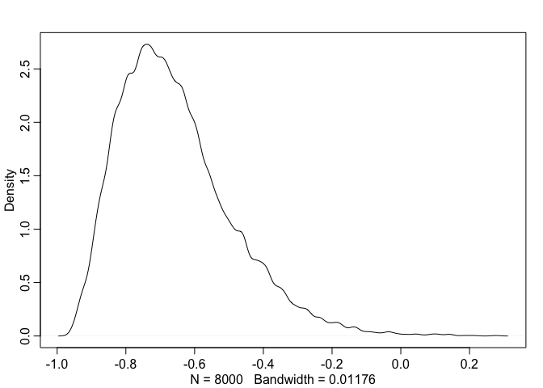

# Chp_13 homework

Probblems:


## 13E1. Add to the following model varying slopes on the predictor x. 

yi ∼ Normal(μi, σ)
μi = αgroup[i] + βx[i] 

[αgroup, βx] ∼ MVNormal([α
                         β ], S)
                         
S = (σα, 0 ` R(σα, 0

      0, σβ)   0, σβ)
      
      
α ∼ Normal(0, 10)
β ∼ Normal(0, 1)
σ ∼ HalfCauchy(0, 2)
σα ∼ HalfCauchy(0, 2)
R ~ LKJcorr(2)

## 13E2.  Think up a context in which varying intercepts will be positively correlated with varying slopes.
## Provide a mechanistic explanation for the correlation.

### cafe example has a negative correlation between intercept and slope
cafe- average morrning wait 5, 20
slope - differnce between afternoon and morning wait higher, lower diff cause always busy

### plant height and developmental stage at measurment
intercept - average height of plants or growth tall <--- short
slope - difference between height measurments for young or older plants (measuring at recording diff developmental stages)

The shorter plants will remain with smaller growth and a samller difference
The larger plants will have more growth inbetween these stages and a larger difference

## 13M1
## Repeat the café robot simulation from the beginning of the chapter. This time,set rho to zero, so that there is no correlation between intercepts and slopes. How does the posterior distribution of the correlation reflect this change in the underlying simulation?

## simulation with rho set to zero, so that there is no correlation between intercepts and slopes.


```r
library(rethinking)
```

```
## Loading required package: rstan
```

```
## Warning: package 'rstan' was built under R version 3.3.2
```

```
## Loading required package: ggplot2
```

```
## Warning: package 'ggplot2' was built under R version 3.3.2
```

```
## Loading required package: StanHeaders
```

```
## Warning: package 'StanHeaders' was built under R version 3.3.2
```

```
## rstan (Version 2.14.1, packaged: 2016-12-28 14:55:41 UTC, GitRev: 5fa1e80eb817)
```

```
## For execution on a local, multicore CPU with excess RAM we recommend calling
## rstan_options(auto_write = TRUE)
## options(mc.cores = parallel::detectCores())
```

```
## Loading required package: parallel
```

```
## rethinking (Version 1.59)
```

```r
## simulate averages from populations / create fake dataset
a <- 3.5
b <- (-1)
sigma_a <- 1
sigma_b <- 0.5
rho <- (0)
N_cafes <- 20

## make two dimensional multivatiate gaussian
## average info for intercept and slope
Mu <- c( a , b )
### sd for intercept and slope 
cov_ab <- sigma_a*sigma_b*rho
Sigma <- matrix( c(sigma_a^2,cov_ab,cov_ab,sigma_b^2) , ncol=2)


### select from multivariate gaussian
library(MASS)
### select from multivariate gaussian
set.seed(5) # used to replicate example
vary_effects <- mvrnorm( N_cafes , Mu , Sigma )

a_cafe <- vary_effects[,1]
b_cafe <- vary_effects[,2]


N_visits <- 10
afternoon <- rep(0:1,N_visits*N_cafes/2)
cafe_id <- rep( 1:N_cafes , each=N_visits )


mu <- a_cafe[cafe_id] + b_cafe[cafe_id]*afternoon
sigma <- 0.5  # std dev within cafes
wait <- rnorm( N_visits*N_cafes , mu , sigma )
d2 <- data.frame( cafe=cafe_id , afternoon=afternoon , wait=wait )


m13.m1 <- map2stan(
    alist(
        wait ~ dnorm( mu , sigma ),
        mu <- a_cafe[cafe] + b_cafe[cafe]*afternoon,
        c(a_cafe,b_cafe)[cafe] ~ dmvnorm2(c(a,b),sigma_cafe,Rho),
        a ~ dnorm(0,10),
        b ~ dnorm(0,10),
        sigma_cafe ~ dcauchy(0,2),
        sigma ~ dcauchy(0,2),
        Rho ~ dlkjcorr(2)
),
data=d2 ,
iter=5000 , warmup=2000 , chains=2 )
```

```
## In file included from filec3cd2d623312.cpp:8:
## In file included from /Library/Frameworks/R.framework/Versions/3.3/Resources/library/StanHeaders/include/src/stan/model/model_header.hpp:4:
## In file included from /Library/Frameworks/R.framework/Versions/3.3/Resources/library/StanHeaders/include/stan/math.hpp:4:
## In file included from /Library/Frameworks/R.framework/Versions/3.3/Resources/library/StanHeaders/include/stan/math/rev/mat.hpp:4:
## In file included from /Library/Frameworks/R.framework/Versions/3.3/Resources/library/StanHeaders/include/stan/math/rev/core.hpp:12:
## In file included from /Library/Frameworks/R.framework/Versions/3.3/Resources/library/StanHeaders/include/stan/math/rev/core/gevv_vvv_vari.hpp:5:
## In file included from /Library/Frameworks/R.framework/Versions/3.3/Resources/library/StanHeaders/include/stan/math/rev/core/var.hpp:7:
## In file included from /Library/Frameworks/R.framework/Versions/3.3/Resources/library/BH/include/boost/math/tools/config.hpp:13:
## In file included from /Library/Frameworks/R.framework/Versions/3.3/Resources/library/BH/include/boost/config.hpp:39:
## /Library/Frameworks/R.framework/Versions/3.3/Resources/library/BH/include/boost/config/compiler/clang.hpp:196:11: warning: 'BOOST_NO_CXX11_RVALUE_REFERENCES' macro redefined [-Wmacro-redefined]
## #  define BOOST_NO_CXX11_RVALUE_REFERENCES
##           ^
## <command line>:6:9: note: previous definition is here
## #define BOOST_NO_CXX11_RVALUE_REFERENCES 1
##         ^
## In file included from filec3cd2d623312.cpp:8:
## In file included from /Library/Frameworks/R.framework/Versions/3.3/Resources/library/StanHeaders/include/src/stan/model/model_header.hpp:4:
## In file included from /Library/Frameworks/R.framework/Versions/3.3/Resources/library/StanHeaders/include/stan/math.hpp:4:
## In file included from /Library/Frameworks/R.framework/Versions/3.3/Resources/library/StanHeaders/include/stan/math/rev/mat.hpp:4:
## In file included from /Library/Frameworks/R.framework/Versions/3.3/Resources/library/StanHeaders/include/stan/math/rev/core.hpp:42:
## /Library/Frameworks/R.framework/Versions/3.3/Resources/library/StanHeaders/include/stan/math/rev/core/set_zero_all_adjoints.hpp:14:17: warning: unused function 'set_zero_all_adjoints' [-Wunused-function]
##     static void set_zero_all_adjoints() {
##                 ^
## In file included from filec3cd2d623312.cpp:8:
## In file included from /Library/Frameworks/R.framework/Versions/3.3/Resources/library/StanHeaders/include/src/stan/model/model_header.hpp:4:
## In file included from /Library/Frameworks/R.framework/Versions/3.3/Resources/library/StanHeaders/include/stan/math.hpp:4:
## In file included from /Library/Frameworks/R.framework/Versions/3.3/Resources/library/StanHeaders/include/stan/math/rev/mat.hpp:4:
## In file included from /Library/Frameworks/R.framework/Versions/3.3/Resources/library/StanHeaders/include/stan/math/rev/core.hpp:43:
## /Library/Frameworks/R.framework/Versions/3.3/Resources/library/StanHeaders/include/stan/math/rev/core/set_zero_all_adjoints_nested.hpp:17:17: warning: 'static' function 'set_zero_all_adjoints_nested' declared in header file should be declared 'static inline' [-Wunneeded-internal-declaration]
##     static void set_zero_all_adjoints_nested() {
##                 ^
## In file included from filec3cd2d623312.cpp:8:
## In file included from /Library/Frameworks/R.framework/Versions/3.3/Resources/library/StanHeaders/include/src/stan/model/model_header.hpp:4:
## In file included from /Library/Frameworks/R.framework/Versions/3.3/Resources/library/StanHeaders/include/stan/math.hpp:4:
## In file included from /Library/Frameworks/R.framework/Versions/3.3/Resources/library/StanHeaders/include/stan/math/rev/mat.hpp:11:
## In file included from /Library/Frameworks/R.framework/Versions/3.3/Resources/library/StanHeaders/include/stan/math/prim/mat.hpp:60:
## /Library/Frameworks/R.framework/Versions/3.3/Resources/library/StanHeaders/include/stan/math/prim/mat/fun/autocorrelation.hpp:17:14: warning: function 'fft_next_good_size' is not needed and will not be emitted [-Wunneeded-internal-declaration]
##       size_t fft_next_good_size(size_t N) {
##              ^
## In file included from filec3cd2d623312.cpp:8:
## In file included from /Library/Frameworks/R.framework/Versions/3.3/Resources/library/StanHeaders/include/src/stan/model/model_header.hpp:4:
## In file included from /Library/Frameworks/R.framework/Versions/3.3/Resources/library/StanHeaders/include/stan/math.hpp:4:
## In file included from /Library/Frameworks/R.framework/Versions/3.3/Resources/library/StanHeaders/include/stan/math/rev/mat.hpp:11:
## In file included from /Library/Frameworks/R.framework/Versions/3.3/Resources/library/StanHeaders/include/stan/math/prim/mat.hpp:299:
## In file included from /Library/Frameworks/R.framework/Versions/3.3/Resources/library/StanHeaders/include/stan/math/prim/arr.hpp:36:
## In file included from /Library/Frameworks/R.framework/Versions/3.3/Resources/library/StanHeaders/include/stan/math/prim/arr/functor/integrate_ode_rk45.hpp:13:
## In file included from /Library/Frameworks/R.framework/Versions/3.3/Resources/library/BH/include/boost/numeric/odeint.hpp:61:
## In file included from /Library/Frameworks/R.framework/Versions/3.3/Resources/library/BH/include/boost/numeric/odeint/util/multi_array_adaption.hpp:29:
## In file included from /Library/Frameworks/R.framework/Versions/3.3/Resources/library/BH/include/boost/multi_array.hpp:21:
## In file included from /Library/Frameworks/R.framework/Versions/3.3/Resources/library/BH/include/boost/multi_array/base.hpp:28:
## /Library/Frameworks/R.framework/Versions/3.3/Resources/library/BH/include/boost/multi_array/concept_checks.hpp:42:43: warning: unused typedef 'index_range' [-Wunused-local-typedef]
##       typedef typename Array::index_range index_range;
##                                           ^
## /Library/Frameworks/R.framework/Versions/3.3/Resources/library/BH/include/boost/multi_array/concept_checks.hpp:43:37: warning: unused typedef 'index' [-Wunused-local-typedef]
##       typedef typename Array::index index;
##                                     ^
## /Library/Frameworks/R.framework/Versions/3.3/Resources/library/BH/include/boost/multi_array/concept_checks.hpp:53:43: warning: unused typedef 'index_range' [-Wunused-local-typedef]
##       typedef typename Array::index_range index_range;
##                                           ^
## /Library/Frameworks/R.framework/Versions/3.3/Resources/library/BH/include/boost/multi_array/concept_checks.hpp:54:37: warning: unused typedef 'index' [-Wunused-local-typedef]
##       typedef typename Array::index index;
##                                     ^
## 8 warnings generated.
## 
## SAMPLING FOR MODEL 'wait ~ dnorm(mu, sigma)' NOW (CHAIN 1).
## 
## Chain 1, Iteration:    1 / 5000 [  0%]  (Warmup)
## Chain 1, Iteration:  500 / 5000 [ 10%]  (Warmup)
## Chain 1, Iteration: 1000 / 5000 [ 20%]  (Warmup)
## Chain 1, Iteration: 1500 / 5000 [ 30%]  (Warmup)
## Chain 1, Iteration: 2000 / 5000 [ 40%]  (Warmup)
## Chain 1, Iteration: 2001 / 5000 [ 40%]  (Sampling)
## Chain 1, Iteration: 2500 / 5000 [ 50%]  (Sampling)
## Chain 1, Iteration: 3000 / 5000 [ 60%]  (Sampling)
## Chain 1, Iteration: 3500 / 5000 [ 70%]  (Sampling)
## Chain 1, Iteration: 4000 / 5000 [ 80%]  (Sampling)
## Chain 1, Iteration: 4500 / 5000 [ 90%]  (Sampling)
## Chain 1, Iteration: 5000 / 5000 [100%]  (Sampling)
##  Elapsed Time: 2.15731 seconds (Warm-up)
##                2.41946 seconds (Sampling)
##                4.57676 seconds (Total)
## 
## 
## SAMPLING FOR MODEL 'wait ~ dnorm(mu, sigma)' NOW (CHAIN 2).
## 
## Chain 2, Iteration:    1 / 5000 [  0%]  (Warmup)
## Chain 2, Iteration:  500 / 5000 [ 10%]  (Warmup)
## Chain 2, Iteration: 1000 / 5000 [ 20%]  (Warmup)
## Chain 2, Iteration: 1500 / 5000 [ 30%]  (Warmup)
## Chain 2, Iteration: 2000 / 5000 [ 40%]  (Warmup)
## Chain 2, Iteration: 2001 / 5000 [ 40%]  (Sampling)
## Chain 2, Iteration: 2500 / 5000 [ 50%]  (Sampling)
## Chain 2, Iteration: 3000 / 5000 [ 60%]  (Sampling)
## Chain 2, Iteration: 3500 / 5000 [ 70%]  (Sampling)
## Chain 2, Iteration: 4000 / 5000 [ 80%]  (Sampling)
## Chain 2, Iteration: 4500 / 5000 [ 90%]  (Sampling)
## Chain 2, Iteration: 5000 / 5000 [100%]  (Sampling)
##  Elapsed Time: 2.05264 seconds (Warm-up)
##                3.03225 seconds (Sampling)
##                5.08488 seconds (Total)
## 
## 
## SAMPLING FOR MODEL 'wait ~ dnorm(mu, sigma)' NOW (CHAIN 1).
## WARNING: No variance estimation is
##          performed for num_warmup < 20
## 
## 
## Chain 1, Iteration: 1 / 1 [100%]  (Sampling)
##  Elapsed Time: 4e-06 seconds (Warm-up)
##                0.000143 seconds (Sampling)
##                0.000147 seconds (Total)
```

```
## Computing WAIC
```

```
## Constructing posterior predictions
```

```
## [ 600 / 6000 ]
[ 1200 / 6000 ]
[ 1800 / 6000 ]
[ 2400 / 6000 ]
[ 3000 / 6000 ]
[ 3600 / 6000 ]
[ 4200 / 6000 ]
[ 4800 / 6000 ]
[ 5400 / 6000 ]
[ 6000 / 6000 ]
```

### How does the posterior distribution of the correlation reflect this change in the underlying simulation?


```r
post <- extract.samples(m13.m1)
dens( post$Rho[,1,2] )
```

<!-- -->

```r
### these show a postive correlation rather than neg between slope and intercept?
```

## 13M2. Fit this multilevel model to the simulated café data: 
# Wi ∼ Normal(μi, σ)
# μi = αcafé[i] + βcafé[i]Ai 
# αcafé ∼ Normal(α, σα)
# βcafé ∼Normal(β,σβ)
# α ∼ Normal(0, 10)
# β ∼ Normal(0, 10)
# σ ∼ HalfCauchy(0, 1)
# σα ∼ HalfCauchy(0, 1) σβ ∼HalfCauchy(0,1)
## Use WAIC to compare this model to the model from the chapter, the one that uses a multi-variate Gaussian prior. Explain the result.


```r
m13.m2 <- map2stan(
    alist(
        wait ~ dnorm( mu , sigma ),
        mu <- a_cafe[cafe] + b_cafe[cafe]*afternoon,
        a_cafe[cafe] ~ dnorm(a, sigma_alpha),
        b_cafe[cafe] ~ dnorm(b, sigma_beta),
        a ~ dnorm(0,10),
        b ~ dnorm(0,10),
        sigma ~ dcauchy(0,1),
        sigma_alpha ~ dcauchy(0,1),
        sigma_beta ~ dcauchy(0,1)
),
data=d2 ,
iter=5000 , warmup=2000 , chains=2 )
```

```
## In file included from filec3cdcfddf35.cpp:8:
## In file included from /Library/Frameworks/R.framework/Versions/3.3/Resources/library/StanHeaders/include/src/stan/model/model_header.hpp:4:
## In file included from /Library/Frameworks/R.framework/Versions/3.3/Resources/library/StanHeaders/include/stan/math.hpp:4:
## In file included from /Library/Frameworks/R.framework/Versions/3.3/Resources/library/StanHeaders/include/stan/math/rev/mat.hpp:4:
## In file included from /Library/Frameworks/R.framework/Versions/3.3/Resources/library/StanHeaders/include/stan/math/rev/core.hpp:12:
## In file included from /Library/Frameworks/R.framework/Versions/3.3/Resources/library/StanHeaders/include/stan/math/rev/core/gevv_vvv_vari.hpp:5:
## In file included from /Library/Frameworks/R.framework/Versions/3.3/Resources/library/StanHeaders/include/stan/math/rev/core/var.hpp:7:
## In file included from /Library/Frameworks/R.framework/Versions/3.3/Resources/library/BH/include/boost/math/tools/config.hpp:13:
## In file included from /Library/Frameworks/R.framework/Versions/3.3/Resources/library/BH/include/boost/config.hpp:39:
## /Library/Frameworks/R.framework/Versions/3.3/Resources/library/BH/include/boost/config/compiler/clang.hpp:196:11: warning: 'BOOST_NO_CXX11_RVALUE_REFERENCES' macro redefined [-Wmacro-redefined]
## #  define BOOST_NO_CXX11_RVALUE_REFERENCES
##           ^
## <command line>:6:9: note: previous definition is here
## #define BOOST_NO_CXX11_RVALUE_REFERENCES 1
##         ^
## In file included from filec3cdcfddf35.cpp:8:
## In file included from /Library/Frameworks/R.framework/Versions/3.3/Resources/library/StanHeaders/include/src/stan/model/model_header.hpp:4:
## In file included from /Library/Frameworks/R.framework/Versions/3.3/Resources/library/StanHeaders/include/stan/math.hpp:4:
## In file included from /Library/Frameworks/R.framework/Versions/3.3/Resources/library/StanHeaders/include/stan/math/rev/mat.hpp:4:
## In file included from /Library/Frameworks/R.framework/Versions/3.3/Resources/library/StanHeaders/include/stan/math/rev/core.hpp:42:
## /Library/Frameworks/R.framework/Versions/3.3/Resources/library/StanHeaders/include/stan/math/rev/core/set_zero_all_adjoints.hpp:14:17: warning: unused function 'set_zero_all_adjoints' [-Wunused-function]
##     static void set_zero_all_adjoints() {
##                 ^
## In file included from filec3cdcfddf35.cpp:8:
## In file included from /Library/Frameworks/R.framework/Versions/3.3/Resources/library/StanHeaders/include/src/stan/model/model_header.hpp:4:
## In file included from /Library/Frameworks/R.framework/Versions/3.3/Resources/library/StanHeaders/include/stan/math.hpp:4:
## In file included from /Library/Frameworks/R.framework/Versions/3.3/Resources/library/StanHeaders/include/stan/math/rev/mat.hpp:4:
## In file included from /Library/Frameworks/R.framework/Versions/3.3/Resources/library/StanHeaders/include/stan/math/rev/core.hpp:43:
## /Library/Frameworks/R.framework/Versions/3.3/Resources/library/StanHeaders/include/stan/math/rev/core/set_zero_all_adjoints_nested.hpp:17:17: warning: 'static' function 'set_zero_all_adjoints_nested' declared in header file should be declared 'static inline' [-Wunneeded-internal-declaration]
##     static void set_zero_all_adjoints_nested() {
##                 ^
## In file included from filec3cdcfddf35.cpp:8:
## In file included from /Library/Frameworks/R.framework/Versions/3.3/Resources/library/StanHeaders/include/src/stan/model/model_header.hpp:4:
## In file included from /Library/Frameworks/R.framework/Versions/3.3/Resources/library/StanHeaders/include/stan/math.hpp:4:
## In file included from /Library/Frameworks/R.framework/Versions/3.3/Resources/library/StanHeaders/include/stan/math/rev/mat.hpp:11:
## In file included from /Library/Frameworks/R.framework/Versions/3.3/Resources/library/StanHeaders/include/stan/math/prim/mat.hpp:60:
## /Library/Frameworks/R.framework/Versions/3.3/Resources/library/StanHeaders/include/stan/math/prim/mat/fun/autocorrelation.hpp:17:14: warning: function 'fft_next_good_size' is not needed and will not be emitted [-Wunneeded-internal-declaration]
##       size_t fft_next_good_size(size_t N) {
##              ^
## In file included from filec3cdcfddf35.cpp:8:
## In file included from /Library/Frameworks/R.framework/Versions/3.3/Resources/library/StanHeaders/include/src/stan/model/model_header.hpp:4:
## In file included from /Library/Frameworks/R.framework/Versions/3.3/Resources/library/StanHeaders/include/stan/math.hpp:4:
## In file included from /Library/Frameworks/R.framework/Versions/3.3/Resources/library/StanHeaders/include/stan/math/rev/mat.hpp:11:
## In file included from /Library/Frameworks/R.framework/Versions/3.3/Resources/library/StanHeaders/include/stan/math/prim/mat.hpp:299:
## In file included from /Library/Frameworks/R.framework/Versions/3.3/Resources/library/StanHeaders/include/stan/math/prim/arr.hpp:36:
## In file included from /Library/Frameworks/R.framework/Versions/3.3/Resources/library/StanHeaders/include/stan/math/prim/arr/functor/integrate_ode_rk45.hpp:13:
## In file included from /Library/Frameworks/R.framework/Versions/3.3/Resources/library/BH/include/boost/numeric/odeint.hpp:61:
## In file included from /Library/Frameworks/R.framework/Versions/3.3/Resources/library/BH/include/boost/numeric/odeint/util/multi_array_adaption.hpp:29:
## In file included from /Library/Frameworks/R.framework/Versions/3.3/Resources/library/BH/include/boost/multi_array.hpp:21:
## In file included from /Library/Frameworks/R.framework/Versions/3.3/Resources/library/BH/include/boost/multi_array/base.hpp:28:
## /Library/Frameworks/R.framework/Versions/3.3/Resources/library/BH/include/boost/multi_array/concept_checks.hpp:42:43: warning: unused typedef 'index_range' [-Wunused-local-typedef]
##       typedef typename Array::index_range index_range;
##                                           ^
## /Library/Frameworks/R.framework/Versions/3.3/Resources/library/BH/include/boost/multi_array/concept_checks.hpp:43:37: warning: unused typedef 'index' [-Wunused-local-typedef]
##       typedef typename Array::index index;
##                                     ^
## /Library/Frameworks/R.framework/Versions/3.3/Resources/library/BH/include/boost/multi_array/concept_checks.hpp:53:43: warning: unused typedef 'index_range' [-Wunused-local-typedef]
##       typedef typename Array::index_range index_range;
##                                           ^
## /Library/Frameworks/R.framework/Versions/3.3/Resources/library/BH/include/boost/multi_array/concept_checks.hpp:54:37: warning: unused typedef 'index' [-Wunused-local-typedef]
##       typedef typename Array::index index;
##                                     ^
## 8 warnings generated.
## 
## SAMPLING FOR MODEL 'wait ~ dnorm(mu, sigma)' NOW (CHAIN 1).
## 
## Chain 1, Iteration:    1 / 5000 [  0%]  (Warmup)
## Chain 1, Iteration:  500 / 5000 [ 10%]  (Warmup)
## Chain 1, Iteration: 1000 / 5000 [ 20%]  (Warmup)
## Chain 1, Iteration: 1500 / 5000 [ 30%]  (Warmup)
## Chain 1, Iteration: 2000 / 5000 [ 40%]  (Warmup)
## Chain 1, Iteration: 2001 / 5000 [ 40%]  (Sampling)
## Chain 1, Iteration: 2500 / 5000 [ 50%]  (Sampling)
## Chain 1, Iteration: 3000 / 5000 [ 60%]  (Sampling)
## Chain 1, Iteration: 3500 / 5000 [ 70%]  (Sampling)
## Chain 1, Iteration: 4000 / 5000 [ 80%]  (Sampling)
## Chain 1, Iteration: 4500 / 5000 [ 90%]  (Sampling)
## Chain 1, Iteration: 5000 / 5000 [100%]  (Sampling)
##  Elapsed Time: 1.01621 seconds (Warm-up)
##                1.08565 seconds (Sampling)
##                2.10186 seconds (Total)
## 
## 
## SAMPLING FOR MODEL 'wait ~ dnorm(mu, sigma)' NOW (CHAIN 2).
## 
## Chain 2, Iteration:    1 / 5000 [  0%]  (Warmup)
## Chain 2, Iteration:  500 / 5000 [ 10%]  (Warmup)
## Chain 2, Iteration: 1000 / 5000 [ 20%]  (Warmup)
## Chain 2, Iteration: 1500 / 5000 [ 30%]  (Warmup)
## Chain 2, Iteration: 2000 / 5000 [ 40%]  (Warmup)
## Chain 2, Iteration: 2001 / 5000 [ 40%]  (Sampling)
## Chain 2, Iteration: 2500 / 5000 [ 50%]  (Sampling)
## Chain 2, Iteration: 3000 / 5000 [ 60%]  (Sampling)
## Chain 2, Iteration: 3500 / 5000 [ 70%]  (Sampling)
## Chain 2, Iteration: 4000 / 5000 [ 80%]  (Sampling)
## Chain 2, Iteration: 4500 / 5000 [ 90%]  (Sampling)
## Chain 2, Iteration: 5000 / 5000 [100%]  (Sampling)
##  Elapsed Time: 0.800248 seconds (Warm-up)
##                0.820948 seconds (Sampling)
##                1.6212 seconds (Total)
## 
## 
## SAMPLING FOR MODEL 'wait ~ dnorm(mu, sigma)' NOW (CHAIN 1).
## WARNING: No variance estimation is
##          performed for num_warmup < 20
## 
## 
## Chain 1, Iteration: 1 / 1 [100%]  (Sampling)
##  Elapsed Time: 3e-06 seconds (Warm-up)
##                6.5e-05 seconds (Sampling)
##                6.8e-05 seconds (Total)
```

```
## Computing WAIC
```

```
## Constructing posterior predictions
```

```
## [ 600 / 6000 ]
[ 1200 / 6000 ]
[ 1800 / 6000 ]
[ 2400 / 6000 ]
[ 3000 / 6000 ]
[ 3600 / 6000 ]
[ 4200 / 6000 ]
[ 4800 / 6000 ]
[ 5400 / 6000 ]
[ 6000 / 6000 ]
```

```r
compare(m13.m1,m13.m2)
```

```
##         WAIC pWAIC dWAIC weight    SE  dSE
## m13.m1 312.2  31.0   0.0   0.58 20.57   NA
## m13.m2 312.9  32.5   0.7   0.42 20.87 2.71
```

These models are pretty much the same, except I amd confused why the dcauchy vars differ...


## 13H1. Let’s revisit the Bangladesh fertility data, data(bangladesh),from the practice problems for Chapter 12.


```r
data(bangladesh)
d <- bangladesh
head(d)
```

```
##   woman district use.contraception living.children age.centered urban
## 1     1        1                 0               4      18.4400     1
## 2     2        1                 0               1      -5.5599     1
## 3     3        1                 0               3       1.4400     1
## 4     4        1                 0               4       8.4400     1
## 5     5        1                 0               1     -13.5590     1
## 6     6        1                 0               1     -11.5600     1
```

```r
## clean up data
d$district_id <- as.integer(as.factor(d$district))
sort(unique(d$district_id))
```

```
##  [1]  1  2  3  4  5  6  7  8  9 10 11 12 13 14 15 16 17 18 19 20 21 22 23
## [24] 24 25 26 27 28 29 30 31 32 33 34 35 36 37 38 39 40 41 42 43 44 45 46
## [47] 47 48 49 50 51 52 53 54 55 56 57 58 59 60
```

```r
## Now there are 60 values, contiguous integers 1 to 60.

colnames(d) <- gsub("\\.", "_", colnames(d))
d$number_of_women_in_distict <- rep(1,1934)

head(d)
```

```
##   woman district use_contraception living_children age_centered urban
## 1     1        1                 0               4      18.4400     1
## 2     2        1                 0               1      -5.5599     1
## 3     3        1                 0               3       1.4400     1
## 4     4        1                 0               4       8.4400     1
## 5     5        1                 0               1     -13.5590     1
## 6     6        1                 0               1     -11.5600     1
##   district_id number_of_women_in_distict
## 1           1                          1
## 2           1                          1
## 3           1                          1
## 4           1                          1
## 5           1                          1
## 6           1                          1
```
## Fit a model with both varying intercepts by district_id and varying slopes of urban by district_id. You are still predicting use.contraception. 


```r
m13.h1 <- map2stan(
    alist(
        use_contraception ~ dbinom( 1 , p ) ,
        logit(p) <- a_district[district_id] + b_district[district_id]*urban,
        c(a_district,b_district)[district_id] ~   dmvnorm2(c(a,b),sigma_dist,Rho),
        Rho ~ dlkjcorr(2),
        c(a,b) ~ dnorm(0,1) ,
        c(sigma,sigma_dist) ~ dcauchy(0,1)
    ), data=d , iter=4000 , chains=4)
```

```
## In file included from filec3cd388e6698.cpp:8:
## In file included from /Library/Frameworks/R.framework/Versions/3.3/Resources/library/StanHeaders/include/src/stan/model/model_header.hpp:4:
## In file included from /Library/Frameworks/R.framework/Versions/3.3/Resources/library/StanHeaders/include/stan/math.hpp:4:
## In file included from /Library/Frameworks/R.framework/Versions/3.3/Resources/library/StanHeaders/include/stan/math/rev/mat.hpp:4:
## In file included from /Library/Frameworks/R.framework/Versions/3.3/Resources/library/StanHeaders/include/stan/math/rev/core.hpp:12:
## In file included from /Library/Frameworks/R.framework/Versions/3.3/Resources/library/StanHeaders/include/stan/math/rev/core/gevv_vvv_vari.hpp:5:
## In file included from /Library/Frameworks/R.framework/Versions/3.3/Resources/library/StanHeaders/include/stan/math/rev/core/var.hpp:7:
## In file included from /Library/Frameworks/R.framework/Versions/3.3/Resources/library/BH/include/boost/math/tools/config.hpp:13:
## In file included from /Library/Frameworks/R.framework/Versions/3.3/Resources/library/BH/include/boost/config.hpp:39:
## /Library/Frameworks/R.framework/Versions/3.3/Resources/library/BH/include/boost/config/compiler/clang.hpp:196:11: warning: 'BOOST_NO_CXX11_RVALUE_REFERENCES' macro redefined [-Wmacro-redefined]
## #  define BOOST_NO_CXX11_RVALUE_REFERENCES
##           ^
## <command line>:6:9: note: previous definition is here
## #define BOOST_NO_CXX11_RVALUE_REFERENCES 1
##         ^
## In file included from filec3cd388e6698.cpp:8:
## In file included from /Library/Frameworks/R.framework/Versions/3.3/Resources/library/StanHeaders/include/src/stan/model/model_header.hpp:4:
## In file included from /Library/Frameworks/R.framework/Versions/3.3/Resources/library/StanHeaders/include/stan/math.hpp:4:
## In file included from /Library/Frameworks/R.framework/Versions/3.3/Resources/library/StanHeaders/include/stan/math/rev/mat.hpp:4:
## In file included from /Library/Frameworks/R.framework/Versions/3.3/Resources/library/StanHeaders/include/stan/math/rev/core.hpp:42:
## /Library/Frameworks/R.framework/Versions/3.3/Resources/library/StanHeaders/include/stan/math/rev/core/set_zero_all_adjoints.hpp:14:17: warning: unused function 'set_zero_all_adjoints' [-Wunused-function]
##     static void set_zero_all_adjoints() {
##                 ^
## In file included from filec3cd388e6698.cpp:8:
## In file included from /Library/Frameworks/R.framework/Versions/3.3/Resources/library/StanHeaders/include/src/stan/model/model_header.hpp:4:
## In file included from /Library/Frameworks/R.framework/Versions/3.3/Resources/library/StanHeaders/include/stan/math.hpp:4:
## In file included from /Library/Frameworks/R.framework/Versions/3.3/Resources/library/StanHeaders/include/stan/math/rev/mat.hpp:4:
## In file included from /Library/Frameworks/R.framework/Versions/3.3/Resources/library/StanHeaders/include/stan/math/rev/core.hpp:43:
## /Library/Frameworks/R.framework/Versions/3.3/Resources/library/StanHeaders/include/stan/math/rev/core/set_zero_all_adjoints_nested.hpp:17:17: warning: 'static' function 'set_zero_all_adjoints_nested' declared in header file should be declared 'static inline' [-Wunneeded-internal-declaration]
##     static void set_zero_all_adjoints_nested() {
##                 ^
## In file included from filec3cd388e6698.cpp:8:
## In file included from /Library/Frameworks/R.framework/Versions/3.3/Resources/library/StanHeaders/include/src/stan/model/model_header.hpp:4:
## In file included from /Library/Frameworks/R.framework/Versions/3.3/Resources/library/StanHeaders/include/stan/math.hpp:4:
## In file included from /Library/Frameworks/R.framework/Versions/3.3/Resources/library/StanHeaders/include/stan/math/rev/mat.hpp:11:
## In file included from /Library/Frameworks/R.framework/Versions/3.3/Resources/library/StanHeaders/include/stan/math/prim/mat.hpp:60:
## /Library/Frameworks/R.framework/Versions/3.3/Resources/library/StanHeaders/include/stan/math/prim/mat/fun/autocorrelation.hpp:17:14: warning: function 'fft_next_good_size' is not needed and will not be emitted [-Wunneeded-internal-declaration]
##       size_t fft_next_good_size(size_t N) {
##              ^
## In file included from filec3cd388e6698.cpp:8:
## In file included from /Library/Frameworks/R.framework/Versions/3.3/Resources/library/StanHeaders/include/src/stan/model/model_header.hpp:4:
## In file included from /Library/Frameworks/R.framework/Versions/3.3/Resources/library/StanHeaders/include/stan/math.hpp:4:
## In file included from /Library/Frameworks/R.framework/Versions/3.3/Resources/library/StanHeaders/include/stan/math/rev/mat.hpp:11:
## In file included from /Library/Frameworks/R.framework/Versions/3.3/Resources/library/StanHeaders/include/stan/math/prim/mat.hpp:299:
## In file included from /Library/Frameworks/R.framework/Versions/3.3/Resources/library/StanHeaders/include/stan/math/prim/arr.hpp:36:
## In file included from /Library/Frameworks/R.framework/Versions/3.3/Resources/library/StanHeaders/include/stan/math/prim/arr/functor/integrate_ode_rk45.hpp:13:
## In file included from /Library/Frameworks/R.framework/Versions/3.3/Resources/library/BH/include/boost/numeric/odeint.hpp:61:
## In file included from /Library/Frameworks/R.framework/Versions/3.3/Resources/library/BH/include/boost/numeric/odeint/util/multi_array_adaption.hpp:29:
## In file included from /Library/Frameworks/R.framework/Versions/3.3/Resources/library/BH/include/boost/multi_array.hpp:21:
## In file included from /Library/Frameworks/R.framework/Versions/3.3/Resources/library/BH/include/boost/multi_array/base.hpp:28:
## /Library/Frameworks/R.framework/Versions/3.3/Resources/library/BH/include/boost/multi_array/concept_checks.hpp:42:43: warning: unused typedef 'index_range' [-Wunused-local-typedef]
##       typedef typename Array::index_range index_range;
##                                           ^
## /Library/Frameworks/R.framework/Versions/3.3/Resources/library/BH/include/boost/multi_array/concept_checks.hpp:43:37: warning: unused typedef 'index' [-Wunused-local-typedef]
##       typedef typename Array::index index;
##                                     ^
## /Library/Frameworks/R.framework/Versions/3.3/Resources/library/BH/include/boost/multi_array/concept_checks.hpp:53:43: warning: unused typedef 'index_range' [-Wunused-local-typedef]
##       typedef typename Array::index_range index_range;
##                                           ^
## /Library/Frameworks/R.framework/Versions/3.3/Resources/library/BH/include/boost/multi_array/concept_checks.hpp:54:37: warning: unused typedef 'index' [-Wunused-local-typedef]
##       typedef typename Array::index index;
##                                     ^
## 8 warnings generated.
## 
## SAMPLING FOR MODEL 'use_contraception ~ dbinom(1, p)' NOW (CHAIN 1).
## 
## Chain 1, Iteration:    1 / 4000 [  0%]  (Warmup)
## Chain 1, Iteration:  400 / 4000 [ 10%]  (Warmup)
## Chain 1, Iteration:  800 / 4000 [ 20%]  (Warmup)
## Chain 1, Iteration: 1200 / 4000 [ 30%]  (Warmup)
## Chain 1, Iteration: 1600 / 4000 [ 40%]  (Warmup)
## Chain 1, Iteration: 2000 / 4000 [ 50%]  (Warmup)
## Chain 1, Iteration: 2001 / 4000 [ 50%]  (Sampling)
## Chain 1, Iteration: 2400 / 4000 [ 60%]  (Sampling)
## Chain 1, Iteration: 2800 / 4000 [ 70%]  (Sampling)
## Chain 1, Iteration: 3200 / 4000 [ 80%]  (Sampling)
## Chain 1, Iteration: 3600 / 4000 [ 90%]  (Sampling)
## Chain 1, Iteration: 4000 / 4000 [100%]  (Sampling)
##  Elapsed Time: 45.4794 seconds (Warm-up)
##                885.212 seconds (Sampling)
##                930.691 seconds (Total)
```

```
## The following numerical problems occured the indicated number of times on chain 1
```

```
##                                                                        count
## Exception thrown at line 37: lkj_corr_log: y is not positive definite.     1
```

```
## When a numerical problem occurs, the Hamiltonian proposal gets rejected.
```

```
## See http://mc-stan.org/misc/warnings.html#exception-hamiltonian-proposal-rejected
```

```
## If the number in the 'count' column is small, do not ask about this message on stan-users.
```

```
## 
## SAMPLING FOR MODEL 'use_contraception ~ dbinom(1, p)' NOW (CHAIN 2).
## 
## Chain 2, Iteration:    1 / 4000 [  0%]  (Warmup)
## Chain 2, Iteration:  400 / 4000 [ 10%]  (Warmup)
## Chain 2, Iteration:  800 / 4000 [ 20%]  (Warmup)
## Chain 2, Iteration: 1200 / 4000 [ 30%]  (Warmup)
## Chain 2, Iteration: 1600 / 4000 [ 40%]  (Warmup)
## Chain 2, Iteration: 2000 / 4000 [ 50%]  (Warmup)
## Chain 2, Iteration: 2001 / 4000 [ 50%]  (Sampling)
## Chain 2, Iteration: 2400 / 4000 [ 60%]  (Sampling)
## Chain 2, Iteration: 2800 / 4000 [ 70%]  (Sampling)
## Chain 2, Iteration: 3200 / 4000 [ 80%]  (Sampling)
## Chain 2, Iteration: 3600 / 4000 [ 90%]  (Sampling)
## Chain 2, Iteration: 4000 / 4000 [100%]  (Sampling)
##  Elapsed Time: 73.4045 seconds (Warm-up)
##                38.7825 seconds (Sampling)
##                112.187 seconds (Total)
```

```
## The following numerical problems occured the indicated number of times on chain 2
```

```
##                                                                        count
## Exception thrown at line 37: lkj_corr_log: y is not positive definite.     1
```

```
## When a numerical problem occurs, the Hamiltonian proposal gets rejected.
```

```
## See http://mc-stan.org/misc/warnings.html#exception-hamiltonian-proposal-rejected
```

```
## If the number in the 'count' column is small, do not ask about this message on stan-users.
```

```
## 
## SAMPLING FOR MODEL 'use_contraception ~ dbinom(1, p)' NOW (CHAIN 3).
## 
## Chain 3, Iteration:    1 / 4000 [  0%]  (Warmup)
## Chain 3, Iteration:  400 / 4000 [ 10%]  (Warmup)
## Chain 3, Iteration:  800 / 4000 [ 20%]  (Warmup)
## Chain 3, Iteration: 1200 / 4000 [ 30%]  (Warmup)
## Chain 3, Iteration: 1600 / 4000 [ 40%]  (Warmup)
## Chain 3, Iteration: 2000 / 4000 [ 50%]  (Warmup)
## Chain 3, Iteration: 2001 / 4000 [ 50%]  (Sampling)
## Chain 3, Iteration: 2400 / 4000 [ 60%]  (Sampling)
## Chain 3, Iteration: 2800 / 4000 [ 70%]  (Sampling)
## Chain 3, Iteration: 3200 / 4000 [ 80%]  (Sampling)
## Chain 3, Iteration: 3600 / 4000 [ 90%]  (Sampling)
## Chain 3, Iteration: 4000 / 4000 [100%]  (Sampling)
##  Elapsed Time: 27.6236 seconds (Warm-up)
##                29.8883 seconds (Sampling)
##                57.5118 seconds (Total)
## 
## 
## SAMPLING FOR MODEL 'use_contraception ~ dbinom(1, p)' NOW (CHAIN 4).
## 
## Chain 4, Iteration:    1 / 4000 [  0%]  (Warmup)
## Chain 4, Iteration:  400 / 4000 [ 10%]  (Warmup)
## Chain 4, Iteration:  800 / 4000 [ 20%]  (Warmup)
## Chain 4, Iteration: 1200 / 4000 [ 30%]  (Warmup)
## Chain 4, Iteration: 1600 / 4000 [ 40%]  (Warmup)
## Chain 4, Iteration: 2000 / 4000 [ 50%]  (Warmup)
## Chain 4, Iteration: 2001 / 4000 [ 50%]  (Sampling)
## Chain 4, Iteration: 2400 / 4000 [ 60%]  (Sampling)
## Chain 4, Iteration: 2800 / 4000 [ 70%]  (Sampling)
## Chain 4, Iteration: 3200 / 4000 [ 80%]  (Sampling)
## Chain 4, Iteration: 3600 / 4000 [ 90%]  (Sampling)
## Chain 4, Iteration: 4000 / 4000 [100%]  (Sampling)
##  Elapsed Time: 28.4182 seconds (Warm-up)
##                25.5413 seconds (Sampling)
##                53.9595 seconds (Total)
## 
## 
## SAMPLING FOR MODEL 'use_contraception ~ dbinom(1, p)' NOW (CHAIN 1).
## WARNING: No variance estimation is
##          performed for num_warmup < 20
## 
## 
## Chain 1, Iteration: 1 / 1 [100%]  (Sampling)
##  Elapsed Time: 4e-06 seconds (Warm-up)
##                0.001172 seconds (Sampling)
##                0.001176 seconds (Total)
```

```
## Computing WAIC
```

```
## Constructing posterior predictions
```

```
## [ 800 / 8000 ]
[ 1600 / 8000 ]
[ 2400 / 8000 ]
[ 3200 / 8000 ]
[ 4000 / 8000 ]
[ 4800 / 8000 ]
[ 5600 / 8000 ]
[ 6400 / 8000 ]
[ 7200 / 8000 ]
[ 8000 / 8000 ]
```

```r
precis(m13.h1, depth=2)
```

```
##                 Mean StdDev lower 0.89 upper 0.89 n_eff Rhat
## b_district[1]   1.07   0.39       0.45       1.67  5728 1.00
## b_district[2]   0.67   0.70      -0.43       1.79  8000 1.00
## b_district[3]   0.97   0.81      -0.33       2.23  6322 1.00
## b_district[4]   1.63   0.65       0.63       2.69  2638 1.00
## b_district[5]   0.64   0.61      -0.30       1.64  8000 1.00
## b_district[6]   1.33   0.56       0.48       2.23  8000 1.00
## b_district[7]   0.83   0.71      -0.28       1.93  8000 1.00
## b_district[8]   0.96   0.65      -0.11       1.96  8000 1.00
## b_district[9]   1.04   0.64       0.06       2.08  8000 1.00
## b_district[10]  1.26   0.77       0.04       2.47  5005 1.00
## b_district[11]  1.66   0.83       0.28       2.92  3890 1.00
## b_district[12]  0.44   0.59      -0.46       1.40  8000 1.00
## b_district[13]  0.28   0.60      -0.68       1.19  8000 1.00
## b_district[14]  1.26   0.44       0.58       1.98  5187 1.00
## b_district[15]  0.45   0.60      -0.47       1.40  8000 1.00
## b_district[16]  0.61   0.66      -0.39       1.71  8000 1.00
## b_district[17]  0.81   0.70      -0.31       1.87  8000 1.00
## b_district[18]  0.89   0.50       0.08       1.65  8000 1.00
## b_district[19]  0.99   0.64      -0.02       1.99  8000 1.00
## b_district[20]  0.56   0.70      -0.49       1.73  8000 1.00
## b_district[21] -0.34   0.69      -1.43       0.74  2748 1.00
## b_district[22]  1.03   0.72      -0.10       2.15  8000 1.00
## b_district[23]  0.84   0.71      -0.24       2.02  8000 1.00
## b_district[24]  1.27   0.78       0.01       2.51  4964 1.00
## b_district[25]  0.20   0.45      -0.51       0.94  8000 1.00
## b_district[26]  0.59   0.71      -0.62       1.65  8000 1.00
## b_district[27]  1.20   0.61       0.18       2.13  8000 1.00
## b_district[28]  0.75   0.59      -0.23       1.65  8000 1.00
## b_district[29]  1.19   0.59       0.27       2.16  8000 1.00
## b_district[30]  1.04   0.49       0.25       1.79  8000 1.00
## b_district[31]  0.40   0.58      -0.57       1.28  8000 1.00
## b_district[32]  1.04   0.73      -0.07       2.19  8000 1.00
## b_district[33]  1.29   0.69       0.14       2.33  8000 1.00
## b_district[34] -0.71   0.63      -1.66       0.32  2624 1.00
## b_district[35]  0.46   0.48      -0.30       1.22  8000 1.00
## b_district[36]  0.52   0.65      -0.44       1.62  8000 1.00
## b_district[37]  0.30   0.72      -0.88       1.41  8000 1.00
## b_district[38]  1.30   0.69       0.24       2.44  5734 1.00
## b_district[39]  0.27   0.65      -0.80       1.27  8000 1.00
## b_district[40]  0.49   0.51      -0.32       1.30  8000 1.00
## b_district[41] -0.27   0.69      -1.39       0.80  4231 1.00
## b_district[42] -0.28   0.74      -1.47       0.87  3373 1.00
## b_district[43]  0.44   0.48      -0.33       1.19  8000 1.00
## b_district[44]  1.02   0.70      -0.07       2.12  8000 1.00
## b_district[45]  1.25   0.61       0.27       2.20  8000 1.00
## b_district[46]  0.46   0.47      -0.31       1.18  8000 1.00
## b_district[47]  0.53   0.64      -0.53       1.47  8000 1.00
## b_district[48]  0.39   0.50      -0.36       1.19  8000 1.00
## b_district[49]  1.03   0.80      -0.21       2.30  8000 1.00
## b_district[50]  1.19   0.68       0.14       2.26  3304 1.00
## b_district[51]  0.85   0.51       0.06       1.68  8000 1.00
## b_district[52] -0.44   0.51      -1.21       0.41  3265 1.00
## b_district[53]  0.53   0.65      -0.50       1.55  5310 1.00
## b_district[54]  0.28   0.77      -0.97       1.48  4457 1.00
## b_district[55]  0.44   0.48      -0.34       1.18  8000 1.00
## b_district[56]  0.91   0.62      -0.08       1.89  8000 1.00
## b_district[57] -0.20   0.56      -1.10       0.69  3890 1.00
## b_district[58]  1.15   0.78       0.01       2.46  8000 1.00
## b_district[59]  0.77   0.57      -0.19       1.64  8000 1.00
## b_district[60]  0.71   0.55      -0.16       1.59  8000 1.00
## a_district[1]  -1.54   0.31      -2.02      -1.02  5275 1.00
## a_district[2]  -0.67   0.37      -1.28      -0.10  8000 1.00
## a_district[3]  -0.67   0.60      -1.58       0.30  8000 1.00
## a_district[4]  -0.86   0.40      -1.47      -0.21  8000 1.00
## a_district[5]  -0.65   0.29      -1.11      -0.18  8000 1.00
## a_district[6]  -1.05   0.26      -1.48      -0.64  8000 1.00
## a_district[7]  -0.86   0.39      -1.51      -0.27  8000 1.00
## a_district[8]  -0.67   0.31      -1.15      -0.16  8000 1.00
## a_district[9]  -0.93   0.38      -1.55      -0.34  8000 1.00
## a_district[10] -1.33   0.47      -2.09      -0.62  8000 1.00
## a_district[11] -1.77   0.48      -2.49      -0.99  8000 1.00
## a_district[12] -0.67   0.35      -1.21      -0.09  8000 1.00
## a_district[13] -0.47   0.39      -1.09       0.13  8000 1.00
## a_district[14] -0.63   0.39      -1.25       0.00  5820 1.00
## a_district[15] -0.66   0.41      -1.31      -0.01  8000 1.00
## a_district[16] -0.29   0.38      -0.86       0.34  8000 1.00
## a_district[17] -0.83   0.35      -1.38      -0.27  8000 1.00
## a_district[18] -0.90   0.32      -1.39      -0.38  8000 1.00
## a_district[19] -0.74   0.36      -1.31      -0.16  8000 1.00
## a_district[20] -0.56   0.39      -1.21       0.05  8000 1.00
## a_district[21] -0.25   0.46      -1.01       0.46  8000 1.00
## a_district[22] -1.08   0.39      -1.68      -0.45  8000 1.00
## a_district[23] -0.87   0.41      -1.50      -0.21  8000 1.00
## a_district[24] -1.35   0.46      -2.07      -0.65  8000 1.00
## a_district[25] -0.32   0.26      -0.72       0.12  8000 1.00
## a_district[26] -0.59   0.41      -1.24       0.07  8000 1.00
## a_district[27] -1.37   0.34      -1.90      -0.82  8000 1.00
## a_district[28] -1.03   0.29      -1.49      -0.54  8000 1.00
## a_district[29] -1.11   0.37      -1.70      -0.52  8000 1.00
## a_district[30] -0.46   0.27      -0.89      -0.04  8000 1.00
## a_district[31] -0.39   0.33      -0.90       0.15  8000 1.00
## a_district[32] -1.09   0.38      -1.68      -0.48  8000 1.00
## a_district[33] -0.99   0.49      -1.76      -0.21  8000 1.00
## a_district[34]  0.49   0.36      -0.07       1.07  8000 1.00
## a_district[35] -0.33   0.33      -0.86       0.18  8000 1.00
## a_district[36] -0.67   0.40      -1.30      -0.02  8000 1.00
## a_district[37] -0.27   0.41      -0.91       0.41  8000 1.00
## a_district[38] -1.23   0.50      -2.05      -0.46  8000 1.00
## a_district[39] -0.24   0.35      -0.80       0.30  8000 1.00
## a_district[40] -0.54   0.41      -1.21       0.10  8000 1.00
## a_district[41] -0.09   0.36      -0.67       0.45  8000 1.00
## a_district[42] -0.05   0.51      -0.85       0.77  4927 1.00
## a_district[43] -0.22   0.32      -0.73       0.27  8000 1.00
## a_district[44] -1.06   0.36      -1.63      -0.49  8000 1.00
## a_district[45] -0.92   0.32      -1.41      -0.40  8000 1.00
## a_district[46] -0.10   0.22      -0.45       0.24  8000 1.00
## a_district[47] -0.52   0.44      -1.23       0.19  8000 1.00
## a_district[48] -0.23   0.33      -0.75       0.31  8000 1.00
## a_district[49] -1.07   0.54      -1.90      -0.19  8000 1.00
## a_district[50] -0.68   0.40      -1.36      -0.07  8000 1.00
## a_district[51] -0.65   0.36      -1.23      -0.09  8000 1.00
## a_district[52] -0.11   0.29      -0.58       0.33  8000 1.00
## a_district[53] -0.73   0.56      -1.62       0.16  6052 1.00
## a_district[54] -0.74   0.61      -1.68       0.23  5972 1.00
## a_district[55] -0.13   0.34      -0.66       0.40  8000 1.00
## a_district[56] -1.20   0.38      -1.79      -0.60  8000 1.00
## a_district[57] -0.17   0.37      -0.76       0.41  8000 1.00
## a_district[58] -1.19   0.47      -1.90      -0.40  8000 1.00
## a_district[59] -1.17   0.38      -1.80      -0.58  8000 1.00
## a_district[60] -1.18   0.35      -1.73      -0.62  8000 1.00
## Rho[1,1]        1.00   0.00       1.00       1.00  8000  NaN
## Rho[1,2]       -0.66   0.17      -0.91      -0.43  1610 1.00
## Rho[2,1]       -0.66   0.17      -0.91      -0.43  1610 1.00
## Rho[2,2]        1.00   0.00       1.00       1.00  7916 1.00
## a              -0.70   0.10      -0.86      -0.54  5144 1.00
## b               0.69   0.17       0.42       0.96  3409 1.00
## sigma           0.95  33.97      -5.69       6.03   629 1.01
## sigma_dist[1]   0.58   0.10       0.43       0.73  1991 1.00
## sigma_dist[2]   0.79   0.20       0.45       1.09   875 1.00
```
## Inspect the correlation between the intercepts and slopes. Can you interpret this correlation, in terms of what it tells you about the pattern of contraceptive use in the sample? 


```r
post <- extract.samples(m13.h1)
dens( post$Rho[,1,2] )
```

<!-- -->

```r
## most have correlation around -0.7 between intercept and slope this suggest that conterception is used less in urban areas
```


## It might help to plot the mean (or median) varying effect estimates for both the intercepts and slopes, by district.  Then you can visualize the correlation and maybe more easily think through what it means to have a particular correlation.


```r
a1 <- apply( post$a_district , 2 , mean )
b1 <- apply( post$b_district , 2 , mean )

plot( a1 , b1 , xlab="intercept" , ylab="slope" ,
    pch=16 , col=rangi2 , ylim=c( min(b1)-0.1 , max(b1)+0.1 ) ,
    xlim=c( min(a1)-0.1 , max(a1)+0.1 ) )
points( a1 , b1 , pch=1 )
for ( i in 1:N_cafes ) 

# compute posterior mean bivariate Gaussian
Mu_est <- c( mean(post$a) , mean(post$b) )
rho_est <- mean( post$Rho[,1,2] )
sa_est <- mean( post$sigma_dist[,1] )
sb_est <- mean( post$sigma_dist[,2] )
cov_ab <- sa_est*sb_est*rho_est
Sigma_est <- matrix( c(sa_est^2,cov_ab,cov_ab,sb_est^2) , ncol=2 )
# draw contours
library(ellipse)
for ( l in c(0.1,0.3,0.5,0.8,0.99) )
    lines(ellipse(Sigma_est,centre=Mu_est,level=l),
        col=col.alpha("black",0.2))
```

<!-- -->

## Plotting predicted proportion of women using contraception, with urban women on one axis and rural on the other, might also help.


```r
nonurban <- (a1)
urban <- (a1 + b1)

plot( nonurban , urban , xlab="nonurban" , ylab="urban" ,
    pch=16 , col=rangi2 , ylim=c( min(urban)-0.1 , max(urban)+0.1 ) ,
    xlim=c( min(nonurban)-0.1 , max(nonurban)+0.1 ) )
points( nonurban , urban , pch=1 ) 
```

<!-- -->
