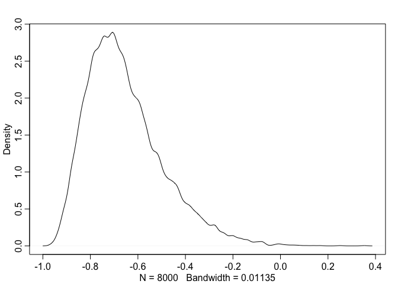

# Chp_13 homework

Probblems:


## 13E1. Add to the following model varying slopes on the predictor x. 

yi ∼ Normal(μi, σ)
μi = αgroup[i] + βx[i] 

[αgroup, βx] ∼ MVNormal([α
                         β ], S)
                         
S = (σα, 0 ` R(σα, 0
0, σβ)   0, σβ)

α ∼ Normal(0, 10)
β ∼ Normal(0, 1)
σ ∼ HalfCauchy(0, 2)
σα ∼ HalfCauchy(0, 2)
R ~ LKJcorr(2)

## 13E2.  Think up a context in which varying intercepts will be positively correlated with varying slopes.
## Provide a mechanistic explanation for the correlation.

### cafe example has a negative correlation between intercept and slope
cafe- average morrning wait 5, 20
slope - differnce between afternoon and morning wait higher, lower diff cause always busy

### plant height and developmental stage at measurment
intercept - average height of plants or growth tall <--- short
slope - difference between height measurments for young or older plants (measuring at recording diff developmental stages)

The shorter plants will remain with smaller growth and a samller difference
The larger plants will have more growth inbetween these stages and a larger difference


## 13E3. When is it possible for a varying slopes model to have fewerer effective parameters(as estimated by WAIC or DIC) than the corresponding model with  fixed (unpooled) slopes? Explain.

when mean slopes are small agression towards mean
less support for them being differnt then more likey to be moved towards the average... have less unquie paramter for fitting...

There are fewer effective paramters when you are using uncentered.
Does this have to do with rather than sampling from a distribution it is built into the modeling.... making the overall number of test/iterations need to run better. Its regulazing the information more towards what the data says? 


## 13M1
## Repeat the café robot simulation from the beginning of the chapter. This time,set rho to zero, so that there is no correlation between intercepts and slopes. How does the posterior distribution of the correlation reflect this change in the underlying simulation?

## simulation with rho set to zero, so that there is no correlation between intercepts and slopes.


```r
library(rethinking)
```

```
## Loading required package: rstan
```

```
## Warning: package 'rstan' was built under R version 3.3.2
```

```
## Loading required package: ggplot2
```

```
## Warning: package 'ggplot2' was built under R version 3.3.2
```

```
## Loading required package: StanHeaders
```

```
## Warning: package 'StanHeaders' was built under R version 3.3.2
```

```
## rstan (Version 2.14.1, packaged: 2016-12-28 14:55:41 UTC, GitRev: 5fa1e80eb817)
```

```
## For execution on a local, multicore CPU with excess RAM we recommend calling
## rstan_options(auto_write = TRUE)
## options(mc.cores = parallel::detectCores())
```

```
## Loading required package: parallel
```

```
## rethinking (Version 1.59)
```

```r
## simulate averages from populations / create fake dataset
a <- 3.5
b <- (-1)
sigma_a <- 1
sigma_b <- 0.5
rho <- (0)
N_cafes <- 20

## make two dimensional multivatiate gaussian
## average info for intercept and slope
Mu <- c( a , b )
### sd for intercept and slope 
cov_ab <- sigma_a*sigma_b*rho
Sigma <- matrix( c(sigma_a^2,cov_ab,cov_ab,sigma_b^2) , ncol=2)


### select from multivariate gaussian
library(MASS)
### select from multivariate gaussian
set.seed(5) # used to replicate example
vary_effects <- mvrnorm( N_cafes , Mu , Sigma )

a_cafe <- vary_effects[,1]
b_cafe <- vary_effects[,2]


N_visits <- 10
afternoon <- rep(0:1,N_visits*N_cafes/2)
cafe_id <- rep( 1:N_cafes , each=N_visits )


mu <- a_cafe[cafe_id] + b_cafe[cafe_id]*afternoon
sigma <- 0.5  # std dev within cafes
wait <- rnorm( N_visits*N_cafes , mu , sigma )
d2 <- data.frame( cafe=cafe_id , afternoon=afternoon , wait=wait )


m13.m1 <- map2stan(
    alist(
        wait ~ dnorm( mu , sigma ),
        mu <- a_cafe[cafe] + b_cafe[cafe]*afternoon,
        c(a_cafe,b_cafe)[cafe] ~ dmvnorm2(c(a,b),sigma_cafe,Rho),
        a ~ dnorm(0,10),
        b ~ dnorm(0,10),
        sigma_cafe ~ dcauchy(0,2),
        sigma ~ dcauchy(0,2),
        Rho ~ dlkjcorr(2)
),
data=d2 ,
iter=5000 , warmup=2000 , chains=2 )
```

```
## In file included from file4d2257979c85.cpp:8:
## In file included from /Library/Frameworks/R.framework/Versions/3.3/Resources/library/StanHeaders/include/src/stan/model/model_header.hpp:4:
## In file included from /Library/Frameworks/R.framework/Versions/3.3/Resources/library/StanHeaders/include/stan/math.hpp:4:
## In file included from /Library/Frameworks/R.framework/Versions/3.3/Resources/library/StanHeaders/include/stan/math/rev/mat.hpp:4:
## In file included from /Library/Frameworks/R.framework/Versions/3.3/Resources/library/StanHeaders/include/stan/math/rev/core.hpp:12:
## In file included from /Library/Frameworks/R.framework/Versions/3.3/Resources/library/StanHeaders/include/stan/math/rev/core/gevv_vvv_vari.hpp:5:
## In file included from /Library/Frameworks/R.framework/Versions/3.3/Resources/library/StanHeaders/include/stan/math/rev/core/var.hpp:7:
## In file included from /Library/Frameworks/R.framework/Versions/3.3/Resources/library/BH/include/boost/math/tools/config.hpp:13:
## In file included from /Library/Frameworks/R.framework/Versions/3.3/Resources/library/BH/include/boost/config.hpp:39:
## /Library/Frameworks/R.framework/Versions/3.3/Resources/library/BH/include/boost/config/compiler/clang.hpp:196:11: warning: 'BOOST_NO_CXX11_RVALUE_REFERENCES' macro redefined [-Wmacro-redefined]
## #  define BOOST_NO_CXX11_RVALUE_REFERENCES
##           ^
## <command line>:6:9: note: previous definition is here
## #define BOOST_NO_CXX11_RVALUE_REFERENCES 1
##         ^
## In file included from file4d2257979c85.cpp:8:
## In file included from /Library/Frameworks/R.framework/Versions/3.3/Resources/library/StanHeaders/include/src/stan/model/model_header.hpp:4:
## In file included from /Library/Frameworks/R.framework/Versions/3.3/Resources/library/StanHeaders/include/stan/math.hpp:4:
## In file included from /Library/Frameworks/R.framework/Versions/3.3/Resources/library/StanHeaders/include/stan/math/rev/mat.hpp:4:
## In file included from /Library/Frameworks/R.framework/Versions/3.3/Resources/library/StanHeaders/include/stan/math/rev/core.hpp:42:
## /Library/Frameworks/R.framework/Versions/3.3/Resources/library/StanHeaders/include/stan/math/rev/core/set_zero_all_adjoints.hpp:14:17: warning: unused function 'set_zero_all_adjoints' [-Wunused-function]
##     static void set_zero_all_adjoints() {
##                 ^
## In file included from file4d2257979c85.cpp:8:
## In file included from /Library/Frameworks/R.framework/Versions/3.3/Resources/library/StanHeaders/include/src/stan/model/model_header.hpp:4:
## In file included from /Library/Frameworks/R.framework/Versions/3.3/Resources/library/StanHeaders/include/stan/math.hpp:4:
## In file included from /Library/Frameworks/R.framework/Versions/3.3/Resources/library/StanHeaders/include/stan/math/rev/mat.hpp:4:
## In file included from /Library/Frameworks/R.framework/Versions/3.3/Resources/library/StanHeaders/include/stan/math/rev/core.hpp:43:
## /Library/Frameworks/R.framework/Versions/3.3/Resources/library/StanHeaders/include/stan/math/rev/core/set_zero_all_adjoints_nested.hpp:17:17: warning: 'static' function 'set_zero_all_adjoints_nested' declared in header file should be declared 'static inline' [-Wunneeded-internal-declaration]
##     static void set_zero_all_adjoints_nested() {
##                 ^
## In file included from file4d2257979c85.cpp:8:
## In file included from /Library/Frameworks/R.framework/Versions/3.3/Resources/library/StanHeaders/include/src/stan/model/model_header.hpp:4:
## In file included from /Library/Frameworks/R.framework/Versions/3.3/Resources/library/StanHeaders/include/stan/math.hpp:4:
## In file included from /Library/Frameworks/R.framework/Versions/3.3/Resources/library/StanHeaders/include/stan/math/rev/mat.hpp:11:
## In file included from /Library/Frameworks/R.framework/Versions/3.3/Resources/library/StanHeaders/include/stan/math/prim/mat.hpp:60:
## /Library/Frameworks/R.framework/Versions/3.3/Resources/library/StanHeaders/include/stan/math/prim/mat/fun/autocorrelation.hpp:17:14: warning: function 'fft_next_good_size' is not needed and will not be emitted [-Wunneeded-internal-declaration]
##       size_t fft_next_good_size(size_t N) {
##              ^
## In file included from file4d2257979c85.cpp:8:
## In file included from /Library/Frameworks/R.framework/Versions/3.3/Resources/library/StanHeaders/include/src/stan/model/model_header.hpp:4:
## In file included from /Library/Frameworks/R.framework/Versions/3.3/Resources/library/StanHeaders/include/stan/math.hpp:4:
## In file included from /Library/Frameworks/R.framework/Versions/3.3/Resources/library/StanHeaders/include/stan/math/rev/mat.hpp:11:
## In file included from /Library/Frameworks/R.framework/Versions/3.3/Resources/library/StanHeaders/include/stan/math/prim/mat.hpp:299:
## In file included from /Library/Frameworks/R.framework/Versions/3.3/Resources/library/StanHeaders/include/stan/math/prim/arr.hpp:36:
## In file included from /Library/Frameworks/R.framework/Versions/3.3/Resources/library/StanHeaders/include/stan/math/prim/arr/functor/integrate_ode_rk45.hpp:13:
## In file included from /Library/Frameworks/R.framework/Versions/3.3/Resources/library/BH/include/boost/numeric/odeint.hpp:61:
## In file included from /Library/Frameworks/R.framework/Versions/3.3/Resources/library/BH/include/boost/numeric/odeint/util/multi_array_adaption.hpp:29:
## In file included from /Library/Frameworks/R.framework/Versions/3.3/Resources/library/BH/include/boost/multi_array.hpp:21:
## In file included from /Library/Frameworks/R.framework/Versions/3.3/Resources/library/BH/include/boost/multi_array/base.hpp:28:
## /Library/Frameworks/R.framework/Versions/3.3/Resources/library/BH/include/boost/multi_array/concept_checks.hpp:42:43: warning: unused typedef 'index_range' [-Wunused-local-typedef]
##       typedef typename Array::index_range index_range;
##                                           ^
## /Library/Frameworks/R.framework/Versions/3.3/Resources/library/BH/include/boost/multi_array/concept_checks.hpp:43:37: warning: unused typedef 'index' [-Wunused-local-typedef]
##       typedef typename Array::index index;
##                                     ^
## /Library/Frameworks/R.framework/Versions/3.3/Resources/library/BH/include/boost/multi_array/concept_checks.hpp:53:43: warning: unused typedef 'index_range' [-Wunused-local-typedef]
##       typedef typename Array::index_range index_range;
##                                           ^
## /Library/Frameworks/R.framework/Versions/3.3/Resources/library/BH/include/boost/multi_array/concept_checks.hpp:54:37: warning: unused typedef 'index' [-Wunused-local-typedef]
##       typedef typename Array::index index;
##                                     ^
## 8 warnings generated.
## 
## SAMPLING FOR MODEL 'wait ~ dnorm(mu, sigma)' NOW (CHAIN 1).
## 
## Chain 1, Iteration:    1 / 5000 [  0%]  (Warmup)
## Chain 1, Iteration:  500 / 5000 [ 10%]  (Warmup)
## Chain 1, Iteration: 1000 / 5000 [ 20%]  (Warmup)
## Chain 1, Iteration: 1500 / 5000 [ 30%]  (Warmup)
## Chain 1, Iteration: 2000 / 5000 [ 40%]  (Warmup)
## Chain 1, Iteration: 2001 / 5000 [ 40%]  (Sampling)
## Chain 1, Iteration: 2500 / 5000 [ 50%]  (Sampling)
## Chain 1, Iteration: 3000 / 5000 [ 60%]  (Sampling)
## Chain 1, Iteration: 3500 / 5000 [ 70%]  (Sampling)
## Chain 1, Iteration: 4000 / 5000 [ 80%]  (Sampling)
## Chain 1, Iteration: 4500 / 5000 [ 90%]  (Sampling)
## Chain 1, Iteration: 5000 / 5000 [100%]  (Sampling)
##  Elapsed Time: 2.04931 seconds (Warm-up)
##                2.40921 seconds (Sampling)
##                4.45852 seconds (Total)
## 
## 
## SAMPLING FOR MODEL 'wait ~ dnorm(mu, sigma)' NOW (CHAIN 2).
## 
## Chain 2, Iteration:    1 / 5000 [  0%]  (Warmup)
## Chain 2, Iteration:  500 / 5000 [ 10%]  (Warmup)
## Chain 2, Iteration: 1000 / 5000 [ 20%]  (Warmup)
## Chain 2, Iteration: 1500 / 5000 [ 30%]  (Warmup)
## Chain 2, Iteration: 2000 / 5000 [ 40%]  (Warmup)
## Chain 2, Iteration: 2001 / 5000 [ 40%]  (Sampling)
## Chain 2, Iteration: 2500 / 5000 [ 50%]  (Sampling)
## Chain 2, Iteration: 3000 / 5000 [ 60%]  (Sampling)
## Chain 2, Iteration: 3500 / 5000 [ 70%]  (Sampling)
## Chain 2, Iteration: 4000 / 5000 [ 80%]  (Sampling)
## Chain 2, Iteration: 4500 / 5000 [ 90%]  (Sampling)
## Chain 2, Iteration: 5000 / 5000 [100%]  (Sampling)
##  Elapsed Time: 2.08074 seconds (Warm-up)
##                3.00703 seconds (Sampling)
##                5.08777 seconds (Total)
## 
## 
## SAMPLING FOR MODEL 'wait ~ dnorm(mu, sigma)' NOW (CHAIN 1).
## WARNING: No variance estimation is
##          performed for num_warmup < 20
## 
## 
## Chain 1, Iteration: 1 / 1 [100%]  (Sampling)
##  Elapsed Time: 4e-06 seconds (Warm-up)
##                0.000162 seconds (Sampling)
##                0.000166 seconds (Total)
```

```
## Computing WAIC
```

```
## Constructing posterior predictions
```

```
## [ 600 / 6000 ]
[ 1200 / 6000 ]
[ 1800 / 6000 ]
[ 2400 / 6000 ]
[ 3000 / 6000 ]
[ 3600 / 6000 ]
[ 4200 / 6000 ]
[ 4800 / 6000 ]
[ 5400 / 6000 ]
[ 6000 / 6000 ]
```

### How does the posterior distribution of the correlation reflect this change in the underlying simulation?


```r
post <- extract.samples(m13.m1)
dens( post$Rho[,1,2] )
```

<!-- -->

```r
### these show a postive correlation rather than non between slope and intercept?

##intercept and slope
## morrining and afternoon wait time
## most traffic in
```

## 13M2. Fit this multilevel model to the simulated café data: 
# Wi ∼ Normal(μi, σ)
# μi = αcafé[i] + βcafé[i]Ai 
# αcafé ∼ Normal(α, σα)
# βcafé ∼Normal(β,σβ)
# α ∼ Normal(0, 10)
# β ∼ Normal(0, 10)
# σ ∼ HalfCauchy(0, 1)
# σα ∼ HalfCauchy(0, 1) σβ ∼HalfCauchy(0,1)
## Use WAIC to compare this model to the model from the chapter, the one that uses a multi-variate Gaussian prior. Explain the result.


```r
m13.m2 <- map2stan(
    alist(
        wait ~ dnorm( mu , sigma ),
        mu <- a_cafe[cafe] + b_cafe[cafe]*afternoon,
        a_cafe[cafe] ~ dnorm(a, sigma_alpha),
        b_cafe[cafe] ~ dnorm(b, sigma_beta),
        a ~ dnorm(0,10),
        b ~ dnorm(0,10),
        sigma ~ dcauchy(0,1),
        sigma_alpha ~ dcauchy(0,1),
        sigma_beta ~ dcauchy(0,1)
),
data=d2 ,
iter=5000 , warmup=2000 , chains=2 )
```

```
## In file included from file4d223e29a923.cpp:8:
## In file included from /Library/Frameworks/R.framework/Versions/3.3/Resources/library/StanHeaders/include/src/stan/model/model_header.hpp:4:
## In file included from /Library/Frameworks/R.framework/Versions/3.3/Resources/library/StanHeaders/include/stan/math.hpp:4:
## In file included from /Library/Frameworks/R.framework/Versions/3.3/Resources/library/StanHeaders/include/stan/math/rev/mat.hpp:4:
## In file included from /Library/Frameworks/R.framework/Versions/3.3/Resources/library/StanHeaders/include/stan/math/rev/core.hpp:12:
## In file included from /Library/Frameworks/R.framework/Versions/3.3/Resources/library/StanHeaders/include/stan/math/rev/core/gevv_vvv_vari.hpp:5:
## In file included from /Library/Frameworks/R.framework/Versions/3.3/Resources/library/StanHeaders/include/stan/math/rev/core/var.hpp:7:
## In file included from /Library/Frameworks/R.framework/Versions/3.3/Resources/library/BH/include/boost/math/tools/config.hpp:13:
## In file included from /Library/Frameworks/R.framework/Versions/3.3/Resources/library/BH/include/boost/config.hpp:39:
## /Library/Frameworks/R.framework/Versions/3.3/Resources/library/BH/include/boost/config/compiler/clang.hpp:196:11: warning: 'BOOST_NO_CXX11_RVALUE_REFERENCES' macro redefined [-Wmacro-redefined]
## #  define BOOST_NO_CXX11_RVALUE_REFERENCES
##           ^
## <command line>:6:9: note: previous definition is here
## #define BOOST_NO_CXX11_RVALUE_REFERENCES 1
##         ^
## In file included from file4d223e29a923.cpp:8:
## In file included from /Library/Frameworks/R.framework/Versions/3.3/Resources/library/StanHeaders/include/src/stan/model/model_header.hpp:4:
## In file included from /Library/Frameworks/R.framework/Versions/3.3/Resources/library/StanHeaders/include/stan/math.hpp:4:
## In file included from /Library/Frameworks/R.framework/Versions/3.3/Resources/library/StanHeaders/include/stan/math/rev/mat.hpp:4:
## In file included from /Library/Frameworks/R.framework/Versions/3.3/Resources/library/StanHeaders/include/stan/math/rev/core.hpp:42:
## /Library/Frameworks/R.framework/Versions/3.3/Resources/library/StanHeaders/include/stan/math/rev/core/set_zero_all_adjoints.hpp:14:17: warning: unused function 'set_zero_all_adjoints' [-Wunused-function]
##     static void set_zero_all_adjoints() {
##                 ^
## In file included from file4d223e29a923.cpp:8:
## In file included from /Library/Frameworks/R.framework/Versions/3.3/Resources/library/StanHeaders/include/src/stan/model/model_header.hpp:4:
## In file included from /Library/Frameworks/R.framework/Versions/3.3/Resources/library/StanHeaders/include/stan/math.hpp:4:
## In file included from /Library/Frameworks/R.framework/Versions/3.3/Resources/library/StanHeaders/include/stan/math/rev/mat.hpp:4:
## In file included from /Library/Frameworks/R.framework/Versions/3.3/Resources/library/StanHeaders/include/stan/math/rev/core.hpp:43:
## /Library/Frameworks/R.framework/Versions/3.3/Resources/library/StanHeaders/include/stan/math/rev/core/set_zero_all_adjoints_nested.hpp:17:17: warning: 'static' function 'set_zero_all_adjoints_nested' declared in header file should be declared 'static inline' [-Wunneeded-internal-declaration]
##     static void set_zero_all_adjoints_nested() {
##                 ^
## In file included from file4d223e29a923.cpp:8:
## In file included from /Library/Frameworks/R.framework/Versions/3.3/Resources/library/StanHeaders/include/src/stan/model/model_header.hpp:4:
## In file included from /Library/Frameworks/R.framework/Versions/3.3/Resources/library/StanHeaders/include/stan/math.hpp:4:
## In file included from /Library/Frameworks/R.framework/Versions/3.3/Resources/library/StanHeaders/include/stan/math/rev/mat.hpp:11:
## In file included from /Library/Frameworks/R.framework/Versions/3.3/Resources/library/StanHeaders/include/stan/math/prim/mat.hpp:60:
## /Library/Frameworks/R.framework/Versions/3.3/Resources/library/StanHeaders/include/stan/math/prim/mat/fun/autocorrelation.hpp:17:14: warning: function 'fft_next_good_size' is not needed and will not be emitted [-Wunneeded-internal-declaration]
##       size_t fft_next_good_size(size_t N) {
##              ^
## In file included from file4d223e29a923.cpp:8:
## In file included from /Library/Frameworks/R.framework/Versions/3.3/Resources/library/StanHeaders/include/src/stan/model/model_header.hpp:4:
## In file included from /Library/Frameworks/R.framework/Versions/3.3/Resources/library/StanHeaders/include/stan/math.hpp:4:
## In file included from /Library/Frameworks/R.framework/Versions/3.3/Resources/library/StanHeaders/include/stan/math/rev/mat.hpp:11:
## In file included from /Library/Frameworks/R.framework/Versions/3.3/Resources/library/StanHeaders/include/stan/math/prim/mat.hpp:299:
## In file included from /Library/Frameworks/R.framework/Versions/3.3/Resources/library/StanHeaders/include/stan/math/prim/arr.hpp:36:
## In file included from /Library/Frameworks/R.framework/Versions/3.3/Resources/library/StanHeaders/include/stan/math/prim/arr/functor/integrate_ode_rk45.hpp:13:
## In file included from /Library/Frameworks/R.framework/Versions/3.3/Resources/library/BH/include/boost/numeric/odeint.hpp:61:
## In file included from /Library/Frameworks/R.framework/Versions/3.3/Resources/library/BH/include/boost/numeric/odeint/util/multi_array_adaption.hpp:29:
## In file included from /Library/Frameworks/R.framework/Versions/3.3/Resources/library/BH/include/boost/multi_array.hpp:21:
## In file included from /Library/Frameworks/R.framework/Versions/3.3/Resources/library/BH/include/boost/multi_array/base.hpp:28:
## /Library/Frameworks/R.framework/Versions/3.3/Resources/library/BH/include/boost/multi_array/concept_checks.hpp:42:43: warning: unused typedef 'index_range' [-Wunused-local-typedef]
##       typedef typename Array::index_range index_range;
##                                           ^
## /Library/Frameworks/R.framework/Versions/3.3/Resources/library/BH/include/boost/multi_array/concept_checks.hpp:43:37: warning: unused typedef 'index' [-Wunused-local-typedef]
##       typedef typename Array::index index;
##                                     ^
## /Library/Frameworks/R.framework/Versions/3.3/Resources/library/BH/include/boost/multi_array/concept_checks.hpp:53:43: warning: unused typedef 'index_range' [-Wunused-local-typedef]
##       typedef typename Array::index_range index_range;
##                                           ^
## /Library/Frameworks/R.framework/Versions/3.3/Resources/library/BH/include/boost/multi_array/concept_checks.hpp:54:37: warning: unused typedef 'index' [-Wunused-local-typedef]
##       typedef typename Array::index index;
##                                     ^
## 8 warnings generated.
## 
## SAMPLING FOR MODEL 'wait ~ dnorm(mu, sigma)' NOW (CHAIN 1).
## 
## Chain 1, Iteration:    1 / 5000 [  0%]  (Warmup)
## Chain 1, Iteration:  500 / 5000 [ 10%]  (Warmup)
## Chain 1, Iteration: 1000 / 5000 [ 20%]  (Warmup)
## Chain 1, Iteration: 1500 / 5000 [ 30%]  (Warmup)
## Chain 1, Iteration: 2000 / 5000 [ 40%]  (Warmup)
## Chain 1, Iteration: 2001 / 5000 [ 40%]  (Sampling)
## Chain 1, Iteration: 2500 / 5000 [ 50%]  (Sampling)
## Chain 1, Iteration: 3000 / 5000 [ 60%]  (Sampling)
## Chain 1, Iteration: 3500 / 5000 [ 70%]  (Sampling)
## Chain 1, Iteration: 4000 / 5000 [ 80%]  (Sampling)
## Chain 1, Iteration: 4500 / 5000 [ 90%]  (Sampling)
## Chain 1, Iteration: 5000 / 5000 [100%]  (Sampling)
##  Elapsed Time: 0.819212 seconds (Warm-up)
##                0.872403 seconds (Sampling)
##                1.69162 seconds (Total)
## 
## 
## SAMPLING FOR MODEL 'wait ~ dnorm(mu, sigma)' NOW (CHAIN 2).
## 
## Chain 2, Iteration:    1 / 5000 [  0%]  (Warmup)
## Chain 2, Iteration:  500 / 5000 [ 10%]  (Warmup)
## Chain 2, Iteration: 1000 / 5000 [ 20%]  (Warmup)
## Chain 2, Iteration: 1500 / 5000 [ 30%]  (Warmup)
## Chain 2, Iteration: 2000 / 5000 [ 40%]  (Warmup)
## Chain 2, Iteration: 2001 / 5000 [ 40%]  (Sampling)
## Chain 2, Iteration: 2500 / 5000 [ 50%]  (Sampling)
## Chain 2, Iteration: 3000 / 5000 [ 60%]  (Sampling)
## Chain 2, Iteration: 3500 / 5000 [ 70%]  (Sampling)
## Chain 2, Iteration: 4000 / 5000 [ 80%]  (Sampling)
## Chain 2, Iteration: 4500 / 5000 [ 90%]  (Sampling)
## Chain 2, Iteration: 5000 / 5000 [100%]  (Sampling)
##  Elapsed Time: 0.739621 seconds (Warm-up)
##                0.791765 seconds (Sampling)
##                1.53139 seconds (Total)
## 
## 
## SAMPLING FOR MODEL 'wait ~ dnorm(mu, sigma)' NOW (CHAIN 1).
## WARNING: No variance estimation is
##          performed for num_warmup < 20
## 
## 
## Chain 1, Iteration: 1 / 1 [100%]  (Sampling)
##  Elapsed Time: 4e-06 seconds (Warm-up)
##                6.6e-05 seconds (Sampling)
##                7e-05 seconds (Total)
```

```
## Computing WAIC
```

```
## Constructing posterior predictions
```

```
## [ 600 / 6000 ]
[ 1200 / 6000 ]
[ 1800 / 6000 ]
[ 2400 / 6000 ]
[ 3000 / 6000 ]
[ 3600 / 6000 ]
[ 4200 / 6000 ]
[ 4800 / 6000 ]
[ 5400 / 6000 ]
[ 6000 / 6000 ]
```

```r
compare(m13.m1,m13.m2)
```

```
##         WAIC pWAIC dWAIC weight    SE  dSE
## m13.m1 312.2  31.0   0.0   0.58 20.57   NA
## m13.m2 312.9  32.5   0.7   0.42 20.87 2.71
```

These models are pretty much the same, except I amd confused why the dcauchy vars differ...

## 13M3. Re-estimate the varying slopes model for the UCBadmit data, now using a non-centered pa- rameterization. Compare the eciency of the forms of the model, using n_eff. Which is better? Which chain sampled faster?

nonparamterized should have better model needing less parmaters and should sample faster we will test


```r
library(rethinking)
data(UCBadmit)
d <- UCBadmit
d$male <- ifelse( d$applicant.gender=="male" , 1 , 0 )
d$dept_id <- coerce_index( d$dept )

m13.3 <- map2stan(
    alist(
        admit ~ dbinom( applications , p ),
        logit(p) <- a_dept[dept_id] +
                    bm_dept[dept_id]*male,
        c(a_dept,bm_dept)[dept_id] ~ dmvnorm2( c(a,bm) , sigma_dept , Rho ),
        a ~ dnorm(0,10),
        bm ~ dnorm(0,1),
        sigma_dept ~ dcauchy(0,2),
        Rho ~ dlkjcorr(2)
),
data=d , warmup=1000 , iter=5000 , chains=4 , cores=3 )
```

```
## Warning: Variable 'applicant.gender' contains dots '.'.
## Will attempt to remove dots internally.
```

```
## In file included from file4d225cca44c0.cpp:8:
## In file included from /Library/Frameworks/R.framework/Versions/3.3/Resources/library/StanHeaders/include/src/stan/model/model_header.hpp:4:
## In file included from /Library/Frameworks/R.framework/Versions/3.3/Resources/library/StanHeaders/include/stan/math.hpp:4:
## In file included from /Library/Frameworks/R.framework/Versions/3.3/Resources/library/StanHeaders/include/stan/math/rev/mat.hpp:4:
## In file included from /Library/Frameworks/R.framework/Versions/3.3/Resources/library/StanHeaders/include/stan/math/rev/core.hpp:12:
## In file included from /Library/Frameworks/R.framework/Versions/3.3/Resources/library/StanHeaders/include/stan/math/rev/core/gevv_vvv_vari.hpp:5:
## In file included from /Library/Frameworks/R.framework/Versions/3.3/Resources/library/StanHeaders/include/stan/math/rev/core/var.hpp:7:
## In file included from /Library/Frameworks/R.framework/Versions/3.3/Resources/library/BH/include/boost/math/tools/config.hpp:13:
## In file included from /Library/Frameworks/R.framework/Versions/3.3/Resources/library/BH/include/boost/config.hpp:39:
## /Library/Frameworks/R.framework/Versions/3.3/Resources/library/BH/include/boost/config/compiler/clang.hpp:196:11: warning: 'BOOST_NO_CXX11_RVALUE_REFERENCES' macro redefined [-Wmacro-redefined]
## #  define BOOST_NO_CXX11_RVALUE_REFERENCES
##           ^
## <command line>:6:9: note: previous definition is here
## #define BOOST_NO_CXX11_RVALUE_REFERENCES 1
##         ^
## In file included from file4d225cca44c0.cpp:8:
## In file included from /Library/Frameworks/R.framework/Versions/3.3/Resources/library/StanHeaders/include/src/stan/model/model_header.hpp:4:
## In file included from /Library/Frameworks/R.framework/Versions/3.3/Resources/library/StanHeaders/include/stan/math.hpp:4:
## In file included from /Library/Frameworks/R.framework/Versions/3.3/Resources/library/StanHeaders/include/stan/math/rev/mat.hpp:4:
## In file included from /Library/Frameworks/R.framework/Versions/3.3/Resources/library/StanHeaders/include/stan/math/rev/core.hpp:42:
## /Library/Frameworks/R.framework/Versions/3.3/Resources/library/StanHeaders/include/stan/math/rev/core/set_zero_all_adjoints.hpp:14:17: warning: unused function 'set_zero_all_adjoints' [-Wunused-function]
##     static void set_zero_all_adjoints() {
##                 ^
## In file included from file4d225cca44c0.cpp:8:
## In file included from /Library/Frameworks/R.framework/Versions/3.3/Resources/library/StanHeaders/include/src/stan/model/model_header.hpp:4:
## In file included from /Library/Frameworks/R.framework/Versions/3.3/Resources/library/StanHeaders/include/stan/math.hpp:4:
## In file included from /Library/Frameworks/R.framework/Versions/3.3/Resources/library/StanHeaders/include/stan/math/rev/mat.hpp:4:
## In file included from /Library/Frameworks/R.framework/Versions/3.3/Resources/library/StanHeaders/include/stan/math/rev/core.hpp:43:
## /Library/Frameworks/R.framework/Versions/3.3/Resources/library/StanHeaders/include/stan/math/rev/core/set_zero_all_adjoints_nested.hpp:17:17: warning: 'static' function 'set_zero_all_adjoints_nested' declared in header file should be declared 'static inline' [-Wunneeded-internal-declaration]
##     static void set_zero_all_adjoints_nested() {
##                 ^
## In file included from file4d225cca44c0.cpp:8:
## In file included from /Library/Frameworks/R.framework/Versions/3.3/Resources/library/StanHeaders/include/src/stan/model/model_header.hpp:4:
## In file included from /Library/Frameworks/R.framework/Versions/3.3/Resources/library/StanHeaders/include/stan/math.hpp:4:
## In file included from /Library/Frameworks/R.framework/Versions/3.3/Resources/library/StanHeaders/include/stan/math/rev/mat.hpp:11:
## In file included from /Library/Frameworks/R.framework/Versions/3.3/Resources/library/StanHeaders/include/stan/math/prim/mat.hpp:60:
## /Library/Frameworks/R.framework/Versions/3.3/Resources/library/StanHeaders/include/stan/math/prim/mat/fun/autocorrelation.hpp:17:14: warning: function 'fft_next_good_size' is not needed and will not be emitted [-Wunneeded-internal-declaration]
##       size_t fft_next_good_size(size_t N) {
##              ^
## In file included from file4d225cca44c0.cpp:8:
## In file included from /Library/Frameworks/R.framework/Versions/3.3/Resources/library/StanHeaders/include/src/stan/model/model_header.hpp:4:
## In file included from /Library/Frameworks/R.framework/Versions/3.3/Resources/library/StanHeaders/include/stan/math.hpp:4:
## In file included from /Library/Frameworks/R.framework/Versions/3.3/Resources/library/StanHeaders/include/stan/math/rev/mat.hpp:11:
## In file included from /Library/Frameworks/R.framework/Versions/3.3/Resources/library/StanHeaders/include/stan/math/prim/mat.hpp:299:
## In file included from /Library/Frameworks/R.framework/Versions/3.3/Resources/library/StanHeaders/include/stan/math/prim/arr.hpp:36:
## In file included from /Library/Frameworks/R.framework/Versions/3.3/Resources/library/StanHeaders/include/stan/math/prim/arr/functor/integrate_ode_rk45.hpp:13:
## In file included from /Library/Frameworks/R.framework/Versions/3.3/Resources/library/BH/include/boost/numeric/odeint.hpp:61:
## In file included from /Library/Frameworks/R.framework/Versions/3.3/Resources/library/BH/include/boost/numeric/odeint/util/multi_array_adaption.hpp:29:
## In file included from /Library/Frameworks/R.framework/Versions/3.3/Resources/library/BH/include/boost/multi_array.hpp:21:
## In file included from /Library/Frameworks/R.framework/Versions/3.3/Resources/library/BH/include/boost/multi_array/base.hpp:28:
## /Library/Frameworks/R.framework/Versions/3.3/Resources/library/BH/include/boost/multi_array/concept_checks.hpp:42:43: warning: unused typedef 'index_range' [-Wunused-local-typedef]
##       typedef typename Array::index_range index_range;
##                                           ^
## /Library/Frameworks/R.framework/Versions/3.3/Resources/library/BH/include/boost/multi_array/concept_checks.hpp:43:37: warning: unused typedef 'index' [-Wunused-local-typedef]
##       typedef typename Array::index index;
##                                     ^
## /Library/Frameworks/R.framework/Versions/3.3/Resources/library/BH/include/boost/multi_array/concept_checks.hpp:53:43: warning: unused typedef 'index_range' [-Wunused-local-typedef]
##       typedef typename Array::index_range index_range;
##                                           ^
## /Library/Frameworks/R.framework/Versions/3.3/Resources/library/BH/include/boost/multi_array/concept_checks.hpp:54:37: warning: unused typedef 'index' [-Wunused-local-typedef]
##       typedef typename Array::index index;
##                                     ^
## 8 warnings generated.
```

```
## Warning: There were 45 divergent transitions after warmup. Increasing adapt_delta above 0.8 may help. See
## http://mc-stan.org/misc/warnings.html#divergent-transitions-after-warmup
```

```
## Warning: Examine the pairs() plot to diagnose sampling problems
```

```
## 
## SAMPLING FOR MODEL 'admit ~ dbinom(applications, p)' NOW (CHAIN 1).
## WARNING: No variance estimation is
##          performed for num_warmup < 20
## 
## 
## Chain 1, Iteration: 1 / 1 [100%]  (Sampling)
##  Elapsed Time: 4e-06 seconds (Warm-up)
##                0.000105 seconds (Sampling)
##                0.000109 seconds (Total)
```

```
## Computing WAIC
```

```
## Constructing posterior predictions
```

```
## [ 1600 / 16000 ]
[ 3200 / 16000 ]
[ 4800 / 16000 ]
[ 6400 / 16000 ]
[ 8000 / 16000 ]
[ 9600 / 16000 ]
[ 11200 / 16000 ]
[ 12800 / 16000 ]
[ 14400 / 16000 ]
[ 16000 / 16000 ]
```

```
## Aggregated binomial counts detected. Splitting to 0/1 outcome for WAIC calculation.
```

```
## Warning in map2stan(alist(admit ~ dbinom(applications, p), logit(p) <- a_dept[dept_id] + : There were 45 divergent iterations during sampling.
## Check the chains (trace plots, n_eff, Rhat) carefully to ensure they are valid.
```

```r
m13.3NC <- map2stan(
    alist(
        admit ~ dbinom( applications , p ),
        logit(p) <- a + a_dept[dept_id] +
                    bm + bm_dept[dept_id]*male,
        c(a_dept,bm_dept)[dept_id] ~ dmvnormNC(sigma_dept , Rho ),
        a ~ dnorm(0,10),
        bm ~ dnorm(0,1),
        sigma_dept ~ dcauchy(0,2),
        Rho ~ dlkjcorr(2)
),
data=d , warmup=1000 , iter=5000 , chains=4 , cores=3 )
```

```
## Warning: Variable 'applicant.gender' contains dots '.'.
## Will attempt to remove dots internally.
```

```
## In file included from file4d22100ba87c.cpp:8:
## In file included from /Library/Frameworks/R.framework/Versions/3.3/Resources/library/StanHeaders/include/src/stan/model/model_header.hpp:4:
## In file included from /Library/Frameworks/R.framework/Versions/3.3/Resources/library/StanHeaders/include/stan/math.hpp:4:
## In file included from /Library/Frameworks/R.framework/Versions/3.3/Resources/library/StanHeaders/include/stan/math/rev/mat.hpp:4:
## In file included from /Library/Frameworks/R.framework/Versions/3.3/Resources/library/StanHeaders/include/stan/math/rev/core.hpp:12:
## In file included from /Library/Frameworks/R.framework/Versions/3.3/Resources/library/StanHeaders/include/stan/math/rev/core/gevv_vvv_vari.hpp:5:
## In file included from /Library/Frameworks/R.framework/Versions/3.3/Resources/library/StanHeaders/include/stan/math/rev/core/var.hpp:7:
## In file included from /Library/Frameworks/R.framework/Versions/3.3/Resources/library/BH/include/boost/math/tools/config.hpp:13:
## In file included from /Library/Frameworks/R.framework/Versions/3.3/Resources/library/BH/include/boost/config.hpp:39:
## /Library/Frameworks/R.framework/Versions/3.3/Resources/library/BH/include/boost/config/compiler/clang.hpp:196:11: warning: 'BOOST_NO_CXX11_RVALUE_REFERENCES' macro redefined [-Wmacro-redefined]
## #  define BOOST_NO_CXX11_RVALUE_REFERENCES
##           ^
## <command line>:6:9: note: previous definition is here
## #define BOOST_NO_CXX11_RVALUE_REFERENCES 1
##         ^
## In file included from file4d22100ba87c.cpp:8:
## In file included from /Library/Frameworks/R.framework/Versions/3.3/Resources/library/StanHeaders/include/src/stan/model/model_header.hpp:4:
## In file included from /Library/Frameworks/R.framework/Versions/3.3/Resources/library/StanHeaders/include/stan/math.hpp:4:
## In file included from /Library/Frameworks/R.framework/Versions/3.3/Resources/library/StanHeaders/include/stan/math/rev/mat.hpp:4:
## In file included from /Library/Frameworks/R.framework/Versions/3.3/Resources/library/StanHeaders/include/stan/math/rev/core.hpp:42:
## /Library/Frameworks/R.framework/Versions/3.3/Resources/library/StanHeaders/include/stan/math/rev/core/set_zero_all_adjoints.hpp:14:17: warning: unused function 'set_zero_all_adjoints' [-Wunused-function]
##     static void set_zero_all_adjoints() {
##                 ^
## In file included from file4d22100ba87c.cpp:8:
## In file included from /Library/Frameworks/R.framework/Versions/3.3/Resources/library/StanHeaders/include/src/stan/model/model_header.hpp:4:
## In file included from /Library/Frameworks/R.framework/Versions/3.3/Resources/library/StanHeaders/include/stan/math.hpp:4:
## In file included from /Library/Frameworks/R.framework/Versions/3.3/Resources/library/StanHeaders/include/stan/math/rev/mat.hpp:4:
## In file included from /Library/Frameworks/R.framework/Versions/3.3/Resources/library/StanHeaders/include/stan/math/rev/core.hpp:43:
## /Library/Frameworks/R.framework/Versions/3.3/Resources/library/StanHeaders/include/stan/math/rev/core/set_zero_all_adjoints_nested.hpp:17:17: warning: 'static' function 'set_zero_all_adjoints_nested' declared in header file should be declared 'static inline' [-Wunneeded-internal-declaration]
##     static void set_zero_all_adjoints_nested() {
##                 ^
## In file included from file4d22100ba87c.cpp:8:
## In file included from /Library/Frameworks/R.framework/Versions/3.3/Resources/library/StanHeaders/include/src/stan/model/model_header.hpp:4:
## In file included from /Library/Frameworks/R.framework/Versions/3.3/Resources/library/StanHeaders/include/stan/math.hpp:4:
## In file included from /Library/Frameworks/R.framework/Versions/3.3/Resources/library/StanHeaders/include/stan/math/rev/mat.hpp:11:
## In file included from /Library/Frameworks/R.framework/Versions/3.3/Resources/library/StanHeaders/include/stan/math/prim/mat.hpp:60:
## /Library/Frameworks/R.framework/Versions/3.3/Resources/library/StanHeaders/include/stan/math/prim/mat/fun/autocorrelation.hpp:17:14: warning: function 'fft_next_good_size' is not needed and will not be emitted [-Wunneeded-internal-declaration]
##       size_t fft_next_good_size(size_t N) {
##              ^
## In file included from file4d22100ba87c.cpp:8:
## In file included from /Library/Frameworks/R.framework/Versions/3.3/Resources/library/StanHeaders/include/src/stan/model/model_header.hpp:4:
## In file included from /Library/Frameworks/R.framework/Versions/3.3/Resources/library/StanHeaders/include/stan/math.hpp:4:
## In file included from /Library/Frameworks/R.framework/Versions/3.3/Resources/library/StanHeaders/include/stan/math/rev/mat.hpp:11:
## In file included from /Library/Frameworks/R.framework/Versions/3.3/Resources/library/StanHeaders/include/stan/math/prim/mat.hpp:299:
## In file included from /Library/Frameworks/R.framework/Versions/3.3/Resources/library/StanHeaders/include/stan/math/prim/arr.hpp:36:
## In file included from /Library/Frameworks/R.framework/Versions/3.3/Resources/library/StanHeaders/include/stan/math/prim/arr/functor/integrate_ode_rk45.hpp:13:
## In file included from /Library/Frameworks/R.framework/Versions/3.3/Resources/library/BH/include/boost/numeric/odeint.hpp:61:
## In file included from /Library/Frameworks/R.framework/Versions/3.3/Resources/library/BH/include/boost/numeric/odeint/util/multi_array_adaption.hpp:29:
## In file included from /Library/Frameworks/R.framework/Versions/3.3/Resources/library/BH/include/boost/multi_array.hpp:21:
## In file included from /Library/Frameworks/R.framework/Versions/3.3/Resources/library/BH/include/boost/multi_array/base.hpp:28:
## /Library/Frameworks/R.framework/Versions/3.3/Resources/library/BH/include/boost/multi_array/concept_checks.hpp:42:43: warning: unused typedef 'index_range' [-Wunused-local-typedef]
##       typedef typename Array::index_range index_range;
##                                           ^
## /Library/Frameworks/R.framework/Versions/3.3/Resources/library/BH/include/boost/multi_array/concept_checks.hpp:43:37: warning: unused typedef 'index' [-Wunused-local-typedef]
##       typedef typename Array::index index;
##                                     ^
## /Library/Frameworks/R.framework/Versions/3.3/Resources/library/BH/include/boost/multi_array/concept_checks.hpp:53:43: warning: unused typedef 'index_range' [-Wunused-local-typedef]
##       typedef typename Array::index_range index_range;
##                                           ^
## /Library/Frameworks/R.framework/Versions/3.3/Resources/library/BH/include/boost/multi_array/concept_checks.hpp:54:37: warning: unused typedef 'index' [-Wunused-local-typedef]
##       typedef typename Array::index index;
##                                     ^
## 8 warnings generated.
## 
## SAMPLING FOR MODEL 'admit ~ dbinom(applications, p)' NOW (CHAIN 1).
## WARNING: No variance estimation is
##          performed for num_warmup < 20
## 
## 
## Chain 1, Iteration: 1 / 1 [100%]  (Sampling)
##  Elapsed Time: 3e-06 seconds (Warm-up)
##                7.9e-05 seconds (Sampling)
##                8.2e-05 seconds (Total)
```

```
## Computing WAIC
## Constructing posterior predictions
```

```
## [ 1600 / 16000 ]
[ 3200 / 16000 ]
[ 4800 / 16000 ]
[ 6400 / 16000 ]
[ 8000 / 16000 ]
[ 9600 / 16000 ]
[ 11200 / 16000 ]
[ 12800 / 16000 ]
[ 14400 / 16000 ]
[ 16000 / 16000 ]
```

```
## Aggregated binomial counts detected. Splitting to 0/1 outcome for WAIC calculation.
```

```r
#m13.3 There were 26 divergent iterations during sampling
#m13.3NC There were 4 divergent transitions after warmup
compare(m13.3, m13.3NC)
```

```
##           WAIC pWAIC dWAIC weight    SE  dSE
## m13.3   5190.9  11.0   0.0   0.53 57.27   NA
## m13.3NC 5191.1  10.8   0.2   0.47 57.16 0.88
```

```r
precis(m13.3, depth=2)
```

```
## Warning in precis(m13.3, depth = 2): There were 45 divergent iterations during sampling.
## Check the chains (trace plots, n_eff, Rhat) carefully to ensure they are valid.
```

```
##                Mean StdDev lower 0.89 upper 0.89 n_eff Rhat
## bm_dept[1]    -0.79   0.27      -1.22      -0.36  4369    1
## bm_dept[2]    -0.21   0.33      -0.75       0.29  9260    1
## bm_dept[3]     0.08   0.14      -0.13       0.31 11554    1
## bm_dept[4]    -0.09   0.14      -0.32       0.13 12076    1
## bm_dept[5]     0.12   0.19      -0.18       0.41 11460    1
## bm_dept[6]    -0.12   0.27      -0.55       0.32 11271    1
## a_dept[1]      1.30   0.26       0.89       1.70  4545    1
## a_dept[2]      0.74   0.32       0.23       1.27  9368    1
## a_dept[3]     -0.65   0.08      -0.78      -0.51 13151    1
## a_dept[4]     -0.62   0.11      -0.78      -0.45 12889    1
## a_dept[5]     -1.13   0.11      -1.31      -0.95 11895    1
## a_dept[6]     -2.60   0.20      -2.92      -2.29 12816    1
## a             -0.51   0.73      -1.63       0.61  7467    1
## bm            -0.16   0.24      -0.53       0.20  7511    1
## sigma_dept[1]  1.67   0.63       0.84       2.47  8250    1
## sigma_dept[2]  0.50   0.26       0.15       0.84  6132    1
## Rho[1,1]       1.00   0.00       1.00       1.00 16000  NaN
## Rho[1,2]      -0.32   0.35      -0.89       0.19 11072    1
## Rho[2,1]      -0.32   0.35      -0.89       0.19 11072    1
## Rho[2,2]       1.00   0.00       1.00       1.00 14834    1
```

```r
precis(m13.3NC, depth=2)
```

```
##                   Mean StdDev lower 0.89 upper 0.89 n_eff Rhat
## z_N_dept_id[1,1]  1.27   0.56       0.37       2.15  4406    1
## z_N_dept_id[1,2]  0.88   0.51       0.07       1.69  4349    1
## z_N_dept_id[1,3]  0.00   0.40      -0.64       0.63  3963    1
## z_N_dept_id[1,4]  0.01   0.40      -0.66       0.61  4015    1
## z_N_dept_id[1,5] -0.33   0.42      -1.01       0.32  4107    1
## z_N_dept_id[1,6] -1.34   0.59      -2.24      -0.37  4886    1
## z_N_dept_id[2,1] -1.42   0.75      -2.62      -0.22  9437    1
## z_N_dept_id[2,2]  0.04   0.77      -1.16       1.28 12503    1
## z_N_dept_id[2,3]  0.33   0.47      -0.38       1.04  9684    1
## z_N_dept_id[2,4] -0.15   0.46      -0.86       0.59 11609    1
## z_N_dept_id[2,5]  0.33   0.56      -0.51       1.23 11616    1
## z_N_dept_id[2,6] -0.62   0.76      -1.85       0.55 10938    1
## L_Rho[1,1]        1.00   0.00       1.00       1.00 16000  NaN
## L_Rho[1,2]        0.00   0.00       0.00       0.00 16000  NaN
## L_Rho[2,1]       -0.31   0.35      -0.87       0.20  7565    1
## L_Rho[2,2]        0.87   0.14       0.68       1.00  7328    1
## a                -0.64   1.20      -2.52       1.29  6053    1
## bm               -0.02   1.00      -1.64       1.54  9980    1
## sigma_dept[1]     1.65   0.62       0.82       2.43  4738    1
## sigma_dept[2]     0.46   0.24       0.13       0.79  5288    1
## a_dept[1]         1.90   0.73       0.74       2.99  4136    1
## a_dept[2]         1.32   0.76       0.16       2.52  4282    1
## a_dept[3]         0.00   0.69      -1.03       1.05  3928    1
## a_dept[4]         0.03   0.69      -1.04       1.05  3996    1
## a_dept[5]        -0.49   0.69      -1.56       0.53  3948    1
## a_dept[6]        -1.97   0.69      -3.03      -0.90  4259    1
## bm_dept[1]       -0.72   0.28      -1.18      -0.28  8000    1
## bm_dept[2]       -0.13   0.30      -0.62       0.33 16000    1
## bm_dept[3]        0.10   0.13      -0.11       0.31 16000    1
## bm_dept[4]       -0.07   0.14      -0.29       0.15 16000    1
## bm_dept[5]        0.15   0.17      -0.14       0.42 16000    1
## bm_dept[6]       -0.07   0.26      -0.47       0.35 16000    1
## Rho[1,1]          1.00   0.00       1.00       1.00 16000  NaN
## Rho[1,2]         -0.31   0.35      -0.87       0.20  7565    1
## Rho[2,1]         -0.31   0.35      -0.87       0.20  7565    1
## Rho[2,2]          1.00   0.00       1.00       1.00 15315    1
```

The data looked a little better, needed a litle less for N_eff, but WAIC showed two models were very similar. It did run much faster and have less divergernt chains


## 13M4 Use WAIC to compare the Gaussian process model of Oceanic tools to the models  fit to the same data in Chapter 10. 

## Pay special attention to the effective numbers of parameters, as estimated by WAIC.


```r
library(rethinking)
data(islandsDistMatrix)
# display short column names, so fits on screen
Dmat <- islandsDistMatrix
colnames(Dmat) <- c("Ml","Ti","SC","Ya","Fi","Tr","Ch","Mn","To","Ha")
round(Dmat,1)
```

```
##             Ml  Ti  SC  Ya  Fi  Tr  Ch  Mn  To  Ha
## Malekula   0.0 0.5 0.6 4.4 1.2 2.0 3.2 2.8 1.9 5.7
## Tikopia    0.5 0.0 0.3 4.2 1.2 2.0 2.9 2.7 2.0 5.3
## Santa Cruz 0.6 0.3 0.0 3.9 1.6 1.7 2.6 2.4 2.3 5.4
## Yap        4.4 4.2 3.9 0.0 5.4 2.5 1.6 1.6 6.1 7.2
## Lau Fiji   1.2 1.2 1.6 5.4 0.0 3.2 4.0 3.9 0.8 4.9
## Trobriand  2.0 2.0 1.7 2.5 3.2 0.0 1.8 0.8 3.9 6.7
## Chuuk      3.2 2.9 2.6 1.6 4.0 1.8 0.0 1.2 4.8 5.8
## Manus      2.8 2.7 2.4 1.6 3.9 0.8 1.2 0.0 4.6 6.7
## Tonga      1.9 2.0 2.3 6.1 0.8 3.9 4.8 4.6 0.0 5.0
## Hawaii     5.7 5.3 5.4 7.2 4.9 6.7 5.8 6.7 5.0 0.0
```

```r
data(Kline2) # load the ordinary data, now with coordinates
d <- Kline2
d$society <- 1:10 # index observations


m13.7 <- map2stan(
    alist(
        total_tools ~ dpois(lambda),
        log(lambda) <- a + g[society] + bp*logpop,
        g[society] ~ GPL2( Dmat , etasq , rhosq , 0.01 ),
        a ~ dnorm(0,10),
        bp ~ dnorm(0,1),
        etasq ~ dcauchy(0,1),
        rhosq ~ dcauchy(0,1)
    ),
    data=list(
        total_tools=d$total_tools,
        logpop=d$logpop,
        society=d$society,
        Dmat=islandsDistMatrix),
    warmup=2000 , iter=1e4 , chains=4 )
```

```
## In file included from file4d227d00a1b3.cpp:8:
## In file included from /Library/Frameworks/R.framework/Versions/3.3/Resources/library/StanHeaders/include/src/stan/model/model_header.hpp:4:
## In file included from /Library/Frameworks/R.framework/Versions/3.3/Resources/library/StanHeaders/include/stan/math.hpp:4:
## In file included from /Library/Frameworks/R.framework/Versions/3.3/Resources/library/StanHeaders/include/stan/math/rev/mat.hpp:4:
## In file included from /Library/Frameworks/R.framework/Versions/3.3/Resources/library/StanHeaders/include/stan/math/rev/core.hpp:12:
## In file included from /Library/Frameworks/R.framework/Versions/3.3/Resources/library/StanHeaders/include/stan/math/rev/core/gevv_vvv_vari.hpp:5:
## In file included from /Library/Frameworks/R.framework/Versions/3.3/Resources/library/StanHeaders/include/stan/math/rev/core/var.hpp:7:
## In file included from /Library/Frameworks/R.framework/Versions/3.3/Resources/library/BH/include/boost/math/tools/config.hpp:13:
## In file included from /Library/Frameworks/R.framework/Versions/3.3/Resources/library/BH/include/boost/config.hpp:39:
## /Library/Frameworks/R.framework/Versions/3.3/Resources/library/BH/include/boost/config/compiler/clang.hpp:196:11: warning: 'BOOST_NO_CXX11_RVALUE_REFERENCES' macro redefined [-Wmacro-redefined]
## #  define BOOST_NO_CXX11_RVALUE_REFERENCES
##           ^
## <command line>:6:9: note: previous definition is here
## #define BOOST_NO_CXX11_RVALUE_REFERENCES 1
##         ^
## In file included from file4d227d00a1b3.cpp:8:
## In file included from /Library/Frameworks/R.framework/Versions/3.3/Resources/library/StanHeaders/include/src/stan/model/model_header.hpp:4:
## In file included from /Library/Frameworks/R.framework/Versions/3.3/Resources/library/StanHeaders/include/stan/math.hpp:4:
## In file included from /Library/Frameworks/R.framework/Versions/3.3/Resources/library/StanHeaders/include/stan/math/rev/mat.hpp:4:
## In file included from /Library/Frameworks/R.framework/Versions/3.3/Resources/library/StanHeaders/include/stan/math/rev/core.hpp:42:
## /Library/Frameworks/R.framework/Versions/3.3/Resources/library/StanHeaders/include/stan/math/rev/core/set_zero_all_adjoints.hpp:14:17: warning: unused function 'set_zero_all_adjoints' [-Wunused-function]
##     static void set_zero_all_adjoints() {
##                 ^
## In file included from file4d227d00a1b3.cpp:8:
## In file included from /Library/Frameworks/R.framework/Versions/3.3/Resources/library/StanHeaders/include/src/stan/model/model_header.hpp:4:
## In file included from /Library/Frameworks/R.framework/Versions/3.3/Resources/library/StanHeaders/include/stan/math.hpp:4:
## In file included from /Library/Frameworks/R.framework/Versions/3.3/Resources/library/StanHeaders/include/stan/math/rev/mat.hpp:4:
## In file included from /Library/Frameworks/R.framework/Versions/3.3/Resources/library/StanHeaders/include/stan/math/rev/core.hpp:43:
## /Library/Frameworks/R.framework/Versions/3.3/Resources/library/StanHeaders/include/stan/math/rev/core/set_zero_all_adjoints_nested.hpp:17:17: warning: 'static' function 'set_zero_all_adjoints_nested' declared in header file should be declared 'static inline' [-Wunneeded-internal-declaration]
##     static void set_zero_all_adjoints_nested() {
##                 ^
## In file included from file4d227d00a1b3.cpp:8:
## In file included from /Library/Frameworks/R.framework/Versions/3.3/Resources/library/StanHeaders/include/src/stan/model/model_header.hpp:4:
## In file included from /Library/Frameworks/R.framework/Versions/3.3/Resources/library/StanHeaders/include/stan/math.hpp:4:
## In file included from /Library/Frameworks/R.framework/Versions/3.3/Resources/library/StanHeaders/include/stan/math/rev/mat.hpp:11:
## In file included from /Library/Frameworks/R.framework/Versions/3.3/Resources/library/StanHeaders/include/stan/math/prim/mat.hpp:60:
## /Library/Frameworks/R.framework/Versions/3.3/Resources/library/StanHeaders/include/stan/math/prim/mat/fun/autocorrelation.hpp:17:14: warning: function 'fft_next_good_size' is not needed and will not be emitted [-Wunneeded-internal-declaration]
##       size_t fft_next_good_size(size_t N) {
##              ^
## In file included from file4d227d00a1b3.cpp:8:
## In file included from /Library/Frameworks/R.framework/Versions/3.3/Resources/library/StanHeaders/include/src/stan/model/model_header.hpp:4:
## In file included from /Library/Frameworks/R.framework/Versions/3.3/Resources/library/StanHeaders/include/stan/math.hpp:4:
## In file included from /Library/Frameworks/R.framework/Versions/3.3/Resources/library/StanHeaders/include/stan/math/rev/mat.hpp:11:
## In file included from /Library/Frameworks/R.framework/Versions/3.3/Resources/library/StanHeaders/include/stan/math/prim/mat.hpp:299:
## In file included from /Library/Frameworks/R.framework/Versions/3.3/Resources/library/StanHeaders/include/stan/math/prim/arr.hpp:36:
## In file included from /Library/Frameworks/R.framework/Versions/3.3/Resources/library/StanHeaders/include/stan/math/prim/arr/functor/integrate_ode_rk45.hpp:13:
## In file included from /Library/Frameworks/R.framework/Versions/3.3/Resources/library/BH/include/boost/numeric/odeint.hpp:61:
## In file included from /Library/Frameworks/R.framework/Versions/3.3/Resources/library/BH/include/boost/numeric/odeint/util/multi_array_adaption.hpp:29:
## In file included from /Library/Frameworks/R.framework/Versions/3.3/Resources/library/BH/include/boost/multi_array.hpp:21:
## In file included from /Library/Frameworks/R.framework/Versions/3.3/Resources/library/BH/include/boost/multi_array/base.hpp:28:
## /Library/Frameworks/R.framework/Versions/3.3/Resources/library/BH/include/boost/multi_array/concept_checks.hpp:42:43: warning: unused typedef 'index_range' [-Wunused-local-typedef]
##       typedef typename Array::index_range index_range;
##                                           ^
## /Library/Frameworks/R.framework/Versions/3.3/Resources/library/BH/include/boost/multi_array/concept_checks.hpp:43:37: warning: unused typedef 'index' [-Wunused-local-typedef]
##       typedef typename Array::index index;
##                                     ^
## /Library/Frameworks/R.framework/Versions/3.3/Resources/library/BH/include/boost/multi_array/concept_checks.hpp:53:43: warning: unused typedef 'index_range' [-Wunused-local-typedef]
##       typedef typename Array::index_range index_range;
##                                           ^
## /Library/Frameworks/R.framework/Versions/3.3/Resources/library/BH/include/boost/multi_array/concept_checks.hpp:54:37: warning: unused typedef 'index' [-Wunused-local-typedef]
##       typedef typename Array::index index;
##                                     ^
## 8 warnings generated.
## 
## SAMPLING FOR MODEL 'total_tools ~ dpois(lambda)' NOW (CHAIN 1).
## 
## Chain 1, Iteration:    1 / 10000 [  0%]  (Warmup)
## Chain 1, Iteration: 1000 / 10000 [ 10%]  (Warmup)
## Chain 1, Iteration: 2000 / 10000 [ 20%]  (Warmup)
## Chain 1, Iteration: 2001 / 10000 [ 20%]  (Sampling)
## Chain 1, Iteration: 3000 / 10000 [ 30%]  (Sampling)
## Chain 1, Iteration: 4000 / 10000 [ 40%]  (Sampling)
## Chain 1, Iteration: 5000 / 10000 [ 50%]  (Sampling)
## Chain 1, Iteration: 6000 / 10000 [ 60%]  (Sampling)
## Chain 1, Iteration: 7000 / 10000 [ 70%]  (Sampling)
## Chain 1, Iteration: 8000 / 10000 [ 80%]  (Sampling)
## Chain 1, Iteration: 9000 / 10000 [ 90%]  (Sampling)
## Chain 1, Iteration: 10000 / 10000 [100%]  (Sampling)
##  Elapsed Time: 2.86465 seconds (Warm-up)
##                10.0885 seconds (Sampling)
##                12.9531 seconds (Total)
## 
## 
## SAMPLING FOR MODEL 'total_tools ~ dpois(lambda)' NOW (CHAIN 2).
## 
## Chain 2, Iteration:    1 / 10000 [  0%]  (Warmup)
## Chain 2, Iteration: 1000 / 10000 [ 10%]  (Warmup)
## Chain 2, Iteration: 2000 / 10000 [ 20%]  (Warmup)
## Chain 2, Iteration: 2001 / 10000 [ 20%]  (Sampling)
## Chain 2, Iteration: 3000 / 10000 [ 30%]  (Sampling)
## Chain 2, Iteration: 4000 / 10000 [ 40%]  (Sampling)
## Chain 2, Iteration: 5000 / 10000 [ 50%]  (Sampling)
## Chain 2, Iteration: 6000 / 10000 [ 60%]  (Sampling)
## Chain 2, Iteration: 7000 / 10000 [ 70%]  (Sampling)
## Chain 2, Iteration: 8000 / 10000 [ 80%]  (Sampling)
## Chain 2, Iteration: 9000 / 10000 [ 90%]  (Sampling)
## Chain 2, Iteration: 10000 / 10000 [100%]  (Sampling)
##  Elapsed Time: 2.81919 seconds (Warm-up)
##                9.49222 seconds (Sampling)
##                12.3114 seconds (Total)
## 
## 
## SAMPLING FOR MODEL 'total_tools ~ dpois(lambda)' NOW (CHAIN 3).
## 
## Chain 3, Iteration:    1 / 10000 [  0%]  (Warmup)
## Chain 3, Iteration: 1000 / 10000 [ 10%]  (Warmup)
## Chain 3, Iteration: 2000 / 10000 [ 20%]  (Warmup)
## Chain 3, Iteration: 2001 / 10000 [ 20%]  (Sampling)
## Chain 3, Iteration: 3000 / 10000 [ 30%]  (Sampling)
## Chain 3, Iteration: 4000 / 10000 [ 40%]  (Sampling)
## Chain 3, Iteration: 5000 / 10000 [ 50%]  (Sampling)
## Chain 3, Iteration: 6000 / 10000 [ 60%]  (Sampling)
## Chain 3, Iteration: 7000 / 10000 [ 70%]  (Sampling)
## Chain 3, Iteration: 8000 / 10000 [ 80%]  (Sampling)
## Chain 3, Iteration: 9000 / 10000 [ 90%]  (Sampling)
## Chain 3, Iteration: 10000 / 10000 [100%]  (Sampling)
##  Elapsed Time: 3.15716 seconds (Warm-up)
##                11.9551 seconds (Sampling)
##                15.1123 seconds (Total)
## 
## 
## SAMPLING FOR MODEL 'total_tools ~ dpois(lambda)' NOW (CHAIN 4).
## 
## Chain 4, Iteration:    1 / 10000 [  0%]  (Warmup)
## Chain 4, Iteration: 1000 / 10000 [ 10%]  (Warmup)
## Chain 4, Iteration: 2000 / 10000 [ 20%]  (Warmup)
## Chain 4, Iteration: 2001 / 10000 [ 20%]  (Sampling)
## Chain 4, Iteration: 3000 / 10000 [ 30%]  (Sampling)
## Chain 4, Iteration: 4000 / 10000 [ 40%]  (Sampling)
## Chain 4, Iteration: 5000 / 10000 [ 50%]  (Sampling)
## Chain 4, Iteration: 6000 / 10000 [ 60%]  (Sampling)
## Chain 4, Iteration: 7000 / 10000 [ 70%]  (Sampling)
## Chain 4, Iteration: 8000 / 10000 [ 80%]  (Sampling)
## Chain 4, Iteration: 9000 / 10000 [ 90%]  (Sampling)
## Chain 4, Iteration: 10000 / 10000 [100%]  (Sampling)
##  Elapsed Time: 2.44267 seconds (Warm-up)
##                9.91315 seconds (Sampling)
##                12.3558 seconds (Total)
## 
## 
## SAMPLING FOR MODEL 'total_tools ~ dpois(lambda)' NOW (CHAIN 1).
## WARNING: No variance estimation is
##          performed for num_warmup < 20
## 
## 
## Chain 1, Iteration: 1 / 1 [100%]  (Sampling)
##  Elapsed Time: 4e-06 seconds (Warm-up)
##                6.4e-05 seconds (Sampling)
##                6.8e-05 seconds (Total)
```

```
## Computing WAIC
```

```
## Constructing posterior predictions
```

```
## [ 3200 / 32000 ]
[ 6400 / 32000 ]
[ 9600 / 32000 ]
[ 12800 / 32000 ]
[ 16000 / 32000 ]
[ 19200 / 32000 ]
[ 22400 / 32000 ]
[ 25600 / 32000 ]
[ 28800 / 32000 ]
[ 32000 / 32000 ]
```

```r
d$log_pop <- log(d$population)
d$contact_high <- ifelse( d$contact=="high" , 1 , 0 )


m10.11 <- map(
    alist(
        total_tools ~ dpois( lambda ),
        log(lambda) <- a + bp*log_pop + bc*contact_high,
        a ~ dnorm(0,100),
        c(bp,bc) ~ dnorm( 0 , 1 )
), data=d )

compare(m10.11, m13.7,n=1e4)
```

```
## Warning in compare(m10.11, m13.7, n = 10000): Not all model fits of same class.
## This is usually a bad idea, because it implies they were fit by different algorithms.
## Check yourself, before you wreck yourself.
```

```
##        WAIC pWAIC dWAIC weight    SE   dSE
## m13.7  67.3   4.0   0.0      1  2.16    NA
## m10.11 79.2   4.3  11.9      0 11.30 11.76
```


## 13H1. Let’s revisit the Bangladesh fertility data, data(bangladesh),from the practice problems for Chapter 12.


```r
data(bangladesh)
d <- bangladesh
head(d)
```

```
##   woman district use.contraception living.children age.centered urban
## 1     1        1                 0               4      18.4400     1
## 2     2        1                 0               1      -5.5599     1
## 3     3        1                 0               3       1.4400     1
## 4     4        1                 0               4       8.4400     1
## 5     5        1                 0               1     -13.5590     1
## 6     6        1                 0               1     -11.5600     1
```

```r
## clean up data
d$district_id <- as.integer(as.factor(d$district))
sort(unique(d$district_id))
```

```
##  [1]  1  2  3  4  5  6  7  8  9 10 11 12 13 14 15 16 17 18 19 20 21 22 23
## [24] 24 25 26 27 28 29 30 31 32 33 34 35 36 37 38 39 40 41 42 43 44 45 46
## [47] 47 48 49 50 51 52 53 54 55 56 57 58 59 60
```

```r
## Now there are 60 values, contiguous integers 1 to 60.

colnames(d) <- gsub("\\.", "_", colnames(d))
d$number_of_women_in_distict <- rep(1,1934)

head(d)
```

```
##   woman district use_contraception living_children age_centered urban
## 1     1        1                 0               4      18.4400     1
## 2     2        1                 0               1      -5.5599     1
## 3     3        1                 0               3       1.4400     1
## 4     4        1                 0               4       8.4400     1
## 5     5        1                 0               1     -13.5590     1
## 6     6        1                 0               1     -11.5600     1
##   district_id number_of_women_in_distict
## 1           1                          1
## 2           1                          1
## 3           1                          1
## 4           1                          1
## 5           1                          1
## 6           1                          1
```
## Fit a model with both varying intercepts by district_id and varying slopes of urban by district_id. You are still predicting use.contraception. 


```r
m13.h1 <- map2stan(
    alist(
        use_contraception ~ dbinom( 1 , p ) ,
        logit(p) <- a_district[district_id] + b_district[district_id]*urban,
        c(a_district,b_district)[district_id] ~   dmvnorm2(c(a,b),sigma_dist,Rho),
        Rho ~ dlkjcorr(2),
        c(a,b) ~ dnorm(0,1) ,
        c(sigma,sigma_dist) ~ dcauchy(0,1)
    ), data=d , iter=4000 , chains=4)
```

```
## In file included from file4d2270b4994f.cpp:8:
## In file included from /Library/Frameworks/R.framework/Versions/3.3/Resources/library/StanHeaders/include/src/stan/model/model_header.hpp:4:
## In file included from /Library/Frameworks/R.framework/Versions/3.3/Resources/library/StanHeaders/include/stan/math.hpp:4:
## In file included from /Library/Frameworks/R.framework/Versions/3.3/Resources/library/StanHeaders/include/stan/math/rev/mat.hpp:4:
## In file included from /Library/Frameworks/R.framework/Versions/3.3/Resources/library/StanHeaders/include/stan/math/rev/core.hpp:12:
## In file included from /Library/Frameworks/R.framework/Versions/3.3/Resources/library/StanHeaders/include/stan/math/rev/core/gevv_vvv_vari.hpp:5:
## In file included from /Library/Frameworks/R.framework/Versions/3.3/Resources/library/StanHeaders/include/stan/math/rev/core/var.hpp:7:
## In file included from /Library/Frameworks/R.framework/Versions/3.3/Resources/library/BH/include/boost/math/tools/config.hpp:13:
## In file included from /Library/Frameworks/R.framework/Versions/3.3/Resources/library/BH/include/boost/config.hpp:39:
## /Library/Frameworks/R.framework/Versions/3.3/Resources/library/BH/include/boost/config/compiler/clang.hpp:196:11: warning: 'BOOST_NO_CXX11_RVALUE_REFERENCES' macro redefined [-Wmacro-redefined]
## #  define BOOST_NO_CXX11_RVALUE_REFERENCES
##           ^
## <command line>:6:9: note: previous definition is here
## #define BOOST_NO_CXX11_RVALUE_REFERENCES 1
##         ^
## In file included from file4d2270b4994f.cpp:8:
## In file included from /Library/Frameworks/R.framework/Versions/3.3/Resources/library/StanHeaders/include/src/stan/model/model_header.hpp:4:
## In file included from /Library/Frameworks/R.framework/Versions/3.3/Resources/library/StanHeaders/include/stan/math.hpp:4:
## In file included from /Library/Frameworks/R.framework/Versions/3.3/Resources/library/StanHeaders/include/stan/math/rev/mat.hpp:4:
## In file included from /Library/Frameworks/R.framework/Versions/3.3/Resources/library/StanHeaders/include/stan/math/rev/core.hpp:42:
## /Library/Frameworks/R.framework/Versions/3.3/Resources/library/StanHeaders/include/stan/math/rev/core/set_zero_all_adjoints.hpp:14:17: warning: unused function 'set_zero_all_adjoints' [-Wunused-function]
##     static void set_zero_all_adjoints() {
##                 ^
## In file included from file4d2270b4994f.cpp:8:
## In file included from /Library/Frameworks/R.framework/Versions/3.3/Resources/library/StanHeaders/include/src/stan/model/model_header.hpp:4:
## In file included from /Library/Frameworks/R.framework/Versions/3.3/Resources/library/StanHeaders/include/stan/math.hpp:4:
## In file included from /Library/Frameworks/R.framework/Versions/3.3/Resources/library/StanHeaders/include/stan/math/rev/mat.hpp:4:
## In file included from /Library/Frameworks/R.framework/Versions/3.3/Resources/library/StanHeaders/include/stan/math/rev/core.hpp:43:
## /Library/Frameworks/R.framework/Versions/3.3/Resources/library/StanHeaders/include/stan/math/rev/core/set_zero_all_adjoints_nested.hpp:17:17: warning: 'static' function 'set_zero_all_adjoints_nested' declared in header file should be declared 'static inline' [-Wunneeded-internal-declaration]
##     static void set_zero_all_adjoints_nested() {
##                 ^
## In file included from file4d2270b4994f.cpp:8:
## In file included from /Library/Frameworks/R.framework/Versions/3.3/Resources/library/StanHeaders/include/src/stan/model/model_header.hpp:4:
## In file included from /Library/Frameworks/R.framework/Versions/3.3/Resources/library/StanHeaders/include/stan/math.hpp:4:
## In file included from /Library/Frameworks/R.framework/Versions/3.3/Resources/library/StanHeaders/include/stan/math/rev/mat.hpp:11:
## In file included from /Library/Frameworks/R.framework/Versions/3.3/Resources/library/StanHeaders/include/stan/math/prim/mat.hpp:60:
## /Library/Frameworks/R.framework/Versions/3.3/Resources/library/StanHeaders/include/stan/math/prim/mat/fun/autocorrelation.hpp:17:14: warning: function 'fft_next_good_size' is not needed and will not be emitted [-Wunneeded-internal-declaration]
##       size_t fft_next_good_size(size_t N) {
##              ^
## In file included from file4d2270b4994f.cpp:8:
## In file included from /Library/Frameworks/R.framework/Versions/3.3/Resources/library/StanHeaders/include/src/stan/model/model_header.hpp:4:
## In file included from /Library/Frameworks/R.framework/Versions/3.3/Resources/library/StanHeaders/include/stan/math.hpp:4:
## In file included from /Library/Frameworks/R.framework/Versions/3.3/Resources/library/StanHeaders/include/stan/math/rev/mat.hpp:11:
## In file included from /Library/Frameworks/R.framework/Versions/3.3/Resources/library/StanHeaders/include/stan/math/prim/mat.hpp:299:
## In file included from /Library/Frameworks/R.framework/Versions/3.3/Resources/library/StanHeaders/include/stan/math/prim/arr.hpp:36:
## In file included from /Library/Frameworks/R.framework/Versions/3.3/Resources/library/StanHeaders/include/stan/math/prim/arr/functor/integrate_ode_rk45.hpp:13:
## In file included from /Library/Frameworks/R.framework/Versions/3.3/Resources/library/BH/include/boost/numeric/odeint.hpp:61:
## In file included from /Library/Frameworks/R.framework/Versions/3.3/Resources/library/BH/include/boost/numeric/odeint/util/multi_array_adaption.hpp:29:
## In file included from /Library/Frameworks/R.framework/Versions/3.3/Resources/library/BH/include/boost/multi_array.hpp:21:
## In file included from /Library/Frameworks/R.framework/Versions/3.3/Resources/library/BH/include/boost/multi_array/base.hpp:28:
## /Library/Frameworks/R.framework/Versions/3.3/Resources/library/BH/include/boost/multi_array/concept_checks.hpp:42:43: warning: unused typedef 'index_range' [-Wunused-local-typedef]
##       typedef typename Array::index_range index_range;
##                                           ^
## /Library/Frameworks/R.framework/Versions/3.3/Resources/library/BH/include/boost/multi_array/concept_checks.hpp:43:37: warning: unused typedef 'index' [-Wunused-local-typedef]
##       typedef typename Array::index index;
##                                     ^
## /Library/Frameworks/R.framework/Versions/3.3/Resources/library/BH/include/boost/multi_array/concept_checks.hpp:53:43: warning: unused typedef 'index_range' [-Wunused-local-typedef]
##       typedef typename Array::index_range index_range;
##                                           ^
## /Library/Frameworks/R.framework/Versions/3.3/Resources/library/BH/include/boost/multi_array/concept_checks.hpp:54:37: warning: unused typedef 'index' [-Wunused-local-typedef]
##       typedef typename Array::index index;
##                                     ^
## 8 warnings generated.
## 
## SAMPLING FOR MODEL 'use_contraception ~ dbinom(1, p)' NOW (CHAIN 1).
## 
## Chain 1, Iteration:    1 / 4000 [  0%]  (Warmup)
## Chain 1, Iteration:  400 / 4000 [ 10%]  (Warmup)
## Chain 1, Iteration:  800 / 4000 [ 20%]  (Warmup)
## Chain 1, Iteration: 1200 / 4000 [ 30%]  (Warmup)
## Chain 1, Iteration: 1600 / 4000 [ 40%]  (Warmup)
## Chain 1, Iteration: 2000 / 4000 [ 50%]  (Warmup)
## Chain 1, Iteration: 2001 / 4000 [ 50%]  (Sampling)
## Chain 1, Iteration: 2400 / 4000 [ 60%]  (Sampling)
## Chain 1, Iteration: 2800 / 4000 [ 70%]  (Sampling)
## Chain 1, Iteration: 3200 / 4000 [ 80%]  (Sampling)
## Chain 1, Iteration: 3600 / 4000 [ 90%]  (Sampling)
## Chain 1, Iteration: 4000 / 4000 [100%]  (Sampling)
##  Elapsed Time: 27.5951 seconds (Warm-up)
##                25.2813 seconds (Sampling)
##                52.8764 seconds (Total)
## 
## 
## SAMPLING FOR MODEL 'use_contraception ~ dbinom(1, p)' NOW (CHAIN 2).
## 
## Chain 2, Iteration:    1 / 4000 [  0%]  (Warmup)
## Chain 2, Iteration:  400 / 4000 [ 10%]  (Warmup)
## Chain 2, Iteration:  800 / 4000 [ 20%]  (Warmup)
## Chain 2, Iteration: 1200 / 4000 [ 30%]  (Warmup)
## Chain 2, Iteration: 1600 / 4000 [ 40%]  (Warmup)
## Chain 2, Iteration: 2000 / 4000 [ 50%]  (Warmup)
## Chain 2, Iteration: 2001 / 4000 [ 50%]  (Sampling)
## Chain 2, Iteration: 2400 / 4000 [ 60%]  (Sampling)
## Chain 2, Iteration: 2800 / 4000 [ 70%]  (Sampling)
## Chain 2, Iteration: 3200 / 4000 [ 80%]  (Sampling)
## Chain 2, Iteration: 3600 / 4000 [ 90%]  (Sampling)
## Chain 2, Iteration: 4000 / 4000 [100%]  (Sampling)
##  Elapsed Time: 166.394 seconds (Warm-up)
##                168.603 seconds (Sampling)
##                334.997 seconds (Total)
```

```
## The following numerical problems occured the indicated number of times on chain 2
```

```
##                                                                                                      count
## Exception thrown at line 38: multi_normal_log: LDLT_Factor of covariance parameter is not positive d     1
```

```
## When a numerical problem occurs, the Hamiltonian proposal gets rejected.
```

```
## See http://mc-stan.org/misc/warnings.html#exception-hamiltonian-proposal-rejected
```

```
## If the number in the 'count' column is small, do not ask about this message on stan-users.
```

```
## 
## SAMPLING FOR MODEL 'use_contraception ~ dbinom(1, p)' NOW (CHAIN 3).
## 
## Chain 3, Iteration:    1 / 4000 [  0%]  (Warmup)
## Chain 3, Iteration:  400 / 4000 [ 10%]  (Warmup)
## Chain 3, Iteration:  800 / 4000 [ 20%]  (Warmup)
## Chain 3, Iteration: 1200 / 4000 [ 30%]  (Warmup)
## Chain 3, Iteration: 1600 / 4000 [ 40%]  (Warmup)
## Chain 3, Iteration: 2000 / 4000 [ 50%]  (Warmup)
## Chain 3, Iteration: 2001 / 4000 [ 50%]  (Sampling)
## Chain 3, Iteration: 2400 / 4000 [ 60%]  (Sampling)
## Chain 3, Iteration: 2800 / 4000 [ 70%]  (Sampling)
## Chain 3, Iteration: 3200 / 4000 [ 80%]  (Sampling)
## Chain 3, Iteration: 3600 / 4000 [ 90%]  (Sampling)
## Chain 3, Iteration: 4000 / 4000 [100%]  (Sampling)
##  Elapsed Time: 29.5828 seconds (Warm-up)
##                45.5538 seconds (Sampling)
##                75.1366 seconds (Total)
```

```
## The following numerical problems occured the indicated number of times on chain 3
```

```
##                                                                        count
## Exception thrown at line 37: lkj_corr_log: y is not positive definite.     3
```

```
## When a numerical problem occurs, the Hamiltonian proposal gets rejected.
```

```
## See http://mc-stan.org/misc/warnings.html#exception-hamiltonian-proposal-rejected
```

```
## If the number in the 'count' column is small, do not ask about this message on stan-users.
```

```
## 
## SAMPLING FOR MODEL 'use_contraception ~ dbinom(1, p)' NOW (CHAIN 4).
## 
## Chain 4, Iteration:    1 / 4000 [  0%]  (Warmup)
## Chain 4, Iteration:  400 / 4000 [ 10%]  (Warmup)
## Chain 4, Iteration:  800 / 4000 [ 20%]  (Warmup)
## Chain 4, Iteration: 1200 / 4000 [ 30%]  (Warmup)
## Chain 4, Iteration: 1600 / 4000 [ 40%]  (Warmup)
## Chain 4, Iteration: 2000 / 4000 [ 50%]  (Warmup)
## Chain 4, Iteration: 2001 / 4000 [ 50%]  (Sampling)
## Chain 4, Iteration: 2400 / 4000 [ 60%]  (Sampling)
## Chain 4, Iteration: 2800 / 4000 [ 70%]  (Sampling)
## Chain 4, Iteration: 3200 / 4000 [ 80%]  (Sampling)
## Chain 4, Iteration: 3600 / 4000 [ 90%]  (Sampling)
## Chain 4, Iteration: 4000 / 4000 [100%]  (Sampling)
##  Elapsed Time: 49.3011 seconds (Warm-up)
##                44.8757 seconds (Sampling)
##                94.1768 seconds (Total)
## 
## 
## SAMPLING FOR MODEL 'use_contraception ~ dbinom(1, p)' NOW (CHAIN 1).
## WARNING: No variance estimation is
##          performed for num_warmup < 20
## 
## 
## Chain 1, Iteration: 1 / 1 [100%]  (Sampling)
##  Elapsed Time: 4e-06 seconds (Warm-up)
##                0.001184 seconds (Sampling)
##                0.001188 seconds (Total)
```

```
## Computing WAIC
```

```
## Constructing posterior predictions
```

```
## [ 800 / 8000 ]
[ 1600 / 8000 ]
[ 2400 / 8000 ]
[ 3200 / 8000 ]
[ 4000 / 8000 ]
[ 4800 / 8000 ]
[ 5600 / 8000 ]
[ 6400 / 8000 ]
[ 7200 / 8000 ]
[ 8000 / 8000 ]
```

```r
precis(m13.h1, depth=2)
```

```
##                 Mean StdDev lower 0.89 upper 0.89 n_eff Rhat
## b_district[1]   1.07   0.39       0.45       1.71  8000    1
## b_district[2]   0.66   0.70      -0.42       1.81  8000    1
## b_district[3]   0.99   0.83      -0.31       2.30  8000    1
## b_district[4]   1.65   0.64       0.60       2.59  4015    1
## b_district[5]   0.64   0.62      -0.34       1.62  8000    1
## b_district[6]   1.33   0.55       0.45       2.19  8000    1
## b_district[7]   0.82   0.71      -0.36       1.91  8000    1
## b_district[8]   0.95   0.65      -0.08       1.96  8000    1
## b_district[9]   1.05   0.66       0.02       2.09  8000    1
## b_district[10]  1.24   0.78      -0.01       2.42  8000    1
## b_district[11]  1.66   0.84       0.40       3.01  3899    1
## b_district[12]  0.43   0.59      -0.50       1.37  8000    1
## b_district[13]  0.28   0.60      -0.66       1.22  8000    1
## b_district[14]  1.26   0.44       0.56       1.94  8000    1
## b_district[15]  0.47   0.61      -0.50       1.44  8000    1
## b_district[16]  0.61   0.67      -0.45       1.66  8000    1
## b_district[17]  0.82   0.69      -0.27       1.91  8000    1
## b_district[18]  0.89   0.51       0.10       1.72  8000    1
## b_district[19]  0.99   0.63      -0.06       1.91  8000    1
## b_district[20]  0.56   0.72      -0.55       1.73  8000    1
## b_district[21] -0.34   0.71      -1.43       0.79  4167    1
## b_district[22]  1.04   0.73      -0.17       2.12  8000    1
## b_district[23]  0.85   0.72      -0.29       1.97  8000    1
## b_district[24]  1.30   0.78       0.02       2.49  8000    1
## b_district[25]  0.20   0.45      -0.50       0.92  8000    1
## b_district[26]  0.60   0.73      -0.57       1.75  8000    1
## b_district[27]  1.18   0.61       0.24       2.15  8000    1
## b_district[28]  0.75   0.60      -0.26       1.65  8000    1
## b_district[29]  1.18   0.59       0.22       2.09  8000    1
## b_district[30]  1.05   0.48       0.25       1.77  8000    1
## b_district[31]  0.41   0.57      -0.48       1.34  8000    1
## b_district[32]  1.03   0.71      -0.09       2.16  8000    1
## b_district[33]  1.28   0.70       0.21       2.42  8000    1
## b_district[34] -0.71   0.64      -1.71       0.29  3654    1
## b_district[35]  0.46   0.47      -0.28       1.19  8000    1
## b_district[36]  0.51   0.66      -0.63       1.49  8000    1
## b_district[37]  0.29   0.74      -0.90       1.41  8000    1
## b_district[38]  1.29   0.68       0.25       2.38  8000    1
## b_district[39]  0.28   0.65      -0.71       1.33  8000    1
## b_district[40]  0.49   0.51      -0.31       1.32  8000    1
## b_district[41] -0.29   0.68      -1.41       0.73  8000    1
## b_district[42] -0.28   0.75      -1.40       0.95  8000    1
## b_district[43]  0.44   0.48      -0.33       1.19  8000    1
## b_district[44]  1.02   0.71      -0.11       2.12  8000    1
## b_district[45]  1.26   0.62       0.25       2.20  8000    1
## b_district[46]  0.46   0.48      -0.30       1.22  8000    1
## b_district[47]  0.52   0.65      -0.49       1.58  8000    1
## b_district[48]  0.39   0.48      -0.39       1.14  8000    1
## b_district[49]  1.03   0.81      -0.28       2.26  8000    1
## b_district[50]  1.20   0.69       0.11       2.26  8000    1
## b_district[51]  0.87   0.51       0.06       1.68  8000    1
## b_district[52] -0.44   0.50      -1.23       0.37  8000    1
## b_district[53]  0.52   0.67      -0.52       1.59  8000    1
## b_district[54]  0.28   0.78      -1.02       1.45  8000    1
## b_district[55]  0.45   0.48      -0.34       1.21  8000    1
## b_district[56]  0.90   0.65      -0.12       1.94  8000    1
## b_district[57] -0.21   0.58      -1.10       0.75  8000    1
## b_district[58]  1.13   0.77      -0.08       2.34  8000    1
## b_district[59]  0.77   0.57      -0.16       1.66  8000    1
## b_district[60]  0.71   0.54      -0.17       1.56  8000    1
## a_district[1]  -1.55   0.32      -2.05      -1.03  8000    1
## a_district[2]  -0.66   0.36      -1.26      -0.10  8000    1
## a_district[3]  -0.67   0.61      -1.62       0.31  8000    1
## a_district[4]  -0.86   0.39      -1.49      -0.27  8000    1
## a_district[5]  -0.64   0.29      -1.10      -0.18  8000    1
## a_district[6]  -1.05   0.27      -1.49      -0.64  8000    1
## a_district[7]  -0.85   0.39      -1.44      -0.22  8000    1
## a_district[8]  -0.66   0.31      -1.18      -0.19  8000    1
## a_district[9]  -0.93   0.38      -1.56      -0.35  8000    1
## a_district[10] -1.31   0.46      -2.01      -0.57  8000    1
## a_district[11] -1.77   0.47      -2.50      -1.03  8000    1
## a_district[12] -0.68   0.35      -1.25      -0.13  8000    1
## a_district[13] -0.48   0.39      -1.09       0.14  8000    1
## a_district[14] -0.63   0.39      -1.24      -0.01  8000    1
## a_district[15] -0.68   0.41      -1.34      -0.04  8000    1
## a_district[16] -0.28   0.37      -0.88       0.31  8000    1
## a_district[17] -0.84   0.35      -1.43      -0.31  8000    1
## a_district[18] -0.91   0.32      -1.42      -0.38  8000    1
## a_district[19] -0.74   0.36      -1.32      -0.17  8000    1
## a_district[20] -0.55   0.39      -1.16       0.07  8000    1
## a_district[21] -0.24   0.46      -1.00       0.45  8000    1
## a_district[22] -1.08   0.39      -1.70      -0.46  8000    1
## a_district[23] -0.87   0.41      -1.50      -0.20  8000    1
## a_district[24] -1.35   0.46      -2.05      -0.59  8000    1
## a_district[25] -0.32   0.26      -0.73       0.09  8000    1
## a_district[26] -0.60   0.42      -1.28       0.06  8000    1
## a_district[27] -1.37   0.34      -1.90      -0.83  8000    1
## a_district[28] -1.03   0.30      -1.50      -0.55  8000    1
## a_district[29] -1.11   0.37      -1.68      -0.52  8000    1
## a_district[30] -0.47   0.27      -0.88      -0.02  8000    1
## a_district[31] -0.39   0.33      -0.90       0.15  8000    1
## a_district[32] -1.09   0.37      -1.67      -0.49  8000    1
## a_district[33] -0.98   0.50      -1.73      -0.16  8000    1
## a_district[34]  0.49   0.36      -0.08       1.08  8000    1
## a_district[35] -0.32   0.32      -0.84       0.18  8000    1
## a_district[36] -0.66   0.40      -1.30      -0.03  8000    1
## a_district[37] -0.27   0.41      -0.91       0.38  8000    1
## a_district[38] -1.22   0.50      -2.00      -0.43  8000    1
## a_district[39] -0.25   0.34      -0.79       0.31  8000    1
## a_district[40] -0.54   0.41      -1.19       0.12  8000    1
## a_district[41] -0.09   0.35      -0.65       0.46  8000    1
## a_district[42] -0.06   0.51      -0.89       0.71  8000    1
## a_district[43] -0.22   0.32      -0.73       0.28  8000    1
## a_district[44] -1.05   0.36      -1.61      -0.46  8000    1
## a_district[45] -0.92   0.32      -1.43      -0.40  8000    1
## a_district[46] -0.10   0.22      -0.46       0.25  8000    1
## a_district[47] -0.52   0.45      -1.21       0.23  8000    1
## a_district[48] -0.23   0.33      -0.75       0.28  8000    1
## a_district[49] -1.07   0.54      -1.91      -0.22  8000    1
## a_district[50] -0.69   0.41      -1.31      -0.01  8000    1
## a_district[51] -0.66   0.36      -1.22      -0.07  8000    1
## a_district[52] -0.11   0.28      -0.56       0.35  8000    1
## a_district[53] -0.72   0.57      -1.62       0.21  8000    1
## a_district[54] -0.75   0.60      -1.70       0.20  8000    1
## a_district[55] -0.13   0.34      -0.65       0.43  8000    1
## a_district[56] -1.19   0.38      -1.79      -0.57  8000    1
## a_district[57] -0.18   0.37      -0.78       0.40  8000    1
## a_district[58] -1.18   0.47      -1.93      -0.45  8000    1
## a_district[59] -1.16   0.39      -1.75      -0.52  8000    1
## a_district[60] -1.18   0.34      -1.75      -0.65  8000    1
## Rho[1,1]        1.00   0.00       1.00       1.00  8000  NaN
## Rho[1,2]       -0.65   0.16      -0.89      -0.42  1562    1
## Rho[2,1]       -0.65   0.16      -0.89      -0.42  1562    1
## Rho[2,2]        1.00   0.00       1.00       1.00  7494    1
## a              -0.70   0.10      -0.86      -0.54  5911    1
## b               0.69   0.17       0.42       0.95  4284    1
## sigma           0.31  12.40      -5.78       5.99  1058    1
## sigma_dist[1]   0.58   0.10       0.43       0.74  2454    1
## sigma_dist[2]   0.79   0.20       0.47       1.10  1272    1
```
## Inspect the correlation between the intercepts and slopes. Can you interpret this correlation, in terms of what it tells you about the pattern of contraceptive use in the sample? 


```r
post <- extract.samples(m13.h1)
dens( post$Rho[,1,2] )
```

<!-- -->

```r
## most have correlation around -0.7 between intercept and slope this suggest that conterception is used less in urban areas
```


## It might help to plot the mean (or median) varying effect estimates for both the intercepts and slopes, by district.  Then you can visualize the correlation and maybe more easily think through what it means to have a particular correlation.


```r
a1 <- apply( post$a_district , 2 , mean )
b1 <- apply( post$b_district , 2 , mean )

plot( a1 , b1 , xlab="intercept" , ylab="slope" ,
    pch=16 , col=rangi2 , ylim=c( min(b1)-0.1 , max(b1)+0.1 ) ,
    xlim=c( min(a1)-0.1 , max(a1)+0.1 ) )
points( a1 , b1 , pch=1 )
for ( i in 1:N_cafes ) 

# compute posterior mean bivariate Gaussian
Mu_est <- c( mean(post$a) , mean(post$b) )
rho_est <- mean( post$Rho[,1,2] )
sa_est <- mean( post$sigma_dist[,1] )
sb_est <- mean( post$sigma_dist[,2] )
cov_ab <- sa_est*sb_est*rho_est
Sigma_est <- matrix( c(sa_est^2,cov_ab,cov_ab,sb_est^2) , ncol=2 )
# draw contours
library(ellipse)
for ( l in c(0.1,0.3,0.5,0.8,0.99) )
    lines(ellipse(Sigma_est,centre=Mu_est,level=l),
        col=col.alpha("black",0.2))
```

<!-- -->

## Plotting predicted proportion of women using contraception, with urban women on one axis and rural on the other, might also help.


```r
nonurban <- (a1)
urban <- (a1 + b1)

plot( nonurban , urban , xlab="nonurban" , ylab="urban" ,
    pch=16 , col=rangi2 , ylim=c( min(urban)-0.1 , max(urban)+0.1 ) ,
    xlim=c( min(nonurban)-0.1 , max(nonurban)+0.1 ) )
points( nonurban , urban , pch=1 ) 
```

<!-- -->
## julin ploting percentage in use to the correlation
## if the average effect is not zero then include as a main effect in brms 1-represents an intercept


## 13H2. Varying effects models are useful for modeling time series, as well as spatial clustering. In a time series, the observations cluster by entities that have continuity through time, such as individuals. Since observations within individuals are likely highly correlated, the multilevel structure can help quite a lot. You’ll use the data in data(Oxboys), which is 234 height measurements on 26 boys from an Oxford Boys Club (I think these were like youth athletic leagues?), at 9 different ages (centered and standardized) per boy. You’ll be interested in predicting height, using age, clustered by Subject (individual boy).


```r
library(rethinking)

data(Oxboys)
o <- Oxboys

subject_1 = subset(o ,Subject == 1)
m <- as.matrix(dist(subject_1$age))


m13.H2 <- map2stan(
    alist(
        height ~ dnorm( mu , sigma ),
        mu <- a + g[Occasion] , 
        g[Occasion] ~ GPL2( Amat , etasq , rhosq , 0.01 ),
        a ~ dnorm(0,10),
        etasq ~ dcauchy(0,1),
        rhosq ~ dcauchy(0,1),
        sigma ~ dnorm(0,10)
    ),
    data=list(
        Occasion=o$Occasion,
        Subject=o$Subject,
        height = o$height,
        Amat=m),
    warmup=2000 , iter=1e4 , chains=4 )
```

```
## In file included from file4d221ae5e7b6.cpp:8:
## In file included from /Library/Frameworks/R.framework/Versions/3.3/Resources/library/StanHeaders/include/src/stan/model/model_header.hpp:4:
## In file included from /Library/Frameworks/R.framework/Versions/3.3/Resources/library/StanHeaders/include/stan/math.hpp:4:
## In file included from /Library/Frameworks/R.framework/Versions/3.3/Resources/library/StanHeaders/include/stan/math/rev/mat.hpp:4:
## In file included from /Library/Frameworks/R.framework/Versions/3.3/Resources/library/StanHeaders/include/stan/math/rev/core.hpp:12:
## In file included from /Library/Frameworks/R.framework/Versions/3.3/Resources/library/StanHeaders/include/stan/math/rev/core/gevv_vvv_vari.hpp:5:
## In file included from /Library/Frameworks/R.framework/Versions/3.3/Resources/library/StanHeaders/include/stan/math/rev/core/var.hpp:7:
## In file included from /Library/Frameworks/R.framework/Versions/3.3/Resources/library/BH/include/boost/math/tools/config.hpp:13:
## In file included from /Library/Frameworks/R.framework/Versions/3.3/Resources/library/BH/include/boost/config.hpp:39:
## /Library/Frameworks/R.framework/Versions/3.3/Resources/library/BH/include/boost/config/compiler/clang.hpp:196:11: warning: 'BOOST_NO_CXX11_RVALUE_REFERENCES' macro redefined [-Wmacro-redefined]
## #  define BOOST_NO_CXX11_RVALUE_REFERENCES
##           ^
## <command line>:6:9: note: previous definition is here
## #define BOOST_NO_CXX11_RVALUE_REFERENCES 1
##         ^
## In file included from file4d221ae5e7b6.cpp:8:
## In file included from /Library/Frameworks/R.framework/Versions/3.3/Resources/library/StanHeaders/include/src/stan/model/model_header.hpp:4:
## In file included from /Library/Frameworks/R.framework/Versions/3.3/Resources/library/StanHeaders/include/stan/math.hpp:4:
## In file included from /Library/Frameworks/R.framework/Versions/3.3/Resources/library/StanHeaders/include/stan/math/rev/mat.hpp:4:
## In file included from /Library/Frameworks/R.framework/Versions/3.3/Resources/library/StanHeaders/include/stan/math/rev/core.hpp:42:
## /Library/Frameworks/R.framework/Versions/3.3/Resources/library/StanHeaders/include/stan/math/rev/core/set_zero_all_adjoints.hpp:14:17: warning: unused function 'set_zero_all_adjoints' [-Wunused-function]
##     static void set_zero_all_adjoints() {
##                 ^
## In file included from file4d221ae5e7b6.cpp:8:
## In file included from /Library/Frameworks/R.framework/Versions/3.3/Resources/library/StanHeaders/include/src/stan/model/model_header.hpp:4:
## In file included from /Library/Frameworks/R.framework/Versions/3.3/Resources/library/StanHeaders/include/stan/math.hpp:4:
## In file included from /Library/Frameworks/R.framework/Versions/3.3/Resources/library/StanHeaders/include/stan/math/rev/mat.hpp:4:
## In file included from /Library/Frameworks/R.framework/Versions/3.3/Resources/library/StanHeaders/include/stan/math/rev/core.hpp:43:
## /Library/Frameworks/R.framework/Versions/3.3/Resources/library/StanHeaders/include/stan/math/rev/core/set_zero_all_adjoints_nested.hpp:17:17: warning: 'static' function 'set_zero_all_adjoints_nested' declared in header file should be declared 'static inline' [-Wunneeded-internal-declaration]
##     static void set_zero_all_adjoints_nested() {
##                 ^
## In file included from file4d221ae5e7b6.cpp:8:
## In file included from /Library/Frameworks/R.framework/Versions/3.3/Resources/library/StanHeaders/include/src/stan/model/model_header.hpp:4:
## In file included from /Library/Frameworks/R.framework/Versions/3.3/Resources/library/StanHeaders/include/stan/math.hpp:4:
## In file included from /Library/Frameworks/R.framework/Versions/3.3/Resources/library/StanHeaders/include/stan/math/rev/mat.hpp:11:
## In file included from /Library/Frameworks/R.framework/Versions/3.3/Resources/library/StanHeaders/include/stan/math/prim/mat.hpp:60:
## /Library/Frameworks/R.framework/Versions/3.3/Resources/library/StanHeaders/include/stan/math/prim/mat/fun/autocorrelation.hpp:17:14: warning: function 'fft_next_good_size' is not needed and will not be emitted [-Wunneeded-internal-declaration]
##       size_t fft_next_good_size(size_t N) {
##              ^
## In file included from file4d221ae5e7b6.cpp:8:
## In file included from /Library/Frameworks/R.framework/Versions/3.3/Resources/library/StanHeaders/include/src/stan/model/model_header.hpp:4:
## In file included from /Library/Frameworks/R.framework/Versions/3.3/Resources/library/StanHeaders/include/stan/math.hpp:4:
## In file included from /Library/Frameworks/R.framework/Versions/3.3/Resources/library/StanHeaders/include/stan/math/rev/mat.hpp:11:
## In file included from /Library/Frameworks/R.framework/Versions/3.3/Resources/library/StanHeaders/include/stan/math/prim/mat.hpp:299:
## In file included from /Library/Frameworks/R.framework/Versions/3.3/Resources/library/StanHeaders/include/stan/math/prim/arr.hpp:36:
## In file included from /Library/Frameworks/R.framework/Versions/3.3/Resources/library/StanHeaders/include/stan/math/prim/arr/functor/integrate_ode_rk45.hpp:13:
## In file included from /Library/Frameworks/R.framework/Versions/3.3/Resources/library/BH/include/boost/numeric/odeint.hpp:61:
## In file included from /Library/Frameworks/R.framework/Versions/3.3/Resources/library/BH/include/boost/numeric/odeint/util/multi_array_adaption.hpp:29:
## In file included from /Library/Frameworks/R.framework/Versions/3.3/Resources/library/BH/include/boost/multi_array.hpp:21:
## In file included from /Library/Frameworks/R.framework/Versions/3.3/Resources/library/BH/include/boost/multi_array/base.hpp:28:
## /Library/Frameworks/R.framework/Versions/3.3/Resources/library/BH/include/boost/multi_array/concept_checks.hpp:42:43: warning: unused typedef 'index_range' [-Wunused-local-typedef]
##       typedef typename Array::index_range index_range;
##                                           ^
## /Library/Frameworks/R.framework/Versions/3.3/Resources/library/BH/include/boost/multi_array/concept_checks.hpp:43:37: warning: unused typedef 'index' [-Wunused-local-typedef]
##       typedef typename Array::index index;
##                                     ^
## /Library/Frameworks/R.framework/Versions/3.3/Resources/library/BH/include/boost/multi_array/concept_checks.hpp:53:43: warning: unused typedef 'index_range' [-Wunused-local-typedef]
##       typedef typename Array::index_range index_range;
##                                           ^
## /Library/Frameworks/R.framework/Versions/3.3/Resources/library/BH/include/boost/multi_array/concept_checks.hpp:54:37: warning: unused typedef 'index' [-Wunused-local-typedef]
##       typedef typename Array::index index;
##                                     ^
## 8 warnings generated.
## 
## SAMPLING FOR MODEL 'height ~ dnorm(mu, sigma)' NOW (CHAIN 1).
## 
## Chain 1, Iteration:    1 / 10000 [  0%]  (Warmup)
## Chain 1, Iteration: 1000 / 10000 [ 10%]  (Warmup)
## Chain 1, Iteration: 2000 / 10000 [ 20%]  (Warmup)
## Chain 1, Iteration: 2001 / 10000 [ 20%]  (Sampling)
## Chain 1, Iteration: 3000 / 10000 [ 30%]  (Sampling)
## Chain 1, Iteration: 4000 / 10000 [ 40%]  (Sampling)
## Chain 1, Iteration: 5000 / 10000 [ 50%]  (Sampling)
## Chain 1, Iteration: 6000 / 10000 [ 60%]  (Sampling)
## Chain 1, Iteration: 7000 / 10000 [ 70%]  (Sampling)
## Chain 1, Iteration: 8000 / 10000 [ 80%]  (Sampling)
## Chain 1, Iteration: 9000 / 10000 [ 90%]  (Sampling)
## Chain 1, Iteration: 10000 / 10000 [100%]  (Sampling)
##  Elapsed Time: 15.0329 seconds (Warm-up)
##                82.1004 seconds (Sampling)
##                97.1334 seconds (Total)
## 
## 
## SAMPLING FOR MODEL 'height ~ dnorm(mu, sigma)' NOW (CHAIN 2).
## 
## Chain 2, Iteration:    1 / 10000 [  0%]  (Warmup)
## Chain 2, Iteration: 1000 / 10000 [ 10%]  (Warmup)
## Chain 2, Iteration: 2000 / 10000 [ 20%]  (Warmup)
## Chain 2, Iteration: 2001 / 10000 [ 20%]  (Sampling)
## Chain 2, Iteration: 3000 / 10000 [ 30%]  (Sampling)
## Chain 2, Iteration: 4000 / 10000 [ 40%]  (Sampling)
## Chain 2, Iteration: 5000 / 10000 [ 50%]  (Sampling)
## Chain 2, Iteration: 6000 / 10000 [ 60%]  (Sampling)
## Chain 2, Iteration: 7000 / 10000 [ 70%]  (Sampling)
## Chain 2, Iteration: 8000 / 10000 [ 80%]  (Sampling)
## Chain 2, Iteration: 9000 / 10000 [ 90%]  (Sampling)
## Chain 2, Iteration: 10000 / 10000 [100%]  (Sampling)
##  Elapsed Time: 15.9274 seconds (Warm-up)
##                74.3526 seconds (Sampling)
##                90.28 seconds (Total)
## 
## 
## SAMPLING FOR MODEL 'height ~ dnorm(mu, sigma)' NOW (CHAIN 3).
## 
## Chain 3, Iteration:    1 / 10000 [  0%]  (Warmup)
## Chain 3, Iteration: 1000 / 10000 [ 10%]  (Warmup)
## Chain 3, Iteration: 2000 / 10000 [ 20%]  (Warmup)
## Chain 3, Iteration: 2001 / 10000 [ 20%]  (Sampling)
## Chain 3, Iteration: 3000 / 10000 [ 30%]  (Sampling)
## Chain 3, Iteration: 4000 / 10000 [ 40%]  (Sampling)
## Chain 3, Iteration: 5000 / 10000 [ 50%]  (Sampling)
## Chain 3, Iteration: 6000 / 10000 [ 60%]  (Sampling)
## Chain 3, Iteration: 7000 / 10000 [ 70%]  (Sampling)
## Chain 3, Iteration: 8000 / 10000 [ 80%]  (Sampling)
## Chain 3, Iteration: 9000 / 10000 [ 90%]  (Sampling)
## Chain 3, Iteration: 10000 / 10000 [100%]  (Sampling)
##  Elapsed Time: 15.3283 seconds (Warm-up)
##                64.067 seconds (Sampling)
##                79.3952 seconds (Total)
## 
## 
## SAMPLING FOR MODEL 'height ~ dnorm(mu, sigma)' NOW (CHAIN 4).
## 
## Chain 4, Iteration:    1 / 10000 [  0%]  (Warmup)
## Chain 4, Iteration: 1000 / 10000 [ 10%]  (Warmup)
## Chain 4, Iteration: 2000 / 10000 [ 20%]  (Warmup)
## Chain 4, Iteration: 2001 / 10000 [ 20%]  (Sampling)
## Chain 4, Iteration: 3000 / 10000 [ 30%]  (Sampling)
## Chain 4, Iteration: 4000 / 10000 [ 40%]  (Sampling)
## Chain 4, Iteration: 5000 / 10000 [ 50%]  (Sampling)
## Chain 4, Iteration: 6000 / 10000 [ 60%]  (Sampling)
## Chain 4, Iteration: 7000 / 10000 [ 70%]  (Sampling)
## Chain 4, Iteration: 8000 / 10000 [ 80%]  (Sampling)
## Chain 4, Iteration: 9000 / 10000 [ 90%]  (Sampling)
## Chain 4, Iteration: 10000 / 10000 [100%]  (Sampling)
##  Elapsed Time: 16.3096 seconds (Warm-up)
##                70.3156 seconds (Sampling)
##                86.6252 seconds (Total)
## 
## 
## SAMPLING FOR MODEL 'height ~ dnorm(mu, sigma)' NOW (CHAIN 1).
## WARNING: No variance estimation is
##          performed for num_warmup < 20
## 
## 
## Chain 1, Iteration: 1 / 1 [100%]  (Sampling)
##  Elapsed Time: 4e-06 seconds (Warm-up)
##                9.1e-05 seconds (Sampling)
##                9.5e-05 seconds (Total)
```

```
## Computing WAIC
```

```
## Constructing posterior predictions
```

```
## [ 3200 / 32000 ]
[ 6400 / 32000 ]
[ 9600 / 32000 ]
[ 12800 / 32000 ]
[ 16000 / 32000 ]
[ 19200 / 32000 ]
[ 22400 / 32000 ]
[ 25600 / 32000 ]
[ 28800 / 32000 ]
[ 32000 / 32000 ]
```


## Fit a model with varying intercepts and slopes (on age), clustered by Subject. Present and in- terpret the parameter estimates. Which varying e ect contributes more variation to the heights, the intercept or the slope?

