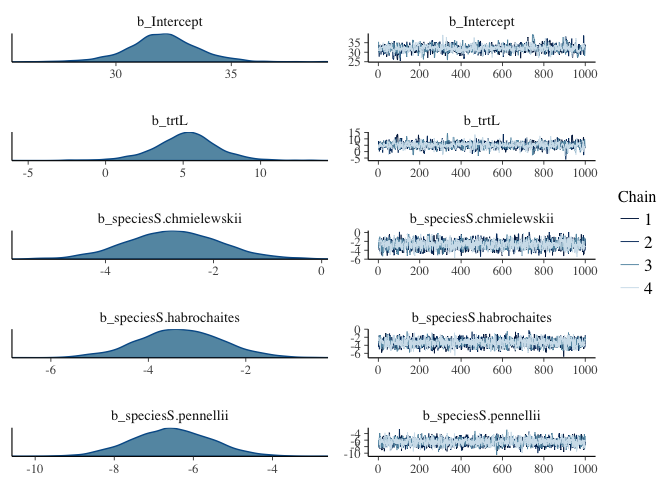
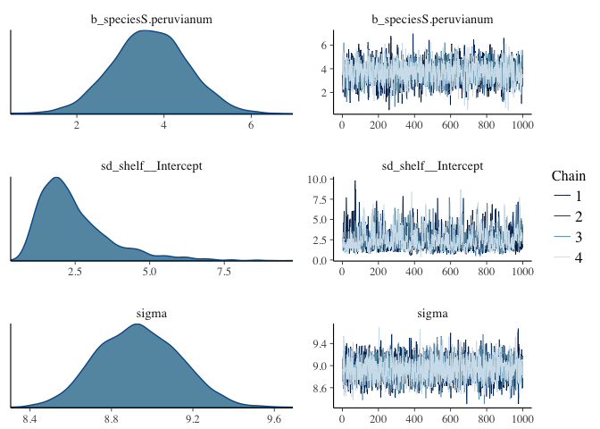
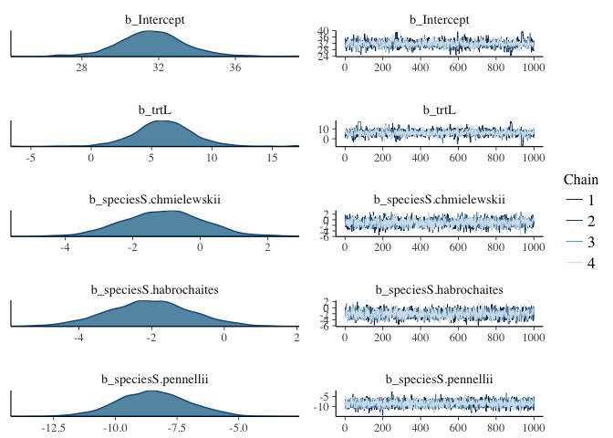
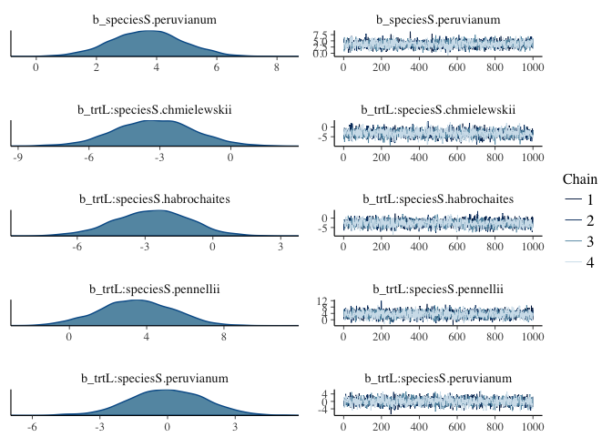
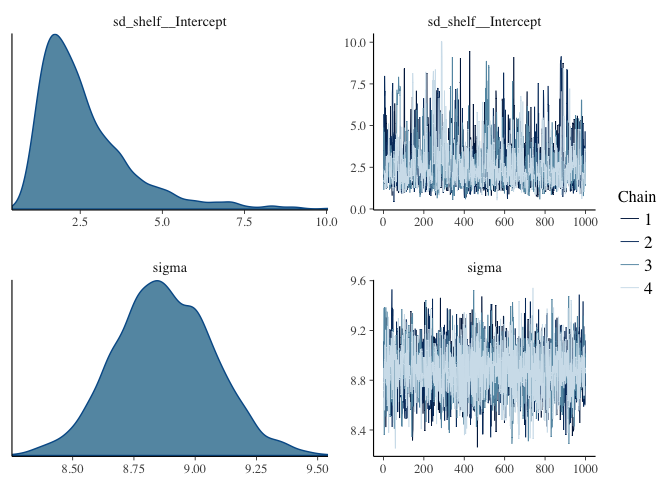
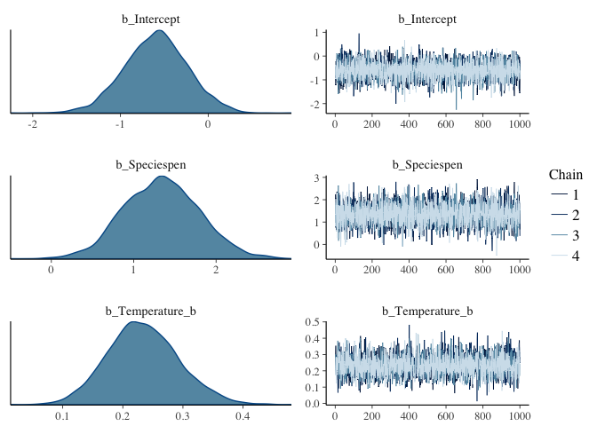
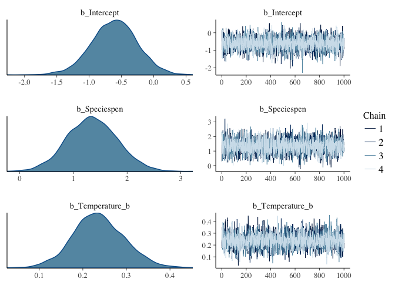
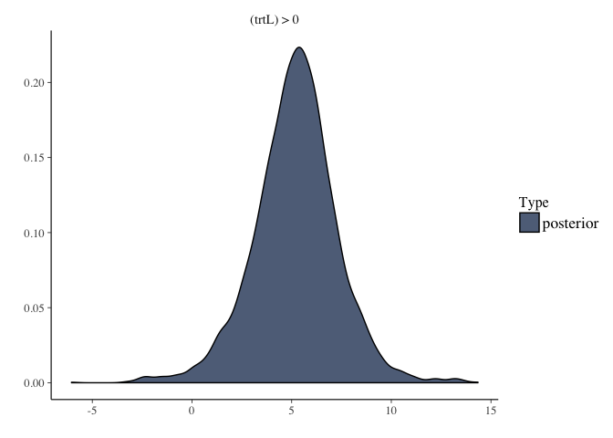
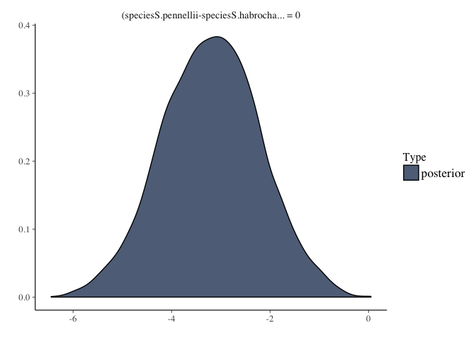

# BRMS Intro and practice


## BRMS background

This week I want to introduce [`brms`](https://github.com/paul-buerkner/brms) (Bayesian Regression Modelling using Stan) , an alternative to `map2stan` for interfacting with [`Stan`](http://mc-stan.org/).  While `map2stan` is a fantastic tool for learning model specification and being very explicit about the models being fit, `brms` has a more intuitive model specification and requires less data reformatting.  `brms` will be particularly familiar to those used to fitting models with `lmer`.

If you want to read someone else's introduction to `brms` you can do so [here](https://thinkinator.com/2016/01/12/r-users-will-now-inevitably-become-bayesians/).

You can also read the package author's README by scrolling down at the [github repo](https://github.com/paul-buerkner/brms)

Finally, the author provides a very detailed [description](https://cran.r-project.org/web/packages/brms/vignettes/brms_overview.pdf);also available by typing `vignette("brms_overview")` after you have brms installed.

## Installation

Because `brms` is in rapid development I prefer to install the most recent version from github:


```r
library(devtools)
install_github("paul-buerkner/brms")
```

(If you don't have `devtools` installed then you will first need to run `install.packages("devtools")`)

## Model specification in brms

Model specification is very similar to that in lmer, namely,

```
repsonse ~ predictor1 + (1|random_predictor2) ...
```

So to use the familiar `Tomato` dataset


```r
library(brms)
```

```
## Loading required package: Rcpp
```

```
## Warning: package 'Rcpp' was built under R version 3.3.2
```

```
## Loading required package: ggplot2
```

```
## Warning: package 'ggplot2' was built under R version 3.3.2
```

```
## Loading 'brms' package (version 1.3.1.9000). Useful instructions 
## can be found by typing help('brms'). A more detailed introduction 
## to the package is available through vignette('brms_overview').
```

```r
library(rstan)
```

```
## Warning: package 'rstan' was built under R version 3.3.2
```

```
## Loading required package: StanHeaders
```

```
## Warning: package 'StanHeaders' was built under R version 3.3.2
```

```
## rstan (Version 2.14.1, packaged: 2016-12-28 14:55:41 UTC, GitRev: 5fa1e80eb817)
```

```
## For execution on a local, multicore CPU with excess RAM we recommend calling
## rstan_options(auto_write = TRUE)
## options(mc.cores = parallel::detectCores())
```

```r
rstan_options(auto_write = TRUE)
options(mc.cores = parallel::detectCores())
tomato <- read.csv("/Users/gturco/Desktop/code/Rclub-rethinking_Gina.Turco/Assignment_Chapter_09/TomatoR2CSHL.csv") #adjust path as necesary
summary(tomato)
head(tomato)
```

Fit model hypoocytl length as function of treatment and species, and include a "random" effect for shelf.  

GT - is this the same as running just a linear model? we are not specifiying the dist now right?


```r
hyp1 <- brm(hyp ~ trt + species + (1|shelf),
            data = tomato,
            prior = set_prior("normal(0,10)",class="b") # I'll explain setting priors in the next section
) 
```

```
## Compiling the C++ model
```

```
## Start sampling
```

```
## Warning: There were 2 divergent transitions after warmup. Increasing adapt_delta above 0.8 may help. See
## http://mc-stan.org/misc/warnings.html#divergent-transitions-after-warmup
```

```
## Warning: Examine the pairs() plot to diagnose sampling problems
```

Note:

* __I did not have to create dummy variables for trt, species, or shelf !!__ 
* I did not have to specify priors for sigma or the random effects (although you can, see below)
* The default number of chains is 4

```r
summary(hyp1)
```

```
##  Family: gaussian (identity) 
## Formula: hyp ~ trt + species + (1 | shelf) 
##    Data: tomato (Number of observations: 1008) 
## Samples: 4 chains, each with iter = 2000; warmup = 1000; thin = 1; 
##          total post-warmup samples = 4000
##    WAIC: Not computed
##  
## Group-Level Effects: 
## ~shelf (Number of levels: 6) 
##               Estimate Est.Error l-95% CI u-95% CI Eff.Sample Rhat
## sd(Intercept)     2.46      1.22     0.95     5.71        920    1
## 
## Population-Level Effects: 
##                       Estimate Est.Error l-95% CI u-95% CI Eff.Sample Rhat
## Intercept                32.04      1.59    28.78    35.25       1257    1
## trtL                      5.19      2.12     0.84     9.30       1512    1
## speciesS.chmielewskii    -2.74      0.87    -4.44    -1.01       2948    1
## speciesS.habrochaites    -3.35      0.86    -5.09    -1.64       2735    1
## speciesS.pennellii       -6.54      1.00    -8.48    -4.59       3084    1
## speciesS.peruvianum       3.68      0.88     1.97     5.37       2752    1
## 
## Family Specific Parameters: 
##       Estimate Est.Error l-95% CI u-95% CI Eff.Sample Rhat
## sigma     8.93       0.2     8.55     9.33       4000    1
## 
## Samples were drawn using sampling(NUTS). For each parameter, Eff.Sample 
## is a crude measure of effective sample size, and Rhat is the potential 
## scale reduction factor on split chains (at convergence, Rhat = 1).
```

```r
plot(hyp1,ask=FALSE)
```

<!-- --><!-- -->

Note:

* __The summary automatically displays informative coefficient names__ Compare this to using a "coerced index" in rethinking.

## Interactive model viewer

Run the following for cool interactive exploration of your posteriors.  Click on the various 

```r
launch_shiny(hyp1) #interactive graphical exploration
```


## Prior specification in brms

brms will automatically set priors for many model parameters, but it uses non-sensical priors (uniform across all real numbers) for main-effect coefficients, so __you must set priors for your main-effect coefficients__.  Most other priors have reasonable defaults.

The function for setting priors is `set_priors()`.  

Priors in brms have different classes.

* The "Intercept" class is for the overall intercept
* The "b" class is for coefficients on fixed effects (You can think of "b" as standing for "beta" coefficients)
* The "sigma" class is for the overall standard deviation.  Defaults to `student_t(3, 0, 10)`
* The "sd" class is for the standard deviation of random effects terms.  Defaults to `student_t(3, 0, 10)`

If you want to give the same prior to all members of a class, then just name the class.  In the example I gave above (repeated below) I am setting the priors for all beta coefficients in this case (trtL and the various species) to be normal(0,10).


```r
hyp1 <- brm(hyp ~ trt + species + (1|shelf),
            data = tomato,
            prior = set_prior("normal(0,10)",class="b") # I'll explain priors in the next section
) 
```

Multiple `set_prior` calls can be combined using `c()`.  If you want to specify different priors for specific coefficients, then you can name them in separate `set_prior` calls:


```r
hyp2 <- brm(hyp ~ trt + species + (1|shelf),
            data = tomato,
            prior = c(set_prior("normal(0,10)",class="b"), # sets prior for all b coefficients not otherwise specified
                      set_prior("normal(0,5)",class="b", coef = "trtL")) #sets a different prior for the "trtL" coefficient
) 
```

```
## Compiling the C++ model
```

```
## Start sampling
```

```
## Warning: There were 4 divergent transitions after warmup. Increasing adapt_delta above 0.8 may help. See
## http://mc-stan.org/misc/warnings.html#divergent-transitions-after-warmup
```

```
## Warning: Examine the pairs() plot to diagnose sampling problems
```

To see all priors that you could specify for a given model and how they are specified, use `get_prior()`


```r
get_prior(hyp ~ trt + species + (1|shelf),
          data = tomato)
```

```
##                  prior     class                  coef group nlpar bound
## 1                              b                                        
## 2                              b             Intercept                  
## 3                              b speciesS.chmielewskii                  
## 4                              b speciesS.habrochaites                  
## 5                              b    speciesS.pennellii                  
## 6                              b   speciesS.peruvianum                  
## 7                              b                  trtL                  
## 8                      Intercept                                        
## 9  student_t(3, 0, 10)        sd                                        
## 10                            sd                       shelf            
## 11                            sd             Intercept shelf            
## 12 student_t(3, 0, 10)     sigma
```

For a model you have already fit you can see how the priors were set with:


```r
hyp2$prior
```

```
##                  prior class                  coef group nlpar bound
## 1         normal(0,10)     b                                        
## 2                          b speciesS.chmielewskii                  
## 3                          b speciesS.habrochaites                  
## 4                          b    speciesS.pennellii                  
## 5                          b   speciesS.peruvianum                  
## 6          normal(0,5)     b                  trtL                  
## 7  student_t(3, 0, 10)    sd                                        
## 8                         sd                       shelf            
## 9                         sd             Intercept shelf            
## 10 student_t(3, 0, 10) sigma                                        
## 11                      temp             Intercept
```


Example of setting priors similar to Statistical Rethinking:


```r
hyp3 <- brm(hyp ~ trt + species + (1|shelf),
            data = tomato,
            prior = c(
              set_prior("normal(33,10)",class="Intercept"), # prior for the intercept
              set_prior("normal(0,10)",class="b"), # sets prior for all b coefficients not otherwise specified
              set_prior("normal(0,5)",class="b", coef = "trtL"), #set prior for "trtL"
              set_prior("cauchy(0,1)", class = "sigma"), #half cauchy prior for sigma
              set_prior("normal(0,1)", class = "sd", group = "shelf") #prior for variation due to shelf
            ) 
)
```

```
## Compiling the C++ model
```

```
## Start sampling
```

More information can be found in section 4 of `vignette("brms_overview")` or by `?set_prior`

## Stan parameters

You can specify various Stan parameters similar to the way you would in map2stan:


```r
hyp4 <- brm(hyp ~ trt + species + (1|shelf),
            data = tomato,
            prior = set_prior("normal(0,10)",class="b"), 
            chains = 4, #the default anyway
            iter=4000,
            warmup = 1000,
            cores = 2
)
summary(hyp4)
plot(hyp4)
```

## Interactions

To specify interactions between predictors just replace the '+' with a '*':


```r
hyp5 <- brm(hyp ~ trt * species + (1|shelf), #trt by species interaction
            data = tomato,
            prior = set_prior("normal(0,10)",class="b"), 
)
```

```
## Compiling the C++ model
```

```
## Start sampling
```

```
## Warning: There were 2 divergent transitions after warmup. Increasing adapt_delta above 0.8 may help. See
## http://mc-stan.org/misc/warnings.html#divergent-transitions-after-warmup
```

```
## Warning: Examine the pairs() plot to diagnose sampling problems
```


```r
summary(hyp5)
```

```
##  Family: gaussian (identity) 
## Formula: hyp ~ trt * species + (1 | shelf) 
##    Data: tomato (Number of observations: 1008) 
## Samples: 4 chains, each with iter = 2000; warmup = 1000; thin = 1; 
##          total post-warmup samples = 4000
##    WAIC: Not computed
##  
## Group-Level Effects: 
## ~shelf (Number of levels: 6) 
##               Estimate Est.Error l-95% CI u-95% CI Eff.Sample Rhat
## sd(Intercept)     2.62       1.4     1.01     6.61        983    1
## 
## Population-Level Effects: 
##                            Estimate Est.Error l-95% CI u-95% CI Eff.Sample
## Intercept                     31.66      1.87    27.85    35.53       1018
## trtL                           6.01      2.65     0.82    11.19        878
## speciesS.chmielewskii         -1.08      1.21    -3.41     1.27       2129
## speciesS.habrochaites         -2.06      1.16    -4.33     0.22       2367
## speciesS.pennellii            -8.46      1.44   -11.26    -5.62       2619
## speciesS.peruvianum            3.69      1.18     1.39     5.98       2279
## trtL:speciesS.chmielewskii    -3.22      1.70    -6.62     0.13       2025
## trtL:speciesS.habrochaites    -2.68      1.64    -6.01     0.43       2123
## trtL:speciesS.pennellii        3.46      1.91    -0.37     7.13       2633
## trtL:speciesS.peruvianum       0.00      1.67    -3.28     3.23       2085
##                            Rhat
## Intercept                     1
## trtL                          1
## speciesS.chmielewskii         1
## speciesS.habrochaites         1
## speciesS.pennellii            1
## speciesS.peruvianum           1
## trtL:speciesS.chmielewskii    1
## trtL:speciesS.habrochaites    1
## trtL:speciesS.pennellii       1
## trtL:speciesS.peruvianum      1
## 
## Family Specific Parameters: 
##       Estimate Est.Error l-95% CI u-95% CI Eff.Sample Rhat
## sigma     8.88       0.2     8.49     9.27       4000    1
## 
## Samples were drawn using sampling(NUTS). For each parameter, Eff.Sample 
## is a crude measure of effective sample size, and Rhat is the potential 
## scale reduction factor on split chains (at convergence, Rhat = 1).
```

```r
plot(hyp5, ask=FALSE)
```

<!-- --><!-- --><!-- -->


## Comparing models

Models can be compared using WAIC or another procedure, leave one out cross validation, using loo:
loo stands for leave-one-out cross validation


```r
waic(hyp1,hyp5)
```

```
##                WAIC    SE
## hyp1        7286.42 57.86
## hyp5        7277.87 58.08
## hyp1 - hyp5    8.54  7.01
```

```r
loo(hyp1,hyp5)
```

```
##               LOOIC    SE
## hyp1        7286.42 57.86
## hyp5        7277.88 58.08
## hyp1 - hyp5    8.54  7.01
```

So hyp5 is favored, but not by much.

At this point I am not sure how to do the model weighting that rethinking can report when comparing models.

## Unique intercepts

In map2stan we saw how to fit models where each level of a predictor had its own intercept.  In brms including a "0" tells brms to fit a separate interecept for each level of the following predictor.

For example, if we used the default of `hyp ~ trt + species` then the intercept would correspond to the first level of trt and the first level of species.  That is, the intercept would be for speciesS.chillense in trtH.

If instead we used `hyp ~ 0 + trt + species` then there is a separate intercept for each species in trtH.


```r
hyp6 <- brm(hyp ~ species + trt,
            prior = set_prior("normal(0,10)",class="b"),
            data = tomato)
```

```
## Compiling the C++ model
```

```
## Start sampling
```

```r
hyp7 <- brm(hyp ~ 0 + species + trt,
            prior = c(
              set_prior("normal(33,10)", class = "b"), #average species height
              set_prior("normal(0,10)", class = "b", coef = "trtL")
              ),
            data=tomato)
```

```
## Compiling the C++ model
## Start sampling
```

Compare the summaries:


```r
summary(hyp6)
```

```
##  Family: gaussian (identity) 
## Formula: hyp ~ species + trt 
##    Data: tomato (Number of observations: 1008) 
## Samples: 4 chains, each with iter = 2000; warmup = 1000; thin = 1; 
##          total post-warmup samples = 4000
##    WAIC: Not computed
##  
## Population-Level Effects: 
##                       Estimate Est.Error l-95% CI u-95% CI Eff.Sample Rhat
## Intercept                32.03      0.70    30.71    33.42       2519    1
## speciesS.chmielewskii    -2.69      0.86    -4.39    -1.02       2869    1
## speciesS.habrochaites    -3.46      0.86    -5.16    -1.78       2757    1
## speciesS.pennellii       -6.13      1.01    -8.12    -4.23       3217    1
## speciesS.peruvianum       3.72      0.89     1.97     5.42       3119    1
## trtL                      5.30      0.57     4.20     6.42       3687    1
## 
## Family Specific Parameters: 
##       Estimate Est.Error l-95% CI u-95% CI Eff.Sample Rhat
## sigma     9.05       0.2     8.68     9.46       4000    1
## 
## Samples were drawn using sampling(NUTS). For each parameter, Eff.Sample 
## is a crude measure of effective sample size, and Rhat is the potential 
## scale reduction factor on split chains (at convergence, Rhat = 1).
```

```r
summary(hyp7)
```

```
##  Family: gaussian (identity) 
## Formula: hyp ~ 0 + species + trt 
##    Data: tomato (Number of observations: 1008) 
## Samples: 4 chains, each with iter = 2000; warmup = 1000; thin = 1; 
##          total post-warmup samples = 4000
##    WAIC: Not computed
##  
## Population-Level Effects: 
##                       Estimate Est.Error l-95% CI u-95% CI Eff.Sample Rhat
## speciesS.chilense        32.09      0.67    30.78    33.43       4000    1
## speciesS.chmielewskii    29.35      0.68    28.05    30.70       4000    1
## speciesS.habrochaites    28.61      0.67    27.33    29.90       4000    1
## speciesS.pennellii       25.94      0.86    24.24    27.65       4000    1
## speciesS.peruvianum      35.78      0.68    34.44    37.07       4000    1
## trtL                      5.28      0.57     4.14     6.35       2956    1
## 
## Family Specific Parameters: 
##       Estimate Est.Error l-95% CI u-95% CI Eff.Sample Rhat
## sigma     9.05       0.2     8.67     9.45       4000    1
## 
## Samples were drawn using sampling(NUTS). For each parameter, Eff.Sample 
## is a crude measure of effective sample size, and Rhat is the potential 
## scale reduction factor on split chains (at convergence, Rhat = 1).
```

```r
loo(hyp6,hyp7)
```

```
##               LOOIC    SE
## hyp6        7309.17 57.51
## hyp7        7309.08 57.48
## hyp6 - hyp7    0.10  0.21
```


## Binomial and other models

To specify a non-Gaussian model use the `family` parameter in your call to brm.  I will illustrate with Liron's germination data.


```r
germination <- read.csv("../Assignment_Chapter_10/LironDataTime1.csv")
summary(germination)
head(germination)
germination$Germination2 <- ifelse(germination$Germination=="Yes",1,0) #need numeric response
germination$Temperature_b <- germination$Temperature - min(germination$Temperature) #baseline it
```

The `trials(1)` in the formula below indicates how many trials per row in the data frame.  Instead of a numeric this could also refer to a column in the data frame (if a column specified the number of trials represented in each row).


```r
germ1 <- brm(Germination2 | trials(1) ~ Species + Temperature_b,
             family = "binomial",
             prior=set_prior("normal(0,10)", class="b"),
             data = germination
             )
```

```
## Only 2 levels detected so that family 'bernoulli' might be a more efficient choice.
```

```
## Compiling the C++ model
```

```
## Start sampling
```

```
## Only 2 levels detected so that family 'bernoulli' might be a more efficient choice.
```


```r
summary(germ1)
```

```
##  Family: binomial (logit) 
## Formula: Germination2 | trials(1) ~ Species + Temperature_b 
##    Data: germination (Number of observations: 120) 
## Samples: 4 chains, each with iter = 2000; warmup = 1000; thin = 1; 
##          total post-warmup samples = 4000
##    WAIC: Not computed
##  
## Population-Level Effects: 
##               Estimate Est.Error l-95% CI u-95% CI Eff.Sample Rhat
## Intercept        -0.60      0.36    -1.29     0.10       4000    1
## Speciespen        1.34      0.46     0.46     2.26       4000    1
## Temperature_b     0.23      0.06     0.12     0.35       4000    1
## 
## Samples were drawn using sampling(NUTS). For each parameter, Eff.Sample 
## is a crude measure of effective sample size, and Rhat is the potential 
## scale reduction factor on split chains (at convergence, Rhat = 1).
```

```r
plot(germ1, ask=FALSE)
```

<!-- -->

Note: __I did not have to specify the link function__, `logit` is automatically used as a link function.

Available families (and their link functions) are described by typing `?family` and `?brmsfamily`

You will note that there was a message that "that family 'bernoulli' might be a more efficient choice."  The Bernoulli family is specific for binomial problems where each row of data corresponds to a single trial, so in this case we could have used the code below, which indeed does run faster.


```r
germ2 <- brm(Germination2  ~ Species + Temperature_b,
             family = "bernoulli",
             prior=set_prior("normal(0,10)", class="b"),
             data = germination
             )
```

```
## Compiling the C++ model
```

```
## Start sampling
```


```r
summary(germ2)
```

```
##  Family: bernoulli (logit) 
## Formula: Germination2 ~ Species + Temperature_b 
##    Data: germination (Number of observations: 120) 
## Samples: 4 chains, each with iter = 2000; warmup = 1000; thin = 1; 
##          total post-warmup samples = 4000
##    WAIC: Not computed
##  
## Population-Level Effects: 
##               Estimate Est.Error l-95% CI u-95% CI Eff.Sample Rhat
## Intercept        -0.61      0.35    -1.32     0.08       4000    1
## Speciespen        1.35      0.47     0.45     2.27       4000    1
## Temperature_b     0.24      0.06     0.12     0.36       3757    1
## 
## Samples were drawn using sampling(NUTS). For each parameter, Eff.Sample 
## is a crude measure of effective sample size, and Rhat is the potential 
## scale reduction factor on split chains (at convergence, Rhat = 1).
```

```r
plot(germ2,ask=FALSE)
```

<!-- -->

## Hypothesis testing

brms includes a function for Bayesian hypothesis testing.  See below for an example of how to test if the effect of "trtL" is non-zero (two-sided hypothesis test).  Plotting the hypothesis test shows the relevant posterior distributions.


```r
summary(hyp1)
```

```
##  Family: gaussian (identity) 
## Formula: hyp ~ trt + species + (1 | shelf) 
##    Data: tomato (Number of observations: 1008) 
## Samples: 4 chains, each with iter = 2000; warmup = 1000; thin = 1; 
##          total post-warmup samples = 4000
##    WAIC: Not computed
##  
## Group-Level Effects: 
## ~shelf (Number of levels: 6) 
##               Estimate Est.Error l-95% CI u-95% CI Eff.Sample Rhat
## sd(Intercept)     2.46      1.22     0.95     5.71        920    1
## 
## Population-Level Effects: 
##                       Estimate Est.Error l-95% CI u-95% CI Eff.Sample Rhat
## Intercept                32.04      1.59    28.78    35.25       1257    1
## trtL                      5.19      2.12     0.84     9.30       1512    1
## speciesS.chmielewskii    -2.74      0.87    -4.44    -1.01       2948    1
## speciesS.habrochaites    -3.35      0.86    -5.09    -1.64       2735    1
## speciesS.pennellii       -6.54      1.00    -8.48    -4.59       3084    1
## speciesS.peruvianum       3.68      0.88     1.97     5.37       2752    1
## 
## Family Specific Parameters: 
##       Estimate Est.Error l-95% CI u-95% CI Eff.Sample Rhat
## sigma     8.93       0.2     8.55     9.33       4000    1
## 
## Samples were drawn using sampling(NUTS). For each parameter, Eff.Sample 
## is a crude measure of effective sample size, and Rhat is the potential 
## scale reduction factor on split chains (at convergence, Rhat = 1).
```

```r
hypothesis(hyp1,"trtL = 0")
```

```
## Hypothesis Tests for class b:
##            Estimate Est.Error l-95% CI u-95% CI Evid.Ratio  
## (trtL) = 0     5.19      2.12     0.84      9.3         NA *
## ---
## '*': The expected value under the hypothesis lies outside the 95% CI.
```

```r
plot(hypothesis(hyp1,"trtL = 0"))
```

<!-- -->

To test if the effect of "trtL" is positive (one-sided hypothesis test):


```r
summary(hyp1)
```

```
##  Family: gaussian (identity) 
## Formula: hyp ~ trt + species + (1 | shelf) 
##    Data: tomato (Number of observations: 1008) 
## Samples: 4 chains, each with iter = 2000; warmup = 1000; thin = 1; 
##          total post-warmup samples = 4000
##    WAIC: Not computed
##  
## Group-Level Effects: 
## ~shelf (Number of levels: 6) 
##               Estimate Est.Error l-95% CI u-95% CI Eff.Sample Rhat
## sd(Intercept)     2.46      1.22     0.95     5.71        920    1
## 
## Population-Level Effects: 
##                       Estimate Est.Error l-95% CI u-95% CI Eff.Sample Rhat
## Intercept                32.04      1.59    28.78    35.25       1257    1
## trtL                      5.19      2.12     0.84     9.30       1512    1
## speciesS.chmielewskii    -2.74      0.87    -4.44    -1.01       2948    1
## speciesS.habrochaites    -3.35      0.86    -5.09    -1.64       2735    1
## speciesS.pennellii       -6.54      1.00    -8.48    -4.59       3084    1
## speciesS.peruvianum       3.68      0.88     1.97     5.37       2752    1
## 
## Family Specific Parameters: 
##       Estimate Est.Error l-95% CI u-95% CI Eff.Sample Rhat
## sigma     8.93       0.2     8.55     9.33       4000    1
## 
## Samples were drawn using sampling(NUTS). For each parameter, Eff.Sample 
## is a crude measure of effective sample size, and Rhat is the potential 
## scale reduction factor on split chains (at convergence, Rhat = 1).
```

```r
hypothesis(hyp1,"trtL > 0")
```

```
## Hypothesis Tests for class b:
##            Estimate Est.Error l-95% CI u-95% CI Evid.Ratio  
## (trtL) > 0     5.19      2.12     1.66      Inf      71.73 *
## ---
## '*': The expected value under the hypothesis lies outside the 95% CI.
```

```r
plot(hypothesis(hyp1,"trtL > 0"))
```

<!-- -->

To test if the coefficients for S.pennellii and S.habrochaites are different:


```r
hypothesis(hyp1, "speciesS.pennellii-speciesS.habrochaites = 0")
```

```
## Hypothesis Tests for class b:
##                          Estimate Est.Error l-95% CI u-95% CI Evid.Ratio  
## (speciesS.pennell... = 0     -3.2      0.99    -5.17    -1.26         NA *
## ---
## '*': The expected value under the hypothesis lies outside the 95% CI.
```

```r
plot(hypothesis(hyp1, "speciesS.pennellii-speciesS.habrochaites = 0"))
```

<!-- -->

# Exercises

To gain familiarity with `brms` I am going to have you refit models from Statistical Rethinking with brms.  In all cases compare the brms and map2stan parameter estimates; they should be effectively the same if you have specified them correctly.

## Q1

Fit model 10.9 (R code 10.28) with brms.  Remember that you should not need to transform the predictors, create dummy variables, nor coerce indexes to use brms.  Compare to the map2stan fit.  Test whether the coefficient for gender is different from 0 in the brms model.  

### map2stan model


```r
library(rethinking)
```

```
## Loading required package: parallel
```

```
## rethinking (Version 1.59)
```

```
## 
## Attaching package: 'rethinking'
```

```
## The following objects are masked from 'package:brms':
## 
##     LOO, stancode, WAIC
```

```r
data(UCBadmit)
d <- UCBadmit

d$male <- ifelse( d$applicant.gender=="male" , 1 , 0 )
d$dept_id <- coerce_index( d$dept )

m10.9 <- map(
    alist(
        admit ~ dbinom( applications , p ) ,
        logit(p) <- a[dept_id] + bm*male ,
        a[dept_id] ~ dnorm(0,10) ,
        bm ~ dnorm(0,10)
) , data=d, method="Nelder-Mead" )
```

```
## Caution, model may not have converged.
```

```
## Code 1: Maximum iterations reached.
```

```r
m10.9stan <- map2stan( m10.9 , chains=2 , iter=2500 , warmup=500 )
```

```
## Warning: Variable 'applicant.gender' contains dots '.'.
## Will attempt to remove dots internally.
```

```
## In file included from filea5a8691bac3a.cpp:8:
## In file included from /Library/Frameworks/R.framework/Versions/3.3/Resources/library/StanHeaders/include/src/stan/model/model_header.hpp:4:
## In file included from /Library/Frameworks/R.framework/Versions/3.3/Resources/library/StanHeaders/include/stan/math.hpp:4:
## In file included from /Library/Frameworks/R.framework/Versions/3.3/Resources/library/StanHeaders/include/stan/math/rev/mat.hpp:4:
## In file included from /Library/Frameworks/R.framework/Versions/3.3/Resources/library/StanHeaders/include/stan/math/rev/core.hpp:12:
## In file included from /Library/Frameworks/R.framework/Versions/3.3/Resources/library/StanHeaders/include/stan/math/rev/core/gevv_vvv_vari.hpp:5:
## In file included from /Library/Frameworks/R.framework/Versions/3.3/Resources/library/StanHeaders/include/stan/math/rev/core/var.hpp:7:
## In file included from /Library/Frameworks/R.framework/Versions/3.3/Resources/library/BH/include/boost/math/tools/config.hpp:13:
## In file included from /Library/Frameworks/R.framework/Versions/3.3/Resources/library/BH/include/boost/config.hpp:39:
## /Library/Frameworks/R.framework/Versions/3.3/Resources/library/BH/include/boost/config/compiler/clang.hpp:196:11: warning: 'BOOST_NO_CXX11_RVALUE_REFERENCES' macro redefined [-Wmacro-redefined]
## #  define BOOST_NO_CXX11_RVALUE_REFERENCES
##           ^
## <command line>:6:9: note: previous definition is here
## #define BOOST_NO_CXX11_RVALUE_REFERENCES 1
##         ^
## In file included from filea5a8691bac3a.cpp:8:
## In file included from /Library/Frameworks/R.framework/Versions/3.3/Resources/library/StanHeaders/include/src/stan/model/model_header.hpp:4:
## In file included from /Library/Frameworks/R.framework/Versions/3.3/Resources/library/StanHeaders/include/stan/math.hpp:4:
## In file included from /Library/Frameworks/R.framework/Versions/3.3/Resources/library/StanHeaders/include/stan/math/rev/mat.hpp:4:
## In file included from /Library/Frameworks/R.framework/Versions/3.3/Resources/library/StanHeaders/include/stan/math/rev/core.hpp:42:
## /Library/Frameworks/R.framework/Versions/3.3/Resources/library/StanHeaders/include/stan/math/rev/core/set_zero_all_adjoints.hpp:14:17: warning: unused function 'set_zero_all_adjoints' [-Wunused-function]
##     static void set_zero_all_adjoints() {
##                 ^
## In file included from filea5a8691bac3a.cpp:8:
## In file included from /Library/Frameworks/R.framework/Versions/3.3/Resources/library/StanHeaders/include/src/stan/model/model_header.hpp:4:
## In file included from /Library/Frameworks/R.framework/Versions/3.3/Resources/library/StanHeaders/include/stan/math.hpp:4:
## In file included from /Library/Frameworks/R.framework/Versions/3.3/Resources/library/StanHeaders/include/stan/math/rev/mat.hpp:4:
## In file included from /Library/Frameworks/R.framework/Versions/3.3/Resources/library/StanHeaders/include/stan/math/rev/core.hpp:43:
## /Library/Frameworks/R.framework/Versions/3.3/Resources/library/StanHeaders/include/stan/math/rev/core/set_zero_all_adjoints_nested.hpp:17:17: warning: 'static' function 'set_zero_all_adjoints_nested' declared in header file should be declared 'static inline' [-Wunneeded-internal-declaration]
##     static void set_zero_all_adjoints_nested() {
##                 ^
## In file included from filea5a8691bac3a.cpp:8:
## In file included from /Library/Frameworks/R.framework/Versions/3.3/Resources/library/StanHeaders/include/src/stan/model/model_header.hpp:4:
## In file included from /Library/Frameworks/R.framework/Versions/3.3/Resources/library/StanHeaders/include/stan/math.hpp:4:
## In file included from /Library/Frameworks/R.framework/Versions/3.3/Resources/library/StanHeaders/include/stan/math/rev/mat.hpp:11:
## In file included from /Library/Frameworks/R.framework/Versions/3.3/Resources/library/StanHeaders/include/stan/math/prim/mat.hpp:60:
## /Library/Frameworks/R.framework/Versions/3.3/Resources/library/StanHeaders/include/stan/math/prim/mat/fun/autocorrelation.hpp:17:14: warning: function 'fft_next_good_size' is not needed and will not be emitted [-Wunneeded-internal-declaration]
##       size_t fft_next_good_size(size_t N) {
##              ^
## In file included from filea5a8691bac3a.cpp:8:
## In file included from /Library/Frameworks/R.framework/Versions/3.3/Resources/library/StanHeaders/include/src/stan/model/model_header.hpp:4:
## In file included from /Library/Frameworks/R.framework/Versions/3.3/Resources/library/StanHeaders/include/stan/math.hpp:4:
## In file included from /Library/Frameworks/R.framework/Versions/3.3/Resources/library/StanHeaders/include/stan/math/rev/mat.hpp:11:
## In file included from /Library/Frameworks/R.framework/Versions/3.3/Resources/library/StanHeaders/include/stan/math/prim/mat.hpp:299:
## In file included from /Library/Frameworks/R.framework/Versions/3.3/Resources/library/StanHeaders/include/stan/math/prim/arr.hpp:36:
## In file included from /Library/Frameworks/R.framework/Versions/3.3/Resources/library/StanHeaders/include/stan/math/prim/arr/functor/integrate_ode_rk45.hpp:13:
## In file included from /Library/Frameworks/R.framework/Versions/3.3/Resources/library/BH/include/boost/numeric/odeint.hpp:61:
## In file included from /Library/Frameworks/R.framework/Versions/3.3/Resources/library/BH/include/boost/numeric/odeint/util/multi_array_adaption.hpp:29:
## In file included from /Library/Frameworks/R.framework/Versions/3.3/Resources/library/BH/include/boost/multi_array.hpp:21:
## In file included from /Library/Frameworks/R.framework/Versions/3.3/Resources/library/BH/include/boost/multi_array/base.hpp:28:
## /Library/Frameworks/R.framework/Versions/3.3/Resources/library/BH/include/boost/multi_array/concept_checks.hpp:42:43: warning: unused typedef 'index_range' [-Wunused-local-typedef]
##       typedef typename Array::index_range index_range;
##                                           ^
## /Library/Frameworks/R.framework/Versions/3.3/Resources/library/BH/include/boost/multi_array/concept_checks.hpp:43:37: warning: unused typedef 'index' [-Wunused-local-typedef]
##       typedef typename Array::index index;
##                                     ^
## /Library/Frameworks/R.framework/Versions/3.3/Resources/library/BH/include/boost/multi_array/concept_checks.hpp:53:43: warning: unused typedef 'index_range' [-Wunused-local-typedef]
##       typedef typename Array::index_range index_range;
##                                           ^
## /Library/Frameworks/R.framework/Versions/3.3/Resources/library/BH/include/boost/multi_array/concept_checks.hpp:54:37: warning: unused typedef 'index' [-Wunused-local-typedef]
##       typedef typename Array::index index;
##                                     ^
## 8 warnings generated.
## 
## SAMPLING FOR MODEL 'admit ~ dbinom(applications, p)' NOW (CHAIN 1).
## 
## Chain 1, Iteration:    1 / 2500 [  0%]  (Warmup)
## Chain 1, Iteration:  250 / 2500 [ 10%]  (Warmup)
## Chain 1, Iteration:  500 / 2500 [ 20%]  (Warmup)
## Chain 1, Iteration:  501 / 2500 [ 20%]  (Sampling)
## Chain 1, Iteration:  750 / 2500 [ 30%]  (Sampling)
## Chain 1, Iteration: 1000 / 2500 [ 40%]  (Sampling)
## Chain 1, Iteration: 1250 / 2500 [ 50%]  (Sampling)
## Chain 1, Iteration: 1500 / 2500 [ 60%]  (Sampling)
## Chain 1, Iteration: 1750 / 2500 [ 70%]  (Sampling)
## Chain 1, Iteration: 2000 / 2500 [ 80%]  (Sampling)
## Chain 1, Iteration: 2250 / 2500 [ 90%]  (Sampling)
## Chain 1, Iteration: 2500 / 2500 [100%]  (Sampling)
##  Elapsed Time: 0.037971 seconds (Warm-up)
##                0.113075 seconds (Sampling)
##                0.151046 seconds (Total)
## 
## 
## SAMPLING FOR MODEL 'admit ~ dbinom(applications, p)' NOW (CHAIN 2).
## 
## Chain 2, Iteration:    1 / 2500 [  0%]  (Warmup)
## Chain 2, Iteration:  250 / 2500 [ 10%]  (Warmup)
## Chain 2, Iteration:  500 / 2500 [ 20%]  (Warmup)
## Chain 2, Iteration:  501 / 2500 [ 20%]  (Sampling)
## Chain 2, Iteration:  750 / 2500 [ 30%]  (Sampling)
## Chain 2, Iteration: 1000 / 2500 [ 40%]  (Sampling)
## Chain 2, Iteration: 1250 / 2500 [ 50%]  (Sampling)
## Chain 2, Iteration: 1500 / 2500 [ 60%]  (Sampling)
## Chain 2, Iteration: 1750 / 2500 [ 70%]  (Sampling)
## Chain 2, Iteration: 2000 / 2500 [ 80%]  (Sampling)
## Chain 2, Iteration: 2250 / 2500 [ 90%]  (Sampling)
## Chain 2, Iteration: 2500 / 2500 [100%]  (Sampling)
##  Elapsed Time: 0.028995 seconds (Warm-up)
##                0.109904 seconds (Sampling)
##                0.138899 seconds (Total)
## 
## 
## SAMPLING FOR MODEL 'admit ~ dbinom(applications, p)' NOW (CHAIN 1).
## WARNING: No variance estimation is
##          performed for num_warmup < 20
## 
## 
## Chain 1, Iteration: 1 / 1 [100%]  (Sampling)
##  Elapsed Time: 2e-06 seconds (Warm-up)
##                3.5e-05 seconds (Sampling)
##                3.7e-05 seconds (Total)
```

```
## Computing WAIC
```

```
## Constructing posterior predictions
```

```
## [ 400 / 4000 ]
[ 800 / 4000 ]
[ 1200 / 4000 ]
[ 1600 / 4000 ]
[ 2000 / 4000 ]
[ 2400 / 4000 ]
[ 2800 / 4000 ]
[ 3200 / 4000 ]
[ 3600 / 4000 ]
[ 4000 / 4000 ]
```

```
## Aggregated binomial counts detected. Splitting to 0/1 outcome for WAIC calculation.
```

### bmrs model


```r
## why do u need to give intercept of zero here?

m10.9bmr <- brm(admit | trials(applications) ~ 0 + dept + applicant.gender,
             family = "binomial",
             prior=set_prior("normal(0,10)", class="b"),
             data = d
             )
```

```
## Compiling the C++ model
```

```
## Start sampling
```

### compare coefficient for gender


```r
precis(m10.9stan,depth=2)
```

```
##       Mean StdDev lower 0.89 upper 0.89 n_eff Rhat
## a[1]  0.68   0.10       0.52       0.84  2138    1
## a[2]  0.64   0.12       0.45       0.82  2428    1
## a[3] -0.58   0.08      -0.70      -0.46  4000    1
## a[4] -0.61   0.09      -0.75      -0.48  2894    1
## a[5] -1.06   0.10      -1.22      -0.89  4000    1
## a[6] -2.63   0.16      -2.90      -2.40  4000    1
## bm   -0.10   0.08      -0.23       0.03  1815    1
```

```r
summary(m10.9bmr)
```

```
##  Family: binomial (logit) 
## Formula: admit | trials(applications) ~ 0 + dept + applicant.gender 
##    Data: d (Number of observations: 12) 
## Samples: 4 chains, each with iter = 2000; warmup = 1000; thin = 1; 
##          total post-warmup samples = 4000
##    WAIC: Not computed
##  
## Population-Level Effects: 
##                      Estimate Est.Error l-95% CI u-95% CI Eff.Sample Rhat
## deptA                    0.68      0.10     0.48     0.88       2619    1
## deptB                    0.64      0.12     0.41     0.87       2528    1
## deptC                   -0.58      0.07    -0.73    -0.44       4000    1
## deptD                   -0.62      0.09    -0.79    -0.45       4000    1
## deptE                   -1.06      0.10    -1.25    -0.87       4000    1
## deptF                   -2.64      0.16    -2.95    -2.34       4000    1
## applicant.gendermale    -0.10      0.08    -0.25     0.06       2106    1
## 
## Samples were drawn using sampling(NUTS). For each parameter, Eff.Sample 
## is a crude measure of effective sample size, and Rhat is the potential 
## scale reduction factor on split chains (at convergence, Rhat = 1).
```

the two models have thr same coefficients!

## Q2

Refit models 12.1 and 12.2 (Rcode 12.2 and 12.3) with brms

### stan code


```r
data(reedfrogs)
d <- reedfrogs
# make the tank cluster variable
d$tank <- 1:nrow(d)
# fit
m12.1 <- map2stan(
    alist(
        surv ~ dbinom( density , p ) ,
        logit(p) <- a_tank[tank] ,
        a_tank[tank] ~ dnorm( 0 , 5 )
), data=d )
```

```
## In file included from filea5a859a79bae.cpp:8:
## In file included from /Library/Frameworks/R.framework/Versions/3.3/Resources/library/StanHeaders/include/src/stan/model/model_header.hpp:4:
## In file included from /Library/Frameworks/R.framework/Versions/3.3/Resources/library/StanHeaders/include/stan/math.hpp:4:
## In file included from /Library/Frameworks/R.framework/Versions/3.3/Resources/library/StanHeaders/include/stan/math/rev/mat.hpp:4:
## In file included from /Library/Frameworks/R.framework/Versions/3.3/Resources/library/StanHeaders/include/stan/math/rev/core.hpp:12:
## In file included from /Library/Frameworks/R.framework/Versions/3.3/Resources/library/StanHeaders/include/stan/math/rev/core/gevv_vvv_vari.hpp:5:
## In file included from /Library/Frameworks/R.framework/Versions/3.3/Resources/library/StanHeaders/include/stan/math/rev/core/var.hpp:7:
## In file included from /Library/Frameworks/R.framework/Versions/3.3/Resources/library/BH/include/boost/math/tools/config.hpp:13:
## In file included from /Library/Frameworks/R.framework/Versions/3.3/Resources/library/BH/include/boost/config.hpp:39:
## /Library/Frameworks/R.framework/Versions/3.3/Resources/library/BH/include/boost/config/compiler/clang.hpp:196:11: warning: 'BOOST_NO_CXX11_RVALUE_REFERENCES' macro redefined [-Wmacro-redefined]
## #  define BOOST_NO_CXX11_RVALUE_REFERENCES
##           ^
## <command line>:6:9: note: previous definition is here
## #define BOOST_NO_CXX11_RVALUE_REFERENCES 1
##         ^
## In file included from filea5a859a79bae.cpp:8:
## In file included from /Library/Frameworks/R.framework/Versions/3.3/Resources/library/StanHeaders/include/src/stan/model/model_header.hpp:4:
## In file included from /Library/Frameworks/R.framework/Versions/3.3/Resources/library/StanHeaders/include/stan/math.hpp:4:
## In file included from /Library/Frameworks/R.framework/Versions/3.3/Resources/library/StanHeaders/include/stan/math/rev/mat.hpp:4:
## In file included from /Library/Frameworks/R.framework/Versions/3.3/Resources/library/StanHeaders/include/stan/math/rev/core.hpp:42:
## /Library/Frameworks/R.framework/Versions/3.3/Resources/library/StanHeaders/include/stan/math/rev/core/set_zero_all_adjoints.hpp:14:17: warning: unused function 'set_zero_all_adjoints' [-Wunused-function]
##     static void set_zero_all_adjoints() {
##                 ^
## In file included from filea5a859a79bae.cpp:8:
## In file included from /Library/Frameworks/R.framework/Versions/3.3/Resources/library/StanHeaders/include/src/stan/model/model_header.hpp:4:
## In file included from /Library/Frameworks/R.framework/Versions/3.3/Resources/library/StanHeaders/include/stan/math.hpp:4:
## In file included from /Library/Frameworks/R.framework/Versions/3.3/Resources/library/StanHeaders/include/stan/math/rev/mat.hpp:4:
## In file included from /Library/Frameworks/R.framework/Versions/3.3/Resources/library/StanHeaders/include/stan/math/rev/core.hpp:43:
## /Library/Frameworks/R.framework/Versions/3.3/Resources/library/StanHeaders/include/stan/math/rev/core/set_zero_all_adjoints_nested.hpp:17:17: warning: 'static' function 'set_zero_all_adjoints_nested' declared in header file should be declared 'static inline' [-Wunneeded-internal-declaration]
##     static void set_zero_all_adjoints_nested() {
##                 ^
## In file included from filea5a859a79bae.cpp:8:
## In file included from /Library/Frameworks/R.framework/Versions/3.3/Resources/library/StanHeaders/include/src/stan/model/model_header.hpp:4:
## In file included from /Library/Frameworks/R.framework/Versions/3.3/Resources/library/StanHeaders/include/stan/math.hpp:4:
## In file included from /Library/Frameworks/R.framework/Versions/3.3/Resources/library/StanHeaders/include/stan/math/rev/mat.hpp:11:
## In file included from /Library/Frameworks/R.framework/Versions/3.3/Resources/library/StanHeaders/include/stan/math/prim/mat.hpp:60:
## /Library/Frameworks/R.framework/Versions/3.3/Resources/library/StanHeaders/include/stan/math/prim/mat/fun/autocorrelation.hpp:17:14: warning: function 'fft_next_good_size' is not needed and will not be emitted [-Wunneeded-internal-declaration]
##       size_t fft_next_good_size(size_t N) {
##              ^
## In file included from filea5a859a79bae.cpp:8:
## In file included from /Library/Frameworks/R.framework/Versions/3.3/Resources/library/StanHeaders/include/src/stan/model/model_header.hpp:4:
## In file included from /Library/Frameworks/R.framework/Versions/3.3/Resources/library/StanHeaders/include/stan/math.hpp:4:
## In file included from /Library/Frameworks/R.framework/Versions/3.3/Resources/library/StanHeaders/include/stan/math/rev/mat.hpp:11:
## In file included from /Library/Frameworks/R.framework/Versions/3.3/Resources/library/StanHeaders/include/stan/math/prim/mat.hpp:299:
## In file included from /Library/Frameworks/R.framework/Versions/3.3/Resources/library/StanHeaders/include/stan/math/prim/arr.hpp:36:
## In file included from /Library/Frameworks/R.framework/Versions/3.3/Resources/library/StanHeaders/include/stan/math/prim/arr/functor/integrate_ode_rk45.hpp:13:
## In file included from /Library/Frameworks/R.framework/Versions/3.3/Resources/library/BH/include/boost/numeric/odeint.hpp:61:
## In file included from /Library/Frameworks/R.framework/Versions/3.3/Resources/library/BH/include/boost/numeric/odeint/util/multi_array_adaption.hpp:29:
## In file included from /Library/Frameworks/R.framework/Versions/3.3/Resources/library/BH/include/boost/multi_array.hpp:21:
## In file included from /Library/Frameworks/R.framework/Versions/3.3/Resources/library/BH/include/boost/multi_array/base.hpp:28:
## /Library/Frameworks/R.framework/Versions/3.3/Resources/library/BH/include/boost/multi_array/concept_checks.hpp:42:43: warning: unused typedef 'index_range' [-Wunused-local-typedef]
##       typedef typename Array::index_range index_range;
##                                           ^
## /Library/Frameworks/R.framework/Versions/3.3/Resources/library/BH/include/boost/multi_array/concept_checks.hpp:43:37: warning: unused typedef 'index' [-Wunused-local-typedef]
##       typedef typename Array::index index;
##                                     ^
## /Library/Frameworks/R.framework/Versions/3.3/Resources/library/BH/include/boost/multi_array/concept_checks.hpp:53:43: warning: unused typedef 'index_range' [-Wunused-local-typedef]
##       typedef typename Array::index_range index_range;
##                                           ^
## /Library/Frameworks/R.framework/Versions/3.3/Resources/library/BH/include/boost/multi_array/concept_checks.hpp:54:37: warning: unused typedef 'index' [-Wunused-local-typedef]
##       typedef typename Array::index index;
##                                     ^
## 8 warnings generated.
## 
## SAMPLING FOR MODEL 'surv ~ dbinom(density, p)' NOW (CHAIN 1).
## 
## Chain 1, Iteration:    1 / 2000 [  0%]  (Warmup)
## Chain 1, Iteration:  200 / 2000 [ 10%]  (Warmup)
## Chain 1, Iteration:  400 / 2000 [ 20%]  (Warmup)
## Chain 1, Iteration:  600 / 2000 [ 30%]  (Warmup)
## Chain 1, Iteration:  800 / 2000 [ 40%]  (Warmup)
## Chain 1, Iteration: 1000 / 2000 [ 50%]  (Warmup)
## Chain 1, Iteration: 1001 / 2000 [ 50%]  (Sampling)
## Chain 1, Iteration: 1200 / 2000 [ 60%]  (Sampling)
## Chain 1, Iteration: 1400 / 2000 [ 70%]  (Sampling)
## Chain 1, Iteration: 1600 / 2000 [ 80%]  (Sampling)
## Chain 1, Iteration: 1800 / 2000 [ 90%]  (Sampling)
## Chain 1, Iteration: 2000 / 2000 [100%]  (Sampling)
##  Elapsed Time: 0.217979 seconds (Warm-up)
##                0.207277 seconds (Sampling)
##                0.425256 seconds (Total)
## 
## 
## SAMPLING FOR MODEL 'surv ~ dbinom(density, p)' NOW (CHAIN 1).
## WARNING: No variance estimation is
##          performed for num_warmup < 20
## 
## 
## Chain 1, Iteration: 1 / 1 [100%]  (Sampling)
##  Elapsed Time: 4e-06 seconds (Warm-up)
##                0.000201 seconds (Sampling)
##                0.000205 seconds (Total)
```

```
## Computing WAIC
```

```
## Constructing posterior predictions
```

```
## [ 100 / 1000 ]
[ 200 / 1000 ]
[ 300 / 1000 ]
[ 400 / 1000 ]
[ 500 / 1000 ]
[ 600 / 1000 ]
[ 700 / 1000 ]
[ 800 / 1000 ]
[ 900 / 1000 ]
[ 1000 / 1000 ]
```

```
## Aggregated binomial counts detected. Splitting to 0/1 outcome for WAIC calculation.
```

```r
m12.2 <- map2stan(
    alist(
        surv ~ dbinom( density , p ) ,
        logit(p) <- a_tank[tank] ,
        a_tank[tank] ~ dnorm( a , sigma ) ,
        a ~ dnorm(0,1) ,
        sigma ~ dcauchy(0,1)
    ), data=d , iter=4000 , chains=4 )
```

```
## In file included from filea5a8b784dc3.cpp:8:
## In file included from /Library/Frameworks/R.framework/Versions/3.3/Resources/library/StanHeaders/include/src/stan/model/model_header.hpp:4:
## In file included from /Library/Frameworks/R.framework/Versions/3.3/Resources/library/StanHeaders/include/stan/math.hpp:4:
## In file included from /Library/Frameworks/R.framework/Versions/3.3/Resources/library/StanHeaders/include/stan/math/rev/mat.hpp:4:
## In file included from /Library/Frameworks/R.framework/Versions/3.3/Resources/library/StanHeaders/include/stan/math/rev/core.hpp:12:
## In file included from /Library/Frameworks/R.framework/Versions/3.3/Resources/library/StanHeaders/include/stan/math/rev/core/gevv_vvv_vari.hpp:5:
## In file included from /Library/Frameworks/R.framework/Versions/3.3/Resources/library/StanHeaders/include/stan/math/rev/core/var.hpp:7:
## In file included from /Library/Frameworks/R.framework/Versions/3.3/Resources/library/BH/include/boost/math/tools/config.hpp:13:
## In file included from /Library/Frameworks/R.framework/Versions/3.3/Resources/library/BH/include/boost/config.hpp:39:
## /Library/Frameworks/R.framework/Versions/3.3/Resources/library/BH/include/boost/config/compiler/clang.hpp:196:11: warning: 'BOOST_NO_CXX11_RVALUE_REFERENCES' macro redefined [-Wmacro-redefined]
## #  define BOOST_NO_CXX11_RVALUE_REFERENCES
##           ^
## <command line>:6:9: note: previous definition is here
## #define BOOST_NO_CXX11_RVALUE_REFERENCES 1
##         ^
## In file included from filea5a8b784dc3.cpp:8:
## In file included from /Library/Frameworks/R.framework/Versions/3.3/Resources/library/StanHeaders/include/src/stan/model/model_header.hpp:4:
## In file included from /Library/Frameworks/R.framework/Versions/3.3/Resources/library/StanHeaders/include/stan/math.hpp:4:
## In file included from /Library/Frameworks/R.framework/Versions/3.3/Resources/library/StanHeaders/include/stan/math/rev/mat.hpp:4:
## In file included from /Library/Frameworks/R.framework/Versions/3.3/Resources/library/StanHeaders/include/stan/math/rev/core.hpp:42:
## /Library/Frameworks/R.framework/Versions/3.3/Resources/library/StanHeaders/include/stan/math/rev/core/set_zero_all_adjoints.hpp:14:17: warning: unused function 'set_zero_all_adjoints' [-Wunused-function]
##     static void set_zero_all_adjoints() {
##                 ^
## In file included from filea5a8b784dc3.cpp:8:
## In file included from /Library/Frameworks/R.framework/Versions/3.3/Resources/library/StanHeaders/include/src/stan/model/model_header.hpp:4:
## In file included from /Library/Frameworks/R.framework/Versions/3.3/Resources/library/StanHeaders/include/stan/math.hpp:4:
## In file included from /Library/Frameworks/R.framework/Versions/3.3/Resources/library/StanHeaders/include/stan/math/rev/mat.hpp:4:
## In file included from /Library/Frameworks/R.framework/Versions/3.3/Resources/library/StanHeaders/include/stan/math/rev/core.hpp:43:
## /Library/Frameworks/R.framework/Versions/3.3/Resources/library/StanHeaders/include/stan/math/rev/core/set_zero_all_adjoints_nested.hpp:17:17: warning: 'static' function 'set_zero_all_adjoints_nested' declared in header file should be declared 'static inline' [-Wunneeded-internal-declaration]
##     static void set_zero_all_adjoints_nested() {
##                 ^
## In file included from filea5a8b784dc3.cpp:8:
## In file included from /Library/Frameworks/R.framework/Versions/3.3/Resources/library/StanHeaders/include/src/stan/model/model_header.hpp:4:
## In file included from /Library/Frameworks/R.framework/Versions/3.3/Resources/library/StanHeaders/include/stan/math.hpp:4:
## In file included from /Library/Frameworks/R.framework/Versions/3.3/Resources/library/StanHeaders/include/stan/math/rev/mat.hpp:11:
## In file included from /Library/Frameworks/R.framework/Versions/3.3/Resources/library/StanHeaders/include/stan/math/prim/mat.hpp:60:
## /Library/Frameworks/R.framework/Versions/3.3/Resources/library/StanHeaders/include/stan/math/prim/mat/fun/autocorrelation.hpp:17:14: warning: function 'fft_next_good_size' is not needed and will not be emitted [-Wunneeded-internal-declaration]
##       size_t fft_next_good_size(size_t N) {
##              ^
## In file included from filea5a8b784dc3.cpp:8:
## In file included from /Library/Frameworks/R.framework/Versions/3.3/Resources/library/StanHeaders/include/src/stan/model/model_header.hpp:4:
## In file included from /Library/Frameworks/R.framework/Versions/3.3/Resources/library/StanHeaders/include/stan/math.hpp:4:
## In file included from /Library/Frameworks/R.framework/Versions/3.3/Resources/library/StanHeaders/include/stan/math/rev/mat.hpp:11:
## In file included from /Library/Frameworks/R.framework/Versions/3.3/Resources/library/StanHeaders/include/stan/math/prim/mat.hpp:299:
## In file included from /Library/Frameworks/R.framework/Versions/3.3/Resources/library/StanHeaders/include/stan/math/prim/arr.hpp:36:
## In file included from /Library/Frameworks/R.framework/Versions/3.3/Resources/library/StanHeaders/include/stan/math/prim/arr/functor/integrate_ode_rk45.hpp:13:
## In file included from /Library/Frameworks/R.framework/Versions/3.3/Resources/library/BH/include/boost/numeric/odeint.hpp:61:
## In file included from /Library/Frameworks/R.framework/Versions/3.3/Resources/library/BH/include/boost/numeric/odeint/util/multi_array_adaption.hpp:29:
## In file included from /Library/Frameworks/R.framework/Versions/3.3/Resources/library/BH/include/boost/multi_array.hpp:21:
## In file included from /Library/Frameworks/R.framework/Versions/3.3/Resources/library/BH/include/boost/multi_array/base.hpp:28:
## /Library/Frameworks/R.framework/Versions/3.3/Resources/library/BH/include/boost/multi_array/concept_checks.hpp:42:43: warning: unused typedef 'index_range' [-Wunused-local-typedef]
##       typedef typename Array::index_range index_range;
##                                           ^
## /Library/Frameworks/R.framework/Versions/3.3/Resources/library/BH/include/boost/multi_array/concept_checks.hpp:43:37: warning: unused typedef 'index' [-Wunused-local-typedef]
##       typedef typename Array::index index;
##                                     ^
## /Library/Frameworks/R.framework/Versions/3.3/Resources/library/BH/include/boost/multi_array/concept_checks.hpp:53:43: warning: unused typedef 'index_range' [-Wunused-local-typedef]
##       typedef typename Array::index_range index_range;
##                                           ^
## /Library/Frameworks/R.framework/Versions/3.3/Resources/library/BH/include/boost/multi_array/concept_checks.hpp:54:37: warning: unused typedef 'index' [-Wunused-local-typedef]
##       typedef typename Array::index index;
##                                     ^
## 8 warnings generated.
## 
## SAMPLING FOR MODEL 'surv ~ dbinom(density, p)' NOW (CHAIN 1).
## 
## Chain 1, Iteration:    1 / 4000 [  0%]  (Warmup)
## Chain 1, Iteration:  400 / 4000 [ 10%]  (Warmup)
## Chain 1, Iteration:  800 / 4000 [ 20%]  (Warmup)
## Chain 1, Iteration: 1200 / 4000 [ 30%]  (Warmup)
## Chain 1, Iteration: 1600 / 4000 [ 40%]  (Warmup)
## Chain 1, Iteration: 2000 / 4000 [ 50%]  (Warmup)
## Chain 1, Iteration: 2001 / 4000 [ 50%]  (Sampling)
## Chain 1, Iteration: 2400 / 4000 [ 60%]  (Sampling)
## Chain 1, Iteration: 2800 / 4000 [ 70%]  (Sampling)
## Chain 1, Iteration: 3200 / 4000 [ 80%]  (Sampling)
## Chain 1, Iteration: 3600 / 4000 [ 90%]  (Sampling)
## Chain 1, Iteration: 4000 / 4000 [100%]  (Sampling)
##  Elapsed Time: 0.403321 seconds (Warm-up)
##                0.266441 seconds (Sampling)
##                0.669762 seconds (Total)
## 
## 
## SAMPLING FOR MODEL 'surv ~ dbinom(density, p)' NOW (CHAIN 2).
## 
## Chain 2, Iteration:    1 / 4000 [  0%]  (Warmup)
## Chain 2, Iteration:  400 / 4000 [ 10%]  (Warmup)
## Chain 2, Iteration:  800 / 4000 [ 20%]  (Warmup)
## Chain 2, Iteration: 1200 / 4000 [ 30%]  (Warmup)
## Chain 2, Iteration: 1600 / 4000 [ 40%]  (Warmup)
## Chain 2, Iteration: 2000 / 4000 [ 50%]  (Warmup)
## Chain 2, Iteration: 2001 / 4000 [ 50%]  (Sampling)
## Chain 2, Iteration: 2400 / 4000 [ 60%]  (Sampling)
## Chain 2, Iteration: 2800 / 4000 [ 70%]  (Sampling)
## Chain 2, Iteration: 3200 / 4000 [ 80%]  (Sampling)
## Chain 2, Iteration: 3600 / 4000 [ 90%]  (Sampling)
## Chain 2, Iteration: 4000 / 4000 [100%]  (Sampling)
##  Elapsed Time: 0.388381 seconds (Warm-up)
##                0.256239 seconds (Sampling)
##                0.64462 seconds (Total)
## 
## 
## SAMPLING FOR MODEL 'surv ~ dbinom(density, p)' NOW (CHAIN 3).
## 
## Chain 3, Iteration:    1 / 4000 [  0%]  (Warmup)
## Chain 3, Iteration:  400 / 4000 [ 10%]  (Warmup)
## Chain 3, Iteration:  800 / 4000 [ 20%]  (Warmup)
## Chain 3, Iteration: 1200 / 4000 [ 30%]  (Warmup)
## Chain 3, Iteration: 1600 / 4000 [ 40%]  (Warmup)
## Chain 3, Iteration: 2000 / 4000 [ 50%]  (Warmup)
## Chain 3, Iteration: 2001 / 4000 [ 50%]  (Sampling)
## Chain 3, Iteration: 2400 / 4000 [ 60%]  (Sampling)
## Chain 3, Iteration: 2800 / 4000 [ 70%]  (Sampling)
## Chain 3, Iteration: 3200 / 4000 [ 80%]  (Sampling)
## Chain 3, Iteration: 3600 / 4000 [ 90%]  (Sampling)
## Chain 3, Iteration: 4000 / 4000 [100%]  (Sampling)
##  Elapsed Time: 0.409063 seconds (Warm-up)
##                0.403315 seconds (Sampling)
##                0.812378 seconds (Total)
## 
## 
## SAMPLING FOR MODEL 'surv ~ dbinom(density, p)' NOW (CHAIN 4).
## 
## Chain 4, Iteration:    1 / 4000 [  0%]  (Warmup)
## Chain 4, Iteration:  400 / 4000 [ 10%]  (Warmup)
## Chain 4, Iteration:  800 / 4000 [ 20%]  (Warmup)
## Chain 4, Iteration: 1200 / 4000 [ 30%]  (Warmup)
## Chain 4, Iteration: 1600 / 4000 [ 40%]  (Warmup)
## Chain 4, Iteration: 2000 / 4000 [ 50%]  (Warmup)
## Chain 4, Iteration: 2001 / 4000 [ 50%]  (Sampling)
## Chain 4, Iteration: 2400 / 4000 [ 60%]  (Sampling)
## Chain 4, Iteration: 2800 / 4000 [ 70%]  (Sampling)
## Chain 4, Iteration: 3200 / 4000 [ 80%]  (Sampling)
## Chain 4, Iteration: 3600 / 4000 [ 90%]  (Sampling)
## Chain 4, Iteration: 4000 / 4000 [100%]  (Sampling)
##  Elapsed Time: 0.395632 seconds (Warm-up)
##                0.266738 seconds (Sampling)
##                0.66237 seconds (Total)
## 
## 
## SAMPLING FOR MODEL 'surv ~ dbinom(density, p)' NOW (CHAIN 1).
## WARNING: No variance estimation is
##          performed for num_warmup < 20
## 
## 
## Chain 1, Iteration: 1 / 1 [100%]  (Sampling)
##  Elapsed Time: 4e-06 seconds (Warm-up)
##                0.000108 seconds (Sampling)
##                0.000112 seconds (Total)
```

```
## Computing WAIC
## Constructing posterior predictions
```

```
## [ 800 / 8000 ]
[ 1600 / 8000 ]
[ 2400 / 8000 ]
[ 3200 / 8000 ]
[ 4000 / 8000 ]
[ 4800 / 8000 ]
[ 5600 / 8000 ]
[ 6400 / 8000 ]
[ 7200 / 8000 ]
[ 8000 / 8000 ]
```

```
## Aggregated binomial counts detected. Splitting to 0/1 outcome for WAIC calculation.
```

### bmr code


```r
m12.1bmr <- brm(surv | trials(density) ~ 0 + tank,
             family = "binomial",
             prior=set_prior("normal(0,5)", class="b"),
             data = d
             )
```

```
## Compiling the C++ model
```

```
## Start sampling
```

```r
### not really sure how to do this one...
m12.2bmr <- brm(surv | trials(density) ~ 0 + tank,
             family = "binomial",
             prior=c(
             set_prior("cauchy(0,1)", class="sd",group = "tank")),
             data = d
             )
```

```
## The following priors don't correspond to any model parameter 
## and will thus not affect the results: 
## sd_tank ~ cauchy(0,1)
```

```
## Compiling the C++ model
```

```
## Start sampling
```

## Q3

Use both brms and map2stan to fit a model for `intleng` as a function of `species`, `trt` and their interaction, and include `shelf` as a random effect.

why notation 1| shelf...


```r
tomato <- read.csv("/Users/gturco/Desktop/code/Rclub-rethinking_Gina.Turco/Assignment_Chapter_09/TomatoR2CSHL.csv") #adjust path as necesary
summary(tomato)
```

```
##  shelf        flat            col           row            acs     
##  U:161   Min.   : 1.00   G      :133   Min.   :1.00   LA1954 : 40  
##  V:174   1st Qu.: 9.00   H      :127   1st Qu.:2.00   LA2695 : 39  
##  W:178   Median :17.00   F      :125   Median :3.00   LA1361 : 37  
##  X:174   Mean   :17.89   C      :117   Mean   :2.56   LA2167 : 37  
##  Y:125   3rd Qu.:28.00   D      :117   3rd Qu.:4.00   LA2773 : 37  
##  Z:196   Max.   :36.00   E      :107   Max.   :4.00   LA1474 : 36  
##                          (Other):282                  (Other):782  
##  trt          days           date          hyp             int1      
##  H:495   Min.   :28.00   5/5/08:716   Min.   : 6.17   Min.   : 0.00  
##  L:513   1st Qu.:28.00   5/6/08:292   1st Qu.:26.81   1st Qu.: 1.74  
##          Median :28.00                Median :32.02   Median : 3.59  
##          Mean   :28.29                Mean   :33.36   Mean   : 4.71  
##          3rd Qu.:29.00                3rd Qu.:38.56   3rd Qu.: 6.46  
##          Max.   :29.00                Max.   :74.60   Max.   :39.01  
##                                                       NA's   :1      
##       int2             int3             int4           intleng      
##  Min.   : 0.000   Min.   : 0.010   Min.   : 0.030   Min.   : 0.000  
##  1st Qu.: 1.060   1st Qu.: 2.975   1st Qu.: 2.163   1st Qu.: 9.637  
##  Median : 3.120   Median : 5.625   Median : 3.995   Median :17.255  
##  Mean   : 4.287   Mean   : 6.794   Mean   : 5.102   Mean   :20.340  
##  3rd Qu.: 6.320   3rd Qu.: 9.367   3rd Qu.: 7.018   3rd Qu.:28.145  
##  Max.   :28.980   Max.   :27.760   Max.   :23.280   Max.   :92.420  
##  NA's   :1        NA's   :4        NA's   :102                      
##     totleng          petleng         leafleng        leafwid     
##  Min.   : 13.59   Min.   : 1.53   Min.   : 9.74   Min.   : 8.29  
##  1st Qu.: 39.25   1st Qu.:11.20   1st Qu.:27.43   1st Qu.:29.48  
##  Median : 50.98   Median :15.13   Median :34.59   Median :39.62  
##  Mean   : 53.70   Mean   :15.92   Mean   :35.54   Mean   :39.29  
##  3rd Qu.: 64.76   3rd Qu.:20.48   3rd Qu.:42.98   3rd Qu.:47.75  
##  Max.   :129.43   Max.   :44.44   Max.   :95.19   Max.   :90.27  
##                   NA's   :2       NA's   :1       NA's   :1      
##     leafnum           ndvi          lat               lon        
##  Min.   :3.000   Min.   :100   Min.   :-25.400   Min.   :-78.52  
##  1st Qu.:5.000   1st Qu.:108   1st Qu.:-16.607   1st Qu.:-75.92  
##  Median :5.000   Median :115   Median :-14.152   Median :-73.63  
##  Mean   :5.063   Mean   :118   Mean   :-14.490   Mean   :-73.71  
##  3rd Qu.:6.000   3rd Qu.:128   3rd Qu.:-12.450   3rd Qu.:-71.70  
##  Max.   :8.000   Max.   :137   Max.   : -5.767   Max.   :-68.07  
##  NA's   :1                                                       
##       alt                  species      who     
##  Min.   :   0   S. chilense    :207   Dan :402  
##  1st Qu.:1020   S. chmielewskii:226   Pepe:606  
##  Median :2240   S. habrochaites:226             
##  Mean   :2035   S. pennellii   :132             
##  3rd Qu.:3110   S. peruvianum  :217             
##  Max.   :3540                                   
## 
```

```r
head(tomato)
```

```
##   shelf flat col row    acs trt days   date   hyp int1 int2 int3 int4
## 1     Z    1   B   1 LA2580   H   28 5/5/08 19.46 2.37 1.59 1.87 0.51
## 2     Z    1   C   1 LA1305   H   28 5/5/08 31.28 3.34 0.01 9.19 1.62
## 3     Z    1   D   1 LA1973   H   28 5/5/08 56.65 8.43 2.39 6.70 3.69
## 4     Z    1   E   1 LA2748   H   28 5/5/08 35.18 0.56 0.00 1.60 0.61
## 5     Z    1   F   1 LA2931   H   28 5/5/08 35.32 0.82 0.02 1.49 0.46
## 6     Z    1   G   1 LA1317   H   28 5/5/08 28.74 1.07 6.69 5.72 4.76
##   intleng totleng petleng leafleng leafwid leafnum ndvi      lat      lon
## 1    6.34   25.80   15.78    30.53   34.44       5  111  -9.5167 -78.0083
## 2   14.16   45.44   12.36    22.93   13.99       4  120 -13.3833 -75.3583
## 3   21.21   77.86   13.05    46.71   43.78       5  110 -16.2333 -71.7000
## 4    2.77   37.95    8.08    26.82   33.28       5  105 -20.4833 -69.9833
## 5    2.79   38.11    7.68    22.40   23.61       5  106 -20.9167 -69.0667
## 6   18.24   46.98   23.66    42.35   42.35       5  132 -13.4167 -73.8417
##    alt         species who
## 1  740    S. pennellii Dan
## 2 3360   S. peruvianum Dan
## 3 2585   S. peruvianum Dan
## 4 1020     S. chilense Dan
## 5 2460     S. chilense Dan
## 6 2000 S. chmielewskii Dan
```

```r
intlen.bmr <- brm(intleng ~ trt + species + (1|shelf),
            data = tomato,
            prior = c(set_prior("normal(0,10)",class="b"), 
                      set_prior("normal(0,5)",class="b", coef = "trtL"),
                      set_prior("cauchy(0,1)", class = "sigma"),
                      set_prior("normal(0,1)", class = "sd"))
                      
) 
```

```
## Compiling the C++ model
```

```
## Start sampling
```

```r
intlen.bmr$prior
```

```
##           prior class                  coef group nlpar bound
## 1  normal(0,10)     b                                        
## 2                   b speciesS.chmielewskii                  
## 3                   b speciesS.habrochaites                  
## 4                   b    speciesS.pennellii                  
## 5                   b   speciesS.peruvianum                  
## 6   normal(0,5)     b                  trtL                  
## 7   normal(0,1)    sd                                        
## 8                  sd                       shelf            
## 9                  sd             Intercept shelf            
## 10  cauchy(0,1) sigma                                        
## 11               temp             Intercept
```

```r
summary(intlen.bmr)
```

```
##  Family: gaussian (identity) 
## Formula: intleng ~ trt + species + (1 | shelf) 
##    Data: tomato (Number of observations: 1008) 
## Samples: 4 chains, each with iter = 2000; warmup = 1000; thin = 1; 
##          total post-warmup samples = 4000
##    WAIC: Not computed
##  
## Group-Level Effects: 
## ~shelf (Number of levels: 6) 
##               Estimate Est.Error l-95% CI u-95% CI Eff.Sample Rhat
## sd(Intercept)     1.35      0.53     0.45     2.55       1469    1
## 
## Population-Level Effects: 
##                       Estimate Est.Error l-95% CI u-95% CI Eff.Sample Rhat
## Intercept                 8.34      1.21     6.14    10.88       2015    1
## trtL                     16.59      1.45    13.27    19.07       1630    1
## speciesS.chmielewskii     4.03      1.04     1.99     6.03       2899    1
## speciesS.habrochaites     7.26      1.04     5.17     9.26       2909    1
## speciesS.pennellii       -2.32      1.20    -4.64     0.05       2973    1
## speciesS.peruvianum       5.92      1.05     3.84     7.97       3208    1
## 
## Family Specific Parameters: 
##       Estimate Est.Error l-95% CI u-95% CI Eff.Sample Rhat
## sigma    10.68      0.24    10.22    11.16       4000    1
## 
## Samples were drawn using sampling(NUTS). For each parameter, Eff.Sample 
## is a crude measure of effective sample size, and Rhat is the potential 
## scale reduction factor on split chains (at convergence, Rhat = 1).
```

```r
tomato$trt2 <- as.numeric(tomato$trt) -1
tomato$species2 <- coerce_index(tomato$species)
tomato$shelf2 <- coerce_index(tomato$shelf)

intlen.stan <- map2stan(
    alist(
        intleng ~ dnorm( mu , sigma ) ,
        mu <- apha_species[species2] + bT*trt2 + a_shelf[shelf2]  ,
        a_shelf[shelf2] ~ dnorm( 0 , 1 ) ,
        apha_species[species2] ~ dnorm( 0 , 10 ) ,
        bT ~ dnorm(0,5) ,
        sigma ~ dcauchy(0,1)
    ), data=tomato , iter=4000 , chains=4 )
```

```
## In file included from filea5a83da57db6.cpp:8:
## In file included from /Library/Frameworks/R.framework/Versions/3.3/Resources/library/StanHeaders/include/src/stan/model/model_header.hpp:4:
## In file included from /Library/Frameworks/R.framework/Versions/3.3/Resources/library/StanHeaders/include/stan/math.hpp:4:
## In file included from /Library/Frameworks/R.framework/Versions/3.3/Resources/library/StanHeaders/include/stan/math/rev/mat.hpp:4:
## In file included from /Library/Frameworks/R.framework/Versions/3.3/Resources/library/StanHeaders/include/stan/math/rev/core.hpp:12:
## In file included from /Library/Frameworks/R.framework/Versions/3.3/Resources/library/StanHeaders/include/stan/math/rev/core/gevv_vvv_vari.hpp:5:
## In file included from /Library/Frameworks/R.framework/Versions/3.3/Resources/library/StanHeaders/include/stan/math/rev/core/var.hpp:7:
## In file included from /Library/Frameworks/R.framework/Versions/3.3/Resources/library/BH/include/boost/math/tools/config.hpp:13:
## In file included from /Library/Frameworks/R.framework/Versions/3.3/Resources/library/BH/include/boost/config.hpp:39:
## /Library/Frameworks/R.framework/Versions/3.3/Resources/library/BH/include/boost/config/compiler/clang.hpp:196:11: warning: 'BOOST_NO_CXX11_RVALUE_REFERENCES' macro redefined [-Wmacro-redefined]
## #  define BOOST_NO_CXX11_RVALUE_REFERENCES
##           ^
## <command line>:6:9: note: previous definition is here
## #define BOOST_NO_CXX11_RVALUE_REFERENCES 1
##         ^
## In file included from filea5a83da57db6.cpp:8:
## In file included from /Library/Frameworks/R.framework/Versions/3.3/Resources/library/StanHeaders/include/src/stan/model/model_header.hpp:4:
## In file included from /Library/Frameworks/R.framework/Versions/3.3/Resources/library/StanHeaders/include/stan/math.hpp:4:
## In file included from /Library/Frameworks/R.framework/Versions/3.3/Resources/library/StanHeaders/include/stan/math/rev/mat.hpp:4:
## In file included from /Library/Frameworks/R.framework/Versions/3.3/Resources/library/StanHeaders/include/stan/math/rev/core.hpp:42:
## /Library/Frameworks/R.framework/Versions/3.3/Resources/library/StanHeaders/include/stan/math/rev/core/set_zero_all_adjoints.hpp:14:17: warning: unused function 'set_zero_all_adjoints' [-Wunused-function]
##     static void set_zero_all_adjoints() {
##                 ^
## In file included from filea5a83da57db6.cpp:8:
## In file included from /Library/Frameworks/R.framework/Versions/3.3/Resources/library/StanHeaders/include/src/stan/model/model_header.hpp:4:
## In file included from /Library/Frameworks/R.framework/Versions/3.3/Resources/library/StanHeaders/include/stan/math.hpp:4:
## In file included from /Library/Frameworks/R.framework/Versions/3.3/Resources/library/StanHeaders/include/stan/math/rev/mat.hpp:4:
## In file included from /Library/Frameworks/R.framework/Versions/3.3/Resources/library/StanHeaders/include/stan/math/rev/core.hpp:43:
## /Library/Frameworks/R.framework/Versions/3.3/Resources/library/StanHeaders/include/stan/math/rev/core/set_zero_all_adjoints_nested.hpp:17:17: warning: 'static' function 'set_zero_all_adjoints_nested' declared in header file should be declared 'static inline' [-Wunneeded-internal-declaration]
##     static void set_zero_all_adjoints_nested() {
##                 ^
## In file included from filea5a83da57db6.cpp:8:
## In file included from /Library/Frameworks/R.framework/Versions/3.3/Resources/library/StanHeaders/include/src/stan/model/model_header.hpp:4:
## In file included from /Library/Frameworks/R.framework/Versions/3.3/Resources/library/StanHeaders/include/stan/math.hpp:4:
## In file included from /Library/Frameworks/R.framework/Versions/3.3/Resources/library/StanHeaders/include/stan/math/rev/mat.hpp:11:
## In file included from /Library/Frameworks/R.framework/Versions/3.3/Resources/library/StanHeaders/include/stan/math/prim/mat.hpp:60:
## /Library/Frameworks/R.framework/Versions/3.3/Resources/library/StanHeaders/include/stan/math/prim/mat/fun/autocorrelation.hpp:17:14: warning: function 'fft_next_good_size' is not needed and will not be emitted [-Wunneeded-internal-declaration]
##       size_t fft_next_good_size(size_t N) {
##              ^
## In file included from filea5a83da57db6.cpp:8:
## In file included from /Library/Frameworks/R.framework/Versions/3.3/Resources/library/StanHeaders/include/src/stan/model/model_header.hpp:4:
## In file included from /Library/Frameworks/R.framework/Versions/3.3/Resources/library/StanHeaders/include/stan/math.hpp:4:
## In file included from /Library/Frameworks/R.framework/Versions/3.3/Resources/library/StanHeaders/include/stan/math/rev/mat.hpp:11:
## In file included from /Library/Frameworks/R.framework/Versions/3.3/Resources/library/StanHeaders/include/stan/math/prim/mat.hpp:299:
## In file included from /Library/Frameworks/R.framework/Versions/3.3/Resources/library/StanHeaders/include/stan/math/prim/arr.hpp:36:
## In file included from /Library/Frameworks/R.framework/Versions/3.3/Resources/library/StanHeaders/include/stan/math/prim/arr/functor/integrate_ode_rk45.hpp:13:
## In file included from /Library/Frameworks/R.framework/Versions/3.3/Resources/library/BH/include/boost/numeric/odeint.hpp:61:
## In file included from /Library/Frameworks/R.framework/Versions/3.3/Resources/library/BH/include/boost/numeric/odeint/util/multi_array_adaption.hpp:29:
## In file included from /Library/Frameworks/R.framework/Versions/3.3/Resources/library/BH/include/boost/multi_array.hpp:21:
## In file included from /Library/Frameworks/R.framework/Versions/3.3/Resources/library/BH/include/boost/multi_array/base.hpp:28:
## /Library/Frameworks/R.framework/Versions/3.3/Resources/library/BH/include/boost/multi_array/concept_checks.hpp:42:43: warning: unused typedef 'index_range' [-Wunused-local-typedef]
##       typedef typename Array::index_range index_range;
##                                           ^
## /Library/Frameworks/R.framework/Versions/3.3/Resources/library/BH/include/boost/multi_array/concept_checks.hpp:43:37: warning: unused typedef 'index' [-Wunused-local-typedef]
##       typedef typename Array::index index;
##                                     ^
## /Library/Frameworks/R.framework/Versions/3.3/Resources/library/BH/include/boost/multi_array/concept_checks.hpp:53:43: warning: unused typedef 'index_range' [-Wunused-local-typedef]
##       typedef typename Array::index_range index_range;
##                                           ^
## /Library/Frameworks/R.framework/Versions/3.3/Resources/library/BH/include/boost/multi_array/concept_checks.hpp:54:37: warning: unused typedef 'index' [-Wunused-local-typedef]
##       typedef typename Array::index index;
##                                     ^
## 8 warnings generated.
## 
## SAMPLING FOR MODEL 'intleng ~ dnorm(mu, sigma)' NOW (CHAIN 1).
## 
## Chain 1, Iteration:    1 / 4000 [  0%]  (Warmup)
## Chain 1, Iteration:  400 / 4000 [ 10%]  (Warmup)
## Chain 1, Iteration:  800 / 4000 [ 20%]  (Warmup)
## Chain 1, Iteration: 1200 / 4000 [ 30%]  (Warmup)
## Chain 1, Iteration: 1600 / 4000 [ 40%]  (Warmup)
## Chain 1, Iteration: 2000 / 4000 [ 50%]  (Warmup)
## Chain 1, Iteration: 2001 / 4000 [ 50%]  (Sampling)
## Chain 1, Iteration: 2400 / 4000 [ 60%]  (Sampling)
## Chain 1, Iteration: 2800 / 4000 [ 70%]  (Sampling)
## Chain 1, Iteration: 3200 / 4000 [ 80%]  (Sampling)
## Chain 1, Iteration: 3600 / 4000 [ 90%]  (Sampling)
## Chain 1, Iteration: 4000 / 4000 [100%]  (Sampling)
##  Elapsed Time: 2.38029 seconds (Warm-up)
##                1.9511 seconds (Sampling)
##                4.3314 seconds (Total)
## 
## 
## SAMPLING FOR MODEL 'intleng ~ dnorm(mu, sigma)' NOW (CHAIN 2).
## 
## Chain 2, Iteration:    1 / 4000 [  0%]  (Warmup)
## Chain 2, Iteration:  400 / 4000 [ 10%]  (Warmup)
## Chain 2, Iteration:  800 / 4000 [ 20%]  (Warmup)
## Chain 2, Iteration: 1200 / 4000 [ 30%]  (Warmup)
## Chain 2, Iteration: 1600 / 4000 [ 40%]  (Warmup)
## Chain 2, Iteration: 2000 / 4000 [ 50%]  (Warmup)
## Chain 2, Iteration: 2001 / 4000 [ 50%]  (Sampling)
## Chain 2, Iteration: 2400 / 4000 [ 60%]  (Sampling)
## Chain 2, Iteration: 2800 / 4000 [ 70%]  (Sampling)
## Chain 2, Iteration: 3200 / 4000 [ 80%]  (Sampling)
## Chain 2, Iteration: 3600 / 4000 [ 90%]  (Sampling)
## Chain 2, Iteration: 4000 / 4000 [100%]  (Sampling)
##  Elapsed Time: 2.64125 seconds (Warm-up)
##                1.58586 seconds (Sampling)
##                4.22711 seconds (Total)
## 
## 
## SAMPLING FOR MODEL 'intleng ~ dnorm(mu, sigma)' NOW (CHAIN 3).
## 
## Chain 3, Iteration:    1 / 4000 [  0%]  (Warmup)
## Chain 3, Iteration:  400 / 4000 [ 10%]  (Warmup)
## Chain 3, Iteration:  800 / 4000 [ 20%]  (Warmup)
## Chain 3, Iteration: 1200 / 4000 [ 30%]  (Warmup)
## Chain 3, Iteration: 1600 / 4000 [ 40%]  (Warmup)
## Chain 3, Iteration: 2000 / 4000 [ 50%]  (Warmup)
## Chain 3, Iteration: 2001 / 4000 [ 50%]  (Sampling)
## Chain 3, Iteration: 2400 / 4000 [ 60%]  (Sampling)
## Chain 3, Iteration: 2800 / 4000 [ 70%]  (Sampling)
## Chain 3, Iteration: 3200 / 4000 [ 80%]  (Sampling)
## Chain 3, Iteration: 3600 / 4000 [ 90%]  (Sampling)
## Chain 3, Iteration: 4000 / 4000 [100%]  (Sampling)
##  Elapsed Time: 2.63817 seconds (Warm-up)
##                1.64104 seconds (Sampling)
##                4.27921 seconds (Total)
## 
## 
## SAMPLING FOR MODEL 'intleng ~ dnorm(mu, sigma)' NOW (CHAIN 4).
## 
## Chain 4, Iteration:    1 / 4000 [  0%]  (Warmup)
## Chain 4, Iteration:  400 / 4000 [ 10%]  (Warmup)
## Chain 4, Iteration:  800 / 4000 [ 20%]  (Warmup)
## Chain 4, Iteration: 1200 / 4000 [ 30%]  (Warmup)
## Chain 4, Iteration: 1600 / 4000 [ 40%]  (Warmup)
## Chain 4, Iteration: 2000 / 4000 [ 50%]  (Warmup)
## Chain 4, Iteration: 2001 / 4000 [ 50%]  (Sampling)
## Chain 4, Iteration: 2400 / 4000 [ 60%]  (Sampling)
## Chain 4, Iteration: 2800 / 4000 [ 70%]  (Sampling)
## Chain 4, Iteration: 3200 / 4000 [ 80%]  (Sampling)
## Chain 4, Iteration: 3600 / 4000 [ 90%]  (Sampling)
## Chain 4, Iteration: 4000 / 4000 [100%]  (Sampling)
##  Elapsed Time: 2.5956 seconds (Warm-up)
##                1.78618 seconds (Sampling)
##                4.38178 seconds (Total)
```

```
## The following numerical problems occured the indicated number of times on chain 4
```

```
##                                                                                 count
## Exception thrown at line 25: normal_log: Scale parameter is 0, but must be > 0!     3
```

```
## When a numerical problem occurs, the Hamiltonian proposal gets rejected.
```

```
## See http://mc-stan.org/misc/warnings.html#exception-hamiltonian-proposal-rejected
```

```
## If the number in the 'count' column is small, do not ask about this message on stan-users.
```

```
## 
## SAMPLING FOR MODEL 'intleng ~ dnorm(mu, sigma)' NOW (CHAIN 1).
## WARNING: No variance estimation is
##          performed for num_warmup < 20
## 
## 
## Chain 1, Iteration: 1 / 1 [100%]  (Sampling)
##  Elapsed Time: 5e-06 seconds (Warm-up)
##                0.000244 seconds (Sampling)
##                0.000249 seconds (Total)
```

```
## Computing WAIC
```

```
## Constructing posterior predictions
```

```
## [ 800 / 8000 ]
[ 1600 / 8000 ]
[ 2400 / 8000 ]
[ 3200 / 8000 ]
[ 4000 / 8000 ]
[ 4800 / 8000 ]
[ 5600 / 8000 ]
[ 6400 / 8000 ]
[ 7200 / 8000 ]
[ 8000 / 8000 ]
```

```r
summary(intlen.bmr)
```

```
##  Family: gaussian (identity) 
## Formula: intleng ~ trt + species + (1 | shelf) 
##    Data: tomato (Number of observations: 1008) 
## Samples: 4 chains, each with iter = 2000; warmup = 1000; thin = 1; 
##          total post-warmup samples = 4000
##    WAIC: Not computed
##  
## Group-Level Effects: 
## ~shelf (Number of levels: 6) 
##               Estimate Est.Error l-95% CI u-95% CI Eff.Sample Rhat
## sd(Intercept)     1.35      0.53     0.45     2.55       1469    1
## 
## Population-Level Effects: 
##                       Estimate Est.Error l-95% CI u-95% CI Eff.Sample Rhat
## Intercept                 8.34      1.21     6.14    10.88       2015    1
## trtL                     16.59      1.45    13.27    19.07       1630    1
## speciesS.chmielewskii     4.03      1.04     1.99     6.03       2899    1
## speciesS.habrochaites     7.26      1.04     5.17     9.26       2909    1
## speciesS.pennellii       -2.32      1.20    -4.64     0.05       2973    1
## speciesS.peruvianum       5.92      1.05     3.84     7.97       3208    1
## 
## Family Specific Parameters: 
##       Estimate Est.Error l-95% CI u-95% CI Eff.Sample Rhat
## sigma    10.68      0.24    10.22    11.16       4000    1
## 
## Samples were drawn using sampling(NUTS). For each parameter, Eff.Sample 
## is a crude measure of effective sample size, and Rhat is the potential 
## scale reduction factor on split chains (at convergence, Rhat = 1).
```

```r
precis(intlen.stan, depth=2)
```

```
##                  Mean StdDev lower 0.89 upper 0.89 n_eff Rhat
## a_shelf[1]      -0.82   0.78      -2.01       0.44  6216    1
## a_shelf[2]       1.82   0.77       0.66       3.12  6125    1
## a_shelf[3]      -0.30   0.76      -1.48       0.95  6164    1
## a_shelf[4]      -0.15   0.77      -1.38       1.08  4299    1
## a_shelf[5]      -0.34   0.79      -1.56       0.92  5009    1
## a_shelf[6]       0.39   0.76      -0.79       1.60  3675    1
## apha_species[1]  7.78   0.98       6.15       9.30  3613    1
## apha_species[2] 11.86   0.97      10.35      13.44  3599    1
## apha_species[3] 15.07   0.94      13.55      16.56  3417    1
## apha_species[4]  5.49   1.14       3.66       7.29  3934    1
## apha_species[5] 13.73   0.96      12.16      15.23  3544    1
## bT              17.33   1.02      15.72      18.94  2539    1
## sigma           10.67   0.24      10.29      11.06  8000    1
```

These are pretty close to one another. Did not add interaction var wanted to test on simpler model. Would we add the intercept to each species here?
